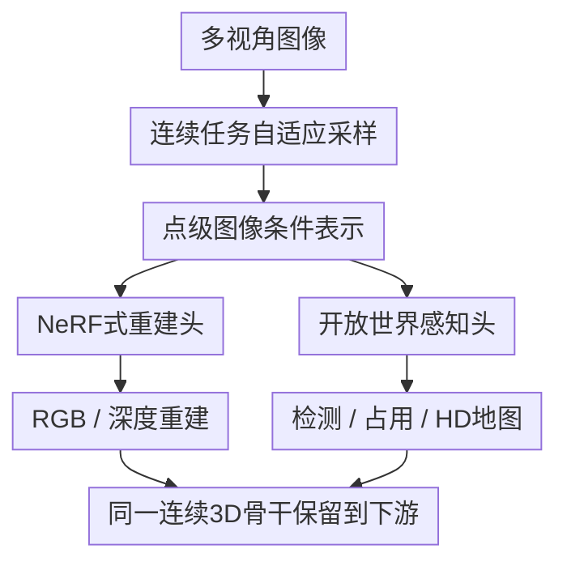

# To View Transform or Not to View Transform: NeRF-based Pre-training Perspective

**会议**: ICLR2026  
**OpenReview**: [https://openreview.net/forum?id=G0HcRB3s3N](https://openreview.net/forum?id=G0HcRB3s3N)  
**代码**: 暂无公开代码  
**领域**: 自动驾驶 / 3D感知 / NeRF预训练  
**关键词**: NeRF预训练, 视角变换, 3D目标检测, 占用预测, 连续点表示  

## 一句话总结
NeRP3D 认为把 NeRF 预训练硬接到离散 BEV/voxel 视角变换骨干上会破坏连续辐射场的优势，因此直接用 NeRF-like 的连续点查询来统一重建预训练和自动驾驶 3D感知，在 nuScenes 的重建、检测、占用预测和 HD 地图任务上都超过已有 NeRF 预训练方法。

## 研究背景与动机
**领域现状**：视觉中心自动驾驶里的主流 3D感知框架，通常先从多相机图像提取 2D 特征，再通过 view transformation 把这些特征投到统一的 BEV 或 voxel 空间。这样做的好处很直接：检测、占用预测、HD 地图构建等下游任务都能在一个度量 3D 画布上工作，工程接口也比较成熟。

**现有痛点**：近年的 UniPAD、SelfOcc 等工作把 NeRF 或 3D Gaussian 这类神经场引入预训练，希望用 RGB、深度、多视角一致性这类自监督信号增强 3D 表示。但它们通常仍然先做 view transformation，再从离散体素特征里插值得到 NeRF 查询点的特征。问题是，NeRF 本来依赖连续坐标处的自适应函数，而 view transformation 给它喂的是固定网格上的离散、刚性表示；结果往往是重建图像发糊、深度边界不清、相邻目标在 3D 表示里粘成一团。

**核心矛盾**：这篇论文抓住的矛盾不是“要不要 NeRF 预训练”，而是“NeRF 预训练应该附着在哪种 3D 骨干上”。如果骨干本身已经把空间离散化成固定 voxel，再让 NeRF 去补连续几何，二者先验互相打架；更糟的是，很多方法预训练时用 NeRF，微调下游任务时又把 NeRF 网络丢掉，等于花了预训练成本却没有把连续表示的能力完整迁移到检测和占用任务里。

**本文目标**：作者希望构建一个不依赖 view transformation 的自动驾驶 3D 骨干，使它在预训练阶段像 NeRF 一样沿光线做体渲染，在下游阶段又能像 3D 感知模型一样覆盖车辆周围空间，并且两阶段共享同一套连续点表示和网络参数。

**切入角度**：关键观察是，自动驾驶 3D 感知并不一定必须先生成 BEV/voxel 特征图。只要模型能在任意 3D 坐标处从多视角图像中取到局部相关的 2D 上下文，并输出该点的几何、外观或语义表示，那么 ray-wise sampling 和 spatial sampling 就可以只是“采样策略”的不同，而不是两套互不兼容的表示系统。

**核心 idea**：用 NeRF-resembled point-based 3D detector 取代“view transform + NeRF 预训练”的组合，让同一个连续点表示同时服务于 RGB/深度重建和 3D 检测、占用、地图等下游任务。

## 方法详解
### 整体框架
NeRP3D 的输入是单时刻多相机图像，输出可以是渲染用的 RGB/深度，也可以是检测、占用预测、HD 地图构建等感知头需要的 3D 表示。它不先构造离散 BEV 或 voxel 特征，而是在 3D 空间中直接采样点：预训练时沿相机光线采样，微调时在车辆周围空间均匀采样；无论采样方式如何，每个 3D 点都通过同一个坐标编码和 deformable cross-attention 从多视角 2D 特征中聚合上下文，再送入渲染头或下游感知头。

这张图里的核心是“先采样连续点，再为点取图像条件特征”。与传统 pipeline 相比，NeRP3D 没有“先 view transform 成 voxel，再从 voxel 插值给 NeRF”的环节，所以预训练时学到的点级几何与外观表示不会在下游阶段被丢弃。

### 关键设计
**1. 连续任务自适应采样：把预训练和下游差异收敛为采样方式差异**

传统 view transformation 方法把 3D 空间先切成固定网格，这会把距离、分辨率、传感器布局这些工程设定写死到表示里。NeRP3D 反过来先承认不同任务确实需要不同查询点：做体渲染时，点应该沿相机 ray 分布，形式为 $x_{ij}=o_i+t_jd_i$；做 3D检测或占用预测时，点应该覆盖车辆周围的空间体积。二者看起来差别很大，但在 NeRP3D 里都只是从连续空间 $x\in R^3$ 取点，后续表示网络完全共享。

为了处理自动驾驶里的开放空间，作者还对归一化坐标 $x'$ 做类似 Mip-NeRF 360 的 contraction。近处区域保持真实尺度，远处区域按视差方式压缩：$p(x')=\alpha x'$ 当 $|x'|\leq 1$，而远处点沿方向归一化后被压进有限范围。这样做的意义是，模型既能在车周围的 ROI 内保留度量几何，又不会让无界背景把表示空间拉爆。

**2. 点级图像条件表示：用 deformable cross-attention 替代体素插值**

如果直接把 3D 点投影到图像上取单个像素特征，动态场景、遮挡和投影误差都会让点表示不稳定；如果先构造 voxel 再插值，又回到了 view transformation 的离散先验。NeRP3D 的折中是让每个 3D 查询点先经过坐标编码 $\gamma(p(x'))$，再在其投影位置 $\pi(x)$ 周围学习若干偏移 $\Delta\pi$，用 deformable cross-attention 从多视角 2D 特征 $F$ 中取局部相关上下文。

论文把点表示写成多头、多采样点的加权聚合：$z=\sum_h W_h\sum_s A_{h,s}W'_sF(\pi(x)+\Delta\pi_{h,s}(\gamma(p(x'))))$。直观地说，每个 3D 点不是被迫相信某个固定 voxel，而是根据自己的空间位置，在对应图像区域附近主动找证据。这个 locality inductive bias 对自动驾驶尤其重要，因为相邻车辆、行人、杆状物的边界很细，粗糙插值很容易把它们揉在一起。

**3. NeRF式重建头：用 SDF、RGB、深度和多视角一致性强化几何边界**

预训练阶段，NeRP3D 沿每条相机 ray 采样多个点，并从点表示 $z_j$ 预测 RGB 颜色 $c_j$ 和 SDF 值 $s_j$。SDF 再通过 NeuS 风格的转换得到 opacity $\alpha_j$，并用透射率 $T_j$ 得到体渲染权重 $w_j=T_j\alpha_j$。最终颜色和深度分别是 $\hat{C}(r_i)=\sum_j w_jc_j$ 与 $\hat{D}(r_i)=\sum_j w_jt_j$。

这里的重点不是单纯“加一个 NeRF loss”，而是 SDF 先验让物体表面和边界更清楚，RGB 重建让外观可解释，LiDAR 深度监督提供稀疏但可靠的几何锚点，多视角 reprojection loss 又补上 LiDAR 扫描稀疏、天空和透明表面难覆盖的问题。相比只靠体素特征插值的 NeRF 预训练，这个设计更接近 NeRF 原本的连续几何学习方式。

**4. 开放世界感知头：预训练网络不丢弃，连续表示直接接入检测、占用和地图任务**

很多 NeRF-based pre-training 方法的尴尬点是，预训练时为了渲染加了 NeRF 网络，微调检测时又把它删掉，只留下被预训练过的 backbone。NeRP3D 的结构更一致：下游任务只需要把空间点散布到目标区域，把每个点的表示 $z$ reshape 成任务头能消费的形状，例如占用预测可整理为 $(X\times Y\times Z)\times C$，检测和 HD 地图则接入对应的 head。

这使得预训练学到的几何和外观知识不会变成一次性的辅助损失，而是作为同一连续点骨干的一部分延续到下游任务。论文的跨任务分析也服务于这个论点：即使用占用预测微调后的 backbone 再去做体渲染，NeRP3D 仍能保留结构细节，而 view-transformation 方法更容易出现 catastrophic forgetting，退化成模糊的平均预测。

### 一个完整示例
以 nuScenes 的一帧六相机图像为例，预训练时 NeRP3D 会先从每个像素发出一条相机 ray，在 $0$ 到远处深度范围内采样一串 3D 点。某条 ray 穿过路边行人和背景建筑时，模型不会先查一个固定 voxel 网格，而是对每个采样点执行坐标 contraction、位置编码、投影到多个相机视图，再用 deformable attention 在投影点附近取图像特征。随后渲染头给每个点预测颜色和 SDF，体渲染权重会让真正接近表面的点贡献更大，最终合成该像素的 RGB 和深度。

同一套权重进入下游检测时，采样方式变成覆盖车辆周围空间，例如在 $[-51.2m,51.2m]$ 的检测范围内散布点。每个点仍然按同样方式从多视角图像取特征，得到的连续 3D 表示再交给检测 head。也就是说，预训练时学会“哪里有清晰表面、哪里是物体边界、哪里外观一致”的能力，并不是通过一个被丢弃的 NeRF 模块间接影响 backbone，而是直接进入检测、占用和地图构建的空间表示。

### 损失函数 / 训练策略
预训练损失由 RGB 重建、LiDAR 深度监督和多视角一致性三部分组成：$L_{pretrain}=\lambda_{rgb}L_{rgb}+\lambda_{depth}L_{depth}+\lambda_{reproj}L_{reproj}$。其中 $L_{rgb}$ 比较渲染颜色与真实像素颜色，$L_{depth}$ 在 LiDAR 可投影处约束预测深度，$L_{reproj}$ 把当前视角 ray 上的 3D 点投影到相邻源图像，并用渲染权重加权比较颜色差异。

实现上，作者基于 MMDetection3D，在 4 张 NVIDIA A6000 上训练。预训练和微调均为 24 个 epoch，优化器为 AdamW，初始学习率 $2e-4$，weight decay 为 $0.01$；三个预训练损失权重设为 $\lambda_{rgb}=\lambda_{depth}=\lambda_{reproj}=10$。下游任务采用已有任务头以保持公平比较：3D 检测基于 UVTR-C，HD 地图基于 MapTR，占用预测基于 Occ3D/CTF-Occ，并且不使用 temporal stacking 或 class-balanced sampling 等额外增强。

## 实验关键数据

### 主实验
论文主要在 nuScenes 上评估两类能力：一类是预训练本身的 RGB/深度重建质量，另一类是下游 3D 感知任务。下表摘出最能说明问题的结果：NeRP3D 不仅在重建指标上大幅超过 UniPAD 和 SelfOcc，也在检测、占用和 HD 地图上持续领先。

| 任务 | 指标 | NeRP3D | 主要对比方法 | 提升 |
|------|------|--------|--------------|------|
| RGB重建 | PSNR↑ / SSIM↑ / LPIPS↓ | 33.42 / 0.969 / 0.070 | UniPAD: 21.14 / 0.549 / 0.634 | PSNR +12.28，LPIPS -0.564 |
| 深度估计 | Abs Rel↓ / Sq Rel↓ / RMSE↓ | 0.183 / 2.274 / 7.884 | UniPAD: 0.218 / 2.512 / 7.937 | Abs Rel -0.035 |
| 3D目标检测 | NDS↑ / mAP↑ | 47.3 / 42.8 | UVTR-C + UniPAD: 45.5 / 41.6 | NDS +1.8，mAP +1.2 |
| 占用预测 | mIoU↑ | 35.49 | UniPAD: 34.05；SelfOcc: 29.65 | +1.44 / +5.84 |
| HD地图构建 | mAP↑ | 59.1 | UVTR-C + UniPAD: 57.8；TPVFormer + SelfOcc: 53.9 | +1.3 / +5.2 |

跨数据集泛化也很关键。作者用 Argoverse 2 预训练，再直接在 nuScenes 上做 zero-shot scene reconstruction，测试连续点表示是否比固定 view transformation 更抗传感器布局和数据分布变化。

| 设置 | 指标 | NeRP3D | UniPAD | 说明 |
|------|------|--------|--------|------|
| AV2 → nuScenes 零样本重建 | Abs Rel↓ | 0.626 | 0.985 | NeRP3D 深度误差更低 |
| AV2 → nuScenes 零样本重建 | PSNR↑ | 28.238 | 18.668 | 连续表示对新相机几何更稳 |
| AV2 → nuScenes 零样本重建 | SSIM↑ / LPIPS↓ | 0.905 / 0.111 | 0.432 / 0.577 | 结构和感知质量差距明显 |
| AV2 预训练 → nuScenes 检测微调 | mAP↑ | 27.46 | 26.29 | 迁移到检测仍领先 |

### 消融实验
正文对消融的数字主要放在附录，缓存文本保留了作者总结的关键结论。下面按实验问题整理其有效性证据，重点看每个设计是否支撑“连续点骨干比 view transformation 更适合 NeRF 预训练”这一主张。

| 消融 / 分析问题 | 观察到的现象 | 说明 |
|-----------------|--------------|------|
| 跨任务泛化 | 用占用预测微调后的 NeRP3D backbone 再做体渲染仍保留结构细节 | 连续表示没有被单一下游任务完全冲掉 |
| 修改 voxel/range 相关设置 | view transformation 对范围和 voxel size 敏感，NeRP3D 只需改变关注区域 | 连续点查询减少了固定网格先验依赖 |
| 减少标注数据 | 从全量到 $1/8$ 子集时，NeRP3D 仍保持较强检测表现 | NeRF 预训练带来的几何先验能降低标注依赖 |
| 只靠 LiDAR 深度监督 | LiDAR 稀疏扫描不足以恢复稠密几何 | 多视角一致性和 ray-wise sampling 是必要补充 |
| 直接给已有点检测器加 NeRF 预训练 | 知识迁移失败，作者归因于 query mismatch | 统一预训练/下游查询体系比简单外挂 NeRF 更重要 |
| SDF vs density prior | SDF 更利于清晰物体边界 | 感知任务需要边界，而不只是可渲染颜色 |
| deformable attention vs standard attention | deformable attention 更好 | 局部图像证据对点表示保真很关键 |

### 关键发现
- NeRF 预训练真正的收益不只来自额外的 RGB/depth loss，而来自预训练模型和下游 3D 骨干是否共享同一种表示先验；NeRP3D 在这一点上比“view transform 后接 NeRF”更一致。
- RGB 重建差距非常大，PSNR 从 UniPAD 的 21.14 提到 33.42，说明离散体素插值确实会显著损伤高频外观和边界细节。
- 下游提升虽然没有重建指标那么夸张，但覆盖 3D检测、占用预测、HD地图三个任务，说明连续点表示不是只会“渲染好看”，而是能转化为实际驾驶感知收益。
- 跨数据集 AV2 → nuScenes 的 zero-shot 重建结果很有说服力，因为 sensor layout 变化正是固定 view transformation 容易过拟合的地方；NeRP3D 的 PSNR 仍有 28.238，显示它的坐标连续性和点查询机制更可迁移。
- qualitative 结果里，UniPAD 和 SelfOcc 容易把密集人群、杆状物、车边界重建成模糊块，而 NeRP3D 的特征投影后能让 SAM 分割出更清楚的实例边界，这和论文提出的“连续细粒度表示”逻辑一致。

## 亮点与洞察
- 这篇论文最有价值的地方是把问题从“NeRF 预训练有没有用”推进到“什么样的 3D 骨干适合承接 NeRF 预训练”。这个视角能解释为什么一些已有方法重建能学到一点东西，但下游收益有限，因为预训练网络和下游表示之间存在结构断裂。
- NeRP3D 的设计很克制：它没有发明复杂的新任务，而是把 ray-wise sampling 和 spatial sampling 放进同一个连续点表示框架。这个统一性让方法更像一个 3D backbone，而不是一个只在预训练阶段临时存在的 auxiliary module。
- SDF prior 用在自动驾驶预训练里很自然但容易被忽略。对检测、占用和地图来说，边界清楚比纹理漂亮更重要；SDF 帮助模型形成表面感，进而改善相邻物体分离和细结构恢复。
- deformable cross-attention 是一个实用选择。它避免了 voxel 插值的僵硬，又没有让每个 3D 点对整张图做无约束 attention，因此在动态驾驶场景里保持了局部几何的一致性。
- 从迁移角度看，连续点表示可能比固定 BEV 网格更适合跨数据集、跨相机布局的预训练。未来如果自动驾驶模型要用多来源数据做 foundation-style pretraining，这类表示会比强依赖特定 grid 的方法更有扩展空间。

## 局限与展望
- 作者承认 NeRP3D 在 ROI 之外的深度估计仍然困难，并且对 LiDAR 深度监督有依赖。也就是说，它还不是完全从多视角 RGB 自监督恢复开放驾驶世界的方案。
- 点式架构的计算成本较高，尤其是要把 NeRF 风格输出适配到现有检测 head 时，会带来额外开销。对于实时自动驾驶部署，这一点比离线重建指标更敏感。
- 实验主要围绕单时刻多相机图像，没有利用 temporal information。驾驶场景天然有时序一致性，若加入 temporal RGB reconstruction 或跨帧点跟踪，可能进一步缓解遮挡和远距离深度不稳定。
- 方法仍然借用了现有检测、地图、占用 head。虽然这保证了公平比较，但也意味着下游 head 可能并不是连续点表示的最优消费者；未来可以设计更原生的 point/radiance-field-aware perception head。
- Gaussian splatting 或 opacity filtering 是作者提到的潜在方向。前者可能提高实时渲染和查询效率，后者可以减少无效点计算，让连续点表示更接近可部署系统。

## 相关工作与启发
- **vs UniPAD**: UniPAD 也是自动驾驶 NeRF-based pre-training 的代表方法，但它把 NeRF 接在 view-transformed 体素特征之后，预训练时增强 backbone、下游时丢弃 NeRF。NeRP3D 的区别是从表示层面绕开 view transformation，并保留同一套连续点网络到下游任务，因此重建质量和感知迁移都更强。
- **vs SelfOcc / OccNeRF**: SelfOcc 和相关 occupancy 预训练方法强调用多视角一致性、NeRF-style rendering 来学习占用或 3D 表示，但通常仍和离散 occupancy/voxel 结构绑定。NeRP3D 的启发是，occupancy 可以是下游任务输出，而不必是预训练表示的基本形态。
- **vs GaussianPretrain**: GaussianPretrain 探索用 3D Gaussian 表示做自动驾驶预训练，和本文一样关注可渲染 3D 表示对感知的帮助。不同在于 NeRP3D 更强调连续点查询和 NeRF-like backbone 的统一，而不是把高斯作为主要 3D 表示单元。
- **vs PETR / BEVFormer / UVTR-C 等多视角 3D检测**: 这些方法主要解决如何从多相机图像构建下游检测表示，通常依赖位置编码、BEV 查询或 voxel/BEV 特征。NeRP3D 可以看成对这一路线的补充：它不是只优化 detection head，而是用自监督重建先把 3D 点表示学得更几何化。
- **对后续工作的启发**: 如果一个预训练任务的中间模块在下游会被丢弃，那它带来的知识迁移很可能打折。更好的预训练设计应让 pretext task 和 downstream task 共享同一种表示对象，这篇论文把这个原则落在了 NeRF 预训练和自动驾驶 3D 感知上。

## 评分
- 新颖性: ⭐⭐⭐⭐☆ 把 NeRF 预训练与 view transformation 的先验冲突讲得很清楚，并提出连续点骨干统一两阶段，问题定义有新意。
- 实验充分度: ⭐⭐⭐⭐☆ 覆盖重建、检测、占用、HD地图和跨数据集迁移，证据链完整；但详细消融数字主要在附录，正文可复现细节还可以更集中。
- 写作质量: ⭐⭐⭐⭐☆ 动机和图示清楚，Fig. 1/2 很好地展示了模糊表示问题；部分方法公式较密，对非 NeRF 读者需要慢读。
- 价值: ⭐⭐⭐⭐☆ 对自动驾驶 3D 预训练很有参考价值，尤其提醒大家不要把连续 neural field 简单外挂到离散 BEV 管线里。

<!-- RELATED:START -->

## 相关论文

- [\[CVPR 2026\] CycleBEV: Regularizing View Transformation Networks via View Cycle Consistency for Bird's-Eye-View Semantic Segmentation](../../CVPR2026/autonomous_driving/cyclebev_regularizing_view_transformation_networks_via_view_cycle_consistency_fo.md)
- [\[CVPR 2025\] VisionPAD: A Vision-Centric Pre-training Paradigm for Autonomous Driving](../../CVPR2025/autonomous_driving/visionpad_a_vision-centric_pre-training_paradigm_for_autonomous_driving.md)
- [\[ICLR 2026\] ARINBEV: Bird's-Eye View Layout Estimation with Conditional Autoregressive Model](arinbev_birds-eye_view_layout_estimation_with_conditional_autoregressive_model.md)
- [\[CVPR 2026\] DLWM: Dual Latent World Models enable Holistic Gaussian-centric Pre-training in Autonomous Driving](../../CVPR2026/autonomous_driving/dlwm_dual_latent_world_models_enable_holistic_gaussian-centric_pre-training_in_a.md)
- [\[ICLR 2026\] Bird's-eye-view Informed Reasoning Driver (BIRDriver)](birds-eye-view_informed_reasoning_driver.md)

<!-- RELATED:END -->
