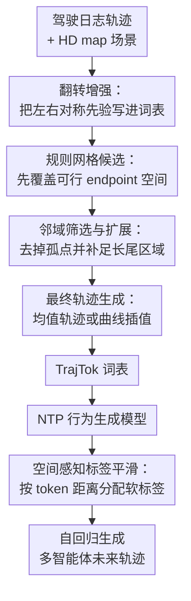

# TrajTok: What makes for a good trajectory tokenizer in behavior generation?

**会议**: ICLR 2026  
**OpenReview**: [https://openreview.net/forum?id=Zvy2agYouY](https://openreview.net/forum?id=Zvy2agYouY)  
**论文**: [OpenReview](https://openreview.net/forum?id=Zvy2agYouY)  
**代码**: https://github.com/Thinklab-SJTU/TrajTok  
**领域**: 自动驾驶 / 行为生成  
**关键词**: 轨迹 tokenizer、行为生成、next-token prediction、Waymo Open Sim Agents、空间感知标签平滑  

## 一句话总结
TrajTok 系统分析了自动驾驶行为生成中轨迹 tokenizer 的覆盖率、利用率、对称性和鲁棒性，并用“规则候选 + 数据驱动筛选扩展 + 空间感知标签平滑”构造更适合 next-token prediction 的轨迹词表，在 Waymo Open Sim Agents Challenge 2025 中取得第一名。

## 研究背景与动机
**领域现状**：自动驾驶仿真里的 behavior generation 需要从真实驾驶日志中生成未来多智能体轨迹，用来构造评测场景、训练闭环策略，或者作为强化学习环境。近几年一类主流路线把连续轨迹离散成有限词表，再像语言模型一样做 next-token prediction：模型每隔一小段时间为每个 agent 预测一个轨迹 token，随后把 token 还原成未来若干帧位置和朝向。

**现有痛点**：这条路线的关键瓶颈其实不只在 Transformer 本身，而在“轨迹应该怎样被切成 token”。如果用 VQ-VAE、K-means、K-disks 这类数据驱动 tokenizer，词表往往集中在训练日志中出现过的高频区域，利用率高，但长尾动作覆盖不足，且容易把噪声轨迹或采样偏差吸进词表。如果用纯规则 gridding，词表能覆盖更宽的物理空间，也天然更稳定，但大量网格对应现实中几乎不会出现的动作，在固定词表规模下会浪费模型容量。

**核心矛盾**：一个好的轨迹词表不能只追求平均离散误差低。自动驾驶行为生成更看重闭环滚动时是否有足够多的可行备选动作，尤其是转弯、让行、非典型路口和少见交互这类长尾情况。词表必须同时满足覆盖真实可驾驶空间、让大多数 token 被训练数据用到、保持左右对称的运动先验，并且对日志里的异常轨迹不敏感。

**本文目标**：作者把问题拆成两个层面：先回答“什么样的 trajectory tokenizer 会让 NTP 行为生成模型表现更好”，再基于这些观察设计一个可插拔的 tokenizer 和配套 loss。前者对应覆盖率、利用率、对称性、鲁棒性的分析；后者对应 TrajTok 词表生成流程和 spatial-aware label smoothing。

**切入角度**：论文不是把 tokenizer 当成单纯的聚类或量化问题，而是从 logged data usage 出发比较“数据驱动”和“规则驱动”到底各自把数据用到了什么程度。这个角度很有价值，因为行为生成的 token 不只是压缩表示，它直接决定模型每一步能选哪些动作；词表的几何性质会被 autoregressive rollout 放大。

**核心 idea**：TrajTok 用规则网格先给出稳定、对称、物理上宽覆盖的候选空间，再用真实日志统计做筛选、去噪和扩展，最后用空间距离重分配标签平滑概率，让离真实轨迹更近的错误 token 少受惩罚、离得远的 token 继续被压低。

## 方法详解

### 整体框架
TrajTok 面向离散 next-token-prediction 行为生成模型。给定历史 agent 状态和 HD map，基础模型每 $L$ 帧预测一次每个 agent 的未来轨迹 token；每个 token 是 agent-centric 坐标系下长度为 $L$ 的 $(x,y,yaw)$ 序列，然后通过坐标变换滚动到下一段状态。

方法整体分两块：第一块生成轨迹词表，第二块在训练 NTP 模型时用空间感知标签平滑替代标准 label smoothing。词表生成本身遵循“先规则后数据”的顺序：抽取并翻转真实轨迹，建立 endpoint 网格候选，根据日志落点做初筛，再用邻域统计过滤孤立噪声和扩展长尾空洞，最后把被选中的网格变成真实平均轨迹或插值轨迹。

### 关键设计
**1. 翻转增强：把左右对称先验写进词表**

数据驱动 tokenizer 的一个隐性问题是训练日志本身不一定左右均衡：某些道路结构、采样片段或城市驾驶习惯会让左/右转、横向偏移的出现频率不同。若直接聚类或采样，词表会继承这种不对称，模型在没见过但物理上可行的镜像场景里更容易缺动作可选。

TrajTok 在生成词表前先把所有长度为 $L$ 的有效轨迹归一化到 agent-centric 坐标系，得到 $D \in \mathbb{R}^{N_D \times L \times 3}$，再沿 $x$ 轴翻转并与原数据拼接：$\tilde{D}=\mathrm{Concat}(D,\mathrm{Flip}(D))$。这里的翻转不是普通数据增强那么简单，它直接作用在 tokenizer 的词表构建阶段，所以最终 vocabulary 会包含成对的镜像轨迹。论文的对称性消融也验证了这一点：TrajTok 去掉 symmetry 后 Realism Meta 从 0.7702 降到 0.7670，minADE 从 1.3428 变差到 1.3611。

**2. 规则网格候选：先覆盖可行 endpoint 空间**

纯数据驱动方法的问题不是“没有贴近数据”，而是太贴近日志中已经发生的轨迹，导致长尾动作被压掉。TrajTok 先在 endpoint 平面上建立规则网格：给定 $x_{min},x_{max},y_{min},y_{max}$ 以及网格间隔 $x_{interval},y_{interval}$，每条翻转后的轨迹根据终点落入某个 cell。若 cell $(i,j)$ 中轨迹数 $N^{traj}_{ij}$ 不低于阈值 $s_p$，就把它标为初步有效：$B_{ij}=\mathbb{1}[N^{traj}_{ij}\ge s_p]$。

这个设计的关键在于先用规则空间定义“可能被考虑的动作边界”，而不是让聚类中心完全由训练分布决定。对车辆、骑行者、行人，论文分别设置不同的网格范围与分辨率；提交版本中车辆词表最终达到 8040 个 token，骑行者 2798 个，行人 3001 个。这样做保留了规则方法的稳定边界，同时还没有立刻把所有规则网格都放进词表，避免纯 gridding 的低利用率问题。

**3. 邻域筛选与扩展：去掉孤点并补足长尾区域**

只用落点频次初筛仍然会留下两个问题：日志噪声可能让孤立 cell 被选中，而真实可驾驶但低频的相邻区域又可能因为样本数不够被漏掉。TrajTok 用一个简单但很贴合轨迹几何的邻域规则修正初筛图。对每个 cell，计算距离 $k$ 范围内已选邻居数 $N^{vb}_{ij}=\sum_{m=i-k}^{i+k}\sum_{n=j-k}^{j+k}B_{mn}$；若一个未选 cell 的邻居数超过阈值 $s_a$，就把它补进来；若一个已选 cell 的邻居数低于阈值 $s_r$，就把它删掉。

这一步把 coverage、utilization 和 robustness 放在同一个局部统计里平衡。孤立噪声通常缺少周围支持，会被删掉；长尾可行轨迹附近往往有连续的真实落点结构，即使某个 cell 本身没有足够样本，也会因为邻域密度被扩展进词表。附录敏感性分析显示，默认 $k=4,s_p=1,s_a=20,s_r=20$ 取得 0.7702 Realism Meta，替换成 $k=3,s_a=8,s_r=10$ 或提高 $s_p$ 后只小幅下降，说明这套规则不是只靠精细调参偶然奏效。

**4. 最终轨迹生成与空间感知标签平滑：让 token 的几何距离进入训练目标**

当某个被选中 cell 中有真实轨迹时，TrajTok 用该 cell 内日志轨迹的平均值作为 token；当 cell 是通过扩展补入、没有直接轨迹样本时，则从原点到 cell 中心做曲线插值，并从附近网格估计 endpoint yaw。于是最终词表 $V_{TrajTok}=V_1\cup V_2$ 同时包含数据支撑的平均轨迹和补覆盖的插值轨迹，避免“有网格但没有可执行轨迹”的断层。

训练阶段，论文进一步指出标准 label smoothing 对所有非真值 token 分配相同概率，这不符合轨迹 token 的空间语义：预测到真值旁边的轨迹和预测到远处反向轨迹，错误性质显然不同。TrajTok 对非真值 token 按平均轨迹误差的倒数平方分配概率，令 $k_i=1/\lVert c_i-c_j\rVert^2$，真值 token 概率为 $1-\epsilon$，其他 token 概率为 $y_i=\epsilon k_i / \sum_{m\ne j}k_m$。这样模型在训练中会更宽容空间上接近真值的 token，同时仍然强烈惩罚远离真实动作的 token；论文中 $\epsilon=0.1$，与原 SMART 使用的标准平滑总量一致。

### 一个完整示例
设一个车辆当前位于路口右转车道，模型每 0.5 秒预测一次未来 5 个 10Hz 轨迹点。若使用 K-disks，词表由日志采样得到，某些右转曲率或横向偏移 token 可能没有覆盖到；模型滚动生成时只能从少量相近但转向不足的 token 中选择，车辆就可能逐步贴近道路边界甚至越界。

TrajTok 的处理路径更像先给动作空间搭一张规则地图，再用日志把地图修成“现实中常用但不过窄”的版本。这个右转 endpoint 附近若有足够多真实落点，会直接产生平均轨迹 token；若某个低频右转 cell 本身样本不多，但周围连续 cell 都被选中，它会被邻域扩展补上并通过曲线插值得到轨迹。训练时如果模型把真值右转 token 预测成旁边一个曲率略小的 token，空间感知标签平滑会认为这是相对接近的错误；如果预测成直行或反向横移 token，则仍被明显惩罚。论文附录的右转可视化正是这个现象：K-disks 因覆盖不足导致车辆碰到路沿，而 TrajTok 提供了更丰富的可行转弯选择。

### 损失函数 / 训练策略
实验使用 SMART-tiny 作为基础 NTP 行为生成模型。模型历史输入为过去 1 秒状态和地图，未来生成 8 秒状态；轨迹 token 间隔 $L=5$，即每 0.5 秒重规划一次。相比原 SMART，作者为不同 agent 类型使用独立预测头，使输出维度分别匹配车辆、骑行者、行人的词表大小。

训练在 WOMD 上进行，使用 8 张 A100 80GB，AdamW 优化器，总 batch size 为 48，训练 32 个 epoch。初始学习率为 $5\times 10^{-4}$，用 cosine annealing 衰减到 $5\times 10^{-6}$。空间感知标签平滑没有显著增加成本：20% 训练集上单 epoch 从标准平滑的 18m25s 变为 18m34s。

## 实验关键数据

### 主实验
论文首先在 Waymo Open Sim Agents Challenge 2025 leaderboard 上报告提交结果。TrajTok 的 Realism Meta 为 0.7852，在提交期获得第一名；虽然 SMART-R1 的表格分数 0.7855 略高，论文说明 TrajTok 是比赛 winner，并且在 Map-based 指标上达到表中最高的 0.9207。

| 方法 | Realism Meta ↑ | Kinematic ↑ | Interactive ↑ | Map-based ↑ | minADE ↓ |
|------|----------------|-------------|---------------|-------------|----------|
| SMART-R1 | 0.7855 | 0.4940 | 0.8109 | 0.9194 | 1.2990 |
| TrajTok (Ours) | 0.7852 | 0.4887 | 0.8116 | 0.9207 | 1.3179 |
| unimotion | 0.7851 | 0.4943 | 0.8105 | 0.9187 | 1.3036 |
| SMART-tiny-CLSFT | 0.7846 | 0.4931 | 0.8106 | 0.9177 | 1.3065 |
| SMART-tiny-RLFTSim | 0.7844 | 0.4893 | 0.8128 | 0.9164 | 1.3470 |

更能说明 tokenizer 价值的是在同一个 SMART 模型上替换不同轨迹 tokenizer。所有模型在 WOMD 20% 随机训练子集上训练，并在完整 validation split 上评测。TrajTok 的 Realism Meta 达到 0.7702，高于 VQ-VAE、K-means、K-disks 和 Grid；同时 minADE 也最低。

| Tokenizer | Realism Meta ↑ | Kinematic ↑ | Interactive ↑ | Map-based ↑ | minADE ↓ |
|-----------|----------------|-------------|---------------|-------------|----------|
| VQ-VAE | 0.7596 | 0.4629 | 0.8101 | 0.8642 | 1.3982 |
| K-means | 0.7476 | 0.4375 | 0.7903 | 0.8635 | 1.4797 |
| K-disks | 0.7584 | 0.4602 | 0.8004 | 0.8748 | 1.3532 |
| Grid | 0.7527 | 0.4121 | 0.8099 | 0.8737 | 1.4137 |
| TrajTok | 0.7702 | 0.4867 | 0.8132 | 0.8769 | 1.3428 |

### 消融实验
泛化实验显示 TrajTok 对 logged data 的来源和规模都更稳。用 nuScenes 构建词表、再在 WOMD 上训练评测时，K-disks 的 Realism Meta 从 0.7584 掉到 0.7350，下降 0.0234；TrajTok 只从 0.7702 掉到 0.7641，下降 0.0061。用更小规模 WOMD 日志构建词表时也类似，TrajTok 从 $10^7$ 到 $10^5$ 轨迹只下降 0.0027，而 K-disks 下降 0.0142。

| Tokenizer | Logged Dataset / Size | Realism Meta ↑ | minADE ↓ | 说明 |
|-----------|-----------------------|----------------|----------|------|
| K-disks | Waymo | 0.7584 | 1.3537 | 同域词表 |
| K-disks | nuScenes | 0.7350 | 1.4074 | 跨数据集下降 0.0234 |
| TrajTok | Waymo | 0.7702 | 1.3428 | 同域词表 |
| TrajTok | nuScenes | 0.7641 | 1.3681 | 跨数据集只下降 0.0061 |
| K-disks | $10^5$ WOMD trajectories | 0.7442 | 1.3696 | 小数据时明显退化 |
| TrajTok | $10^5$ WOMD trajectories | 0.7675 | 1.3511 | 小数据下仍接近完整设置 |

空间感知标签平滑对 K-disks 和 TrajTok 都有效。K-disks 从默认 label smoothing 的 0.7443 提升到 0.7584；TrajTok 从 0.7597 提升到 0.7702，说明这个 loss 设计不是只服务于 TrajTok 词表，而是利用了轨迹 token 普遍存在的空间相似性。

| Tokenizer | Label Smoothing Type | Realism Meta ↑ | minADE ↓ |
|-----------|----------------------|----------------|----------|
| K-disks | default | 0.7443 | 1.4230 |
| K-disks | spatial-aware | 0.7584 | 1.3537 |
| TrajTok | default | 0.7597 | 1.3797 |
| TrajTok | spatial-aware | 0.7702 | 1.3428 |

对称性和离散误差分析也很关键。加入 symmetry 后，K-disks、K-means、TrajTok 的 Realism Meta 都提升；但平均离散误差并不能直接预测最终行为生成质量，K-disks 的平均 discretization error 为 0.0204m，低于 TrajTok 的 0.0520m，却在 Realism Meta 上落后。这说明只压低平均误差会偏向高频区域，不能反映长尾覆盖和闭环生成质量。

| 分析项 | 配置 | Realism Meta ↑ | minADE / Error ↓ | 结论 |
|--------|------|----------------|------------------|------|
| 对称性 | TrajTok w/ symmetry | 0.7702 | minADE 1.3428 | 翻转增强最好 |
| 对称性 | TrajTok w/o symmetry | 0.7670 | minADE 1.3611 | 去掉对称性明显退化 |
| 离散误差 | K-disks | 0.7584 | error 0.0204m | 平均误差低但生成较差 |
| 离散误差 | TrajTok | 0.7702 | error 0.0520m | 覆盖/鲁棒性更重要 |

### 关键发现
- TrajTok 的核心收益来自对 coverage 和 utilization 的重新平衡：相比纯规则 gridding，它不会浪费大量零频 token；相比数据驱动聚类/采样，它能补上现实中可行但日志稀疏的长尾动作。
- symmetry 不是可有可无的增强，而是行为生成里的物理先验。车辆动力学和道路交互天然允许许多镜像动作，日志没记录到不代表现实不可行。
- spatial-aware label smoothing 的提升很稳定，因为它让分类损失看见轨迹 token 之间的几何距离，避免把“预测到相邻轨迹”和“预测到远离真值的轨迹”当成同一种错误。
- 平均 discretization error 不是好 tokenizer 的充分指标。行为生成评测更关心闭环 rollout 中长尾动作、交互动作和地图约束是否能被持续满足。
- 附录显示推理成本随词表规模增长但仍可接受：总词表规模从 2000 到 8000 时，单 A100 上单场景 16-step rollout 从 399ms 增至 441ms。

## 亮点与洞察
- TrajTok 最有价值的地方是把 trajectory tokenization 从“聚类谁更准”转成“词表应具备哪些行为生成性质”。coverage、utilization、symmetry、robustness 这四个维度比单一量化误差更贴近闭环自动驾驶仿真的实际需求。
- 规则与数据的结合很克制：规则只负责给出可解释、稳定的候选空间，数据只负责决定哪些区域值得保留、哪些区域应该扩展或去噪。这比直接把规则 token 和聚类 token 拼接起来更干净。
- 邻域筛选/扩展看起来简单，但抓住了轨迹 endpoint 空间的连续性。真实可驾驶动作通常不是孤立点，而是局部连续区域；噪声轨迹则更可能是缺少邻域支持的离群点。
- 空间感知标签平滑是一个可迁移 trick。只要离散 action/token 之间有明确几何距离，例如机器人末端动作、移动体局部规划、轨迹预测 mode selection，都可以考虑把 token 距离放进软标签分配。
- 论文提醒了一个常见误区：tokenizer 的评价不能只看 reconstruction 或 discretization。对 autoregressive generation 来说，词表的“可选择动作集合”会决定错误是否能在后续步被修正。

## 局限与展望
- TrajTok 仍然依赖日志数据的基本质量。如果某些区域存在大量错误标注或传感器噪声，邻域规则能过滤孤立噪声，但不一定能消除成片的系统性噪声。
- 长尾覆盖仍受数据多样性限制。论文附录也承认，如果 logged dataset 太小或缺少某类罕见行为，TrajTok 可能仍捕捉不到对应 token；规则扩展可以补几何空洞，但不能凭空知道复杂交互语义。
- 当前词表主要按 endpoint 网格构建，轨迹中间形状通过平均或插值决定。对于 endpoint 相似但中途绕行、让行、急停模式不同的情况，单靠 endpoint 可能不够细。
- 实验以 SMART-tiny 和 WOSAC/WOMD 为主，说明 plug-and-play 价值，但还需要在更多 NTP 行为生成架构、闭环规划仿真器和多城市数据上验证。
- 未来可以考虑把动态约束、地图拓扑或交互上下文引入 tokenizer，而不只是基于 agent-centric 轨迹几何构词。比如同一个局部轨迹在车道保持、变道、路口让行中语义不同，context-aware vocabulary 可能进一步提升真实性。

## 相关工作与启发
- **vs K-disks / Trajeglish**: K-disks 从日志轨迹中采样 token 并排除邻近样本，更像数据驱动的覆盖采样。它平均离散误差低，但会继承日志分布偏差和噪声；TrajTok 则先用规则网格保证候选边界，再用邻域统计控制保留和扩展。
- **vs K-means / VQ-VAE**: K-means 和 VQ-VAE 都更强调从数据中压缩出代表性中心，因而在高频动作上利用率较好，但对低频动作和对称泛化不足。TrajTok 不追求最小平均量化误差，而是追求更适合 rollout 的动作集合。
- **vs MotionLM / Grid tokenizer**: 纯 gridding 依赖人工定义的范围和分辨率，覆盖宽但 token 利用率低，很多横向移动或不现实动作占据词表容量。TrajTok 保留 gridding 的规则边界，却用数据频次和邻域结构过滤无用网格。
- **vs SMART / CATK**: SMART 关注可扩展的多智能体 NTP 架构，CATK 进一步做 closed-loop supervised fine-tuning；TrajTok 的贡献更底层，改的是 NTP 模型可选动作词表和分类损失，因此可以与这类架构或训练策略互补。
- **对其他方向的启发**: 对机器人行为生成、轨迹预测和离散动作策略学习而言，tokenizer 不应只是压缩器，也是一种动作先验。若 token 空间本身缺少对称性、长尾覆盖或几何相似性，后面的生成模型很难完全补救。

## 评分
- 新颖性: ⭐⭐⭐⭐ 论文的单个操作都不复杂，但把轨迹 tokenizer 的性质系统化，并用规则+数据的流程落到 WOSAC 强结果上，很有启发性。
- 实验充分度: ⭐⭐⭐⭐⭐ 主榜、同架构 tokenizer 对比、跨数据集泛化、小数据泛化、对称性、标签平滑、词表规模和成本分析都比较完整。
- 写作质量: ⭐⭐⭐⭐ 论文结构清晰，图表支撑充分；少数 leaderboard 表述与表格最高分之间需要读者结合比赛规则理解。
- 价值: ⭐⭐⭐⭐⭐ 对自动驾驶仿真和 NTP 行为生成很实用，也为离散 action/token 设计提供了可迁移的评价框架。

<!-- RELATED:START -->

## 相关论文

- [\[CVPR 2026\] RAG-TP: A General Framework for Vehicle Trajectory Prediction via Retrieval-Augmented Generation](../../CVPR2026/autonomous_driving/rag-tp_a_general_framework_for_vehicle_trajectory_prediction_via_retrieval-augme.md)
- [\[ECCV 2024\] Optimizing Diffusion Models for Joint Trajectory Prediction and Controllable Generation](../../ECCV2024/autonomous_driving/optimizing_diffusion_models_for_joint_trajectory_prediction_and_controllable_gen.md)
- [\[ICML 2025\] DriveGPT: Scaling Autoregressive Behavior Models for Driving](../../ICML2025/autonomous_driving/drivegpt_scaling_autoregressive_behavior_models_for_driving.md)
- [\[ICCV 2025\] Where, What, Why: Towards Explainable Driver Attention Prediction](../../ICCV2025/autonomous_driving/where_what_why_towards_explainable_driver_attention_prediction.md)
- [\[ICLR 2026\] SceneStreamer: Continuous Scenario Generation as Next Token Group Prediction](scenestreamer_continuous_scenario_generation_as_next_token_group_prediction.md)

<!-- RELATED:END -->
