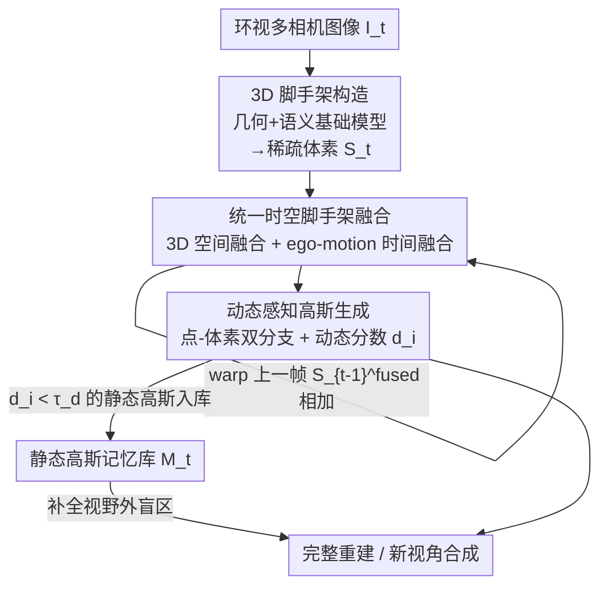

# UniSplat: Unified Spatio-Temporal Fusion via 3D Latent Scaffolds for Dynamic Driving Scene Reconstruction

**会议**: ICLR 2026  
**OpenReview**: [https://openreview.net/forum?id=Ng2VDbKD4r](https://openreview.net/forum?id=Ng2VDbKD4r)  
**论文**: [Project Page](https://chenshi3.github.io/unisplat.github.io/)  
**代码**: https://chenshi3.github.io/unisplat.github.io/ (有，已开源)  
**领域**: 自动驾驶 / 3D视觉  
**关键词**: 前馈式重建, 3D高斯泼溅, 时空融合, 动态场景, 隐式体素脚手架

## 一句话总结
UniSplat 在一个统一的「3D 隐式脚手架」（稀疏体素网格）上同时完成多视角空间融合与多帧时间融合，再用点-体素双分支解码器生成带动态属性的高斯，并维护一份静态高斯记忆库，从而在 Waymo / nuScenes 这类稀疏环视、强动态的驾驶场景下做到前馈式 SOTA 的新视角合成，甚至能补全相机视野之外的盲区。

## 研究背景与动机

**领域现状**：驾驶场景的 3D 重建是仿真、场景理解、长程规划的基础能力。3D 高斯泼溅（3DGS）凭借实时渲染和高保真已成为主流，而为了避免逐场景优化的高成本，前馈式（feed-forward）方法兴起——一次前向就从稀疏图像里解码出高斯基元。这类方法通常在图像域里用 cross-attention 或多视角立体（MVS）代价体融合视角间信息，再解码高斯。

**现有痛点**：驾驶场景有两个联合难题。其一，车载环视相机之间几乎没有视野重叠（surround-view、非重叠），图像域的跨视角对应关系很弱，cross-attention 或代价体融合都吃力；其二，街景里有大量动态物体（行驶车辆、行人），多帧聚合时这些动态内容会留下「鬼影」。已有工作要么只做几何融合忽略语义、且没有动态处理机制（EvolSplat 用 3D-CNN 累积多帧深度），要么只做单帧多视角融合、没有时间聚合且 3D 细节粗糙（Omni-Scene 用 Triplane Transformer）。

**核心矛盾**：根本问题在于缺少一个能随时间平滑演化的统一隐式表示——它需要同时承载多视角空间信息和多帧时间信息，还要能区分动静、处理遮挡与部分观测。在 2D 图像域做融合天生对不齐（视野不重叠），而把空间融合、时间融合、动态建模拆成各自独立的模块又难以协同。

**本文目标**：构造一个统一的 3D 表示，使（i）多视角空间信息在 3D 里自然对齐、（ii）历史帧信息能以流式方式高效累积、（iii）动静内容可分离，从而对相机覆盖之外的区域也能补全。

**切入角度**：作者的核心观察是——如果把融合的「战场」从 2D 图像域搬到带显式 3D 坐标的体素空间，不同视角里对应同一物理点的信息会在 3D 里天然落到同一体素，重叠不足的问题就被绕开了。同理，历史帧只要用 ego-pose 做坐标对齐，就能直接在这个 3D 表示里叠加。

**核心 idea**：用一个「3D 隐式脚手架」（geometry/visual 基础模型构造的稀疏体素体）作为统一载体，把空间融合、时间融合、动态高斯生成全部搬进这个 3D 表示里完成。

## 方法详解

### 整体框架
UniSplat 处理一段连续的多相机视频流，维护一个随时间演化的统一 3D 隐式表示。每个时间步分三个阶段：**① 3D 脚手架构造**——把当前帧的多视角图像喂给几何基础模型（预测度量尺度点云）和视觉基础模型（DINOv2 语义特征），体素化成一个编码几何+语义的稀疏体素体 $S_t$（即「脚手架」），坐标系为自车 ego-centric；**② 统一时空脚手架融合**——先在当前脚手架内用稀疏 3D U-Net 做空间融合得到 $S_t^{spa}$，再把上一帧的融合脚手架 $S_{t-1}^{fused}$ 用 ego-pose warp 到当前坐标并稀疏张量相加，得到时空融合脚手架 $S_t^{fused}$，缓存回流式 memory；**③ 动态感知高斯生成**——用点分支+体素分支双路解码器从 $S_t^{fused}$ 生成高斯，每个高斯带一个动态分数 $d_i$，据此维护一份持久的静态高斯记忆库 $\mathcal{M}_t$ 来补全当前视野外的盲区。

### 关键设计

**1. 3D 隐式脚手架构造：把稀疏非重叠的多视角图像变成一个对齐的 3D 体素体**

这一步针对的痛点是「环视相机几乎不重叠、图像域里建不起可靠的多视角对应」。作者不去逐视角估深度再后融合，而是直接调用一个前馈式多视角几何基础模型（如 $\pi^3$）一次前向预测稠密 3D 点图 $P_t^{init} \in \mathbb{R}^{N_{cam}\times H\times W\times 3}$，让多视角对应关系在模型内部就联合解出来。由于这类几何模型存在尺度歧义（在驾驶里很致命），作者加了一条尺度对齐分支：用小 MLP 从池化后的几何特征预测每相机尺度因子 $\gamma = \mathrm{MLP}(\mathrm{AvgPool}(F_t^{geo}))\in\mathbb{R}^{N_{cam}}$，并用 LiDAR 参考点经 ROE solver 算出的最优尺度来监督，把点云校到度量一致。随后把点云体素化进自车坐标系下的立方体 $[p_{min}, p_{max}]$，每个有效体素的初始几何特征取落在其中点的坐标均值 $v_i^{init}=\frac{\sum_{j\in I_i}P_{t,j}}{\sum_{j\in I_i}1}$，再把体素中心投回各视角采样融合后的几何-语义特征 $F_t$（DINOv2 语义 + 几何特征）拼接进去，最终脚手架 $S_t = \{(v_i\in\mathbb{R}^{C_s}, p_i\in\mathbb{R}^3)\}_{i=1}^{N_v}$ 既带显式 3D 结构 $p_i$、又带几何+语义上下文 $v_i$。这个带坐标的稀疏体素体就是后续一切融合的统一载体。

**2. 统一时空脚手架融合：空间和时间都在同一个 3D 表示里对齐相加**

这一步针对「图像域融合对不齐」和「缺少平滑演化的时间表示」两个痛点，关键在于把融合从 2D 搬到 3D。**空间融合**：不同视角里对应同一物理点的特征在脚手架里本就落到同一体素，所以只需一个稀疏 3D U-Net $\phi$ 直接整合多视角特征 $S_t^{spa}=\phi(S_t)$，天然避开了视野不重叠导致的 cross-attention 失配。**时间融合**：不重新处理历史原始图像，而是直接在脚手架域里做流式聚合——把上一帧融合脚手架 $S_{t-1}^{fused}$ 的体素中心用已知 ego-pose $T_{t-1}^t$ warp 到当前帧坐标、并打上 time-step embedding 以区分新旧观测，然后做稀疏张量相加：

$$S_t^{fused} = S_t^{spa} \oplus \mathrm{Warp}(S_{t-1}^{fused}, T_{t-1}^t)$$

其中 $\oplus$ 在重叠体素处逐元素相加聚合、在非重叠区直接并入两侧特征；相加后再用一个轻量稀疏卷积网络精修以捕捉复杂时间依赖，并缓存回流式 memory 维持长期信息。和「显式拼两帧」的朴素做法相比，这种隐空间流式传播能积累更长的时间上下文、对动态建模更稳（消融里两帧拼接只有 24.72dB，低于本文）。

**3. 动态感知双分支高斯生成 + 静态记忆补全：兼顾细节、完整性与去鬼影**

这一步针对「稀疏输入下既要细节又要完整、还要去掉动态鬼影」。**双分支解码器**：点分支保细节——对重建点云里每个点 $P_{t,i}$，按 $\lfloor (P_{t,i}-p_{min})/\epsilon\rfloor$ 在脚手架里检索 3D 隐特征 $f_{t,i}^{3d}$，再借点-像素一一对应采样 2D 图像特征 $f_{t,i}^{2d}$，拼接后 MLP 预测高斯参数 $\{(\Delta\mu_i,\alpha_i,\Sigma_i,c_i,d_i)\}$（含相对点锚的偏移 $\Delta\mu_i$ 和动态分数 $d_i$），得到精细高斯 $G_t^{point}$；体素分支补完整——对每个体素直接预测 $g$ 套高斯参数（实现里 $g=4$），中心由体素中心加预测位移得到 $G_t^{voxel}$，专门填补点云稀疏覆盖不到的区域，二者并集 $G_t=G_t^{point}\cup G_t^{voxel}$。消融显示只用点分支会掉 0.46 PSNR、LPIPS 涨 0.08，而只用体素分支在远距渲染会崩，可见两路互补。**动态感知补全**：每个高斯带动态属性 $d_i$，给定上一帧静态记忆 $\mathcal{M}_{t-1}$，先变换到当前 ego 坐标并做视野过滤去掉当前视野内可见的高斯得到 $\mathcal{M}'_{t-1}$，与当前重建并集 $G_t^{complete}=G_t\cup\mathcal{M}'_{t-1}$ 来填补盲区；记忆更新只保留动态分数低于阈值的静态高斯 $\mathcal{M}_t=\mathcal{M}'_{t-1}\cup\{G_i\in G_t \mid d_i<\tau_d\}$（$\tau_d=0.7$）。这样动态车辆被滤出记忆、避免累积成鬼影，静态内容则持续累积以补全 360° 覆盖不足和跨相机盲区。

### 损失函数 / 训练策略
总损失在 $G_t$ 渲染输出上定义，对输入视角 $V_{input}$ 用 MSE 重建损失 $L_{mse}$、LPIPS 感知损失 $L_{lpips}$、动态分数与 GT 动态分割掩码的交叉熵 $L_{dyn}$、以及尺度监督的 smooth-L1 损失 $L_{scale}$；对新视角 $V_{novel}$（即 $t+1$ 帧）只用被背景掩码 $B^v$ 屏蔽掉动态区域后的 MSE，以防动态区干扰优化：

$$L = \sum_{v\in V_{input}}\!\big(\lambda_1 L_{mse}^v + \lambda_2 L_{lpips}^v + \lambda_3 L_{dyn}^v + \lambda_4 L_{scale}^v\big) + \sum_{v\in V_{novel}}\!\lambda_1 L_{mse}^v\odot B^v$$

权重 $\lambda_1{=}1.0,\lambda_2{=}0.01,\lambda_3{=}0.01,\lambda_4{=}0.02$。几何模型用冻结的 $\pi^3$、语义用 DINOv2 ViT-small，脚手架体积 $[-72,-72,-4,72,72,12]$m、初始体素 $(0.1,0.1,0.2)$m，在 16 张 H20 上以总 batch 32 用 AdamW 训练。

## 实验关键数据

### 主实验
在 Waymo Open 和 nuScenes 两个大规模驾驶基准上评测，指标为 PSNR / SSIM / LPIPS。Waymo 评 reconstruction（当前帧 $t$）和 novel view synthesis（下一帧 $t+1$）两个任务。

| 数据集 | 任务 | 指标 | UniSplat | 之前最好 | 提升 |
|--------|------|------|----------|----------|------|
| Waymo (Multi) | 重建 | PSNR↑ | 28.56 | 25.38 (DepthSplat) | +3.18 |
| Waymo (Multi) | 新视角 | PSNR↑ | 25.12 | 23.86 (DepthSplat) | +1.26 |
| Waymo (Multi)† | 新视角 | PSNR↑ | 25.98 | 23.86 (DepthSplat) | +2.12 |
| nuScenes | 新视角 | PSNR↑ | 25.37 | 24.27 (Omni-Scene) | +1.10 |
| nuScenes | 新视角 | SSIM↑ | 0.765 | 0.736 (Omni-Scene) | +0.029 |

UniSplat 在 Waymo 重建与新视角合成的每个指标上都超过 MVSplat / DepthSplat / EvolSplat / DriveRecon；†表示用 LiDAR 点图导出的最优尺度替代预测尺度，可再涨一截。nuScenes 上比 Omni-Scene 高 +1.10dB PSNR。

### 消融实验

| 配置 | PSNR↑ | SSIM↑ | LPIPS↓ | 说明 |
|------|-------|-------|--------|------|
| 仅几何特征 | 24.78 | 0.73 | 0.35 | 缺语义 LPIPS 恶化 +0.05 |
| 仅语义(DINO)特征 | 24.85 | 0.72 | 0.31 | DINO 似乎隐含部分几何先验 |
| 几何+语义 (Full) | 25.08 | 0.74 | 0.30 | 完整脚手架特征 |
| 仅图像域融合(无 Spa/Tem) | 24.14 | 0.68 | 0.32 | baseline |
| +空间融合 | 24.50 | 0.70 | 0.32 | +0.36 PSNR |
| +空间+时间融合 | 25.08 | 0.74 | 0.30 | 再 +0.58 PSNR |
| 两帧显式拼接 | 24.72 | - | - | 弱于隐空间流式传播 |
| 仅点分支 | 24.62 | 0.72 | 0.38 | 完整性差，掉 0.46 PSNR |
| 点+体素双分支 | 25.08 | 0.74 | 0.30 | 体素分支补完整性 |

### 关键发现
- **时空融合贡献最大**：从纯图像域 baseline（24.14）到加空间融合（24.50，+0.36）再到加时间融合（25.08，+0.58），3D 脚手架里的融合逐级带来稳定增益；隐空间流式时间传播明显优于「显式拼两帧」（24.72）。
- **语义特征主要救 LPIPS**：去掉语义特征 LPIPS 恶化 0.05，因为 LPIPS 本身用深层语义表征度量感知相似度；有趣的是仅用 DINO 语义特征性能掉得不多，暗示大规模 2D 基础模型隐含了一定几何先验。
- **双分支缺一不可**：仅点分支完整性差（掉 0.46 PSNR、LPIPS +0.08），仅体素分支在远距渲染直接崩，二者互补。
- **对几何基础模型鲁棒**：把默认 $\pi^3$ 换成 MoGe-2 性能几乎不变（24.98 vs 25.08），但 VGGT 在户外驾驶泛化较差被排除。
- **视野外补全**：借时间记忆，模型能补全 Waymo 五相机 360° 覆盖不足和跨相机盲区，并清晰区分行驶车与停放车，去掉鬼影。

## 亮点与洞察
- **把融合战场从 2D 搬到 3D 体素**：这是全文最「啊哈」的地方——环视相机不重叠让图像域 cross-attention 失效，但只要在带显式坐标的稀疏体素里融合，对应点天然对齐，空间融合退化成一个稀疏 3D U-Net，简单且对不重叠鲁棒。
- **时间融合即稀疏张量相加**：历史帧用 ego-pose warp 后直接 $\oplus$ 进当前脚手架，重叠处相加、非重叠处并入，配 time-step embedding 区分新旧，是一种极轻量的流式长时记忆，可迁移到任何带 ego-pose 的在线 3D 感知任务。
- **动态分数驱动的记忆库**：给每个高斯学一个动态属性 $d_i$，用阈值把动态物体挡在静态记忆之外，既补全盲区又不留鬼影——这套「学动态分→过滤入库」的思路对任何需要长时累积的动态重建都通用。

## 局限与展望
- **依赖 ego-pose 与冻结基础模型**：时间融合需要已知精确 ego-pose 做 warp，尺度对齐训练阶段还要 LiDAR 参考；几何/语义骨干是冻结的预训练模型，其户外泛化（如 VGGT 较差）会直接影响上限。
- **动态处理偏「过滤」而非「建模」**：动态高斯主要被滤出记忆以去鬼影，并未真正建模动态物体的运动轨迹，对快速运动目标的新视角一致性仍有隐忧；新视角损失里也直接用背景掩码屏蔽动态区，说明动态区优化本身不稳。
- **评测范围**：只在 Waymo / nuScenes 上验证，且 novel view 主要评 $t+1$ 帧这种短时外推；更大幅度的视角外推、夜间/雨雪等极端条件未充分展开。
- **改进方向**：把记忆库从「静态累积」升级为显式 4D 动态建模（带速度/轨迹的动态高斯），并探索去 LiDAR 的自监督尺度对齐，让框架更接近 lifelong world modeling。

## 相关工作与启发
- **vs EvolSplat**：EvolSplat 用 3D-CNN 累积多帧单目前视深度，但忽略语义融合、且没有动态处理机制；UniSplat 在脚手架里同时编码几何+语义，并用动态分数显式分离动静。
- **vs Omni-Scene**：Omni-Scene 用 Triplane Transformer 做强多视角融合、解码体素锚定高斯补充像素估计，但不做时间聚合、3D 细节粗；UniSplat 在 nuScenes 上 +1.10dB，关键在于多帧流式时间融合。
- **vs MVSplat / DepthSplat**：这两者在图像域用代价体/单目深度先验做前馈重建，环视不重叠时多视角对应失配、动态聚合困难；UniSplat 把融合搬进 3D 脚手架绕开重叠依赖，Waymo 重建 PSNR 高 3dB+。
- **vs SCube**：SCube 用层次体素隐扩散构造稀疏体素脚手架，但偏静态/单帧；UniSplat 的脚手架是为统一多视角融合 + 动态多帧聚合而设计。

## 评分
- 新颖性: ⭐⭐⭐⭐⭐ 把空间/时间/动态三类融合统一进一个带坐标的 3D 隐式脚手架，是对前馈驾驶重建范式的清晰升级。
- 实验充分度: ⭐⭐⭐⭐ Waymo/nuScenes 双基准 + 多维消融到位，但缺极端条件和长时外推的压力测试。
- 写作质量: ⭐⭐⭐⭐ 三阶段 pipeline 叙述清晰，公式与记号自洽。
- 价值: ⭐⭐⭐⭐⭐ 直接服务自动驾驶仿真/世界模型，视野外补全能力实用性强。

<!-- RELATED:START -->

## 相关论文

- [\[CVPR 2026\] STUR3D: Spatio-Temporal Unified Representation Learning for 3D Object Detection](../../CVPR2026/autonomous_driving/stur3d_spatio-temporal_unified_representation_learning_for_3d_object_detection.md)
- [\[ICLR 2026\] GaussianFusion: Unified 3D Gaussian Representation for Multi-Modal Fusion Perception](gaussianfusion_unified_3d_gaussian_representation_for_multi-modal_fusion_percept.md)
- [\[AAAI 2026\] CaTFormer: Causal Temporal Transformer with Dynamic Contextual Fusion for Driving Intention Prediction](../../AAAI2026/autonomous_driving/catformer_causal_temporal_transformer_with_dynamic_contextual_fusion_for_driving.md)
- [\[CVPR 2026\] DGGT: Feedforward 4D Reconstruction of Dynamic Driving Scenes using Unposed Images](../../CVPR2026/autonomous_driving/dggt_feedforward_4d_reconstruction_of_dynamic_driving_scenes_using_unposed_image.md)
- [\[ICLR 2026\] NeMo-map: Neural Implicit Flow Fields for Spatio-Temporal Motion Mapping](nemo-map_neural_implicit_flow_fields_for_spatio-temporal_motion_mapping.md)

<!-- RELATED:END -->
