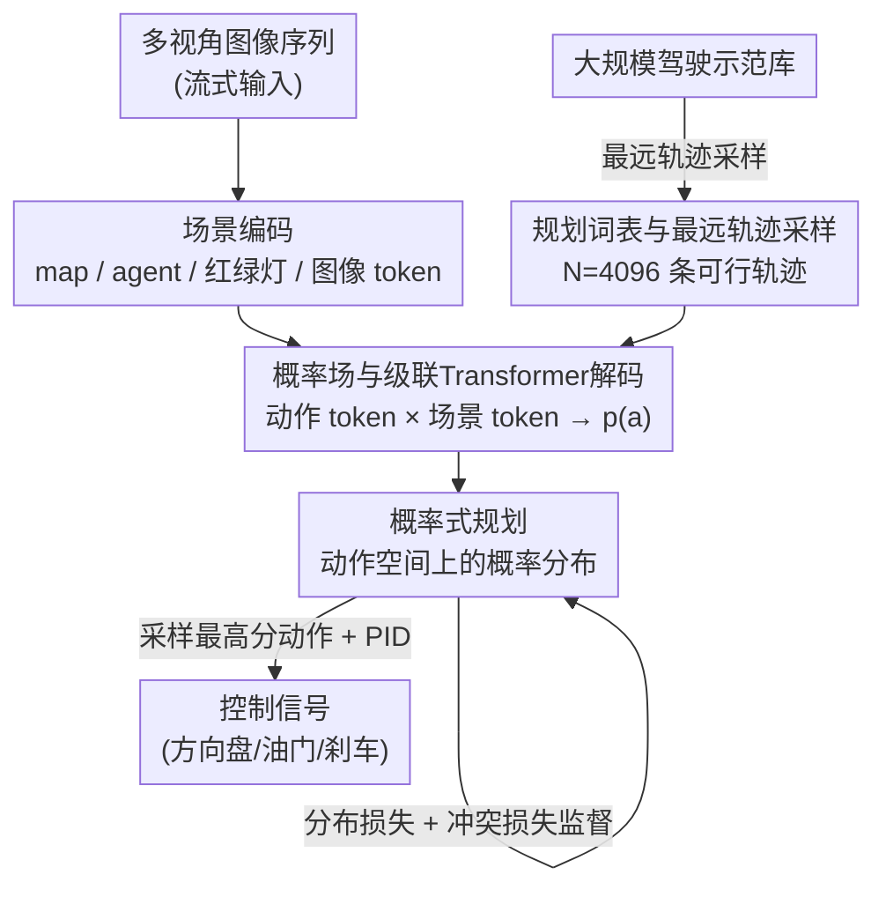

# VADv2: End-to-End Vectorized Autonomous Driving via Probabilistic Planning

**会议**: ICLR 2026  
**OpenReview**: [https://openreview.net/forum?id=0a4dA6eUHN](https://openreview.net/forum?id=0a4dA6eUHN)  
**代码**: https://github.com/hustvl/VAD (有)  
**领域**: 自动驾驶 / 端到端规划  
**关键词**: 端到端驾驶, 概率式规划, 规划词表, 概率场, 模仿学习

## 一句话总结
VADv2 把端到端驾驶的规划从"回归一条轨迹"改写成"学动作空间上的概率分布"：先用最远轨迹采样把连续动作空间离散成一个 4096 词的规划词表，再用受 NeRF 启发的概率场 + 级联 Transformer 把每个候选动作打成概率，最后从分布里采样一条来控车——仅用相机就在 CARLA Town05 拿到 85.1 的 Driving Score，并在 Bench2Drive、NAVSIM、3DGS 等多个基准上领先。

## 研究背景与动机

**领域现状**：端到端自动驾驶想从海量人类驾驶示范里直接学出一套"像人"的驾驶策略。主流的学习式规划方法走的是确定性范式——给定场景观测，直接回归出一条未来轨迹（waypoint 序列）或一组控制信号（油门、刹车、方向盘）。

**现有痛点**：人类驾驶本身是非确定的。跟车时，司机可能保持车道也可能变道超车；面对对向来车，可能让行也可能抢行。这些"合理动作"在时机、速度上高度随机，受大量无法精确建模的隐变量影响。确定性回归默认"场景→动作"是一对一映射，于是同一个场景对应的多种人类示范就变成了相互矛盾的回归目标。

**核心矛盾**：当可行解空间是非凸的（存在多个互相分离的合理动作，如"往左绕"和"往右绕"），确定性模型为了拟合所有示范，会把它们平均成一个落在中间的"折中动作"——而这个折中动作恰恰可能撞上中间的障碍，带来安全风险。问题的根子在于：**用单点回归去拟合一个多峰分布，必然失真**。

**切入角度**：作者把规划策略重新建模成一个场景条件下的非平稳随机过程 $p(a \mid o)$，其中 $o$ 是历史与当前的场景观测、$a$ 是一条候选规划动作。这个视角直接借鉴了大语言模型：给定上文，下一个词也是非确定的，LLM 学的是上下文条件下的词概率分布、再从分布里采样。驾驶的不确定性与之同构。

**核心 idea**：用"概率式规划"代替"确定性回归"——不再逼一个最优动作出来，而是对整个动作空间建模一个分布，对候选动作排序后采样高分项。这样既能自然刻画多峰/非凸的可行解，又把建模任务从"回归"降级成更简单的"打分"。

## 方法详解

### 整体框架
VADv2 是一个流式端到端模型：输入多视角环视图像序列，输出动作空间上的概率分布，再采样一条动作交给控制器。整条管线分三段——先用**场景编码器**把传感器数据压成实例级 token；再用**概率式规划**模块把连续动作空间离散成规划词表、并用概率场把每个候选动作打成概率；最后用海量驾驶示范 + 场景约束监督这个分布，推理时从分布采样高分动作并经 PID 转成控制信号。规划目标是一条 3 秒、6 个 waypoint（间隔 0.5s）的未来轨迹。

### 关键设计

**1. 概率式规划：把"回归一条轨迹"改写成"学动作空间上的分布"**

这是全文的范式核心，针对的就是确定性回归在非凸可行解上"取中间值撞墙"的痛点。作者把规划建模成场景条件随机过程 $p(a \mid o)$，$o=(E_{\text{scene}}, E_{\text{navi}}, E_{\text{state}})$ 是场景、导航、自车状态特征，$a=(x_1,y_1,\dots,x_T,y_T)$ 是未来轨迹的 waypoint 序列。模型不再"算出"最优动作，而是给每个候选动作算一个分数，再对整个动作空间排序采样。这样做有三重好处：能天然表达多峰/非凸解空间；建模任务比回归更简单（只需刻画动作与场景的相关性，而非反解最优）；推理阶段非常灵活——可以输出多模态结果，可以往词表里临时塞入规则/优化产生的候选动作一并评估，因为模型对整个动作空间都有分布估计。消融里（Table 8）也验证：相对确定性变体，概率式规划在低/中/高各档交通密度下都更优，且密度升高时确定性方案明显退化、概率式方案保持稳定。

**2. 规划词表与最远轨迹采样：把高维连续动作空间离散成一组可行原语**

规划动作空间是高维连续的时空空间，难以直接建分布。作者把它离散成一个规划词表 $V=\{a_i\}^N$（默认 $N=4096$）。词表不是凭空网格化采样，而是从真实驾驶示范里收集所有出现过的规划动作作为动作集 $S$，再用**最远轨迹采样**（furthest trajectory sampling，类 FPS）逐条挑出 $N$ 条"彼此终点最分散"的代表轨迹：每一步都选一条到当前词表所有动作终点最小距离最大的轨迹加入。这么做有两个关键收益：① 词表里每条动作都来自真实示范，**天然满足自车运动学约束**，转成控制信号时不会超出可行范围（这点优于人为预设的轨迹锚点）；② 终点尽量分散，离散化误差小、对动作空间覆盖均匀。与单步动作词表（如把每步运动量化、迭代 rollout）相比，VADv2 的每个 token 代表**一条完整轨迹**，因此是一次性规划、不存在迭代累积误差，也不会生成违反物理约束的轨迹。

**3. 概率场与级联 Transformer 解码：把每个动作 token 映射成概率**

有了离散词表，还需要一个能把"某条候选动作 + 当前场景"映射成概率的打分器，且要求这个概率对动作的小扰动连续（$\lim_{\Delta a\to 0}(p(a)-p(a+\Delta a))=0$）。作者受 NeRF 用连续辐射场建模 5D 空间的启发，提出**概率场**来建模从动作空间到概率分布的连续映射。具体先用位置编码 $\Gamma$ 把每条轨迹的每个坐标从 $\mathbb{R}$ 升到高维 $\mathbb{R}^{2L}$，得到规划 token 嵌入 $E(a)$——升频是为了让场函数能逼近更高频的细节。随后一个**级联 Transformer 解码器** $\phi$ 让 $E(a)$ 作 query、场景 token $E_{\text{scene}}$ 作 key/value 做交叉注意力，再叠加导航与自车状态嵌入、过 MLP + sigmoid 得到概率：

$$p(a) = \sigma\big(\mathrm{MLP}(\phi(E(a), E_{\text{scene}}) + E_{\text{navi}} + E_{\text{state}})\big)$$

这里 $E(a)$、$E_{\text{navi}}$、$E_{\text{state}}$ 与 MLP 输出同维（$1\times D$，默认 $D=256$）。其妙处在于：词表里 4096 个动作 token 都通过同一套场函数与场景交互，等于在整个动作空间上铺了一张连续的概率曲面，而不是孤立地给每条轨迹打分。

**4. 分布损失与冲突损失：从海量示范学分布、用场景约束修正分布**

监督由三部分组成。**分布损失**是主力：用 KL 散度逼近预测分布与数据分布，由于数据分布 $p_{\text{data}}$ 固定，等价于交叉熵 $L_{\text{distribution}} = -\sum_{a\in V} p_{\text{data}}(a)\log p_{\text{pred}}(a)$。$p_{\text{data}}(a)$ 由"该动作在示范中被命中的频率"估计——对每帧示范，从词表里取 L2 距离真值最近的那条作为命中动作记为 1、其余记 0，跨所有帧统计归一化，这与 LLM"真值 token 记 1、其余记 0 + 交叉熵"完全同构。**冲突损失**注入驾驶先验：若词表中某动作与其他 agent 的真值未来轨迹或道路边界冲突，就把它当负样本压低概率 $L_{\text{conflict}} = \sum_{a\in V} \mathbb{1}_{\text{conflict}}(a)\log p_{\text{pred}}(a)$。**场景 token 损失**则用各自的检测/建图/红绿灯监督，保证 map/agent/traffic 这些 token 真的编码了对应高层信息。总损失 $L = L_{\text{distribution}} + L_{\text{conflict}} + L_{\text{token}}$。消融（Table 7）显示分布损失是命门：去掉它 3s L2 从 0.290m 暴涨到 3.153m、碰撞率从 ~3.9% 飙到 74.6%，模型基本失能。

### 损失函数 / 训练策略
$L = L_{\text{distribution}} + L_{\text{conflict}} + L_{\text{token}}$。CARLA Town05 用官方 agent 在 Town03/04/06/07/10 随机路线采集约 300 万 clip（6 路环视、10Hz、过去 1.6s）；NAVSIM/3DGS 侧用约 2000 小时真实人驾示范训练、337 个 3DGS 重建环境做闭环评测。$T=6$、$D=256$，全部实验基于 16 张 NVIDIA 4090。推理时默认采样最高概率动作 + PID 控制；真实部署可改为采样 top-K 候选 + 规则 wrapper 过滤 + 优化求解器精修，并用动作概率作为"端到端置信度"在学习式与规则式策略间切换。

## 实验关键数据

### 主实验

CARLA Town05 Long 闭环（仅相机），DS 为主指标（= RC × IS）：

| 数据集 | 指标 | VADv2 | 之前最佳 | 提升 |
|--------|------|------|----------|------|
| Town05 Long | DS ↑ | **85.1** | Rao 2024 (相机) 74.9 | +10.2 |
| Town05 Long | DS ↑ | 85.1 | DriveMLM (相机+LiDAR) | +9.0 |
| Bench2Drive | DS ↑ | **76.15** | ETA 74.33 | +1.82 |
| NAVSIM navtest | PDMS ↑ | **89.3** | Hydra-NeXt 88.6 | +0.7 |
| NAVSIMv2 | EPDMS ↑ | **85.8** | PRIX 84.2 | +1.6 |
| 3DGS benchmark | CR ↓ | **0.270** | TransFuser 0.320 | -15.6% |

VADv2 在 Town05 上仅用相机即超过用相机+LiDAR 的 DriveMLM（DS +9.0），并把 NAVSIM PDMS 推到 89.3、3DGS 碰撞率相对 TransFuser 降 15.6%。

### 消融实验

关键模块消融（Table 7，50k clip 训练，3s 指标）：

| 配置 | L2 3s (m) ↓ | Collision 3s (%) ↓ | 说明 |
|------|------|------|------|
| Full (ID7) | **0.290** | **0.039** | 完整模型 |
| w/o 分布损失 (ID1) | 3.153 | 0.746 | 失去示范监督，基本失能 |
| w/o 冲突损失 (ID2) | 0.291 | 0.039 | 影响较小，但缺驾驶先验 |
| w/o Agent token (ID3) | 0.327 | 0.085 | 缺动态目标信息 |
| w/o Map token (ID4) | 0.332 | 0.070 | 缺静态地图信息 |

规划方式 × 交通密度（Table 8，PDMS）：

| 方式 | 低密度 | 中密度 | 高密度 |
|------|------|------|------|
| 确定性 | 89.4 | 87.5 | 85.8 |
| 概率式 | **90.6** | **89.0** | **87.7** |

### 关键发现
- **分布损失是命门**：去掉它 3s L2 从 0.290m 暴涨到 3.153m（×10.9）、碰撞率从 0.039% 飙到 0.746%，说明"从示范学分布"这一步撑起了整个范式；冲突损失与各类场景 token 的贡献小但稳定。
- **概率式在拥堵场景的鲁棒性更强**：高密度交通下确定性 PDMS 85.8、概率式 87.7，且密度从低到高确定性退化更明显——正好印证多峰动作空间下回归会失真的动机。
- **多模态输出质量高**：top-1 PDMS 89.3，top-5 仍有 87.5，说明分布里靠前的几条候选都是合理轨迹，可直接用于多模态规划或下游过滤。

## 亮点与洞察
- **把 LLM 的"下一词分布 + 采样"范式整体搬进驾驶规划**：动作词表对应词表、最近匹配动作记 1 对应真值 token、交叉熵对应语言建模损失——同构得非常干净，也解释了为什么概率式天然能处理多峰不确定性。
- **词表来自真实示范 + 最远轨迹采样**：一举解决了"离散化是否可行""覆盖是否均匀"两个问题，每条 token 自带运动学可行性，比人为设定轨迹锚点更省心，也避免单步词表的迭代累积误差。
- **NeRF 式概率场的迁移很巧**：用位置编码升频 + 交叉注意力把"动作→概率"建成连续场，思路可迁移到任何"在连续候选空间上排序采样"的任务（如运动预测、轨迹检索）。
- **推理阶段的灵活性是范式红利**：因为对整个动作空间有分布，可临时往词表注入规则/优化候选、可用概率当置信度做策略切换，这是确定性回归给不了的。

## 局限与展望
- 作者承认：当前 CARLA 仿真与 3DGS 闭环环境都存在 agent 行为幼稚、场景真实感不足的问题，会限制 VADv2 的上限表现，本文主要是验证概率式规划范式的可行性。
- 自己观察：词表大小 $N=4096$ 与最远轨迹采样是固定离散化，长尾/极端机动（如急避让）若不在示范分布里，词表可能采样不到，存在覆盖盲区。
- 分布损失把"每帧最近匹配动作记 1、其余记 0"当硬标签，本质仍是单峰 one-hot 监督，多峰性主要靠跨帧频率统计涌现，单帧层面的多模态监督仍偏弱。
- 改进思路：可探索软标签/能量式分布监督让单帧也表达多峰，或用大规模真实专家数据进一步缩小 sim-to-real 差距（作者已列为未来工作）。

## 相关工作与启发
- **vs 确定性回归规划（VAD / UniAD / 各类轨迹回归）**：它们直接回归一条轨迹或控制信号，在非凸可行解上会取折中导致风险；VADv2 改成对动作空间建分布、排序采样，多峰鲁棒且建模更简单。
- **vs 扩散式规划（DiffusionDrive / Diffusion Planner / GoalFlow）**：扩散类靠迭代去噪生成轨迹，受限于预设锚点数量或单目标点、且有计算开销；VADv2 一次性对完整轨迹词表打分，无迭代误差、可灵活扩词表。
- **vs 单步动作词表（Trajeglish / MotionLM）**：它们把每步运动量化后迭代 rollout，易累积误差、可能违反物理约束；VADv2 每个 token 是一条完整且来自真实示范的可行轨迹，one-shot 规划。
- **vs LLM-based 规划（DriveMLM / 各类 LLM planner）**：LLM 推理慢、实时性差；VADv2 借 LLM 的概率建模思想但走轻量 Transformer 解码，可 10Hz 闭环运行，且仅用相机就超过用 LiDAR 的 DriveMLM。

## 评分
- 新颖性: ⭐⭐⭐⭐⭐ 把规划范式从回归改写成动作分布学习，词表 + 概率场 + LLM 式监督三件套自洽且干净
- 实验充分度: ⭐⭐⭐⭐⭐ CARLA/Bench2Drive/NAVSIM/NAVSIMv2/3DGS 五类基准 + 密度/模块/多模态消融，覆盖闭环与真实场景
- 写作质量: ⭐⭐⭐⭐ 动机与方法讲得清楚，类比 LLM 贴切；部分实现细节（概率场设计选择）放在附录
- 价值: ⭐⭐⭐⭐⭐ 仅相机即多基准 SOTA，范式与推理灵活性对工程落地有直接参考意义

<!-- RELATED:START -->

## 相关论文

- [\[ICLR 2026\] ReCogDrive: A Reinforced Cognitive Framework for End-to-End Autonomous Driving](recogdrive_a_reinforced_cognitive_framework_for_end-to-end_autonomous_driving.md)
- [\[ICLR 2026\] ResWorld: Temporal Residual World Model for End-to-End Autonomous Driving](resworld_temporal_residual_world_model_for_end-to-end_autonomous_driving.md)
- [\[CVPR 2026\] ActiveAD: Planning-Oriented Active Learning for End-to-End Autonomous Driving](../../CVPR2026/autonomous_driving/activead_planning-oriented_active_learning_for_end-to-end_autonomous_driving.md)
- [\[CVPR 2026\] LEAD: Minimizing Learner-Expert Asymmetry in End-to-End Driving](../../CVPR2026/autonomous_driving/lead_minimizing_learner-expert_asymmetry_in_end-to-end_driving.md)
- [\[CVPR 2026\] GuideFlow: Constraint-Guided Flow Matching for Planning in End-to-End Autonomous Driving](../../CVPR2026/autonomous_driving/guideflow_constraint-guided_flow_matching_for_planning_in_end-to-end_autonomous_.md)

<!-- RELATED:END -->
