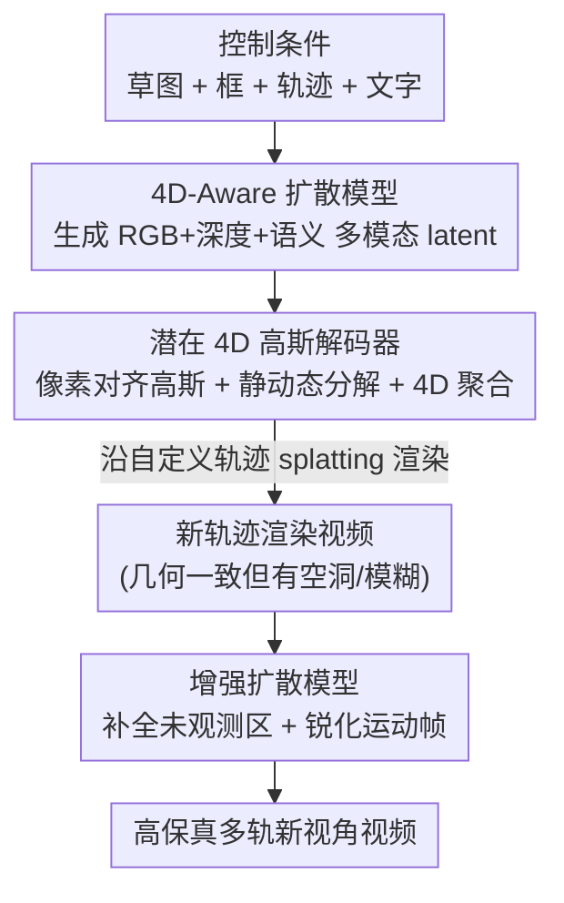

# WorldSplat: Gaussian-Centric Feed-Forward 4D Scene Generation for Autonomous Driving

**会议**: ICLR 2026  
**论文**: [Project Page](https://wm-research.github.io/worldsplat/)  
**代码**: 见项目页（暂未明确开源链接）  
**领域**: 自动驾驶 / 世界模型 / 4D 场景生成 / 3D 高斯  
**关键词**: 驾驶世界模型, 前馈式 4D 高斯, 新视角合成, 潜在扩散, 静动态分解

## 一句话总结
WorldSplat 把"驾驶视频生成"和"3D/4D 场景重建"合二为一：先用一个 4D-aware 潜在扩散模型从布局/文字/轨迹等条件生成含 RGB+深度+语义的多模态 latent，再用前馈解码器一次性吐出像素对齐的 4D 高斯场，沿任意自定义轨迹渲染出几何一致的多轨新视角视频，最后用增强扩散补全瑕疵，在 nuScenes 上同时刷新了驾驶视频生成和新视角合成的 SOTA。

## 研究背景与动机
**领域现状**：可控驾驶场景合成是自动驾驶可扩展训练和闭环评测的关键。一条路线是生成式世界模型（MagicDrive、Vista、DriveDreamer 等），擅长造出高保真、用户可控的视频；另一条路线是城市场景重建（StreetGaussian、OmniRe、EmerNeRF 等），擅长从真实驾驶 log 做几何一致的新视角合成（NVS）。

**现有痛点**：两条路线各有死穴。视频生成模型工作在 2D 图像域，缺乏 3D 一致性和新视角可控性——单个角度看着合理，一换视角就崩；它们也无法保证"把自车横移 ±Nm"后画面还连贯。重建方法虽然几何精确，却只能复刻拍到的数据，没有"想象未见场景"的生成能力。常见的折衷做法"先生成视频再重建"会被两段流程的误差叠加拖累，稀疏视角下出现重建伪影。

**核心矛盾**：生成式的"想象力"和重建式的"几何忠实度"之间存在结构性对立——纯 2D 视频缺几何，纯重建缺生成。要同时拿到两者，必须有一个既能从条件凭空生成、又自带显式 3D 表示的统一表征。

**本文目标**：造一个前馈框架，能从用户条件（路网草图、文字、动态物体框、自车轨迹）直接生成一个动态 4D 高斯场，然后沿任意相机轨迹实时渲染出时空一致的多轨新视角视频，且不需要逐场景优化。

**切入角度**：作者认为问题出在中间表征上——与其用点云（point map）这种几何稀疏、难以一致渲染的表征，不如把扩散模型的输出直接落到显式的、以高斯为中心的世界表示上。3D 高斯既能光栅化快速渲染，又能显式承载几何，天然适合做"生成 + 重建"的桥梁。

**核心 idea**：用"4D-aware 扩散生成多模态 latent → 前馈解码成像素对齐 4D 高斯 → 增强扩散精修渲染"三段式，把生成的想象力灌进显式 4D 高斯表示，从而获得几何一致的可控新视角视频。

## 方法详解

### 整体框架
WorldSplat 整条管线由三个**独立训练**的模块串成。输入是一组结构化控制条件 $C=\{S,B,T,D\}$（BEV 路网草图、3D 物体框、自车轨迹、文字描述）加噪声 latent；输出是沿用户自定义轨迹 $T'$ 渲染的高保真多轨新视角视频。

第一步，4D-Aware 扩散模型对噪声去噪，生成一个**多模态 latent**——它不只含 RGB，还把 metric 深度和动态物体语义掩码一起编码进去，等于给后续重建提供了"外观 + 几何 + 静动态划分"三件套。第二步，潜在高斯解码器把这个 latent 解成**像素对齐的 3D 高斯**，用语义掩码把高斯分成静态背景和动态物体，再跨帧聚合成统一的 **4D 高斯场**。第三步，对该高斯场沿扰动轨迹做快速高斯泼溅（splatting）渲染出新视角视频，但泼溅在未观测区域和强自车运动下会糊/缺，于是第四步用**增强扩散模型**对渲染结果做精修，补全空洞、锐化运动帧，得到最终视频。

### 关键设计

**1. 4D-Aware 多模态潜在扩散：把几何与静动态信息直接写进生成的 latent**

痛点是：传统驾驶视频扩散只生成 RGB latent，下游想做 3D 重建时既没有深度也没有静动态划分，只能事后估计，误差层层累积。WorldSplat 让扩散模型一上来就生成"自带 3D 信息"的 latent。具体做：对 $K$ 视角、$T$ 帧的视频，用预训练 VAE 编出图像 latent $L_{img}$；用深度基础模型估 metric 深度、归一化到 $[-1,1]$ 后编出 $L_{depth}$；用 SegFormer 出动态类别二值掩码编出 $L_{seg}$；三者沿通道拼成 $L=\text{concat}\{L_{img},L_{depth},L_{seg}\}$ 作为后续解码输入。控制端是 ControlNet 化的双分支 DiT（基于 OpenSora v1.2）：主流处理时空视频 latent，ControlNet 分支注入草图、框、轨迹、文字，并把标准 self-attention 换成 cross-view attention 保证多视角一致。文字条件不靠粗标签，而是用 **DataCrafter**——把多视角视频切片、用 VLM 打分、逐视角生成 caption 再经一致性模块融合，得到既含场景上下文（天气/时间/布局）又含物体细节的结构化描述。训练上用 Rectified Flow 取代 IDDPM 调度，定义插值态 $z(s)=(1-s)\epsilon+sx$，让网络 $g_\psi(z,s,C)$ 回归向量场 $x-\epsilon$，推理时按 $z(s_{k-1})=z(s_k)-\frac1N g_\psi(z(s_k),s_k,C)$ 反向积分，稳定且步数少。

**2. 潜在 4D 高斯解码器：从 latent 前馈出像素对齐高斯并做静动态 4D 聚合**

这是把"生成"接到"显式 3D"的关键一跳。解码器是 transformer，叠 cross-view attention 和跨帧 temporal attention，再接一串上采样块逐像素回归高斯参数；为补强 3D 空间线索，额外喂入 Plücker 射线图 $P$（编码每像素射线原点 $R_o$ 与方向 $R_d$）。每个 3D 高斯参数化为 $g=(\mu,r,s,\alpha,c)$（中心、四元数旋转、尺度、不透明度、颜色），解码器最后一层预测逐像素的偏移 $\delta$、$r,s,\alpha,c$、深度 $d$ 以及静动态分类 logits $m$，高斯中心由 $\mu=R_o+d\odot R_d+\delta$ 算出。整体映射写成 $D_\phi:(L_{img},L_{depth},L_{seg},P)\mapsto\{(G_t,M_t)\}_{t=1}^T$。拿到每帧高斯和动态掩码后做 **4D 聚合**：已知自车轨迹 $T$，把所有 3D 高斯变换到统一坐标系，每个时刻把"从各帧汇总的静态高斯"与"当前帧的动态高斯"融合：

$$G_{4D}=\Big\{(G_t\odot M_t)\cup\bigcup_{i=1}^{T}\big(G_i\odot(1-M_i)\big)\Big\}_{t=1}^{T}.$$

为什么有效：单帧 3D 高斯往往太稀疏，新视角下出现空洞和混叠；跨时刻聚合等于把静态背景在时间维上稠密化、动态物体按帧更新，从而显著提升时空一致性。值得一提，该解码器支持 **48 个以上同时输入视角**，比以往前馈重建模型能覆盖更复杂的场景。

**3. 增强扩散模型：用"重建即修复 + 混合条件增强"补偿高斯泼溅的固有缺陷**

高斯泼溅 + 无逐场景优化带来两类硬伤：未观测区域（被遮挡的天空、建筑背面）渲染缺内容，强自车运动下渲染发糊。增强扩散模型把"精修渲染视频"当成一个条件生成任务来修这两类病——它与 4D-Aware 扩散同构，但条件改为 $C'=\{R,S,B,T,D\}$（多了渲染视频 $R$），回归目标改为干净图像 latent $E(I)$，在 latent 空间里给渲染结果补细节、强一致性。训练上有个关键 trick：ReconDreamer 只用降质渲染做输入，会削弱条件与输出的对齐；WorldSplat 改用**混合条件增强**，把降质渲染和高质量视图掺在一起训练，兼顾可控性与生成保真度。配合 §3.5 的**自定义轨迹选择**（沿 FreeVS 的位姿扰动，对原轨迹施加 $\Delta y\in\{\pm1,\pm2,\pm4\}$m 横移得到 6 条新轨迹），并把草图、框按新轨迹**重投影**为 $S',B'$ 形成新条件 $C'$，强加跨视角/跨帧的显式几何约束，进一步抬升新视角质量。

### 损失函数 / 训练策略
三个模块分开训。4D-Aware 扩散用 Rectified Flow 的向量场回归损失（式 2）。高斯解码器的监督由两部分组成：预测的静动态语义掩码用 SegFormer 生成的掩码做二值交叉熵监督；4D 高斯投影到目标渲染时刻后，RGB 用 L1 光度损失 + LPIPS 感知损失监督，深度用 metric 空间 L1 监督，整体目标为

$$\mathcal{L}=\mathcal{L}_{recon}+\lambda_1\mathcal{L}_{lpips}+\lambda_2\mathcal{L}_{depth}+\lambda_3\mathcal{L}_{seg}.$$

增强扩散的架构与训练策略与 4D-Aware 扩散一致，仅条件和回归目标不同。骨干用预训练 OpenSora-VAE-1.2，主要微调扩散 transformer 里的 cross-view attention 块。

## 实验关键数据

数据集为 nuScenes（700 场景训练 / 150 验证，标注从 2 Hz 上采样到 12 Hz），指标用 FVD、FID，并评估下游感知任务的 domain gap。

### 主实验

原视角视频生成（nuScenes 验证集，三种条件方案）：

| 条件方案 | 方法 | FVD_multi ↓ | FID_multi ↓ |
|----------|------|-------------|-------------|
| w/o first cond | DriveDreamer-2 | 105.10 | 25.00 |
| w/o first cond | Panacea | 139.00 | 16.96 |
| w/o first cond | **Ours** | **74.13** | **8.78** |
| w first cond | DriveDreamer-2 | 55.70 | 11.20 |
| w first cond | **Ours** | **16.57** | **4.14** |
| w noisy latent | UniScene | 70.52 | 6.12 |
| w noisy latent | **Ours** | **60.84** | 6.51 |

新视角合成（沿 ±1/±2/±4m 横移，baseline 取自 DiST-4D）：

| 方法 | ±1m FID/FVD ↓ | ±2m FID/FVD ↓ | ±4m FID/FVD ↓ |
|------|---------------|---------------|---------------|
| OmniRe | 31.48 / 152.01 | 43.31 / 254.52 | 67.36 / 428.20 |
| DiST-4D | 10.12 / 45.14 | 12.97 / 68.80 | 17.57 / 105.29 |
| **Ours** | **8.25 / 40.17** | **11.26 / 47.41** | **13.38 / 64.07** |

横移越大（±4m）优势越明显——重建类 baseline 在大幅偏移下 FVD 飙到 400+，WorldSplat 仍保持 64.07，说明显式 4D 高斯表示对视角外推更鲁棒。

### 消融实验
±2m 新视角合成下逐组件验证（version F 为完整模型）：

| 版本 | 配置 | FVD ±2m ↓ | FID ±2m ↓ | 说明 |
|------|------|-----------|-----------|------|
| A | 无 3D Gs（基线） | 260.07 | 41.40 | 纯 2D 生成 |
| B | + 3D Gs | 75.26 | 16.31 | 引入显式高斯，FVD −184.81 |
| C | + 4D 聚合 | 50.73 | 11.60 | 跨帧稠密化，FVD −24.53 |
| D | 无 4D Gs（仅增强等） | 107.58 | 26.73 | 对照 |
| E | 无条件重投影 | 51.64 | 12.07 | 去掉重投影 FVD +8.9% |
| F | 完整模型 | 47.41 | 11.26 | 含混合增强 + 增强扩散 |

### 关键发现
- **显式 3D 高斯是最大功臣**：A→B 仅引入 3D 高斯就让 FVD 从 260.07 暴跌到 75.26（−184.81），证明"把生成落到显式几何表示"是几何一致新视角的根本来源。
- **增强扩散贡献第二大**：D→F 中 FVD 从 107.58 降到 47.41（−60.17）、FID −15.47，说明补全未观测区 + 锐化运动帧对最终保真度至关重要。
- **4D 聚合解决稀疏空洞**：单帧高斯稀疏会产生空洞混叠，跨帧聚合（B→C）再降 FVD 24.53。
- **下游收益**：生成数据在 BEVFormer 上达 38.49% mIoU / 29.34% mAP，超 DiVE 各 +2.53 / +4.79；把生成数据掺进 StreamPETR 训练（Real+Ours）mAP +4.0、NDS +3.2，增益大于 Panacea 的 +2.6 / +2.3。

## 亮点与洞察
- **"生成多模态 latent"而非"生成 RGB"**：把深度和静动态语义在扩散阶段就编进 latent，等于让生成模型直接产出可供前馈重建的几何信息，绕开了"先出 RGB 再估几何"的误差链——这个思路可迁移到任何"生成后接重建"的任务。
- **以高斯为中心的世界表示**：相比 point map，像素对齐 3D 高斯既能快速 splatting、又显式承载几何，作者论证它更适合一致的新视角视频生成，是把"想象力"和"几何忠实"焊在一起的关键载体。
- **混合条件增强的小而美**：用降质 + 高质渲染掺着训增强扩散，巧妙化解了"只用降质输入会破坏条件-输出对齐"的两难，是可直接复用的训练 trick。

## 局限与展望
- 作者承认的失败案例：当自定义轨迹进入**完全未观测区域**（如把轨迹挪进建筑内部），没有高斯渲染提供的几何先验，增强扩散只能产出伪影或空白——这是所有基于重建的视图合成方法的通病。
- 三个模块**分开训练**而非端到端，可能存在阶段间次优；推理是多阶段串行，整体延迟和误差传播值得关注。
- 深度/语义依赖外部基础模型（深度估计器、SegFormer），其误差会传入高斯几何；评测主要在 nuScenes 单一数据集，跨域泛化未充分验证。
- 改进方向：作者建议对重遮挡区域引入几何 inpainting 或学习先验；也可探索三模块联合微调。

## 相关工作与启发
- **vs 视频生成世界模型（MagicDrive / Vista / DriveDreamer-2）**：它们在 2D 域生成高保真视频但缺 3D 一致性，换视角易崩；WorldSplat 直接前馈出 4D 高斯场，保证横移后的几何一致性，新视角 FVD/FID 大幅领先。
- **vs 城市场景重建（OmniRe / StreetGaussian / EmerNeRF）**：它们几何精确但无生成能力、需逐场景优化；WorldSplat 是前馈、可从条件生成未见场景，且在大幅横移（±4m）下质量远超这些重建 baseline。
- **vs "生成+重建"两段法（DreamDrive / InfiniCube / MagicDrive3D）**：两段法质量被双流程误差叠加拖累、稀疏视角不一致；WorldSplat 在单一前馈中统一生成与重建，输出直接是 4D 高斯，避免中间视频环节的精度损失。
- **vs 前馈重建（DiST-4D 等）**：DiST-4D 用 point map，WorldSplat 用以高斯为中心的表示并支持 48+ 视角输入，新视角合成全面更优。

## 评分
- 新颖性: ⭐⭐⭐⭐⭐ 把"生成多模态几何 latent + 前馈 4D 高斯 + 增强扩散"统一进一个前馈框架，桥接生成与重建，角度新颖
- 实验充分度: ⭐⭐⭐⭐ 原视角/新视角/消融/下游四类实验齐全且 SOTA，但仅在 nuScenes 单一数据集验证
- 写作质量: ⭐⭐⭐⭐ 三模块脉络清晰、图示到位，公式记号规范
- 价值: ⭐⭐⭐⭐⭐ 为自动驾驶提供可控、几何一致的多轨数据合成器，下游感知提升明显，实用价值高

<!-- RELATED:START -->

## 相关论文

- [\[CVPR 2026\] UFO: Unifying Feed-Forward and Optimization-based Methods for Large Driving Scene Modeling](../../CVPR2026/autonomous_driving/ufo_unifying_feed-forward_and_optimization-based_methods_for_large_driving_scene.md)
- [\[CVPR 2025\] PanSplat: 4K Panorama Synthesis with Feed-Forward Gaussian Splatting](../../CVPR2025/autonomous_driving/pansplat_4k_panorama_synthesis_with_feed-forward_gaussian_splatting.md)
- [\[ICCV 2025\] DiST-4D: Disentangled Spatiotemporal Diffusion with Metric Depth for 4D Driving Scene Generation](../../ICCV2025/autonomous_driving/dist-4d_disentangled_spatiotemporal_diffusion_with_metric_depth_for_4d_driving_s.md)
- [\[CVPR 2026\] GaussianDWM: 3D Gaussian Driving World Model for Unified Scene Understanding and Multi-Modal Generation](../../CVPR2026/autonomous_driving/gaussiandwm_3d_gaussian_driving_world_model_for_unified_scene_understanding_and_.md)
- [\[CVPR 2025\] UniScene: Unified Occupancy-centric Driving Scene Generation](../../CVPR2025/autonomous_driving/uniscene_unified_occupancy-centric_driving_scene_generation.md)

<!-- RELATED:END -->
