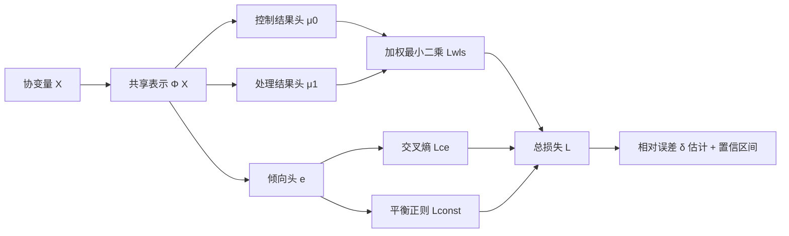

# A Relative Error-Based Evaluation Framework of Heterogeneous Treatment Effect Estimators

**会议**: ICLR 2026  
**OpenReview**: [https://openreview.net/forum?id=gubSyVxWdG](https://openreview.net/forum?id=gubSyVxWdG)  
**代码**: 待确认  
**领域**: 因果推断 / 异质处理效应评估  
**关键词**: HTE, 相对误差, 半参数效率, 倾向得分, 双重稳健, Dragonnet  

## 一句话总结
本文提出一套基于**相对误差**的 HTE 估计器评估框架：通过精心设计的加权最小二乘损失 + 平衡正则项 + Dragonnet 式神经网络，使相对误差估计在**结果回归模型设定错误**时仍保持 $\sqrt{n}$ 一致、渐近正态、置信区间有效（只需倾向得分模型正确），从而可靠地比较不同 HTE 估计器；并顺带衍生出一个聚合式 HTE 学习算法。

## 研究背景与动机
**领域现状**：异质处理效应（HTE，$\tau(x)=\mathbb{E}[Y(1)-Y(0)\mid X=x]$）估计已在经济学、医学、营销等领域百花齐放（Causal Forest、X/S-Learner、TARNet、Dragonnet……），但「如何评估这些估计器谁更好」却长期被忽视。难点在于 HTE 没有 ground truth——每个个体只能观测到一个潜在结果。

**现有痛点**：传统做法用绝对误差（MSE）$\phi(\hat\tau)=\mathbb{E}[(\hat\tau(X)-\tau(X))^2]$ 评估，但它显式依赖未知的 $\tau$，对 $\tau$ 的估计误差敏感。Gao (2025) 提出用**相对误差** $\delta(\hat\tau_1,\hat\tau_2)=\phi(\hat\tau_1)-\phi(\hat\tau_2)$ 量化两个估计器的性能差，只依赖 $\tau$ 的一阶项、对 $\tau$ 估计误差更鲁棒。

**核心矛盾**：Gao (2025) 的相对误差估计器要求**所有** nuisance 模型（倾向得分 $e(x)$ 与结果回归 $\mu_a(x)$）都以快于 $n^{-1/4}$ 的速率一致（Condition 2）。但结果回归 $\mu_a(x)$ 在「处理组/对照组」上分别训练却要外推到全样本，当两组分布差异大时外推预测极易失真——这个条件在实践中太苛刻。相比之下，倾向得分在全样本上学习、无外推，远更稳健。

**本文目标**：在保留 Gao (2025) 半参数效率等优良性质的前提下，**放宽对结果回归模型的一致性要求**，允许 $\mu_a(x)$ 有偏。

**核心 idea（加粗）**：**利用倾向得分与结果回归模型之间的代数关联**，推导出使相对误差估计对 $\mu_a$ 偏差鲁棒的「关键矩条件」，再设计专门的损失函数与神经网络去逼近这些条件，使得「只要倾向得分正确，结果回归模型设错也无妨」——即获得一种**对结果模型双重稳健**的评估器。

## 方法详解

### 整体框架
方法保持 Gao (2025) 估计器的同款代数形式 $\check\delta=\frac1n\sum_i\varphi(Z_i;\check\mu_0,\check\mu_1,\check e)$ 以继承半参数效率，但「如何拟合 nuisance 参数」完全不同。核心三步：① 对 $\check\delta$ 做 Taylor 展开，导出使其对 $\check\mu_a$ 偏差鲁棒所需的三组期望矩条件（Eq. 4）；② 设计「加权最小二乘损失」让结果回归头自动满足前一条件、设计「平衡正则项」让倾向头满足后两条件；③ 用共享表示 $\Phi(X)$ 的 Dragonnet 三头网络联合优化，输出 nuisance 估计供相对误差计算。

### 关键设计

**1. 鲁棒性矩条件：把"对结果模型偏差稳健"翻译成可执行的目标。** 作者对 $\check\delta(\hat\tau_1,\hat\tau_2;\check\gamma,\check\beta_0,\check\beta_1)$ 关于其概率极限 $(\bar\gamma,\bar\beta_0,\bar\beta_1)$ 做一阶 Taylor 展开，发现一阶项 $\Delta_\gamma^\top(\check\gamma-\bar\gamma)+\Delta_{\beta_0}^\top(\check\beta_0-\bar\beta_0)+\Delta_{\beta_1}^\top(\check\beta_1-\bar\beta_1)$ 是决定鲁棒性的关键。由于估计量总会收敛到其概率极限，只要让三个梯度的期望为零 $\mathbb{E}[\Delta_\gamma]=\mathbb{E}[\Delta_{\beta_0}]=\mathbb{E}[\Delta_{\beta_1}]=0$（中心极限定理保证 $\Delta-\mathbb{E}[\Delta]=O_P(n^{-1/2})$），就能使一阶项为 $o_P(n^{-1/2})$。这给出 Eq. (4) 的三条矩约束——它们正是后续损失函数要去满足的目标，本质是把"即便结果模型设错也不破坏 $\sqrt n$ 渐近性"这一愿望，转化为可优化的等式约束。

**2. 加权最小二乘损失：让结果回归头自动满足第一条矩约束。** 针对 $(\beta_0,\beta_1)$，作者设计加权平方损失
$$L_{wls}=\frac1n\sum_i(\hat\tau_1(X_i)-\hat\tau_2(X_i))\Big[\tfrac{(1-A_i)\check e(X_i)\{Y_i-\Phi(X)^\top\beta_0\}^2}{1-\check e(X_i)}+\tfrac{A_i(1-\hat e(X_i))\{Y_i-\Phi(X)^\top\beta_1\}^2}{\hat e(X_i)}\Big].$$
权重里巧妙地塞进了倾向得分 $\check e$ 与估计器差 $\hat\tau_1-\hat\tau_2$。对该损失关于 $\beta_a$ 求导并令其在概率极限处为零，恰好等价于 Eq. (4) 的第一条约束——即使 $(\check\mu_0,\check\mu_1)$ 设定错误，这一条件仍自动成立。换言之，不是要求结果模型"预测准"，而是要求它满足一个特定的加权正交条件。

**3. 软松弛平衡正则：处理倾向参数的过约束。** Eq. (4) 后两条对 $\gamma$ 施加了 $2d$ 个线性约束，而 $\gamma\in\mathbb{R}^d$ 只有 $d$ 个自由度，系统过约束、一般无解。借鉴 SVM 软间隔思想，作者引入松弛变量 $\xi,\eta\in\mathbb{R}^d$ 允许受控偏离，并把约束优化转成无约束的交叉熵 $L_{ce}$ 加平衡正则 $L_{const}=c\sum_j(\xi_j+\eta_j)+\rho\cdot\|\max(\cdot,0)\|^2$，用 $\max(\cdot,0)$ 惩罚对约束的违反。平衡正则鼓励 inverse-propensity 加权后的协变量函数在两组间期望相等（Imai & Ratkovic 的 balance property），从而降低对倾向模型精确设定的依赖。

**4. Dragonnet 三头网络 + 聚合式 HTE 学习。** 网络沿用 Dragonnet：输入经多层全连接得共享表示 $\Phi(x)$，再分三头——控制结果 $\mu_0$、处理结果 $\mu_1$、倾向 $e$（sigmoid）。结果头贡献 $L_{wls}$，倾向头与共享表示贡献 $L_{ce},L_{const}$，总损失 $L=L_{wls}+\lambda_1 L_{ce}+\lambda_2 L_{const}$，无需样本切分。更进一步，既然每对估计器 $(\hat\tau_k,\hat\tau_{k'})$ 经此网络都能输出一组结果回归 $\check\mu_a(x;\hat\tau_k,\hat\tau_{k'})$，便可定义新 HTE 估计 $\check\tau(x;\hat\tau_k,\hat\tau_{k'})=\check\mu_1-\check\mu_0$，并对所有候选对取平均得聚合估计 $\check\tau(x)=\frac{2}{|K|(|K|-1)}\sum_{k,k'}(\check\mu_1-\check\mu_0)$，意外地超过任一单一候选估计器。理论上（Theorem 1 / Proposition 2），倾向模型正确且 $\check\gamma,\check\beta_a$ 以快于 $n^{-1/4}$ 收敛时，$\check\delta$ 即 $\sqrt n$ 一致、渐近正态，并给出有效 $(1-\eta)$ 置信区间——即使结果模型设错。

## 实验关键数据

数据集：半合成 IHDP（747 样本）、真实 Twins（5271 样本）、Jobs（job training）。指标分两类：相对误差评估用**覆盖率**（90% 置信区间）与**选择准确率**（正确挑出更优估计器）；HTE 估计用 $\sqrt{\epsilon_{PEHE}}$ 与 $\epsilon_{ATE}$。

### 主实验表格（HTE 估计性能，越低越好）

| 方法 | IHDP $\sqrt{\epsilon^{out}_{PEHE}}$ | IHDP $\epsilon^{out}_{ATE}$ | Twins $\sqrt{\epsilon^{out}_{PEHE}}$ | Twins $\epsilon^{out}_{ATE}$ |
|---|---|---|---|---|
| X-Learner | 0.987 | 0.207 | 0.294 | 0.024 |
| Dragonnet | 0.867 | 0.134 | 0.290 | 0.092 |
| DRCFR | 0.760 | 0.185 | 0.288 | 0.076 |
| ESCFR | 0.841 | 0.135 | 0.288 | 0.076 |
| **Ours** | **0.670** | **0.105** | **0.286** | **0.009** |

聚合 HTE 估计器在 IHDP/Twins 上的 PEHE 与 ATE 均显著领先所有 baseline。

### 消融实验表格（不同 nuisance 拟合方式的 $\delta$ 推断，IHDP / Twins）

| Nuisance | IHDP 覆盖率 | IHDP 选择准确率 | Twins 覆盖率 | Twins 选择准确率 |
|---|---|---|---|---|
| Regression | 0.94 | 0.44 | 0.94 | 0.88 |
| Boosting | 0.95 | 0.48 | 0.94 | 0.86 |
| **Ours** | 0.96 | **0.80** | 0.94 | **0.94** |

覆盖率各方法都接近目标，但选择准确率本文方法大幅领先（IHDP 0.80 vs 0.44/0.48）——说明专门设计的损失/正则真正提升了"挑出真赢家"的能力。$\lambda_2$（约束损失权重）敏感性分析显示 $\lambda_2=0.1$ 在覆盖率与选择准确率间取得最佳平衡。

### 关键发现
- **运行时间可控**：随样本量从 30→700 仅由 2.5s 增到 3.1s；随候选估计器数 2→5 由 1.1s 增到 12.2s（两两配对，平方增长，可子采样缓解）。
- **覆盖率达标 + 选择准确率领先**，验证了"放宽结果模型一致性"并未牺牲推断有效性。
- 聚合策略意外有效，超越任何单一候选估计器。

## 亮点与洞察
- **把"双重稳健"思想从点估计搬到了"估计器评估"任务**：以往 DR 多用于 ATE/HTE 估计本身，本文创造性地用于「评估 HTE 估计器谁更好」这个元任务。
- **从 Taylor 展开倒推损失设计**：先推出鲁棒性所需的矩条件，再反向设计加权最小二乘 + 平衡正则去精确满足，逻辑闭环、理论与算法严丝合缝。
- **无需样本切分**：相比 Gao (2025) 依赖 cross-fitting，本文全样本推导，数值更可解。
- **评估器免费送学习器**：可靠评估框架天然衍生出聚合式 HTE 学习算法，一举两得。

## 局限与展望
- **依赖倾向得分正确设定**：鲁棒性是"对结果模型"单边的，倾向模型若设错理论保证失效（虽然作者论证倾向得分无外推、较易学准，并给出平衡检验迭代流程与敏感性分析）。
- **候选两两配对计算量平方增长**：候选估计器多时需随机子采样，可能引入额外方差。
- **数据规模有限**：IHDP/Twins/Jobs 都是因果推断小到中等规模经典数据集，缺乏大规模高维场景验证。
- **共享表示 $\Phi(X)$ 设定的敏感性**仅在附录做了分析，工程上仍需调参。

## 相关工作与启发
直接动机来自 **Gao (2025)** 的相对误差评估；网络架构沿用 **Dragonnet** (Shi et al., 2019)；平衡正则源自 **Imai & Ratkovic (2014)** 的协变量平衡；半参数效率与 nuisance 收敛率借鉴 **Chernozhukov et al. (2018)** 的双重机器学习；HTE 估计 baseline 涵盖 Causal Forest、X/S-Learner、TARNet、DRCFR、ESCFR 等代表性方法。启发在于：**"评估"本身是个被低估的研究问题**——当 ground truth 不可得时，与其追求绝对精度，不如设计对 nuisance 偏差鲁棒的相对比较框架，这一思路可推广到反事实预测、推荐去偏等其他缺 ground truth 的因果任务。

## 评分
- **新颖性**: ⭐⭐⭐⭐ 把双重稳健思想用于"HTE 估计器评估"这一元任务、从 Taylor 展开倒推损失设计，角度新颖。
- **实验充分度**: ⭐⭐⭐ 覆盖三个经典数据集 + 消融 + 敏感性 + 运行时间，但规模偏小、缺高维大规模验证。
- **写作质量**: ⭐⭐⭐⭐ 动机—理论条件—损失设计—网络—理论保证逻辑链清晰，公式推导严谨。
- **价值**: ⭐⭐⭐⭐ 为缺 ground truth 的 HTE 评估提供了更实用的鲁棒框架，且免费衍生出更优学习器，理论与应用价值兼具。

<!-- RELATED:START -->

## 相关论文

- [\[ICLR 2026\] Matching without Group Barrier for Heterogeneous Treatment Effect Estimation](matching_without_group_barrier_for_heterogeneous_treatment_effect_estimation.md)
- [\[ICLR 2026\] Modeling Interference for Treatment Effect Estimation in Network Dynamic Environment](modeling_interference_for_treatment_effect_estimation_in_network_dynamic_environ.md)
- [\[ICLR 2026\] Overlap-Adaptive Regularization for Conditional Average Treatment Effect Estimation](overlap-adaptive_regularization_for_conditional_average_treatment_effect_estimat.md)
- [\[ICLR 2026\] Overlap-Weighted Orthogonal Meta-Learner for Treatment Effect Estimation over Time](overlap-weighted_orthogonal_meta-learner_for_treatment_effect_estimation_over_ti.md)
- [\[ICLR 2026\] Debiased Front-Door Learners for Heterogeneous Effects](debiased_front-door_learners_for_heterogeneous_effects.md)

<!-- RELATED:END -->
