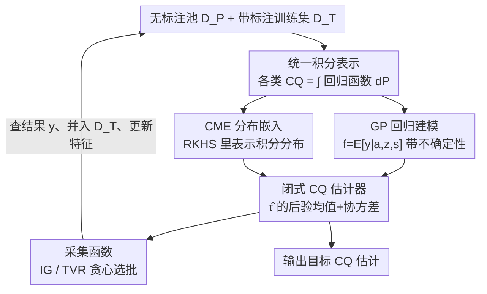

# ActiveCQ: Active Estimation of Causal Quantities

**会议**: ICLR 2026  
**OpenReview**: [https://openreview.net/forum?id=CWpQsAubxy](https://openreview.net/forum?id=CWpQsAubxy)  
**代码**: 待确认  
**领域**: 因果推断 / 主动学习  
**关键词**: 因果量估计、主动学习、高斯过程、条件均值嵌入、贝叶斯实验设计

## 一句话总结
ActiveCQ 把"用尽量少的标注样本估准某个因果量（CATE/ATE/ATT/分布漂移下的 ATE）"这件事统一成一个主动学习问题：发现绝大多数因果量都可以写成"回归函数对某个分布求积分"的形式，于是用高斯过程（GP）建模回归函数、用 RKHS 里的条件均值嵌入（CME）建模那个积分用的分布，再从因果量后验不确定性里解析地推出采集函数（信息增益 / 全方差缩减），在多个模拟与半合成数据集上以更少标注显著超过随机、BALD、Coreset 等基线。

## 研究背景与动机

**领域现状**：因果推断里要估计的核心对象是各种"因果量"（causal quantity, CQ）——平均处理效应 ATE、条件平均处理效应 CATE、受试者平均处理效应 ATT、以及目标人群与观测人群协变量分布不同的"分布漂移下的 ATE"（DS/ATEDS）。这些量本质都是在问"干预 $do(a=a)$ 之后，某个子人群的期望结果 $E[y\mid do(a)]$ 是多少"。要估准它们通常需要大量带标注（即结果 $y$ 可观测）的样本。

**现有痛点**：在很多场景里测量个体结果非常昂贵——个性化医疗要做侵入性检查或贵的检测、经济学要做劳动密集的长期随访、社会服务要人工标注非结构化的个案记录。于是问题变成"池子里有一堆只有协变量、没有结果的样本，预算只够标其中一小部分，该标哪些？"这是一个天然的主动学习（AL）问题。但已有的主动因果推断工作几乎只盯着 CATE 这一个量，而且常常是"对所有协变量做条件、学一个泛化的 CATE 估计器"，缺少对 ATE/ATT/DS 等其它因果量的统一处理。

**核心矛盾**：传统信息论式的主动学习（BALD、全方差缩减 TVR）目标是"降低回归函数 $f$ 在无标注池上的整体不确定性"。但估计因果量时，关注点其实落在某个特定子人群的**干预分布**上——样本是从一个分布抽的，回归函数却要去另一个分布上做积分。这种"分布错配"让传统 AL 的采集目标与"把目标因果量估准"这个真正目的对不上：你可能花预算把池子整体方差降下来了，却没把目标子人群那块的因果量估准。

**本文目标**：(1) 把"主动估计因果量"这件事形式化成一个统一任务 ActiveCQ；(2) 给出一个能同时覆盖 CATE/ATE/ATT/DS 的统一估计与采集框架；(3) 让采集函数"因果量感知"（CQ-aware），即针对目标干预分布去选样本，而不是降池子整体方差。

**切入角度**：作者抓住一个关键观察——Lemma 1 显示这些看似各异的因果量都能写成同一个积分形式 $\tau_{\mathrm{CQ}}=\int_{\mathcal S} E[y\mid a=a,s=s]\,P^*_{\mathrm{CQ}}(ds)$，区别只在"对哪个分布 $P^*_{\mathrm{CQ}}$ 积分"。CATE 是对条件分布 $P_{s\mid z}$ 积、ATE 对边缘分布、ATT 对受试子人群分布、DS 对目标人群分布。只要把"回归函数"和"积分用的分布"分别建好模，所有因果量就能在同一套机器里产出。

**核心 idea**：用 GP 建回归函数 $f=E[y\mid a,z,s]$，用 RKHS 里的条件均值嵌入（CME）表示积分用的分布，使因果量本身成为一个 GP 上的线性泛函、从而有闭式的后验均值与方差；再直接从这个因果量后验的不确定性里推出采集函数，让"选哪个样本"自动对齐到目标因果量。

## 方法详解

### 整体框架

ActiveCQ 处理的是这样一个循环：手上有一个小的带标注训练集 $D_T=\{(x^{(i)},y^{(i)})\}$ 和一个大的无标注池 $D_P=\{x^{(i)}\}$，其中 $x=(a,z,s)$ 包含处理 $a$、效应修饰变量 $z$、调整变量/混淆变量 $s$。每一轮在预算约束下从池子里选一小批 $n_b$ 个样本去查它们的真实结果 $y$，把它们并入 $D_T$、重训模型，目标是用尽量少的标注让某个目标因果量 $\hat\tau(a_I,Z_I)$ 估得最准。

整条管线分四步串起来：先用 GP 把回归函数 $f$ 连同不确定性建出来；再把"因果量要积分的那个分布"用 CME 表示进同一个 RKHS；两者一组合，因果量估计器 $\hat\tau$ 就成了一个有闭式均值和协方差的高斯量；最后从 $\hat\tau$ 的后验不确定性里解析地写出采集函数，按它贪心地挑这一批要标的样本。整个过程以批的方式反复迭代，每轮采集后还要更新 RKHS 特征以保持 CME 与 GP 核一致。

### 关键设计

**1. 统一积分表示：把四种因果量收敛成"回归函数对某分布求积分"**

这是整个框架的基石，针对的是"已有工作只会做 CATE、各因果量各搞一套"的痛点。作者在可识别性假设（无未测混淆、SUTVA、正性条件）下证明（Lemma 1），ATE/CATE/ATT/DS 都能写成同一个模板：

$$\tau_{\mathrm{CQ}}=\int_{\mathcal S} E[y\mid a=a,s=s]\,P^*_{\mathrm{CQ}}(ds).$$

四者只在积分用的分布 $P^*_{\mathrm{CQ}}$ 上不同——CATE 对条件分布 $P_{s\mid z}$ 积分（固定效应修饰变量 $z=z$），ATE/ATT/DS 这类"全局量"则把 $z$ 与 $s$ 合并、对相应的联合/子人群/目标分布积分。这一步的价值在于：它把"估计什么因果量"这件事彻底解耦成"回归函数 $E[y\mid a,s]$（所有因果量共用）+ 一个积分分布（因果量各异）"两块，后面只要把这两块各自建好模，所有因果量就能在同一台机器上产出，采集策略也能统一推导。

**2. GP 建回归函数：让因果量成为可量化不确定性的高斯泛函**

为了能做贝叶斯主动学习，必须知道"现在对因果量估得有多不确定"。作者假设 $y=E[y\mid a,z,s]+\varepsilon$、$\varepsilon\sim\mathcal N(0,\sigma^2)$，给回归函数 $f$ 一个零均值 GP 先验 $f\sim\mathcal{GP}(0,k)$，核取乘积核 $k_{xx'}=k_{aa'}k_{zz'}k_{ss'}$ 以处理多输入。给定训练集就得到闭式后验：

$$m(x)=k_{xX_T}(K_{X_TX_T}+\sigma^2 I)^{-1}y_T,\quad k_{\mathrm{post}}(x,x')=k_{xx'}-k_{xX_T}(K_{X_TX_T}+\sigma^2 I)^{-1}k_{X_Tx'}.$$

关键在于：因果量 $\hat\tau$ 是回归函数 $f$ 的**线性泛函**（对 $s$ 积分是线性运算），而 GP 的线性泛函仍是高斯的，所以 $\hat\tau$ 也有解析的后验均值 $\nu(a,z)=E_{s\sim P_{s\mid z}}[m(a,z,s)]$ 和协方差 $q$。这把"因果量的不确定性"变成可计算的对象，为后面的采集函数铺好路。作者也注明标准 GP 是 $O(n_T^3)$，但框架与具体实现正交，可换稀疏变分 GP、随机傅里叶特征、Nyström 等近似来扩展。

**3. CME 表示积分分布：绕开显式密度估计、与 GP 同处一个函数空间**

要算 $\nu$ 和 $q$ 就得对条件分布 $P_{s\mid z}$ 积分。一种直白做法是先用条件密度估计器（CDE，如混合密度网络 MDN）显式估出 $P_{s\mid z}$、再蒙特卡洛采样近似积分——这正是论文里的 baseline。但作者主推另一条路：用条件均值嵌入（CME）把分布直接表示进 RKHS。CME 定义为

$$\mu_{s\mid z=z}:=E_{s\mid z=z}[\phi(s)]=\int_{\mathcal S}\phi(s)\,P_{s\mid z}(ds\mid z),$$

它对应一个条件均值嵌入算子 $C_{s\mid z}=C_{sz}C_{zz}^{-1}$，可用所有成对的 $(Z,S)$ 经验估计 $\hat C_{s\mid z}=\Phi_S(K_{ZZ}+\lambda I)^{-1}\Phi_Z^{\top}$。这条路有三个实打实的好处：一是**绕开了显式密度估计**这个公认困难的环节；二是 CME 与 GP 处在同一个张量积 RKHS $\mathcal H_{AZS}=\mathcal H_A\otimes\mathcal H_Z\otimes\mathcal H_S$ 里，于是积分能落成**闭式核运算**——Proposition 1 给出把 CME 塞进有效核里后，$\nu$ 和 $q$ 直接用一组带 $(K_{ZZ}+\lambda I)^{-1}$ 的核矩阵算出来，不再需要数值积分；三是它**自适应**：估计 $P_{s\mid z}$ 只需要成对的 $(s,z)$、不需要结果标签，所以池子里的无标注样本也能拿来一起估，每轮采集后更新特征即可让分布模型随之精化。一句话，CME 把"积分一个回归函数"从昂贵的数值积分变成"直接操纵一个分布嵌入"，更省、更对齐 GP 的预测任务。

**4. 从因果量后验解析推采集函数：IG 与 TVR，再加贪心保多样性**

有了 $\hat\tau$ 的闭式后验，就能把"该标哪批样本"直接写成"最大程度降低 $\hat\tau(a_I,Z_I)$ 的后验不确定性"。这正是与传统 AL 的本质区别：BALD/TVR 降的是回归函数 $f$ 在参考分布（常是池子）上的不确定性，而 ActiveCQ 直接降**目标因果量**的不确定性，回归函数只是手段。作者给出两个采集准则：

- **信息增益 IG**：用 $\hat\tau$ 的微分熵衡量不确定性，选能最大化互信息 $I(\hat\tau(a_I,Z_I);y_{X_B}\mid D_T)$ 的批。因为是高斯量，熵有闭式 $H(\mathcal N(0,\Sigma))=\tfrac12\log|(2\pi e)\Sigma|$，于是规则简化为 $X_B^*=\arg\min_{X_B}\det(\mathrm{Var}[\hat\tau\mid D_T,y_{X_B}])$。一个 GP 的好性质是：这个协方差只依赖被选样本的输入位置 $X_B$、不依赖其结果值，所以选样本无需先知道标签。
- **全方差缩减 TVR**：用目标集上边缘方差之和 $\sum_{(a,z)}\mathrm{Var}[\hat\tau(a,z)]$ 当不确定性，选 $X_B^*=\arg\min \mathrm{Tr}(\mathrm{Var}[\hat\tau\mid D_T,y_{X_B}])$。

两者统一成 $X_B=\arg\max U(X_B)$。批选择上，单纯按效用排序取 top-$n_b$ 会让一批样本扎堆、缺多样性；作者改用**贪心近似**，每次加入边际效用增益最大的点 $x_i^*=\arg\max_{x}U(X_{i-1}^*\cup\{x\})$，从而在一批内兼顾信息量与多样性。配套的收敛分析（Theorem 2）在效用函数子模性假设下，把估计器边缘后验方差界成"不可约不确定性 + $C\,\gamma_{n_B}/\sqrt{n_B}$"，其中 $\gamma_{n_B}$ 是信息容量，给出了随采集数衰减的保证。

### 一个完整示例

以个性化医疗里的 CATE 估计为例走一遍：研究者想知道"他汀对不同年龄段（效应修饰变量 $z$=年龄）患者的处理效应有何不同"，池子里有大量只记录了协变量的患者档案，但测真实结果（如某项昂贵检测）很贵，预算只够测一小批。第一轮：用现有少量带标注患者训出 GP 回归函数 $f$，用全部患者（含无标注）的 $(z,s)$ 估出 CME $\hat\mu_{s\mid z}$，组合得到 CATE 估计器 $\hat\tau(a,z)$ 及其后验方差。指定关注的子人群（比如某个年龄 $z$ 下扫遍所有处理 $a$）作为评估目标 $(a_I,Z_I)$。然后用 IG-CME 采集函数贪心地从池子里挑出 $n_b$ 个"标了之后最能降低该年龄段 CATE 不确定性"的患者——注意它挑的不是整体方差最大的点，而是与目标子人群干预分布对齐的点。查这批患者的真实结果、并入训练集、更新 RKHS 特征，进入下一轮。如此反复，目标年龄段的 CATE 估计误差（AMSE）比随机或 BALD 下降得快得多。

## 实验关键数据

在多组模拟数据 + 半合成的 IHDP、Lalonde 数据集上，对 CATE/ATE/ATT/DS 四类因果量评估，指标用平均均方误差 AMSE（估计因果量与真值之差），每个配置跑 20 次随机测试集取均值±标准差。回归函数统一用 GP，条件分布用 MDN 或 CME，方法后缀 "G" 表示贪心采集、其余为 top-$b$。

### 主实验

| 任务 | 场景特点 | 表现总结 |
|------|---------|---------|
| CATE | 目标子人群与池分布有错配 | 本文方法全程最优；TVR-CME 持续优于基于 MC 采样（MDN）的方法 |
| ATE | 所有方法都从整体人群采样 | 各不确定性感知方法表现接近、均优于随机；IG 类偶有数值不稳 |
| ATT | 受试子人群积分 | 本文方法领先基线 |
| DS（分布漂移） | 目标与采样分布显著不同 | 本文所有方法显著超过基线，差距最大 |

对比基线：随机选择、$\mu$-BALD、Coreset（QHTE）、传统 TVR。核心结论是：因果量感知的采集（IG/TVR + CME）在"目标分布与池分布错配"的场景（CATE、DS）上优势最明显，因为它能把预算花在与目标干预分布对齐的样本上；而在 ATE 这种"目标就是整体人群、不存在错配"的场景，本文方法与传统 AL 拉不开差距，符合预期。

### 消融实验

| 配置 | 关键发现 | 说明 |
|------|---------|------|
| CME vs MDN（CDE） | CME 持续更优 | CME 直接操作 GP 回归相关特征、更"面向预测"，且绕开显式密度估计 |
| 贪心（G）vs top-$b$ | 贪心提升批多样性 | top-$b$ 易让一批样本扎堆，贪心兼顾信息量与多样性 |
| IG vs TVR | TVR 更稳 | IG 在大协方差矩阵求行列式时可能数值不稳，导致次优 |
| 起点 / 池大小 / 批大小 / 核选择 | 总体稳健 | 小批会放大贪心的重复后验更新开销（见运行时分析） |

### 关键发现
- **错配越大、收益越大**：CME 在 CATE 和 DS 这类目标分布与池分布偏离明显的场景收益最突出；ATE 无错配时优势消失，说明方法的增益确实来自"对齐目标干预分布"而非泛泛降方差。
- **CME 优于显式密度估计**：因为它与 GP 共享 RKHS、积分有闭式、且更贴预测任务；显式估 $P_{s\mid z}$ 再 MC 采样既贵又不如它对齐。
- **运行时的三个成本来源**：贪心采集（频繁后验更新）、池规模（效用评估量）、IG 的熵/行列式计算；小批会加剧贪心开销，但所有方法在实验规模下都可行。GP 方法对协变量维度不敏感（运行时主要由距离计算主导）。

## 亮点与洞察
- **"积分表示"是真正的统一钥匙**：把 ATE/CATE/ATT/DS 收敛成同一个积分模板后，整个估计-采集机器只需建好"回归函数 + 积分分布"两块，新因果量几乎免费扩展——这是把零散问题做成框架的范式。
- **CME 的三重协同很巧**：绕开密度估计、与 GP 同处一个 RKHS（积分变闭式）、用无标注样本自适应精化分布。把"积分一个回归函数"变成"操纵一个分布嵌入"，既省又对齐预测目标，这个 trick 可迁移到任何"需要对条件分布积分回归函数"的贝叶斯任务。
- **采集函数对齐到目标量、而非池整体**：点破了传统 AL 在因果估计上的错位——降池子整体方差 ≠ 估准目标子人群因果量。这个"目标量感知采集"的思路对一切"最终关心某个泛函而非整条函数"的主动学习都有启发。
- **纯观测、非实验设计的定位清晰**：只能查个体已有的事实结果、不能去干预制造反事实，明确区别于主动实验设计，让方法在真实昂贵标注场景里直接可用。

## 局限与展望
- **GP 的可扩展性**：标准 GP 是 $O(n_T^3)$，大规模池需依赖稀疏 GP / RFF / Nyström 等近似；论文只是声明框架兼容、未在大规模上实测。
- **IG 的数值稳定性**：IG 在大协方差矩阵求行列式时易不稳，导致 ATE 等场景次优；实践中 TVR 往往更稳。
- **可识别性假设强**：依赖无未测混淆、SUTVA、正性条件，现实中常被违反；方法对假设偏离的鲁棒性未充分考察。
- **评估偏合成**：因反事实数据难得，实验以模拟和半合成（IHDP/Lalonde）为主，真实大规模落地证据有限。
- **CME 自身不确定性未传播**：作者提到可像 BayesIMP/IMPspec 那样把 CME 的不确定性一并传播，但本文未深入，留作未来工作。

## 相关工作与启发
- **vs 主动 CATE 估计（Jesson et al. 2021, Qin et al. 2021）**: 他们聚焦在给定全部协变量下降低 CATE 不确定性的选择性结果采集；本文沿同一"结果昂贵、处理已分配"的设定，但把目标从单一 CATE 推广到统一的因果量族（ATE/ATT/DS），并用积分表示串起来。
- **vs 传统信息论 AL（BALD, Houlsby et al. 2011; TVR, Cohn et al. 1996）**: 它们降的是回归函数在池参考分布上的整体不确定性；本文指出这与"估准目标干预分布上的因果量"存在分布错配，改为直接降因果量后验不确定性，在错配场景（CATE/DS）显著占优。
- **vs 主动实验设计（Toth et al. 2022; Kato et al. 2024）**: 那类工作需要能真去做干预、观测反事实；本文是纯观测设定，只能查个体已有事实结果，定位和假设根本不同。
- **vs CME / RKHS 因果推断（Chau et al. 2021; Singh et al. 2024）**: 借用 CME 表示条件分布、把因果量做成 GP 线性泛函的思想；本文的增量是把它嵌进主动学习循环、并据此解析推出 IG/TVR 采集函数与收敛界。

## 评分
- 新颖性: ⭐⭐⭐⭐⭐ 用"积分表示 + CME"把多种因果量的主动估计统一进一个有闭式采集函数的框架，视角新颖
- 实验充分度: ⭐⭐⭐⭐ 覆盖四类因果量、含消融与运行时分析，但以模拟/半合成为主，真实大规模证据有限
- 写作质量: ⭐⭐⭐⭐ 理论推导清晰、动机与机制对得上；公式密集，对非核方法读者门槛较高
- 价值: ⭐⭐⭐⭐ 对昂贵标注下的因果量估计与"目标量感知主动学习"有方法论价值，可迁移性强

<!-- RELATED:START -->

## 相关论文

- [\[ICLR 2026\] Direct Doubly Robust Estimation of Conditional Quantile Contrasts](direct_doubly_robust_estimation_of_conditional_quantile_contrasts.md)
- [\[ICLR 2026\] Overlap-Adaptive Regularization for Conditional Average Treatment Effect Estimation](overlap-adaptive_regularization_for_conditional_average_treatment_effect_estimat.md)
- [\[ICLR 2026\] Matching without Group Barrier for Heterogeneous Treatment Effect Estimation](matching_without_group_barrier_for_heterogeneous_treatment_effect_estimation.md)
- [\[ICLR 2026\] Modeling Interference for Treatment Effect Estimation in Network Dynamic Environment](modeling_interference_for_treatment_effect_estimation_in_network_dynamic_environ.md)
- [\[ICLR 2026\] IGC-Net for Conditional Average Potential Outcome Estimation Over Time](igc-net_for_conditional_average_potential_outcome_estimation_over_time.md)

<!-- RELATED:END -->
