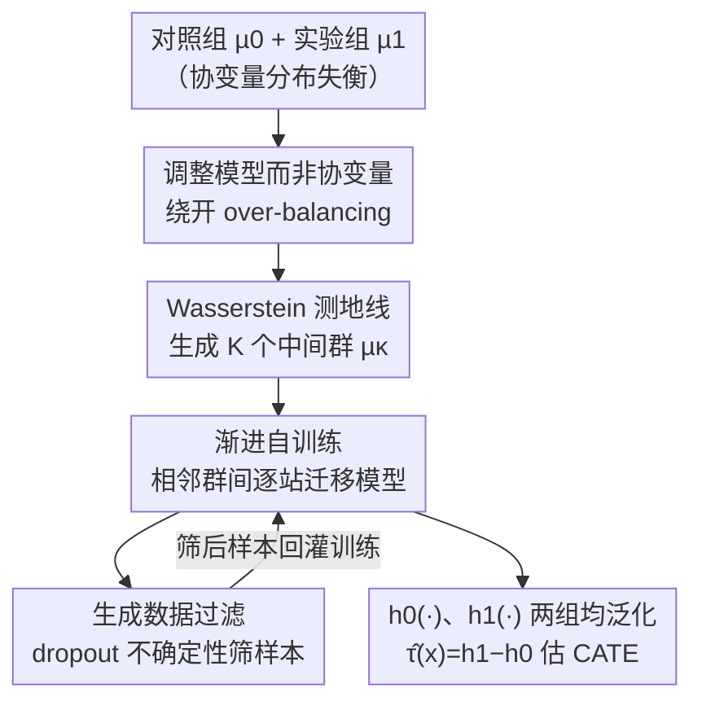

# Adjusting Prediction Model Through Wasserstein Geodesic for Causal Inference

**会议**: ICLR 2026  
**OpenReview**: [https://openreview.net/forum?id=pYLoHuLV45](https://openreview.net/forum?id=pYLoHuLV45)  
**代码**: 待确认  
**领域**: 因果推断 / 反事实预测  
**关键词**: 因果推断, 最优传输, Wasserstein 测地线, 渐进自训练, 反事实预测

## 一句话总结
针对因果推断里"实验组和对照组分布失衡导致预测模型无法跨组泛化"的问题，本文提出 G-learner：不再像主流方法那样去对齐协变量（会丢掉预测信息、产生 over-balancing），而是沿着两组分布之间的 Wasserstein 测地线生成一串中间群，再用渐进自训练把预测模型从一组逐步搬到另一组，在 News/Twins/Jobs 和仿真数据上把 PEHE/ATE 误差压到 SOTA 或与之持平。

## 研究背景与动机
**领域现状**：因果推断要估计处理效应（treatment effect），标准做法是在 Rubin–Neyman 潜在结果框架下，分别在对照组（control, $t=0$）和实验组（treated, $t=1$）上训练结果预测模型 $h(x,0)$、$h(x,1)$，再用 $\hat\tau(x)=h(x,1)-h(x,0)$ 估计个体处理效应（CATE）。

**现有痛点**：由于混杂因子（confounder）同时影响处理分配和潜在结果，对照组和实验组的协变量分布差别很大（论文举例：做手术的病人通常病情更重）。结果是在一组上训练的模型搬到另一组上预测就失准——而 CATE 恰恰要求模型在两组上都能算反事实结果。主流的"平衡表示学习"（如 TARNet、CFR、BNN）通过学一个让两组分布对齐的表示来缓解，但它们容易**过度平衡（over-balancing）**：分布对齐的同时把对预测结果有用的判别性信息一并抹掉了，极端情况下两组塌成一个点、分布完美对齐但预测信息全没了。

**核心矛盾**：分布平衡和结果预测之间存在 trade-off。已有方法（Shalit et al. 2017）只能靠启发式折中，如何取得好的平衡点仍未解决。本质矛盾在于"动协变量"这条路本身就会损伤预测信息。

**本文目标 / 切入角度**：作者换了个方向——**不动协变量，转而调整结果预测模型本身**，让它在两组上同时泛化得好，从根上绕开 over-balancing。难点在于两组分布差异巨大，模型没法一步跨过去。作者的观察是：如果能在两组之间铺一条"平滑过渡"的路径，让相邻两站分布差异很小，模型就能一站一站地稳稳迁移过去。

**核心 idea**：用最优传输（optimal transport）诱导的 Wasserstein 测地线，在对照组和实验组之间生成一串平滑过渡的中间群，再用渐进自训练（gradual self-training）让预测模型沿着这条测地线逐步从一组迁移到另一组，并对生成样本做不确定性过滤来保证迁移质量。

## 方法详解

### 整体框架
给定有协变量偏移的对照组 $\mu_0$ 和实验组 $\mu_1$，G-learner 做三件事：①在两组之间求解最优传输，沿 Wasserstein 测地线生成一串由 $\kappa\in(0,1)$ 索引的中间群；②用自训练把在一组上训好的预测模型在相邻两个中间群之间一站站地迁移，直到覆盖另一组；③每一步迁移前用基于 dropout 的不确定性筛掉低置信生成样本。最终得到的 $h_0(\cdot)$ 能预测"未处理"潜在结果、$h_1(\cdot)$ 能预测"处理"潜在结果，二者在两组上都泛化良好，相减即得 CATE。作者还给出了效应估计误差 $\epsilon_{PEHE}$ 的上界（Theorem 1）作为理论支撑。

### 关键设计

**1. 调整模型而非协变量：从源头绕开 over-balancing**

这一点是全文的方法论基调，直接针对平衡表示学习的痛点。已有方法把对照组和实验组的协变量在表示空间里硬拉到一起，必然牺牲一部分对结果预测有用的判别信息；而本文的策略是保留全部协变量、不做任何对齐，转而让"预测模型"去适应两组——既然信息没被删，就不存在 over-balancing。代价是：模型要跨越两组之间巨大的分布偏移，这正是后面三个设计要解决的工程问题。这个视角的价值在于，它把"对齐分布"这个会损伤信息的操作，替换成了"迁移模型"这个不损伤信息的操作。

**2. Wasserstein 测地线生成中间群：把一步跨不过去的鸿沟铺成阶梯**

模型没法一步从 $\mu_0$ 跳到 $\mu_1$，作者用最优传输在两组之间造一条平滑过渡的路。先在两组经验分布之间解一个离散最优传输问题，得到传输方案 $\gamma^*$：

$$\gamma^*=\arg\min_{\gamma}\sum_{i=1}^{n_0}\sum_{j=1}^{n_1}\gamma_{ij}\lVert x_{0,i}-x_{1,j}\rVert_2^2,\quad \gamma\in\Gamma(\mu_0,\mu_1).$$

这是个约束线性规划，用 Earth Mover Distance 求解器即可。拿到 $\gamma^*$ 后，Wasserstein 测地线上参数为 $\kappa\in[0,1]$ 的中间分布（即两组的 Wasserstein 重心 barycenter）通过 push-forward 插值得到：

$$\mu_\kappa=\sum_{i=1}^{n_0}\sum_{j=1}^{n_1}\gamma^*_{ij}\,\delta\big((1-\kappa)x_{0,i}+\kappa x_{1,j}\big).$$

直觉上，$\kappa$ 从 0 滑到 1，生成样本就沿着连接对照样本和实验样本的"传输直线"平滑移动，每个非零 $\gamma^*_{ij}$ 既是生成样本 $x_{\kappa,ij}$ 的位置权重也是它的概率质量。取一串 $\kappa\in\{\tfrac{1}{K+1},\dots,\tfrac{K}{K+1}\}$ 就得到 $K$ 个中间群。和 GANITE 那类生成式方法比，测地线插值带有最优传输刻画的几何结构（样本是沿最短传输路径移动的），因此中间群更"贴合"真实分布过渡，对后续迁移更有利。

**3. 渐进自训练：让模型沿测地线一站站交接**

有了平滑阶梯，就用自训练把模型逐站搬过去。以预测未处理结果的 $h_0(\cdot)$ 为例：初始 $h_{0,0}(\cdot)$ 在对照组 $\mu_0$ 上用真实事实结果训练。它虽然在 $\mu_1$ 上不行，但在最近的中间群 $\mu_{1/(K+1)}$ 上表现会好很多（因为协变量偏移小得多）。于是用 $h_{0,0}$ 给 $\mu_{1/(K+1)}$ 的样本打伪标签，训出 $h_{0,1/(K+1)}$；后者再给下一站打标签……如此接力，最终得到能在实验组 $\mu_1$ 上预测未处理结果的 $h_{0,1}$。形式上，从 $\kappa_-=\kappa-\tfrac{1}{K+1}$ 迁到 $\kappa$ 是：

$$h_{0,\kappa}=\arg\min_h\sum_{x_\kappa\in\mu_\kappa}\ell\big(h(x_\kappa),\,h_{0,\kappa_-}(x_\kappa)\big),$$

损失用最优传输权重加权的平方损失 $\ell(h(x_{\kappa,ij}),h_{0,\kappa_-}(x_{\kappa,ij}))=\gamma^*_{ij}(h(x_{\kappa,ij})-h_{0,\kappa_-}(x_{\kappa,ij}))^2$。预测处理结果的 $h_1(\cdot)$ 则反方向走：从 $h_{1,1}$（在 $\mu_1$ 上用真实处理结果训练）沿测地线倒着迁回 $\mu_0$。"相邻两站差异小"是这个设计成立的关键——单步迁移的误差小，逐站累积后整体偏移才可控（Lemma 1 正是把相邻群误差用 $W_p(\mu_\kappa,\mu_{\kappa_-})$ 界住）。

**4. 生成数据过滤：用不确定性挡住噪声伪标签**

自训练最怕伪标签噪声被一路放大。每迁一站前，作者对中间群样本 $x_\kappa$ 做 $M$ 次开启 dropout 的前向传播，得到 $M$ 个预测 $\{\hat Y_{0,i}(x_\kappa)\}_{i=1}^M$，用它们的标准差 $\sigma(x_\kappa)$ 度量预测不确定性（这是把 dropout 当贝叶斯近似的经典做法）。只保留标准差最低的 $r$ 比例样本组成过滤后的群 $\tilde\mu_\kappa$，再在其上做迁移优化（把上式的 $\mu_\kappa$ 换成 $\tilde\mu_\kappa$）。这样高置信样本才参与训练，避免低质量生成样本污染接力链。$r$ 太小则可用样本不足、甚至退化到只用真实样本；$r$ 太大则引入太多低置信样本，实验里 $r=0.6$ 附近最优。

### 损失函数 / 训练策略
核心训练目标即上面的加权平方损失（Eq. 11/12），整套流程在附录 Algorithm 1 中给出。理论上，定义 $\tilde K=K+1$、$\Delta$ 为相邻分布的平均 Wasserstein 距离，作者证明效应估计误差有上界（Theorem 1）：

$$\epsilon_{PEHE}\le 2E(h_{0,0})+2E(h_{1,1})+2O\big(\tilde K\Delta+B(n,\tilde K,L,r)\big),$$

即 PEHE 被两组真实事实结果上的预测误差 $E(h_{0,0})$、$E(h_{1,1})$ 加上一个依赖样本量 $n$、中间群数 $\tilde K$、模型深度 $L$、过滤比例 $r$ 的余项界住；固定 $\tilde K,r,L$ 时，余项随 $n\to\infty$ 趋于零。这给"渐进迁移误差可控"提供了理论保证。

## 实验关键数据

### 主实验
在三个真实数据集（News、Twins、Jobs）的 out-sample 设定下对比，News/Twins 报 $\sqrt{\epsilon_{PEHE}}$ 与 $\epsilon_{ATE}$，Jobs 报 $R_{POL}$ 与 $\hat\epsilon_{ATT}$（越低越好）：

| 数据集 / 指标 | G-learner | 次优方法 | 说明 |
|--------|------|------|------|
| Twins $\sqrt{\epsilon_{PEHE}}$ | **0.3200** | 0.3202 (GANITE/BNN) | 持平最优 |
| Twins $\epsilon_{ATE}$ | **0.0084** | 0.0086 (DKLite) | 最优 |
| Jobs $R_{POL}$ | **0.1691** | 0.1730 (DKLite) | 最优 |
| Jobs $\hat\epsilon_{ATT}$ | **0.0596** | 0.0782 (BNN) | 明显最优 |
| News $\epsilon_{ATE}$ | **0.2451** | 0.4255 (ESCFR) | 大幅领先 |
| News $\sqrt{\epsilon_{PEHE}}$ | 2.8681 | 2.1524 (TARNet) | 次优梯队，PEHE 上不及 TARNet |

整体上 G-learner 在大多数指标取得最优或高度竞争的结果。作者归因：相比 OLS/BART/T-learner（每组单独训回归器）和 TARNet/DragonNet（共享表示+分头），G-learner 不受协变量偏移之苦；相比生成式的 GANITE，最优传输带来的几何信息让中间数据更有用；相比 BNN/CFR/ESCFR 这类平衡表示方法，G-learner 用上了全部特征、没有信息损失，从而避开 over-balancing。

### 仿真实验（不同混杂强度）
仿真数据通过调节 $m_c\in\{0.5,0.8,1.1,1.4\}$ 逐步加大两组差异以模拟不同程度的混杂偏差，out-sample 下 $\sqrt{\epsilon_{PEHE}}$：

| 配置 | G-learner | 次优 | 说明 |
|------|---------|------|------|
| $m_c=0.5$ | **0.20** | 0.27 (DragonNet) | 最优 |
| $m_c=0.8$ | **0.23** | 0.48 (CFR-Pro) | 最优 |
| $m_c=1.1$ | **0.29** | 0.38 (DragonNet) | 最优 |
| $m_c=1.4$ | **0.36** | 0.44 (CFR-Pro) | 最优 |

随混杂偏差增大所有方法都变差，但 G-learner 始终保持最佳，说明其对分布偏移的鲁棒性更强。

### 关键发现（敏感性分析）
- **中间群数量 $K$**：$K$ 从 0 增到 4 时 PEHE/ATE 持续改善——印证"铺阶梯让模型平滑迁移"的核心假设；$K$ 太大则生成样本过多、放大标签噪声导致轻微回落。News 上 $K=2\sim4$ 最佳，整体对 $K$ 不敏感、较稳定。
- **过滤比例 $r$**：News 上 $r=0.6$ 时 in/out-sample 的 PEHE 都最好；$r$ 太小样本不足甚至退化到只用真实样本，$r$ 太大引入过多低置信样本，两端都掉点——印证设计 4 的必要性。

## 亮点与洞察
- **换问题而非补丁**：面对 over-balancing，主流做法是在平衡和预测之间做启发式折中（治标）；本文直接把"调协变量"换成"调模型"（治本），从根上消除信息损失。这种"换掉会出问题的那一步"的思路很值得借鉴。
- **把 gradual domain adaptation 借进因果推断**：渐进自训练原本是域适应里对付大分布偏移的工具，作者敏锐地把"对照组↔实验组"看成两个域，用 Wasserstein 测地线造中间域，再逐站迁移——这种跨领域的概念迁移是论文最"啊哈"的地方。
- **生成中间群的几何性**：用最优传输 barycentric 插值而非 GAN 来造中间数据，样本沿最短传输路径移动、自带几何结构，比纯生成更贴合真实过渡，这点在和 GANITE 的对比里得到验证。
- **理论与方法咬合**："相邻群差异小→单步迁移误差小"不只是直觉，Lemma 1/2 和 Theorem 1 把它落到 $\epsilon_{PEHE}$ 的可证上界，且 $n\to\infty$ 时余项消失，理论支撑较完整。

## 局限与展望
- **超参与计算开销**：方法引入 $K$（中间群数）和 $r$（过滤比例）两个超参，且每个中间群要解一次最优传输 + 做 $M$ 次 dropout 前向；$K$ 大时生成样本激增（每个 $\mu_\kappa$ 含 $n_0+n_1-1$ 个样本），在大规模数据上的可扩展性论文未充分讨论。
- **离散/类别协变量**：最优传输的代价函数用平方欧氏距离，对离散或类别型数据需先定义距离或学一个映射投到表示空间，这一步会引入额外设计、可能反过来影响"不动协变量"的纯粹性。
- **二值处理假设**：方法围绕 $t\in\{0,1\}$ 展开，连续处理或多值处理下如何沿测地线生成中间群、如何接力迁移，尚未给出。
- **缺少模块消融**：正文给了 $K$、$r$ 的敏感性，但没有"去掉数据过滤 / 去掉渐进自训练只一步迁移"这类拆解式消融，各组件单独贡献多少还看不清楚。
- **News 上 PEHE 偏弱**：在 News 的 $\sqrt{\epsilon_{PEHE}}$ 上不及 TARNet，说明该方法在某些数据上对个体级异质效应的刻画仍有提升空间。

## 相关工作与启发
- **vs 平衡表示学习（TARNet / CFR / BNN / ESCFR）**：他们学一个让两组对齐的表示来减小混杂偏差，本文不动表示、改去迁移模型；区别在于前者会因 over-balancing 丢预测信息，本文用上全部特征无信息损失，因而在多数指标更优。
- **vs 重加权方法（IPW / 熵平衡 / Yan et al. 2024 的半松弛 OT）**：他们用倾向得分或最优传输学样本权重来对齐分布，仍属"对齐"范式；本文用最优传输不是为对齐，而是为造中间群供模型迁移，用法上有本质不同。
- **vs 生成式方法（GANITE）**：GANITE 用 GAN 生成反事实，本文用 Wasserstein 测地线插值生成中间群，后者带几何结构、更贴合真实过渡，实验中更优。
- **vs 渐进域适应（He et al. 2024 等）**：本文把 gradual self-training 从域适应搬到因果推断，并加上数据过滤和针对 $\epsilon_{PEHE}$ 的理论分析，是对该范式在反事实预测场景下的扩展。

## 评分
- 新颖性: ⭐⭐⭐⭐⭐ 把"调模型替代调协变量"+ Wasserstein 测地线中间群 + 渐进自训练组合到因果推断，视角新颖
- 实验充分度: ⭐⭐⭐⭐ 三真实集 + 多强度仿真 + $K/r$ 敏感性较全，但缺组件级消融、News PEHE 偏弱
- 写作质量: ⭐⭐⭐⭐ 动机—方法—理论—实验链路清晰，公式规范；个别记号偏密
- 价值: ⭐⭐⭐⭐ 给混杂偏差提供了协变量调整之外的另一条路，理论+实证兼备，易迁移到域适应思路

<!-- RELATED:START -->

## 相关论文

- [\[ICLR 2026\] Conformalized Survival Counterfactuals Prediction for General Right-Censored Data](conformalized_survival_counterfactuals_prediction_for_general_right-censored_dat.md)
- [\[ICML 2025\] Classifier Reconstruction Through Counterfactual-Aware Wasserstein Prototypes](../../ICML2025/causal_inference/classifier_reconstruction_through_counterfactual-aware_wasserstein_prototypes.md)
- [\[ICLR 2026\] Foundation Models for Causal Inference via Prior-Data Fitted Networks](foundation_models_for_causal_inference_via_prior-data_fitted_networks.md)
- [\[ICLR 2026\] Exploratory Causal Inference in SAEnce](exploratory_causal_inference_in_saence.md)
- [\[ICLR 2026\] Ice Cream Doesn't Cause Drowning: Benchmarking LLMs Against Statistical Pitfalls in Causal Inference](ice_cream_doesnt_cause_drowning_benchmarking_llms_against_statistical_pitfalls_i.md)

<!-- RELATED:END -->
