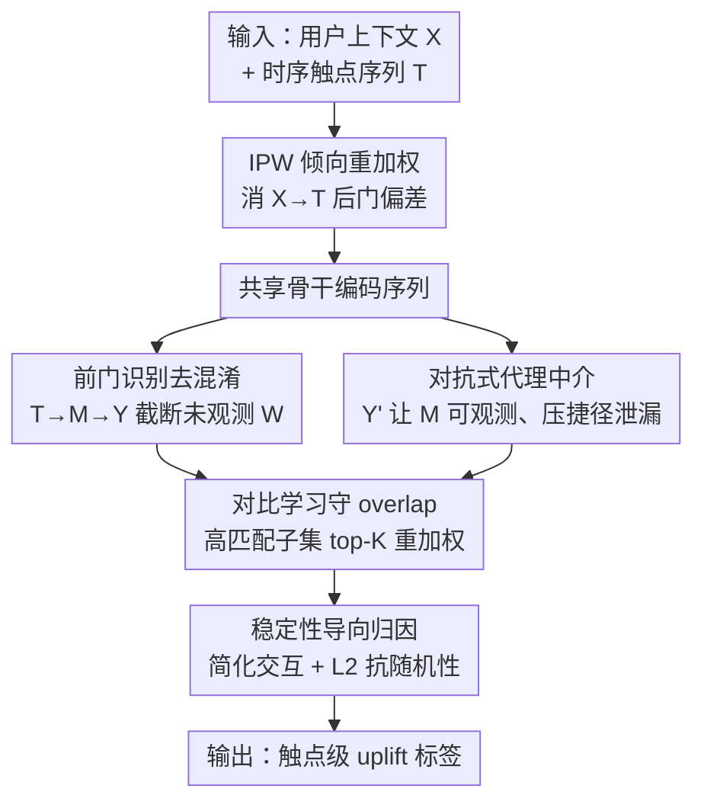

# ALM-MTA: Front-Door Causal Multi-Touch Attribution Method for Creator-Ecosystem Optimization

**会议**: ICLR2026  
**OpenReview**: [https://openreview.net/forum?id=3r68a6GOpg](https://openreview.net/forum?id=3r68a6GOpg)  
**代码**: 待确认  
**领域**: 因果推断 / 多触点归因  
**关键词**: 多触点归因、前门准则、对抗式中介、对比学习、推荐系统去混淆

## 一句话总结
针对短视频平台「消费驱动创作」场景中无真值标签、又存在系统级隐混淆的归因难题，本文用**前门准则 + 对抗式学习的代理中介**把每个消费触点对「用户是否上传」的因果 uplift 识别出来，并用对比学习保证大动作空间下的 overlap，在快手 4 亿 DAU 真实系统上把上传 AUC 提到 0.907（相对 SOTA +40%）、单位曝光效率提升 670%。

## 研究背景与动机

**领域现状**：在内容平台上存在稳定的「消费驱动创作」（Consumption Drives Production, CDP）规律——用户看了足够「有启发」的内容后，更可能从消费者转变为创作者（上传新内容）。平台想要量化「哪些消费触点真正激励了创作」，自然把它形式化成**多触点归因**（Multi-Touch Attribution, MTA）：用户消费序列里的多个历史触点共同导致最终的一次转化（上传），需要把功劳合理分摊到各触点上。归因结果直接决定激励设计、冷启动处理和重排优化，因此准不准至关重要。

**现有痛点**：工业界归因实践一般分两派——**严格规则法**精度高但覆盖极窄；**语义/路径相似法**覆盖广但缺乏因果可识别性，常把相关当成因果。两派都无法回答「在保留其余轨迹的前提下，从消费序列里删掉某一个视频，会让上传概率掉多少」这种反事实问题。更要命的是它们都依赖群体平均与相似度打分，忽略异质处理效应（HTE）、序列效应和触点间交互，给不出用户级的个性化效应。

**核心矛盾**：在大规模复杂推荐系统里，归因同时被三件事卡住：(i) 没有显式真值标签；(ii) 普遍存在多源混淆——尤其是推荐策略本身、用户意图、社交影响这类**未观测混淆** $W$；(iii) 候选触点空间是十亿量级的高基数。只有可观测混淆时，后门调整（IPW/DR）够用；但 $W$ 不可观测时，后门假设的「强可忽略性」根本不成立，单靠后门无法保证因果可识别。

**本文目标**：在没有 RCT、只有观测日志的条件下，给出**个性化、可复现**的触点级 uplift 估计，并能统一用于不同业务任务。

**切入角度**：既然后门走不通，就换一条识别路径——**前门准则**（front-door criterion）。其前提是找到一个完全截断 $T \to Y$ 因果通路的中介变量 $M$。但现实里这个真正的中介（用户看完视频后被触发上传的「动机路径」）是不可观测的，这正是前门准则在实践中长期难落地的原因。

**核心 idea**：用一个**对抗式训练、标签无关的代理 $Y'$** 把不可观测的中介 $M$「变得可观测」——代理蒸馏出结果信息以加强 $T\to M\to Y$ 的因果通路，同时用对抗目标压住 $Y'\to Y$ 的捷径泄漏；再配合对比学习与倾向重加权，在高基数动作空间里保住 positivity 和 overlap。一句话：**前门去混淆 + 对抗式代理中介**，把前门准则在工业级 MTA 上真正跑通。

## 方法详解

### 整体框架

ALM-MTA 把因果多触点归因当成一个「前门识别」问题在大规模推荐上做泛化：输入是用户上下文 $X$ 和时序处理序列 $T=\langle\tau_1,\dots,\tau_L\rangle$，输出是每个触点 $\tau_j$ 的个性化 uplift 标签。触点 $\tau_j$ 的 uplift 定义为「把它从序列中删掉后上传概率的反事实下降」：

$$\Delta(\tau_j\mid X,T)=P(Y=1\mid do(T),X)-P(Y=1\mid do(T\setminus\tau_j),X).$$

整条管线是这样转的：先用倾向得分（IPW）对观测日志重加权，缓解 $X\to T$ 带来的后门偏差；一个共享神经骨干编码序列后喂给两个协同的头：第一个是轻量 **ITE 头**，用学到的权重聚合触点 embedding，参数化 $P(Y\mid X,T)$ 的 logit，删掉某触点后重估 logit、两者相减就是 uplift；第二个是 **中介观测头**，由代理 $Y'$ 监督、并通过对抗学习捕捉 $T\to M\to Y$ 通路同时抑制 $Y'\to Y$ 的捷径泄漏。整个估计建立在三条去混淆策略（前门识别 + 对抗代理中介 + 倾向重加权）之上，再叠一个对比学习模块在高基数动作空间里守住 overlap。

### 关键设计

**1. 前门识别去混淆：用中介 $M$ 绕开不可观测的系统级混淆 $W$**

大规模推荐里 $W$（如推荐策略本身）既影响处理 $T$ 又影响结果 $Y$，且难以枚举，后门调整失效。本文构造因果图 $(X,W,T,M,Y)$，并论证它满足前门准则的三个条件：(i) 路径包含——所有 $T\to Y$ 的有向路径都经过 $M$；(ii) $M\to Y$ 无后门——未观测混淆不影响 $M$（或被 $X$ 阻断）；(iii) 给定 $T$ 阻断 $T\to M$ 的后门。于是标准前门公式给出

$$E[Y\mid do(T=t)]=\sum_m E[Y\mid do(M=m)]\,P(M=m\mid do(T=t)),$$

其中对 $E[Y\mid do(M=m)]$ 再做一次后门阻断（给定 $T,X$，$M\to Y$ 的后门全被堵住），最终把 $T$ 对 $Y$ 的因果效应完全表达成可从观测量估计的量。这就在 $W$ 不可观测的情况下保住了因果可识别性，是整套方法的理论地基。

**2. 对抗式代理中介：用标签无关的 $Y'$ 让中介可观测、又不泄漏结果**

前门准则的死穴是 $M$ 在实践中不可观测。本文引入与 $M$ 相关的代理变量 $Y'$（在 CDP 场景里，$Y'$ 度量用户新作品与候选触点之间按既定规则计算的相似度），用它监督一个中介分支产出嵌入 $\hat M$。但若直接拿 $Y'$ 去观测中介，会发生**捷径泄漏**——模型直接从 $Y'$ 读出结果 $Y$，判别力虚高（AUC 0.97）却严重不稳定、loss 剧烈震荡不收敛。为此加一个对抗目标：一个判别器试图从 $\hat M$ 预测 $Y$，而中介分支被优化去**压制这种可预测性**，于是 $\hat M$ 只保留 $T\to M\to Y$ 通路所需的信息、不直接暴露结果。一个附带好处来自条件方差单调性——把条件集从 $\{X,T\}$ 扩到 $\{X,T,Y'\}$ 满足

$$\mathrm{Var}(Y\mid X,T)\ge \mathrm{Var}(Y\mid X,T,Y'),$$

即引入 $Y'$ 能降低 uplift 估计方差，在每个触点数据稀疏的高基数场景里尤其值钱。

**3. 倾向重加权把观测日志「拉成随机化」**

数据驱动建模只能依赖历史曝光日志，而曝光由用户偏好和平台策略共同决定，干预路径 $do(T)$ 与经验日志分布 $P_{obs}$ 差异巨大，直接训练学到的是相关而非因果。本文给每个样本赋权 $w(x,t)=1/P_{obs}(T=t\mid X=x)$；在 positivity 与倾向模型正确设定下，重加权后的分布「就像在给定 $X$ 后随机化」。再叠上前门结构 $T\to M\to Y$，上传概率可分解成可从观测量估计的触点级反事实增益：

$$\text{upload}=\sum_t \text{uplift}_t=\sum_{\text{instance}} f(M,T,X)\,w(X,T),\quad f(M,T,X)=E[Y\mid M,T,X].$$

即「前门去混淆 + IPW」联手，让因果归因能直接从原始日志识别，并保证对隐混淆的无混淆性。

**4. 对比学习守 overlap + 稳定性导向训练**

因果识别要求每个单元对每种处理都有非零概率（positivity）。但在高基数动作空间里大量触点极罕见，对全体 $T$ 边缘化会违反 positivity、导致高方差。本文加一个对比学习模块：用 InfoNCE 把「上传前真实发生的代理-触点交互」作为正对、无关触点作为负对，学出匹配分 $\omega(\tau,Y')$ 衡量触点与代理结果的因果对齐强度；前门估计时只对高匹配子集 $\tau_{high}=\{\tau\mid \omega(\tau,Y')\in \text{top-}K\}$ 做边缘化并相应重加权，保证条件概率分母为正、满足 overlap 并降方差。与此并行，稳定性导向训练刻意简化特征交互、只保留稳健信号，再用 L2 正则压住对偶然波动的过拟合——目的是让同一统计流程下的因果结论不随随机种子、数据顺序漂移，保证归因可复现。

### 损失函数 / 训练策略
整体由「反事实归因骨干 + 对抗分支 + 对比分支」组成，单次前向 1.31B FLOPs（骨干 0.92B、对抗与对比 0.39B）。路径级归因信号会转成点式目标以支持可扩展分布式训练；并用 Direct Routing Gradient 缓解多目标之间的权衡冲突。线上采用流式训练，每小时构建 list-wise 的 Hive 表，正负样本比控制在约 2:3，分层负采样平衡算力与代表性。

## 实验关键数据

### 主实验
在 Criteo 转化预测任务上对比三类方法（统计学习 LR、深度学习 deepMTA、因果学习 DML/DESCN/causalMTA）。AUC/gAUC 衡量判别力，log-loss 衡量校准，avg AUUC 衡量分组因果 uplift 排序质量：

| 方法 | AUC | log-loss | gAUC | avg AUUC |
|------|------|----------|------|----------|
| LR | 0.5102 | 0.7833 | 0.5011 | 0.4725 |
| deepMTA | 0.7598 | 0.4108 | 0.6364 | 0.6277 |
| DML | 0.6498 | 0.5433 | 0.5031 | 0.8421 |
| DESCN | 0.5492 | 0.6920 | 0.5003 | 0.8429 |
| causalMTA | 0.8167 | 0.2835 | 0.6752 | 0.8493 |
| **ALM-MTA** | **0.9070** | **0.1384** | **0.8210** | **0.8686** |

ALM-MTA 在四项指标上全面最优：相对最强基线 causalMTA，AUC +0.09（约 +40% 相对提升口径以线上 SOTA 为基准）、log-loss 砍到 0.1384、gAUC 与分组 AUUC 同步领先。DML/DESCN 暴露出「分组 AUUC 高但 AUC/校准差」的不一致，说明它们在有序、稀疏处理上排序一致性不稳。

### 消融实验

| 配置 | AUC | UAUC | 说明 |
|------|------|------|------|
| DML 反事实基线（后门 + 特权输入） | 0.6498 | 0.50 | 仅后门无法解决系统级隐混淆 |
| 直接用 $Y'$ 观测中介 | 0.97 | 0.90 | 判别力虚高但**捷径泄漏**、loss 震荡不收敛 |
| + 对抗学习（间接观测中介） | 0.86 | 0.71 | 消除泄漏、收敛稳定 |
| + MoCo 式对比学习（完整 ALM-MTA） | **0.907** | **0.825** | 解决稀疏 overlap，判别力再提升 |

### 关键发现
- **对抗学习是稳定性的关键**：直接观测中介虽然 AUC 冲到 0.97，但严重泄漏、训练不收敛；加对抗后 AUC 回落到 0.86 却换来稳定收敛——这正是「判别力虚高 ≠ 因果有效」的典型反例。
- **对比学习补的是 overlap**：在十亿级高基数动作空间里，对比模块把稀疏触点的 positivity 守住，AUC/UAUC 从 0.86/0.71 进一步抬到 0.907/0.825。
- **线上真实增益**：4 亿 DAU、300 亿样本系统上，DAU +0.04%、日活创作者 +0.6%、单位曝光效率 +670%；统一阈值 0.54 下上传覆盖率 0.39→0.58（×1.49），每次覆盖上传的归因触点数 2.93→7.31（×2.49）；归因精度相对线上方法（P 4.32% / R 7.95%）提升到 P 21.88% / R 11.67%，头部高置信桶 Precision 达 54%。

## 亮点与洞察
- **把「不可观测中介」工程化为「对抗式可观测代理」**：这是全文最巧的一步——前门准则理论优雅却长期因为找不到可测中介而落不了地，本文用一个标签无关代理 $Y'$ + 对抗去泄漏，绕过了「必须完美测量中介」的苛刻条件。这个思路可迁移到任何「有理论中介但测不到」的因果识别场景。
- **用反事实删除定义 uplift 很贴业务**：「删掉某视频上传概率掉多少」既是清晰的因果量，又天然产出触点级可解释标签，直接喂给重排和激励分配。
- **判别力与因果有效性解耦**：消融里 AUC 0.97 却泄漏、AUC 0.86 才稳定的对比，提醒大家在因果归因里不能只盯 AUC，gAUC/分组 AUUC + 稳定性才是真信号。

## 局限与展望
- **前门三条件的现实成立性存疑**：方法严重依赖「所有 $T\to Y$ 路径都过 $M$」「$M\to Y$ 无未观测后门」这些假设，论文用因果图论证但缺少对假设违背时鲁棒性的实证。
- **代理 $Y'$ 由既定规则/相似度构造**：$Y'$ 的质量直接决定中介观测好坏，规则设计本身可能引入偏置，且换平台/场景未必可迁移。
- **Criteo 与线上口径不一**：离线 AUC 0.907 与线上「+40% AUC」的基准不同，横向比较需谨慎；线上增益虽显著但绝对值（DAU +0.04%）偏小，需结合规模理解。
- **可改进方向**：把代理学习从规则驱动改为可学习、对前门假设做敏感性分析、或引入多代理/多中介以覆盖更复杂的创作动机路径。

## 相关工作与启发
- **vs 数据驱动 MTA（Shapley / Markov / RNN 路径模型）**：它们多为相关性方法，隐含假设触点外生，无法处理真实系统的混淆偏差；本文直接做因果识别。
- **vs 后门类因果 MTA（IPW / DR / causalMTA）**：依赖「强可忽略性」，要求所有共因都被观测——在有推荐策略等隐混淆的生态里几乎不成立；本文用前门准则正面绕开这一限制。
- **vs 前门 / 代理类方法**：以往要么假设中介完全可观测，要么用代理近似隐混淆来减偏；本文把重点放在「让中介可观测」并用对抗防泄漏，同时用对比学习解决高基数处理的 positivity，是这些方向第一次被系统性地整合进 MTA。

## 评分
- 新颖性: ⭐⭐⭐⭐⭐ 首次把前门准则 + 对抗式代理中介系统性落地到工业级 MTA，解决「中介不可观测」这一长期死结。
- 实验充分度: ⭐⭐⭐⭐ 离线基准 + 4 亿 DAU 线上全链路验证扎实，但前门假设缺敏感性分析、离线/线上口径不完全一致。
- 写作质量: ⭐⭐⭐⭐ 因果推导清晰、动机递进自然；部分符号与图表 OCR 噪声较大。
- 价值: ⭐⭐⭐⭐⭐ 真实大规模系统上拿到可观供给侧增益与 670% 单位曝光效率提升，工业落地价值高。

<!-- RELATED:START -->

## 相关论文

- [\[ICLR 2026\] Debiased Front-Door Learners for Heterogeneous Effects](debiased_front-door_learners_for_heterogeneous_effects.md)
- [\[ICLR 2026\] Causal Score Conditioning for Multi-Resolution Latent Systems](causal_score_conditioning_for_multi-resolution_latent_systems.md)
- [\[ICLR 2026\] Counterfactual Structural Causal Bandits](counterfactual_structural_causal_bandits.md)
- [\[ICLR 2026\] Coarse-to-Fine Learning of Dynamic Causal Structures](coarse-to-fine_learning_of_dynamic_causal_structures.md)
- [\[ICLR 2026\] Causal Discovery in the Wild: A Voting-Theoretic Ensemble Approach](causal_discovery_in_the_wild_a_voting-theoretic_ensemble_approach.md)

<!-- RELATED:END -->
