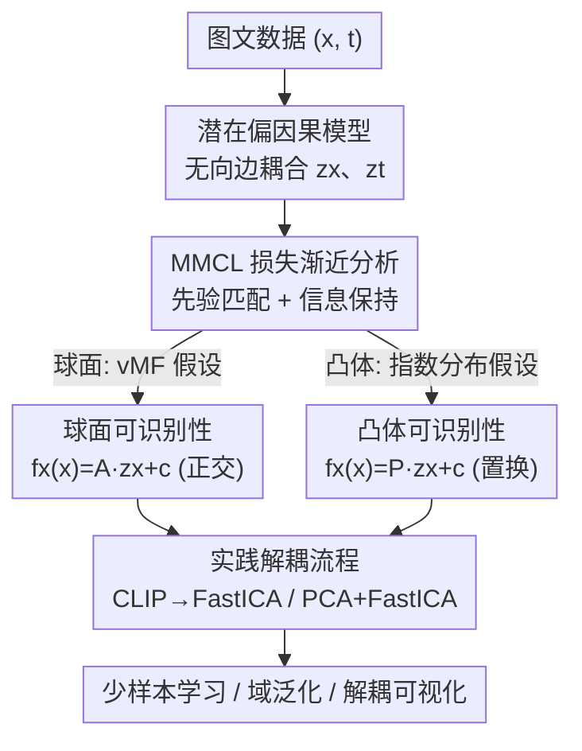

# Beyond DAGs: A Latent Partial Causal Model for Multimodal Learning

**会议**: ICLR2026  
**OpenReview**: [https://openreview.net/forum?id=bZqCBgm2N0](https://openreview.net/forum?id=bZqCBgm2N0)  
**论文**: [Project Page](https://sites.google.com/view/yuhangliu/projects/bedags)  
**代码**: 待确认（作者称发表后公开）  
**领域**: 因果表示学习 / 多模态VLM  
**关键词**: 潜在偏因果模型、多模态对比学习、可识别性、解耦表示、CLIP

## 一句话总结
本文指出大规模多模态数据并不服从单一有向无环图（DAG）的生成假设，提出一个用"无向边连接两组潜在耦合变量"的潜在偏因果模型，并在球面和凸体两种潜在空间上证明：CLIP 这类多模态对比学习（MMCL）学到的表示与真实潜变量分别相差一个线性正交变换 / 置换变换，从而第一次给出 MMCL 的"逐分量解耦"理论保证，并把它落到 FastICA / PCA+FastICA 这种即插即用的解耦流程上，在少样本学习和域泛化上拿到提升。

## 研究背景与动机
**领域现状**：以 CLIP 为代表的多模态模型靠多模态对比学习（MMCL）对齐图文，成功被广泛归因于"在大规模数据上学到了高质量跨模态表示"。近期有一条研究路线用**潜在因果模型 + 可识别性分析**来解释这种成功：把"学到的表示能否恢复出数据背后的高层潜在因果变量"形式化，从理论上证明对比学习确实在做某种潜变量恢复。

**现有痛点**：这条路线几乎都默认潜在因果变量服从一个 **DAG（有向无环图）** 结构。但作者观察到，真实的大规模图文数据来自**异质、甚至方向相反**的生成机制：一部分对是"文 → 图"（先有文本指令再生成图像，如 text-to-image），另一部分对是"图 → 文"（先从网上收集图像再由人标注描述，如 image captioning）。这两种机制对应**因果方向恰好相反**的 DAG。

**核心矛盾**：要把所有数据塞进**单一** DAG，就必须在两个相互冲突的因果方向里二选一，这与数据真实的混合生成过程矛盾。结果是：以往基于 DAG 的可识别性结果只在"小规模、单一生成机制"的合成数据上成立，停留在仿真实验，对 CLIP 这种真实大模型几乎没有可操作的指导。

**本文目标**：(1) 找一个不预设单一因果方向、却仍能刻画跨模态"可迁移知识"的生成模型；(2) 在这个模型下证明 MMCL 到底恢复了什么；(3) 把理论变成对预训练 CLIP 可直接用的解耦工具。

**切入角度**：既然图、文之间"谁因谁果"没有统一答案，那就**不强行定方向**——用一条**无向边**连接两侧的语义潜变量，表示双向共享的可迁移知识，把"方向"这个争议从模型里拿掉。

**核心 idea**：用"无向边耦合的潜在偏因果模型"替代 DAG，再证明 MMCL 等价于在恢复这组耦合潜变量（球面上差正交变换、凸体上差置换），从而既解释 MMCL 为何有效、又顺手给出 CLIP 的解耦配方。

## 方法详解

### 整体框架
全文是一条"从生成假设 → 理论 → 实践"的链路，而不是一个网络结构。先用**潜在偏因果模型**描述图文数据怎么生成；再分析 MMCL 对比损失在样本量趋于无穷时的**渐近形式**，发现它同时包含"先验匹配"和"信息保持"两件事；接着在**球面**和**凸体**两类潜在空间上分别给出**可识别性定理**，说明 MMCL 学到的表示与真实潜变量相差一个简单变换；最后把"相差一个线性/置换变换"这件事变成可操作的**线性解混流程**（FastICA，必要时先 PCA），直接作用在预训练 CLIP 的表示上得到解耦特征，喂给少样本/域泛化下游。

### 关键设计

**1. 潜在偏因果模型：用无向边替代有争议的因果方向**

针对"单一 DAG 装不下图、文相反生成方向"这个痛点，作者把潜在空间切成两块：一侧的**语义潜变量** $z_x$（如图像里的物体类别、场景类型）和**模态专属潜变量** $m_x$（如背景噪声、视觉伪影），另一侧对称地有 $z_t$（文本主题/意图）和 $m_t$（句法结构）。观测由 $x=g_x(z_x,m_x)$、$t=g_t(z_t,m_t)$ 生成，其中 $g_x,g_t$ 假设可逆可微，保证潜在信息可被恢复。关键之处在于：$z_x$ 与 $z_t$ 之间不画箭头，而是画一条**无向边**——它表示双向共享的"可迁移知识"，从而既不站队"文→图"也不站队"图→文"，把 Figure 1 里那几种相互冲突的 DAG 统一成一个不需要指定方向的"偏因果"模型。$m_x,m_t$ 则承接各模态独有、不可迁移的细节，被显式分离出去。

**2. MMCL 损失的渐近分析：把对比学习拆成"先验匹配 + 信息保持"**

要证明 MMCL 在恢复 $z_x,z_t$，先得看清它在优化什么。作者对标准多模态对比损失 $L$ 取样本量 $N\to\infty$ 的极限，得到一个由三项构成的渐近表达式（Theorem 3.1，是 Wang & Isola 2020 单模态结论的多模态推广）：第一项是正配对的跨模态对齐 $\mathbb{E}_{(x,t)}[d(f_x(x),f_t(t))/\tau]$，对应**先验匹配**——让一个模态充当另一个模态的先验信号，约束解空间、缓解潜变量恢复里的非唯一性；后两项是对每个模态在另一模态上的 log 期望，可近似为交叉熵 $-H(p(f_x(x)),p(f_t(t)))-H(p(f_t(t)),p(f_x(x)))$，对应**信息保持**——逼着两模态表示分布对齐且充分铺满潜变量结构。本设计的价值在于：以往"对齐-均匀性"（先验匹配）和"信息保持"是两条**分开**研究的脉络，本文第一次在多模态语境下把它们**合并成同一个目标的两个组成部分**，由此论证 MMCL 天然具备恢复潜变量的潜力。

**3. 双空间可识别性保证：球面给线性、凸体给置换**

有了渐近形式还不够，需要严格证明"恢复"到什么程度。作者对潜在空间做两种参数化并各证一个定理。**球面**上（Theorem 4.1 + Corollary 1）：设 $p(z_x)$ 为单位超球面上的均匀分布、$p(z_t\mid z_x)$ 为 von Mises–Fisher 分布，则最优解满足 $f_x\circ g_x=f_t\circ g_t$，损失退化为对称交叉熵，进而证明 $f_x(x)=A z_x+c$，其中 $A$ 是**正交矩阵**——即表示与真实潜变量相差一个线性正交变换。**凸体**上（Theorem 4.2 + Corollary 2）：设 $p(z_x)$ 在凸体上均匀、$p(z_t\mid z_x)$ 为指数族分布，则 $f_x(x)=P z_x+c$，其中 $P$ 是**带缩放的置换矩阵**——表示已经**逐分量解耦**。这两个定理把多模态对比学习和单模态对比学习的理论桥接起来（核心是处理 $m_x,m_t$ 和 $g_x,g_t$ 带来的非对称性），是全文从"潜力"走到"原理"的关键一步，也是首个给出 MMCL 逐分量解耦保证的结果。

**4. 从原理到实践：用 FastICA / PCA+FastICA 把 CLIP 解耦**

理论说"差一个正交/置换变换"，那就**把这个变换解出来**。在假设真实潜变量各分量相互独立时，由 Corollary 1，球面情形下 CLIP（因 L2 归一化天然落在单位球面，满足推理空间条件）的表示只需过一遍**线性解混 FastICA**，就能把混合矩阵 $A$ 解出来、还原解耦表示；这里超球面的维度 $M-1$ 也给出独立分量个数的上界。凸体情形（Corollary 2）下 CLIP 因 L2 归一化违反"推理空间是凸体"的条件，作者退一步用**局部等距**近似：先对表示做 **PCA**、再用 **FastICA** 抵消 PCA 引入的正交变换，得到 PCA+FastICA 流程。这两条流程都是**即插即用**、无需重训 CLIP，直接把"理论上可解耦"变成下游可用的解耦特征，用于少样本学习和域泛化。

### 损失函数 / 训练策略
本文不引入新的训练损失，分析对象是标准多模态对比损失（CLIP/InfoNCE 形式）：

$$L = -\frac{1}{N}\sum_{i=1}^{N}\log\frac{e^{-d(f_x(x_i),f_t(t_i))/\tau}}{\sum_{j=1}^{N} e^{-d(f_x(x_i),f_t(t_j))/\tau}} -\frac{1}{N}\sum_{i=1}^{N}\log\frac{e^{-d(f_x(x_i),f_t(t_i))/\tau}}{\sum_{j=1}^{N} e^{-d(f_x(x_j),f_t(t_i))/\tau}}$$

其中 $d$ 为距离度量（球面上用余弦相似度、凸体上用 $L_1$ 范数诱导的距离），$\tau$ 为可学习温度。"训练策略"层面，本文的操作发生在**推理后处理**：对冻结 CLIP 的输出套 FastICA 或 PCA+FastICA 解混，再训练一个线性分类器。

## 实验关键数据

### 主实验
合成实验用线性可识别性的判定系数 $R^2$（对应 Corollary 1）和置换可识别性的平均相关系数 MCC（对应 Corollary 2）来验证理论；满足假设时几乎完美恢复，且在分布/空间假设被部分违反时仍稳健。

| 设置（合成） | 指标 | 假设满足时 | 假设部分违反时 |
|--------|------|------|----------|
| 球面（U / vMF → 球面 vMF） | $R^2$ | 99.5 ± 0.1 | 88.5 ~ 96.3（换 Laplace/Normal/无界空间仍 ≥88） |
| 凸体（U / Laplace → 凸体 Laplace） | MCC | 99.1 ± 0.1 | 95.6 ~ 98.6（换 GenNorm/无界空间仍 ≥95） |

真实数据上以 2-shot 学习（SOURCE=ImageNet）和域泛化（TARGET=ImageNet-V2/Sketch/R/A）评测，比较：① Linear Probe、② Linear Probe + FastICA、③ Linear Probe + PCA + FastICA。

| 编码器 | 方法 | ImageNet (源) | 域泛化 AVG |
|--------|------|------|----------|
| ViT-B/16 | ① Linear Probe | 44.97 | 32.51 |
| ViT-B/16 | ② +FastICA | 45.52 | 34.43 |
| ViT-B/16 | ③ +PCA+FastICA | **46.57** | **37.13** |
| RN50 | ① / ③ | 31.95 / 34.12 | 15.77 / 18.99 |

### 消融实验
论文未做传统"去模块"消融，而是用**假设违反实验**和**解混流程对比**充当消融。

| 配置 | 关键指标 | 说明 |
|------|---------|------|
| Linear Probe（原始 CLIP 特征） | 基线 | 不解耦，作为对照 |
| + FastICA | 源域、域泛化普遍↑ | 验证球面情形的解耦（Corollary 1）有效 |
| + PCA + FastICA | 进一步↑（尤其域泛化） | 验证凸体情形的局部等距近似（Corollary 2）有效 |
| 假设部分违反（换分布/空间） | $R^2$/MCC 仅小幅下降 | 说明可识别性对假设不敏感 |

### 关键发现
- **PCA+FastICA 在域泛化上提升最明显**：ViT-B/16 上域泛化平均从 32.51 提到 37.13（+4.6），印证"解耦表示更抗分布漂移"。
- **理论对假设不敏感**：损失渐近主要依赖期望计算，对边缘/条件分布形式和空间几何（球面 vs 凸体）有较强容忍度，这是合成实验里假设违反仍稳健的直觉解释。
- **即插即用**：把 FastICA 套进 Tip-Adapter / Tip-Adapter-F，在 11 个数据集上少样本性能进一步提升，说明解耦后处理可叠加到现有 CLIP 适配方法上。
- CelebA 上做潜空间遍历（先 CLIP 取特征、FastICA 解混、再训解码器重建），能分离出"微笑/性别+胡子/眼镜/脸型"等 16 个属性中的可解释维度，定性印证解耦。

## 亮点与洞察
- **"无向边"是点睛之笔**：当"谁因谁果"在数据层面本就无统一答案时，与其强行选一个方向，不如把方向这个争议从模型里删掉——用无向耦合表达双向可迁移知识，既诚实又让理论可做。这种"遇到方向之争就退到无向"的建模思路可迁移到其他异质来源的表示学习。
- **把两条割裂的对比学习理论缝起来**：先验匹配（对齐-均匀性）和信息保持原本各说各话，本文在多模态渐近分析里证明它们是同一目标的两项，给"对比学习为何学到好表示"一个更统一的解释。
- **首个 MMCL 逐分量解耦保证，并且能落地**：理论不止停在"可识别"，还把"差一个正交/置换变换"直接翻译成 FastICA / PCA+FastICA 的解混配方，对冻结 CLIP 即插即用——这是它区别于以往纯仿真可识别性工作的最大价值。
- **可迁移 trick**：对任何 L2 归一化、对比训练的双塔模型，"先 PCA 抵消推理空间几何失配、再 FastICA 解混"可作为通用的解耦后处理。

## 局限与展望
- **作者承认的局限**：核心结论依赖一组参数化假设（Eqs. (4)/(7)：均匀先验、vMF/指数条件分布、$g$ 可逆可微、潜变量分量独立），现实中未必严格成立；好在合成实验显示假设部分违反时结论仍大体成立。
- **凸体情形理论与 CLIP 不完全匹配**：CLIP 的超球面推理空间违反凸体条件，只能靠"局部等距"近似 + PCA 补救，属于工程权宜，缺乏全局保证。
- **解耦依赖"分量独立"这一强假设**：真实语义属性往往相关（如性别与胡子），FastICA 的独立性前提在多大程度上成立没有定量刻画；可视化里也只展示了 16 个属性中的少数。
- **改进方向**：放松独立性假设到弱相关/分组独立；把解耦潜力进一步用于操控扩散模型等生成模型（作者在结论里点到的开放方向）；给 PCA+FastICA 的近似误差一个可控的理论界。

## 相关工作与启发
- **vs 基于 DAG 的可识别性分析（Daunhawer et al. 2023 / Yao et al. 2023 / Gresele et al. 2020）**：他们假设潜变量服从单一 DAG，只能覆盖小规模、单一生成机制的数据，停在仿真；本文用无向耦合的偏因果模型容纳相反因果方向，并把结论落到真实 CLIP，覆盖范围和可操作性都更强。
- **vs 单模态对比学习理论（Wang & Isola 2020 的对齐-均匀性；Oord et al. 2018 的信息保持）**：本文是其在多模态下的推广，并首次把这两个原本分立的视角合并；区别在于要额外处理模态专属变量 $m_x,m_t$ 与异质生成过程 $g_x,g_t$ 带来的非对称性。
- **vs Tip-Adapter / Tip-Adapter-F（Zhang et al. 2022a）**：它们做少样本 CLIP 适配但用原始表示；本文证明换成 FastICA 解耦表示后即插即用地涨点，说明解耦是对现有适配方法的正交增益。

## 评分
- 新颖性: ⭐⭐⭐⭐⭐ 用无向偏因果模型跳出 DAG 框架，并首次给出 MMCL 逐分量解耦保证，视角与结论都新。
- 实验充分度: ⭐⭐⭐⭐ 合成 + 16 个真实数据集 + 少样本/域泛化/解耦可视化覆盖充分，但缺传统消融、解耦定量指标偏少。
- 写作质量: ⭐⭐⭐⭐⭐ "潜力→原理→实践"三段递进清晰，理论与直觉解释兼顾。
- 价值: ⭐⭐⭐⭐⭐ 既深化了对 MMCL/CLIP 为何有效的理论理解，又给出即插即用的解耦工具，理论与应用双落地。

<!-- RELATED:START -->

## 相关论文

- [\[ICLR 2026\] Conditional Independent Component Analysis for Estimating Causal Structure with Latent Variables](conditional_independent_component_analysis_for_estimating_causal_structure_with_.md)
- [\[ICLR 2026\] Characterization and Learning of Causal Graphs with Latent Confounders and Post-treatment Selection from Interventional Data](characterization_and_learning_of_causal_graphs_with_latent_confounders_and_post-.md)
- [\[ACL 2026\] Learning Invariant Modality Representation for Robust Multimodal Learning from a Causal Inference Perspective](../../ACL2026/causal_inference/learning_invariant_modality_representation_for_robust_multimodal_learning_from_a.md)
- [\[AAAI 2026\] Sparse Additive Model Pruning for Order-Based Causal Structure Learning](../../AAAI2026/causal_inference/sparse_additive_model_pruning_for_order-based_causal_structure_learning.md)
- [\[ICLR 2026\] Causal Score Conditioning for Multi-Resolution Latent Systems](causal_score_conditioning_for_multi-resolution_latent_systems.md)

<!-- RELATED:END -->
