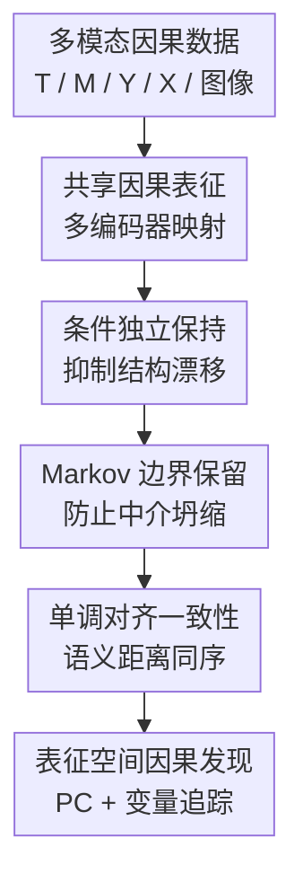

# CARL: Preserving Causal Structure in Representation Learning

**会议**: ICLR2026  
**OpenReview**: [https://openreview.net/forum?id=I43IOiimO6](https://openreview.net/forum?id=I43IOiimO6)  
**代码**: 待确认  
**领域**: 因果推断  
**关键词**: 因果表征学习, 跨模态对齐, 条件独立, Markov 边界, 可识别性

## 一句话总结
CARL 研究跨模态表征学习中的因果结构漂移问题，通过条件独立保持、Markov 边界保留和单调对齐一致性三类约束，把多模态数据映射到共享表征空间时尽量保住原始因果图中的独立关系、媒介变量信息和因果效应可识别条件。

## 研究背景与动机
**领域现状**：跨模态表征学习通常把图像、表格、文本或其他模态编码到同一个向量空间里，再用重建损失、对比学习、相关性最大化或大规模预训练目标来让不同模态对齐。CLIP、ImageBind、ALIGN、DCCA 这类方法在语义检索和迁移学习上很强，但它们主要优化统计相关性和几何邻近性，并不显式关心原始变量之间的因果图是否被保留下来。

**现有痛点**：如果学习到的表征只追求预测或对齐，它可能把本来不存在的依赖关系编码出来，也可能把真正重要的中介变量压缩掉。论文把这种现象称为 representation-induced structural drift，即表征诱导的结构漂移。这个问题在普通分类任务里可能只是可解释性变差，但在因果推断里会直接伤到干预效应估计、反事实推理和分布外泛化：原始空间里可以用 backdoor、frontdoor 或工具变量识别的因果查询，到了表征空间里未必还可识别。

**核心矛盾**：跨模态学习希望用一个紧凑共享空间吸收不同模态的信息，而因果推断希望保留条件独立、Markov 边界和可识别性这些结构性信息。高信息密度模态的重建需求可能压过低信息密度模态中的关键因果变量；语义相似样本在共享空间里未必按距离单调排列；原始变量满足的 backdoor/frontdoor/IV 条件也没有自动迁移到表征变量上。

**本文目标**：作者希望给跨模态表征学习加上一组可验证的因果结构保持原则。具体来说，学到的表征应该满足三件事：第一，原始图里成立的条件独立关系在表征空间里仍近似成立；第二，中介变量的表征不能因为压缩而丢掉对结果有用的信息；第三，语义差异和表征距离之间应保持单调一致，从而让几何邻近不只是好看的 embedding，而能服务结构一致性。

**切入角度**：CARL 没有试图重新发明一个完整的多模态骨干网络，而是把因果约束写进跨模态对齐目标。这样做的好处是目标函数直接对应因果结构保持原则：条件互信息约束负责抑制伪依赖，InfoNCE 形式的 Markov 边界保留负责防止中介变量坍缩，Spearman 单调相关损失负责把语义排序和向量距离绑在一起。

**核心 idea**：用“因果结构保持约束”替代单纯的统计对齐，让跨模态共享表征不仅能对齐语义，还能近似保留原始因果图中的条件独立、关键中介信息和效应可识别条件。

## 方法详解
CARL 的方法可以理解为一个面向因果推断的跨模态表征学习框架。它先定义原始变量图，包括处理变量 $T$、中介变量 $M$、真实结果 $Y^*$ 和协变量 $X$，再把表格变量和图像模态分别编码为共享空间里的 $Z_T, Z_M, Z_Y, Z_{I_M}, Z_{I_Y}$。训练时，CARL 不只让配对模态靠近，还把“原始因果图应该保留什么”转成几个可优化的损失。

### 整体框架
整体流程从一个带因果含义的多模态数据集出发：表格变量提供处理、中介、结果或协变量，图像模态可以表示中介图像 $I_M$，也可以表示结果代理图像 $I_Y$。编码器族 $E=\{E_T,E_M,E_{I_M},E_{I_Y}\}$ 把这些输入映射到共享表征空间，然后在这个空间里共同优化三类结构保持损失和常规对齐/正则项。最后，论文还在表征空间上运行条件独立检验和 PC 算法，再用变量追踪映射 $\pi$ 把潜在图投回原始变量层面，检验学到的结构是否还能服务因果发现和效应分解。

论文考虑三种跨模态配置。IM 配置把图像当作中介 $M$ 的观测，比如视网膜图像承载血管中介信息；IY 配置把图像当作结果 $Y^*$ 的代理，需要从图像中抽取可校准的观测结果 $Y=\phi(I_Y)$；DUAL 配置同时有中介图像和结果图像，但训练和条件独立检验中避免把 $I_M$ 和 $I_Y$ 同时放进同一个 conditioning set，以免打开 collider 路径。

### 关键设计
**1. 条件独立保持：用条件互信息约束阻止表征制造伪因果边**

CARL 首先把原始图里的关键独立关系写成表征空间中的约束。若原始因果结构要求 $T \perp Y^* \mid M$，那么共享表征也应满足 $MI(Z_T;Z_Y\mid Z_M)$ 很小。直接估计条件互信息很难，论文采用两个相互独立的预测头来近似：一个预测头 $q_\theta(y\mid z_t,z_m)$ 看得到处理表征和中介表征，另一个预测头 $q_\phi(y\mid z_m)$ 只看得到中介表征。对应损失写作 $L_{CI}=\mathbb{E}[-\log q_\phi(y\mid z_m)]-\mathbb{E}[-\log q_\theta(y\mid z_t,z_m)]$。

这个差值的直觉是：如果在给定 $Z_M$ 后，额外加入 $Z_T$ 并不能更好地预测 $Y$，那么 $Z_T$ 和 $Y$ 在 $Z_M$ 条件下就没有额外依赖。用两个独立参数化的预测头也很关键，因为共享头可能通过参数耦合低估或扭曲条件互信息。这个设计直接针对结构漂移里的“伪依赖”问题：普通对齐目标可能让 $T$ 的信息绕开中介直接进入结果表征，而 $L_{CI}$ 会惩罚这种绕路。

**2. Markov 边界保留：用中介-结果互信息下界防止压缩把关键变量抹掉**

单独最小化条件互信息有一个危险的捷径：模型可以把 $Z_M$ 学成没信息的常量，这样很多条件独立看起来都成立，但因果推断已经失去中介变量。CARL 用 Markov boundary retention loss 防止这种“靠遗忘实现独立”的伪解。它用 $Z_M$ 和结果嵌入 $\psi_Y(Y)$ 构造 InfoNCE 目标，形式上是 $L_{MBR}=-InfoNCE(z_m,\psi_Y(y))$，从而提高 $MI(Z_M;Y)$ 的下界。

这一步对应 CSP 原则里的 Markov 边界保留：中介变量必须保留对结果有预测力的信息，不能被高密度模态的重建目标或跨模态压缩吞掉。尤其在多模态医疗数据里，视网膜图像、睡眠信号、代谢特征和表格指标的信息密度差异很大；如果只做重建或对齐，高维图像的纹理/风格可能主导优化，而真正解释心血管风险的血管中介信号反而被淹没。$L_{MBR}$ 把“中介对结果仍有信息”作为硬性的训练压力。

**3. 单调对齐一致性：用 Spearman 相关把语义差异和表征距离对齐**

跨模态模型常说“相似样本应该靠近”，但如果这个相似性只是 batch 内对比学习给出的相对关系，它不一定保留真实语义变量的排序。CARL 在有语义标量 $a_i$ 的场景下，要求样本对的语义差异 $\Delta a_{ij}=|a_i-a_j|$ 和表征距离 $\Delta z_{ij}=\lVert z_i-z_j\rVert_2$ 保持单调一致。损失为 $L_{MAC}=-\rho_S(soft\ rank(\Delta a),soft\ rank(\Delta z))$，其中 $\rho_S$ 是 Spearman 秩相关，soft rank 让排序操作可微。

这个设计解决的是“几何近不等于语义近”的问题。比如两个样本在共享空间里距离很近，如果这种距离主要来自背景风格、成像设备或重建便利性，而不是来自真正的语义/生理差异，那么后续基于距离的检索、聚类或因果发现都会被误导。Spearman 约束不要求距离和语义差异线性对应，只要求排序关系一致，因此比直接回归绝对距离更适合不同模态尺度不一致的情况。

**4. 表征空间因果发现与变量追踪：让学到的潜变量还能回到可解释的因果图**

CARL 不只在训练阶段加损失，还把学到的联合表征 $\bar{Z}=(Z_T,Z_M,Z_Y,Z_{I_M},Z_{I_Y},Z_X)$ 当作因果发现对象。论文定义条件独立检验集合时加入一个互斥限制：conditioning set 里不能同时包含 $Z_{I_M}$ 和 $Z_{I_Y}$，避免 DUAL 场景下把中介图像和结果图像同时条件化后引入 collider bias。随后用偏典型相关/偏相关检验构建 skeleton，用 v-structure 和 Meek 规则定向，得到表征空间的 CPDAG。

为了让这个潜在图可解释，作者定义了从表征节点到原始变量的映射 $\pi$，例如 $\pi(Z_T)=T$，$\pi(Z_M^{tab})=\pi(Z_M^{img})=M$，$\pi(Z_Y)=Y^*$。这样，表征空间发现的边可以被投影回变量层面。理论上，在 faithfulness、Gaussian/偏相关检验一致性、最小非零偏相关和有界入度等条件下，PC 算法在表征空间是一致的；如果 $\pi$ 保持相容性，投影后的 CPDAG 与原始变量图拓扑等价。

### 损失函数 / 训练策略
CARL 的总目标是多项损失的加权和：$L(E)=w_{CI}L_{CI}+w_{MBR}L_{MBR}+w_{MAC}L_{MAC}+R(E)$。其中 $R(E)$ 包含常规跨模态对齐损失 $L_{align}$、风格一致性正则 $L_{style}$ 和信息瓶颈项 $L_{IB}$。如果没有语义排序标签，$w_{MAC}$ 可以设为 0；如果结果嵌入不可用，Markov 边界保留部分可以退化为能量式正则。论文还强调编码器采用 Lipschitz 约束、谱归一化或梯度裁剪来保证稳定性。

理论部分给出两个核心保证。第一，在可实现性、正则性和 Lipschitz 条件下，经验风险最小化的极限点满足 $\epsilon$-CSP，误差规模由编码器近似误差、样本量、负样本数量和 soft-rank 近似误差共同决定，大致写成 $\epsilon=\max\{\zeta^*,O_P(n^{-1/2}),O_P(K^{-1/2}),O_P(n^{-1/3})\}$。第二，如果原始空间里的因果查询 $Q=\mathbb{E}[Y^*(t)]$ 可由 backdoor、frontdoor 或工具变量条件识别，那么表征空间里的对应查询 $\tilde{Q}$ 与原查询的差距被 $|\tilde{Q}-Q|\le \kappa\epsilon+\delta_{cal}$ 控制，其中 $\delta_{cal}$ 是结果表征到真实结果的校准误差。

## 实验关键数据

### 主实验
论文用两类实验验证 CARL：一类是 MNIST 合成跨模态因果数据，有已知的 $T\rightarrow M\rightarrow Y^*$ 真值结构；另一类是 Human Phenotype Project 数据，用于检验真实多模态生物医学场景里的因果路径是否可解释。评价指标包括 Causal Structure Index (CSI)、Markov Boundary Retention Index (MBRI)、Monotonic Alignment Consistency (MAC)、Structural Accuracy 和 Representation Information Content (RIC)。

| 场景 / 对比 | 指标 | CARL | 对比方法 / 条件 | 结论 |
|--------|------|------|----------|------|
| 合成数据基线对比 | CSI | 1.00 | CLIP 0.25 | CARL 完整保留条件独立模式，CLIP 这类统计对齐方法明显漂移 |
| 合成数据基线对比 | Structural | 0.61 | ImageBind 0.33 | 结构恢复准确率明显高于通用跨模态绑定方法 |
| 样本量扩展 n=500 到 5000 | CSI | 1.00 | 不同样本量下保持 1.00 | 条件独立保持对样本量变化较稳定 |
| 噪声鲁棒性 σ=0.1 到 0.5 | MAC | 0.89 → 0.42 | CSI 仍为 1.00 | 噪声会伤语义-几何单调性，但结构独立关系仍能保住 |
| 噪声鲁棒性 σ=0.1 到 0.5 | MBRI | 0.77 → 0.63 | CSI 仍为 1.00 | 中介信息保留随噪声下降，但没有完全崩掉 |

HPP 真实数据中，CARL 在潜在空间恢复出多条与医学证据一致的心血管相关路径。最核心的一条是血压到心血管事件，总效应 TE 为 0.486，直接效应 NDE 为 0.271，间接效应 NIE 为 0.215，总中介比例为 44.24%。其中动脉僵硬贡献 19.96%，视网膜微血管变化贡献 15.23%，肾功能贡献 9.05%。此外，年龄、炎症、睡眠呼吸暂停、BMI 和肠道微生物也分别通过视网膜、PRV/HRV、代谢等中介连接到心血管风险。

### 消融实验
| 配置 | CSI | MBRI | MAC | Structural | 说明 |
|------|-----|------|-----|------------|------|
| CARL (Full) | 1.00 | 0.63 | 0.55 | 0.61 | 三个结构保持损失全部启用 |
| w/o $L_{CI}$ | 0.25 | 0.62 | 0.83 | 0.40 | 去掉条件独立后语义对齐更高，但结构保持大幅崩溃 |
| w/o $L_{MBR}$ | 0.75 | 0.46 | 0.54 | 0.52 | 中介信息保留下降，说明 Markov 边界约束必要 |
| w/o $L_{MAC}$ | 1.00 | 0.63 | 0.32 | 0.56 | 条件独立还能保住，但语义-几何一致性明显变差 |
| only $L_{align}$ | 0.25 | 0.66 | 0.89 | 0.32 | 只做统计对齐可得到高 MAC，却不能保证因果结构 |

| 设计消融 | CSI | MBRI | MAC | Structural | 说明 |
|------|-----|------|-----|------------|------|
| CARL (Full) | 1.00 | 0.63 | 0.55 | 0.61 | 完整设置 |
| Shared Predictor Head | 0.75 | 0.61 | 0.53 | 0.54 | 共享预测头会削弱 CMI 估计的可靠性 |
| w/o Cross Validation | 0.25 | 0.66 | 0.63 | 0.37 | 不做交叉验证时容易过拟合伪条件依赖 |
| K=32 | 0.75 | 0.55 | 0.49 | 0.48 | 负样本数量不足会影响 InfoNCE 估计质量 |
| d=16 | 1.00 | 0.58 | 0.56 | 0.60 | 表征维度降低后整体仍稳定 |

### 关键发现
- 最关键的模块是 $L_{CI}$：去掉它后 CSI 从 1.00 掉到 0.25，说明跨模态模型如果不直接约束条件独立，很容易学出结构漂移。
- $L_{MBR}$ 的作用不是提升对齐美观度，而是防止中介表征信息坍缩；去掉后 MBRI 从 0.63 降到 0.46，也让 CSI 降到 0.75。
- $L_{MAC}$ 和结构保持不是同一个东西：去掉 $L_{MAC}$ 时 CSI 仍是 1.00，但 MAC 从 0.55 降到 0.32，说明语义-几何一致性需要单独约束。
- 只用 $L_{align}$ 的模型 MAC 达到 0.89，却只有 0.25 的 CSI 和 0.32 的 Structural，这正好说明“对齐得好”不等于“因果结构保得好”。

## 亮点与洞察
- 把因果结构保持拆成三个可优化条件，而不是笼统说“学因果表征”。条件独立、Markov 边界和单调对齐分别对应伪边、信息丢失和几何语义错配，问题拆得很清楚。
- 论文指出一个容易被忽略的失败模式：模型可以通过丢掉中介变量信息来“假装满足条件独立”。因此 $L_{CI}$ 必须和 $L_{MBR}$ 配套使用，这个观察对很多因果正则化方法都很有启发。
- Spearman 单调对齐比直接约束欧氏距离更稳健。它只要求排序一致，不强行假设不同模态的语义幅度和向量距离有线性比例关系，适合跨模态数据的尺度差异。
- DUAL 配置里避免同时条件化中介图像和结果图像，是一个很因果推断味的细节。很多多模态方法会本能地“信息越多越好”，但这里明确指出多条件化可能打开 collider 路径。
- HPP 实验虽然是医学应用，但它更像是因果表征学习的压力测试：如果一个模型能在视网膜、血压、睡眠、代谢、肠道微生物等模态之间保持可解释路径，说明它不只是合成数据上跑通。

## 局限与展望
- 理论保证依赖较强假设，包括 Causal Markov、faithfulness、可识别性、Lipschitz 编码器、可校准结果代理、负样本独立和 soft-rank 近似一致性。真实数据里这些假设很难全部验证。
- HPP 实验能验证与既有医学证据一致的路径，但不等于证明 CARL 找到的所有潜在边都有真实因果含义。真实世界里的未观测混杂、测量误差和选择偏差仍可能影响结论。
- 方法需要语义排序标签时才能启用 $L_{MAC}$，但很多跨模态任务没有天然的连续语义幅度 $a_i$。如何自动构造可信的语义排序，仍是实际落地的难点。
- 条件互信息估计和 InfoNCE 下界都对模型容量、负样本采样和交叉验证设置敏感。论文消融已经显示，去掉 cross-validation 或减少负样本会明显伤害结构保持。
- 当前框架更适合有明确变量角色的因果建模场景，例如处理-中介-结果链。面对开放世界多模态预训练、变量边界不清或图结构高度未知的场景，还需要更自动化的变量发现和结构先验学习。

## 相关工作与启发
- **vs CLIP / ALIGN / ImageBind**: 这些方法强调跨模态语义对齐，优化的是对比学习或几何绑定目标；CARL 关注对齐之后因果图是否还可信，优势是能显式约束条件独立和可识别性，劣势是需要更多因果假设和变量角色定义。
- **vs DCCA**: DCCA 最大化不同视图之间的相关性，但相关性高不代表结构保持。CARL 在相关/对齐之外加入了 Markov 边界和条件互信息约束，因此更适合后续因果发现。
- **vs CausalVAE / DEAR 等因果表征学习方法**: 这些工作主要讨论单模态或生成式因果表征，CARL 的重点是跨模态异质性下如何避免高密度模态遮蔽低密度因果变量。
- **vs IRM / OOD 表征学习**: IRM 关心跨环境不变预测关系，CARL 更具体地把不变性落到条件独立、Markov 边界和因果查询可识别条件上；两者可以互补，例如用环境不变性辅助识别稳定中介。
- **启发**: 以后做医学多模态、遥感多源数据、机器人传感器融合或多模态科学建模时，可以把 CARL 的思路当成一个检查表：共享表征是否保住了关键条件独立？是否丢掉了中介变量？距离相近是否真的语义相近？因果查询在 embedding 空间里是否仍可识别？

## 评分
- 新颖性: ⭐⭐⭐⭐☆ 把 CSP 原则系统化并落到跨模态表征学习损失上很有价值，但核心组件也借用了 CMI、InfoNCE、Spearman 和 PC 算法等已有工具。
- 实验充分度: ⭐⭐⭐⭐☆ 合成数据、消融和 HPP 真实验证覆盖了理论主张的关键点，但真实世界因果结论仍主要依赖与既有证据的一致性，而非可控干预验证。
- 写作质量: ⭐⭐⭐⭐☆ 问题定义、理论目标和损失对应关系清晰，附录也给了较完整的假设与证明；不过符号较密，医学案例和一般跨模态学习之间的叙事有时需要读者自己连接。
- 价值: ⭐⭐⭐⭐⭐ 对需要在多模态表征上做因果推断的研究很有参考价值，尤其提醒大家不要把“跨模态对齐”误当成“结构可靠”。

<!-- RELATED:START -->

## 相关论文

- [\[ICLR 2026\] Conditional Independent Component Analysis for Estimating Causal Structure with Latent Variables](conditional_independent_component_analysis_for_estimating_causal_structure_with_.md)
- [\[ACL 2026\] Learning Invariant Modality Representation for Robust Multimodal Learning from a Causal Inference Perspective](../../ACL2026/causal_inference/learning_invariant_modality_representation_for_robust_multimodal_learning_from_a.md)
- [\[AAAI 2026\] Sparse Additive Model Pruning for Order-Based Causal Structure Learning](../../AAAI2026/causal_inference/sparse_additive_model_pruning_for_order-based_causal_structure_learning.md)
- [\[AAAI 2026\] CaDyT: Causal Structure Learning for Dynamical Systems with Theoretical Score Analysis](../../AAAI2026/causal_inference/causal_structure_learning_for_dynamical_systems_with_theoretical_score_analysis.md)
- [\[ICLR 2026\] Beyond DAGs: A Latent Partial Causal Model for Multimodal Learning](beyond_dags_a_latent_partial_causal_model_for_multimodal_learning.md)

<!-- RELATED:END -->
