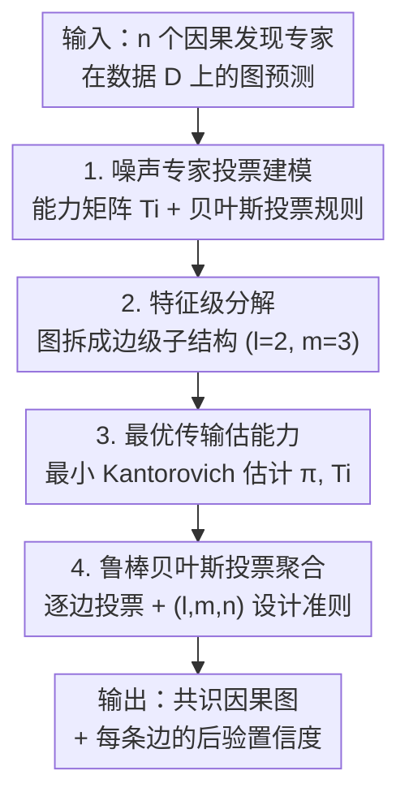

# Causal Discovery in the Wild: A Voting-Theoretic Ensemble Approach

**会议**: ICLR2026  
**OpenReview**: [https://openreview.net/forum?id=WtbPaWO8lH](https://openreview.net/forum?id=WtbPaWO8lH)  
**代码**: https://github.com/isVy08/Causal-Bayes-Ensemble  
**领域**: 因果发现 / 集成学习 / 投票理论 / 最优传输  
**关键词**: 因果发现, 结构集成, 贝叶斯投票, 最优传输, 不确定性量化

## 一句话总结
把若干个因果发现算法当成"会犯错的投票专家"，用投票理论给结构集成建立一套有理论保证的加权贝叶斯投票框架——通过把图拆成边级子结构、再用最优传输估计每个专家的"能力矩阵"，最终在合成与真实数据上比现有启发式集成方法更稳更准，并给出了集成规模/能力/多样性该怎么选的明确指导。

## 研究背景与动机

**领域现状**：因果发现（causal discovery）想从观测数据里恢复变量之间的因果图（DAG）。多年来涌现了大量算法——基于约束的 PC、基于评分的 GES、连续优化的 NOTEARS/DAGMA、基于函数式假设的 LiNGAM/SCORE 等。但同一份数据喂给不同算法，往往吐出截然不同的图。为缓解单算法的不稳定，"集成式因果发现"（ensemble-based causal discovery）应运而生：把多个算法（或同一算法在不同数据划分上跑多次）的输出结构聚合成一张共识图，既能压住数据扰动和算法波动，又能顺带给出认知不确定性（epistemic uncertainty）的估计。

**现有痛点**：现有的结构聚合方法基本都是启发式的，缺乏理论支撑。它们大致分两类——**基于距离**的（把聚合当聚类，找一张到所有候选图"距离最小"的中心图）和**基于投票**的（把每个算法当投票者，设计加权投票规则给候选结构打分、按阈值定夺）。无论哪类，距离度量或权重方案的选择都没有理论依据，说不清聚合出来的图到底有多接近真实因果结构。更糟的是，集成规模 $n$、专家多样性、单个专家性能这些关键因素如何影响聚合精度，完全没有原则性的理解，实践者只能凭感觉拍参数。

**核心矛盾**：集成的效果取决于"谁来投票、各人权重多大、投多少个"，但这些设计选择和"最终图有多准"之间缺一座桥。此外还有一个常被忽略的不确定性来源——**用来聚合的那组图本身是怎么来的**？固定的数据划分、有限的几次运行，输入图集合一变，集成结果稳不稳？启发式方法对此一无所知。

**本文目标**：(1) 给结构集成一个有理论保证的投票框架，刻画"聚合图何时等于真实因果图"；(2) 把这个保证转化成可操作的设计准则——告诉你专家的数量、能力、多样性该怎么配；(3) 解决参数（专家能力）在指数级图空间里无法直接估计的计算难题。

**切入角度**：作者把问题重新表述为一个经典的**带噪声投票（noisy voting）/ 多类分类**问题——$n$ 个"专家"各自从 $|\mathcal{G}|$ 个候选图里投一票，每个专家的预测是真实图经过一个"能力转移矩阵"$T_i$ 加噪后的版本，目标是从这堆噪声投票里恢复真值标签。这一视角直接接上了社会选择理论里成熟的 Condorcet 陪审团定理与贝叶斯最优投票结果（Nitzan & Paroush, 1982），让"最优聚合规则"有了现成的理论武器。

**核心 idea**：用**贝叶斯加权投票规则**做结构聚合，并把图分解成**边级子结构**让参数估计可行、再用**最优传输**一致地估出每个专家的能力矩阵——用"有保证的投票理论"替换"拍脑袋的启发式聚合"。

## 方法详解

### 整体框架

整体要解决的事是：给定 $n$ 个因果发现算法在同一份数据 $D$ 上产出的图预测，怎么聚合出一张尽可能接近真值的因果图，并且这套聚合是有理论保证、参数可估计的。论文把它拆成一条清晰的流水线：先把每个算法**建模成会犯错的噪声专家**并给出最优的贝叶斯投票规则（Theorem 1 给出恢复真图的概率界）；但图空间大到 $2^{\Theta(d^2)}$，直接在图级别估计能力矩阵不可行，于是**把图分解成边级子结构**（feature），让投票和估计在每条边的小状态空间上独立做；专家在每条边上的"能力"（转移矩阵 $T_i(\omega)$）和先验 $\pi(\omega)$ 用**最优传输下的最小 Kantorovich 估计**从重复采样的投票样本里估出来（Theorem 2 保证一致性）；最后用估出来的参数跑**"噪声"贝叶斯投票**逐边聚合（Proposition 1 保证即使参数有噪声、结果仍稳），并配上一套关于 $(l,m,n)$ 怎么选的**集成设计准则**。

### 关键设计

**1. 把专家当噪声投票者：贝叶斯加权投票规则**

针对"启发式聚合没有理论保证"这个根本痛点，作者先给整个集成一个生成式刻画。设真实图索引为 1，第 $i$ 个专家的估计 $\widetilde{G}_i$ 是真图经过一个固定但未知的**能力转移矩阵** $T_i := [P(\widetilde{G}_i = G_j \mid G = G_k, D)]$ 加噪的结果——对角元 $p_{i,G_1} := T_{i,G_1|G_1}$ 是它"投对"的概率，非对角是各种投错的概率。在这个模型下，最小化错误的聚合规则就是**贝叶斯投票规则**：给候选图 $G$ 打的分是 $S_{n,w_G}(\widetilde{G}) = \sum_{i=1}^{n} w_{i,G}\,\mathbb{1}[\widetilde{G}_i = G] + b_G$，其中权重与偏置由专家的对错概率取对数给出，$w_{i,G} = \log p_{i,G} - \log q_{i,\widetilde{G}_i|G}$，$b_G = \sum_i \log q_{i,\widetilde{G}_i|G} + \log \pi_G$（$\pi_G$ 是真值先验）。最终取 $\widehat{G} = \arg\max_G S_{n,w_G}(\widetilde{G})$；当所有专家等权时它退化成大家熟悉的多数投票（plurality voting）。

这套规则的价值在于它**能给出何时恢复真图的概率保证**。在专家决策条件独立（Assumption 1）、能力有界（Assumption 2）、且每个专家"有信息量"（Condition 1：转移矩阵任意两行逐元素不同，几乎处处成立）的前提下，Theorem 1 给出：从 $n$ 个有信息量专家做出的集体决策正确的概率至少为

$$1 - \sum_{j\ge 2} \exp\!\Big(-\,n \cdot \tfrac{\overline{\mathrm{KL}}_{1,j}^2}{2\tau^2}\Big),\quad \overline{\mathrm{KL}}_{1,j} = \tfrac{1}{n}\sum_{i=1}^n \mathrm{KL}\big(T_{i,|G_1};\, T_{i,|G_j}\big).$$

也就是说，犯错概率随**专家数量 $n$ 和平均信息量（用真状态行与错状态行之间的 KL 散度衡量）指数衰减**。这第一次把"集成规模、专家区分能力"这些设计旋钮和"聚合精度"用一个干净的指数界连起来——专家越多、越能区分真假结构，集体越快收敛到正确决策；而且界里还允许混进少量"没信息量"的专家。

**2. 特征级分解：把图拆成边级子结构降维**

Theorem 1 虽美，但直接落地不可行——图空间大小是 $2^{\Theta(d^2)}$，每个专家的能力矩阵就是个 $(2^{d^2}\times 2^{d^2})$ 的庞然大物，根本估不出来。这个设计就是把"恢复整张图"分解成"恢复一堆小子结构"。作者定义**特征层级**（feature level）$l$＝每组节点的个数：取一个层级后，图空间被重定义成所有特征状态的笛卡尔积 $\mathcal{G} := \prod_{\omega\in\Omega} S(\omega)$，每个特征 $\omega$ 有一个互斥的连接状态空间 $S(\omega)$。Corollary 1 给出关键的对应关系——聚合图与真图完全一致，当且仅当**每个子结构上的投票决策都正确**，于是结构学习被拆成一系列"从噪声版本里恢复每个 $\omega$ 真状态"的子任务，而 Theorem 1 的投票保证可以原样套用到每个 $\omega$ 上（只要专家对该特征有信息量）。

实践中作者直接取**最简单的边级特征**：$l=2$，每对节点 $(v_i,v_j)$ 共享一个 $m=3$ 的状态空间 $S = \{1: v_i\to v_j,\ 2: v_i\leftarrow v_j,\ 3: \text{无边}\}$。这样每个专家要估的不再是天文数字的大矩阵，而是 $\binom{d}{2}$ 个 $(3\times 3)$ 的小矩阵——一下子从"不可能"变成"可算"。Proposition 1 进一步证明，即便用的是带噪声的参数估计 $\widetilde\pi,\widetilde T_i$，只要真状态那一行的估计足够接近真值、错状态的行彼此足够可分，"噪声"贝叶斯投票仍以高概率给对——而且这个条件是对所有专家求和的总误差，意味着**容忍个别专家估得烂，只要整体对真状态仍有信息量**。

**3. 用最优传输估计专家能力**

分解之后还剩最硬的一块：每条边上的参数 $\theta(\omega) = (\pi(\omega), T_1(\omega), \dots, T_n(\omega))$ 怎么从数据里估出来？真状态 $Y(\omega)$ 是观测不到的隐变量，我们只看得到 $n$ 个专家的噪声预测 $X_1(\omega),\dots,X_n(\omega)$——这是个标准的隐变量模型参数学习问题。作者用**最小 Kantorovich 估计**（minimum distance estimation 在最优传输距离下的实例）：反复查询每个专家拿到 $N$ 个 i.i.d. 投票样本、构成经验分布 $P_N$，然后找让 $P_N$ 与模型分布 $P_\theta$ 之间 OT 距离最小的参数 $\widehat\theta_N(\omega) = \arg\min_{\theta} W_c[P_N; P_\theta]$。

为什么是 OT 而不是似然？因为这里的模型分布是隐变量边缘出来的、似然往往难算，而 OT 距离给出**无似然（likelihood-free）**的估计，且 Theorem 2 保证了它的一致性：只要有**至少 $(2m-1)$ 个有信息量的专家**（$m=3$ 时即 5 个），先验 $\widehat\pi_N$ 几乎必然收敛到真值，每个 $\widehat T_{N,i}$ 几乎必然收敛到真矩阵**直到行置换**（permutation indeterminacy）。这个置换不定性会带来"某个错状态被误当真状态"的隐患，作者用一个自然的归纳偏置消除：**限定每个 $T_i(\omega)$ 对角占优**（$T_{i,j|j} > T_{i,k|j}$，即每个专家更可能把真状态标对而非标错），从而锁定一个稳定解。若进一步知道矩阵非奇异，只要 3 个专家就够识别。算法实现上借用 Vo et al. (2024) 的可处理 OT 公式，支持摊销优化（amortized optimization），一次训练就把所有特征、所有专家的参数都解出来。

**4. 集成设计准则：$(l,m,n)$ 怎么选与两阶段聚合**

前三个设计把框架立起来了，但实践者最关心"到底该配多少专家、用什么粒度"。这个设计把理论结论翻译成可操作的准则。参数总量是 $\binom{d}{l}\times(nm^2 - (n-1)m - 1)$，由此读出三条权衡：(a) **状态空间要小**——Proposition 1 的错误概率是对所有错状态求和的，特征越复杂（$l,m$ 越大）状态数超指数膨胀、误差项越多，所以坚持 $l=2,m=3$；(b) **专家数 $n$ 有双刃**——理论上 $n$ 越大收敛越快（理想情况指数级），但更多专家意味着更多待估参数、更高内存与算力开销，还牵扯可识别性（至少 $2m-1$ 个）；(c) **专家异质性 $\tau$ 很关键**——这是个之前没被讨论的因子，真实世界专家能力参差不齐时，"集成一定优于个体"的常识会失效。

正因如此，作者推荐一个**两阶段聚合策略**：先做**算法间聚合**（用 Plurality 或 Rank 把不同算法的图汇成"平均"图），再做**算法内聚合**（在每个专家自己的多次预测上跑 Bayes Est）。实验发现 **Rank + Bayes Est** 是最有效也最稳的组合。贝叶斯投票相比 Plurality/Rank 的本质优势是：它**显式按专家能力加权**，把更多票权给真正靠谱的专家，所以在能力异质时能逼近"集成里最好的那个专家"的水平——而这在实践中（不知道谁最强时）正是最想要的保底表现。

### 损失函数 / 训练策略
核心优化目标是各特征上的最小 Kantorovich 估计 $\widehat\theta_N(\omega) = \arg\min_{\theta(\omega)} W_c[P_N(X(\omega)\mid D);\, P_\theta(X(\omega)\mid D)]$，搜索空间限制在对角占优的转移矩阵上。借助 Vo et al. (2024) 的无似然 OT 公式与摊销优化，所有特征/专家的参数在单次训练里联合求解。投票样本通过对专家图预测做 bootstrap 或数据划分生成（每专家 $p$ 个样本，$n$ 个专家给出至多 $N=pn$ 个投票 profile）。

## 实验关键数据

评估指标用因果发现常用的一套：结构汉明距离 SHD（恢复真图所需最少边修改数，越低越好）、结构干预距离 SID（真图中被估计图破坏的干预分布数，惩罚过度稀疏）、以及邻接/定向准确率的 F1（越高越好）。SHD 偏好稀疏图、SID 惩罚过稀疏，二者互补给出更全面的评价。

### 主实验（合成 + 真实系统）

| 设置 | 对比对象 | 关键发现 |
|------|---------|---------|
| 合成模拟（$d=50$，$50n$ 个投票 profile，专家强/中/弱三档能力） | Bayes True / Best Expert / Plurality | 参数已知时 Bayes True 精度最优（印证理论最优性）；本文 Bayes Est 次优，随专家数 $n$ 增大逼近 Bayes True，且全程显著超过 Plurality |
| 9 个真实基准（连续 + 离散），含 Sachs($d=11$)、Sangiovese($d=14$)、Child($d=20$) | Plurality / Rank / 各单专家（DAGMA, NOTEARS, SCORE, PC, GES-BIC, ICA-LiNGAM, HCS 等） | Bayes Est 不差于其他集成方法、多数情形更优且方差更低；能力异质时逼近"最好的单专家" |

结果取自 2000 张随机聚合图、30 次模型初始化的平均（Figures 1–2）。

### 关键发现（论文以 F1/F2/F3 三条总结）

- **F1（鲁棒性）**：参数已知时贝叶斯投票最优，符合理论；参数未知时本文 "noisy" Bayes Est 稳居次优，专家中等以上能力时随 $n$ 增大逼近 Bayes True，弱能力专家时差距拉大但仍**明显碾压 Plurality**。这一规律在不同图规模 $d$、不同采样数 $p$ 的消融里一致。
- **F2（vs 单专家，最反直觉的发现）**：和单个专家比是"看情况"的——取决于专家能力的离散程度 $\tau$。模拟里专家同质（$\tau$ 小）时大 $n$ 能把正确率推到 1；但真实世界专家异质时，**"集成必优于个体"的常识会失效**。贝叶斯投票通过按能力加权缓解了这点（Plurality 和 Rank 做不到），使聚合图逼近集成里最强专家的水平——在不知道谁最强的实践中这是好消息。
- **F3（落地建议）**：想要一张可直接用于下游因果任务的最终图，推荐**两阶段聚合**，其中 **Rank + Bayes Est** 最有效最稳。聚合天然产出每条边状态的后验概率，可直接量化预测可靠性。

## 亮点与洞察
- **把因果发现集成翻译成投票理论问题**：最大的"啊哈"在于视角迁移——$n$ 个算法 = $n$ 个噪声陪审员，于是社会选择理论里成熟的贝叶斯最优投票、Condorcet 陪审团定理可以整套搬过来，第一次给结构集成提供了"何时恢复真图"的指数级概率保证，而非又一个启发式权重。
- **指数界把设计旋钮和精度连起来**：Theorem 1 的 $\exp(-n\overline{\mathrm{KL}}^2/2\tau^2)$ 同时把专家数量、专家区分能力（KL）、能力异质性（$\tau$）三个旋钮写进同一个误差界，直接产出"该配多少专家、专家要多强"的可操作准则——这是启发式方法完全给不出的。
- **特征级分解 + OT 估计的组合拳化解维度灾难**：把 $2^{\Theta(d^2)}$ 的图空间拆成 $\binom{d}{2}$ 个 $3\times3$ 边级小问题，再用无似然的最小 Kantorovich 估计在隐变量模型里一致地估出能力矩阵（$2m-1$ 个专家即可识别），思路可迁移到任何"聚合多个带噪声结构预测"的场景。
- **后验置信度可直接复用**：聚合自然给出每条边的后验概率，能当不确定性量化用，也能 post-hoc 通过阈值剪枝低置信边来强制无环——一个副产品解决了两个实际需求。

## 局限与展望
- **i.i.d. 投票假设**：估能力矩阵依赖对专家预测做 i.i.d. bootstrap，时间序列等场景会违反，需借助 block bootstrap 等手段才能套用。
- **无隐混淆假设**：当前框架假设专家推断的数据充分、没有潜在混淆因子（latent confounder）。引入混淆需要在特征状态空间里增加状态（$m\ge 4$），并要求至少约 7 个可靠算法，作者把这块留给未来工作。
- **置换不定性靠归纳偏置兜底**：OT 估计只能识别到行置换，作者用"对角占优"假设消歧——若真实专家并非对角占优（即在某些状态上系统性地比真值更偏向错状态），这个偏置会失效。
- **无环性不显式约束**：方法不在优化里强制 DAG 约束，虽然实验观察到聚合图自然保持无环，但理论上冲突仍可能出现，需后处理剪枝；这一点在更密的图上是否稳健值得进一步验证。
- **实验以图为主、缺逐数字大表**：正文结果多以箱线图/区间呈现（Figure 1–2），单张数值大表（Table 1）放在附录，横向比较时不同基准的难度差异不可直接比大小。

## 相关工作与启发
- **vs 基于距离的集成（Wang & Peng 2014；Malmi et al. 2015 的 Rank）**：他们把聚合当聚类、找"中心图"，距离度量靠拍；本文用投票理论给出最优规则与恢复保证。有意思的是本文反过来把 Rank 当两阶段策略的第一步（算法间聚合），二者互补而非对立。
- **vs 基于投票的启发式集成（Tang et al. 2019；Zhang et al. 2023）**：同样把算法当投票者，但他们的加权方案没有理论依据；本文用贝叶斯最优投票 + KL 信息量给出权重的原则性来源，并量化了集成规模/能力/多样性对精度的影响。
- **vs 贝叶斯因果发现（Lorch et al. 2021；Annadani et al. 2023 的 BayesDAG）**：贝叶斯方法天生建模不确定性，但要算图后验、依赖强参数假设；本文面向产出点估计的频率派算法，用集成提供了一条不依赖图后验的不确定性量化替代路线。
- **vs 单算法因果发现（PC / GES / NOTEARS / DAGMA / LiNGAM / SCORE）**：这些是本文的"专家"成员；本文不替代它们，而是给出"如何把它们聚合得更稳更准"的元方法，并揭示能力异质时集成未必优于最强单专家这一反直觉现象。

## 评分
- 新颖性: ⭐⭐⭐⭐⭐ 把投票理论系统嫁接到因果发现集成，给启发式领域补上了缺失的理论保证与设计准则
- 实验充分度: ⭐⭐⭐⭐ 合成 + 9 个真实基准、多档专家能力、消融到位，但正文以图为主、数值大表入附录
- 写作质量: ⭐⭐⭐⭐ 理论链条（Thm1→分解→Thm2→Prop1）严密清晰，符号偏重、对非理论读者门槛较高
- 价值: ⭐⭐⭐⭐⭐ 给"野外因果发现"提供了有保证、可落地的集成范式与明确的参数选择指导，后验置信度可直接复用

<!-- RELATED:START -->

## 相关论文

- [\[ICLR 2026\] Efficient Ensemble Conditional Independence Test Framework for Causal Discovery](efficient_ensemble_conditional_independence_test_framework_for_causal_discovery.md)
- [\[ICLR 2026\] Theoretical Guarantees for Causal Discovery on Large Random Graphs](theoretical_guarantees_for_causal_discovery_on_large_random_graphs.md)
- [\[CVPR 2026\] A Polynomial Chaos Framework for Causal Discovery in Nonlinear Uncertain Systems](../../CVPR2026/causal_inference/a_polynomial_chaos_framework_for_causal_discovery_in_nonlinear_uncertain_systems.md)
- [\[ICLR 2026\] Conditional Independent Component Analysis for Estimating Causal Structure with Latent Variables](conditional_independent_component_analysis_for_estimating_causal_structure_with_.md)
- [\[ICLR 2026\] Influence without Confounding: Causal Discovery from Temporal Data with Long-term Carry-over Effects](influence_without_confounding_causal_discovery_from_temporal_data_with_long-term.md)

<!-- RELATED:END -->
