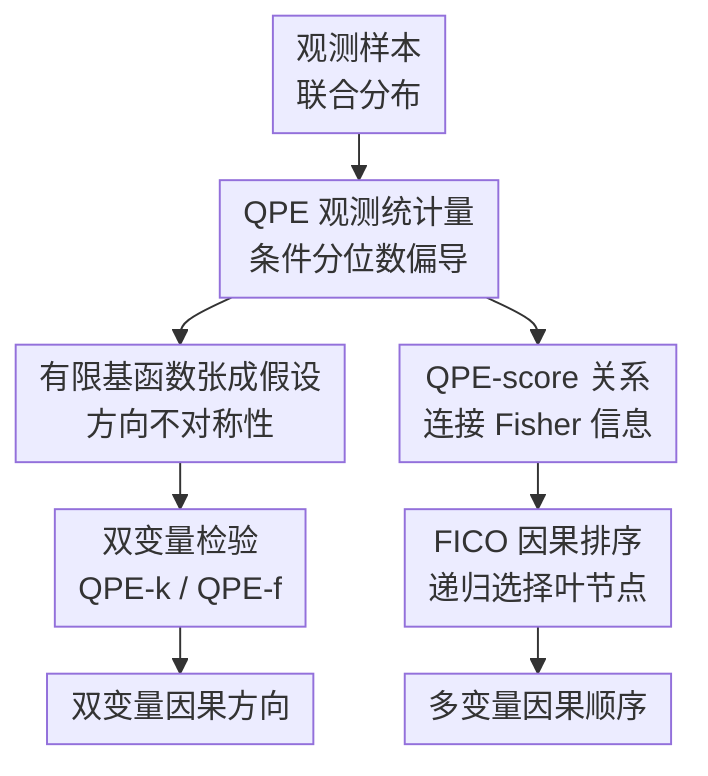

# Causal Discovery via Quantile Partial Effect

**会议**: ICLR2026  
**OpenReview**: [https://openreview.net/forum?id=80vdaC5DsD](https://openreview.net/forum?id=80vdaC5DsD)  
**代码**: 无  
**领域**: 因果发现 / 因果推断  
**关键词**: 分位数偏效应, 双变量因果发现, Fisher 信息, 因果排序, 观测分布  

## 一句话总结
这篇论文把条件分位数回归里的 Quantile Partial Effect（QPE）作为观测分布的形状统计量，用有限基函数张成假设给出双变量因果方向可识别性，并进一步把 QPE 与 score function / Fisher 信息联系起来，得到一个用于多变量因果排序的高效非参数算法 FICO。

## 研究背景与动机
**领域现状**：连续变量因果发现里，经典约束法和打分法往往只能恢复 Markov 等价类，很多边的方向需要额外假设才能确定。为了区分原因和结果，后续工作通常引入 Functional Causal Model（FCM），例如 LiNGAM、Additive Noise Model（ANM）、Heteroscedastic Noise Model（HNM）和 Post-Nonlinear（PNL）模型，通过限制机制函数或噪声结构来制造方向不对称性。

**现有痛点**：这些 FCM 假设在理论上很干净，但使用时要相信一整套潜在生成过程：变量之间满足某种结构方程、噪声与父节点独立、机制对噪声单调，甚至还要满足 Markov 性。现实数据里，这些机制层面的假设经常既难验证又容易被潜在混杂、非单调机制或复杂异方差破坏。更微妙的是，许多方法虽然最终只拿观测样本做检验，却把识别性建在不可直接观测的 counterfactual / noise mechanism 上。

**核心矛盾**：因果方向的可识别性需要某种不对称性，但这个不对称性未必一定要写成“真实机制长什么样”。如果观测联合分布本身的形状已经在 $X \to Y$ 与 $Y \to X$ 两个方向上不对称，那么更自然的问题是：能不能直接在观测层定义一个统计对象，让它既包含 ANM/HNM 等旧模型的可识别结构，又不必先假设具体噪声机制？

**本文目标**：论文分成两个目标。第一，在双变量或低维设定中，定义 QPE 并证明当真实方向上的 QPE 落在给定有限基函数张成空间时，因果方向通常可以只由观测分布识别。第二，在多变量设定中，直接估计高维 QPE 很困难，因此作者希望借助 QPE 与 score function 的关系，构造一个更容易计算的因果排序准则。

**切入角度**：作者从条件分位数函数出发。给定 $Y|X=x$，不同分位点随 $x$ 变化的速度会描述条件分布形状如何被协变量推动：位置整体平移、尺度拉伸、尾部弯曲都会反映在这个速度上。这种“分位数曲线对协变量的偏导”就是 QPE。它只依赖 $p_{X,Y}$ 或 $p_{Y|X}$，但又能复现 causal velocity 和很多 FCM 的结构。

**核心 idea**：用观测分布层面的 QPE 取代机制层面的函数/噪声假设，把“真实方向上的条件分布形状变化足够简单”形式化为有限基函数张成假设，再用基函数检验或 Fisher 信息来推断因果方向与因果顺序。

## 方法详解

### 整体框架
这篇论文的整体框架可以理解为两条互相连接的路线：先在双变量场景中把 QPE 定义清楚、证明有限基函数张成假设带来方向可识别性，然后把这个理论落成两个双变量算法 QPE-k 和 QPE-f；再在多变量场景中利用 QPE 与 score function 的偏微分关系，绕开高维 QPE 估计，转而用 Fisher 信息递归找叶节点，得到 FICO 因果排序算法。

双变量部分的输入是成对观测样本 $(x_i,y_i)$，输出是 $X \to Y$ 或 $Y \to X$ 的方向判断。多变量部分的输入是 $d$ 个变量的联合样本，输出是一个 causal order，后续可以再配合条件独立检验剪枝成 DAG。

### 关键设计
**1. QPE 观测统计量：把机制不对称改写成条件分布形状不对称**

QPE 的定义来自条件分位数函数。设 $Q_{Y|X}(\tau|x)$ 是 $Y|X=x$ 的条件分位数函数，且 $\tau=F_{Y|X}(y|x)$，则论文定义

$$
\psi_{Y|X}(y|x)=\nabla_x Q_{Y|X}(\tau|x).
$$

直观上，它问的是：当协变量 $x$ 发生微小变化时，同一个条件分位点上的 $Y$ 会往哪里移动。ANM 中所有分位曲线基本一起平移，QPE 对 $y$ 是常数；HNM 中尺度也随 $x$ 改变，QPE 往往是 $y$ 的仿射函数。这样一来，许多 FCM 施加在机制和噪声上的约束，可以被转写成 QPE 关于结果变量 $y$ 的简单函数形式。

关键好处是 QPE 不需要先知道真实结构方程。由条件 CDF 与条件分位数的反函数关系，论文给出等价表达

$$
\psi_{Y|X}=-\frac{\nabla_x F_{Y|X}}{\partial_y F_{Y|X}}=-\frac{\nabla_x F_{Y|X}}{p_{Y|X}}.
$$

这说明 QPE 完全是观测层对象。即使作者也证明它在单调 Markovian SCM 下等价于 causal velocity，QPE 本身并不要求读者承诺某个 latent noise 或 counterfactual mechanism 存在。这一步是全文的核心重定位：不是从机制出发解释观测分布，而是从观测分布的形状变化中抽取可检验的不对称性。

**2. 有限基函数张成假设：用 Wronskian 条件检验真实方向是否“形状简单”**

论文的主要识别假设是：在真实方向上，每个 QPE 分量作为结果变量的函数，都落在一组已知基函数 $\phi=(\phi_1,\ldots,\phi_k)$ 的有限线性张成空间里，即

$$
\psi_{Y|X,i}(\cdot|x)\in \mathrm{span}(\phi), \quad
\psi_{Y|X,i}(y|x)=\sum_{j=1}^k c_{i,j}(x)\phi_j(y).
$$

这个假设看似抽象，但它正好覆盖了很多熟悉模型：LiNGAM 和 ANM 对应常数基，HNM 对应 $1,y$ 这样的仿射基，PNL 类模型在给定变换时也能写成有限基形式。也就是说，作者不是丢掉 FCM，而是把一批 FCM 的共同结构抽成“QPE 关于 effect variable 的秩很低”。

为了把这个假设变成只依赖观测分布的判据，论文利用 QPE 与 score function 的 PDE 关系。若 $\xi=\psi_{Y|X}$，则有

$$
\nabla_x \log p_{Y|X}+\xi\,\partial_y\log p_{Y|X}+\partial_y\xi=0.
$$

进一步代入有限基函数形式后，可以得到由 joint density 的混合二阶导数和基函数 Stein operator 组成的 Wronskian determinant 条件。Theorem 3.6 说明，真实方向满足有限 span 假设时，这个 Wronskian 必须为零；在若干线性独立和边界条件下，反过来也成立。于是，识别性不再依赖“真实噪声是不是独立”“机制是不是单调”，而变成观测联合分布上的一个形状方程。

**3. 双变量 QPE 检验：QPE-k 快速非参数估计，QPE-f 用 flow 提高精度**

理论上知道真实方向的 QPE 更容易被给定基函数解释后，算法就变成比较两个方向的残差：如果 $X\to Y$ 方向的 $\psi_{Y|X}$ 更接近 $\mathrm{span}(\phi)$，就判定 $Y$ 是 effect；反向同理。论文给出两种实现，分别服务于速度和精度。

QPE-k 直接用核方法估计条件 CDF。作者用 Gaussian kernel 近似 $x$ 附近的样本权重，用 sigmoid 近似指示函数 $1(y_i\le y)$，得到平滑的 $\hat F_{Y|X}(y|x)$，再由闭式导数计算 $\nabla_x\hat F_{Y|X}$ 和 $\partial_y\hat F_{Y|X}$，从而得到 $\hat\psi_{Y|X}$。之后在一组固定 $x_t,y_m$ 测试点上构造响应矩阵 $\hat\Psi$，用基函数矩阵 $B$ 做最小二乘投影，残差近似为

$$
\varepsilon_{X\to Y}=\frac{1}{d}\sum_i \left\|\hat\Psi_i-\hat\Psi_iB(B^\top B)^+B^\top\right\|.
$$

QPE-f 则先训练 causal flow $u_\theta(x,y)$，把观测变量映到标准正态 latent。借助 causal velocity 与 QPE 的等价性，它用自动微分计算 $\hat\psi_{Y|X}=\nabla_xu_\theta/\partial_yu_\theta$，再用一个神经网络建模系数函数 $c_{i,j,\theta}(x)$，直接最小化 QPE 与 $C_\theta\phi^\top$ 的差距。相比 QPE-k，QPE-f 需要训练神经网络，速度慢一些，但在高密度区域的 QPE 形状拟合更准，实验里也通常更强。

**4. Fisher 信息因果排序：高维时不估 QPE，递归找最小 Fisher 信息叶节点**

高维多变量里直接估计 $\psi_{Y|X}$ 会遇到维度灾难，所以论文换了一条路：利用 QPE 和 score function 的关系，把关于 QPE 二阶矩的假设转化为 Fisher 信息大小关系。对变量 $X_i$ 的 partial score $s_{X_i}=\partial_{x_i}\log p_X$，其 Fisher 信息是 $E[(s_{X_i})^2]$。论文证明在一定边界条件下，QPE 的二阶矩、高阶导数项和 Fisher 信息之间满足精确等式；进一步在 Assumption 5.4 下，一个变量的父节点会拥有更大的 Fisher 信息，因此 Fisher 信息最小的变量可以视为 leaf variable。

FICO 的算法因此非常简单：在当前变量集合 $X^{(j)}$ 中估计每个变量的 partial score，选择 $E[(\partial_{x_i}\log p_{X^{(j)}})^2]$ 最小的变量作为叶节点，把它放到 causal order 的前端或反向序列中，然后移除它并递归。完整移除 $d$ 次后得到因果顺序。这个设计和 CaPS 在算法形式上等价，但 FICO 使用 $E[(\partial_{x_i}\log p_X)^2]$ 而不是 $-E[\partial^2_{x_i}\log p_X]$，导数阶数更低，因此计算更快；理论解释也从 ANM 扩展到了 QPE 视角。

### 一个完整示例
可以用一个二变量异方差例子理解 QPE 为什么能区分方向。假设真实机制大致是 $Y=a(X)+b(X)U$，其中 $b(X)$ 会随 $X$ 改变。此时条件分布 $Y|X=x$ 不只是整体平移，还会随 $x$ 拉宽或压窄。对应的 QPE 通常可以写成 $c_0(x)+c_1(x)y$，也就是落在 $\mathrm{span}(1,y)$ 里。

如果用 QPE-k 处理一组成对样本，算法先在若干 $x_t$ 和 $y_m$ 位置估计 $\hat\psi_{Y|X}(y_m|x_t)$，得到一张“每个 $x_t$ 上 QPE 如何随 $y$ 变化”的矩阵。若真实方向是 $X\to Y$，这张矩阵的每一行大多能被 $1,y$ 的线性组合解释，最小二乘投影残差较小。反过来估计 $\hat\psi_{X|Y}$ 时，$X|Y$ 的分布形状往往需要更复杂的非线性函数才能描述，投影到同一组基函数后的残差更大。于是算法比较两个残差，选择更“低秩、更简单”的方向作为因果方向。

在多变量 FICO 中，例子变成递归排序。假设当前有 $X_1,X_2,X_3$，真实结构是 $X_1\to X_2\to X_3$。在满足论文假设时，叶节点 $X_3$ 的 Fisher 信息最小，算法先移除 $X_3$；剩下 $X_1,X_2$ 后，新的叶节点是 $X_2$；最后剩下 $X_1$。把移除顺序反过来，就得到 $X_1,X_2,X_3$ 的因果顺序。

### 损失函数 / 训练策略
QPE-k 没有神经训练，主要超参数是核带宽、测试位置数量以及基函数集合。论文实验中把数据标准化，使用 $M=T=20$ 个测试位置和测试样本，复杂度主要来自构造 OLS 响应矩阵，约为 $O(NMT)$，因此很快。

QPE-f 需要两阶段优化。第一阶段训练 causal flow，目标来自 change-of-variable 下的最大似然：

$$
\max_\theta E[\log p_U(u_\theta)+\log |\partial_y u_\theta|].
$$

论文候选的 flow transformation 包括 RQS、MNN 和 UMNN，并调节复合层数 $t\in\{1,2,5\}$。第二阶段训练神经基函数检验，用参数网络拟合系数函数，优化

$$
\min_\theta \varepsilon_{X\to Y,\theta}+\lambda\|\theta\|,
$$

其中 $\varepsilon$ 衡量估计 QPE 与有限基函数展开之间的差距。实验中 Adam 学习率为 $0.01$，weight decay 为 $0.001$，网络使用两层宽度 100 的 SiLU MLP，训练 1000 epochs，并根据最小 loss 选择模型。

FICO 的训练负担集中在每一轮 score function 估计。论文使用 kernel-based score matching，每次估计复杂度约为 $O(N^3+N^2d)$，递归 $d-1$ 次后总体约为 $O(N^3d+N^2d^2)$。因此当样本量远大于维度时，score 估计会成为主要瓶颈。

## 实验关键数据

### 主实验
双变量实验覆盖 24 个合成与真实 benchmark，主文表 2 展示其中 12 个数据集。QPE-f 通常取得最好或并列最好的准确率，QPE-k 速度极快但精度受核估计限制。下面摘出主文最能说明趋势的一部分结果。

| 方法 | AN | LS | SIM | SIM-c | Cha | Net | Per | Sig | Qd-V | NN-V | Tue | D4-s1 | 平均时间(s) |
|------|----|----|-----|-------|-----|-----|-----|-----|------|------|-----|-------|-----------|
| ANM | 0.43 | 0.46 | 0.45 | 0.49 | 0.41 | 0.47 | 0.49 | 0.44 | 0.49 | 0.48 | 0.65 | 0.50 | 0.250 |
| LOCI | 1.00 | 1.00 | 0.78 | 0.81 | 0.73 | 0.87 | 0.96 | 0.70 | 0.71 | 0.78 | 0.61 | 0.58 | 14.981 |
| CVEL | 1.00 | 0.98 | 0.63 | 0.72 | 0.68 | 0.62 | 1.00 | 0.84 | 0.91 | 0.87 | 0.64 | 0.67 | 1.597 |
| QPE-k | 0.99 | 1.00 | 0.83 | 0.79 | 0.60 | 0.89 | 0.77 | 0.89 | 0.42 | 0.53 | 0.54 | 0.58 | 0.009 |
| QPE-f | 1.00 | 1.00 | 0.88 | 0.88 | 0.85 | 0.86 | 1.00 | 0.90 | 0.91 | 0.90 | 0.70 | 0.79 | 7.804 |

多变量部分主文主要报告 FICO 与 CaPS 的运行效率，因为两者算法等价、精度差异主要来自数值实现。FICO 在所有维度都更快，维度越高差距越明显。

| 方法 | $d=5$ | $d=10$ | $d=20$ | $d=50$ | $d=100$ |
|------|-------|--------|--------|--------|---------|
| CaPS | 0.455 ± 0.037 | 1.074 ± 0.056 | 2.761 ± 0.285 | 10.822 ± 1.037 | 33.794 ± 3.501 |
| FICO | 0.425 ± 0.322 | 0.797 ± 0.364 | 1.727 ± 0.523 | 5.550 ± 0.943 | 13.538 ± 1.248 |

### 消融实验
论文没有用传统“去掉模块”的方式做消融，而是通过 QPE-k / QPE-f 对比、QPE-f 超参数调节、FICO 与 CaPS/score-based 方法对比来分析关键设计的影响。下面整理成方法分析表。

| 配置 | 关键指标 | 说明 |
|------|---------|------|
| QPE-k | 表 2 平均时间 0.009s；AN/LS/SIM 上为 0.99/1.00/0.83 | 核估计 + OLS 基函数检验很快，适合快速双变量判断，但在 Qd-V、NN-V 这类复杂 QPE 数据上精度受限 |
| QPE-f | 表 2 平均时间 7.804s；多数数据集最佳 | flow 估计 QPE 更准，尤其在非 ANM/HNM 的 causal flow 和 constrained QPE 数据上优势明显 |
| CVEL | 表 2 平均时间 1.597s；Per/Qd-V/Rbf-V 等强 | 与 QPE-f 同样受益于更一般的 causal velocity/QPE 视角，但 QPE-f 的基函数检验在多数组合上更稳 |
| FICO vs CaPS | $d=100$ 时 13.538s vs 33.794s | 二者排序逻辑等价，但 FICO 用一阶 score 平方的 Fisher 信息，避免二阶导，计算更省 |
| FICO 假设敏感性 | 异方差高斯实验中 $\alpha,\beta$ 增大时 ODR 变差 | 当 $|\sigma'/\mu'|$ 小、均值与方差函数接近线性时，FICO 假设更容易成立；反之性能下降 |

### 关键发现
- QPE-f 的优势主要来自更准确的 QPE 估计，而不是简单换一个分类器。附录 24 个双变量数据集结果显示，它在绝大多数数据集上达到 SOTA 或接近 SOTA，尤其在 Per、Sig、Qd-V、Sig-V、Rbf-V、NN-V 这类不必满足 ANM/HNM 的数据上表现强。
- QPE-k 是一个很有价值的速度基线。它在主文表 2 中平均每对样本只需 0.009s，比几乎所有神经方法都快，但当真实 QPE 形状复杂或核带宽难调时，准确率会明显掉下来。
- FICO 的实验信息更偏“理论解释 + 效率改进”。它和 CaPS 在性能上几乎相同，但在 $d=100$ 时运行时间约为 CaPS 的 40%，说明用 Fisher 信息的一阶表达有实际计算收益。
- 多变量 synthetic 结果里，score function based 方法整体比较稳，ODR 多数低于随机排序的 0.5 隐含基线；但 real-world Sachs 上这类方法表现并不好，说明 QPE/Fisher 信息假设在真实系统中仍可能失效。

## 亮点与洞察
- 把 causal velocity “降维”成 QPE 是这篇论文最漂亮的地方。它说明某些看似 counterfactual 的速度量，其实可以完全由条件分位数和条件 CDF 表达，从而把因果方向识别带回观测分布层。
- 有限基函数张成假设提供了一个统一视角：ANM、HNM、部分 PNL 不是孤立模型，而是 QPE 关于结果变量具有低秩结构的特例。这比逐个发明噪声模型更有抽象力度。
- QPE-k 和 QPE-f 的组合很实用。前者像快速筛查工具，后者像较重但更准的判别器；如果要在大规模 cause-effect pairs 上跑，可以先用 QPE-k 过滤，再对不确定样本用 QPE-f。
- FICO 的价值不只是提出一个新排序算法，而是解释了为什么某些 score-based causal ordering 方法在超出 ANM 的场景里仍然稳。它把这种稳健性从“实验现象”部分转成了 QPE 二阶矩条件。
- 这套思想可迁移到因果表示学习或时序因果发现：只要能定义某种条件分布形状的低维变化模式，就可能用观测层统计量替代部分机制假设。

## 局限与展望
- 双变量 QPE 识别依赖已知基函数集合 $\phi$。如果真实方向上的 QPE 不在预设 span 里，或者反方向也恰好能被同一组基解释，算法会失去方向区分力。作者也在结论中指出，未来需要放宽固定基函数假设。
- QPE-f 的性能依赖 flow 训练和超参数选择。附录显示不同 transformation、层数和检验网络在不同数据集上差异明显，这意味着实际使用时仍需要调参，不能把理论识别性直接等同于稳定工程性能。
- FICO 的 Assumption 5.4 目前只在异方差高斯场景下有较直观分析。更一般分布中，这个假设意味着什么、如何验证，论文仍没有给出足够可操作的答案。
- 多变量方法只给 causal order，论文没有把图剪枝作为重点。真实应用里还需要可靠的条件独立检验或边选择策略，否则 order 正确不等于最终 DAG 可靠。
- 实验虽然覆盖面广，但 real-world Sachs 上 score-based 方法表现较弱，提醒读者在真实生物系统、潜在混杂或测量噪声严重的数据上要谨慎使用。

## 相关工作与启发
- **vs ANM/HNM/PNL**: 这些方法从机制和噪声形式出发建立可识别性，本文从 QPE 的观测分布形状出发统一它们。优势是理论覆盖更宽、假设更贴近可观测统计量；劣势是仍要选择基函数或接受 QPE 相关假设。
- **vs Causal Velocity (CVEL)**: CVEL 用 counterfactual flow 的速度刻画方向不对称，本文证明在单调 Markovian 条件下 causal velocity 等价于 QPE，并进一步强调 QPE 可以不依赖这些机制假设。实验上 QPE-f 往往比 CVEL 更准，但训练成本也不低。
- **vs CaPS**: CaPS 和 FICO 的排序算法形式等价，但 CaPS 理论主要围绕 ANM，而 FICO 从 QPE 与 Fisher 信息关系推导，理论解释更一般；同时 FICO 使用一阶 score 平方，效率优于 CaPS 的二阶导实现。
- **vs SCORE/NoGAM/SKEW**: 这些都是 score function based causal ordering 方法，实验中整体稳健。本文的启发是，score-based 方法的成功可能不只是因为某个特定噪声模型成立，而是因为背后存在更宽的 QPE/Fisher 信息结构。

## 评分
- 新颖性: ⭐⭐⭐⭐⭐ 用 QPE 统一 FCM、causal velocity 和 Fisher 信息排序，观测层视角很有新意。
- 实验充分度: ⭐⭐⭐⭐ 双变量和多变量 benchmark 覆盖广，附录结果很完整；但真实数据和假设可检验性仍偏弱。
- 写作质量: ⭐⭐⭐⭐ 理论链条清楚，图表和附录充分；不过 Wronskian/PDE 部分门槛较高，读者需要较强数学背景。
- 价值: ⭐⭐⭐⭐⭐ 对因果发现里的“机制假设能否转成观测形状假设”给出很有启发的答案，也提供了可运行的双变量和多变量算法。

<!-- RELATED:START -->

## 相关论文

- [\[ICLR 2026\] Beyond DAGs: A Latent Partial Causal Model for Multimodal Learning](beyond_dags_a_latent_partial_causal_model_for_multimodal_learning.md)
- [\[ICLR 2026\] Direct Doubly Robust Estimation of Conditional Quantile Contrasts](direct_doubly_robust_estimation_of_conditional_quantile_contrasts.md)
- [\[ICLR 2026\] Causal Discovery in the Wild: A Voting-Theoretic Ensemble Approach](causal_discovery_in_the_wild_a_voting-theoretic_ensemble_approach.md)
- [\[ICLR 2026\] Independence Test for Linear Non-Gaussian Data and Applications in Causal Discovery](independence_test_for_linear_non-gaussian_data_and_applications_in_causal_discov.md)
- [\[ICLR 2026\] Theoretical Guarantees for Causal Discovery on Large Random Graphs](theoretical_guarantees_for_causal_discovery_on_large_random_graphs.md)

<!-- RELATED:END -->
