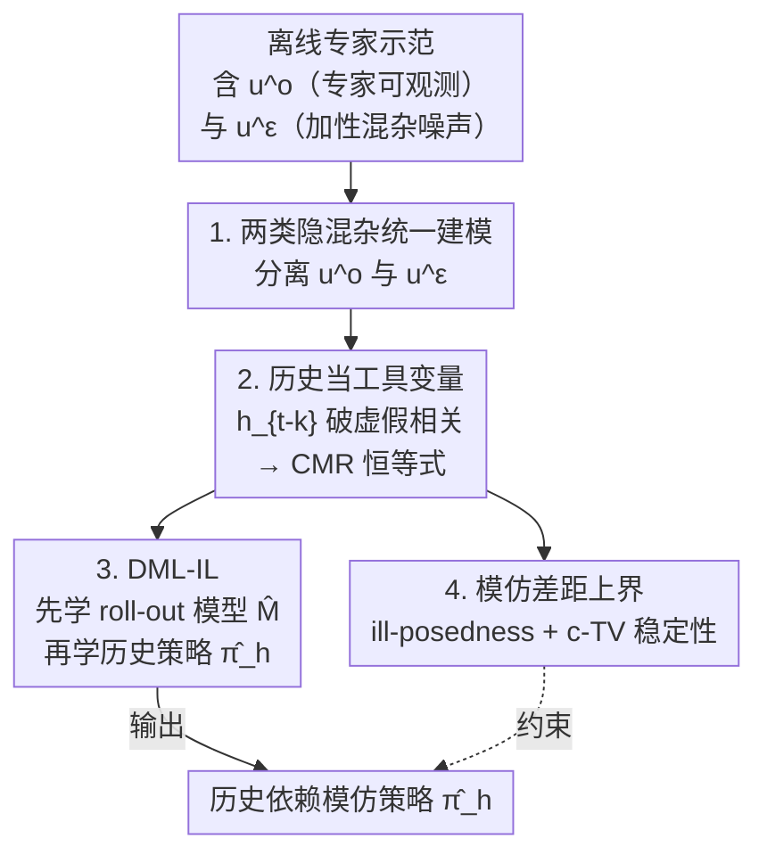

# Causal Imitation Learning under Expert-Observable and Expert-Unobservable Confounding

**会议**: ICLR2026  
**OpenReview**: [https://openreview.net/forum?id=WSCN3Jkebv](https://openreview.net/forum?id=WSCN3Jkebv)  
**代码**: 待确认  
**领域**: 因果推断 / 模仿学习  
**关键词**: 模仿学习, 隐混杂, 工具变量, 条件矩约束, 双重机器学习

## 一句话总结
本文提出一个统一的因果模仿学习框架，把"专家能看到但模仿者看不到"和"专家与模仿者都看不到"两类隐混杂同时建模，用 $k$ 步轨迹历史当工具变量把问题改写成条件矩约束（CMR）问题，并给出带模仿差距上界保证的 DML-IL 算法，在含混杂的 MuJoCo 等连续控制任务上超过现有因果 IL 基线。

## 研究背景与动机
**领域现状**：模仿学习（Imitation Learning, IL）想从专家示范中学一个能复刻专家行为的策略。经典理论说只要数据无限多、IL 误差就该趋零，但实践中行为克隆（BC）经常学出次优甚至危险的策略。前人把这些失败归到一堆看似不同的原因上：虚假相关、时序噪声、专家独占的特权信息、因果错觉（causal delusion）等等——它们本质上都是模仿者观测不到的**混杂变量**。

**现有痛点**：以往工作几乎都是**各打各的**——一类（Vuorio et al. 2022；Swamy et al. 2022a）只处理"专家能看到、模仿者看不到"的隐上下文，且往往需要 DAgger 这种能在线查询专家的交互式算法；另一类（Swamy et al. 2022b, ResiduIL）只处理"专家自己也看不到、混进示范里的混杂噪声"。可现实里这两种混杂常常**同时存在**，只解决一半就会失败。

**核心矛盾**：根子在于"看不到的东西不止一种，且性质不同"。专家可观测混杂 $u^o_t$ 是专家做决策时的私有信息，要靠它才能模仿到位；专家不可观测混杂 $u^\varepsilon_t$ 则是连专家都不知道、却污染了示范动作的噪声，会制造状态与动作之间的虚假相关。一个混淆两者、不加区分的方法，既补不齐专家的私有信息，又破不掉虚假相关。

**本文目标**：在**只有一批固定示范、不能在线查询专家**的离线设定下，构造一个能同时容纳这两类隐混杂的框架，并学出尽可能逼近专家的策略。

**切入角度**：作者注意到，虽然 $u^\varepsilon_t$ 制造的虚假相关让"在状态 $s_t$ 上专家会怎么做"无法直接辨识，但现实中**相隔足够远的混杂噪声通常互相独立**（风、波动的运营成本随时间衰减或最终被观测到）。这把"足够久之前的历史"变成了一个**干净的工具变量**——它与当前噪声无关，却仍与当前状态相关。

**核心 idea**：用 $k$ 步之前的轨迹历史 $h_{t-k}$ 当工具变量，破掉 $u^\varepsilon_t$ 造的虚假相关；同时让策略**依赖历史**，从历史里反推出关于 $u^o_t$ 的信息——把整个因果 IL 问题改写成一个有成熟解法的条件矩约束（CMR）问题。

## 方法详解

### 整体框架
本文要解决的是：给定一批被两类隐混杂污染的离线专家示范 $(s_1,a_1,\dots,s_T,a_T)$，学一个**依赖历史**的模仿策略 $\pi_h: H \to \Delta(A)$，让它在含混杂的环境里尽量逼近专家。整体分三步走：① 把带隐混杂的 MDP 形式化，明确 $u^o_t$（专家可观测）和 $u^\varepsilon_t$（专家不可观测、加性噪声）各自怎么影响转移与动作；② 在"混杂噪声视界 $k$ + 加性噪声"两条假设下，用 $h_{t-k}$ 当工具变量，把"学 $\pi_h$"化简成一个 CMR 恒等式 $E[a_t - \pi_h(h_t)\mid h_{t-k}]=0$；③ 用 DML-IL 算法（双阶段：先学 roll-out 模型、再学历史策略）解这个 CMR，并证明模仿差距上界。

这里学习目标不是专家策略 $\pi_E$ 本身（模仿者拿不到 $u^o_t$，学不到），而是它在历史上的条件期望 $\pi_h(h_t):=E[\pi_E(s_t,u^o_t)\mid h_t]$——这是在最小二乘意义下给定历史能做出的最好预测。

### 关键设计

**1. 两类隐混杂的统一建模：把"专家可观测"与"专家不可观测"拆开**

以往方法把所有看不到的变量笼统当一种处理，结果顾此失彼。本文在 MDP 里把每个时刻的隐混杂 $u_t$ 显式拆成 $u_t=(u^o_t, u^\varepsilon_t)$：$u^o_t$ 是专家能看、模仿者看不到的私有信息（如航空定价里的季节性需求），它影响专家动作 $a_t$、下一状态 $s_{t+1}$ 和奖励 $r_t$；$u^\varepsilon_t$ 是连专家都看不到的混杂噪声（如波动的运营成本），它只影响状态与动作、**不进奖励**——因为专家做决策时根本没把它算进去，让它进奖励只会给期望回报添噪声。这种区分是后续选对方法的关键：补 $u^o_t$ 要靠历史推断，破 $u^\varepsilon_t$ 要靠工具变量，两条路径必须分开走。作者用一个航空票价的例子说明，混淆两者的 IL 算法会学错。

**2. 历史当工具变量：把因果 IL 改写成 CMR 问题**

直接行为克隆为什么不行？因为 $a_t=\pi_E(s_t,u^o_t)+u^\varepsilon_t$，于是 $E[a_t\mid h_t]=\pi_h(h_t)+E[u^\varepsilon_t\mid h_t]$，而 $E[u^\varepsilon_t\mid h_t]\neq 0$（历史与噪声有虚假相关），BC 学到的策略因此**有偏**，性能可能任意差。本文的破局点在两条结构假设上：**混杂噪声视界**（Assumption 3.2，$u^\varepsilon_t \perp u^\varepsilon_{t-k}$，即相隔 $k$ 步的噪声独立）和**加性噪声**（Assumption 3.3）。有了这两条，取 $k$ 步历史 $h_{t-k}$ 作工具变量，对式 $E[a_t\mid h_t]$ 再取 $h_{t-k}$ 条件期望，噪声项 $E[u^\varepsilon_t\mid h_{t-k}]=E[u^\varepsilon_t]=0$ 被消掉，于是学 $\pi_h$ 就化简为求解

$$E[a_t - \pi_h(h_t)\mid h_{t-k}]=0,$$

这正是一个标准 CMR 问题（$a_t$、$h_t$ 都可观测，$h_{t-k}$ 是工具）。作者在附录里逐条验证 $h_{t-k}$ 满足工具变量三条件（与噪声独立、相关性、排除性）。注意 $k$ 越大、$h_{t-k}$ 与 $h_t$ 的相关越弱，工具越"弱"，辨识越难——这点在理论与实验里都得到印证。

**3. DML-IL：双阶段双重机器学习解 CMR**

直接最小化 CMR 误差 $\lVert E[a_t-\hat\pi_h(h_t)\mid h_{t-k}]\rVert_2$ 涉及对条件期望的嵌套估计，朴素做法收敛慢。DML-IL 借鉴 IV 回归里的 DML-IV，用双重机器学习的两阶段结构保证快收敛：**第一阶段**学一个 roll-out 模型 $\hat M$（高斯混合模型），它给定 $h_{t-k}$ 去**生成**未来 $k$ 步的轨迹 $\hat h_t$ 和动作 $\hat a_t$，按最大对数似然拟合；**第二阶段**固定 $\hat M$，让神经网络策略 $\hat\pi_h$ 以生成轨迹 $\hat h_t$ 为输入、最小化对生成动作的均方误差 $\lVert \hat a_t-\hat\pi_h(\hat h_t)\rVert^2$。用"生成"轨迹而非真实未来轨迹是关键：专家在 $h_{t-k}$ 之后的真实未来仍被当前噪声 $u^\varepsilon_t$ 污染，不代表"给定 $h_{t-k}$ 的未来历史条件分布"；从 $h_{t-k}$ 重新 roll out 才剥掉这层依赖，得到 CMR 矩条件需要的正确条件分布。该方法对连续与离散动作都成立（离散时把 $\pi_h(h_t)$ 当 logits 映射回动作空间）。

**4. 模仿差距上界：用 ill-posedness 与 c-TV 稳定性统一前人结果**

作者给 DML-IL 学到的策略 $\hat\pi_h$ 证了模仿差距 $J(\pi_E)-J(\hat\pi_h)$ 的上界。要控制三样东西：(i) 历史里能反推出多少 $u^o_t$ 的信息（用 $u^o_t$ 与 $E[u^o_t\mid h_t]$ 的总变差距离 $\delta$ 度量）；(ii) CMR 的 **ill-posedness** $\nu(\Pi,k)=\sup_{\pi}\frac{\lVert\pi_E-\pi\rVert_2}{\lVert E[a_t-\pi(h_t)\mid h_{t-k}]\rVert_2}$，它度量工具强度，$\nu$ 越大工具越弱，且随 $k$ 单调增大（Proposition 4.3）；(iii) 噪声对状态动作的扰动，用 **c-TV 稳定性**刻画（标准正态是 $\tfrac12$-TV 稳定）。最终 Theorem 4.5 给出

$$J(\pi_E)-J(\hat\pi_h)\le T^2\big(c\,\varepsilon\,\nu(\Pi,k)+2\delta\big)=O\big(T^2(\delta+\varepsilon)\big),$$

其中 $\varepsilon$ 是 CMR 学习误差。这个界以 $T^2$ 缩放，符合无交互专家时 IL 的预期。更妙的是它把前人结果当**特例**收编：当 $u^o_t=0$（或全部信息都在历史里）退化为 Swamy et al. 2022b 的界；当 $u^\varepsilon_t=0$ 退化并具体化 Swamy et al. 2022a 的抽象界；两者都为零则回到无混杂的经典 IL 界 $T^2\varepsilon$。

## 实验关键数据

### 主实验
在自制的航空票价玩具环境（连续状态动作，$u^\varepsilon$=运营成本、$u^o$=季节性需求，约每 30 步变化）和三个改造过的 MuJoCo 任务（Ant / Half Cheetah / Hopper，目标变速度当 $u^o$、外加风噪当 $u^\varepsilon$）上评测。训练用 20000 样本（40 条 ×500 步），奖励归一化为 1=无噪专家、0=随机策略，并报告模仿动作与专家动作的 MSE。对比基线：BC、BC-SEQ（只处理 $u^o$）、ResiduIL（只处理 $u^\varepsilon$，这里改造成用 $h_{t-k}$ 当工具学历史无关策略）、以及含噪专家（性能上界）。

| 环境 | 方法 | MSE（越低越好） | 平均奖励（越高越好） |
|------|------|------|------|
| 票价 / MuJoCo | **DML-IL（本文）** | 最低 | 最高、最接近专家 |
| 票价 / MuJoCo | ResiduIL | 中（破了 $u^\varepsilon$） | 中（不补 $u^o$，有明显差距） |
| 票价 / MuJoCo | BC-SEQ | 高（数量级更高） | 接近随机 |
| 票价 / MuJoCo | BC | 高 | 接近随机 |

### 消融实验
核心消融是改变混杂噪声视界 $k$（从 1 到 20），间接验证"工具强度随 $k$ 减弱"的理论；附录还换用别的 IV 求解器并测了 $k$ 误设的影响。

| 配置 | 关键现象 | 说明 |
|------|---------|------|
| $k=1$ | DML-IL MSE 最低、奖励最高 | 工具最强，$u^\varepsilon$、$u^o$ 都处理好 |
| $k$ 增大 | DML-IL 性能单调下降 | 工具变弱、能从 $h_{t-k}$ 反推的 $u^o$ 信息变少，印证 Prop. 4.3 |
| $k=20$ | DML-IL ≈ ResiduIL | 20 步前的历史几乎推不出当前 $u^o$，等于退化成只破噪声 |
| 换 DFIV / DeepGMM 当 CMR 求解器 | 表现不稳、偏差 | DML-IV 风格的求解器更适配本问题 |

### 关键发现
- **只处理一半必败**：BC-SEQ（只补 $u^o$）和 BC 在有 $u^\varepsilon$ 时一起失败、且性能几乎一样——说明在不破噪声的前提下，用历史推 $u^o$ 毫无帮助；ResiduIL（只破 $u^\varepsilon$）能降 MSE 却补不齐 $u^o$，奖励上不去。两类混杂必须同时处理。
- **$k$ 是难度旋钮也是理论试金石**：$k$ 增大让工具变弱，DML-IL 退化到 ResiduIL 水平，实验曲线与 Proposition 4.3、Theorem 4.5 的预测吻合，在 Ant、Half Cheetah 上最明显。
- **MSE 高未必坏**：当 $u^\varepsilon$ 被显式处理时，模仿者动作本就不该去拟合被噪声污染的示范动作，因此"对的方法"反而会有较高的 MSE——这是作者特意强调的诊断信号。

## 亮点与洞察
- **把一堆零散的 IL 失败统一进一个因果框架**：虚假相关、时序噪声、专家特权信息、因果错觉，过去各有各的方法，本文用 $(u^o_t,u^\varepsilon_t)$ 一刀切开，多数前人设定成为它的特例——这种"先统一再特例化"的叙事很有说服力。
- **"远处历史当工具变量"是个可迁移的巧思**：只要相信"相隔够远的混杂噪声互相独立"，时间序列/序贯决策里的历史就能当干净工具用，这个套路对一切带时序混杂的离线学习都有启发。
- **理论与实验对得上**：ill-posedness 随 $k$ 单调增、$k=20$ 时退化到 ResiduIL，不是事后解释而是被预测出来的，理论的可证伪性强。
- **"对的方法 MSE 反而高"这个反直觉诊断**很实用：它提醒在含噪示范上别拿拟合误差当唯一指标。

## 局限与展望
- **强假设是双刃剑**：混杂噪声视界 $k$、加性噪声、有限视界等假设是辨识性的代价，作者坦言医疗等"非线性混杂典型"的场景不适用——因果辨识本来就要拿假设换。
- **$k$ 难以经验验证**：算法需要已知 $k$ 或其上界，但 $k$ 一般无法直接从数据验证，只能靠条件独立检验等手段间接判断候选工具是否有效。
- **专家潜变量仍不可辨识**：方法点辨识的是历史依赖策略 $\pi_h$，专家私有的 $u^o_t$ 本身仍学不出来；当历史推不出 $u^o_t$（如 $k$ 很大）时，能力上限就被 $\delta$ 卡住。
- **可改进方向**：作者把非加性噪声、部分可观测协变量、无效工具列为正交的未来方向，把本框架嵌入这些更难的设定值得探索。

## 相关工作与启发
- **vs Swamy et al. 2022a（BC-SEQ）**：他们只处理专家可观测混杂 $u^o$、用历史依赖策略，且常需交互式专家/模拟器；本文在 $u^\varepsilon_t=0$ 时退化为他们的设定，并把其抽象界具体化为含 $\varepsilon$、$\delta$ 的可计算界（Corollary 4.7）。
- **vs Swamy et al. 2022b（ResiduIL）**：他们只处理专家不可观测的混杂噪声、转成 IV 回归学历史无关策略；本文在 $u^o_t=0$ 时退化为他们的界（Corollary 4.6），但额外能补 $u^o$，故奖励更高。
- **vs DAgger 系交互式 IL**：前者靠在线查询专家纠错，本文坚持**纯离线、固定示范**，更贴近真实部署约束。
- **vs Ruan et al. 2024（部分可辨识鲁棒 IL）**：他们证明无额外假设时精确模仿不可能、转而做鲁棒区间；本文用有限视界+加性噪声这类更强结构假设，绕过不可能性结论、换来历史依赖策略的点辨识。

## 评分
- 新颖性: ⭐⭐⭐⭐⭐ 把两类隐混杂统一进一个框架并收编多个前人结果为特例，框架级贡献
- 实验充分度: ⭐⭐⭐⭐ 玩具+MuJoCo 覆盖到位、$k$ 扫描印证理论，但环境偏合成、缺真实数据集
- 写作质量: ⭐⭐⭐⭐⭐ 假设—推导—算法—界—实验环环相扣，特例化叙事清晰
- 价值: ⭐⭐⭐⭐ 对离线含混杂 IL 有扎实理论与可用算法，但强假设限制了落地范围

<!-- RELATED:START -->

## 相关论文

- [\[ICLR 2026\] Efficient and Sharp Off-Policy Learning under Unobserved Confounding](efficient_and_sharp_off-policy_learning_under_unobserved_confounding.md)
- [\[ICML 2026\] From Observation to Intervention: A Causal Audit of Expert Importance in Mixture-of-Experts Models](../../ICML2026/causal_inference/from_observation_to_intervention_a_causal_audit_of_expert_importance_in_mixture-.md)
- [\[ICLR 2026\] Learning Dynamic Causal Graphs Under Parametric Uncertainty via Polynomial Chaos Expansions](learning_dynamic_causal_graphs_under_parametric_uncertainty_via_polynomial_chaos.md)
- [\[ICLR 2026\] Coarse-to-Fine Learning of Dynamic Causal Structures](coarse-to-fine_learning_of_dynamic_causal_structures.md)
- [\[ICLR 2026\] Influence without Confounding: Causal Discovery from Temporal Data with Long-term Carry-over Effects](influence_without_confounding_causal_discovery_from_temporal_data_with_long-term.md)

<!-- RELATED:END -->
