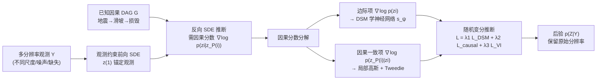

# Causal Score Conditioning for Multi-Resolution Latent Systems

**会议**: ICLR 2026  
**OpenReview**: [https://openreview.net/forum?id=M4Z2A1jYpU](https://openreview.net/forum?id=M4Z2A1jYpU)  
**代码**: [https://github.com/PaperSubmissionFinal/ICLR2026](https://github.com/PaperSubmissionFinal/ICLR2026)  
**领域**: 因果推断 / 概率方法（基于分数的扩散 + 概率图模型）  
**关键词**: causal graphical model, score-based diffusion, multi-resolution inference, variational inference, Markov blanket, disaster modeling  

## 一句话总结
本文提出 SVGDM，把基于分数的扩散嵌进因果有向图，用「因果分数分解」让信息沿因果边在不同分辨率、不同噪声水平的观测之间传播，从而在异质、不完整观测下联合反演多个相互依赖的隐变量（如地震→滑坡→建筑损毁）。

## 研究背景与动机
**领域现状**：地球系统、流行病、气候等复杂系统里，多个隐变量通过已知的物理因果机制互相影响，观测数据来自遥感/InSAR/雷达/光学影像，天然带有不同的空间分辨率（30 m 到 5 km）、时间频率和噪声特性。机器学习被广泛用来反演这些隐变量的时空状态。

**现有痛点**：主流多模态/多源融合方法依赖三类常被现实违反的假设——(1) 变量间有显式闭式依赖；(2) 观测质量均匀（同分辨率、同模态、同噪声）；(3) 所有变量都可观测。具体到方法层面有三处硬伤：把因果相关的变量当成独立处理、丢掉了因果信息；无法有效整合多分辨率观测，往往要把高分辨率数据降采样到统一尺度而损失细节；缺乏对级联近似误差的理论刻画。少数用扩散同化多分辨率数据的工作也只针对单变量系统。

**核心矛盾**：要联合反演多个隐变量，既得让高质量观测的变量去"补"低质量观测的变量（信息要跨变量、跨尺度流动），又得保留每个观测的原始分辨率不被抹平——但因果路径和扩散过程耦合在一起，直接对大量隐变量做后验推断在计算上不可行。

**本文目标**：在已知（哪怕只是部分已知）因果 DAG 的前提下，从多分辨率、质量不均、不完整的观测中估计多个因果相关的物理过程的后验 $p(Z|Y)$，同时保留原始分辨率、利用因果依赖传播信息、并给出推断质量的理论保证。

**核心 idea**（**因果分数分解 + 观测约束扩散**）：选扩散是因为它的前向 SDE 天然编码"分辨率越粗噪声越大"这种尺度相关噪声，是归一化流和标准变分推断刻画不了的；再把全局分数沿因果图的「因果毯」（causal blanket，即因果父节点）局部分解，使每个变量的反向 SDE 只依赖自己和父节点的局部分数。

## 方法详解

### 整体框架
SVGDM 给每个隐变量 $z_i$ 配一条受观测约束的前向 SDE，让 $z(1)$ 锚定在观测上（而非像经典 DDPM 那样塌缩到 $\mathcal{N}(0,I)$）；推断时走反向 SDE，其漂移项的核心是"因果分数" $\nabla_{z_i}\log p_t(z_i|z_{P(i)})$。整篇方法围绕"如何把这个因果分数算出来"：先用马尔可夫毯把它局部化（Thm 2），再分解成边际项 + 因果一致项（Prop 1），边际项用去噪分数匹配（DSM）学一个网络、因果一致项用局部高斯近似 + Tweedie 公式算（Thm 3），最后套进随机变分推断目标统一训练。

### 关键设计

**1. 观测约束的节点级因果 SDE：让信息既跨变量又跨分辨率流动。** 系统给每个节点 $i$ 写一条带因果父依赖的 SDE $dz_i(t)=f_i(z_i,z_{P(i)},t)dt+g_i(t)dW_i(t)$，各节点的布朗运动相互独立。Thm 1 证明这套系统有唯一强解，且联合过程的无穷小生成元可分解为 $L_t=\sum_i L_{i,t}$，每个局部算子只依赖 $z_i$ 和它的父节点——注意这是"生成元的局部性"而非 $p_t$ 的条件独立性，因为扩散动力学会在 $t>0$ 引入额外依赖，作者明确把这个分解当作架构先验而非精确的马尔可夫性质。为了把异质观测灌进来，再给漂移加一项 $\sum_k \lambda_{i,k}(t)[\phi_i^k(y_i^k,z_{P(i)})-z_i(t)]$：$\phi_i^k$ 把分辨率 $k$ 的观测映射回隐空间，$\lambda_{i,k}(t)$ 控制该分辨率观测的影响力。这一项正是"保留原始分辨率"的关键——不同尺度的观测各自通过自己的 $\phi_i^k$ 进入同一条 SDE，无需先降采样对齐。

**2. 经马尔可夫毯的因果分数分解：把全局分数局部化为可算的两项。** 反向 SDE（Lemma 1）需要因果分数 $\nabla_{z_i}\log p_t(z_i|z_{P(i)})$，但全局分数直接算不动。作者借鉴序列扩散里"全局分数可用马尔可夫毯局部化"的思路，把因果父节点 $P(i)$ 当作 $z_i$ 的"因果毯"，由因果马尔可夫性 $z_i \perp \text{NonDescendants}(z_i)\mid P(i)$ 得到 Thm 2：扩散扰动后因果毯关系近似保持，$\nabla_{z_i}\log p_t(z_{1:N})\approx \nabla_{z_i}\log p_t(z_i,z_{P(i)})$，且 $t\to 0$ 时近似变精确、$t>0$ 时误差随噪声 $\sigma(t)$ 和因果依赖强度变化。进一步 Prop 1 把它拆成两项：$\nabla_{z_i}\log p_t(z_i|z_{P(i)})=\nabla_{z_i}\log p_t(z_i)+\nabla_{z_i}\log p_t(z_{P(i)}|z_i)$。前者是边际分数（吸收来自所有分辨率的直接观测证据），后者是"因果一致项"——它不是反向因果，而是约束 $z_i$ 的更新必须与父节点的联合分布保持兼容，从而让父变量的观测沿因果路径反哺子变量。

**3. 边际项用 DSM、因果一致项用局部高斯 + Tweedie：两条不同路子估两项分数。** 边际项 $\nabla_{z_i}\log p_t(z_i)$ 用连续时间去噪分数匹配训练神经网络 $s_{\psi_i}$，目标为 $L_{\text{DSM},i}=\mathbb{E}[\lambda(t)\|s_{\psi_i}(z_i(t),t)-\nabla_{z_i}\log p_t(z_i(t)|z_i(0))\|^2]$，Prop 2 保证其总体极小点恰为真分数。因果一致项则用局部高斯近似 $z_{P(i)}(t)|z_i(t)\sim\mathcal{N}(\mu_c(\hat z_i(t)),\Sigma_c)$，其中后验均值 $\hat z_i(t)$ 由 Tweedie 公式 $\hat z_i(t)=z_i(t)+\sigma_i(t)^2 s_{\psi_i}(z_i(t),t)/\mu_i(t)$ 给出，再用链式法则求导得到因果分数。Thm 3 给出该近似的有效条件（条件分布局部对数凹、扩散噪声压过高阶非线性 $\sigma(t)^2\gg\|\nabla^3\log p_t\|_\infty$、Tweedie 重建误差有界）和误差界 $O(\delta^2+\sigma(t)^{-2})$——早期低噪声阶段最准、$t\to 1$ 时优雅退化；当条件被违反时加自适应正则 $\lambda_{\text{reg}}\|\nabla\mu_c\|_F^2$。值得注意的是理论用高斯/对数凹假设只为可分析，实现上不依赖它，作者在重尾、偏态噪声下实测仍稳定。

**4. 随机变分推断统一训练 + 级联误差分析给稳定性保证。** 给定学好的反向 SDE，变分后验 $q_\psi(Z|Y)$ 由带后验分数 $\nabla_{z_i}\log q_{\psi,t}=s_{\psi_i}+\nabla_{z_i}\log p(Y|Z)$ 的反向 SDE 隐式定义，用 Jensen 不等式得 ELBO，熵项借反向 SDE 的归一化流雅可比 + Hutchinson 迹估计稳定计算。总目标 $L_{\text{total}}=\lambda_1\sum_i L_{\text{DSM},i}+\lambda_2\sum_i L_{\text{causal}}+\lambda_3\hat L_{VI}$。论文还专门做了级联误差分析（§4）：把误差归为五类（Euler-Maruyama 离散 $\varepsilon_1=O(\Delta t^{1/2})$、神经分数 $\varepsilon_2=O(1/\sqrt N+\lambda_{\text{reg}})$、局部高斯 $\varepsilon_3$、Tweedie $\varepsilon_4=O(\sigma(t)^2\varepsilon_2)$、KDE 熵 $\varepsilon_5$），Thm 4 给出总误差界含交叉项 $O(\varepsilon_2\varepsilon_3)$，并指出最危险的是分数估计与高斯建模的交互——其迭代训练策略（先把分数练好、再 refine 因果参数）正是为了避免误差灾难性叠加，Thm 5 进一步保证各 $\varepsilon_i\to 0$ 时 $q_\psi\to p(z|y)$。

## 实验关键数据

### 主实验（合成数据，3 节点因果系统）
三种观测场景下的隐变量重建误差（mean ± std，越低越好）；VFO 最优，并从 VFO→LFO→LPO 系统性退化，验证因果结构确实在跨质量变量间传播信息。

| 场景 | 变量 | MAPE | NRMSE | CRPS |
|------|------|------|-------|------|
| VFO（变分辨率全观测） | z1 | 0.0526 | 0.0683 | 0.0396 |
| | z2 | 0.0991 | 0.1239 | 0.0756 |
| | z3 | 0.0763 | 0.1031 | 0.0567 |
| LFO（低分辨率全观测） | z1 | 0.0756 | 0.0922 | 0.0572 |
| | z3 | 0.1451 | 0.1814 | 0.1088 |
| LPO（低分辨率部分观测） | z1 | 0.1067 | 0.1227 | 0.0810 |
| | z3 | 0.1961 | 0.2228 | 0.1515 |

与基线对比：SVGDM 比领域专用方法（VBCI、DisasterNet）好 2−3×，比通用变分推断方法好 10−20×；VI 基线 MAPE > 60%，凸显引入因果结构的必要性。

### 真实灾害系统
- **多灾种地震评估**（联合估计滑坡 zLS、液化 zLF、建筑损毁 zBD）：2020 波多黎各地震三类灾害 AUROC 达 0.9331 / 0.9317 / 0.9512，比变分推断基线（BBVI、ADVI、NUTS）提升 14–21%；2021 海地地震 AUROC 0.9550（滑坡）/ 0.9587（损毁）；2023 土耳其-叙利亚 0.9488（损毁）。
- **野火蔓延预测**（时空二分类）：F1 = 0.5913、AP = 0.4430，优于逻辑回归及 U-Net、ConvLSTM、UTAE 等深度基线。

### 消融与扩展
- **损失组件消融**（合成 3 节点）：去掉局部 DSM 分数、因果毯分数、观测一致项中任一个都会一致退化。
- **可扩展性**：10–15 个隐变量、稀疏/稠密因果图下精度稳定，运行时随因果边数 $|E|$ 近似线性增长。
- **多视图 VAE 对比**（JMVAE / MMVAE / MoPoE-VAE，把所有观测当单一共享隐表示的不同视图）：SVGDM 在所有隐变量上 NRMSE、MAPE 都显著更低，量化了"把因果相连的多分辨率物理过程塌缩成单一共享隐变量"会损失多少精度。
- **关键发现**：因果结构是性能主导因素（去掉因果信息的 VI 直接崩到 MAPE>60%）；局部高斯近似在重尾/偏态噪声下仅轻微退化，理论假设充分但非必需。

## 亮点与洞察
- **把"因果毯"概念从序列扩散迁移到一般因果 DAG**：用因果父节点作 Markov blanket 做分数的局部分解，是连接概率图模型与基于分数扩散的一个干净接口，计算复杂度随因果边而非变量数爆炸地增长。
- **诚实地区分"生成元局部性"与"分布条件独立性"**：作者明确指出 $t>0$ 时 $p_t$ 不再严格因子化，把生成元分解当架构先验而非精确性质，理论表述比很多"扩散保持条件独立"的工作更克制可信。
- **扩散用对了地方**：前向 SDE 编码尺度相关噪声，正好对上遥感里"分辨率越粗、speckle/大气延迟/重采样伪影越强"的物理事实，这是相比归一化流的实质优势而非套壳。
- **完整的级联误差分析**：把五类近似误差逐一定界、找出最危险的交叉项，并用"先练分数再 refine 因果参数"的训练顺序去抑制它，理论与工程闭环。

## 局限与展望
- **依赖已知因果结构**：方法假设 DAG 已知（虽然部分已知也能用），当拓扑需要从数据推断时不适用；未来可联合做结构发现。
- **局部高斯近似的脆弱点**：强非线性违反对数凹条件时近似会退化，需更灵活的近似族。
- **可扩展性天花板**：复杂度随因果依赖数增长，对超大系统仍有压力。
- **时变因果未覆盖**：当前因果关系是静态的，扩展到 time-varying causal relationships 是开放方向。
- 评测虽然真实（地震、野火），但因果图均来自成熟领域知识，迁移到因果机制不清晰的领域（如金融、流行病早期）效果未知。

## 相关工作与启发
- **基于分数的扩散 / 逆问题求解**：Song & Ermon (2019)、Song et al. (2020b) 的 score SDE，Chung et al. (2022) 的 diffusion posterior sampling，Tweedie 公式（Efron 2011; Kim & Ye 2021）——本文把这些后验采样工具搬到"多变量 + 因果约束"的设定。
- **序列扩散的局部分数分解**：Rozet & Louppe (2023) 在马尔可夫链上用伪毯做分数分解，本文是其在因果图设定下的推广，是最直接的方法论源头。
- **概率图模型 / 变分推断**：Koller & Friedman (2009)、Blei et al. (2017)，本文指出标准消息传递/变分推断在节点观测分辨率/噪声差异巨大时会失效，正是要解决的缺口。
- **时空数据同化与灾害建模**：DisasterNet、VBCI 等领域专用方法是主要对手，本文证明用通用因果分数框架能稳定超过它们。
- **启发**：对任何"已知机理依赖 + 异质多源观测"的科学 ML 问题（气候遥感、流行病、电网/基础设施），"因果毯局部化 + 观测约束扩散"提供了一个可复用的反演范式，关键是把领域因果知识写成 DAG 注入分数函数，而不是把异质观测硬塞进单一隐空间。

## 评分
- **新颖性**: ⭐⭐⭐⭐ —— 把因果毯式分数分解从序列推广到一般因果 DAG，并用观测约束 SDE 优雅处理多分辨率，组合新颖且接口干净；扣分在于核心思路（Markov blanket 局部分数）是已有思想的迁移。
- **实验充分度**: ⭐⭐⭐⭐ —— 合成（含可扩展性、损失消融、多视图 VAE 对比）+ 三场真实地震 + 野火，覆盖面广、提升幅度大（14–21%、AUROC>0.93）；扣分在于很多关键结果（10–15 变量、消融细表）放在附录，正文表格略单薄。
- **写作质量**: ⭐⭐⭐⭐ —— 理论推导层层递进、对近似有效性和误差级联讲得很诚实（明确区分生成元局部性与条件独立）；扣分在于原文有多处拼写错误（orginal、obsevation、discrimiorginal）且符号密度高，可读性受影响。
- **价值**: ⭐⭐⭐⭐ —— 直击地球系统/灾害评估等高影响场景的真实痛点（异质、不完整、多分辨率观测），有开源代码和可复现实验，方法范式对科学 ML 社区有迁移价值。

<!-- RELATED:START -->

## 相关论文

- [\[AAAI 2026\] CaDyT: Causal Structure Learning for Dynamical Systems with Theoretical Score Analysis](../../AAAI2026/causal_inference/causal_structure_learning_for_dynamical_systems_with_theoretical_score_analysis.md)
- [\[ICLR 2026\] Frequency-Domain Better than Time-Domain for Causal Structure Recovery in Dynamical Systems on Networks](frequency-domain_better_than_time-domain_for_causal_structure_recovery_in_dynami.md)
- [\[ICLR 2026\] Beyond DAGs: A Latent Partial Causal Model for Multimodal Learning](beyond_dags_a_latent_partial_causal_model_for_multimodal_learning.md)
- [\[ICLR 2026\] Conditional Independent Component Analysis for Estimating Causal Structure with Latent Variables](conditional_independent_component_analysis_for_estimating_causal_structure_with_.md)
- [\[ICLR 2026\] Distributional Equivalence in Linear Non-Gaussian Latent-Variable Cyclic Causal Models](distributional_equivalence_in_linear_non-gaussian_latent-variable_cyclic_causal_.md)

<!-- RELATED:END -->
