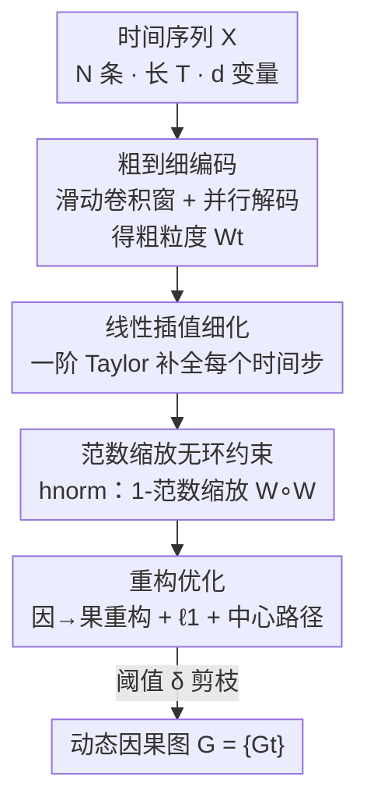

# Coarse-to-Fine Learning of Dynamic Causal Structures

**会议**: ICLR2026  
**OpenReview**: [https://openreview.net/forum?id=ooqnLFagKq](https://openreview.net/forum?id=ooqnLFagKq)  
**代码**: 待确认  
**领域**: 因果发现 / 时序因果  
**关键词**: 动态因果结构、Granger 因果、无环约束、线性插值、时变图

## 一句话总结
本文提出 **DyCausal**，用滑动卷积窗口先捕捉时间序列在「粗粒度」若干时间步上的因果结构，再用一阶 Taylor 线性插值把因果矩阵细化到每个时间步，并配上一个基于矩阵 1-范数缩放的「永远可微」无环约束 $h_\text{norm}$，从而第一次稳定高效地恢复出**全动态**（瞬时与滞后因果都随时间变化）的时变因果图，在合成与真实数据上全面超过现有方法。

## 研究背景与动机
**领域现状**：从时间序列里挖因果图（temporal causal discovery）是因果学习的核心任务之一。主流分两派——约束式（PC/FCI 加条件独立性检验）和打分式（向量自回归 + 稀疏正则，如 NOTEARS / DYNOTEARS / NTS-NOTEARS）。打分式方法因为可以接深度模型、用可微的无环约束做端到端优化，近年是主力。

**现有痛点**：几乎所有方法都假设因果关系是**静态**的——时间序列的数据分布可以变，但背后的因果结构（哪条边存在、强度多少）被当成不随时间改变。可现实里因果关系会「出现、改变、消失」：比如病人的疾病轨迹随季节漂移、交通因果在一天内早晚高峰完全不同。少数近期工作（如 DyCAST）只让**部分**因果成分（仅瞬时、或仅滞后）随时间变，对其余成分仍强加静态假设，与现实的全动态本质相违背。

**核心矛盾**：要做「全动态」因果发现（瞬时 + 滞后因果都逐时间步变化），有两个绕不开的障碍。其一是**效率与稳定性**——如果给每个时间步单独学一张因果图，模型参数爆炸、难收敛，节点一多（如 80 个）直接不收敛。其二是**无环约束**——因果图要求瞬时部分是 DAG，但现有可微无环约束（$h_\text{exp}$、$h_\text{poly}$、$h_\text{log}$）要么数值上爆炸/消失，要么只在一个有限的谱半径区间内可优化，一旦越界就得降学习率重训，严重拖慢且不稳定。

**切入角度**：作者抓住一个关键观察——既然因果是随时间**连续平滑**演化的，那么只要在少数几个时间步上把粗粒度状态识别准，原则上就能近似出整条时变轨迹。这就把「逐时间步硬学」转成了「粗采样 + 插值细化」，既省算力又稳。

**核心 idea**：**用「粗到细」两段式建模时变因果轨迹**——卷积窗口编码粗粒度状态、线性插值补全每一步，再叠加一个永远可微可优化的范数缩放无环约束，从而高效稳定地恢复全动态因果图。

## 方法详解

### 整体框架
DyCausal 要解决的是：给定 $N$ 条等长、共享同一套时变因果结构的时间序列 $X=\{X^1_{1:T},\dots,X^N_{1:T}\}$（每个时间步 $d$ 个变量），输出每个时间步 $t$ 的加权邻接因果矩阵 $W_t$（拆成瞬时部分 $W^\text{ins}_t$ 与滞后部分 $W^\text{lag}_t$，最大滞后 $\tau$），其中 $W^\text{ins}_t$ 必须是 DAG。

整体流水线是「**粗编码 → 细插值 → 重构优化**」三段：① 一个宽 $N$、长 $K$ 的滑动卷积窗口以步长 $S$ 扫过序列，每停一处用 CNN 把窗内数据编码成一个粗粒度状态向量 $Z_t$，再用「并行解码」把它解成该处的因果矩阵——这样只需算 $\lfloor (T-K)/S\rfloor$ 个矩阵；② 对相邻两个粗粒度矩阵之间用一阶 Taylor 线性插值，把因果矩阵补全到每一个时间步，得到细粒度时变轨迹；③ 用打分式目标（从「因」序列重构「果」序列 + $\ell_1$ 稀疏 + 无环约束 $h_\text{norm}$）端到端优化，最后对小元素剪枝得到动态因果图 $G$。

### 关键设计

**1. 粗到细编码：滑动卷积窗 + 并行解码，把「逐步硬学」降成「少数步 + 插值」**

针对「逐时间步学因果图参数爆炸、难收敛」这个痛点，DyCausal 不在每个时间步都学一张图，而是用宽 $N$、长 $K$、步长 $S$ 的滑动卷积窗扫序列，每停一处把窗内数据 $X_{t:t+K}$ 编码成状态向量 $Z_t=\text{CNN}(X_{t:t+K})\in\mathbb{R}^{dm}$，它是该处因果结构的粗粒度表示。再把 $Z_t$ 解码成因果矩阵 $W_t\in\mathbb{R}^{dm\times d\tau}$。

直接解码会让参数量达到 $\mathcal{O}(d^3m^2\tau)$，因此作者设计了**两级并行解码**降参：先把 $Z_t$ 切成 $m$ 段 $\{z_{t,i}\in\mathbb{R}^d\}$，用 $m$ 个并行 MLP 解成 $\{\tilde z_{t,i}\in\mathbb{R}^{d\tau}\}$；再把这些向量里相同位置的元素重组成 $d\tau$ 个向量 $\{u_{t,j}\in\mathbb{R}^m\}$，用 $d\tau$ 个并行 MLP 解成 $\{\tilde u_{t,j}\in\mathbb{R}^{dm}\}$，拼成 $W_t=[\tilde u_{t,1}|\cdots|\tilde u_{t,d\tau}]$。这把参数从 $\mathcal{O}(d^3m^2\tau)$ 压到 $\mathcal{O}(d^2m\tau+d^2m^2\tau)$、计算量从 $\mathcal{O}(d^3m^2\tau)$ 压到 $\mathcal{O}(d^2m^2\tau)$。线性因果取 $m=1$，非线性时 $m>1$ 当作隐藏单元数。

**2. 线性插值细化：一阶 Taylor 把粗粒度状态补成每步轨迹**

上一步得到的因果矩阵彼此相隔 $S$ 个时间步，仍是粗粒度的。作者基于「因果随时间连续平滑变化」的假设，认为只要 $S$ 足够小，区间 $[t,t+S]$ 内因果矩阵的变化可用一阶 Taylor 公式近似成一个确定的线性函数：

$$W_{t+s}=W_t+\frac{W_{t+S}-W_t}{S}\cdot s,\quad s\in[0,S]$$

这等价于在两个粗粒度矩阵之间做线性插值，于是无需为每个时间步都跑一次编码解码，只算 $\lfloor (T-K)/S\rfloor$ 个矩阵即可估出全部时间步的因果矩阵。这正是「粗到细」省算力的来源：哪怕只取 $S\ge 2$，也能把计算量砍掉一半以上，而插值保证了时变轨迹的平滑与稳定。也正因为同时插值瞬时与滞后两部分，DyCausal 才能建模**全动态**因果，而非只让某一部分变。

**3. 范数缩放无环约束 $h_\text{norm}$：让无环约束「永远可微可优化」，去掉重训与调参**

针对「现有无环约束爆炸/消失或越界要重训」的痛点，作者改造了 log-det 型约束。已有 $h_\text{log}=-\log\det(\alpha I-W\circ W)+d\log\alpha$ 虽比 $h_\text{exp}$、$h_\text{poly}$ 高效，但只在有限空间 $\{W:\rho(W\circ W)<\alpha\}$ 内可优化，一旦谱半径越过 $\alpha$ 就被迫降学习率重训。作者利用「矩阵范数 $\ge$ 谱半径」这一事实，把 $W\circ W$ 用其 1-范数缩放，得到：

$$h_\text{norm}=-\log\det\!\Big(\alpha I-\frac{W\circ W}{\|W\circ W\|_1}\Big)+d\log\alpha$$

其中 $\alpha$ 是一个略大于 1 的常数（如 $1.001$，记作 $1^+$），无需额外调整。因为缩放后 $\rho\big(\tfrac{W\circ W}{\|W\circ W\|_1}\big)<1^+$ 恒成立，缩放矩阵**永远落在可优化空间内**，彻底免去重训与超参搜索。关键性质（Theorem 1）：$h_\text{norm}\ge 0$ 且 $=0$ 当且仅当 $W$ 是 DAG——因为 $\tfrac{W\circ W}{\|W\circ W\|_1}$ 与 $W\circ W$ 的环特性一致，二者同为/同非 DAG，其梯度也同零。Theorem 2 进一步证明 $h_\text{norm}$ 满足三条稳定性准则：E-稳定（不爆炸到无穷）、V-稳定（不快速消失到 0）、D-稳定（约束及其梯度几乎处处可算）——后者尤其重要，因为直接用谱半径 $\rho(A)$ 在重特征值时梯度不可算，而 $h_\text{norm}$ 规避了这个问题。

### 损失函数 / 训练策略
把观测序列重排成「因」序列 $X^c=\{X^c_t:=[X_t|\cdots|X_{t-\tau}]\}$ 与「果」序列 $Y=\{Y_t:=X_t\}$，打分式目标要求因果模型既能从因准确重构果、又满足无环约束（$m=1$ 时 $\hat Y_{t:t+K}=W_t X^c_{t:t+K}$）：

$$\arg\min_{W,\theta}\ \frac{1}{NTK}\sum_{t=\tau+1}^{T-K}\|Y_{t:t+K}-\hat Y_{t:t+K}\|_2^2+\beta|W_t|_1,\quad \text{s.t.}\ h_\text{norm}(W^\text{ins}_t)=0$$

求解用中心路径（central path）法：把重构+稀疏目标乘以系数 $\mu$、加上 $h_\text{norm}$ 作正则构成新目标，每轮迭代缩小 $\mu$（默认衰减率 $\gamma=0.1$、迭代 $r=4$）再最小化，最后用阈值 $\delta$ 剪掉小元素得到 $G$。方法可灵活扩展：**非线性**时令 $m>1$、把 $W_t$ 当重构网络第一层，再对 $W_t$ 按隐藏维做 $\ell_2$ 聚合得 $\tilde W_t$；**ODE** 模型时改成增量重构 $\hat Y_{t:t+K}=\hat Y_{t-1:t-1+K}+\text{MLP}(\sigma(W_tX^c_{t:t+K}))$，因 ODE 不涉及瞬时因果，直接去掉 $h_\text{norm}$ 并设 $r=1$。

## 实验关键数据

### 主实验
合成数据用 ER 随机图生成真值因果图，边权设为正弦/余弦函数模拟动态变化，比较对象含 DyCAST（部分动态）、DYNO（DYNOTEARS）、NTS-NO（NTS-NOTEARS，静态）。在 $T=50$、节点数 $d=\{20,80\}$ 的长序列大图上取首/中/尾三个时间步评估：

| 时间步 | 方法 | 20 节点 F1↑ | 20 节点 SHD↓ | 80 节点 F1↑ | 80 节点 SHD↓ |
|--------|------|------|------|------|------|
| $W_1$（首） | **DyCausal** | **91.43** | **7.40** | **93.85** | **18.20** |
| | DYCAST | 29.51 | 45.43 | —（不收敛） | — |
| | DYNO | 3.52 | 78.40 | 0.34 | 294.90 |
| $W_{25}$（中） | **DyCausal** | **94.38** | **4.10** | **95.20** | **13.40** |
| | DYNO | 69.20 | 25.00 | 72.81 | 82.90 |
| $W_{50}$（尾） | **DyCausal** | **90.38** | **8.20** | **92.52** | **22.00** |
| | DYCAST | 28.64 | 44.14 | — | — |

关键现象：静态方法 DYNO/NTS-NO 在序列**两端**性能崩塌（把两端与中间的分布混淆），DyCAST 因用 ODE 建轨迹无法识别权重剧烈变化（两端权重符号相反）的因果，且在 80 节点上**直接不收敛**；只有 DyCausal 在全动态场景下两端中段都保持高精度。

真实数据 CausalTime（交通/空气质量 AQI/医疗三场景），额外引入 CUTS+、JRNGC 基线：

| 方法 | Traffic F1↑ | AQI F1↑ | Medical F1↑ | Traffic Precision↑ |
|------|------|------|------|------|
| **DyCausal** | **54.81** | **63.16** | **56.86** | **87.41** |
| CUTS+ | 45.21 | 58.20 | 30.23 | 80.10 |
| JRNGC | 52.04 | 55.36 | 52.05 | 68.04 |
| NTS-NO | 46.07 | 40.09 | 34.27 | 67.43 |

DyCausal 在三场景 Precision 与 F1 均第一——高 Precision 意味着在没有可验证真值因果图的真实数据上能给出更可信的边。在交通子集上还可视化看到因果在 $t=20$ 处清晰分成两种变化模式（如 $x_4\to x_8$ 在 $t=20$ 前强度几乎为零、之后才出现），证明它能把别的算法当噪声丢掉的真实动态变化捕捉下来。

### 消融实验

| 配置 | 结论 |
|------|------|
| w/o 线性插值（Appendix C.2） | 插值对识别动态因果是**必要**的，去掉无法恢复时变轨迹 |
| 无环约束对比 $h_\text{norm}$ vs $h_\text{exp}/h_\text{poly}/h_\text{log}/h_\rho$（Fig. 4） | 随 $k,d$ 增大，$h_\text{exp}/h_\text{poly}$ 爆炸或消失（E/V 不稳）；$h_\text{log}$ 在环图上随 $d$ 增大快速退化（小权重降低对长环的敏感度）；$h_\rho$ 虽稳但在环图上梯度极小、运行时间指数增长（重特征值致 $\nabla h_\rho$ 消失）；**仅 $h_\text{norm}$ 在所有设置下既稳定又高效，且最能惩罚环** |
| $h_\text{norm}$ vs $h_\text{log}$（Appendix C.10） | 证明 $h_\text{norm}$ 的改进有效且必要 |

### 关键发现
- **线性插值是「全动态」的命门**：去掉它就退回逐步硬学，既贵又难收敛；正是「粗采样 + 插值」让 80 节点这种大图也能稳定收敛（DyCAST 在此直接失败）。
- **两端最能区分方法优劣**：静态/部分动态方法在序列首尾因为权重变化最剧烈（符号反转）而崩，DyCausal 的优势在两端尤其突出。
- **无环约束的「永远可优化」带来的不仅是精度**：免重训、免超参搜索，还在静态因果识别上获得显著加速（Appendix C.9）。

## 亮点与洞察
- **「连续平滑 ⇒ 粗采样可重建」这一观察很巧**：它把组合爆炸的「逐时间步学图」问题转化成「少数关键步 + Taylor 插值」，是用信号连续性换算力的经典思路在因果发现上的漂亮落地，且因为瞬时/滞后一起插值，才第一次做到真·全动态。
- **范数缩放修无环约束是可复用的 trick**：「矩阵范数 ≥ 谱半径」这一行不等式，就把 $h_\text{log}$ 的有限可优化空间扩成全空间，且保持环特性与梯度零点不变——任何用 log-det 无环约束的可微因果发现工作都能直接借用。
- **一个框架吃下线性/非线性/ODE 三种生成模型**：只靠 $m$ 与重构式的小改（非线性加 MLP、ODE 改增量重构去 $h_\text{norm}$），泛化性强。

## 局限与展望
- **强依赖「平滑连续」假设**：线性插值建立在因果随时间平滑变化、$S$ 足够小的前提上；论文虽在非光滑动态上（Appendix C.12）也声称仍有可观精度，但突变/跳变因果天然不利于一阶 Taylor 近似。
- **假设所有序列共享同一套时变因果结构**：现实里不同个体/区域可能有不同因果机制，这条同质假设限制了适用范围。
- **瞬时无环、滞后无约束的设定**：只对 $W^\text{ins}$ 强加 DAG，依赖「滞后因果天然时序不成环」的假设；若存在隐藏混杂或反馈回路，识别可靠性存疑。
- **可改进方向**：把固定步长 $S$ 换成自适应（在因果变化剧烈处加密采样）、用更高阶插值或样条替代一阶 Taylor 以应对非光滑动态。

## 相关工作与启发
- **vs DyCAST（部分动态）**: DyCAST 用 ODE 建因果时变轨迹、且只让瞬时或滞后单一部分动态化，本文用「卷积窗 + 线性插值」同时让瞬时与滞后全动态；DyCAST 在权重剧变（两端符号反转）时识别失败、且逐步建图在 80 节点不收敛，DyCausal 因只编码部分步再插值而更稳更准。
- **vs DYNOTEARS / NTS-NOTEARS（静态时序因果）**: 它们用可微无环约束做静态自回归因果发现，对变化的数据分布不敏感，在序列两端崩溃；本文继承打分式 + 无环约束框架但加上粗到细时变建模，并用 $h_\text{norm}$ 替换其无环约束。
- **vs $h_\text{log}$（Bello et al. 2022 的 log-det 约束）**: 本文直接在其基础上做范数缩放，把「有限可优化空间、越界重训」改成「永远可微可优化」，并证明继承其全部优良性质又加上 E/V/D 三重稳定性。
- **vs $h_\rho$（Nazaret et al. 2024 谱半径约束）**: $h_\rho$ 同样稳定但在环图上梯度消失、运行时间指数增长（重特征值致谱半径梯度不可算），$h_\text{norm}$ 用范数缩放规避了这一 D-不稳定问题。

## 评分
- 新颖性: ⭐⭐⭐⭐⭐ 第一个做全动态（瞬时+滞后均时变）因果发现，「粗到细 + 范数缩放无环约束」两点都新且自洽
- 实验充分度: ⭐⭐⭐⭐ 合成（多节点/长序列/静态-动态）+ 四个真实数据集 + 无环约束专项对比，附录消融详尽；但主文表格偏少、部分关键消融藏在附录
- 写作质量: ⭐⭐⭐⭐ 动机—障碍—方法逻辑清晰，定理与稳定性分析到位；符号偏密集、并行解码细节需对照图才好懂
- 价值: ⭐⭐⭐⭐ 全动态因果发现对医疗/交通/金融等时变系统有实用价值，范数缩放无环约束可被广泛复用

<!-- RELATED:START -->

## 相关论文

- [\[ICLR 2026\] Learning Dynamic Causal Graphs Under Parametric Uncertainty via Polynomial Chaos Expansions](learning_dynamic_causal_graphs_under_parametric_uncertainty_via_polynomial_chaos.md)
- [\[ACL 2026\] ClimateCause: Complex and Implicit Causal Structures in Climate Reports](../../ACL2026/causal_inference/climatecause_complex_and_implicit_causal_structures_in_climate_reports.md)
- [\[ICLR 2026\] Modeling Interference for Treatment Effect Estimation in Network Dynamic Environment](modeling_interference_for_treatment_effect_estimation_in_network_dynamic_environ.md)
- [\[ICLR 2026\] Beyond DAGs: A Latent Partial Causal Model for Multimodal Learning](beyond_dags_a_latent_partial_causal_model_for_multimodal_learning.md)
- [\[ICLR 2026\] Causal Imitation Learning under Expert-Observable and Expert-Unobservable Confounding](causal_imitation_learning_under_expert-observable_and_expert-unobservable_confou.md)

<!-- RELATED:END -->
