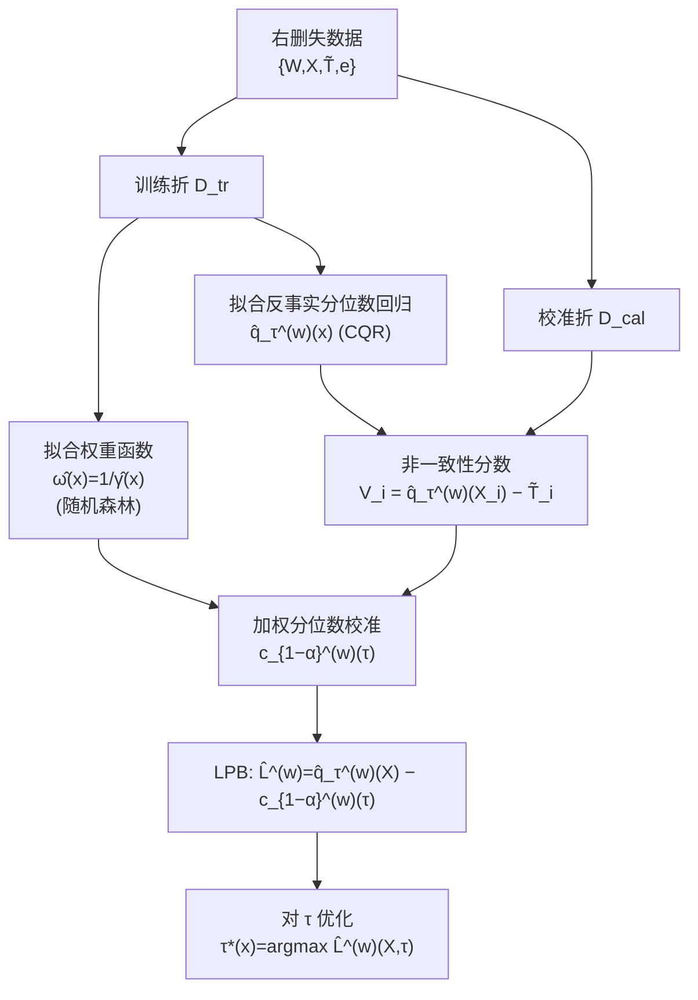

# Conformalized Survival Counterfactuals Prediction for General Right-Censored Data

**会议**: ICLR 2026  
**OpenReview**: [https://openreview.net/forum?id=1j0ormf8uI](https://openreview.net/forum?id=1j0ormf8uI)  
**代码**: 待确认  
**领域**: 因果推断 / 生存分析 / Conformal Prediction  
**关键词**: 反事实预测, 生存分析, 右删失数据, 加权 Conformal, 下预测界 (LPB), 双重稳健  

## 一句话总结
在「一般右删失 + 不同治疗方案」的临床场景下，本文用势结果框架 + 加权 conformal prediction 为反事实生存时间构造下预测界 (LPB)，把先前方法只能给出的 PAC 近似覆盖升级为**精确边际覆盖**，且对模型设定误差具有双重稳健性。

## 研究背景与动机

**领域现状**：在肿瘤等高风险医疗决策中，医生需要预测「某个病人在不同放化疗方案下能活多久」，这本质是一个反事实问题——同一个病人只能观测到一种治疗下的结果。生存数据天然带有**右删失**（很多病人在随访结束时仍存活，真实生存时间未知），传统 Cox、参数化生存函数方法依赖难以验证的分布假设，无法给出可靠的不确定性量化。相比预测整条生存函数，给出一个保守的**下预测界 (Lower Predictive Bound, LPB)**——「至少能活 L 年」——更适合高风险临床决策，因为过于乐观的预测可能导致有害的治疗选择。

**现有痛点**：Conformal prediction 已被引入右删失生存分析（Candès 2023 处理 Type-I 删失，Gui 2024 引入自适应 cutoff，Davidov 2025 扩展到一般右删失）。但这些工作有两个硬伤：(1) **不能给出治疗效应的 LPB**，多数只在删失时间超过某阈值时适用；(2) 它们提供的只是 **PAC 型保证**——即「在已观测数据上近似达到边际覆盖」，本质是用经验平均 $\hat\alpha(\tau)$ 去逼近总体量 $\alpha(\tau)$，二者之间始终有 gap。

**核心矛盾**：PAC 型覆盖在「平均意义」上成立，却可能在罕见、极端病例上失效——而这些极端 case 恰恰是临床上最致命、最需要保障的。在群体层面的精确边际覆盖才能保证对整个人群（含极端值）的安全预测。

**本文目标**：为一般右删失数据下的**反事实生存时间**构造一个 LPB $\hat L^{(w)}_{N,n}(X)$，对任意治疗 $w$ 满足精确边际覆盖 $P(T(w) \ge \hat L^{(w)}_{N,n}(X)) \ge 1-\alpha$。

**核心 idea**：在 SUTVA + 强可忽略性假设下，把「覆盖概率」改写成一个**加权期望**，从而将带删失的反事实问题转化为标准的**加权 conformal inference** 问题——这样就能用分位数回归得到精确覆盖的 LPB，绕开 PAC 方法里 $\hat\alpha(\tau)\!\approx\!\alpha(\tau)$ 的近似误差。

## 方法详解

### 整体框架

给定数据 $\{W_i,X_i,\tilde T_i,e_i\}$（$\tilde T=\min(T,C)$ 为删失后观测时间，$e=\mathbb 1\{T<C\}$ 为是否发生事件的指示），方法分两步：先在训练折 $\mathcal D_{tr}$ 上拟合**反事实分位数回归** $\hat q^{(w)}_\tau(x)$ 和**权重函数** $\hat\omega(x)$，再在校准折 $\mathcal D_{cal}$ 上用加权 conformal 把分位数估计校准成带精确覆盖保证的 LPB。关键的理论桥梁是一串恒等变换：把目标覆盖 $\alpha$ 表示成「只在已发生事件（$e=1$）的样本上、用密度比权重 $\omega(x)$ 加权」的期望，从而把反事实 + 删失问题归约成一个协变量漂移下的加权 conformal 问题。

### 关键设计

**1. 覆盖概率的加权期望重写：把删失反事实问题归约为加权 conformal。** 这是全文的理论核心。先前的自适应 cutoff 方法之所以只能给 PAC 保证，是因为它们定义 $\alpha(\tau):=P(T<\hat q_\tau(X))$ 并用经验版 $\hat\alpha(\tau)$ 去搜 cutoff，当 $\hat q_\tau$ 估不准时 $\hat\alpha(\tau)$ 与 $\alpha(\tau)$ 有 gap。本文换一条路：不去逼近 $\alpha(\tau)$，而是对 $P(V^{(w)}(X,\tilde T)\le c^{(w)}_{1-\alpha}(\tau))$ 给一个**恰好等于 $\alpha$** 的上界。通过强可忽略性（$\{T(1),T(0)\}\perp\!\!\!\perp (W,C)\mid X$）、SUTVA 与 tower property 逐步推导，得到

$$\alpha = \mathbb E\!\left[\mathbb 1\!\left(V(\tilde T,X)\ge c^{(w)}_{1-\alpha}(\tau)\right)\cdot \frac{p(W=w,e=1)}{\gamma(x)}\;\Big|\;W=w,e=1\right],$$

其中 $\gamma(x):=p(W=w,e=1\mid x)$。这一步把对**反事实总体** $P_X\times P_{T(w)\mid X}$ 的覆盖，转化成只在「接受治疗 $w$ 且事件已发生（$e=1$，此时 $T=\tilde T$ 完全可观测）」的子样本上、用密度比加权的覆盖。删失带来的「看不见真值」难题在这里被巧妙绕开——校准只用真值已知的那部分样本。

**2. 密度比权重与加权分位数校准。** 上一步引出的权重 $\omega(x)=\dfrac{p(W=w,e=1)}{\gamma(x)}$ 正是 Radon-Nikodym 导数 $\frac{dP_X}{dP_{X\mid W=w,e=1}}(x)$，刻画了「全体人群分布」与「治疗 $w$ 且事件发生子群分布」之间的协变量漂移。由于 $p(W=w,e=1)$ 在分子分母可约掉，实际上只需估 $\hat\omega(x):=1/\hat\gamma(x)$（用随机森林分类器拟合 $\gamma$）。非一致性分数取 $V^{(w)}_i=\hat q^{(w)}_\tau(X_i)-\tilde T_i$（Romano 2019 的 CQR 分数）。最终校准阈值按 Lei & Candès (2021) 的加权 conformal 取加权经验分布的分位数：

$$c^{(w)}_{1-\alpha}(\tau)=\text{Quantile}\Big(1-\alpha;\textstyle\sum_{i}\hat p_i(x)\,\delta_{V^{(w)}_i}+\hat p_\infty(x)\,\delta_\infty\Big),\quad \hat p_i(x)=\frac{\hat\omega(x_i)}{\sum_j\hat\omega(x_j)+\hat\omega(x)},$$

LPB 即 $\hat L^{(w)}_{N,n}(X)=\hat q^{(w)}_\tau(X)-c^{(w)}_{1-\alpha}(\tau)$。$\delta_\infty$ 项是加权 conformal 对测试点自身的保守补偿，保证有限样本下的精确覆盖。

**3. τ 自适应优化：让保守的下界尽量贴近真值。** 理论保证对任意 $\tau\in(0,1)$ 都成立，这给了优化空间——可以选 $\tau$ 让 LPB 尽可能大（信息量更高、不那么保守）。对每个测试点 $x$ 取

$$\tau^*(x)=\arg\max_{\tau\in(0,1)}\big(\hat q^{(w)}_\tau(x)-c^{(w)}_{1-\alpha}(\tau)(x)\big),$$

由于覆盖保证不依赖 $\tau$ 的选取，这种「先固定覆盖、再最大化 LPB」的两阶段策略不会破坏有效性，却显著提升了界的实用价值。

**4. 精确覆盖 + 双重稳健的理论保证。** Theorem 4.1 给出 distribution-free 的精确有限样本界：$P(T(w)\ge\hat L^{(w)}_{N,n}(X))\ge 1-\alpha-\tfrac12\mathbb E[|\hat\omega(X)-\omega(X)|]$，覆盖损失只取决于权重估计误差，随密度比估准而消失。Theorem 4.2 进一步证明**双重稳健**：只要权重函数 $\hat\gamma(x)$ 与反事实分位数 $\hat q^{(w)}(x)$ 中**至少有一个**估计一致，渐近覆盖 $\ge 1-\alpha$ 就成立——两个估计器互为兜底，一个失准时另一个补偿，这对临床数据这种模型容易设错的场景尤为重要。

## 实验关键数据

实验目标覆盖率统一设为 $1-\alpha=90\%$（红色虚线），评估两个指标：经验覆盖率（越接近 90% 越好）与相对 LPB（越大越信息量足）。对比方法：Uncab（不校准）、Naive、Focus 与 Fused（均为 Davidov 2025 的 PAC 型方法）。

### 主实验（合成数据，6 种设定）

| 维度 | Ours | Naive / Focus | Fused |
|------|------|---------------|-------|
| 覆盖率达标 | ✅ 6 种设定均最贴近 90% | 部分保守/不稳 | ✅ 但 PAC 型 |
| LPB 信息量 | **最高（达标方法中）** | 偏保守 | 在 setting 3/4/5 显著小于 Ours |
| 保证类型 | 精确边际覆盖 | 近似 | PAC 近似 |

> Ours 在所有满足覆盖的方法里给出最大 LPB；在 setting 3/4/5 上覆盖率与 Fused 相当但 LPB 明显更大。

### 鲁棒性（注入离群值，setting 4）

对 10% 数据减去正态噪声制造离群（$\mathcal N(1,2)\to\mathcal N(20,2)$，离群值越来越小）：Ours **始终保持 90% 覆盖**，而 PAC 型的 Focus / Fused 在离群存在时**无法保证边际覆盖**——印证了「PAC 在极端 case 上会塌」的核心动机。

### 多治疗 & τ 优化

- 多治疗场景（Figure 2）：不同治疗的 LPB 各异但都满足覆盖保证，可用于个性化方案比较与选择。
- τ 优化（Table 1，setting 4）：$\tau^*$ 选出的 LPB 与 $\tau=\alpha$ 时几乎相当（如 $\alpha=0.1$ 时 0.803 vs 0.778），说明分位数回归训练良好；$\alpha=0.05/0.10/0.15/0.20$ 对应平均覆盖率 0.958/0.914/0.872/0.845。

### 真实临床数据（541 例非小细胞肺癌）

124 维临床 + 影像组学特征，4 种放化疗方案。结果与已知临床证据一致：VMAT 的中位 LPB 高于 IMRT（与 VMAT 更优临床获益吻合）；加入诱导化疗、同步化疗带来更高 LPB（与既往研究一致），展示了方法作为「个性化治疗比较与选择的分析基准」的潜力。

### 关键发现

- 精确覆盖与高信息量可以兼得：在保证 90% 覆盖的前提下，LPB 比 PAC 型方法更不保守。
- 离群鲁棒性是精确边际覆盖相对 PAC 的实质优势，而非理论上的细枝末节。
- 真实肺癌数据上的结论与临床先验一致，增强了方法的可信度。

## 亮点与洞察

- **把删失的「难点」变成校准的「资源」**：只用 $e=1$（事件已发生、真值可观测）的样本做校准，再用密度比权重纠偏，巧妙规避了删失样本真值未知的根本困难，这是从 PAC 跨到精确覆盖的关键一招。
- **精确边际覆盖 vs PAC 的临床意义被讲透**：作者没有停留在「理论上更强」，而是用离群实验直接展示 PAC 在极端病例上失效——这正是高风险医疗最在意的尾部。
- **双重稳健让方法落地更稳**：临床数据上权重模型或分位数模型总有一个容易设错，双重稳健提供了实用的安全冗余。

## 局限与展望

- **界更宽的代价**：精确保证以更宽的预测区间为代价（setting 3/4/5 中 LPB 比 Fused 大但区间也更宽），保守性与精确性之间存在 trade-off。
- **依赖强可忽略性 + overlap**：与所有因果推断方法一样，无法验证的未观测混杂假设是根本前提，临床观察数据上未必满足。
- **权重估计质量决定覆盖损失**：Theorem 4.1 的覆盖损失项 $\tfrac12\mathbb E|\hat\omega-\omega|$ 表明高维协变量下密度比估不准会侵蚀覆盖。
- **真实数据规模有限**：541 例单中心肺癌数据，外部效度与跨中心泛化仍待验证。
- 仅考虑二元/有限治疗，连续剂量、动态治疗序列等更复杂决策场景留待后续。

## 相关工作与启发

- **生存 conformal 谱系**：Candès 2023（Type-I 删失首作）→ Qi 2024（best-guess 填补）→ Gui 2024（自适应 cutoff）→ Davidov 2025（一般右删失，PAC）。本文是这条线上**首个在一般右删失下达到精确覆盖**的反事实工作。
- **加权 conformal 与协变量漂移**：核心机制承接 Lei & Candès (2021)、Jin et al. (2023) 的加权 conformal，把因果中的「治疗组 vs 总体」漂移当作协变量漂移处理，这是 conformal 因果推断的通用范式。
- **CQR 基座**：非一致性分数沿用 Romano et al. (2019) 的 conformalized quantile regression，分位数回归可换 CQR forest / 神经网络等。
- **启发**：「先恒等变换覆盖目标 → 归约为加权 conformal → 再做 τ 自适应」的三段式套路，可迁移到其他带删失/缺失的不确定性量化问题（如竞争风险、复发事件）。

## 评分
- **新颖性**: ⭐⭐⭐⭐ — 首次在一般右删失反事实生存场景下把 PAC 升级为精确边际覆盖，覆盖概率的加权期望重写是干净且有洞察的理论贡献。
- **实验充分度**: ⭐⭐⭐⭐ — 6 种合成设定 + 离群鲁棒性 + 多治疗 + 真实肺癌数据，并与 PAC 型 SOTA 充分对比；真实数据为单中心、规模偏小略减分。
- **写作质量**: ⭐⭐⭐⭐ — 动机—方法—理论—实验逻辑清晰，恒等变换推导完整，PAC vs 精确覆盖的临床意义阐述到位。
- **价值**: ⭐⭐⭐⭐ — 为个性化治疗比较提供带精确统计保证的分析基准，在高风险医疗决策中具有直接落地价值。

<!-- RELATED:START -->

## 相关论文

- [\[ICLR 2026\] Adjusting Prediction Model Through Wasserstein Geodesic for Causal Inference](adjusting_prediction_model_through_wasserstein_geodesic_for_causal_inference.md)
- [\[ICLR 2026\] Privacy-Protected Causal Survival Analysis Under Distribution Shift](privacy-protected_causal_survival_analysis_under_distribution_shift.md)
- [\[NeurIPS 2025\] Differentiable Structure Learning and Causal Discovery for General Binary Data](../../NeurIPS2025/causal_inference/differentiable_structure_learning_and_causal_discovery_for_general_binary_data.md)
- [\[ICLR 2026\] Foundation Models for Causal Inference via Prior-Data Fitted Networks](foundation_models_for_causal_inference_via_prior-data_fitted_networks.md)
- [\[ICLR 2026\] Influence without Confounding: Causal Discovery from Temporal Data with Long-term Carry-over Effects](influence_without_confounding_causal_discovery_from_temporal_data_with_long-term.md)

<!-- RELATED:END -->
