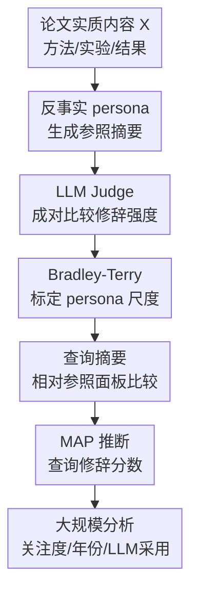

# Counterfactual LLM-based Framework for Measuring Rhetorical Style

**会议**: ICLR 2026  
**OpenReview**: [https://openreview.net/forum?id=fiohEI16sf](https://openreview.net/forum?id=fiohEI16sf)  
**代码**: 无  
**领域**: 因果推断 / 科学计量 / LLM 评估  
**关键词**: 反事实测量, 修辞风格, Bradley-Terry模型, LLM Judge, 科学写作  

## 一句话总结

这篇论文提出一个反事实 LLM 测量框架：在固定论文方法、实验和结果等实质内容 $X$ 的前提下，让不同修辞 persona 生成同一论文的反事实摘要，再用 LLM Judge 的成对比较和 Bradley-Terry 模型把抽象的“修辞强度” $Z$ 标定成连续分数；在 8,485 篇 ICLR 投稿上的实证分析显示，更强的愿景式修辞显著预测引用和媒体关注，并且 2023 年后的修辞增强与 LLM 写作辅助采用高度相关。

## 研究背景与动机

**领域现状**：机器学习论文越来越拥挤，顶会投稿量快速增长，论文摘要承担了让读者、审稿人和媒体迅速理解贡献的入口功能。已有科学计量和 NLP 工作会用 promotional lexicon、certainty classifier 或人工标注的 sensationalism/uncertainty 来度量论文语言是否更积极、更确定或更夸张。

**现有痛点**：只看最终摘要文本 $Y$ 会把“内容真的强”和“说法更强”混在一起。一篇论文如果有非常扎实的实验结果，摘要使用更自信的语言可能是合理的；另一篇论文如果证据一般但写得宏大，也会呈现类似的表面词汇。词典、分类器和直接 LLM 打分都容易在这个地方失真，因为它们面对的是单一观测文本，无法看到同一份实质内容在不同写法下会变成什么样。

**核心矛盾**：真正要测的是潜在修辞风格 $Z$，但观测到的是由实质内容 $X$ 和修辞风格共同生成的摘要 $Y$。如果不控制 $X$，就很难判断一个“strong claim”到底来自更强贡献，还是来自更强包装。论文把这个矛盾形式化为 $p(Y \mid X, Z)$：给定方法、实验和结果等实质内容，修辞强度只应该解释表达方式的变化，而不应该把论文质量本身算进去。

**本文目标**：作者想解决三个子问题：第一，构造一批在同一 $X$ 下只改变修辞风格的反事实摘要；第二，把这些反事实摘要放到同一个可比较的连续修辞尺度上；第三，用这个尺度去测量真实 ICLR 摘要，并分析修辞风格是否影响引用、媒体关注、年份趋势和 LLM 写作采用。

**切入角度**：论文借用了因果推断里的反事实直觉：如果同一篇论文的实质内容不变，只换一种作者风格或叙述语气，读者会觉得它更大胆还是更保守？LLM 正好可以扮演“受控写作者”和“成对比较裁判”：前者生成多个 what-if 摘要，后者比较哪个摘要更 overclaiming，再用统计模型汇总这些局部比较。

**核心 idea**：用 LLM persona 生成同内容不同修辞的反事实摘要，并用 Bradley-Terry 成对比较模型把“修辞强度”从文本表面和论文内容中解耦出来。

## 方法详解

### 整体框架

整套方法可以分成“构造反事实参照系”和“把真实摘要投影到参照系”两个阶段。第一阶段从论文的方法、实验和结果中抽取实质内容 $X$，让 $K$ 个不同修辞 persona 写出同一内容的反事实摘要，再通过 LLM Judge 的成对比较标定每个 persona 的修辞分数。第二阶段对一篇查询论文，同样生成 persona 参照摘要，把真实摘要逐一拿去和这些参照摘要比较，最后用正则化的 Bradley-Terry 推断得到查询摘要的修辞强度。

这张图里真正的贡献节点是“反事实 persona 生成参照摘要”“LLM Judge 成对比较修辞强度”“Bradley-Terry 标定 persona 尺度”和“MAP 推断查询修辞分数”。前后的论文抽取和下游回归分析是必要脚手架，但它们不构成单独的方法创新。

形式上，论文把摘要写作看成由 $X$ 和 $Z$ 共同控制：$X$ 是比较客观的 substantive basis，例如 preliminaries、methods、experiments、results；$Y$ 是最终摘要；$Z \in \mathbb{R}$ 是一维潜在修辞强度。更高的 $Z$ 表示更强的 rhetorical style，例如更强调影响、挑战和新颖性；更低的 $Z$ 表示更保守的写法，例如更强调适用边界、前提和不确定性。

### 关键设计

**1. 反事实 persona 生成参照摘要：固定内容后只让修辞风格变化**

传统文本指标失败的根源在于它们只看 $Y$，而本文先把 $X$ 抽出来，再要求不同 persona 在同一个 $X$ 上生成摘要：$y_{A_k} \sim \mathrm{LLM}(x, \mathrm{prompt}_{A_k})$。这里的 persona 不是为了模仿名人本身，而是为了覆盖从谨慎、技术细节导向、数学化到愿景式、推广式的修辞空间。论文使用 30 个 hand-designed personas，每个 persona 都被系统提示约束成一种学术写作倾向，并要求生成摘要长度控制在原摘要附近，从而减少长度差异对判断的干扰。

这个设计的关键是“同一内容的多种可能写法”。如果一个 persona 写得更宏大，另一个 persona 写得更谨慎，而它们依据的是同一组方法和结果，那么二者的差异更有理由归因于修辞风格而不是论文贡献本身。这就是本文与词典法或直接分类器的根本区别：它不是在观测文本里找 hype 词，而是在构造反事实参照后问“如果同一研究被另一种风格写出来，会显得多强”。

**2. LLM Judge 成对比较修辞强度：把难以直接打分的问题变成相对排序**

论文没有要求 LLM Judge 给每篇摘要直接打 1-10 分，而是让它在同一论文内容下比较两个摘要，判断哪一个“makes stronger, more sensationalized, and over-hyped claim”。成对比较比绝对评分稳定，因为 Judge 只需要在两个候选之间选择更强的那个，不必维护一个跨年份、跨领域、跨主题的全局评分标准。

这种设计也贴近 RLHF/DPO 里的偏好数据形式，但用途不同：RLHF 用偏好训练奖励模型或策略，本文用偏好构造测量尺。对于 persona 校准，论文对每一对 persona 抽取多个论文实例，生成对应反事实摘要，再收集 LLM Judge 的胜负结果。胜负本身是有噪声的，因此后续需要一个能把大量局部比较整合成全局尺度的统计模型。

**3. Bradley-Terry 标定 persona 尺度：从局部胜负推断连续修辞分数**

给定两个 persona $A_1$ 和 $A_2$，论文用 Bradley-Terry 模型描述摘要 $y_{A_1}$ 被判为修辞更强的概率：$P(y_{A_1} \succ y_{A_2}) = \frac{\pi_{A_1}}{\pi_{A_1}+\pi_{A_2}}$。其中 $\pi_{A_k}$ 是 persona 的修辞强度参数，最后用 $s_k=\log(\pi_k)$ 得到连续分数。这个模型的好处是，它不只输出谁更强，还能把所有 persona 放到一条一维尺度上。

为什么这一步重要？因为查询摘要的分数需要一个参照系。如果 persona 面板只是一堆未校准写作者，那么真实摘要赢过“谨慎 persona”和赢过“愿景 persona”的含义完全不同。Bradley-Terry 校准后，每个 persona 都成了一个已知位置的 anchor；真实摘要相当于和一组标尺比较，再根据胜负模式推断自己落在哪个位置。

**4. MAP 推断查询修辞分数：避免少量比较下的无穷大和塌缩**

对于每篇真实论文，框架会把原始摘要 $y_q$ 和 30 个 persona 参照摘要逐一比较，得到 $K$ 个胜负结果。理论上可以继续用 Bradley-Terry 的极大似然估计查询摘要参数 $\pi_q$，但这里每个 query 对每个 persona 只有一次比较，数据非常稀疏。如果某个真实摘要赢过全部 persona，MLE 会把它的分数推向无穷；如果输给全部 persona，分数会趋近负无穷或零附近，这会让极端案例不稳定。

因此论文对 $s_q=\log(\pi_q)$ 加 Gaussian prior，采用 MAP 估计，把 Bradley-Terry likelihood 和先验惩罚合在一起优化。直观上，MAP 允许摘要很强或很弱，但不会因为 30 次比较里出现全胜/全负就给出不可用的极端值。作者还讨论了 adaptive Bayesian inference：每轮选择当前 posterior median 附近的 persona 来比较，以最大化信息增益；不过本文规模足够大，最终采用 batch MAP 就能支撑主要分析。

### 一个完整示例

假设有一篇论文的方法和实验说明了“提出一个新优化器，在 6 个基准上比 AdamW 稳定，平均提升 1.8%，但在大模型预训练上只做了中等规模实验”。框架首先把这些方法、实验和结果作为 $X$ 提取出来，去掉摘要里原本可能带有的叙事和影响声明。

然后 30 个 persona 会基于同一 $X$ 生成不同摘要。一个谨慎统计学家 persona 可能写成“该优化器在所测设置中表现出一定稳定性，但泛化到更大规模仍需进一步验证”；一个工业研究员 persona 可能强调“在多个基准上带来稳定经验收益”；一个愿景式 persona 可能写成“为可靠训练下一代模型提供了新的方向”。这些摘要都不能改变实验数字，但可以改变贡献被放大的程度、边界条件的显著性和影响范围的写法。

接着 LLM Judge 对这些候选做成对比较，例如判断愿景式摘要比谨慎摘要更 overclaiming，工业研究员摘要比方法细节型摘要更强。Bradley-Terry 模型把多次胜负汇总为 persona 尺度。最后，如果原始摘要赢过了谨慎、细节型和教学型 persona，却输给了 Fei-Fei/Pieter/Ilya 这类更愿景式 persona，它的分数就会落在中高区间；如果它连最保守 persona 都常常赢，MAP 会把它放到更高位置，但仍通过先验避免无限发散。

### 损失函数 / 训练策略

本文不是训练一个新神经网络，而是一个“生成-比较-统计推断”的测量流程。核心优化来自两个统计估计问题。第一个是 persona 校准：给定大量 persona pair 的胜负结果，通过最大化 Bradley-Terry likelihood 估计 $\hat{\pi}=\{\pi_{A_1},\ldots,\pi_{A_K}\}$。第二个是 query inference：给定查询摘要相对各 persona 的胜负结果，在 $s_q$ 上加入 Gaussian prior 后最大化 posterior。

实现上，作者使用 GPT-4o-mini 从 PDF 中抽取方法、实验和结果作为 substantive content，使用 GPT-4o 进行 pairwise judge。persona 面板规模为 30；persona-persona 校准阶段每对 persona 抽 20 篇论文生成反事实摘要并比较，总计 8,700 次成对比较；查询测量阶段对 8,485 篇 ICLR 投稿各生成 30 个 persona 摘要并比较，总计 254,550 次额外比较。摘要生成时还约束长度在原始摘要的 $\pm 15$ 个词以内，以避免“长摘要显得更强”这类无关因素污染修辞尺度。

## 实验关键数据

### 主实验

论文的主实验不是单一 benchmark accuracy，而是验证修辞分数是否能解释真实科研传播结果。数据集包含 2017-2025 年 8,485 篇 ICLR 投稿，每年随机抽样约 1,000 篇；作者抽取全文中的方法、实验和结果作为 $X$，原摘要作为 $Y$。下表概括了不同修辞测量指标对下游关注度的回归预测能力，所有模型都控制平均审稿分、研究子领域和年份。

| 指标 | Citation 系数 | Post 系数 | Tweet 系数 | Feeds 系数 | Patent 系数 | Account 系数 | 结论 |
|------|---------------|-----------|------------|------------|-------------|---------------|------|
| 本文 rhetorical score | 24.53*** | 3.19*** | 2.51*** | 0.03*** | 0.04** | 2.71*** | 对学术引用和媒体关注都稳定显著 |
| Direct rating score | -26.11* | 0.74 | 0.75 | 0.00 | 0.01 | 0.77 | 方向不稳定，不能一致预测关注度 |
| Promotion score | 20.01† | 0.64 | 0.51 | 0.02* | 0.02 | 0.57 | 只在少数结果上边际显著 |
| Certainty score | 59.56 | -12.74* | -9.74* | -0.02 | 0.17 | -9.97* | 与关注度关系不一致 |

一个重要参照是：一单位平均审稿分对应约 89 次额外引用，而本文修辞分数一单位对应约 24 次额外引用。这说明修辞不是论文质量的替代品，但它对传播结果的解释量并不小。与此同时，本文 rhetorical score 与平均审稿分几乎无关，Spearman $\rho=-0.015$，$p=0.225$，说明它没有简单测到“论文更好所以写得更强”。

### 消融实验

论文对测量框架的可靠性做了多组验证，重点不是去掉某个神经网络模块，而是检验 persona 选择、LLM Judge 和面板规模是否会改变分数排序。

| 配置 / 验证 | 关键指标 | 说明 |
|-------------|----------|------|
| 互补 persona 子集 | mean Spearman $\rho=0.89$ | 30 个 persona 随机拆成两个不重叠的 15 人子集，重复 1,000 次后论文排序仍高度一致 |
| 人类标注 vs LLM Judge | pairwise agreement 88.4% | 42 名 Prolific 参与者对 69 个唯一比较做标注，多数投票与 LLM Judge 高度一致 |
| 人类 BT 分数 vs LLM BT 分数 | Spearman $\rho=0.92$, $p<0.001$ | 聚合层面的人类修辞尺度和 LLM 修辞尺度强相关 |
| persona 数量收敛 | $k=8$ 时相关性超过 0.89；$k=15$ 时 0.958±0.005 | 说明不必依赖完整 30 persona 面板，较小面板也能稳定复现相对排序 |
| persona 覆盖范围 | win rate 从 14% 到 94% | 最谨慎到最强势 persona 都存在，查询摘要不容易全部落在面板之外 |

### 关键发现

- 本文指标的分布接近 Gaussian，范围约为 -4.74 到 4.53；直接 LLM rating 大量挤在 2-3 分，分辨率明显不足。
- 修辞分数显著预测 citations、posts、tweets、feeds、patents 和 accounts，但不预测平均审稿分。这支持“摘要修辞影响传播注意力，但审稿人主要看全文质量”的解释。
- 年份趋势上，平均修辞分数从 2018 到 2022 略有下降，2023 后快速上升。
- 子领域存在系统差异：CV、NLP、computational biology 等应用领域平均修辞更强；kernel methods、optimal transport、supervised representation learning 等理论或方法导向领域更保守。
- 在 2024-2025 子集里，按修辞分数分成 10 组后，组均修辞分数与 Liang et al. (2024) 估计的 LLM 使用率 Pearson $r=0.904$；最高修辞组的估计 LLM 使用率为 20.9%，最低组为 9.0%。
- 作者还做了反证：2017-2023 的人类写作基线中，高修辞组的估计 LLM 使用率仍接近 0；对所有已知为 LLM 生成的 persona 摘要，persona 修辞分数与估计 LLM 使用率相关性仅 $r=0.04$。这说明检测器不是简单把“修辞强”误判成“LLM 写”。

## 亮点与洞察

- 这篇论文最漂亮的地方是把“hype”从道德判断变成了测量问题。它没有直接说某篇论文夸张，而是问：在同一实质内容下，这个摘要相对一组反事实写法处在什么修辞位置。
- 反事实生成的设计很适合解决内容-风格混淆。很多 NLP 风格指标的问题不是模型不够强，而是观测数据本身没有 counterfactual；本文用 LLM 补出了同一 $X$ 下的多种 $Y$，给测量提供了缺失参照。
- 用成对比较代替绝对评分是一个可复用 trick。对于“更有说服力”“更保守”“更礼貌”“更有攻击性”这类难以全局定标的属性，pairwise judge + Bradley-Terry 往往比直接打分更稳。
- MAP 推断这个细节很实际。真实摘要只和每个 persona 比一次，如果不加 prior，极端胜负模式会直接把分数推爆；作者没有回避这个稀疏测量问题，而是用统计正则化把工具做得可用。
- 论文把方法验证和社会科学问题连起来：先证明 persona 和 Judge 可靠，再用修辞分数解释引用、媒体和 LLM 写作趋势。这让它不只是一个 LLM-as-judge pipeline，也是一篇关于科研传播规范变化的实证研究。
- 这个框架可以迁移到其他潜在文本属性，例如审稿语气强度、新闻标题煽动性、政策文本立场强弱、产品文案夸张程度。关键条件是能提取相对固定的内容基础，并能设计覆盖目标属性范围的 persona 面板。

## 局限与展望

- 当前把修辞强度压成一维 $Z$，会牺牲细粒度解释。novelty claim、impact claim、generality claim、certainty/uncertainty 其实可能是不同维度，一篇摘要可以很强调应用影响但很谨慎地描述实验边界。
- persona 是人工设计的，虽然作者证明对随机子集稳健，但面板构造仍可能带有研究者偏好。未来可以用更系统的 persona discovery、主动采样或从真实作者风格分布中学习 anchor。
- LLM Judge 可能继承模型偏见，例如偏好某些学科写法、英语表达习惯或顶会摘要模板。人类验证很强，但样本只有 69 个唯一比较，仍不足以覆盖所有子领域和极端风格。
- 方法只测摘要级修辞，而审稿和长期引用可能也受到 introduction、conclusion、related work 甚至标题的影响。扩展到全文多段落修辞轨迹，会更贴近真实科研传播过程。
- 论文用 reviewer score 控制“质量”，但审稿分本身也有噪声，并不能完全代表技术贡献。修辞分数预测引用的结果应理解为相关性强，而不是证明修辞导致引用增加。
- LLM 写作采用分析依赖 Liang et al. (2024) 的群体级估计，不能判断某一篇摘要是否由 LLM 写成。后续如果能结合真实写作日志或作者调查，会更好地区分工具采用、社区规范变化和作者策略变化。

## 相关工作与启发

- **vs promotional lexicon / hype index**: 词典法统计摘要中促销性词汇比例，优点是透明便宜；本文则通过固定 $X$ 构造反事实摘要，能更直接地区分“强结果合理强表述”和“弱证据强包装”。
- **vs certainty classifier**: 确定性分类器关注句子是否表达 uncertainty，适合分析 hedging 趋势；本文关注更宽的 rhetorical strength，包括影响范围、愿景框架、挑战叙述和新颖性声明。
- **vs direct LLM rating**: 直接评分让 LLM 同时读摘要和方法结果后给 1-10 分，概念上简单，但实验里分数集中在 2-3 且下游预测不稳定；本文的成对比较和 BT 标定给了更细的连续尺度。
- **vs RLHF / DPO**: RLHF 和 DPO 也使用同输入多输出的偏好比较，但目标是学习奖励或优化策略；本文把偏好比较当成测量仪器，用于估计潜在修辞属性而不是训练写作模型。
- **vs 政治文本 pairwise scaling**: 政治学里常用多篇报道描述同一事件来推断立场或 slant；本文把这一思想迁移到科学写作，用 LLM 生成同一科研内容的多种 counterfactual 表达。
- **启发**: 如果一个文本属性难以直接标注，先问“能否固定内容、只改变这个属性”可能比堆更复杂的分类器更有效。LLM 在这里不是答案生成器，而是受控实验里的 counterfactual generator 和 noisy judge。

## 评分

- 新颖性: ⭐⭐⭐⭐⭐ 反事实 persona + Bradley-Terry 把科学修辞测量做成可校准尺度，问题定义和方法组合都很有辨识度。
- 实验充分度: ⭐⭐⭐⭐☆ 覆盖 8,485 篇 ICLR 投稿、25 万级比较，并有人类验证和多种稳健性分析；不足是人工验证规模和全文层面分析还可以继续扩大。
- 写作质量: ⭐⭐⭐⭐☆ 论文结构清楚，问题动机和方法链条顺畅；部分 persona 设计和 LLM 使用率解释仍需要读附录才能完全把握。
- 价值: ⭐⭐⭐⭐⭐ 既给 LLM-as-instrument 提供范例，也为讨论科研 hype、LLM 写作辅助和评审规范提供了可操作的量化工具。

<!-- RELATED:START -->

## 相关论文

- [\[ICLR 2026\] On Measuring Influence in Avoiding Undesired Future](on_measuring_influence_in_avoiding_undesired_future.md)
- [\[ICLR 2026\] NextQuill: Causal Preference Modeling for Enhancing LLM Personalization](nextquill_causal_preference_modeling_for_enhancing_llm_personalization.md)
- [\[ICLR 2026\] Meta-Router: Bridging Gold-standard and Preference-based Evaluations in LLM Routing](meta-router_bridging_gold-standard_and_preference-based_evaluations_in_llm_routi.md)
- [\[ACL 2026\] Parallel Universes, Parallel Languages: A Comprehensive Study on LLM-based Multilingual Counterfactual Example Generation](../../ACL2026/causal_inference/parallel_universes_parallel_languages_a_comprehensive_study_on_llm-based_multili.md)
- [\[ICLR 2026\] Efficient Ensemble Conditional Independence Test Framework for Causal Discovery](efficient_ensemble_conditional_independence_test_framework_for_causal_discovery.md)

<!-- RELATED:END -->
