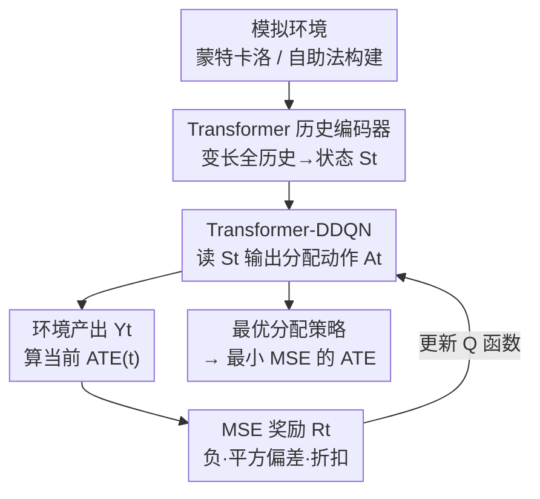

# Designing Time Series Experiments in A/B Testing with Transformer Reinforcement Learning

**会议**: ICLR2026  
**OpenReview**: [https://openreview.net/forum?id=T9PNKPmjGc](https://openreview.net/forum?id=T9PNKPmjGc)  
**代码**: 待确认（作者承诺在补充材料中开源）  
**领域**: 因果推断 / 实验设计 / A/B 测试 / 强化学习 / 时序实验  
**关键词**: A/B 测试, 实验设计, 平均处理效应, 残留效应, Transformer 强化学习

## 一句话总结
针对"在时序实验里如何分配处理（新策略 vs 旧策略）才能让 ATE 估计的 MSE 最小"这个 A/B 测试设计问题，本文先用一个不可能性定理证明"不看全历史的分配策略必然次优"，再用 Transformer 把全历史编码成状态、用 double deep Q-network 直接以 MSE 作为（负）奖励来学最优分配策略，在合成数据、派单模拟器和真实网约车数据上 MSE 一致低于各类 switchback / MDP 设计。

## 研究背景与动机

**领域现状**：A/B 测试是 Airbnb、DoorDash、美团、Uber、滴滴这类公司做策略评估的"金标准"——把实验单元随机分到处理组（新策略）和对照组（旧策略），再估计平均处理效应（ATE）来判断新策略是否更优。但在网约车这类场景里，平台对同一市场**按时间顺序连续地施加策略**（这一时段用新派单算法、下一时段用旧的），数据天然是时间序列，经典 i.i.d. 假设的 A/B 测试不再适用。

**现有痛点**：时序 A/B 测试面临三个硬骨头：(1) **残留效应（carryover effect）** 普遍存在——某时刻的派单/调度/补贴策略会改变司机在城市里的空间分布，从而影响未来时段的产出，违反经典的 SUTVA 假设，直接套 i.i.d. 方法会让 ATE 估计不显著；(2) **处理效应极小**——新派单策略的提升通常只有 0.5%~2%，很难和噪声区分；(3) **实验时长有限**——通常只能跑几周，样本量小。后两个问题要靠**精心设计实验**（决定每个时段到底投放新策略还是旧策略）来缓解，同时还要在设计里把残留效应考虑进去。

**核心矛盾**：现有时序实验设计有两个共同的根本局限。其一，它们的分配策略 $\pi_t$ **只依赖有限历史**——要么只看当前观测（Markov 设计）、要么只看首个动作（静态设计）、要么只看最近 $q$ 个动作（短记忆设计）、要么只看时间索引 $t$（switchback 设计）。其二，为了能解析地写出 MSE 这个优化目标，它们**强加了限制性假设**（MDP 模型、ARMA 模型、或残留效应只持续几个时段）。一旦真实数据违背这些假设，设计就失效。

**本文目标**：在时序 A/B 测试中找到最优的处理分配策略 $\pi=\{\pi_t\}$，使估计出的 ATE 的均方误差 $\mathrm{MSE}(\pi)=\mathbb{E}_\pi([\widehat{\mathrm{ATE}}-\mathrm{ATE}]^2)$ 最小，且不依赖上述限制性假设、能处理任意长程的残留效应。

**切入角度**：作者先从理论上追问——"只看部分历史"到底会不会损失最优性？答案是会，而且是**结构性地一定会**。这把"必须看全历史"从经验直觉升格为定理，从而为引入能吃变长全历史的 Transformer 提供了硬理由；又因为解析 MSE 很难，索性用 RL 把 MSE 当奖励**直接数值优化**，彻底绕开建模假设。

**核心 idea**：用 Transformer 编码全历史当状态、用 RL 直接最小化 MSE，把"时序实验设计"重写成一个序贯决策的强化学习问题。

## 方法详解

### 整体框架

把"设计时序 A/B 实验"重新表述成一个序贯决策问题：实验持续 $T$ 个时段，每个时段开始时观测到特征 $O_t$，决策者要选动作 $A_t\in\{-1,1\}$（投放对照策略 -1 还是新策略 1），时段结束观测到产出 $Y_t$。整条数据 $\{O_t,A_t,Y_t\}$ 时间相关。本文不关心"给定数据怎么估 ATE"（那是已有的大量文献），而关心**互补的设计问题**：给定一个 ATE 估计器，怎么沿时间分配动作，让最终 ATE 估计的 MSE 最小。

整体流程（也是 RL 的交互回路）：先构造一个**模拟环境**来近似真实数据生成过程；在环境里，每个时段把**到此刻为止的全历史**喂给一个 **Transformer 编码器**得到状态 $S_t$；一个 **Transformer-DDQN agent** 读 $S_t$ 输出动作 $A_t$；环境给出产出后，用"当前 ATE 估计与蒙特卡洛真值的平方偏差"作为**（负）奖励 $R_t$**；反复采样轨迹训练 Q 函数，收敛后贪婪策略就是要找的最优分配策略，部署时即可让 ATE 估计达到最小 MSE。

### 关键设计

**1. 不可能性定理：把"必须看全历史"从直觉变成铁律**

现有设计普遍只让 $\pi_t$ 依赖有限历史信息（当前观测、首个动作、最近几个动作或时间索引），作者首先要回答：这种"偷懒"到底会不会损失最优性。设问题里的 ATE 估计器取**双重稳健（doubly robust）估计器**（因其在带/不带 Markov 假设的序贯决策中都被广泛使用），在温和正则条件下它渐近无偏，于是 MSE 等价于其渐近方差 $\mathrm{Var}(\pi)$，且达到半参数效率界。定理 1 证明：存在数据生成过程 $\{P_t\}_t$，使最小化 $\mathrm{Var}(\pi)$ 的最优策略 $\pi$ 在每个时刻 $1\le t\le T$ **都依赖全部过去历史，且该最优策略唯一**。换言之，只要 $\pi_t$ 在任何一步漏掉了某个观测、动作或产出，它就不可能是最优的。这条结果是全文方法的"地基"——它把"用 Transformer 吃全历史"从工程选择变成理论必需，因为时序实验里的动态依赖让任何截断历史的策略都结构性次优。

**2. Transformer 历史编码器：把变长全历史压成状态**

既然必须看全历史，难点是历史长度随时间增长、维度可变。作者把 RL 的状态直接定义为全历史 $S_t=\{O_1,A_1,Y_1,\dots,O_{t-1},A_{t-1},Y_{t-1},O_t\}$，并用带**掩码自注意力（masked self-attention）** 的 Transformer 来编码它。选 Transformer 有两个针对性理由：其一，$S_t$ 的维度随 $t$ 变化，Transformer 天然能处理变长输入、把任意长的历史编码成固定表示；其二，相比 RNN，Transformer 能捕捉**长程依赖**，确保所有可能影响最优分配的历史变量都被有效利用——这正好对上残留效应"持续整个实验、长程相关"的特性。这一步是把定理 1 的理论要求落地的实现手段：状态里塞进全历史，下游 agent 才有可能逼近那个"依赖全历史"的唯一最优策略。

**3. Transformer-DDQN：用价值函数贪婪地学最优分配**

有了状态表示，作者用 **double deep Q-network（DDQN）** 的一个变体来学最优分配策略。定义 Q 函数
$$Q_t(S_t,A_t)=\mathbb{E}_{\pi_{\mathrm{opt}}}\Big[\sum_{k=t}^{T}\gamma^{k-t}R_{k-t}\,\Big|\,S_t,A_t\Big],$$
其中 $\pi_{\mathrm{opt}}$ 是目标最优分配策略，对 Q 函数取贪婪即得。Q 函数用前述带掩码自注意力的 Transformer 参数化，因此天然吃变长的 $S_t$。训练时反复从模拟环境采样轨迹，损失取 Q 函数与学习目标之间的平方误差，用 AdamW + 余弦学习率调度 + 梯度裁剪 + 混合精度训练优化。用 DDQN 而非单 Q 网络是为缓解 Q-learning 的过估计偏差，使学到的分配策略更稳。这一步把"设计实验"彻底转成了标准的序贯决策学习问题：动作就是处理分配，状态就是全历史，价值最大即 MSE 最小。

**4. MSE 即奖励：直接优化目标，免掉建模假设**

现有方法之所以要强加 MDP/ARMA 假设，是因为只有这样才能解析地写出 MSE 来优化。本文反其道——既然 RL 能数值优化任意奖励，那就把 MSE 本身设成奖励。具体地，运行 RL 前先用蒙特卡洛在模拟器里跑大量轨迹、分别按新策略和对照策略算出 $\mathrm{ATE}_{\mathrm{mc}}$，当作 oracle ATE 真值；RL 过程中每个时刻 $t$ 用截至 $t$ 的三元组算出 $\widehat{\mathrm{ATE}}(t)$，奖励设为
$$R_t=-\alpha^{T-t}\big(\widehat{\mathrm{ATE}}(t)-\mathrm{ATE}_{\mathrm{mc}}\big)^2,$$
其中 $\alpha\in[0,1)$ 是折扣因子。三处巧思：负号让"MSE 越小奖励越大"；平方偏差正是 MSE 的逐步代理；折扣 $\alpha^{T-t}$ 给早期（样本少、ATE 估计不准）的步骤降权，极端地当 $\alpha=0$ 时只有末步奖励 $R_T$ 起作用。$R_t$ 刻意区别于公司真实产出 $Y_t$——它是 MSE 的代理而非业务指标。因为奖励直接锚定 MSE，ATE 估计器 $\widehat{\mathrm{ATE}}(t)$ 可以是**任意算法**（含数据融合方法），整个流程对数据生成过程几乎不作假设，这正是相对现有设计的核心松绑。

### 损失函数 / 训练策略

Q 函数学习用 Q 值与学习目标之间的**平方损失**；优化器为 AdamW，配余弦学习率调度、梯度裁剪与混合精度训练以提速。模拟环境的构造有三条路径：有物理模拟器时直接用（网约车场景下，策略上线前本就用历史数据建的模拟器离线评估）；无模拟器时**序贯进行**——每天用已采集的实验数据估计数据生成过程、构造当天模拟器、为次日设计实验，随数据累积不断更新模拟器与设计；真实数据实验里还用**wild bootstrap**（Wu et al., 1986）从 A/A 数据估计的数据生成过程里构造仿真环境。

## 实验关键数据

评测对比的设计包括：本文 **TRL**；针对 MDP 的 **TMDP/NMDP**（每天切换、日内同处理）；以及四类 switchback 设计 **HW / BSZ / XCT / WSY**（每隔几个时段切换处理，前三者随机切换间隔、WSY 固定间隔，差异在所用 ATE 估计器）。三个环境，每个跑 400 次仿真重复，比 ATE 估计的 MSE。

### 主实验

| 环境 | 设置 | 结论 | 代表数据（MSE，越小越好） |
|------|------|------|------|
| 合成模拟器 | $n\in\{30,..,45\}$ 天, $M=4$ 区间 | TRL 多数设置 MSE 最小、CI 最短 | $n=45$ Setting(i)：TRL **19** vs NMDP 28 / TMDP 48 / HW 47 |
| 真实网约车 A/A | $n\in\{21,..,42\}$, $M\in\{12,24\}$, 提升 5% | TRL 一致最优，$n$ 小时优势尤其明显 | $M=24,n=42$：TRL **67** vs HW 53? / NMDP 106 / TMDP 53 |
| 公开派单模拟器 | $9\times9$ 网格, 20 步/天, $n\in\{35,40\}$ | TRL 一致最优，$n$ 增大 MSE 更低 | $n=40$：TRL **50** vs NMDP 66 / TMDP 62 |

> ⚠️ 上述数字来自论文柱状图（Figure 3–5）的读数，单位分别为 $\times10^{-4}$（合成/真实）与 $\times10^{-2}$（派单），仅作量级参考，精确值以原文图表为准。

### 关键发现

- **合成环境里 switchback 全面落后**：HW/BSZ/XCT 的 MSE 显著大于其余设计；NMDP/TMDP 接近 TRL（因为合成数据日间 i.i.d.、日内恰是 MDP，正中它们的最优假设），但 TRL 凭 Transformer 对历史信息的利用，在有限样本下仍更优。
- **真实数据里 TMDP/NMDP 反而变差**：A/A 数据产出存在正相关，此时"每天切换"的 TMDP/NMDP 不再最优，而 switchback 与 TRL 受益；TRL 仍取得最低 MSE，尤其在样本量 $n$ 小时领先最明显——直接呼应"实验时长有限"这一痛点。
- **样本越少优势越大**：多个环境里 TRL 相对基线的领先幅度随 $n$ 减小而扩大，说明它在小样本下更能榨干历史信息。

## 亮点与洞察

- **把"设计实验"变成"RL 优化目标"**：最巧的一步是认识到——既然解析 MSE 要靠假设，那干脆用 RL 数值优化 MSE，让奖励 $R_t$ 直接锚定平方偏差。这把整类需要 MDP/ARMA 假设的设计问题一次性松绑，思路可迁移到任何"目标函数难解析但能仿真"的实验设计场景。
- **理论先行、再上模型**：先证不可能性定理说明"必须看全历史"，再引 Transformer——动机不是"Transformer 很强所以用"，而是"理论要求全历史、Transformer 恰好能吃变长全历史"。这种"定理 → 架构选型"的论证链很值得学。
- **奖励里的折扣是 MSE 专属设计**：$\alpha^{T-t}$ 给早期样本少、ATE 估计不准的步骤降权，$\alpha=0$ 退化为只看末步——这是把"样本量随时间增长、估计精度随之提升"的统计直觉直接编码进奖励。

## 局限与展望

- **强依赖模拟环境的保真度**：奖励里的 $\mathrm{ATE}_{\mathrm{mc}}$ 是模拟器里的蒙特卡洛真值，若模拟器与真实数据生成过程偏差大，学到的"最优设计"可能只是对模拟器最优；序贯构造模拟器时早期数据少也会放大这一风险。
- **只做二元处理、单实验单元**：动作限定 $A_t\in\{-1,1\}$，且不处理跨单元的溢出/干扰效应；作者也把"扩展到多实验单元、含 spillover"列为未来工作。
- **计算成本与可复现性**：Transformer-DDQN 比解析设计重得多，且真实网约车数据因数据协议不能公开，外部完全复现受限（作者承诺公开基于公开数据的代码）。
- **缺与解析最优设计的理论桥接**：方法证明了"不看全历史会次优"，但没给出 TRL 学到的策略离那个唯一最优策略有多近的理论保证，优势主要靠有限样本实验体现。

## 相关工作与启发

- **vs Markov 设计（Glynn et al., 2020）**：他们用有限 MDP 建模、$\pi_t$ 只依赖当前观测 $O_t$，解凸优化得最优 Markov 设计；本文证明这类"只看当前观测"按定理 1 次优，并用全历史 + RL 绕开 MDP 假设。
- **vs 静态 / Neyman 设计（Li et al., 2023a, TMDP/NMDP）**：他们把 Neyman 分配扩到 MDP、日内同处理，$\pi_t$ 只依赖首个动作；在 i.i.d. 日间合成数据上接近 TRL，但在真实正相关数据上明显变差。
- **vs switchback 设计（Bojinov et al., 2023; Wen et al., 2025, BSZ/WSY 等）**：他们固定/随机间隔交替处理、$\pi_t$ 只依赖时间索引，且最优切换时长依赖残留效应持续期；本文不限定切换模式，让分配条件于全历史。
- **vs 用 RL 估 ATE 的工作**：第三类文献也用 RL，但把它当作"残留效应下 ATE 估计的建模框架"；本文把 RL 当**纯计算工具**来最小化 MSE、做实验设计，问题目标根本不同。

## 评分
- 新颖性: ⭐⭐⭐⭐⭐ 不可能性定理 + Transformer 编码全历史 + MSE 即奖励，三者组合在时序实验设计里是全新角度。
- 实验充分度: ⭐⭐⭐⭐ 合成 / 公开派单模拟器 / 真实网约车三档环境 + 400 次重复，覆盖到位；但主结果以柱状图呈现、缺精确数值表，且真实数据不可公开。
- 写作质量: ⭐⭐⭐⭐ 理论动机与方法叙述清晰、相关工作梳理详尽；奖励与定理部分对非统计背景读者门槛偏高。
- 价值: ⭐⭐⭐⭐⭐ 直击工业界时序 A/B 测试的真实痛点（小效应、短时长、残留效应），方法对网约车/外卖等平台有直接落地价值。

<!-- RELATED:START -->

## 相关论文

- [\[ICLR 2026\] Resisting Contextual Interference in RAG via Parametric-Knowledge Reinforcement](resisting_contextual_interference_in_rag_via_parametric-knowledge_reinforcement.md)
- [\[ICLR 2026\] Journey to the Centre of Cluster: Harnessing Interior Nodes for A/B Testing under Network Interference](journey_to_the_centre_of_cluster_harnessing_interior_nodes_for_ab_testing_under_.md)
- [\[NeurIPS 2025\] A Principle of Targeted Intervention for Multi-Agent Reinforcement Learning](../../NeurIPS2025/causal_inference/a_principle_of_targeted_intervention_for_multi-agent_reinforcement_learning.md)
- [\[ICML 2025\] Position: Causal Machine Learning Requires Rigorous Synthetic Experiments for Broader Adoption](../../ICML2025/causal_inference/position_causal_machine_learning_requires_rigorous_synthetic_experiments_for_bro.md)
- [\[ICML 2025\] Transformer-Based Spatial-Temporal Counterfactual Outcomes Estimation](../../ICML2025/causal_inference/transformer-based_spatial-temporal_counterfactual_outcomes_estimation.md)

<!-- RELATED:END -->
