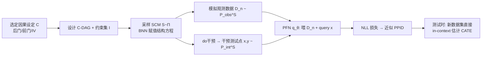

# Foundation Models for Causal Inference via Prior-Data Fitted Networks

**会议**: ICLR 2026  
**OpenReview**: [https://openreview.net/forum?id=d2L1ndOKjq](https://openreview.net/forum?id=d2L1ndOKjq)  
**代码**: [https://github.com/yccm/CausalFM](https://github.com/yccm/CausalFM)  
**领域**: 因果推断 / 表格基础模型 / In-Context Learning  
**关键词**: PFN, 因果推断, CATE, 结构因果模型, 贝叶斯推断, 工具变量, 前门调整  

## 一句话总结
CausalFM 把"表格基础模型"PFN 搬到因果推断：用结构因果模型（SCM）造合成先验、在合成数据上预训练一个 Transformer，使其能在不重训的情况下，通过 in-context learning 对后门 / 前门 / 工具变量三类设定直接给出贝叶斯式的 CATE 估计。

## 研究背景与动机
- **领域现状**：深度学习已成为因果效应估计的主力（S/T/X-learner、TARNet、DR-learner 等），擅长处理高维协变量与异质效应。与此同时，基础模型（LLM、ViT）凭借"预训练一次、测试时直接推断、无需重训"的范式横扫 NLP / CV，而 PFN（Prior-Data Fitted Networks，如 TabPFN）把这套范式带进了表格预测：在合成先验数据上预训练，靠 in-context learning 实现近似贝叶斯推断。
- **现有痛点**：主流因果方法对每个新数据集都要重新训练、人工选模型、调超参，缺乏"开箱即用"的灵活性；这与基础模型的测试时推断范式格格不入。
- **核心矛盾**：把 PFN 直接套到因果上并不平凡——预测目标是**干预分布** $P_{\text{int}}$，但手里只有从**观测分布** $P_{\text{obs}}$ 采的数据，二者之间隔着可识别性假设（一致性、正性、无混淆/前门/IV 条件）。两个并发工作（CausalPFN、Do-PFN）要么只支持后门调整，要么干脆不给可识别性保证。
- **本文目标**：给出一个**通用配方**，能为各种因果推断设定（后门、前门、IV）训练 PFN 基础模型，且建立在严格的可识别性之上。
- **核心 idea（加粗标签）**：**用 SCM 构造"观测-干预分布对"的贝叶斯先验**，让 PFN 在合成的反事实数据上学习近似后验预测干预分布（PPID），从而只需知道因果查询 $Q$ 本身、而不必逐个设定去手推识别公式 $\bar{Q}$。

## 方法详解

### 整体框架
CausalFM 由两块组成：**先验构造**（怎么造合成数据）与**训练算法**（怎么训 PFN）。先验侧不再为观测分布 $P_{\text{obs}}$ 单独建模，而是用 SCM 同时刻画 $(P_{\text{obs}}, P_{\text{int}})$ 这对分布；训练侧把标准 PFN 损失改成"喂观测数据、预测干预结果"的形式，让模型在合成 SCM 模拟出的反事实数据上学会跨数据集的 in-context 因果推断。

### 关键设计

**1. SCM 先验：为"观测-干预对"建模而非只建观测分布。** 朴素做法是直接给 $P_{\text{obs}}$ 放先验，再套识别公式 $\bar{Q}$ 得估计量，但这要求逐设定手推 $\bar{Q}$（IV 设定甚至要解积分方程），且难以直接控制因果查询 $Q$ 的先验分布，易导致先验误设。CausalFM 转而对分布对 $(P_{\text{obs}}, P_{\text{int}}) \in \mathcal{P}_{\text{obs}} \times \mathcal{P}_{\text{int}}$ 放先验，自然的载体就是 SCM——它本质是个模拟器：采隐变量 $U \sim P$、过结构方程 $f$ 得 $P^S_{\text{obs}}$，再做 $do(A=a)$ 干预得 $P^S_{\text{int}}$。论文把"只把质量放在与设定 $C$ 兼容的 SCM 上"的先验定义为 **C-SCM-Prior**，并用 **Cluster-DAG（C-DAG）** 把众多可能的 DAG 压缩成共享结构，从而以"簇"为单位推理而不必关心簇内部的具体因果结构。

**2. 良定先验（well-specified prior）与可识别性定理。** 论文定义先验为 $C$-良定，当且仅当后验预测干预分布上的查询是一致估计量：
$$Q\!\left(\int P^S_{\text{int}}\,\Pi(S\mid D_n)\,dS\right) \longrightarrow Q(P^*_{\text{int}}),\quad n\to\infty.$$
关键的 **Theorem 4.3** 给出了为什么必须把先验限制在可识别设定上：若把先验质量放到"违反可识别性"的 SCM 集合 $\mathcal{Z}$ 上（即 $Q(P^S_{\text{int}}) \neq \bar{Q}(P^S_{\text{obs}})$），在弱假设下先验就不可能良定，会导致渐近不一致——这正是 do-PFN 的隐患：因果量未被识别时后验可能永远不向真值收敛，得到渐近无信息的估计量。因此 CausalFM 遵循因果推断"识别与估计分离"的经典哲学：识别交给领域知识（选对设定），估计交给 PFN。

**3. 用贝叶斯神经网络构造可采样的高维先验。** 给定良定 C-DAG $G_c$ 和约束集 $I$（如后门要求正性 $P^S_{\text{obs}}(A=a\mid X=x)>0$，IV 要求可加结构方程 $f^S_Y = f^S(X,A)+g^S(X,U)$），算法按 DAG 层级遍历各簇：纯隐变量簇固定为标准正态 $U^{(i)}\sim\mathcal{N}(0,I)$；含观测+隐变量的簇用受 TabPFN 启发的**聚类 BNN 先验** $g^{(i)}_\theta:\text{pa}(C_i)\to\mathbb{R}^r,\ \theta\sim\Pi_{C_i}$（采随机神经元、部分作观测、其余作簇内噪声），用于高维但内部结构无关的协变量；纯观测簇用**观测 BNN 先验** $f^{(i)}_\theta$ 直接把网络输出当作结构方程赋值。一条实用建模规则处理噪声变量：若 C-DAG 含 $A$–$Y$ 间未观测混淆，则只给 $A$ 或 $Y$ 加一个额外噪声；若无混淆，则给两者都加噪声，以免退化。

**4. 改造的 PFN 损失：喂观测、测干预。** 标准 PFN 损失只在同一分布内做后验预测。CausalFM 把损失改为
$$\mathcal{L}(\theta) = \mathbb{E}_{N\sim\Pi_N}\,\mathbb{E}_{S\sim\Pi}\,\mathbb{E}_{(X,Y)\sim P^S_{\text{int}}}\,\mathbb{E}_{D\sim P^S_{\text{obs}}}\big[-\log q_\theta(Y\mid X, D_N)\big],$$
即上下文数据 $D_N$ 从观测分布采，而待预测的 $(X,Y)$ 从同一 SCM 的干预分布采。实现上每个样本：采样本量 $N_j$、采 SCM $S_j$、从 $P^{S_j}_{\text{obs}}$ 模拟观测数据集，再对 SCM 做 $do(A{=}1)$、$do(A{=}0)$ 得测试点 $(x_j, y_j(1){-}y_j(0))$，最小化 $\hat{\mathcal{L}}(\theta)=\sum_j[-\log q_\theta(y_j(1){-}y_j(0)\mid D^j_{N_j}, x_j)]$。与 Bynum et al. 的 MSE 损失不同，这里用 NLL 因而能解释为近似整个 PPID——不仅给点估计，还给**不确定性量化**。架构沿用 TabPFN，token 经 Transformer 后接高斯混合（GMM）head，单卡 A100 训练约 24 小时。

## 实验关键数据

### 主实验表格（标准 CATE，PEHE↓，10 个合成 + Jobs）

| 方法 | Synthetic | Jobs |
|---|---|---|
| S-learner | 0.734 | 0.697 |
| X-learner | 0.563 | 0.802 |
| RA-learner | 0.609 | 0.652 |
| CausalPFN（FM） | 0.557 | 0.528 |
| DoPFN（FM） | 0.586 | 0.482 |
| **CausalFM（ours）** | **0.515** | **0.478** |

### IV 与前门设定（PEHE↓）

| 设定 | 最强基线 | CausalFM |
|---|---|---|
| Binary IV | DeepIV 0.427 | **0.422** |
| Continuous IV | DeepIV 0.516 | 0.579 |
| Front-door | Plug-in(NN) 0.889 | **0.847** |

### 关键发现
- **不重训也能打平甚至超越专用估计器**：在标准 CATE 上两项指标均第一；Binary IV 上略胜专门设计的 DeepIV；前门调整上优于线性/RF/NN 插件式 learner。
- **同为 PFN 路线，CausalFM 全面优于 CausalPFN / DoPFN**，且唯一同时覆盖后门、前门、IV 三种设定（见 Table 1 的可识别性对比）。
- **贝叶斯性质带来不确定性量化**，对治疗重叠（overlap）差的场景可给出预警，利于下游决策。

## 亮点与洞察
- **范式迁移做得"有理论"**：不是简单把 TabPFN 套上因果数据，而是先形式化"什么样的 SCM 先验才能给出一致估计"（Theorem 4.3），把可识别性硬编进先验，回应了 do-PFN"不识别就可能不收敛"的隐患。
- **"识别归人、估计归模型"**的工程化：实践者只需用领域知识选对因果设定（后门/前门/IV），剩下的统计估计交给开箱即用的基础模型。
- **以干预分布对建模**绕开了逐设定手推识别公式 $\bar{Q}$（IV 甚至要解积分方程）的麻烦，这是相对朴素 PFN 思路的关键解耦。
- 配套开源 CausalFM-toolkit，降低了"造合成因果先验"的使用门槛。

## 局限与展望
- **只在合成/半合成数据上评测**：因为真实数据存在反事实结果缺失这一因果推断根本难题，无法直接拿真值评 PEHE；作者计划在真实 A/B 实验中验证鲁棒性。
- 当前实例化聚焦 CATE 这类条件干预查询，更复杂的因果泛函尚未覆盖。
- 可识别性仍依赖人工选对设定，假设被违反时需另做敏感性分析；未来可融入可解释性与公平性约束。

## 相关工作与启发
- **摊销/合成预训练因果方法**：BBCI（Bynum et al. 2025）也用合成预训练做多设定因果，但非贝叶斯、且数据生成过程不为高维设计；ATE 估计、因果发现的摊销方法多限定具体设定且难处理未观测混淆。
- **并发 PFN 因果工作**：CausalPFN（仅后门）、Do-PFN（不给可识别性，存在渐近不一致风险）——CausalFM 在覆盖面与理论保证上都更进一步。
- **启发**：把"基础模型 = 合成先验 + in-context 推断"的配方迁到任何"识别与估计可分离"的统计任务上，关键在于设计**良定先验**保证后验一致；这对生存分析、政策评估等领域有借鉴意义。

## 评分
- 新颖性: ⭐⭐⭐⭐⭐ 首个覆盖后门/前门/IV 三设定、且带可识别性保证的 PFN 因果基础模型框架，理论与方法均有原创贡献。
- 实验充分度: ⭐⭐⭐ 三类设定、对比大量专用基线，但全为合成/半合成数据，缺真实场景验证。
- 写作质量: ⭐⭐⭐⭐ 问题设定、定义、定理层层递进，running example 贯穿易读。
- 价值: ⭐⭐⭐⭐ 若范式成立，可显著改变医学/经济学等领域"逐数据集建模"的因果推断实践，开源工具加持落地性强。

<!-- RELATED:START -->

## 相关论文

- [\[ICLR 2026\] Stochastic Neural Networks for Causal Inference with Missing Confounders](stochastic_neural_networks_for_causal_inference_with_missing_confounders.md)
- [\[ICLR 2026\] Adjusting Prediction Model Through Wasserstein Geodesic for Causal Inference](adjusting_prediction_model_through_wasserstein_geodesic_for_causal_inference.md)
- [\[ICLR 2026\] Exploratory Causal Inference in SAEnce](exploratory_causal_inference_in_saence.md)
- [\[ICLR 2026\] Frequency-Domain Better than Time-Domain for Causal Structure Recovery in Dynamical Systems on Networks](frequency-domain_better_than_time-domain_for_causal_structure_recovery_in_dynami.md)
- [\[ICLR 2026\] Ice Cream Doesn't Cause Drowning: Benchmarking LLMs Against Statistical Pitfalls in Causal Inference](ice_cream_doesnt_cause_drowning_benchmarking_llms_against_statistical_pitfalls_i.md)

<!-- RELATED:END -->
