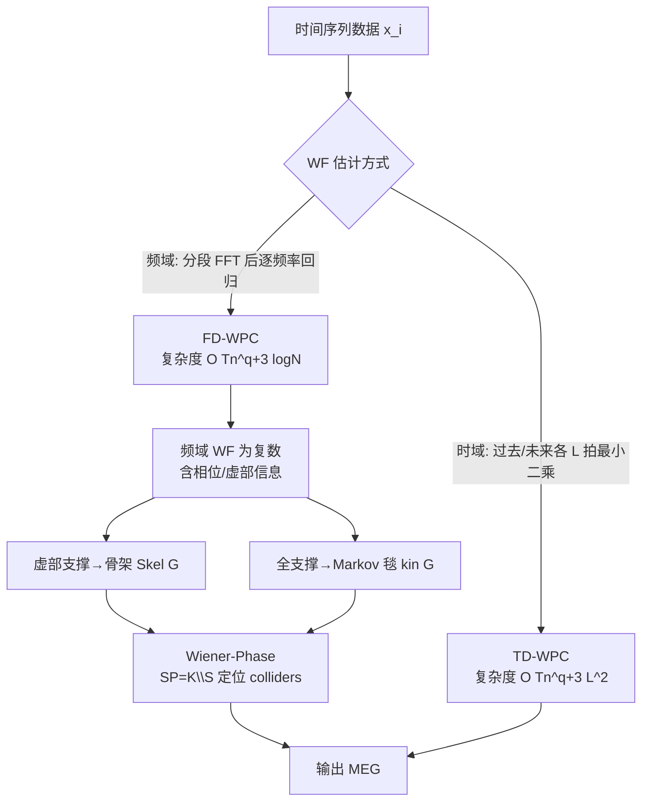

# Frequency-Domain Better than Time-Domain for Causal Structure Recovery in Dynamical Systems on Networks

**会议**: ICLR 2026  
**OpenReview**: [https://openreview.net/forum?id=S1OCRfHJAg](https://openreview.net/forum?id=S1OCRfHJAg)  
**代码**: 待确认  
**领域**: 因果推断 / 动态系统 / 时间序列  
**关键词**: 因果结构恢复, Wiener 滤波, 频域, Markov 等价图, 相位信息, FFT  

## 一句话总结
针对网络化动态系统的因果图恢复，本文从理论上证明频域 Wiener 滤波比时域更快（FFT 带来 $O(L^2/\log N)$ 加速），并发现频域复数估计独有的**相位信息**可在一大类网络上直接读出骨架与共同子节点（colliders），由此提出无需组合式 CI 测试的 "Wiener-Phase" 算法。

## 研究背景与动机
**领域现状**：静态因果发现已相当成熟——PC/FCI 等算法靠 Fischer-z、卡方检验做条件独立（CI）判定，从数据中恢复出 Markov 等价图（MEG）。但当实体之间存在**跨时间的动态依赖**（如电网、共识动力学、化学反应、气候），把每个时刻当作随机变量会导致变量组合爆炸，而 Granger 因果又依赖"延迟可观测"的假设，在采样率低于系统时间常数时失效。

**现有痛点**：把动态时间序列与因果发现连接的一条主线是用 Wiener 滤波（WF）做多元投影——若把 $x_i$ 投影到一组时间序列 $x_C$ 上，对应 WF 系数是否为零正好编码了 d-分离关系，从而可做动态版的 CI 测试。但传统 WF 投影都在**时域**做：要纳入过去/未来各 $L$ 个样本，最小二乘维度随 $L$ 平方膨胀，在大网络或长延迟下计算极其笨重。

**核心矛盾**：WF 投影既可在时域算，也可在频域算。**到底哪个更好？** 这是一个此前没有被系统量化回答的问题——既缺乏两种方法的样本复杂度对比，也没人注意到频域天然产出复数、含有时域根本不存在的"相位"这一额外信息。

**本文目标**：给出时域 vs 频域 WF 估计的非渐近浓度界与样本复杂度对比，证明频域在计算上的优势，并把频域复数估计的相位结构变成一种新的图恢复工具。

**核心 idea**：**【频域加速 + 相位即结构】** —— ① 用 FFT 在频域做 WF 投影，把每个频率的回归样本数从 $T$ 压到 $T/N$，整体获得 $O(L^2/\log N)$ 的复杂度改进；② 利用频域 WF 虚部的支撑集（时域没有对应物）直接恢复骨架，再结合 WF 全支撑集恢复 Markov 毯，从而高效定位 colliders，绕开组合式逐对 CI 测试。

## 方法详解

### 整体框架
系统建模为**线性动态影响模型（LDIM）**：$X(\omega) = H(\omega)X(\omega) + E(\omega)$，转移函数 $H(\omega)$ 的非零项 $H_{vu}\neq 0$ 对应有向边 $u\to v$，噪声 PSD 矩阵对角且正定。在此模型下，把节点 $i$ 投影到节点集合 $C$ 上的多元 Wiener 滤波 $W_{i\cdot C}(\omega)=\Phi_{x_i x_C}(\omega)\Phi^{-1}_{x_C x_C}(\omega)$ 的系数是否为零，可作为 d-分离/CI 的判据。本文沿两条路径恢复 MEG：一条是把 WF 嵌进改造版 PC（Wiener-PC，含时域与频域两种 WF 估计），另一条是绕过组合 CI、纯靠频域相位的 Wiener-Phase。

### 关键设计
**1. 频域 FFT 投影替代时域最小二乘：把计算瓶颈从 $L^2$ 降到 $\log N$。** 时域做法要为每个节点构造维度 $(T-2L+1)\times(2L+1)m$ 的回归矩阵（式 4-5），把 $x_i(t)$ 投影到 $x_j$ 的当前、过去 $L$、未来 $L$ 拍上，单节点最小二乘复杂度约 $O(Tm^2L^2)$。频域做法（式 6）则先把每条序列切成 $R=T/N$ 段、每段做长度 $N$ 的 FFT，再在**每个频率点** $\omega_k$ 上做一个小回归 $W^{(f)}_{i\cdot C}(\omega_k)=\arg\min_\beta \frac{N}{T}\lVert X_i(\omega_k)-X_C(\omega_k)\beta\rVert_2^2$。因为每个频率的有效样本数只有 $T/N$，单频率复杂度降为 $O(Tm^2/N)$，全频率合计 $O(Tm^2\log N)$。两者相比，频域在最坏情况下获得 $O(L^2/\log N)$ 的加速——样本越多、延迟越长，优势越大。

**2. 用 d-分离的 WF 判据改造 PC：动态版 Wiener-PC。** 静态 CI 测试（Fischer-z、卡方）在时间序列上因时间相关性而失效（论文 Table 1 中 Fisher-Z PC 的 F1 仅 24.44）。本文据 Lemma 3.1——"若 $i,j$ 在给定 $Z$ 下 d-分离，则 $W_{i\cdot[j,Z]}[j](\omega)=0$，反之几乎处处成立"——把 PC 算法里的 CI 检验整体替换为"WF 系数是否小于阈值 $\tau$"。算法对每对 $(i,j)$ 遍历 d-分离集 $z$，一旦 $|W^{(f)}_{i\cdot[j,z]}[j](\omega_k)|<\tau$ 就删边并记录分离集，再据此识别 collider 与定向。WF 既可用式 4（时域）也可用式 6（频域）算，于是同一框架自然分裂出 TD-WPC 与 FD-WPC 两个变体，便于公平对比两种域。

**3. 相位即结构——Wiener-Phase 绕开组合式 CI。** 这是全文最有想象力的一步：频域 WF 是复数，含有时域没有任何对应物的相位/虚部。在两条温和假设下（**假设 1**：同一节点所有入边相位相同 $\angle H_{ki}=\angle H_{kj}$，电网/共识/化学反应等一大类系统满足；**假设 2**：$H_{ij}\neq 0\Rightarrow \Im\{H_{ij}\}\neq 0$，保证骨架可一致恢复），Lemma 4.2 表明只看虚部支撑就能精确恢复骨架——$\Im\{W_{i\cdot \bar i}[j](\omega)\}\neq 0$ 当且仅当 $(i,j)$ 或 $(j,i)$ 是真实边。与此同时，Lemma 4.1 用 WF 的全支撑（实+虚）恢复"亲属集" $\mathrm{kin}_G$（即 Markov 毯）。Wiener-Phase 把两者相减得到**严格配偶集** $SP=K\setminus S$（共享子节点但无直接连边的点对），再对每个配偶对在共同邻居里检验 $W^{(f)}_{i\cdot[j,c]}[j]\neq 0$ 来定位 collider $c$。由于不再逐对穷举 d-分离集，整体复杂度降到 $O(n^3(T\log N+q^2))$，在高连通（大 $q$）网络上远优于组合式 W-PC。

**4. 非渐近浓度界给出两域样本复杂度的可比性。** 为说明频域不是用精度换速度，本文对两种估计都给出非渐近浓度界（Theorem 5.1 时域、Theorem 5.2 频域）。在自相关指数衰减 $\lVert R_x(k)\rVert\le C\rho^{-|k|}$、PSD 特征值有界的条件下，时域达到误差 $\epsilon$ 需 $T=O(Ln)$ 样本，频域需 $T=O(Nn)$ 样本——当 $N\approx L$ 时两者样本复杂度相当。也就是说频域在**不损失统计效率**的前提下白赚了 FFT 的计算加速，且仿真还显示频域在小样本区间的重构误差反而更低。

## 实验关键数据

### 主实验表格（20 节点合成网络 + river-runoff 真实数据）

| 算法 | F1 (合成) | CS (合成) | 运行时(s, 合成) | F1 (river) | 运行时(s, river) |
|---|---|---|---|---|---|
| Fisher-Z PC | 24.44 | 21.73 | 0.625 | 52.63 | 0.526 |
| CD-NOD | 23.80 | 19.93 | 0.421 | 54.05 | 0.179 |
| GC (Granger) | 48.65 | 50.9 | 0.939 | 33 | 0.22 |
| TPC | 78.57 | 70.12 | 4016.57 | 43.64 | 1548.29 |
| **FFT-WPC** | **100** | **100** | 1011.62 | **75** | 9.041 |
| **Wiener-Phase** | 93.55 | 92.97 | **1.37** | 48.3 | **0.026** |

合成数据用 6 节点起步的 VAR 模型（式 7）生成；FFT-WPC 在 20 节点上做到满分 F1，Wiener-Phase 以 1.37s（比 TPC 的 4016s 快约 3000×）拿到 93.55 F1。

### 消融/对比实验

| 设置 | 观察 |
|---|---|
| 25 个随机 DAG：FD-WPC vs TD-WPC | FD 在相同精度下所需样本数显著更少；高样本区计算时间相差约一个数量级 |
| 50 节点扩展性 | FFT-WPC：CS=97.5%，但耗时 ≈40 小时；Wiener-Phase：CS=99.83%，仅 **19.49 秒** |
| 真实 river-runoff（4600 样本，上多瑙河流域） | FFT-WPC F1=75，明显优于 TPC(43.64)/GC(33) |

### 关键发现
- 频域并非"以精度换速度"：FD-WPC 精度不低于 TD，甚至在小样本下更准，同时快约一个数量级。
- 相位信息让 Wiener-Phase 在大网络上展现极端的可扩展性——50 节点从 40 小时（组合式 W-PC）压缩到 20 秒，验证了"绕开逐对 CI"的价值。
- 静态 CI 测试（Fisher-Z/CD-NOD）在动态数据上几乎失效（F1≈24），佐证了动态因果发现需要 WF 这类专门工具。

## 亮点与洞察
- **把"频域复数"从计算工具升格为信息来源**：相位是时域根本不存在的维度，作者敏锐地把它转化为可直接读出骨架的判据，这是方法层面真正的新意。
- **理论 + 算法 + 实证三线闭环**：既有浓度界证明样本复杂度可比，又有 FFT 复杂度分析量化加速，还在合成、扩展性、真实数据三档验证，论证完整。
- **针对一大类真实系统**：假设 1（入边同相位）看似苛刻，但电网、共识动力学、化学反应等线性动态网络恰好满足，落点明确。

## 局限与展望
- **依赖 LDIM 与线性时不变假设**：方法建立在线性动态影响模型上，非线性动态系统不在覆盖范围内。
- **Wiener-Phase 的两条假设有边界**：假设 1（同节点入边相位一致）虽覆盖若干物理系统，但一旦不满足，相位即结构的保证就失效，需回退到组合式 W-PC。
- **FFT-WPC 在大网络仍受组合复杂度拖累**：50 节点 FFT-WPC 仍要 40 小时，真正的可扩展性来自 Wiener-Phase；如何把相位方法推广到不满足假设 1 的网络是开放问题。
- **真实数据规模有限**：仅 river-runoff 与晶体管电路两类，更广泛领域（神经科学、气候大网络）上的稳健性有待检验。

## 相关工作与启发
- **WF 与因果结构**：Materassi & Salapaka 系列工作奠定了 WF 投影恢复 moral graph / 做 CI 测试的基础（Lemma 3.1/4.1/4.2 均源自此），本文把它们系统化为可实现的 FD 算法。
- **频域不对称性**：Besserve et al.、Shajarisales et al. 用功率谱不对称推断成对因果方向，但只处理两变量；本文处理含中间变量的完整图结构恢复，定位不同。
- **动态因果发现 baselines**：Granger 因果、TPC（Time-Aware PC）、CD-NOD 是主要对比对象，本文在精度与速度上同时超越。
- **启发**：当一个估计量天然落在复数域时，不要只用其模长——相位/虚部可能编码了实数域观测不到的结构信息，这一思路或可迁移到频域信号的其他图学习任务。

## 评分
- **新颖性**: ⭐⭐⭐⭐ —— "频域相位即因果骨架"是真正原创的观察，把复数估计的相位变成图恢复工具，时域没有对应物。
- **实验充分度**: ⭐⭐⭐⭐ —— 合成/扩展性/真实数据三档 + 多 SOTA 对比，但真实数据集种类偏少。
- **写作质量**: ⭐⭐⭐⭐ —— 理论-算法-实证三线清晰，公式与复杂度推导扎实；符号偏密集，对非控制论背景读者门槛略高。
- **价值**: ⭐⭐⭐⭐ —— 给动态系统因果发现提供了精度与速度兼得的实用算法，对电网/化学反应等线性动态网络落地价值明确。

<!-- RELATED:START -->

## 相关论文

- [\[AAAI 2026\] CaDyT: Causal Structure Learning for Dynamical Systems with Theoretical Score Analysis](../../AAAI2026/causal_inference/causal_structure_learning_for_dynamical_systems_with_theoretical_score_analysis.md)
- [\[NeurIPS 2025\] Domain-Adapted Granger Causality for Real-Time Cross-Slice Attack Attribution in 6G Networks](../../NeurIPS2025/causal_inference/domain-adapted_granger_causality_for_real-time_cross-slice_attack_attribution_in.md)
- [\[ICLR 2026\] Stochastic Neural Networks for Causal Inference with Missing Confounders](stochastic_neural_networks_for_causal_inference_with_missing_confounders.md)
- [\[ICLR 2026\] Causal Score Conditioning for Multi-Resolution Latent Systems](causal_score_conditioning_for_multi-resolution_latent_systems.md)
- [\[CVPR 2026\] CGU-Bayes: Causal Graph Uncertainty-Guided Bayesian Inference for Domain Generalization](../../CVPR2026/causal_inference/cgu-bayes_causal_graph_uncertainty-guided_bayesian_inference_for_domain_generali.md)

<!-- RELATED:END -->
