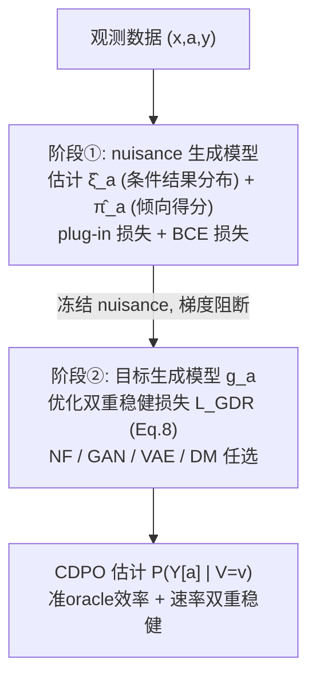

# GDR-learners: Orthogonal Learning of Generative Models for Potential Outcomes

**会议**: ICLR 2026  
**OpenReview**: [https://openreview.net/forum?id=bbmcIaEmJG](https://openreview.net/forum?id=bbmcIaEmJG)  
**代码**: [https://github.com/Valentyn1997/gdr-learners](https://github.com/Valentyn1997/gdr-learners)  
**领域**: 因果推断 / 生成模型 / 潜在结果分布  
**关键词**: 潜在结果分布(CDPO), Neyman-正交, 双重稳健, 准oracle效率, 条件生成模型  

## 一句话总结
提出一套通用的 **Neyman-正交（双重稳健）生成式学习器 GDR-learners**，能把任意 SOTA 条件生成模型（归一化流 / GAN / VAE / 扩散）套进一个两阶段、对 nuisance 估计误差一阶不敏感的目标损失，从而以"准 oracle 效率 + 速率双重稳健"的姿态估计潜在结果的**整条条件分布**（而非仅期望）。

## 研究背景与动机
- **领域现状**：因果机器学习要预测干预后的潜在结果（potential outcome, PO）。近年研究从估计 PO 的条件均值（CAPO）转向估计整条**潜在结果条件分布（CDPO）** $P(Y[a]\mid V=v)$，因为分布能刻画 PO 的内禀随机性（aleatoric 不确定性、重尾、多峰），这对医疗等高风险决策至关重要。各种生成模型（CEVAE、GANITE、NOFLITE、DiffPO、PO-Flow 等）已被改造来建模 CDPO。
- **现有痛点**：这些方法几乎都不关心**整体学习过程的最优性**。据作者所知，没有一个方法满足一般意义的 **Neyman-正交性**——而正交性能带来准 oracle 效率（即便 nuisance 收敛很慢，也像知道真值 nuisance 一样学目标模型）和速率双重稳健（一个 nuisance 收敛慢可由另一个收敛快补偿）。现有学习器要么是 plug-in（只在 $A=a$ 子人群上投影），要么是 RA / IPTW（nuisance 误差以同阶传播到目标风险）。
- **核心矛盾**：DiffPO（Ma et al. 2024）虽提出"正交"IPTW 学习器，但只在"目标模型类恰好包含真值 CDPO"这一**苛刻条件**下成立（作者称之为"部分正交"）；一旦因公平/可解释性约束而限制模型类，正交性就失效。
- **本文目标**：构造一个**与生成模型种类无关**、对任意（甚至受限）目标模型类都保持一般 Neyman-正交的 CDPO 学习器。
- **核心 idea**：**【一阶偏差校正】** 从 RA-learner 出发，用目标风险的高效影响函数做**一步偏差校正（one-step bias correction）**，得到一个同时用上倾向得分与条件结果密度两个 nuisance 的双重稳健目标损失，使风险对 nuisance 误差一阶不敏感。

## 方法详解

### 整体框架
GDR-learner 是一个**两阶段、与模型无关**的元学习器。设观测数据 $\{(x_i,a_i,y_i)\}$，估计目标是 CDPO $P(Y[a]\mid V=v)$。在标准因果识别假设（一致性、强重叠、无混杂）下，$P(Y[a]=y\mid V=v)=\mathbb{E}[\xi_a(y\mid X)\mid V=v]$，其中 $\xi_a(y\mid x)=P(Y=y\mid X=x,A=a)$ 为条件结果密度。两个阶段为：**①第一阶段**估计 nuisance 函数 $\eta=(\hat\xi_a,\hat\pi_a)$（条件结果分布 + 倾向得分 $\pi_a(x)=P(A=a\mid x)$）；**②第二阶段**冻结 nuisance，用双重稳健损失 $\hat{\mathcal{L}}_{\text{GDR}}$ 拟合任选的目标生成模型 $g_a$。

### 关键设计

**1. 通用目标生成风险：把四类生成模型统一进一个损失。** 学习 CDPO 被表述为在预定义模型类 $G=\{g_a(y,z\mid v)\}$ 上找真值 CDPO 的**最佳投影**（按某种分布距离）。统一的目标风险写作 $\mathcal{L}(g_a)=\mathbb{E}\big[\mathbb{E}_{Z\sim\varepsilon_z}\log g_a(Y[a],Z\mid V)\big]$，其中 $Z$ 是辅助隐变量、$\varepsilon_z$ 是其采样分布。通过变换 $(g_a,Z,\varepsilon_z)$ 三件套，这一个式子就能实例化为条件归一化流（CNF，对应 KL 散度）、条件 GAN（CGAN，对应 JS 散度）、条件 VAE（CVAE，KL+推断间隙）、条件扩散（CDM，KL+推断间隙）。这种统一性正是 GDR "可插任意 SOTA 生成模型"的根基。

**2. 一步偏差校正得到双重稳健损失。** 朴素地学有三条路：plug-in 损失 $\hat{\mathcal{L}}_{\text{PI}}$、回归调整 RA 损失（只依赖 $\hat\xi_a$）、IPTW 损失（只依赖 $\hat\pi_a$），但它们的 nuisance 误差都以一阶传播。GDR 对 RA-learner 做一步偏差校正，得到核心损失

$$\hat{\mathcal{L}}_{\text{GDR}}(g_a,\hat\eta)=\mathbb{P}_n\Big\{\tfrac{\mathbb{1}\{A=a\}}{\hat\pi_a(X)}\,\mathbb{E}_{Z}\log g_a(Y,Z\mid V)+\big(1-\tfrac{\mathbb{1}\{A=a\}}{\hat\pi_a(X)}\big)\!\int_Y\!\big[\mathbb{E}_Z\log g_a(y,Z\mid V)\big]\hat\xi_a(y\mid X)\,dy\Big\}$$

第一项是 IPTW 风格的加权项，第二项用 $\hat\xi_a$ 对反事实积分做修正，二者结合后**同时利用两个 nuisance**，把估计写成"主项 + 偏差校正项"。

**3. Neyman-正交性与由此而来的最优性保证。** 定理 1 证明 $\hat{\mathcal{L}}_{\text{GDR}}$ 的风险满足 $D_\eta D_g \mathcal{L}_{\text{GDR}}(g_a^*,\eta)[g_a-g_a^*,\hat\eta-\eta]=0$，即风险梯度对 nuisance 误判**一阶不敏感**。定理 2 进一步给出 $\|g_a^*-\hat g_a\|_G^2\lesssim(\text{优化误差})+\|\xi_a-\hat\xi_a\|_{L_4}^2\cdot\|\pi_a-\hat\pi_a\|_{L_4}^2$：nuisance 误差只以**乘积/高阶**形式出现，于是得到 **(a) 准 oracle 效率**（两个 nuisance 各自只需 $o_P(n^{-1/4})$ 速率，整体就像知道真值 nuisance）与 **(b) 速率双重稳健**（一慢一快可互补）。关键是这套保证对**受限模型类 $G$ 也成立**，而 IPTW 的"部分正交"在受限时失效——这是 GDR 相对 DiffPO 的本质优势。

**4. 实例化与训练稳定化技巧。** nuisance 与目标模型都用同四类生成模型实现，靠 hypernetwork 或 FiLM 做条件化。训练分两步：阶段①优化 plug-in + BCE 学 nuisance；阶段②冻结 nuisance（梯度阻断）后用 $\hat{\mathcal{L}}_{\text{GDR}}$ 训目标模型。式(8)第二项对 $\hat\xi_a$ 的积分用 $n_{\text{MC}}=1$ 的 MC 采样近似（故 $\hat\xi_a$ 只需提供采样机制、无需显式密度，GAN/VAE/DM 都适用）；并用权重 EMA（$\lambda=0.995$）+ 噪声正则稳定二阶段，同时启发式地保证 $G\subseteq\Xi$。

## 实验关键数据

### 主实验：合成数据（变化训练规模）
在 noisy-moons 合成数据（$d_y=2,d_x=2$）上比较 plug-in / IPTW / RA / GDR × 四类生成模型，指标为样本外 W2 距离（越低越好，20 次均值）。

| 现象 | 结果 |
|------|------|
| 数据量增大 | GDR-learners 取得最佳性能（符合渐近最优性预期） |
| $n_{\text{train}}\in\{2000,4000\}$ | **GDR-CDMs（扩散）整体最优** |
| 小样本 | 渐近优势尚未显现，差距较小 |

### ACIC 2016（77 个半合成数据集，log-prob 指标）
报告 GDR 相对其它学习器在 >50% 运行中胜出的比例：

| 对比基线 | (a) full 设定 a=0/a=1 | (b) linear 受限设定 a=0/a=1 |
|----------|------------------------|------------------------------|
| vs Plug-in | 45.97% / 44.42% | **51.43% / 54.81%** |
| vs IPTW | 47.27% / 50.65% | **61.82% / 60.26%** |
| vs RA | 8.05% / 10.13% | 22.34% / 25.45% |

- **full 设定**（$V=X$、模型类未受限）：GDR 与 IPTW 近似等价（理论预测二者此时都正交）。
- **linear 受限设定**（目标模型限为单线性层）：只有 GDR 仍正交，**多数运行上超过 plug-in 与 IPTW**，验证了"受限模型类下仍保正交"的核心卖点。

### HC-MNIST 高维混杂（$d_x=785,n=70000$）

| Learner | CNFs a=1 | CDMs a=1 |
|---------|----------|----------|
| Plug-in | 0.653 | 0.601 |
| IPTW | 0.635 | 0.595 |
| RA | 0.593 | 0.574 |
| **GDR** | **0.572** | **0.572** |

GDR 在多数生成模型与处理臂上一致最优，证明在高维混杂下依然有效。Colored-MNIST（高维结果）上定性采样也最接近 ground-truth。

### 关键发现
- GDR 的优势随样本量增长而显现（渐近最优属性）。
- GDR 相对 RA 在 log-prob 指标上未必占优——因为准 oracle 效率只对 $L_2$ 范数保证，而 log-prob 易被异常值放大；这是诚实的局限说明。
- 扩散版 GDR-CDMs 综合表现最佳。

## 亮点与洞察
- **"模型无关 + 一般正交"的统一框架**：第一个把 Neyman-正交从条件均值推广到**整条条件分布**、且对任意（含受限）生成模型类都成立的学习器，填补了 DiffPO "部分正交"的空白。
- **一个目标风险吃下四类生成模型**：CNF/GAN/VAE/DM 被同一损失统一，工程上只需换插件即可享受双重稳健，扩展性极强。
- **理论与可用性兼顾**：用 $n_{\text{MC}}=1$ 的 MC 近似让 nuisance 只需采样能力即可，使 GAN/VAE/扩散这类隐式模型也能当 nuisance 用。
- **诚实的边界划分**：用 Fig.2 三场景清楚说明何时该用 IPTW、何时该用 GDR，不夸大。

## 局限与展望
- **受限模型类才显优势**：在 $V=X$ 且模型类未受限时，GDR 退化为与 IPTW 等价；优势主要体现在公平/可解释约束导致模型类受限的场景。
- **log-prob 下不及 RA**：准 oracle 效率仅对 $L_2$ 保证，对 log-prob 这类对支撑集敏感的指标无保证。
- **收敛速率依赖**：定理 2 需要 nuisance 达到 $o_P(n^{-1/4})$；而 CDPO 的条件密度估计比条件均值更难（速率 $O_P(n^{-s/(2s+d_x+d_y)})$），高维下能否达标仍是开放问题（依赖低维流形假设与生成模型的收敛理论）。
- **实验为(半)合成**：尚缺真实医疗等场景的端到端验证。

## 相关工作与启发
- **CAPO 元学习器**：DR-learner（Kennedy 2023）、R-learner（Nie & Wager 2021）等针对条件均值的正交学习器；本文把这套"双重稳健 + 准 oracle"思想抬升到分布层面。
- **CDPO 生成方法**：CEVAE/TEDVAE（VAE 建模整条因果 DGP）、GANITE（GAN+RA）、NOFLITE（流 plug-in）、DiffPO（扩散 IPTW，部分正交）、PO-Flow——这些都是本文的实例化对照（如 RA-CGAN≈GANITE、IPTW-CDM≈DiffPO）。
- **启发**：把"高效影响函数 + 一步偏差校正"作为通用配方，可以系统化地给任何"投影到模型类"的生成式估计加上双重稳健性，这一思路有望迁移到分布式策略评估、反事实图像生成等更广问题。

## 评分
- **新颖性**: ⭐⭐⭐⭐⭐ 首次把一般 Neyman-正交从条件均值推广到整条潜在结果分布，且与生成模型类型解耦，理论贡献扎实且填补明确空白。
- **实验充分度**: ⭐⭐⭐⭐ 覆盖合成、ACIC 2016（77 个）、HC-MNIST、Colored-MNIST 四类基准与 16 个模型组合，但均为(半)合成、缺真实落地验证。
- **写作质量**: ⭐⭐⭐⭐ 定理-直觉-场景图层层递进，诚实标注 log-prob 下不及 RA 等边界；符号密度偏高，对非因果背景读者门槛较大。
- **价值**: ⭐⭐⭐⭐ 为分布式因果估计提供了即插即用的双重稳健配方，对医疗等需要不确定性量化的决策场景有实用潜力。

<!-- RELATED:START -->

## 相关论文

- [\[ICLR 2026\] An Orthogonal Learner for Individualized Outcomes in Markov Decision Processes](an_orthogonal_learner_for_individualized_outcomes_in_markov_decision_processes.md)
- [\[ICLR 2026\] Debiased Front-Door Learners for Heterogeneous Effects](debiased_front-door_learners_for_heterogeneous_effects.md)
- [\[ICLR 2026\] IGC-Net for Conditional Average Potential Outcome Estimation Over Time](igc-net_for_conditional_average_potential_outcome_estimation_over_time.md)
- [\[ICLR 2026\] Overlap-Weighted Orthogonal Meta-Learner for Treatment Effect Estimation over Time](overlap-weighted_orthogonal_meta-learner_for_treatment_effect_estimation_over_ti.md)
- [\[ICML 2026\] Rank-Learner: Orthogonal Ranking of Treatment Effects](../../ICML2026/causal_inference/rank-learner_orthogonal_ranking_of_treatment_effects.md)

<!-- RELATED:END -->
