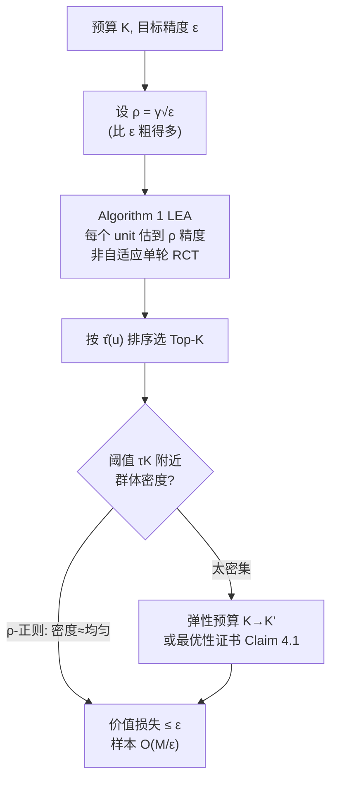

# Good Allocations from Bad Estimates

**会议**: ICLR 2026  
**OpenReview**: [https://openreview.net/forum?id=rxZdaKhu2I](https://openreview.net/forum?id=rxZdaKhu2I)  
**代码**: 待确认  
**领域**: 因果推断 / 处理效应估计 / 样本复杂度理论  
**关键词**: CATE 估计, 处理分配, 样本复杂度, 福利最大化, ρ-正则性  

## 一句话总结
本文证明了一个反直觉的结论：**给少数群体分配有限干预名额（treatment allocation）所需的样本量，比精确估计每个群体的处理效应（CATE）少一个 1/ϵ 的因子**——只需 $O(M/\epsilon)$ 而非 $O(M/\epsilon^2)$ 个样本，因为「粗糙的估计足以做出近最优的分配决策」。

## 研究背景与动机
**领域现状**：当一项福利干预（发钱、发药、教育资源）名额有限时，标准做法是先用随机对照试验（RCT）估计每个群体（学校、县、年龄段）的条件平均处理效应 CATE $\tau(u)$，然后按估计值从高到低排序，把名额发给收益最大的 $K$ 个群体。

**现有痛点**：估计单个群体的处理效应到误差 $\epsilon$ 需要 $\Theta(1/\epsilon^2)$ 个样本（均值估计的经典下界，源于 Hoeffding/Le Cam）。于是估计 $M$ 个群体的全部 CATE（称为 **FullCATE** 问题）需要 $\Theta(M/\epsilon^2)$ 个样本。长期以来人们默认：既然分配要靠估计，那分配问题和估计问题的样本复杂度是等价的，都卡在这个二次下界上。

**核心矛盾**：分配的目标是「选对哪 $K$ 个群体」，而不是「精确知道每个群体效应是多少」。这两件事的难度真的一样吗？最坏情况下确实存在需要 $\Omega(M/\epsilon^2)$ 样本的实例，但**这个二次下界是脆弱的**——它只在所有群体效应都恰好挤在最优阈值附近时才出现，而真实数据几乎从不如此。

**本文目标**：把分配问题从估计问题中解耦出来，给出依赖于实例（处理效应分布形状）的样本复杂度上界，证明「典型分布下分配只需线性 $O(M/\epsilon)$ 样本」。

**核心 idea（粗估计即可）**：分配本质上是为每个群体判断 $\tau(u)$ 在最优阈值 $\tau_K$ 之上还是之下。离阈值远的群体用很粗的估计就能判对；离阈值近的群体即使判错，因为它们效应本来就接近，**分配总价值损失也很小**。这是一个「双赢（win-win）」结构，唯一的坏情况是大量群体既不远也不近地聚在阈值附近。

## 方法详解

### 整体框架
论文不提新的估计器，而是改变「估计精度」这个旋钮：不再把每个 $\tau(u)$ 估到精度 $\epsilon$，而是只估到精度 $\rho=\Theta(\sqrt{\epsilon})$，然后直接按这些粗估计值排序选 Top-$K$。整条逻辑链是：**分配 → 阈值判别问题 → 粗估计（精度 $\sqrt\epsilon$）足够 → 在「平滑」分布上阈值附近群体不多 → 总价值损失被压到 $\epsilon$ 以内 → 样本量降为 $O(M/\epsilon)$**。当平滑性偶尔不满足时，再用「可验证的最优性证书」和「弹性预算」两招兜底。

### 关键设计

**1. 把分配归约成阈值判别：精度不必均匀分配。** 最优分配集合可以写成 $U^*=\{u\mid\tau(u)\ge\tau_K\}$，其中 $\tau_K$ 是被选中群体里最小的真实效应（第 $K$ 大的 $\tau$ 值）。于是「选哪 $K$ 个」就等价于「对每个 $u$ 判断 $\tau(u)\ge\tau_K$ 还是 $<\tau_K$」。关键观察是：**判别所需的精度随着 $\tau(u)$ 离 $\tau_K$ 的距离而递减**——离阈值越远的群体，用越粗的估计就能确定它在上还是在下；只有紧贴阈值的群体才真正需要高精度，而恰恰是这些群体「判错也不亏」，因为它们的真实效应彼此接近。这一步把「估计问题」的均匀精度需求，替换成了「按距离自适应的精度需求」。

**2. 低精度非自适应算法 LEA 与 $\rho=\Theta(\sqrt\epsilon)$ 的最优折中。** 算法引入精度旋钮 $\rho$：对每个 unit 只取一个 $(\rho,\delta/M)$-精确的估计 $\hat\tau(u)$（用 $\rho=\gamma\sqrt\epsilon$），然后选 $\hat\tau$ 最大的 $K$ 个。由于精度只到 $\rho$，每个 unit 的样本量由 Hoeffding 给出为 $O(\ln(M/\delta)/\rho^2)=O(\ln(M/\delta)/\epsilon)$，总量 $O(M\ln(M/\delta)/\epsilon)$——比 FullCATE 少一个 $1/\epsilon$ 因子。算法刻意设计为**非自适应、单轮**，因为现实中的 RCT 往往只能做一轮，多阶段自适应虽能进一步降样本但不实用。$\rho$ 取 $\sqrt\epsilon$ 不是随意的：它是「精度尽量低」与「分配价值损失尽量小」之间的最优平衡点——价值损失正比于 $\rho$，而阈值附近群体数也正比于 $\rho$，两者相乘恰好给出 $\rho^2=\epsilon$ 量级的损失。LEA 保证（Lemma 5）：$|\hat\tau_K-\tau_K|\le\rho$，所有 $\tau(u)>\tau_K+2\rho$ 的群体必被选中，所有 $\tau(u)<\tau_K-2\rho$ 的群体必被排除——也就是说算法在 $[0,\tau_K-2\rho]$ 和 $(\tau_K+2\rho,1]$ 两个区间里选得完全正确，唯一需要担心的只是阈值附近宽 $2\rho$ 的「死区」$D=[\tau_K,\tau_K+2\rho]$。

**3. ρ-正则性：把价值损失收紧到 ϵ 的平滑条件。** 死区 $D$ 里的群体可能被乱选，造成的价值损失上界为 $\frac{4\rho K_0}{V(A_1)+(\tau_K+2\rho)K_0}$，其中 $K_0$ 是死区内被选群体数。要让这个损失 $\le\epsilon$，关键是死区内的概率质量 $\theta_K=\Pr_\tau[\tau_K,\tau_K+2\rho]$ 不能太大。本文定义 **ρ-正则性**：分布 $Z$ 是 ρ-正则的，当任意长度 $\ge2\rho$ 的区间 $S$ 满足 $\Pr_Z[S]\le c\cdot U[S]$（$c=\Theta(1)$，$U$ 为均匀分布）。直观就是「不在任何小区间堆积过多质量」，是一个排列不变、只依赖 CDF 形状的弱平滑要求——比要求与均匀分布的 TV 距离小宽松得多。在该条件下 $\theta_K\approx2\rho c$，代入损失表达式分子出现 $\rho^2$ 项，于是损失 $=(\sqrt\gamma\rho)^2=\epsilon$，得到主定理：**ρ-正则分布上 $O(M/\epsilon)$ 样本即可拿到 $(1-\epsilon)$-最优分配**（Theorem 7）。高斯、Beta、均匀分布都满足，且常数 $\gamma$ 仅在 $0.07\sim0.2$ 之间。更重要的是，作者证明即便在最正则的均匀分布上，FullCATE 仍需 $\Omega(M/\epsilon^2)$（Theorem 6），从而**严格分离了分配与估计的样本复杂度**。

**4. 分位数即可 + 可验证证书 + 弹性预算的兜底。** 分配只依赖分布的 CDF/分位数：$\tau_K=F^{-1}(1-K/M)$，而粗估计 $\hat\tau$ 天然给出 CDF 的近似 $\hat F$，并满足夹挤 $\hat F(t-\rho)\le F(t)\le\hat F(t+\rho)$。这带来两个实用工具：其一，本文给出当且仅当成立的实例最优性条件（Claim 4.1）$\int_{\tau_K}^{\tau_K+2\rho}tf\,dt-\int_{\tau_K-2\rho}^{\tau_K-\alpha_K}tf\,dt\le\epsilon\int_{\tau_K}^{1}tf\,dt$，决策者可仅用少量样本**自我验证**当前分配是否近最优——若不达标就追加采样，避免盲目花钱。其二，当原预算 $K$ 对应的阈值恰好落在群体密集区时，**弹性预算**把 $K$ 微调到邻近的 $K'$，使新阈值 $\tau_{K'}$ 落入低密度区间，从而仍用 $O(M/\epsilon)$ 样本拿到近最优解；实验中极少数失败实例都能用这招救回来。

## 实验关键数据

### 主实验
在 5 个真实世界 RCT 数据集上，把「用全量数据估计的处理效应」当作 ground truth，再子采样到不同样本量，比较 ALLOC（本文算法）与 FullCATE 达到的归一化分配价值（预算 = 30%）。

| 数据集 | 分组依据 | 预算 K | 结论 |
|--------|----------|--------|------|
| STAR | 学校 | K=23 | 远少于 $O(M/\epsilon^2)$ 样本即近最优 |
| TUP | 基线贫困 | K=15 | 同上 |
| NSW | 基线收入 | K=9 | 同上 |
| Acupuncture | 年龄 | K=7 | 同上 |
| Post-op | BMI | K=5 | 同上 |

核心结果（Figure 1）：**所有数据集上，ALLOC 用的样本量不仅远低于最坏情况 $O(M/\epsilon^2)$（红线），甚至低于本文理论上界 $O(M/\epsilon)$（绿线）**，蓝色实测曲线很快逼近最优价值 1.0。说明真实处理效应分布普遍满足（甚至优于）ρ-正则假设。

### 消融与鲁棒性

| 变化维度 | 设置 | 观察 |
|----------|------|------|
| 群体划分方式 | 多种 partition | 结论稳健，近最优分配普遍成立 |
| 预算大小 | 不同 K 值 | 各预算下均能少样本达近最优 |
| 弹性预算 | 失败实例上微调 K→K' | 极少数未达标实例可被救回 |

### 关键发现
- **欠功效的 RCT 仍能给出优秀分配**：一个对 CATE 估计而言严重样本不足的 RCT，照样能产出近最优的资源分配——「估准每个值」与「分对每个群」是两回事。
- **经验法则**：$M/\epsilon$ 个样本即可得到 $(1-\epsilon)$-最优分配，标准的 CATE 样本量计算对于分配目的过于悲观。

## 亮点与洞察
- **概念层面的解耦**：明确区分「处理效应估计」与「处理分配」两个问题，并用样本复杂度给出了二次的严格分离——这是对资源分配中「预测是否必要」这一近年思潮（Perdomo、Shirali 等）的有力延伸。
- **下界脆弱性的洞察**：指出 $\Omega(M/\epsilon^2)$ 下界只在病态（所有单元挤在阈值附近）时成立，并用 ρ-正则性精确刻画了「典型分布」的边界。
- **可操作性**：算法非自适应、单轮、可在标准 RCT 落地；附带的最优性证书让决策者能用少量样本自证解的质量，而非事后才知道花多了/花少了。

## 局限与展望
- **平滑性假设可能不成立**：ρ-正则在某些极端分布（大量单元紧贴阈值）下失效。本文用「可验证证书 + 弹性预算」缓解，但弹性预算意味着偏离原定预算 $K$，在政策上可能有约束。
- **隐藏了估计本身的难度**：通过假设一个估计 oracle，论文把因果识别、混杂、观测性设计等真实困难都抽象掉，专注样本复杂度这一维度——实际部署时这些被隐藏的挑战仍在。
- **同质成本与全有/全无假设**：假设每个 unit 治疗成本相同、且 unit 内要么全治要么全不治；异质成本、个体级（而非群体级）分配、连续预算等是自然的推广方向。
- **非自适应**：作者指出多阶段自适应 RCT 能进一步降样本，但因落地难未展开，留作权衡。

## 相关工作与启发
- **预测无须精确即可分配**：Perdomo et al. (2025)、Shirali et al. (2024) 是直接灵感来源，后者对比 unit-级与个体级 targeting；本文把「粗估计够用」推进到处理效应估计精度的定量刻画。
- **最优 targeting 规则与预算约束**：Manski (2004)、Kitagawa & Tetenov (2018)、Athey & Wager (2021)、Bhattacharya & Dupas (2012) 等大量因果推断文献关注异质性下的 targeting；本文聚焦的是上界样本复杂度而非具体估计策略。
- **Best-arm / subset 识别（bandits）**：CATE 估计下界经由 bandit 文献（Kaufmann et al. 2016 等）成立，但本文刻意不用自适应过程以保证落地可行。
- **启发**：「为决策服务的估计，其精度需求由决策的边际敏感性决定，而非估计本身的精度」——这一思路可迁移到排序、Top-K 检索、阈值告警等大量「只需判别相对位置」的任务上。

## 评分
- 新颖性: ⭐⭐⭐⭐⭐ 把「分配 ≠ 估计」从直觉提升为带二次样本分离的定理，ρ-正则性 + √ε 折中是漂亮且原创的分析。
- 实验充分度: ⭐⭐⭐⭐ 5 个真实 RCT + 多 partition / 多预算鲁棒性验证，充分支撑理论；但都是用全量当 ground truth 的子采样实验，缺真实小样本部署。
- 写作质量: ⭐⭐⭐⭐⭐ 动机—直觉—形式化层层递进，win-win 的故事讲得清晰，证书与弹性预算的工程兜底也交代到位。
- 价值: ⭐⭐⭐⭐⭐ 直接挑战「CATE 样本量计算」这一政策实践默认，「欠功效 RCT 也能做好分配」的结论有现实指导意义。

<!-- RELATED:START -->

## 相关论文

- [\[ICLR 2026\] LLMs Struggle to Balance Reasoning and World Knowledge in Causal Narrative Understanding](llms_struggle_to_balance_reasoning_and_world_knowledge_in_causal_narrative_under.md)
- [\[ICLR 2026\] Action-Guided Attention for Video Action Anticipation](action-guided_attention_for_video_action_anticipation.md)
- [\[ICLR 2026\] On Measuring Influence in Avoiding Undesired Future](on_measuring_influence_in_avoiding_undesired_future.md)
- [\[ICLR 2026\] Learning Robust Intervention Representations with Delta Embeddings](learning_robust_intervention_representations_with_delta_embeddings.md)
- [\[ICLR 2026\] Overlap-Weighted Orthogonal Meta-Learner for Treatment Effect Estimation over Time](overlap-weighted_orthogonal_meta-learner_for_treatment_effect_estimation_over_ti.md)

<!-- RELATED:END -->
