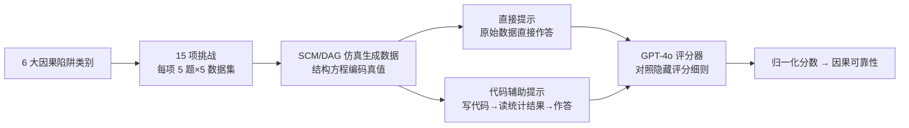

# Ice Cream Doesn't Cause Drowning: Benchmarking LLMs Against Statistical Pitfalls in Causal Inference

**会议**: ICLR 2026  
**OpenReview**: [https://openreview.net/forum?id=MGMG7yQ18v](https://openreview.net/forum?id=MGMG7yQ18v)  
**代码**: CausalPitfalls（论文标注公开，仓库待确认）  
**领域**: 因果推断 / LLM 评测  
**关键词**: 因果推断, LLM 评测基准, 统计陷阱, 辛普森悖论, 混杂偏差, 代码辅助推理  

## 一句话总结
提出 **CausalPitfalls** 基准，用 6 大类、15 项挑战、75 道题和 75 个由结构因果模型生成的数据集，系统检验 LLM 是否会掉进辛普森悖论、选择偏差等经典统计陷阱，并发现即便最强模型的"因果可靠性"也不足 45%。

## 研究背景与动机
**领域现状**：因果推断是医学、经济、公共政策等高风险决策的基石，而 LLM 在科学问题求解和临床推理上的亮眼表现，让人期待它们能自动完成统计因果分析。已有若干工作（Kiciman 2023、Jin 2023 等）评测了 LLM 的因果能力。

**现有痛点**：现有基准大多停留在"简化任务"——只让模型从变量名识别语义因果关系，或直接从原始数据下结论。这类评测忽略了真正区分专家与外行的东西：对**统计陷阱的鲁棒性**。模型可能给出看似可信、实则被数据直接否定的因果断言，却没人量化这种不可靠性。

**核心矛盾**：表层流畅的回答会制造"能力幻觉"。严谨的统计因果推断要求把结论锚定在证据上、检查假设、排除替代解释，但 LLM 可能依赖无关线索或统计假象给出自信却错误的输出。论文用两个失败案例点破矛盾：(1) **品牌偏差**——同一份数据，仅把饮料标签从"HealthPlus"换成"UltraSugar"，GPT-4o 和 Gemini 就把结论从有益翻成有害；(2) **虚假因果**——在荷兰科研经费真实数据上，所有被测模型都错误地把随机波动归因为性别歧视或辛普森悖论，而严格统计分析表明两者都不成立。

**本文目标**：构建一个能定量衡量 LLM"因果可靠性"的基准，覆盖真实世界中最常见、最容易误判的统计陷阱。

**核心 idea**：**用结构因果模型造题、用评分细则打分、用双协议对比**——把因果陷阱拆成可控的合成场景，每题配隐藏评分细则，再分别测"直接作答"与"写代码再作答"两种模式，从而把因果推理能力与可靠性同时量化出来。

## 方法详解

### 整体框架
CausalPitfalls 是一条"造题 → 测试 → 评分"的评测流水线。先按 6 大因果陷阱类别派生出 15 项挑战，每项挑战配 5 道由易到难的问题和 5 个用结构因果模型（DAG + 结构方程）仿真出的数据集（每集 >500 样本，含线性与非线性机制）；再让 LLM 在两种协议下作答——**直接提示**测原始因果直觉，**代码辅助提示**让模型先写可执行统计代码再据结果作答；最后用独立的 GPT-4o 评分器按隐藏评分细则打分，汇总成单一的"因果可靠性"指标。

### 关键设计

**1. 六大陷阱分层造题：把"专家直觉"翻译成可控难度梯度。** 基准把因果推断的失误归纳为六类——混杂偏差与虚假关联、干预与实验推理、反事实与假设推理、中介与间接效应、因果发现与结构学习、因果泛化与外部效度——再细化为辛普森悖论、Berkson 选择偏差、序贯中介等 15 项具体挑战。每项挑战的同一核心问题写成 5 个难度版本：最简单版直接点名"请调整混杂变量 {CONFOUNDER} 并判断是否存在辛普森悖论"，随难度递增逐步抽掉提示，到"很难"版只剩"评估 {TREATMENT} 是否因果影响 {OUTCOME}，无额外提示"。这种梯度让评测能区分"模型真懂"还是"靠提示词蒙对"。

**2. 结构因果模型造数据：让真值可控、可验证。** 数据不是随手采样，而是按 Pearl 的因果图和结构方程仿真生成。每条结构方程代表一个因果机制而非单纯的统计关联，方程系数直接编码因果效应，于是"真因果效应"成为可对照的 ground truth——这在数学上等价于在给定因果结构下仿真潜在结果（Neyman–Rubin 框架）。结构方程同时包含线性和非线性形式（非线性链接函数、交互项），确保评测不局限于线性关系。

**3. 双协议对比：分离"因果直觉"与"计算落地"。** 直接提示考查模型不借助工具、纯从原始数据下因果结论的内在能力；代码辅助提示则让模型先生成可执行代码做统计分析，再据数值结果作答。后者把"低层数据解析"与"高层因果推理"解耦——模型先用代码把原始表格压成汇总统计量，再在干净数字上推理。对比两协议的得分差，能精确定位计算辅助在哪些任务上有用、哪些任务靠直觉就够。

**4. 评分细则 + GPT-4o 自动评判 + 人类校准：把可靠性量化成单一指标。** 每个陷阱配详细评分细则（依据流行病学报告规范 STROBE 等指南制定），按模型是否有效应对该陷阱给分。单项挑战得分归一化为 $\text{Normalized Score}(\%)=\frac{\text{score}}{\text{max score}}\times100\%$，对全部挑战取平均即"**因果可靠性**"。为避免评判偏差，用独立 GPT-4o 自动打分，并请三位统计学家对 150 条随机抽样响应人工评分，用 gap 指标 $\text{Gap}=\frac{1}{150}\sum_{i=1}^{150}\frac{|\text{score}^{(i)}_{\text{LLM}}-\text{score}^{(i)}_{\text{human}}|}{s_{\max,i}}\in[0,1]$（0 表示完全一致）验证自动评判的可信度。

## 实验关键数据

### 主实验表格（因果可靠性 %，6 类陷阱均值 + 平均）

| 模型 | 协议 | Conf | Interv | Counter | Med | Disc | Ext | **平均** |
|------|------|------|--------|---------|-----|------|-----|---------|
| GPT-o4-mini | 直接 | 41.4 | 45.2 | 18.6 | 57.7 | 37.0 | 44.5 | **40.7** |
| GPT-o4-mini | 代码 | 62.0 | 51.9 | 17.0 | 50.0 | 26.7 | 50.7 | **43.0** |
| Deepseek-chat | 直接 | 25.9 | 52.4 | 12.9 | 53.8 | 20.8 | 28.7 | **32.4** |
| Deepseek-chat | 代码 | 38.6 | 48.7 | 10.9 | 47.1 | 25.8 | 45.6 | **36.1** |
| Gemini-2.0-flash | 直接 | 20.1 | 37.6 | 13.4 | 46.7 | 13.5 | 14.9 | **24.4** |
| Gemini-2.0-flash | 代码 | 37.2 | 43.0 | 14.3 | 42.2 | 16.2 | 38.0 | **31.8** |
| GPT-4.1 | 直接 | 17.3 | 33.6 | 6.6 | 53.3 | 16.4 | 24.3 | **25.2** |
| GPT-4.1 | 代码 | 47.1 | 42.7 | 12.3 | 49.4 | 23.9 | 48.6 | **37.3** |
| Mistral-7b | 直接 | 17.3 | 29.8 | 5.7 | 19.2 | 8.4 | 6.2 | **14.4** |
| Mistral-7b | 代码 | 4.7 | 13.2 | 1.4 | 11.1 | 6.4 | 9.1 | **7.7** |

Conf=混杂/虚假关联，Interv=干预/实验推理，Counter=反事实，Med=中介，Disc=因果发现，Ext=因果泛化/外部效度。

### 消融实验表格（按难度的因果可靠性 %，直接提示）

| 模型 | 很易 | 易 | 中 | 难 | 很难 |
|------|------|----|----|----|------|
| GPT-o4-mini | 60.7 | — | — | — | 17.8 |
| Gemma2-9b | 20.5 | 15.6 | 14.2 | 6.7 | 5.5 |
| Llama3.1-8b | 28.0 | 20.9 | 19.9 | 10.7 | 5.8 |

GPT-o4-mini 代码辅助下"很难"题从直接提示的 17.8% 回升到 32.8%，说明计算辅助对硬题尤其救场。

### 关键发现
- **最强也不及格**：所有模型平均可靠性都低于 45%，GPT-o4-mini 以 40.7%/43.0% 居首，远未到可信赖水平。
- **中等规模可超大模型**：经过优化的 Deepseek-chat 在干预/实验推理类拿到最高 52.4%，在特定场景超过更大的前沿系统。
- **代码辅助非万灵药**：它放大了强模型的优势（GPT-4.1 从 25.2%→37.3%），却拖累了小开源模型（Mistral-7B 从 14.4% 跌到 7.7%，因代码报错率高）；允许一次调试可把它们拉回直接提示水平。
- **难度越高越崩**：提示越少，可靠性单调下降，反事实推理（Counter）几乎是所有模型的全局短板。

## 亮点与洞察
- **抓住了真问题**：不评"能不能答对"，而评"会不会掉进陷阱"，这正是把统计专家和外行区分开的关键维度，比现有准确率基准更贴近真实决策风险。
- **结构因果造题给了可验证真值**：用 SCM/DAG 编码因果机制，让"正确答案"有数学定义，避免了观测数据基准里真值本身就有争议的问题。
- **双协议的诊断价值**：把"数据解析"和"因果推理"解耦后，能清楚看到强模型受益于代码、弱模型反被代码拖累，为"何时该让 LLM 调统计工具"提供了实证依据。
- **两个失败案例极具说服力**：品牌偏差和虚假性别歧视推断，直观展示了 LLM 会被语义标签和随机噪声牵着走，是很好的科普级反例。

## 局限与展望
- **天花板偏低但绝对值含义存疑**：归一化分数依赖人工设计的评分细则，不同细则严苛程度会左右"40% 还是 60%"，跨基准横向比较时需谨慎。
- **评分器用 GPT-4o 存在同源风险**：虽有 150 条人工校准，但评判模型与被测模型同属 LLM，可能在某些陷阱上共享盲点。
- **合成为主**：数据多由 SCM 仿真，机制虽可控但与真实观测数据的噪声结构、测量误差仍有差距，外部效度有待更多真实数据集补充。
- **未涉及多轮/工具调用 agent**：当前是单轮问答，若给模型完整的统计软件环境与多轮反思，可靠性上限可能显著不同，是值得跟进的方向。

## 相关工作与启发
- **对比 Kiciman 2023、Jin 2023**：前者证明 LLM 能仅凭变量名推因果方向，后者用因果图造合成数据评测——本文延续合成数据思路，但把焦点从"准确率"转向"对统计陷阱的鲁棒性与可靠性"。
- **方法论根基**：建立在 Pearl 的 do-calculus、Neyman–Rubin 潜在结果框架，以及辛普森悖论、Berkson 偏差等经典统计陷阱之上。
- **启发**：(1) 评测 LLM 推理时，"可靠性/鲁棒性"应与"准确率"并列为一等公民；(2) 用结构方程造可验证真值的思路，可迁移到其他需要 ground truth 的推理评测；(3) "代码辅助是否有益"取决于模型基座能力，对工具增强型 agent 的设计有直接参考价值。

## 评分
- **新颖性**: ⭐⭐⭐⭐ — 把因果评测从"准确率"重新框定为"对统计陷阱的可靠性"，6 类陷阱 + 双协议的设计角度新颖且切中要害。
- **实验充分度**: ⭐⭐⭐⭐ — 覆盖 10 个开闭源模型、6 类陷阱、15 项挑战、5 个难度，并有 150 条人工评分校准，相当扎实。
- **写作质量**: ⭐⭐⭐⭐ — 用"冰淇淋导致溺水""品牌偏差""虚假性别歧视"等案例把抽象问题讲得生动，结构清晰。
- **价值**: ⭐⭐⭐⭐ — 给"LLM 能否用于高风险因果决策"提供了量化警示与可复用基准，对可信因果推理研究有实际指导意义。

<!-- RELATED:START -->

## 相关论文

- [\[ICLR 2026\] LLMs Struggle to Balance Reasoning and World Knowledge in Causal Narrative Understanding](llms_struggle_to_balance_reasoning_and_world_knowledge_in_causal_narrative_under.md)
- [\[ICLR 2026\] Exploratory Causal Inference in SAEnce](exploratory_causal_inference_in_saence.md)
- [\[ICLR 2026\] Adjusting Prediction Model Through Wasserstein Geodesic for Causal Inference](adjusting_prediction_model_through_wasserstein_geodesic_for_causal_inference.md)
- [\[ICLR 2026\] Foundation Models for Causal Inference via Prior-Data Fitted Networks](foundation_models_for_causal_inference_via_prior-data_fitted_networks.md)
- [\[ACL 2026\] Function Words as Statistical Cues for Language Learning](../../ACL2026/causal_inference/function_words_as_statistical_cues_for_language_learning.md)

<!-- RELATED:END -->
