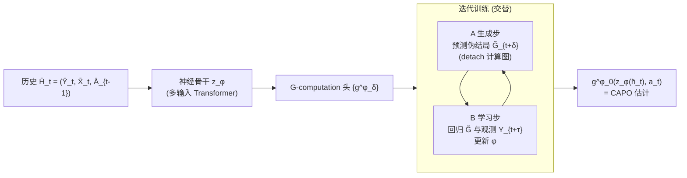

# IGC-Net for Conditional Average Potential Outcome Estimation Over Time

**会议**: ICLR 2026  
**OpenReview**: [https://openreview.net/forum?id=ZmhpqpKzAT](https://openreview.net/forum?id=ZmhpqpKzAT)  
**代码**: [https://github.com/konstantinhess/IGC_net](https://github.com/konstantinhess/IGC_net)  
**领域**: 因果推断 / 时序潜在结果估计 / 医疗决策  
**关键词**: 时变混杂, G-computation, 条件平均潜在结果(CAPO), 迭代回归, 反事实预测, MIMIC-III  

## 一句话总结
提出 **IGC-Net**：第一个用纯回归式迭代 G-computation 端到端估计时序条件平均潜在结果(CAPO)的神经网络，既正确校正时变混杂、又绕开逆倾向权重的除零不稳定和 G-Net 对全分布的高维估计。

## 研究背景与动机
**领域现状**：从电子病历(EHR)、可穿戴设备等观测数据中估计"若按某治疗序列干预、未来结局会怎样"(即时序 CAPO)，是个性化医疗决策的核心任务。其难点在于 **时变混杂(time-varying confounding)**——做多步预测时，未来的协变量/结局既受过去治疗影响、又反过来影响未来治疗分配，且在推理时不可观测(runtime confounding)，因此简单地"只对历史做条件"会得到错误的估计量。

**现有痛点**：现有神经方法分两类、各有硬伤。①不做正确校正的一类(CRN、CT、TE-CDE)靠"平衡表示"启发式处理混杂，但平衡本是为降方差设计、并非消偏，瞄准的估计量根本不对，存在 **无穷样本偏差**(再多数据也消不掉)，部署到医疗场景不负责任。②做正确校正的一类也有问题：RMSNs 用逆倾向加权(IPW)构造伪结局，多步预测要连乘逆倾向分数、频繁 **除以接近 0 的值**而方差爆炸；G-Net / G-transformer 用 G-computation，却要估计未来所有时刻、所有时变混杂变量的 **整个分布**(所有高阶矩)，还得靠蒙特卡洛采样间接推断，维度高、效率低。

**核心矛盾**：既要"正确校正时变混杂瞄准对的估计量"，又要"不踩 IPW 除零和全分布估计两个坑"——现有方法只能二选一。

**本文目标**：构造一个端到端神经模型，正确做 G-computation 式校正，同时只做低方差回归、不估任何概率分布、不做 MC 采样。

**核心idea**：**回归式迭代 G-computation**——把 G-computation 的嵌套条件期望重写成一串递归回归，用"伪结局"逐层往里递推；网络在训练中交替执行 **生成步(A)** 预测中间伪结局、**学习步(B)** 用伪结局做回归更新权重，全部塞进一个端到端架构，从而只需估计低维随机变量的一阶矩。

## 方法详解

### 整体框架
IGC-Net 把"对未来 τ 步干预序列 $a_{t:t+\tau-1}$、给定历史 $\bar H_t$ 估计 CAPO $\mathbb E[Y_{t+\tau}[a_{t:t+\tau-1}]\mid \bar H_t]$"这个嵌套 G-computation 公式，等价改写成由外到内的一串条件期望回归。模型由两块组成：一个 **神经骨干** $z_\phi(\cdot)$(多输入 transformer 或 LSTM)把整段历史编码成隐状态；以及 **τ 个 G-computation 头** $\{g^\phi_\delta\}_{\delta=0}^{\tau-1}$，逐层做迭代回归。训练时在"生成中间伪结局"与"回归学习"两步间交替，最外层的头 $g^\phi_0$ 最终就是 CAPO 估计器。

### 关键设计

**1. 把嵌套 G-computation 重写成递归伪结局回归：用一阶矩链替代全分布积分。** G-computation 把因果量识别为一串由内向外的嵌套条件期望(式 3)，G-Net 的做法是去估未来所有混杂变量的联合分布再积分，维度是 $(\tau-1)\times(d_x+d_y)$、还得 MC 采样。本文转而定义 **伪结局** $G^{\bar a}_{t+\tau}=Y_{t+\tau}$ 作为最内层真值，并令 $g^{\bar a}_{t+\delta}(\bar h^t_{t+\delta})=\mathbb E[G^{\bar a}_{t+\delta+1}\mid \bar H^t_{t+\delta}, A_{t:t+\delta}=a_{t:t+\delta}]$、$G^{\bar a}_{t+\delta}=g^{\bar a}_{t+\delta}(\bar H^t_{t+\delta})$，把整个嵌套期望(式 8–9)化成从 $\delta=\tau-1$ 一路递归到 $\delta=0$ 的回归链，最终 $g^{\bar a}_t(\bar h_t)=\mathbb E[Y_{t+\tau}[a_{t:t+\tau-1}]\mid \bar H_t=\bar h_t]$ 就是要求的 CAPO(Proposition 1 证明该递归确实恢复 CAPO、正确校正时变混杂)。这样每一步只是一个 $d_y$ 维结局回归、只估一阶矩，把 G-Net 的高维全分布问题降成 $\tau$ 个低维回归。

**2. 生成步 + 学习步交替的端到端训练：用网络自己预测缺失的中间伪结局。** 难点在于数据里只观测到最内层 $G^{\bar a}_{t+\tau}=Y_{t+\tau}$，中间伪结局 $\{G^{\bar a}_{t+\delta}\}_{\delta=1}^{\tau-1}$ 是不存在的"标签"。IGC-Net 因此在每次迭代里先跑 **A 生成步**，用当前头沿干预序列预测 $\tilde G^{\bar a}_{t+\delta}=g^\phi_\delta(z_\phi(\bar H^t_{t+\delta}, a_{t:t+\delta-1}), a_{t+\delta})$ 当作缺失伪结局——这一步对计算图 **detach**(不回传梯度)；再跑 **B 学习步**，用事实历史 $\bar H_{t+\delta}$ 重新编码，回归到上一步生成的 $\tilde G^{\bar a}_{t+\delta+1}$，最小化
$$\mathcal L=\frac{1}{T-\tau}\sum_{t=1}^{T-\tau}\Big(\frac1\tau\sum_{\delta=0}^{\tau-1}\big(g^\phi_\delta(Z^{\bar A}_{t+\delta}, A_{t+\delta})-\tilde G^{\bar a}_{t+\delta+1}\big)^2\Big).$$
关键链式逻辑：因为 $\delta=\tau-1$ 的头直接学习真值 $Y_{t+\tau}$(式 18)被准确监督，它生成的 $\tilde G^{\bar a}_{t+\tau-1}$ 随训练越来越准，于是 $g^\phi_{\tau-2}$ 学到更准的目标……由内向外逐层"提纯"，最外层 $g^\phi_0$ 即收敛到正确的 CAPO 估计器(Proposition 2)。生成步与学习步共享同一套骨干+头权重、阻断梯度仅用于生成，使整个迭代 G-computation 真正端到端、跨时间共享信息。

**3. 多输入 transformer 骨干 + 干预/观测双路编码：分流处理异质输入并保证正确估计量。** 骨干采用三个 encoder-only 子 transformer $\{z_{\phi_k}\}$ 分别处理 $\bar Y_t$、$\bar X_t$、$\bar A_{t-1}$ 三类输入(受 Causal Transformer 启发)、并在子网间共享信息，输出隐状态 $Z^{\bar A}_{t+\delta}$ 喂给 G-computation 头。生成步沿 **干预治疗序列** $a$ 编码 $Z^{\bar a}_{t+\delta}=z_\phi(\bar H^t_{t+\delta}, a_{t:t+\delta-1})$，学习步沿 **观测治疗** $\bar A$ 编码 $Z^{\bar A}_{t+\delta}=z_\phi(\bar H_{t+\delta})$——这种双路设计正是 G-computation"对干预求外层期望、对观测求条件"的神经化实现，保证模型瞄准的是 CAPO 而非简单的事实预测量。骨干可替换为 LSTM(论文称 IGC-LSTM，本身也是新贡献)。

**4. 理论上压制方差：回归式伪结局优于 IPW。** Proposition 3 证明，IPW 构造的伪结局方差严格大于 IGC-Net 迭代 G-computation 的伪结局——RMSNs 多步预测要连乘逆倾向分数、在重叠(positivity)被破坏时除以接近 0 的值导致权重爆炸；而 IGC-Net 全程只做平方误差回归、不涉及任何倒数，因此在长预测窗口和重叠违背场景下天然更稳。这条性质把"为什么不用 IPW"从经验观察上升为可证明的方差比较。

## 实验关键数据

### 主实验：合成肿瘤数据(τ=2，RMSE，越低越好)
随混杂强度 γ 从 10 增到 20，IGC-Net 全程最优且最稳：

| 方法 | γ=10 | γ=14 | γ=18 | γ=20 |
|---|---|---|---|---|
| CRN | 4.05 | 5.24 | 5.08 | 4.80 |
| TE-CDE | 4.08 | 4.39 | 4.44 | 4.72 |
| CT | 3.44 | 3.88 | 4.13 | 4.49 |
| RMSNs | 3.34 | 3.92 | 4.60 | 4.62 |
| G-transformer | 5.42 | 5.46 | 5.67 | 6.00 |
| G-Net | 3.51 | 3.91 | 4.22 | 4.24 |
| **IGC-Net** | **3.13** | **3.30** | **3.41** | **3.71** |
| 相对提升 | 6.4% | 15.0% | 17.4% | 12.5% |

### 半合成数据(MIMIC-III 抽取，dx=25 维协变量，RMSE)
随预测窗口 τ 增大、提升更明显，相对最优 baseline 提升最高 **26.7%**：

| 方法 (N=3000) | τ=2 | τ=4 | τ=6 |
|---|---|---|---|
| CT | 0.32 | 0.49 | 0.61 |
| RMSNs | 0.66 | 0.86 | 1.00 |
| G-Net | 0.54 | 0.88 | 1.11 |
| **IGC-Net** | **0.24** | **0.36** | **0.48** |
| 相对提升 | 26.7% | 25.2% | 21.6% |

### 消融实验

| 配置 | 结果 |
|---|---|
| IGC-Net (multi-input transformer) | 全场最优 |
| IGC-LSTM(换 LSTM 骨干) | 竞争力强，说明增益主要来自 G-computation 范式而非 transformer |
| 有偏 transformer(去掉迭代生成/学习、直接学事实) | 明显变差，证明迭代校正不可或缺 |

### 关键发现
- **正确校正才稳**：不做正确校正的 CRN/CT/TE-CDE 随混杂增强方差剧烈波动；IGC-Net 始终平稳。
- **维度与窗口双重压力下优势放大**：高维协变量 + 长预测窗口正是 IPW(权重不稳)和 G-Net(维度灾难)的死穴，IGC-Net 提升幅度反而最大。
- **真实 MIMIC-III ICU 事实预测**(sanity check)：IGC-Net 与 CT 并列最佳，说明即便不需要时变校正也不掉队、可直接落地临床数据。
- **重叠敏感性**：放大治疗分配 logit 制造 positivity 违背时 IGC-Net 仍最优，印证 Proposition 3 的低方差优势。

## 亮点与洞察
- **把统计因果的经典 G-computation 真正"神经端到端化"**：以往要么用平衡启发式(偏)、要么用 IPW(方差大)、要么估全分布(维度灾难)，本文用一串递归回归 + 生成/学习交替，找到了第四条路——只估一阶矩、不采样、不除倒数。
- **理论与工程双落地**：三条命题分别保证"递归恢复 CAPO""端到端正确校正""方差严格小于 IPW"，不是纯经验调参的提升。
- **由内向外逐层提纯的训练动力学**很优雅：最内层有真值锚定，监督信号沿伪结局链反向传播逐层变准，自然解决了"中间伪结局无标签"的鸡生蛋问题。

## 局限与展望
- **依赖标准可识别性假设**(一致性、positivity、序列可忽略性)——存在未观测混杂时仍会有偏，这是 G-computation 类方法的共同前提。
- **真实数据只能做事实预测 sanity check**：反事实无法观测，CAPO 的真实因果精度无法在真实 EHR 上直接验证，仍主要靠合成/半合成评估。
- **离散二元治疗设定**($A_t\in\{0,1\}^{d_a}$)，连续剂量、不规则采样时间等更复杂临床场景留待扩展。
- 迭代生成/学习交替的训练成本随 τ 线性增长，长程预测的计算/稳定性权衡值得进一步分析。

## 相关工作与启发
- **G-methods 谱系**(Robins 等)：MSM、结构嵌套模型、G-computation、TMLE 是统计因果处理时变混杂的经典工具；本文把 Bang & Robins 的迭代 G-computation 思想引入神经网络并扩展到 CAPO(异质化、带个体特征)，区别于只估 APO(忽略个体)的工作。
- **时序 CAPO 神经方法**：CRN/CT/TE-CDE(平衡表示)、RMSNs(IPW)、G-Net/G-transformer(全分布 G-computation)构成主要 baseline；本文以"既正确校正又低方差回归"统一解决前两类的缺陷。
- **启发**：①"把统计估计量的递归结构直接映射成网络的逐层回归"是一种可推广的范式，或可用于 TMLE、双稳健估计的神经化；②"用网络自生成中间监督信号 + 阻断梯度"为缺失中间标签的序列因果问题提供了通用训练技巧；③双路(干预/观测)编码是把 do-算子语义嵌入序列模型的轻量手段。

## 评分
- **新颖性**: ⭐⭐⭐⭐⭐ 首个纯回归式迭代 G-computation 的端到端神经 CAPO 模型，思路清晰且填补了"正确校正 + 低方差"的真实空白。
- **实验充分度**: ⭐⭐⭐⭐ 合成/半合成/真实三档数据 + 混杂强度/样本量/预测窗口/重叠违背多维扫描 + 双消融，覆盖全面；唯反事实真精度受限于无法观测。
- **写作质量**: ⭐⭐⭐⭐⭐ 问题定位精准(Table 1 把对手缺陷讲透)，方法递推与命题层层铺垫，图 1/图 2 把抽象 G-computation 可视化得清楚。
- **价值**: ⭐⭐⭐⭐ 对个性化医疗决策(EHR/可穿戴)的反事实预测有直接落地意义，方法范式可迁移到更广的时序因果估计。

<!-- RELATED:START -->

## 相关论文

- [\[ICLR 2026\] Overlap-Adaptive Regularization for Conditional Average Treatment Effect Estimation](overlap-adaptive_regularization_for_conditional_average_treatment_effect_estimat.md)
- [\[ICLR 2026\] Direct Doubly Robust Estimation of Conditional Quantile Contrasts](direct_doubly_robust_estimation_of_conditional_quantile_contrasts.md)
- [\[ICLR 2026\] Overlap-Weighted Orthogonal Meta-Learner for Treatment Effect Estimation over Time](overlap-weighted_orthogonal_meta-learner_for_treatment_effect_estimation_over_ti.md)
- [\[ICLR 2026\] GDR-learners: Orthogonal Learning of Generative Models for Potential Outcomes](gdr-learners_orthogonal_learning_of_generative_models_for_potential_outcomes.md)
- [\[ICLR 2026\] ActiveCQ: Active Estimation of Causal Quantities](activecq_active_estimation_of_causal_quantities.md)

<!-- RELATED:END -->
