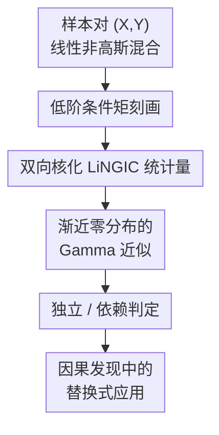

# Independence Test for Linear Non-Gaussian Data and Applications in Causal Discovery

**会议**: ICLR2026  
**OpenReview**: [https://openreview.net/forum?id=Uc1EAICxTD](https://openreview.net/forum?id=Uc1EAICxTD)  
**代码**: 暂无公开代码  
**领域**: 因果推断 / 因果发现  
**关键词**: 线性非高斯模型, 独立性检验, LiNGAM, 条件矩, 核方法  

## 一句话总结
本文证明在线性非高斯混合模型中，只要条件均值和条件方差都为常数就足以推出独立性，并据此提出对一阶、二阶条件矩同时敏感的核独立性检验 LiNGIC，在合成数据和 Direct-LiNGAM 因果发现中比通用 HSIC 等检验有更高统计功效。

## 研究背景与动机
**领域现状**：独立性检验是因果发现里最常被反复调用的基础模块。在线性非高斯无环模型 LiNGAM 中，Direct-LiNGAM 通过判断变量与回归残差是否独立来寻找外生变量；在含潜变量的线性非高斯场景中，GIN 条件同样需要大量独立性检验来识别潜在因果结构。因此，检验本身的统计功效会直接影响最终学到的因果图。

**现有痛点**：实际使用中，研究者通常把 HSIC、dCor、RDC 这类通用非参数检验直接接到 LiNGAM/GIN 流程里。它们理论上能覆盖很广泛的依赖形式，也能控制 Type I error，但这种“通用性”在有限样本下并不免费：检验需要搜索任意非线性、任意高阶的依赖模式，反而没有充分利用“数据是线性非高斯混合”的结构先验，容易牺牲功效。

**核心矛盾**：线性非高斯模型之所以能做可识别因果发现，靠的是非常具体的结构假设；但下游检验却常常把样本当成一般联合分布来处理。也就是说，因果模型本身在利用非高斯性，独立性检验却没有利用非高斯线性混合的约束，这导致方法链条里最基础的一环和建模假设不匹配。

**本文目标**：作者想回答两个问题。第一，在线性非高斯混合变量之间，是否可以用比“所有有界连续函数协方差为零”更低维的条件来刻画独立性？第二，如果这种刻画存在，能否把它转成一个可计算、带渐近保证、可直接嵌入因果发现算法的检验统计量？

**切入角度**：文章从条件均值和条件方差出发。对一般非线性非高斯数据，仅让 $E(Y\mid X)$ 和 $Var(Y\mid X)$ 为常数并不能保证独立，因为高阶形状如偏度、峰度仍可能随 $X$ 改变；但在线性非高斯混合中，若 $X$ 和 $Y$ 共享同一个非高斯源，这种共享会被一阶或二阶条件矩暴露出来。

**核心 idea**：用“条件均值常数 + 条件方差常数”替代通用独立性刻画，再用核协方差同时检测 $Cov(f(X),Y)$ 和 $Cov(f(X),Y^2)$，从而得到专门服务线性非高斯因果发现的独立性检验。

## 方法详解
### 整体框架
这篇论文的方法可以看成一条从理论刻画到可计算检验再到因果发现替换模块的链路。输入是一组样本对 $D=\{(x_i,y_i)\}_{i=1}^n$，假设它们来自独立非高斯源的线性混合；输出是“拒绝/不拒绝 $X\perp\!\!\!\perp Y$”的检验结论，并可作为 Direct-LiNGAM 等算法里的独立性检验组件。

核心流程先证明：在线性非高斯模型内，独立性等价于 $E(Y\mid X)$ 为常数且 $Var(Y\mid X)$ 为常数。随后把这两个条件改写为对任意有界连续函数 $f$，$Cov(f(X),Y)=0$ 与 $Cov(f(X),Y^2)=0$。最后，作者用一侧 Gaussian kernel、一侧二次多项式 kernel 构造 LiNGIC 统计量，并用渐近零分布的 Gamma 近似给出阈值。

### 关键设计
**1. 低阶条件矩刻画：把线性非高斯独立性压缩到均值与方差**

通用独立性定义要求 $P_{XY}=P_XP_Y$，或者等价地要求所有有界连续函数对都不相关，这在有限样本下很难直接检验。本文最关键的理论结果是：若 $X=\sum_j b_j\varepsilon_j$、$Y=\sum_j a_j\varepsilon_j$，其中 $\varepsilon_j$ 相互独立且非高斯，那么 $X\perp\!\!\!\perp Y$ 当且仅当存在常数 $c$ 和 $\sigma_0^2$ 使得 $E(Y\mid X)=c$ 且 $Var(Y\mid X)=\sigma_0^2$。

这个结论的直觉是，如果 $X$ 和 $Y$ 共享某个源 $\varepsilon_j$，共享项会让 $Y$ 关于 $X$ 的条件结构发生变化；在线性非高斯假设下，这种共享不能同时隐藏在条件均值和条件方差之外。证明里作者把 $X,Y$ 分解为共享源部分和各自独有源部分，并使用 Darmois-Skitovich 定理与特征函数推导：如果共享源存在而两个条件矩又都恒定，那么这些共享源必须是高斯的，这与非高斯假设矛盾。因此共享源集合只能为空，也就得到独立性。

**2. 双向核化 LiNGIC 统计量：同时检测 $Y$ 和 $Y^2$ 的条件相关**

有了条件矩刻画后，问题转成如何检验 $E(Y\mid X)$ 与 $E(Y^2\mid X)$ 是否都为常数。作者进一步证明，在线性非高斯模型下，独立性等价于对任意有界连续函数 $f$ 都有 $Cov(f(X),Y)=0$ 且 $Cov(f(X),Y^2)=0$。这一步很重要，因为它把条件均值/方差检验变成了一个核协方差算子的零值检验。

具体做法是对 $X$ 侧使用 universal kernel，例如 Gaussian kernel，用它近似丰富的函数类；对 $Y$ 侧使用二次多项式 kernel，让特征空间只需要覆盖 $y$ 和 $y^2$ 这两个与一阶、二阶条件矩相关的方向。第一个版本可以写成 $LiNGIC_1(X,Y)=\|Cov(\phi(X),\psi(Y))\|_{HS}^2$，经验估计形式与 HSIC 类似：$LiNGIC_{1b}(D)=n^{-2}Tr(K_XHL_YH)$。和普通 HSIC 不同的是，这里的多项式 kernel 不是为了泛化到所有依赖，而是精准对准线性非高斯理论里足够的两个低阶矩。

**3. 对称化设计：避免单向统计量对变量角色和重尾值过敏**

单看 $LiNGIC_1(X,Y)$ 是不对称的，因为二次多项式 kernel 放在 $Y$ 侧，Gaussian kernel 放在 $X$ 侧；当 $Y$ 有重尾或极端值时，多项式 kernel 的无界性还可能带来数值不稳定。作者因此把两个方向合在一起，最终统计量为 $LiNGIC(X,Y)=\|Cov(\phi_1(X),\phi_2(Y))\|_{HS}^2$，等价于把 $LiNGIC_1(X,Y)$ 和 $LiNGIC_1(Y,X)$ 相加。

在样本上，最终的 biased estimator 为 $LiNGIC_b(D)=n^{-2}Tr(K_XHL_YH)+n^{-2}Tr(K_YHL_XH)$。这里 $K$ 表示 Gaussian kernel Gram matrix，$L$ 表示二次多项式 kernel Gram matrix，$H=I-\frac{1}{n}\mathbf{1}\mathbf{1}^\top$ 是中心化矩阵。这个设计让统计量对 $X,Y$ 交换保持一致，也让检验更适合被放入因果发现算法中反复调用。

**4. 渐近零分布的 Gamma 近似：把理论统计量变成可用检验**

独立性检验不仅要给出统计量，还要给出显著性水平 $\alpha$ 下的临界值。作者证明在零假设 $H_0:X\perp\!\!\!\perp Y$ 下，$nLiNGIC_b(D)$ 渐近收敛到加权卡方和 $\sum_l\lambda_l\chi^2_{1l}$；在备择假设下，$LiNGIC_b(D)$ 以 $\sqrt{n}$ 速度收敛到高斯分布。这给了检验一致性的理论基础。

直接估计无限加权卡方和比较麻烦，permutation test 又很慢，所以论文采用类似 HSIC 的 Gamma moment matching。它估计 $A=E[nLiNGIC_b(D)]$ 和 $B=Var(nLiNGIC_b(D))$，再令 $nLiNGIC_b(D)\sim Gamma(\gamma,\beta)$，其中 $\gamma=A^2/B$、$\beta=B/A$。作者给出了 $A,B$ 的 $O(n^{-1})$ 偏差估计，计算量保持在 $O(n^2)$，与标准核独立性检验同阶。

### 损失函数 / 训练策略
本文不是训练模型，而是设计统计检验，因此没有传统意义上的损失函数。实际检验流程是：先用样本构造 Gaussian kernel 与二次多项式 kernel 的 Gram matrix，计算 $LiNGIC_b(D)$；再用 Gamma 近似或 permutation test 得到零分布阈值；若统计量超过显著性水平 $\alpha$ 对应的临界值，就拒绝独立性零假设。

实验中显著性水平固定为 $0.05$。所有依赖 characteristic kernel 的方法采用 Gaussian kernel，普通 HSIC 使用 gamma approximation，RDC 等 permutation 版本使用 500 次置换；作者还比较了 LiNGIC 的 Gamma 近似与 permutation 版本，说明推导出的渐近阈值并不是只停留在理论上。

## 实验关键数据

### 主实验
作者先在合成线性非高斯混合数据上比较独立性检验本身，再把检验嵌入 Direct-LiNGAM 做因果发现。合成数据中，依赖情形令 $X,Y$ 共享非高斯独立源，独立情形则让两者使用不相交的源集合；分布包括 Laplace、Student-t、Uniform 和截断正态，样本量与源数量都会变化。

| 实验设置 | 指标 | LiNGIC 结果 | 对比方法 | 结论 |
|--------|------|-------------|----------|------|
| 线性非高斯混合，$n=500$，源数量 $d=2\sim6$ | Test Power / Type I error | 多数分布下 power 最高或接近最高，同时 Type I error 围绕 0.05 | HSIC、HSIC-RFF、dCor、LFHSIC | 利用线性非高斯结构后，有限样本功效更强 |
| 固定 3 个源，样本量 $n=300\sim1100$ | Test Power | 样本增大时 power 稳定提升，整体高于通用检验 | HSIC、dCor 等 | 不是靠放宽 Type I error 换 power，而是在同等显著性下更敏感 |
| 依赖强度 $c=0.1\sim1.0$，Student-t，$n=500$ | Power | 从弱依赖到强依赖均随 $c$ 增大，$c=1.0$ 达 0.95 | HSIC 在 $c=1.0$ 为 0.83 | 对共享源引起的线性非高斯依赖更敏感 |
| SACHS 结构合成数据上的 Direct-LiNGAM | SHD / F1 | 多数噪声类型下 SHD 更低、F1 更高 | Direct-LiNGAM + HSIC/HSIC-RFF/dCor | 独立性检验改进能传导到因果图恢复 |

在 Direct-LiNGAM 的 SACHS 结构合成实验中，LiNGIC 替换原独立性检验后优势比较直观。Uniform 噪声下，SHD 从 HSIC 的 2.1 降到 0.8，F1 从 0.93 升到 0.98；Laplace 噪声下，SHD 从 1.0 降到 0.2，F1 从 0.96 升到 0.99；截断正态下，HSIC 的 SHD 为 13.2、F1 为 0.60，而 LiNGIC 达到 SHD 6.3、F1 0.79。Student-t 下所有方法差距较小，LiNGIC 与最佳结果基本持平。

### 消融实验
论文没有传统深度模型式的“去掉模块 A/B”消融，但提供了几组能解释设计必要性的分析实验：附加基线、Gamma vs permutation、依赖强度敏感性、运行时间与真实数据评估。

| 配置 / 分析 | 关键指标 | 说明 |
|------------|---------|------|
| HSIC vs LiNGIC，在 Laplace/Student-t/Uniform/Truncnorm 上改变源数量 | Type I error 与 Power | LiNGIC 在 Laplace、Student-t、Uniform 上通常保持更高 power；Truncnorm 更接近高斯，优势变弱，说明非高斯结构越明显越有利 |
| 加入 SCIT、RDC、MI 等更多基线 | Power / Type I error | SCIT 在 $Z=\emptyset$ 时退化为通用检验，未利用线性非高斯结构，整体 power 不如 LiNGIC |
| Gamma 近似 vs permutation test | 检验性能与计算开销 | permutation 可估计零分布但昂贵，Gamma 近似保留较好性能并适合较大样本 |
| 运行时间，$n=500\sim5000$ | 秒级耗时 | LiNGIC 与 HSIC 同为 $O(n^2)$，但常数更大；例如 $n=5000$ 时 HSIC 约 0.995s，LiNGIC 约 3.126s，远快于 permutation 版本 |
| SACHS 真实观测数据 | F1 / SHD | 真实数据上 LiNGIC 的 F1 为 0.22、SHD 为 15，不如 dCor 的 F1 0.29、SHD 14，说明真实生物数据未必完全满足线性非高斯假设 |

### 关键发现
- LiNGIC 的主要收益来自“检验假设与数据生成假设对齐”：在真实依赖来自共享非高斯线性源时，它比通用核检验更容易在有限样本下发现依赖。
- Type I error 控制并没有明显崩掉。多组实验中，LiNGIC 的 Type I error 基本围绕显著性水平 0.05 波动，说明 power 提升不是简单靠更激进地拒绝零假设换来的。
- 非高斯性越弱，优势越小。截断正态和高维/复杂图设置里 LiNGIC 仍有收益，但提升幅度下降，这和理论假设相符。
- 因果发现收益不是只体现在独立性检验表格里。Direct-LiNGAM 的 SHD/F1 改善说明基础检验更准会影响外生变量识别和因果排序恢复。
- 真实 SACHS 数据结果更克制：LiNGIC 没有全面超过所有方法，提示现实数据里的非线性、干预混杂、测量噪声或模型错设会削弱专门检验的优势。

## 亮点与洞察
- 这篇论文最巧的地方是把一个看似需要“全函数类”的独立性问题，在线性非高斯假设下压缩成条件均值和条件方差。它不是泛泛地说低阶矩有用，而是给出了必要充分条件和反证逻辑。
- LiNGIC 的二次多项式 kernel 用得很有针对性。普通 HSIC 追求 characteristic kernel 捕获任意依赖，而本文只让一侧特征覆盖 $Y$ 与 $Y^2$，正好对应理论中的一阶、二阶条件矩，这种“少看一点但看对地方”的思路很值得借鉴。
- 对称化处理很务实。初始统计量已经能对应理论，但作者意识到变量角色和重尾数值会带来实际问题，于是把两个方向合并，减少实现时的脆弱性。
- 从方法论上看，本文提醒因果发现里的检验模块不应总是用通用工具替换。若结构方程模型有明确假设，检验统计量也应尽量贴合这些假设，否则会在有限样本里浪费信息。
- 这个思路可迁移到其他“结构假设很强但检验很通用”的场景，例如特定噪声模型下的条件独立性检验、线性潜变量模型中的残差检验，或者 ICA 相关算法里的成分独立性判定。

## 局限与展望
- 理论保证强依赖于线性非高斯混合假设。若真实数据存在明显非线性混合、异质噪声、反馈环或强测量误差，条件均值/方差常数不再足以刻画独立性，LiNGIC 的优势可能消失甚至误导。
- 方法仍是二次复杂度。相比 HSIC 同阶，但 LiNGIC 需要两组 kernel 组合，常数开销更大；在 Direct-LiNGAM 高维图里反复调用时，运行时间明显高于 HSIC。后续可以考虑随机 Fourier 特征或 Nyström 近似。
- 真实数据实验并没有压倒性优势。SACHS 真实观测数据中 dCor 的 F1 更高，这说明模型假设和现实数据之间还有距离，也提示应在实际因果发现中把 LiNGIC 当作结构匹配时的强工具，而不是所有数据的默认替代。
- 当前主要讨论成对独立性。附录指出在线性非高斯 ICA 框架下联合独立可约化到 pairwise independence，但直接面向多变量的 LiNGIC 版本仍是开放方向。
- 阈值估计依赖渐近近似。有限样本、小样本或重尾极端值下，Gamma approximation 可能仍有偏差；更稳健的校准策略或自适应选择 permutation/Gamma 的机制值得继续研究。

## 相关工作与启发
- **vs HSIC**: HSIC 用 characteristic kernel 检测广义依赖，适用面更广；LiNGIC 则把一侧 kernel 限制到二次多项式特征，牺牲一般性来换取线性非高斯场景下的功效。
- **vs dCor / RDC**: dCor 和 RDC 都是通用依赖度量，不需要线性非高斯假设；本文方法的优势在于有结构先验时更敏感，劣势是在假设错设时不一定更稳。
- **vs Direct-LiNGAM 原始检验流程**: Direct-LiNGAM 依赖变量与残差的独立性判断来找因果顺序；本文不是重写整个算法，而是替换其中最基础的独立性检验，使原算法更匹配 LiNGAM 的非高斯结构。
- **vs GIN 条件相关方法**: GIN 在含潜变量的线性非高斯模型中也高度依赖独立性判断；LiNGIC 可作为这类流程的底层检验模块，潜在价值在于减少大量检验累积的错误。
- **对后续研究的启发**: 与其不断寻找更通用的独立性检验，不如在某些因果模型里先问“这个模型下依赖会以什么最小统计信号暴露出来”，再围绕该信号设计检验。

## 评分
- 新颖性: ⭐⭐⭐⭐⭐ 条件均值与条件方差在线性非高斯混合中刻画独立性的结果很有辨识度，也直接连接到可计算统计量。
- 实验充分度: ⭐⭐⭐⭐ 合成实验、因果发现应用、运行时间和附加基线都比较完整；真实数据结果较弱但诚实呈现。
- 写作质量: ⭐⭐⭐⭐ 理论主线清楚，证明和统计量推导完整；部分公式密集，读者需要较强统计背景。
- 价值: ⭐⭐⭐⭐⭐ 对 LiNGAM/GIN 这类依赖独立性检验的因果发现方法很实用，也提供了“结构假设驱动检验设计”的好范例。

<!-- RELATED:START -->

## 相关论文

- [\[ICLR 2026\] Efficient Ensemble Conditional Independence Test Framework for Causal Discovery](efficient_ensemble_conditional_independence_test_framework_for_causal_discovery.md)
- [\[ICLR 2026\] Distributional Equivalence in Linear Non-Gaussian Latent-Variable Cyclic Causal Models](distributional_equivalence_in_linear_non-gaussian_latent-variable_cyclic_causal_.md)
- [\[ICML 2025\] Estimating Causal Effects in Gaussian Linear SCMs with Finite Data](../../ICML2025/causal_inference/estimating_causal_effects_in_gaussian_linear_scms_with_finite_data.md)
- [\[ICLR 2026\] Causal Discovery via Quantile Partial Effect](causal_discovery_via_quantile_partial_effect.md)
- [\[ICLR 2026\] Causal Discovery in the Wild: A Voting-Theoretic Ensemble Approach](causal_discovery_in_the_wild_a_voting-theoretic_ensemble_approach.md)

<!-- RELATED:END -->
