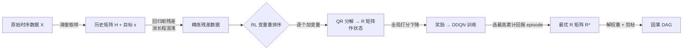

# Influence without Confounding: Causal Discovery from Temporal Data with Long-term Carry-over Effects

**会议**: ICLR 2026  
**OpenReview**: [https://openreview.net/forum?id=s0nYSwlV3I](https://openreview.net/forum?id=s0nYSwlV3I)  
**代码**: 待确认  
**领域**: 因果发现 / 时序因果 / 强化学习  
**关键词**: 时序因果发现, 长程滞后效应, QR 分解, 拓扑序, Deep Q-Network, 结构汉明距离  

## 一句话总结
针对时序数据中"远古历史值直接影响当下"导致的虚假因果（长程 carry-over 混淆），本文先用证明把"OLS 打分→QR 分解的 R 矩阵对角线"与真实拓扑序绑定，再用有限步历史回归残差消除长程混淆，最后用 DQN 以 R 矩阵为状态高效搜索最优变量序，提出 LEVER 方法。

## 研究背景与动机
**领域现状**：时序因果发现要从时间序列里恢复变量间的因果 DAG，是物理定律发现、根因定位等任务的基础。主流做法（Granger、PCMCI、NTS-NOTEARS、DYNOTEARS）都把变量按一个**固定最大滞后阶**展开成时序节点，再做条件独立检验或带无环约束的优化。

**现有痛点**：现实系统普遍存在**长程 carry-over 效应**——某变量当前值不仅取决于父变量的当前值，还累积了父变量过去一长段时间的影响（如广告投放对销量的持续拉动）。这种影响时间跨度极大，难以观测或建模。固定滞后阶的方法只能覆盖近几步，**忽略掉的远古历史节点会同时影响多个当前变量，从而被误判为当前变量之间存在直接因果**——这就是"历史混淆"。

**核心矛盾**：要消除历史混淆就得纳入更长历史，但把变量按更多滞后展开会让节点数爆炸（10 节点已有 $4.2\times10^{18}$ 个候选结构），计算与内存代价急剧上升。**"消混淆"和"可扩展"天然冲突**。

**本文目标**：在允许远古历史直接施加因果效应（而非仅通过中间观测节点中介）的更难设定下，恢复 summary 因果骨架，同时兼顾精度与效率。

**核心 idea**：
- **理论侧 idea**：把"用 OLS 误差给拓扑序打分"严格等价为"数据矩阵 QR 分解后 R 矩阵对角线平方和"，从而把因果发现与线性代数中的 QR 分解直接挂钩；并证明**只用有限几步历史做回归取残差，就足以保持因果可识别性**（Limited-History 定理）。
- **算法侧 idea**：既然 R 矩阵唯一编码了打分与因果权重，就拿它当 RL 的状态表示，用 DQN 把"找最优拓扑序"建模成逐个挑变量的决策过程，动作空间只有 $O(d)$，避开神经网络状态编码器的开销。

## 方法详解

### 整体框架
LEVER 把时序因果发现拆成三段流水线：①**历史精炼**——滑窗取样后，用窗口内前几步历史对最后一步做回归并取残差，把长程历史混淆"减掉"；②**RL 变量重排序**——以残差数据列的 QR 分解 R 矩阵为状态、以全局打分下降为奖励，用 Double DQN 逐个把变量加入数据列，找最优拓扑序；③**结构恢复**——从最优 R 矩阵直接解出因果权重矩阵，再对接近零的权重剪枝得到稀疏 DAG。

### 关键设计

**1. OLS 打分与 QR 分解的等价：把"评拓扑序"变成"读 R 矩阵对角线"。** 文章先用 OLS 误差定义拓扑序的打分：对每个变量 $j$，用它在序 $\pi$ 中的前驱变量 $\mathrm{pa}_\pi(j)$ 去拟合它，残差平方和累加即 $\mathrm{Score}(\pi;Y)=\sum_{j=1}^d \lVert Y_{:,j}-Y_{:,\mathrm{pa}_\pi(j)}\hat\beta_j\rVert_2^2$。关键洞察（Theorem 1）是：把数据按 $\pi$ 排列成 $Y^\pi$ 做 QR 分解 $Y^\pi=QR$（$R$ 上三角且对角为正），则这个打分恰好等于 R 矩阵对角线平方和 $\mathrm{Score}(\pi;Y)=\sum_{i=1}^d R_{i,i}^2$。这一步把"为每个变量解一次回归"压缩成"做一次 QR、读对角线"，复杂度 $O(md^2)$ 且数值稳定。Theorem 2 进一步保证：样本足够大时，**真实拓扑序几乎必然取得最小期望打分**，于是"找因果序"被规约成"找让 R 对角线平方和最小的排列"。

**2. 从打分到结构：R 矩阵直接吐权重，阈值剪枝去冗余边。** 由真实拓扑序得到的"完全 DAG"含多余边，需要恢复真正的稀疏结构。Theorem 3 给出闭式解——每个变量 $j$ 来自父节点的权重可由 R 的子块直接算出：$W_{\mathrm{pa}_\pi(j),j}=R_{\circ(j-1),\circ(j-1)}^{-1}\cdot R_{\circ(j-1),j}$，其中 $\circ k$ 表示取前 $k$ 个元素。Theorem 4 保证存在阈值 $\theta$，把 $|W_{i,j}|<\theta$ 的边删掉后得到的图与真因果图完全一致。也就是说，整套"打分—定序—估权—剪枝"全程不需要额外训练别的模型，权重和结构都从同一个 R 矩阵里读出来。

**3. 有限历史精炼：用 h 步历史当杠杆撬掉无限长的混淆。** 这是应对长程 carry-over 的核心。系统假设为线性时不变 $X[t]=\sum_{\tau=0}^{t}X[t-\tau]g(\tau)+\epsilon(t)$，冲激响应 $g(\tau)$ 可拖到很远。Theorem 5 先证明：用**全部历史**回归 $X[t]$ 取残差能保持可识别性，但全历史不可得。于是引入 Assumption 3（$g(\tau)$ 满足线性递推 $g(\tau)=\sum_{i=1}^h k_i\,g(\tau-i)$，指数衰减是其特例），Theorem 6（Limited-History 定理）证明：**只用 $X[t-1],\dots,X[t-h]$ 做回归得到的残差 $\dot Y[t]$，真实拓扑序仍能最小化打分**。实现上对每个滑窗样本，把历史矩阵拉平成向量 $H'$，回归目标 $\arg\min_B\sum_r\lVert x_r-H'B_r\rVert_2^2$，精炼残差为 $\dot x=x-H'B$。代价仅多 0.0017 秒，却把"远古直接因果"这一混淆源消掉。

**4. R 矩阵作状态的 RL 重排序：动作 $O(d)$、状态零编码开销。** 把找最优序建模为 MDP——动作是"把某个尚未选的变量的精炼数据追加进数据列"，第 $i$ 步动作空间 $\{1,\dots,d\}\setminus\Gamma$ 大小仅 $d-i+1$；状态是当前数据列 QR 分解出的 R 矩阵（它唯一编码打分与权重，省去神经网络编码器）；奖励是全局打分的下降量，全局打分 $\mathrm{GlobalScore}=\sum_{i=1}^{|\Gamma|}R_{i,i}^2+\sum_{j\notin\Gamma}\mathrm{RSS}_{\Gamma\to j}$ 兼顾已选与未选变量的残差。用 Double DQN 缓解过估计，更新式 $Q(s,a;\theta)\leftarrow Q(s,a;\theta)+\alpha[r+\gamma\max_{a'}Q(s',a';\theta^-)-Q(s,a;\theta)]$，目标网络软更新 $\theta^-\leftarrow\lambda\theta+(1-\lambda)\theta^-$；训练中记录累计奖励最高 episode 对应的最优 $R^*$。正因状态是 R 矩阵而非神经编码，20 节点图上每 episode 仅 0.25 秒、峰值内存 10.36 MB，远低于 RL（19.45 秒 / 24.40 MB）与 CORL（1.71 秒 / 64.68 MB）。

## 实验关键数据

### 主实验表格

静态数据（Erdős–Rényi 图，500 i.i.d. 样本，8 个基线对比）：

| 图设置 | 指标 | PC | NOTEARS | RL | CORL | SCORE | LEVER |
|--------|------|----|---------|----|----|-------|-------|
| G(10,20) | F1↑ | 0.4574 | 0.7308 | 0.3809 | 0.5930 | 0.8179 | **0.8899** (▲8.79%) |
| G(10,20) | FPR↓ | 0.0949 | 0.0208 | 0.0580 | 0.0206 | 0.0329 | **0.0123** (▼40.96%) |
| G(10,20) | SHD↓ | 19.00 | 8.00 | 18.33 | 12.00 | 6.67 | **4.00** (▼40.00%) |
| G(20,40) | F1↑ | 0.5528 | 0.7898 | 0.3770 | 0.5228 | 0.7918 | **0.8337** (▲5.30%) |
| G(20,40) | SHD↓ | 32.00 | 13.54 | 34.00 | 25.85 | 15.50 | **11.60** (▼14.29%) |

时序数据（含长程 carry-over）：相比最优基线 **SHD 降低 64%–88%、F1 提升 45%–101%**。效率上，10 节点图上 NOTEARS、PC 处理时序数据的运行时较静态分别增加 203 倍、69 倍（因展开节点），而 LEVER 历史精炼仅多 0.0017 秒。

### 消融实验表格

把 RL 重排序模块替换为各静态基线（LV-PC / LV-NOTEARS / LV-RL / LV-CORL / LV-SCORE）后在时序数据上对比，结论是：尽管目标上 RL 序模块"可被替换"，但完整 LEVER 的 RL 序仍取得更高精度。

假设违反鲁棒性（随机置零三条因果依赖，仅在 lag 3/5/10/25 保留）：

| 数据集 | SHD↓ | F1↑ |
|--------|------|-----|
| Standard | 4 | 0.8947 |
| Modified (lag=3) | 5 | 0.8718 |
| Modified (lag=5) | 5 | 0.8718 |
| Modified (lag=10) | 3 | 0.9231 |
| Modified (lag=25) | 6 | 0.8421 |

### 关键发现
- **R 矩阵作状态是效率关键**：相比同为 RL 框架的 RL/CORL，时间与内存均大幅下降，验证"用 R 矩阵替代神经编码器"的价值。
- **长程依赖确实超出固定滞后**：heatmap 显示 $g(\tau)$ 在 $\tau=10/20/50$ 仍有显著值，实际 carry-over 跨度远超递推阶 $h$，固定最大滞后模型必然漏掉而引入混淆。
- **真实数据领先**：风洞数据集 wt_walks_v1（16 节点 26 边）上 LEVER SHD=22、F1=0.5769，显著优于 PCMCI（35 / 0.3636）、NTS-NOTEARS（37 / 0.3019）、Granger（48 / 0.2941）。

## 亮点与洞察
- **把因果发现接到 QR 分解上**：OLS 打分 ≡ R 对角线平方和，这个等价让"打分、定序、估权、剪枝"全收敛到一次 QR 分解，既给了理论保证又天然高效，是全文的支点。
- **"有限历史 ≈ 无限历史"的可识别性证明**：在 $g(\tau)$ 线性递推假设下，只用 $h$ 步历史残差就保持可识别，把"无限长混淆"问题压成"几步回归"，这是对长程 carry-over 的关键松绑。
- **状态表示选得巧**：用线性代数量（R 矩阵）而非学习到的嵌入做 RL 状态，既信息完备又零编码开销，给了 RL 因果发现一个轻量范式。

## 局限与展望
- **线性时不变（LTI）假设**：全部理论建立在线性、时不变冲激响应上，非线性场景无理论保证；作者计划扩展到非线性。
- **$g(\tau)$ 线性递推假设**：用有限历史彻底消混淆依赖 $g(\tau)$ 能被前 $h$ 阶线性表示，真实系统未必满足；未来想放宽条件并量化条件不满足时的影响。
- **窗口长度 $w$ 需权衡**：$w$ 越大历史越完整但样本数 $m$ 越少，缺乏先验时如何自适应选 $w$ 仍是工程难点。

## 相关工作与启发
- **静态因果发现**：PC（条件独立检验，高维组合爆炸）、NOTEARS（连续优化 + 无环约束）、SCORE（打分函数线性时间恢复，但把负担转给估打分函数）、RL（每步生成全邻接矩阵，代价高）、CORL（重排序缩小动作空间但用神经编码器）。LEVER 与 CORL 思路相近（都做拓扑序），但用 R 矩阵替掉神经编码器是其效率分水岭。
- **时序因果发现**：Granger、PCMCI 系、NTS-NOTEARS、DYNOTEARS、SyPI 都假设直接因果依赖只跨有限时长；本文明确**放弃"远古仅通过中间观测中介"这一假设**，允许远古历史直接施因果，这是设定层面的核心差异。
- **启发**：当组合搜索的"打分"能被某个矩阵分解的闭式量替代时，往往同时收获理论可识别性与计算高效性——这种"把统计目标翻译成线性代数量"的思路可迁移到其他结构学习问题。

## 评分
- **新颖性**: ⭐⭐⭐⭐ 把 OLS 打分等价于 QR 分解 R 对角线、并证明有限历史保持可识别性，是扎实且少见的理论贡献；放弃"远古仅中介"假设的设定也较新。
- **实验充分度**: ⭐⭐⭐⭐ 静态/时序合成 + 真实风洞数据、8 个基线、效率对比、消融与假设违反鲁棒性都覆盖；缺点是真实数据集仅一个、规模有限。
- **写作质量**: ⭐⭐⭐⭐ 理论—方法—实验衔接清晰，定理逐步推进，图 1/图 2 把混淆与流水线讲得直观。
- **价值**: ⭐⭐⭐⭐ 长程 carry-over 是工业时序（广告、根因定位）真实痛点，方法精度与效率双优、可落地；LTI 假设限制了即时适用范围。

<!-- RELATED:START -->

## 相关论文

- [\[AAAI 2026\] Learning Subgroups with Maximum Treatment Effects without Causal Heuristics](../../AAAI2026/causal_inference/learning_subgroups_with_maximum_treatment_effects_without_causal_heuristics.md)
- [\[ICLR 2026\] On Measuring Influence in Avoiding Undesired Future](on_measuring_influence_in_avoiding_undesired_future.md)
- [\[ICLR 2026\] Topological Causal Effects](topological_causal_effects.md)
- [\[ICLR 2026\] Matching without Group Barrier for Heterogeneous Treatment Effect Estimation](matching_without_group_barrier_for_heterogeneous_treatment_effect_estimation.md)
- [\[ICLR 2026\] Theoretical Guarantees for Causal Discovery on Large Random Graphs](theoretical_guarantees_for_causal_discovery_on_large_random_graphs.md)

<!-- RELATED:END -->
