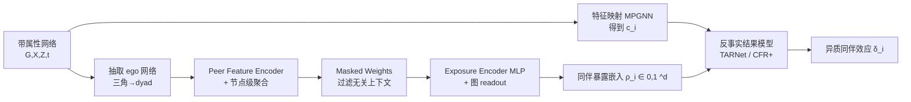

# Learning Exposure Mapping Functions for Inferring Heterogeneous Peer Effects

**会议**: ICLR 2026  
**OpenReview**: [https://openreview.net/forum?id=bXYp5AIMju](https://openreview.net/forum?id=bXYp5AIMju)  
**代码**: 待确认  
**领域**: 因果推断 / 网络干扰 / 图神经网络  
**关键词**: 同伴效应, 暴露映射函数, 网络干扰, 异质因果效应, 因果网络 motif, GNN  

## 一句话总结
本文提出 **EGONETGNN**，用图神经网络**自动学习**网络同伴效应中的"暴露映射函数"（exposure mapping function），无需人工指定"被多少治疗过的邻居影响"，从而在影响机制未知、依赖局部结构（三角、聚类系数、属性相似度）时仍能稳健估计异质同伴效应。

## 研究背景与动机
**领域现状**：在社交网络、接触网络等场景里，一个个体的结果会被邻居的处理（treatment）影响，这叫"干扰"（interference）。因果推断刻画"同伴效应"（peer effect）时，依赖一个**暴露映射函数** $\phi_e$，把"邻居的处理 + 网络结构"压缩成一个标量/低维"同伴暴露值"，再比较不同暴露值下的反事实结果之差。

**现有痛点**：这个映射函数几乎总是**人工指定**的——比如"是否有邻居被处理"（二值）、"被处理邻居的比例"、"线性阈值"、"按连边强度/属性相似度加权的比例"、"因果网络 motif 计数"等。但真实的影响机制几乎从不可知，**一旦函数指定错误（misspecification），因果效应估计就会有偏**。

**核心矛盾**：(1) 想自动学这个函数 → 现有工作直接套 GCN/GIN 这类标准消息传递 GNN（MPGNN），但理论已证明 MPGNN **数不出带环子图**（如闭三角 motif），无法表达依赖局部结构（聚类系数、连通分量、共同好友数）的影响机制；(2) 人工提取因果网络 motif 计数虽然信息丰富，但计算昂贵、不灵活、且漏掉边权等上下文。

**本文目标**：彻底摆脱"人工定义暴露映射函数"，**端到端自动学**一个既能数清复杂局部 motif、又对无关上下文不敏感、还能输出有界且分布均匀的同伴暴露表示的函数，用于**异质同伴效应（HPE）**估计。

**核心 idea**（**自动学暴露映射 + ego 网络变换提升表达力**）：把每个节点的"节点回归"问题转成"图回归"——抽取该节点的 **ego 网络**（只含邻居及邻居间的边），使原来涉及 ego 的三角结构在 ego 网络里退化成 dyad（边），从而绕开 MPGNN 数不出闭三角的瓶颈；再配 masked weights、coverage/entropy/sparsity 等损失，保证表达力、不变性与表示质量三者兼得。

## 方法详解

### 整体框架
EGONETGNN 在标准"特征映射 + 反事实结果模型"两件套之上，新增一个绿色高亮的**暴露映射函数学习模块**。流程为：先用一个 MPGNN 把带属性网络编码成特征嵌入 $c_i$（管混杂/效应修饰）；再为每个节点抽 ego 网络、注入邻居处理与边属性、做节点级聚合捕获局部结构；经 masked weight 层和 MLP 编码后做图级 readout，得到有界的同伴暴露嵌入 $\rho_i$；最后把 $(\pi_i, \rho_i, c_i)$ 喂给 TARNet/CFR+ 反事实结果模型估计同伴效应。

### 关键设计

**1. Ego 网络变换：把"数不出的三角"变成"数得出的边"，治本式提升表达力。** 这是全文表达力的根基。标准 MPGNN 之所以失效，是因为节点 $v_i$ 的同伴暴露常依赖邻居之间的局部结构（如被处理邻居构成几个闭三角），而 MPGNN 无法计数带环子图。EGONETGNN 为每个节点 $v_i$ 抽取 ego 网络 $\bar{G}_i(\bar{V}_i,\bar{E}_i)$，其中 $\bar{V}_i$ 只含 $v_i$ 的邻居、$\bar{E}_i$ 只含邻居之间的边。在这个子图里，原本"$v_i$–$v_j$–$v_k$"的闭三角因为 $v_i$ 被移走，退化成"$v_j$–$v_k$"的 dyad，于是普通节点聚合就能数清它。作者据此证明 **Proposition 2**：EGONETGNN 足以表达全部 dyad、open triad、closed triad、open tetrad 这四类因果网络 motif——而这正是标准 MPGNN 做不到的。由于 $v_i$ 本身不在 ego 网络里，它的边属性 $Z_{ij}$ 被转成邻居的节点属性 $\bar{X}_j = Z_{ij}$，保证边权信息不丢。

**2. 特征映射与 Peer Feature 编码：解耦自身属性、显式建模"自己与邻居的相似度"。** 特征映射用一个解耦式 MPGNN，把节点自身属性的隐表示 $\Theta_0(X_i)$ 和"聚合来的邻居+边属性" $h_i^l$ 分开拼接，$c_i = \Theta_0(X_i)\,\|\,h_i^l$，使 $c_i$ 能干净地充当混杂控制/效应修饰变量。Peer feature encoder 则显式编码 ego 与每个 peer 的特征**距离**：$c_{ij} = \Theta_{\text{feat}}(c_j\,\|\,(c_i-c_j)^2)$，让模型能捕获"属性相似度"类影响机制（如同性别邻居影响更大）。随后在 ego 网络上做节点聚合 $h_j^l = h_j^{l-1} + \sum_{k\in N_j} h_k^{l-1}$，初始 $h_k^0 = t_k\,\|\,\bar{X}_k\,\|\,c_{ik}\,\|\,Z_{jk}$ 把邻居处理、属性、特征编码、边属性全部纳入。

**3. Masked weights + log 变换编码：促不变性、塞进对"比例/尺度"的归纳偏置。** 为了让表示对**无关上下文不敏感**（不变性），聚合后的隐状态 $h_j^{\text{agg}} = \bar{X}_j\,\|\,c_{ij}\,\|\,h_j^L$ 先过一个掩码全连接层 $h_j^{\text{mask}} = \text{ReLU}\big((\sigma(W_{\text{mask}})\odot W_{\text{agg}})\,h_j^{\text{agg}} + b_{\text{agg}}\big)$，掩码 $\sigma(W_{\text{mask}})$ 学着把无关维度关掉。再经 exposure encoder $h_j^{\text{exp}} = \text{ReLU}(\Theta_{\text{exp}}(\ln(\text{ReLU}(\Theta_{\text{enc}}(h_j^{\text{mask}}))+1)))$，其中 $\ln$ 变换对 scale-free 网络的大值做重缩放，并引入"捕获比例（ratio）类机制"的归纳偏置。

**4. 双路有界 readout + 四个先验损失：保证暴露表示有界、覆盖充分、可端到端学。** 图 readout 用两路聚合得到 $\rho_i\in[0,1]^d$：一路是 $\sum_j (t_j h_j^{\text{exp}})/\sum_j h_j^{\text{exp}}$（类比"被处理邻居比例"，但权重由网络学），另一路是 $1-e^{-\sum_j (t_j h_j^{\text{exp}})}$（类比"被处理邻居数量"），二者天然落在 $[0,1]$，$0$ 表示无暴露。端到端损失把四类先验拧在一起：**balance loss**（CFR+ 的自编码重构 + Wasserstein IPM，平衡处理/控制组分布同时保表达力）、**coverage loss** $L_{\text{cov}}=(\text{mean}(\rho)-0.5)^2+(\text{var}(\rho)-\tfrac{1}{12})^2+(\text{range}(\rho)-1)^2$（逼近 $[0,1]$ 均匀分布、防"模式坍缩"）、**entropy loss** 把掩码逼向 0/1、**sparsity loss** 让少数掩码权重高。总损失 $L=\tfrac1n\sum_i L_{y_i}+L_{\text{bal}}+\lambda_{\text{cov}}L_{\text{cov}}+\lambda_{\text{ent}}L_{\text{ent}}+\lambda_{\text{sp}}L_{\text{sp}}+\lambda_{L1}\|\Theta_{\text{gnn}}\|_1$，末项 L1 进一步促稀疏/不变性。反事实结果模型用 TARNet（共享嵌入 + 双预测头）或自带自编码器的 CFR+（用重构损失缓解平衡表示时的表达力损失）。

## 实验关键数据

### 主实验表格
BlogCatalog 半合成数据，真实暴露机制分别依赖聚类系数、连通分量、共同好友、属性相似度时的 HPE 估计误差 $\epsilon_{PEHE}$（越低越好）：

| 机制 | Ours-TARNet | Ours-CFR+ | GNN-Motifs | INE-TARNet | 1GNN-HSIC | DWR | NetEst | CauGramer |
|---|---|---|---|---|---|---|---|---|
| 聚类系数 | 2.13±1.9 | **0.95±0.5** | 2.39±1.2 | 2.35±0.7 | 6.21±3.7 | 7.49±4.6 | 4.53±1.5 | 6.16±2.1 |
| 连通分量 | **1.47±0.9** | 1.50±0.7 | 4.98±1.6 | 4.78±1.1 | 6.78±1.9 | 7.68±1.6 | 8.56±0.7 | 7.07±1.2 |
| 共同好友 | 2.86±1.3 | **2.24±1.6** | 2.81±1.3 | 2.50±0.9 | 10.30±6.0 | 8.72±2.8 | 5.34±1.3 | 5.18±2.0 |
| 属性相似度 | 3.95±2.7 | 3.65±2.4 | 4.64±2.1 | **3.59±1.8** | 15.25±4.7 | 17.96±3.7 | 11.71±2.2 | 14.45±5.7 |

EGONETGNN 两个变体在四种机制中三种取得最佳，对依赖局部结构（连通分量、共同好友）的机制优势尤为明显；唯有属性相似度机制下 INE-TARNet 略优（因 homophily 使邻居属性近乎同质，简单基线占便宜）。

### 消融实验表格
三变体（完整 / 去 mask / 去 feature encoder+mask）的部分结果（去 feat&mask 行，$\epsilon_{PEHE}$）：

| 机制 | BC(共同好友) | BA(共同好友) | WS(共同好友) | BC(聚类系数) | BA(聚类系数) | WS(聚类系数) | BC(属性相似) | BA(属性相似) | WS(属性相似) |
|---|---|---|---|---|---|---|---|---|---|
| Ours(去feat&mask) | 2.07±1.3 | 0.27±0.2 | 0.31±0.1 | 2.11±0.8 | 0.97±0.7 | 1.91±1.3 | 3.18±1.9 | 13.73±2.8 | 13.85±4.0 |

结论：去掉 masked weights 会因对无关上下文敏感而引入偏差；去掉 feature encoder MLP 会削弱对属性相似度机制的捕获（属性相似列误差飙升）。但对纯局部结构机制，忽略无关特征反而更好——说明 **feature encoder 增表达力、masked weights 促不变性**，二者各司其职。

### 关键发现
- **RQ1（合成网络）**：当偏好连接参数 $m=1$（稀疏星形、无环）时所有方法都行；但随边密度增大、出现复杂拓扑，基线因表达力不足急剧退化，EGONETGNN 在稠密网络上优势显著。
- **RQ4（表示质量，Table 3）**：学到的暴露表示与真实暴露的绝对相关性，在聚类系数（0.81）、共同好友（0.73）等局部结构机制上远超"被处理好友比例"基线（0.17、0.09）。
- **RQ5（鲁棒性）**：即使在所有基线假设都正确（真机制就是处理邻居比例）的最简设定下，本文方法仍因能处理复杂效应修饰和翻转反事实而更优；在 10% 特征置零+高斯噪声、两跳邻居干扰等假设被破坏的设定下也保持竞争力。
- **模型选择**：用预测损失 + coverage loss 联合在 20% 验证集上选模型，比只用预测损失更稳健——coverage loss 防止暴露表示坍缩到"相关但非真实"的模式（类似防过拟合）。

## 亮点与洞察
- **把"暴露映射函数指定错误"这一因果推断长期痛点，转化为可端到端学习的表示学习问题**，且不是简单套 GNN，而是从理论上诊断了 MPGNN 的表达力缺陷并对症下药。
- **Ego 网络变换是一个优雅的"治本"技巧**：用图结构变换（三角→dyad）而非堆参数来获得 motif 计数能力，并给出 Proposition 2 的可证保证。
- **四个先验损失针对因果暴露表示的"专属病"**：coverage loss 防表示坍缩、masked/entropy/sparsity 促不变性、balance loss 控混杂——把因果约束直接编码进损失，而非只靠数据拟合。
- **诚实的失败分析**：明确指出属性相似度机制下因 homophily 简单基线反而占优、去特征反而更好等反直觉现象，没有粉饰。

## 局限与展望
- **理论仅覆盖表达力**：主结果是 GNN 数 motif 的表达力 + 反事实预测误差的 misspecification 分解，但复杂 GNN 下异质因果效应估计的渐近性质/严格界仍未建立。
- **假设较强**：依赖邻域干扰（仅一跳）、无混杂、需要可靠的带属性网络作输入；两跳干扰、噪声网络仅作鲁棒性测试而非理论保证。
- **计算开销**：ego 网络处理使其平均比标准 MPGNN 贵约 $\rho_E\times\text{avg}(d)$ 倍（边密度 × 平均度），稠密大图上的可扩展性待解。
- **效应类型单一**：目前只估同伴效应，未涵盖直接效应、总效应等其他网络效应。
- **评测全靠合成/半合成**：缺真实带 ground-truth 反事实的数据（这是因果推断的通病，但仍限制外部效度）。

## 相关工作与启发
- **暴露映射函数谱系**：从二值（至少一个邻居被处理）、线性阈值、处理邻居比例（Hudgens & Halloran 2008）、加权比例/求和（Forastiere 2021；Zhao 2024）到因果网络 motif 计数（Yuan 2021）——本文统一了这条人工设计的谱系并自动化。
- **GNN 因果估计**：建立在 TARNet/CFR（Shalit 2017）、NetEst（Jiang & Sun 2022）、TNet（Chen 2024）等之上；与近期自动学暴露映射的 AEMNet（Mao 2025）、CauGramer（Wu 2025）直接对比，指出它们用现成 GCN/GIN 表达力不足。
- **GNN 表达力理论**：直接引用 Chen et al. 2020 关于 GNN 数子图能力的结论，作为方法设计与理论证明的基石——这是"用表达力理论指导因果方法设计"的好范例。
- **启发**：当一个领域里"人工特征工程 + 易指定错误"是主要误差源时，与其换更复杂的人工特征，不如从表达力理论出发设计一个能涵盖并超越这些人工特征的可学习模块——本文把这条思路在网络因果推断上落地。

## 评分
- **新颖性**: ⭐⭐⭐⭐ 首次把"自动学暴露映射函数"与"GNN 表达力理论 + ego 网络变换"系统结合，并给出可证表达力保证，问题切入点新。
- **实验充分度**: ⭐⭐⭐⭐ 3 类合成网络 + 2 个半合成网络、5 种机制、9+ 基线、5 个 RQ 含消融/表示质量/鲁棒性/模型选择，覆盖全面；扣分在全为合成数据、缺真实场景验证。
- **写作质量**: ⭐⭐⭐⭐ 问题定义清晰、动机层层递进、理论与实验呼应；公式密集但符号统一，失败案例分析诚实。
- **价值**: ⭐⭐⭐⭐ 缓解网络因果推断中暴露函数指定错误这一实际痛点，对社交/医疗/教育等需估同伴效应的领域有直接意义。

<!-- RELATED:START -->

## 相关论文

- [\[ICLR 2026\] Debiased Front-Door Learners for Heterogeneous Effects](debiased_front-door_learners_for_heterogeneous_effects.md)
- [\[AAAI 2026\] Causal Inference Under Threshold Manipulation: Bayesian Mixture Modeling and Heterogeneous Treatment Effects](../../AAAI2026/causal_inference/causal_inference_under_threshold_manipulation_bayesian_mixtu.md)
- [\[ICLR 2026\] Topological Causal Effects](topological_causal_effects.md)
- [\[ICLR 2026\] Matching without Group Barrier for Heterogeneous Treatment Effect Estimation](matching_without_group_barrier_for_heterogeneous_treatment_effect_estimation.md)
- [\[ICLR 2026\] A Relative Error-Based Evaluation Framework of Heterogeneous Treatment Effect Estimators](a_relative_error-based_evaluation_framework_of_heterogeneous_treatment_effect_es.md)

<!-- RELATED:END -->
