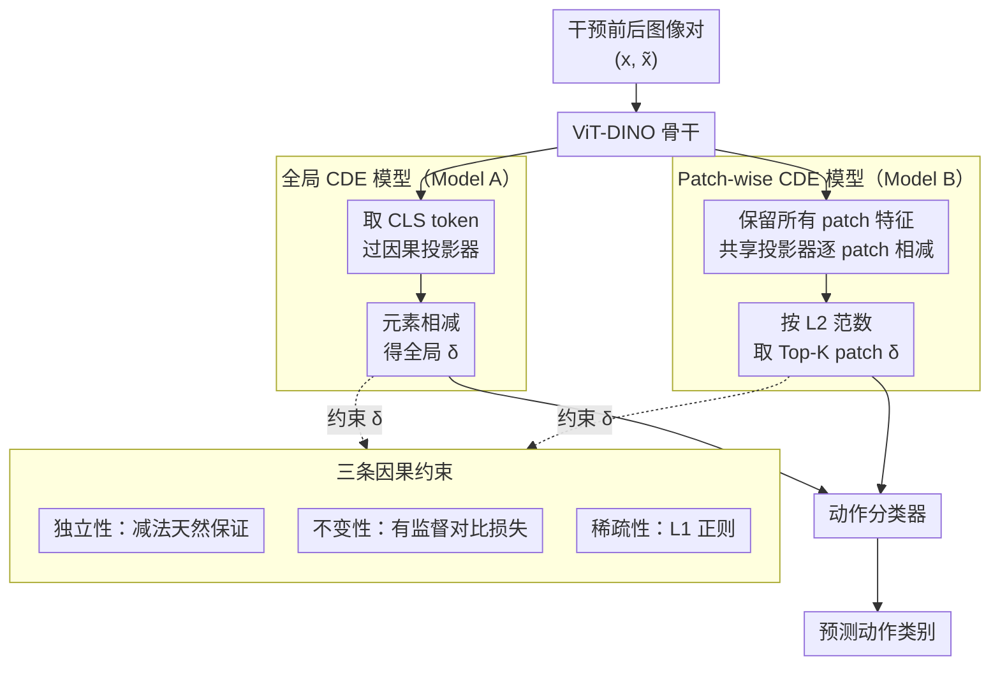

# Learning Robust Intervention Representations with Delta Embeddings

**会议**: ICLR 2026  
**arXiv**: [2508.04492](https://arxiv.org/abs/2508.04492)  
**代码**: [Project Page](https://palimisis.github.io/Learning-Robust-Intervention-Representations-with-Delta-Embeddings/)  
**领域**: 因果表示学习 / OOD 泛化  
**关键词**: Causal Representation Learning, Delta Embeddings, out-of-distribution, Intervention, Contrastive Learning

## 一句话总结

提出因果 Delta 嵌入（CDE）框架，将干预/动作表示为预干预和后干预状态在潜空间中的向量差，通过独立性、稀疏性和不变性三种约束学习鲁棒的干预表示，在 Causal Triplet 挑战中显著超越基线的 OOD 泛化性能，且能自动发现反义动作的反平行语义结构。

## 研究背景与动机

**理解世界如何响应动作和干预是 AI 的核心能力**：特别是在动态环境中操作的智能体，必须恢复生成和转换数据的底层机制，才能实现因果推理和鲁棒泛化。

**深度学习模型在分布偏移下泛化失败**：标准模型依赖相关性而非因果机制，当数据分布改变时（如遇到训练中未见的物体-动作组合），性能急剧下降。

**因果表示学习关注变量识别，但忽视了干预表示**：大多数 CRL 工作专注于识别潜在因果变量及其关系（如 VAE 框架、score-based 方法），但很少有方法关注学习动作/干预本身的可泛化表示。

**两个关键的 CRL 假设为方法设计提供指导**：
   - **独立因果机制（ICM）假设**：数据生成过程由自主且独立的模块组成
   - **稀疏机制偏移（SMS）假设**：一次干预通常只影响少量因果机制

**OOD 泛化的两种挑战类型**：
   - **组合偏移**：测试中出现训练未见的物体-动作组合（如训练见过 open(door) 和 close(drawer)，测试需识别 open(drawer)）
   - **系统偏移**：测试中出现全新的物体类别

## 方法详解

### 整体框架

CDE 想解决的问题是：让模型学到的"动作/干预"表示能跨物体、跨场景泛化，在测试遇到训练里没见过的物体-动作组合时仍然认得出动作。它的核心想法是把"动作"建模成潜空间里的一根方向向量：给定干预前后的观测对 $(x, \tilde{x})$，先用编码器 $\phi$（ViT-DINO 骨干 + 因果投影器）把两张图各自映射到潜空间，再做元素相减得到 Delta 嵌入 $\delta_a := \phi(\tilde{x}) - \phi(x)$。在理想的完美反事实假设下，这根差向量应满足 $\delta_a = [0 \cdots \tilde{z}_a - z_a \cdots 0]^T$——只有被动作 $a$ 真正改变的那几个维度非零、其余共享背景在相减时被抵消。

围绕这根 Delta 向量，方法分三块落地：先用三条因果约束（独立性、稀疏性、不变性）规定它"该长什么样"；再给出两种把图像变成 Delta 的网络结构——动作影响全局时用全局 CDE 模型（Model A，取 CLS token），动作只改局部时用 Patch-wise CDE 模型（Model B，逐 patch 算 Delta 再取 Top-K）；最后两条支路得到的 Delta 都送进同一个动作分类器预测动作类别，三条约束则通过三项损失在训练时塑造 Delta。

### 关键设计

**1. 三条因果约束：独立性、稀疏性、不变性**

CDE 没有凭空设计目标，而是把 CRL 的两个经典假设翻译成 Delta 向量必须满足的三条性质。**独立性**要求动作表示不受场景属性和未被影响物体的干扰——这一点恰好由减法天然保证，因为预/后干预共享的背景在相减时被抵消掉。**稀疏性**来自稀疏机制偏移（SMS）假设：一次干预只动少量机制，所以 $\delta_a$ 应该大部分维度为零。**不变性**则要求同一动作作用在不同物体上得到相似的表示——"打开"无论对象是门还是抽屉都该是同一根向量，形式化为 $\text{Var}_{x \sim P(X)}[\delta_a(x)] \approx \mathbf{0}$。三条性质各自对应后面一种实现手段，构成从假设到损失的清晰链条。

**2. 全局 CDE 模型（Model A）：用 CLS token 抓整图级别的动作**

针对单物体、动作影响全局的场景，Model A 走一条极简路径：ViT-DINO 提取每张图的 CLS token，经因果投影器映射到 $l$ 维潜空间后做元素减法得到 Delta，再交给分类器预测动作类别。背后的结构方程是 $\tilde{z}_a = z_a + \delta_a + \epsilon$，其中 $\epsilon$ 是零均值独立噪声，对应那些"动作之外还有随机扰动"的 actionable counterfactual 场景。这种设计之所以成立，是因为 CLS token 给出全局图像表示，而减法操作把两图共享的场景信息消去，让分类器只看到动作本身带来的变化。

**3. Patch-wise CDE 模型（Model B）：用 Top-K patch 锁定局部变化**

当画面里有多个物体、动作只改动局部区域时，全局嵌入容易把这点局部信号"平均"掉。Model B 因此保留 ViT 所有 patch 的输出，逐 patch 计算 Delta，再按 L2 范数挑出变化最大的 Top-K 个 patch，对每个被选中的 patch 独立计算损失。这样模型的注意力被聚焦到真正发生改变的区域，避免被大片未变背景稀释，从而在复杂多物体场景里保住对动作的敏感度。

### 损失函数 / 训练策略

三条约束最终落成三项损失的加权和：$\mathcal{L}_{\text{total}} = \mathcal{L}_{\text{CE}} + \alpha_{\text{contrast}} \mathcal{L}_{\text{contrast}} + \alpha_{\text{sparsity}} \mathcal{L}_{\text{sparsity}}$。交叉熵 $\mathcal{L}_{\text{CE}}$ 保证 Delta 对动作分类有判别力；有监督对比损失 $\mathcal{L}_{\text{contrast}}$ 把同类动作的 Delta 拉近、不同动作的推远，正是不变性约束的落地，其形式为

$$\mathcal{L}_{\text{contrast}} = \sum_{i=1}^{B} \frac{-1}{|P(i)|} \sum_{p \in P(i)} \log \frac{\exp(\text{sim}(\delta_i, \delta_p)/\tau)}{\sum_{j \neq i} \exp(\text{sim}(\delta_i, \delta_j)/\tau)}$$

而稀疏正则 $\mathcal{L}_{\text{sparsity}} = \frac{1}{B}\sum_i \|\delta_i\|_1$ 用 L1 惩罚兑现 SMS 假设、压低非因果维度。三个权重在所有实验中统一取 $\alpha_{\text{contrast}} = 2.0$、$\alpha_{\text{sparsity}} = 1.0$，并端到端训练，编码器一并更新而非冻结。

## 实验关键数据

### 主实验

单物体 ProcTHOR 场景（合成数据）：

| 方法 | IID Acc. | OOD Comp. | OOD Syst. | Gap↓ |
|------|----------|-----------|-----------|------|
| Vanilla-R (ResNet) | 0.96 | 0.36 | 0.48 | 0.48 |
| Vanilla-V (ViT-DINO) | 0.95 | 0.34 | 0.47 | 0.48 |
| ICM-R | 0.95 | 0.41 | 0.50 | 0.45 |
| SMS-R | 0.96 | 0.47 | 0.54 | 0.42 |
| **CDE Global** | **0.95** | — | — | **0.21** |

全局 CDE 在单物体场景把泛化 gap 从 0.56 压到 0.21，同时几乎不损失 IID 精度；多物体和真实世界（Epic-Kitchens）场景下 Patch-wise 模型超越所有基线，甚至包括用了真值分割掩码的 oracle 方法。

> ⚠️ 上表基线的 Gap 数值口径与原文正文（baseline gap 0.56）略有出入，CDE 的 gap 缩减幅度以原文为准。

### 消融实验

| 配置 | 效果 |
|------|------|
| 全部三个损失 | 最佳 OOD 准确率约 75.0% |
| 去掉对比损失 | 不变性丢失，OOD 下降约 7 个点 |
| 去掉稀疏正则 | 表示不够紧凑，OOD 下降约 2 个点 |
| 只用交叉熵 | 退化为普通分类器，比完整模型低约 8 个点 |
| Global vs Patch-wise | Patch-wise 在多物体场景更优 |

### 关键发现

1. **CDE 在 Causal Triplet 挑战中建立了新的 SOTA**：在合成和真实世界基准上均大幅超越基线
2. **自动发现反义动作的反平行关系**：open vs close 的 Delta 嵌入在潜空间中呈反平行方向，完全无需显式监督
3. **独立性由 Delta 计算自然满足**：不需要专门的损失来约束，减法操作天然消除了场景级变化
4. **对 actionable counterfactual 场景依然有效**：即使噪声 $\epsilon \neq 0$，分类器仍不受影响（理论证明 + 实验验证）
5. **稀疏正则至关重要**：L1 惩罚确保了只有因果相关的维度被激活

## 亮点与洞察

1. **将"学习干预表示"与"学习变量表示"分离**：大多数 CRL 工作关注恢复因果变量，CDE 另辟蹊径关注干预/动作本身的表示，视角独特且实用
2. **Delta = 减法 的极简设计**：不需要复杂的因果发现或结构学习，仅靠编码器输出的减法就能提取因果信息，优雅且有效
3. **三个约束对应三个损失**：独立性（由架构设计保证）→ 稀疏性（L1正则）→ 不变性（对比损失），设计意图清晰
4. **反平行语义结构的自发涌现**：模型自动学到 "open ↔ close" 方向互逆，是因果结构学习的有力证据

## 局限与展望

1. **需要干预前后的图像对**：许多现实场景中只有动作后的观测，无法获得配对数据
2. **动作类别数量有限**：Causal Triplet 基准中动作种类较少（约 10+），对大规模动作空间的可扩展性未验证
3. **静态图像对限制**：不能处理时序动作或持续变化，缺少对视频数据的扩展
4. **ViT-DINO 骨干的依赖**：预训练视觉特征提供了强大的先验，如果骨干更换（如随机初始化），效果可能显著下降
5. **真实世界场景中的遮挡和视角变化**：Epic-Kitchens 中相机运动和遮挡可能引入非因果变化

## 相关工作与启发

- **Causal Triplet (Liu et al., 2023)**：提供了评估框架和 SCM 模型定义，CDE 在此基准上超越了所有先前方法
- **Von Kügelgen et al. (2021)**：从理论证明数据增强对应因果干预时对比学习可以分离因果因素，CDE 将此思想扩展到干预对的对比学习
- **DINO (Caron et al., 2021)**：自监督 ViT 特征为 CDE 提供了强大的视觉先验
- **SMS 正则化 (Lachapelle et al., 2022)**：稀疏机制偏移假设在 CDE 中通过 L1 正则化具体实现
- 启发：Delta Embedding 的思想可能适用于更广泛的场景，如强化学习中的动作效果预测、医学影像中的治疗效果表示

## 评分

- **新颖性**: ⭐⭐⭐⭐ — Delta = 减法的核心思想简洁有力，将 CRL 的焦点从变量识别转向干预表示是新颖的视角；但减法操作本身并不复杂
- **实验充分度**: ⭐⭐⭐⭐ — Causal Triplet 三个难度递增的评估场景覆盖全面，消融实验完整；但缺少更大规模的评估
- **写作质量**: ⭐⭐⭐⭐⭐ — 数学定义严谨，从属性→损失→架构的推导逻辑清晰，可视化（反平行语义结构）非常直观
- **价值**: ⭐⭐⭐⭐ — 为因果表示学习提供了新的研究方向（干预表示），在机器人和 embodied AI 领域有潜在应用价值

<!-- RELATED:START -->

## 相关论文

- [\[ICLR 2026\] Counterfactual Explanations on Robust Perceptual Geodesics](counterfactual_explanations_on_robust_perceptual_geodesics.md)
- [\[ICLR 2026\] Direct Doubly Robust Estimation of Conditional Quantile Contrasts](direct_doubly_robust_estimation_of_conditional_quantile_contrasts.md)
- [\[ACL 2026\] Learning Invariant Modality Representation for Robust Multimodal Learning from a Causal Inference Perspective](../../ACL2026/causal_inference/learning_invariant_modality_representation_for_robust_multimodal_learning_from_a.md)
- [\[ICML 2026\] Toward Scalable and Valid Conditional Independence Testing with Spectral Representations](../../ICML2026/causal_inference/toward_scalable_and_valid_conditional_independence_testing_with_spectral_represe.md)
- [\[NeurIPS 2025\] A Principle of Targeted Intervention for Multi-Agent Reinforcement Learning](../../NeurIPS2025/causal_inference/a_principle_of_targeted_intervention_for_multi-agent_reinforcement_learning.md)

<!-- RELATED:END -->
