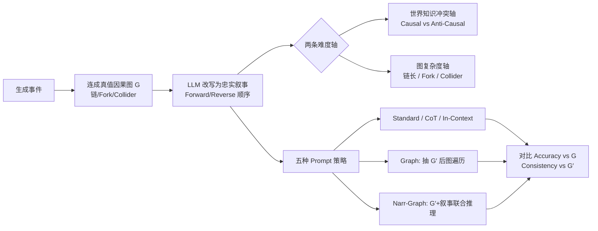

# LLMs Struggle to Balance Reasoning and World Knowledge in Causal Narrative Understanding

**会议**: ICLR 2026  
**OpenReview**: [https://openreview.net/forum?id=GfVKK5sKit](https://openreview.net/forum?id=GfVKK5sKit)  
**代码**: 论文随附（narratives 与 prompt 模板见附录与 linked code）  
**领域**: 因果推理 / LLM 评测  
**关键词**: 因果推理, 叙事理解, 世界知识冲突, 捷径学习, 图抽取  

## 一句话总结
通过在「世界知识冲突」和「图推理复杂度」两个轴上可控生成因果叙事，作者发现 SOTA LLM 在因果叙事理解中依赖两条捷径（事件出场顺序 = 因果顺序、套用参数化常识），而 CoT/ICL 都救不了，唯有「先让模型抽出整张因果图、再用图遍历回答」能绕开捷径。

## 研究背景与动机
**领域现状**：LLM 在因果任务上的成功，多数靠从预训练里吸收的世界知识做关联召回，而非真正对上下文里的因果结构做推理。已有 benchmark 要么是纯逻辑/数学推理（几乎不需要世界知识），要么是常识因果（直接检索记忆就能答对），两类能力被分开研究。

**现有痛点**：因果推理恰恰需要二者结合——既要像应用 do-calculus 一样做演绎，又要用领域知识把变量实例化成图。但「知识检索」与「上下文推理」之间的相互作用与冲突，几乎没人系统研究过。现有工作还普遍停留在单句、单条因果关系的短问题（如 Jin et al. 2023 还混入了概率计算，把因果失败和算术失败搅在一起）。

**核心矛盾**：当叙事里的因果关系与模型记忆中的常识相悖时（非典型、反直觉场景），模型该听叙事还是听记忆？这正是衡量「真因果推理能力」的关键，却被现有数据集回避了。

**本文目标**：构造能在「世界知识冲突」与「图推理复杂度」两个维度上独立调难度的因果叙事任务，刻画 LLM 在整个难度谱上的表现，找出系统性失败模式。

**核心 idea**：**[评测框架]** 从真值因果图 $G$ 生成与之一致的叙事，只把叙事喂给模型，要求它（1）判断 $V_i$ 是否（直接或间接）导致 $V_j$；（2）重建一张忠于叙事的因果图 $G'$。再沿两条轴系统操纵难度，把性能差距归因到具体捷径。

## 方法详解

### 整体框架
方法不是提出新模型，而是一套「可控因果叙事生成 + 多 prompt 对照评测」的诊断流水线。先用 LLM 生成真实世界事件并连成真值图 $G$（链/含 fork/含 collider），让 LLM 把 $G$ 改写成忠实叙事（98% 的叙事能被盲标注研究生唯一还原出因果序，保证质量）；然后沿两条难度轴生成变体，用五种 prompt 策略测同一批因果问句，比较模型答案与真值 $G$ 的一致性（accuracy）以及与模型自抽图 $G'$ 的一致性（consistency）。

### 关键设计

**1. 双轴可控难度生成：把「知识」和「推理」拆开调**——要诊断知识与推理的冲突，就必须能单独拨动两者的难度。沿**世界知识冲突轴**，作者在生成事件链时显式让相邻事件要么 Causal（如「疾病→寿命变短」，合常识）要么 Anti-Causal（如「压力大的工作→更幸福」，反常识），再据此搭真值图 $G$，于是叙事里的因果可与模型参数化知识一致或冲突。沿**图复杂度轴**，把节点数从 4 拉到 20，并把结构从简单链扩展到含 Fork（一因多果）和 Collider（多因一果）的复杂图。两轴正交，使得「答错」可以被精确归因到「叙事顺序误导」还是「常识误导」还是「结构太复杂」，而不是混成一团。

**2. 事件出场顺序探针（Forward vs Reverse）：抓「顺序即因果」捷径**——同一张真值链图，可按拓扑序（因在前果在后，Forward）或逆拓扑序（果在前因在后，Reverse）改写成叙事。若模型真在推理因果，两种叙事应给出同样的因果判断；若模型只是把「先出现的事件」当成因，那 Reverse 叙事就会让它系统性翻车。实验正是如此：Reverse 下 Standard/CoT/In-Context 准确率随链长显著下滑，证明模型重度依赖「叙事出场顺序 = 因果顺序」这个先验。

**3. 参数化知识冲突探针：抓「套常识」捷径**——构造形如 $1\to 3\to 2$ 的真值图，其中由参数化知识可知 $1$ 与 $2$ 本是 Anti-Causal；据图生成 Forward 叙事后问「$1$ 是否导致 $2$」，正确答案是「是」（叙事里存在间接因果链），但常识捷径会答「否」。结果显示模型几乎只在因果关系与其参数化知识一致时才答对，冲突时即便加 CoT 也大幅掉点——模型把记忆当捷径，无视叙事具体内容。

**4. 显式因果图抽取（Graph）vs 联合推理（Narr-Graph）：定位捷径触发点**——关键诊断设计是让模型先对全叙事抽出整张因果图 $G'$，之后**不再把叙事喂回**，纯用图遍历回答问句。这一招在 Reverse 和 Anti-Causal 下都把准确率拉回到接近 Forward/Causal 的水平（Reverse 提升约 50%），因为抽整图迫使模型对全叙事做长程推理而非走捷径。但若改成 Narr-Graph——把 $G'$ 连同叙事一起喂回让模型联合推理——增益完全消失，说明只要叙事重新在场，模型就立刻退回捷径。这个对照精确地把失败定位在「读叙事答单题」这一步，而非「理解叙事」本身。

## 实验关键数据

模型：GPT-4o（正文主角）、Claude 3.5 Sonnet、LLaMA 3.1 8B；数据：约 2500 条合成叙事 + CauseNet 真实因果图衍生的半合成/真实叙事；5 个随机种子聚合，报 95% CI。

### 主实验（定性趋势，源自 Fig.1/2/4）

| 条件 | Standard / CoT / In-Context | Graph（抽 $G'$ 后遍历） |
|---|---|---|
| Forward 链 | 高准确率 | 高 |
| Reverse 链 | 随链长显著下滑 | 与 Forward 相当（约 +50%） |
| Causal（合常识） | 高 | 高 |
| Anti-Causal（反常识） | 大幅掉点，CoT 无效 | 接近 Causal 水平 |
| 复杂图（Fork/Collider） | 略低于简单链 | 退化很小 |

### 参数化知识冲突（真实 CauseNet，Table 1 描述）

| 是否冲突 | Standard / CoT | Graph |
|---|---|---|
| 无冲突（叙事与常识一致） | >90% | 很高 |
| 有冲突（叙事与常识相悖） | 显著更低，CoT 也救不回 | 很高（与无冲突相当） |

> CauseNet 中约 5% 的关系违背模型预训练知识；作者各采样 100 条冲突/一致叙事（链长 3–9，Forward 排布以避免混淆失败模式）。

### 关键发现
- **两条捷径**：①「叙事出场顺序 = 因果方向」；②「套用参数化常识」。CoT 与 In-Context 都无法缓解。
- **答案与自抽图不自洽**：模型直接答题的结果，常与它自己抽出的 $G'$ 矛盾（consistency 低），说明它「会画图但不照图答」。
- **图抽取是解药也是照妖镜**：纯用 $G'$ 遍历能绕开两条捷径；一旦把叙事喂回（Narr-Graph）增益即消失。
- **复杂结构没想象中难**：Fork/Collider 带来的退化远小于顺序/常识两类失败，与 Dettki et al. 2025（GPT-4o 单 collider 接近人类）一致，本文扩展到多 fork/collider 的长叙事。
- **长度放大捷径**：叙事越长，模型越爱走捷径；但 $G'$ 遍历能跨长度保持稳定。

## 亮点与洞察
- **正交双轴诊断法**很漂亮：把「世界知识」与「图推理」解耦成两条可独立调的旋钮，使失败模式可被精确归因，而非笼统说「LLM 因果差」。
- **Forward/Reverse 与 Causal/Anti-Causal 两个探针设计简洁有力**，直接把「顺序先验」「常识捷径」两个隐性 bias 钉死。
- **「会画图但不照图答」的自洽性裂缝**是很有启发的观察：它说明 LLM 的能力是存在的，只是没被正确地组合调用——指向「先隔离、再组合」的方法论方向。
- 真实数据（CauseNet）与合成数据结论一致，增强了说服力，避免「合成任务太人工」的质疑。

## 局限与展望
- **只诊断不修复**：论文给出了「先抽图再遍历可绕开捷径」的现象，但 Narr-Graph 增益消失说明尚无稳健可落地的修法，如何让模型在读叙事时自动隔离推理与知识仍开放。
- **任务以链为主**：复杂结构实验相对轻量，更复杂图（深层嵌套 fork/collider、含混杂因子的真实推断）下的失败模式尚未充分刻画。
- **模型覆盖有限**：正文聚焦 GPT-4o，强推理模型（o1 类）是否仍有同样捷径未系统验证。
- **因果判定粒度**：评测以「有向边是否存在/方向是否正确」为主，未触及干预、反事实等更强的 do-calculus 查询。
- 展望：作者明确主张未来方法应「隔离 LLM 的推理与知识强项再组合」，以规避二者冲突——图抽取是这一思路的早期证据。

## 相关工作与启发
- **因果 + LLM benchmark**：Jin et al. (2023) 给定因果图测推理但混入概率计算；Joshi et al. (2024b) 研究公式化（非叙事）文本的失败。本文首次在贴近日常语言的真实/合成叙事上、且专门测「反常识」因果，做非常识因果推理分析。
- **常识因果**：Gordon et al. 2012、Ho et al. 2023 等可直接靠记忆答对，本文反其道构造冲突样本以剥离真推理能力。
- **因果故事生成**：Ammanabrolu et al. 2020、Li et al. 2022 用常识桥接情节；本文相反——叙事里显式写明因果语言、且故意违背常识，逼模型只读叙事。
- **启发**：对做 RAG / 工具增强因果系统的人，本文提示「让模型显式产出结构（图）并用确定性遍历回答」可能比让它端到端读长文更稳；对评测设计者，「正交双轴 + 顺序/常识探针」是一套可复用的诊断范式。

## 评分
- **新颖性**: ⭐⭐⭐⭐ — 正交双轴可控生成 + Forward/Reverse、Causal/Anti-Causal 双探针，首次系统刻画叙事因果中「推理 vs 知识」的冲突与捷径，视角新颖。
- **实验充分度**: ⭐⭐⭐⭐ — 合成/半合成/真实（CauseNet）三档，多模型、多 prompt、多链长、5 种子带 CI，覆盖较全；但强推理模型与更复杂图覆盖偏少。
- **写作质量**: ⭐⭐⭐⭐ — 动机清晰、失败模式归因干净、图例（Fig.1–4）与文字对应良好。
- **价值**: ⭐⭐⭐⭐ — 揭示的两条捷径与「会画图不照图答」现象对因果 LLM 应用与评测有直接指导意义，并给出「隔离-组合」方法论方向。

<!-- RELATED:START -->

## 相关论文

- [\[ICLR 2026\] On the Eligibility of LLMs for Counterfactual Reasoning: A Decompositional Study](on_the_eligibility_of_llms_for_counterfactual_reasoning_a_decompositional_study.md)
- [\[ECCV 2024\] Understanding Physical Dynamics with Counterfactual World Modeling](../../ECCV2024/causal_inference/understanding_physical_dynamics_with_counterfactual_world_modeling.md)
- [\[ICLR 2026\] Query-Specific Causal Graph Pruning under Tiered Knowledge](query-specific_causal_graph_pruning_under_tiered_knowledge.md)
- [\[ICLR 2026\] SelfReflect: Can LLMs Communicate Their Internal Answer Distribution?](selfreflect_can_llms_communicate_their_internal_answer_distribution.md)
- [\[ICLR 2026\] Ice Cream Doesn't Cause Drowning: Benchmarking LLMs Against Statistical Pitfalls in Causal Inference](ice_cream_doesnt_cause_drowning_benchmarking_llms_against_statistical_pitfalls_i.md)

<!-- RELATED:END -->
