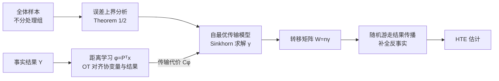

# Matching without Group Barrier for Heterogeneous Treatment Effect Estimation

**会议**: ICLR 2026  
**OpenReview**: [https://openreview.net/forum?id=lGaZimFbss](https://openreview.net/forum?id=lGaZimFbss)  
**代码**: 未公开  
**领域**: 因果推断 / 异质处理效应估计 / 最优传输  
**关键词**: matching, heterogeneous treatment effect, optimal transport, counterfactual prediction, distance learning  

## 一句话总结
MOGA 打破匹配方法"只能在目标处理组里找邻居"的组别壁垒，把全体样本都纳入候选池，用一个自最优传输（self optimal transport）模型学匹配权重、用随机游走在流形上传播事实结果来预测反事实结果，从而在样本稀疏、组间分布偏移大的情况下也能找到足够近的邻居，显著提升异质处理效应估计精度。

## 研究背景与动机
- **领域现状**：从观测数据估计异质处理效应（HTE）的核心难题是只能观测到所受处理下的事实结果，其余处理下的反事实结果永远不可见。匹配（matching）因简单、可解释而被广泛使用——经典做法是在"接受目标处理 $t$ 的那一组"里给样本找最近邻，再聚合这些邻居的事实结果来预测反事实结果，其理论基石是"协变量距离近的样本潜在结果也相近"。
- **现有痛点**：观测数据有限、加上混杂偏差导致组间分布存在差异，目标处理组里在某些区域样本稀少甚至缺失，根本找不到足够近的邻居。匹配到的样本往往距离很大，而数据通常落在一个内蕴流形上、欧氏距离只在局部有意义，大距离无法刻画真实的潜在结果关系，反事实预测随之失真。一句话——**匹配只在样本足够近时才靠谱**。
- **核心矛盾**：为了无偏只在同一处理组内匹配（保证可比），却又因为同组样本不够近而失真；想找近邻就得跨组，但跨组样本的目标处理潜在结果是未知的。
- **本文目标**：在保证识别性的前提下，让匹配能从**全体样本**（不论其实际所受处理）里挑邻居，使匹配距离尽量小，同时解决"跨组邻居的目标处理结果未知"这一新难题。
- **核心 idea**：**移除组别壁垒（Matching withOut Group bArrier, MOGA）**——先理论分析匹配的结果估计误差并给出依赖样本距离的上界，发现该上界恰好能用最优传输框架解释，于是把匹配建模成一个**自最优传输模型**；再用传输计划构造转移概率矩阵、以**随机游走做结果传播**补全跨组邻居的未知结果；最后用事实结果**学一个距离**作为传输代价，让"协变量上近"与"结果上近"保持一致。

## 方法详解

### 整体框架
MOGA 由三块串联：(1) 把"无壁垒匹配"的误差上界转写成一个自最优传输问题，解出全样本之间的匹配度矩阵 $W$；(2) 用 $W$ 构造转移概率、在流形上做随机游走的结果传播，迭代补全所有样本在所有处理下的潜在结果；(3) 用事实结果监督地学一个投影距离 $\phi(\cdot)$ 作为传输代价，把"结果相似"注入到"协变量距离"里。三者通过交替优化耦合，最终得到既近又语义一致的匹配。

### 关键设计

**1. 误差上界驱动的自最优传输匹配：把"找近邻"变成可解的传输问题。** 反事实结果用全样本加权 $\hat Y_t(x_i)=\sum_{j=1}^{n}W_{ij}Y_t(x_j)$（要求 $\sum_j W_{ij}=1$、$W_{ii}=0$，即不能用自己预测自己）来估计。作者证明（Theorem 1）潜在结果估计误差 $\epsilon_{Y_t}$ 有上界 $\epsilon_{Y_t}\le 2L_t^2\sum_{i,j}W_{ij}\|\phi(x_i)-\phi(x_j)\|_2^2 + 2n\eta^2\sum_{i,j}W_{ij}^2$，第一项是"匹配距离越大误差越大"，第二项是权重的 Frobenius 范数（防止权重过于集中）。经典匹配把候选限制在目标组，搜索空间被压缩、邻居更远、上界更松；MOGA 从全样本选邻居自然收紧上界。把第一项看成传输总代价、第二项看成传输矩阵的 F-范数正则，并令耦合 $\gamma_{ij}=\frac1n W_{ij}$、各样本均匀质量 $p_i=\frac1n$，就得到自最优传输问题 $\min_\gamma \langle C^\phi,\gamma\rangle+\lambda_f\Omega(\gamma)$，约束 $\gamma\in\Gamma(\mu,\mu),\ \gamma_{ii}=0$。Theorem 2 进一步证明效应估计误差（mPEHE）也被该结果误差上界控制。为可解，用大常数 $L$ 改写对角代价 $\tilde C^\phi=C^\phi+L I_n$ 隐式逼出 $\gamma_{ii}\to0$，再加熵正则 $-\lambda_h H(\gamma)$ 用 Sinkhorn 高效求解。均匀质量这一设计还有额外好处：避免大子群压制小子群，保证小组样本也在匹配中保留影响力。

**2. 基于传输计划的随机游走结果传播：补全跨组邻居的未知结果。** 拆掉组别壁垒后冒出新问题——匹配到的非目标组样本在目标处理 $t$ 下的潜在结果根本没观测到。由于 $\gamma\in\Gamma(\mu,\mu)$ 是双随机矩阵（$\sum_j\gamma_{ij}=\frac1n$），令 $W=n\gamma$ 即得转移概率矩阵，$W_{ij}$ 表示样本 $i$ 走到 $j$ 的概率。把所有事实结果填入 $Y\in\mathbb R^{n\times(T+1)}$（$Y_{it}=y_i$ 当 $t_i=t$，否则 0），掩码 $M$ 标记哪些是已观测的事实项，用亲和矩阵 $S=\rho W+(1-\rho)I$（$\rho$ 平衡"沿邻居扩散"与"保留自身记忆"）迭代 $\hat Y_{\kappa+1}=S\hat Y_\kappa\odot(1-M)+Y\odot M$。扩散项 $S\hat Y_\kappa\odot(1-M)$ 沿流形把结果信息逐步传播到未知项、模拟测地线聚合，而事实项 $Y\odot M$ 始终钉住不变。这样既利用了数据的流形结构，又让信息最终覆盖到所有样本在所有处理下的潜在结果。

**3. 用事实结果监督的距离学习：让"协变量近"等价于"结果近"。** 传输代价 $c^\phi(x_i,x_j)=\|\phi(x_i)-\phi(x_j)\|_2^2$ 的好坏完全取决于 $\phi(\cdot)$。原始欧氏距离 $\phi(x)=x$ 完全没考虑结果信息，可能把"协变量近但结果差很多"的样本错配。作者反过来用事实结果定义代价 $C^Y_{t,ij}=(y^t_i-y^t_j)^2$，在每个处理组内先解出一个"以结果为代价"的传输计划 $\tilde\gamma_t$，再让协变量代价去逼近它：$\min_\phi\sum_t\langle C^\phi_t,\tilde\gamma_t\rangle$——结果相似（$\tilde\gamma_{t,ij}$ 大）的对就被压低协变量代价。进一步把两者写进统一的自最优传输 $\min_{\{\gamma_t\},\phi}\sum_t\langle C^\phi_t,\gamma_t\rangle+\lambda_y\langle C^Y_t,\gamma_t\rangle-\lambda_h H(\gamma_t)$，交替优化：固定 $\phi$ 时每组是带代价 $C^\phi_t+\lambda_y C^Y_t$ 的标准 Sinkhorn 子问题；固定 $\gamma_t$ 时把 $\phi$ 实现为正交投影 $\phi(x)=P^\top x$（约束 $P^\top P=I$），子问题 $\min_P\sum_t\langle C^P_t,\gamma_t\rangle$ 有闭式解（Proposition 3）——即矩阵 $\sum_t\Theta_t$（$\Theta_t=2X_t^\top\mathrm{diag}(\gamma_t\mathbf1-\gamma_t)X_t$）的 $d'$ 个最小特征值对应的特征向量。在监督子空间里算距离还顺带缓解了高维数据的麻烦。

## 实验关键数据

### 主实验表格
半合成数据（指标越低越好，MOGA 为本文方法，列出代表性基线）：

| 方法 | News-2 $\sqrt{\epsilon_{PEHE}}$ | News-4 $\sqrt{\hat\epsilon_{mPEHE}}$ | News-8 $\sqrt{\hat\epsilon_{mPEHE}}$ | TCGA $\sqrt{\hat\epsilon_{mPEHE}}$ |
|---|---|---|---|---|
| k-NN | 9.418 | 10.081 | 11.469 | 11.410 |
| PSM | 14.957 | 15.371 | 17.175 | 16.055 |
| CFR | 9.291 | 9.746 | 14.517 | 13.358 |
| GOM | 6.451 | 7.739 | 12.857 | 10.545 |
| MitNet | 7.382 | 8.003 | 9.282 | 10.715 |
| **MOGA** | **5.081** | **5.960** | **8.904** | 10.597 |

- News-2/4/8 上 MOGA 全面最优；ATE 指标尤为突出（如 News-2 的 $\epsilon_{ATE}$ 0.449 vs 次优 1.507）。TCGA 上 $\sqrt{\hat\epsilon_{mPEHE}}$ 略逊 GOM（10.597 vs 10.545）但仍居前列。

### 消融实验表格
模拟数据上逐步拉大组间均值差 $m$（混杂偏差强度递增，$\sqrt{\hat\epsilon_{mPEHE}}$）：

| 方法 | m=[.1,.2,.3,.4,.5] | m=[.1,.3,.5,.7,.9] | m=[.1,.4,.7,1.0,1.3] | m=[.1,.5,.9,1.3,1.7] |
|---|---|---|---|---|
| CFR | 1.398 | 1.431 | 1.460 | 1.476 |
| CP | 1.394 | 1.426 | 1.457 | 1.471 |
| MitNet | 1.329 | 1.356 | 1.378 | 1.388 |
| **MOGA** | **1.316** | **1.345** | **1.368** | **1.376** |

> 注：论文正文未给"去掉随机游走/去掉距离学习"的逐模块消融表（置于附录 J–L，含可视化、距离函数与超参敏感性分析）；上表以"混杂强度递增的鲁棒性实验"作为变量控制结果。

### 关键发现
- **跨组扩池有效**：相比 PSM、k-NN 等仅在目标组匹配的方法，MOGA 大幅领先，说明把全体样本纳入候选确实找到了更近的邻居。
- **结果监督的距离更优**：相比同样用图半监督的 CP，MOGA 因在距离学习中引入了事实结果而更准；相比 PM，MOGA 同时建模邻居关系与基于结果的距离学习。
- **对混杂偏差更鲁棒**：随 $m$ 增大组分布重叠减少、所有方法变差，但 MOGA 因扩大匹配池始终保持竞争力，在 $\sqrt{\epsilon_{PEHE}}$、$\epsilon_{ATE}$、$\sqrt{AMSE}$ 上稳定领先。
- **ATE 类指标提升最明显**：在 News-2/4/8 上 MOGA 的 $\epsilon_{ATE}$/$\hat\epsilon_{mATE}$ 普遍只有次优方法的 1/3 到 1/2（如 News-4 的 $\hat\epsilon_{mATE}$ 1.155 vs 次优 2.617），说明结果传播对平均效应的偏差校正尤其有效。

## 亮点与洞察
- **把匹配的"组别壁垒"问题正式化**：不是启发式地跨组匹配，而是从结果估计误差上界推出"全样本匹配收紧上界"，再证明效应误差被结果误差控制（Theorem 1→2），理论链条完整。
- **三个看似独立的工具被统一进最优传输**：匹配权重学习、反事实传播、距离度量学习全部落在自最优传输/Sinkhorn 框架内，整洁且都可高效求解（含一个闭式投影解 Proposition 3）。
- **"用结果反过来教距离"很巧**：先以结果差为代价解传输计划，再逼着协变量距离去拟合它，等价于把"潜在结果的序关系"压进表示空间，呼应了流形压缩提升泛化的观点。
- **均匀质量防止大组压小组**，是常被忽视但对子群异质性很重要的细节。

## 局限与展望
- **依赖标准识别假设**：SUTVA、无混杂、重叠、Lipschitz 连续四条假设缺一不可，尤其无混杂在真实观测数据上常难验证；跨组匹配本身没有放松这些假设。
- **可扩展性存疑**：自最优传输在全体 $n$ 个样本上构造 $n\times n$ 传输矩阵并跑 Sinkhorn + 随机游走，计算与显存随样本量平方增长，论文实验规模（News/TCGA/模拟）相对有限，大规模数据上的可行性未充分验证。
- **评测多为半合成/模拟**：缺真实带 ground-truth 反事实的场景（这是 HTE 领域通病），TCGA 上对 mPEHE 也未超过 GOM。
- **正文消融偏薄**：随机游走步数 $\rho$、距离学习、传播机制各自贡献的拆解放在附录，正文未给清晰的模块消融。
- **代码未公开**，复现门槛较高。
- **传播步数与 $\rho$ 缺指引**：随机游走迭代轮数 $\kappa$ 与自连接系数 $\rho$ 对"过度平滑 vs 欠传播"影响敏感，正文未给选取准则。

## 相关工作与启发
- **匹配与因果效应估计**：经典 PSM、CEM、k-NN 在目标组内匹配；GOM/KOM 用函数范数统一匹配/协变量平衡/双稳健；本文与它们的根本区别是"跨组扩池 + OT 化"。
- **表示学习类 HTE**：TARNet/CFR 通过表示对齐缩小组间分布差异、GANITE 用 GAN 生成反事实、MitNet 用互信息刻画混杂——MOGA 走的是"匹配 + 流形传播"的非参数路线，可解释性更强。
- **半监督传播**：借鉴 label propagation / 随机游走（Zhu & Ghahramani, Xia et al.）把"未观测反事实"当成待传播的标签，与 CP 的反事实传播思路相近但加入了结果监督的距离。
- **启发**：最优传输作为"既能学匹配又能学度量"的统一语言，值得迁移到推荐去偏、缺失值填补等同样面临"目标组样本稀缺"的问题；"用观测目标反向监督度量"也可推广到一般的近邻/检索任务。

## 评分
- **新颖性**: ⭐⭐⭐⭐ 把"移除匹配组别壁垒"从直觉变成有误差上界支撑、并统一进自最优传输的完整框架，结果传播 + 结果监督距离学习的组合在 HTE 匹配方法里较新颖。
- **实验充分度**: ⭐⭐⭐ 覆盖二元/多处理、半合成 + 模拟、多强度混杂的鲁棒性，基线全面；但正文模块消融偏弱、真实数据缺位、TCGA 未夺冠、规模有限。
- **写作质量**: ⭐⭐⭐⭐ 动机—理论—方法—实验逻辑清晰，公式与定理推进自然，三个设计点层层递进易读。
- **价值**: ⭐⭐⭐⭐ 为样本稀疏/分布偏移下的匹配类 HTE 估计提供了一个理论扎实、可解释的新范式，对因果推断与最优传输交叉方向有借鉴意义。

<!-- RELATED:START -->

## 相关论文

- [\[ICLR 2026\] A Relative Error-Based Evaluation Framework of Heterogeneous Treatment Effect Estimators](a_relative_error-based_evaluation_framework_of_heterogeneous_treatment_effect_es.md)
- [\[ICLR 2026\] Modeling Interference for Treatment Effect Estimation in Network Dynamic Environment](modeling_interference_for_treatment_effect_estimation_in_network_dynamic_environ.md)
- [\[ICLR 2026\] Overlap-Adaptive Regularization for Conditional Average Treatment Effect Estimation](overlap-adaptive_regularization_for_conditional_average_treatment_effect_estimat.md)
- [\[ICLR 2026\] Overlap-Weighted Orthogonal Meta-Learner for Treatment Effect Estimation over Time](overlap-weighted_orthogonal_meta-learner_for_treatment_effect_estimation_over_ti.md)
- [\[ICLR 2026\] Direct Doubly Robust Estimation of Conditional Quantile Contrasts](direct_doubly_robust_estimation_of_conditional_quantile_contrasts.md)

<!-- RELATED:END -->
