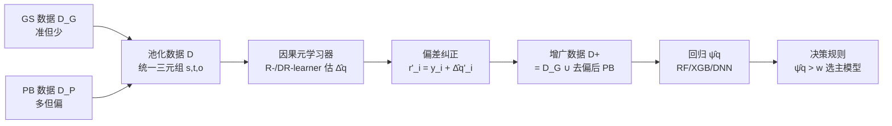

# Meta-Router: Bridging Gold-standard and Preference-based Evaluations in LLM Routing

**会议**: ICLR 2026  
**OpenReview**: [https://openreview.net/forum?id=r0BFucF2dH](https://openreview.net/forum?id=r0BFucF2dH)  
**代码**: [https://github.com/yichistat/Meta-router](https://github.com/yichistat/Meta-router)  
**领域**: 因果推断 / LLM 路由 / 半参数估计  
**关键词**: LLM Routing, Causal Inference, CATE, Meta-Learner, Bias Correction, Data Integration  

## 一句话总结
把"金标准评测 vs 偏好评测"两种数据源的差异重新诠释为因果推断里的处理分配（treatment assignment），从而证明偏好数据的偏差恰好等于条件平均处理效应（CATE），并用 R-/DR-learner 元学习器把这个偏差估计出来、纠正掉，训练出一个又准又省样本的 LLM 路由器。

## 研究背景与动机
**领域现状**：LLM 路由（routing）的目标是给每个 query 在"贵但强的主模型 $M_p$"和"便宜但弱的备选模型 $M_a$"之间做选择，在保证质量的前提下压低推理成本。预测式路由器（predictive router，如 RouteLLM/Ong et al. 2024）的核心是学一个从 query 嵌入到"质量增益"的映射，而这个映射的质量完全取决于训练数据里"质量增益"标签的可靠性。

**现有痛点**：训练路由器的标签有两种来源，各有硬伤。**金标准数据（GS data）**——专家评分或基于 rubric 的打分——准确可信，但在专业领域（医疗、法律、科研、编程）里需要领域专家逐条按多准则细则审阅，极其昂贵、难以规模化（HealthBench 全集才 5000 条）。**偏好数据（PB data）**——众包投票或 LLM-as-a-judge——便宜可扩展，但相对专家判断存在**系统性偏差**，不能可靠反映真实质量。

**核心矛盾**：直接把 GS 和 PB 数据混在一起做回归（现有做法）会引入不可忽略的估计偏差，因为 PB 评测机制学到的质量增益 $\eta(q)$ 与 GS 的真值 $\psi(q)$ 之间存在一个未知的、**随 query 变化的**偏移函数 $\Delta(q)=\psi(q)-\eta(q)$。简单地做个全局均值平移（线性去偏）也不行，因为偏差是异质的。

**本文目标**：设计一个有原则的统计框架，把"稀缺但准"的 GS 数据和"丰富但偏"的 PB 数据高效融合，训练出去偏的路由器。

**核心 idea**：**[因果重诠释]** 把"用哪种机制评测某条 query"看作一个二值处理 $t\in\{0,1\}$（GS=1 / PB=0），query 嵌入是协变量，评测结果是潜在结果（potential outcome）。这样一来，PB 数据的偏差 $\Delta(q)$ 在数学上**正好就是 CATE**——因果推断里研究最透彻的估计量之一，可以直接搬来半参数因果文献里成熟的元学习器来稳健、高效地估计它。

## 方法详解

### 整体框架
方法是一个"两步元路由器（Meta-router）"：先用因果元学习器估出 GS 与 PB 之间的逐 query 偏移 $\hat\Delta(\cdot)$，再用它把 PB 数据"伪金标准化"后与 GS 数据合并，最后在这个增广数据集上回归出金标准质量增益 $\hat\psi(\cdot)$，按"质量增益 vs 成本"的决策规则路由。

### 关键设计
**1. 把评测机制当成处理分配，证明偏差就是 CATE。** 这是全文的支点。作者把 GS 与 PB 数据池化成统一三元组 $(s_i,t_i,o_i)$，其中 $s_i$ 是 query，$t_i\in\{0,1\}$ 标记数据来源，$o_i$ 是观测到的质量增益。对同一条 query，定义两个潜在结果 $o^{(1)}=\psi(s)+\epsilon$（若用金标准评）与 $o^{(0)}=\eta(s)+\epsilon'$（若用偏好评）。于是偏移函数自然落到 CATE 的定义上：

$$\Delta(s)=\psi(s)-\eta(s)=\mathbb{E}\!\left(o^{(1)}-o^{(0)}\mid s\right).$$

作者进一步用 Lemma 1 证明，池化数据的生成过程等价于一个标准的因果数据生成过程：query 服从混合分布 $\kappa Q+(1-\kappa)Q'$，处理分配服从倾向得分 $p(s)=\Pr(t=1\mid s)$，结果按潜在结果模型生成。这一步的价值在于：consistency 与 unconfoundedness（无未观测混淆）在本文的数据采集设定下天然成立——只要除 query 外没有别的变量同时影响"用哪种机制评"和"评测结果"。这就把一个看似工程化的"数据融合去偏"问题，干净地接到了半参数因果估计这套有理论保证的工具链上。

**2. 用 R-/DR-learner 元学习器稳健估计 $\hat\Delta$。** 既然 $\Delta$ 是 CATE，就能调用任意现成 ML 回归器（随机森林、XGBoost、深度网络）作为底座，套上 R-learner（Nie & Wager 2021）或 DR-learner（Kennedy 2023）这两类带**正交化/双重稳健**性质的元学习器。它们的关键好处是 **oracle property**：在 nuisance 函数（倾向得分、条件均值）估计满足温和条件时，CATE 估计可渐近等价于一个能看到全部个体处理效应 $\{o^{(1)}_i-o^{(0)}_i\}$ 的理想估计器——而现实里每条 query 只能观测到 $o^{(1)}$ 或 $o^{(0)}$ 之一。换言之，元学习器在"反事实不可见"的根本困境下仍能逼近理论最优。DR-learner 的双重稳健性让它对 nuisance 模型设定错误更不敏感，这也解释了它在小样本场景下的优势。

**3. 偏差纠正 + 增广回归的两步 Meta-router。** 拿到 $\hat\Delta(\cdot)$ 后，把每条 PB 样本"抬升"成伪金标准：$r'_i=y_i+\hat\Delta(q'_i)$，使其条件无偏地指向 $\psi$。合并得到增广集 $D^+=D_G\cup\{(q'_i,r'_i)\}$，再解一个（带正则）的最小二乘把金标准质量增益估出来：

$$\hat\psi(\cdot\mid\hat\Delta)=\arg\min_{h\in\mathcal H}\frac{1}{n+m}\Big[\sum_{i=1}^n (r_i-h(q_i))^2+\sum_{i=1}^m (y_i+\hat\Delta(q'_i)-h(q'_i))^2\Big]+\Lambda(h).$$

这一步把"稀缺 GS"和"被纠正后的丰富 PB"放在同一尺度上联合训练，既缓解了两数据源的样本不平衡，又保留了 PB 的覆盖广度。决策规则沿用经典效用对比：$D(q\mid w)=\psi(q)-w\,(C_{M_p}-C_{M_a})$，在二值成本下贝叶斯最优分类器即"当 $\psi(q)>w$ 时选主模型"。

**4. 尺度归一化这个被强调的实操细节。** 作者在 Remark 1 与消融里反复强调：必须先把 GS 的 $\{r_i\}$ 乘一个常数 $c$ 归一化到与 PB 的 $\{y_i\}$ 同尺度（按幅度、按经验方差、或按 2-Wasserstein 距离最小化三种方式），否则 CATE 估计会被尺度错配污染，元路由器相对"只用 GS"几乎没有提升。这是把因果工具落到 LLM 评测数据上时一个容易忽视但决定成败的工程点。

## 实验关键数据
实验用两个专业领域 rubric 基准：**HealthBench**（5000 条医疗对话，262 名医师跨 26 专科建标准）和 **PRBench**（法律/金融高风险推理，676 条单轮任务）。主模型 $M_p$ = Gemini 2.5 Pro，备选 $M_a$ = Gemma 3 12B，用 GPT-5-mini 分别按"带 rubric"产 GS 标签、"只看两条回答"产 PB 标签。指标是**效率增益（EG）**：相对随机路由在各"主模型使用率（PMUR）"下的总效率提升；对比 7 种路由器，跑 200 轮蒙特卡洛。

### 主实验（HealthBench，随机森林，d=50，n∈{100,500,1000}）

| 路由器 | 小样本 n=100 | 大样本 n=1000 | 说明 |
|---|---|---|---|
| Oracle benchmark（全 GS） | 最高（上界） | 最高 | 理论上界 |
| **Meta-router (DR-learner)** | **接近 oracle** | **接近 oracle** | 本文方法 |
| **Meta-router (R-learner)** | **接近 oracle** | **接近 oracle** | 本文方法 |
| Predictive router（GS+PB 池化，Ong 2024） | 提升微弱 | 提升微弱 | SOTA 基线 |
| Predictive router（仅 PB） | 提升微弱/不升 | 不升 | 偏差未纠正 |
| Predictive router（仅 GS） | 较弱 | 中等 | 样本受限 |
| Random router | 0（基线） | 0 | 参照 |

关键现象：直接池化或仅用 PB 的预测路由器即使 GS 样本变大也几乎没有改善，凸显偏差 $\Delta(q)$ 的危害；元路由器在 **GS 极度稀缺的不平衡场景下优势最大**。

### 消融实验

| 消融项 | 设置变化 | 结论 |
|---|---|---|
| (i) 回归器 | RF → XGBoost | R-learner 路由器仍稳居第一，但整体 EG 低于 RF，说明换底座要对比挑选 |
| (ii) 简单去偏 | 减 PB-GS 全局均值差后池化 | 与"直接池化"几乎一样差；证明偏差是**异质**的，必须用 CATE，而非线性平移 |
| (iii) 不归一化 | 去掉 Remark 1(2) 方差对齐 | 元路由器相对"仅 GS"不再显著领先；归一化是必要前置 |
| (iv) PCA 维度 | d=50 → d=100 | 元路由器仍领先，方法稳健 |
| (v) 换 judge | PB 改用 Grok 4 Fast | 小 GS 样本下仍领先，对不同偏好机制有自适应性 |

### 关键发现
- PRBench（n∈{50,100,150}）上 **DR-learner 始终领先**，而 R-learner 在样本极小时无明显优势——印证 DR-learner 的双重稳健带来的样本效率更高。
- PB-GS 差异的样本均值显著低于 0（双侧 t 检验 p<2.2×10⁻¹⁶），定量证实偏好评测确实系统性偏离金标准，去偏有真实必要。

## 亮点与洞察
- **视角迁移的优雅**：把"两种评测数据怎么融合"这个工程问题，一句"评测机制即处理分配"就接到了半参数因果推断的完整理论体系上，偏差=CATE 的对应关系自然到近乎显然，却是此前路由文献没点破的。
- **可解释的失败诊断**：消融 (ii) 用"简单线性去偏失效"反证了偏差的异质性，把"为什么非得上 CATE 元学习器"讲得很有说服力，而不是空喊更复杂的方法更好。
- **框架而非单点**：Meta-router 不绑定任何具体 CATE 估计器，R-/DR-learner 只是示例，理论上可扩展到多模型路由（附录）。
- **小样本友好**：在专业领域 GS 标签天然稀缺的真实痛点上，方法恰好在最不平衡的 regime 收益最大，与应用场景对齐。

## 局限与展望
- **GS 标签仍是 LLM 产的**：实验用 GPT-5-mini 带 rubric 当金标准，作者自己承认理想情况应是专家直接标注，只是引 HealthBench 报告（GPT-4.1+rubric 对医师标注 macro F1=0.709）来论证近似可行。
- **正定性（positivity）假设是硬约束**：要求 GS 与 PB 的 query 分布共享支撑集。若 GS 集中在易判定题、PB 偏主观题，倾向得分会趋于 0/1，假设被破坏。作者把"截断式 Meta-router"（用密度比估计重叠区、只在重叠区用 PB）留作未来工作（§5）。
- **只做成对两模型路由**：核心设定是 $M_p$ vs $M_a$，多模型扩展只在附录略述。
- **成本函数被简化为二值**（主模型 1、备选 0），虽给出 token 计价的推广形式，但实验未验证复杂成本下的表现。
- 仅两个基准、两个模型对，规模偏小；OOD 路由、半监督/主动学习等都还是 future work。

## 相关工作与启发
- **LLM 路由**：cascading router（Chen 2024）逐级试错有延迟；predictive router（Ong 2024 RouteLLM、Stripelis、Tsiourvas）一次预测；confidence/reward-based router（Frick、Wu & Lu）。本文把 RouteLLM 的"池化/仅 PB"训练当 SOTA 基线并指出其偏差软肋。
- **因果 CATE 元学习**：K\u00fcnzel 2019 的 meta-learner 谱系、Nie & Wager 2021 的 R-learner、Kennedy 2023 的 DR-learner、Chernozhukov 2018 的双重/正交 ML——本文把这套半参数武器库整建制搬进 LLM 评测去偏。
- **评测可靠性**：LLM-as-a-judge 的系统偏差（Zheng 2023、Tam 2024）正是本文要纠正的对象。
- **启发**：任何"有少量可信标注 + 大量廉价含偏标注"的训练场景（奖励建模、数据标注、半监督），都可以套用"廉价机制 vs 金标准机制 = treatment"的因果重诠释来做有原则的去偏，而不是简单 reweighting 或均值平移。

## 评分
- **新颖性**: ⭐⭐⭐⭐⭐ —— "评测机制即处理分配、PB 偏差即 CATE"是一个干净且有理论分量的视角迁移，把成熟因果工具精准对接到 LLM 路由这一新场景。
- **实验充分度**: ⭐⭐⭐ —— 两个真实专业基准 + 五项消融 + 多样本量较扎实，但只用一对模型、GS 标签由 LLM 代替专家、缺真实成本/多模型验证，规模与外部效度有限。
- **写作质量**: ⭐⭐⭐⭐ —— 因果重诠释的推导层层递进、Lemma 把假设讲清楚，消融用反例支撑动机；公式偏多对纯应用读者略硬。
- **价值**: ⭐⭐⭐⭐ —— 直击专业领域"金标准稀缺、偏好数据多但偏"的真实痛点，方法即插即用、可扩展，对路由乃至更广的含偏标注融合都有借鉴意义。

<!-- RELATED:START -->

## 相关论文

- [\[ICLR 2026\] NextQuill: Causal Preference Modeling for Enhancing LLM Personalization](nextquill_causal_preference_modeling_for_enhancing_llm_personalization.md)
- [\[ICLR 2026\] Overlap-Weighted Orthogonal Meta-Learner for Treatment Effect Estimation over Time](overlap-weighted_orthogonal_meta-learner_for_treatment_effect_estimation_over_ti.md)
- [\[ICLR 2026\] Flattery, Fluff, and Fog: Diagnosing and Mitigating Idiosyncratic Biases in Preference Models](flattery_fluff_and_fog_diagnosing_and_mitigating_idiosyncratic_biases_in_prefere.md)
- [\[ECCV 2024\] Distill Gold from Massive Ores: Bi-level Data Pruning towards Efficient Dataset Distillation](../../ECCV2024/causal_inference/distill_gold_from_massive_ores_bi-level_data_pruning_towards_efficient_dataset_d.md)
- [\[ICLR 2026\] Direct Doubly Robust Estimation of Conditional Quantile Contrasts](direct_doubly_robust_estimation_of_conditional_quantile_contrasts.md)

<!-- RELATED:END -->
