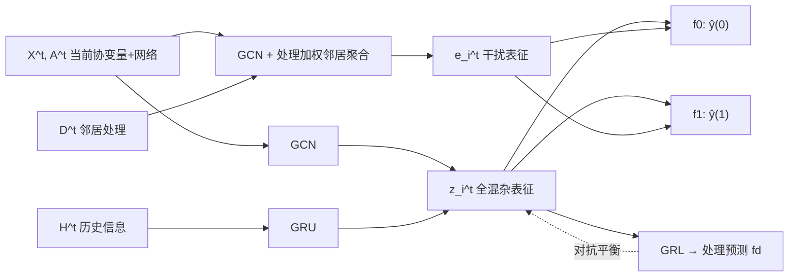

# Modeling Interference for Treatment Effect Estimation in Network Dynamic Environment

**会议**: ICLR 2026  
**OpenReview**: [https://openreview.net/forum?id=EnVaI6s64d](https://openreview.net/forum?id=EnVaI6s64d)  
**代码**: 待确认  
**领域**: 因果推断 / 网络干预效应估计  
**关键词**: 处理效应估计, 干扰（spillover）, 动态网络, 隐藏混杂, 因果可识别性  

## 一句话总结
本文针对"动态网络 + 邻居干扰"双重挑战，定义了新的可识别估计量 CATE-ID，并提出 DSPNET 框架，用 GCN+RNN 捕获时变隐藏混杂、用数据驱动的干扰表征建模溢出效应、再用梯度反转层平衡混杂表征，从观测性动态网络数据中无偏估计个体处理效应。

## 研究背景与动机

**领域现状**：在网络环境（社交网络、传染病社区等）中估计处理效应（treatment effect）近年备受关注。由于网络的互联性破坏了经典的 SUTVA 假设（个体独立、无干扰），一批针对网络的方法被提出，典型做法是借助网络结构来推断难以直接观测的隐藏混杂因子（如从社交连接的属性反推社会经济地位 SES）。

**现有痛点**：现有方法存在两个被忽视的缺口。其一，绝大多数方法假设**静态网络**——网络结构和节点协变量不随时间变化，但真实网络（居民迁移导致社区结构变动、个体健康状态随时间变化）本质上是动态的，混杂因子也随时间演化。其二，这些方法**忽视动态网络下的干扰**：一个个体的处理（如是否遵守出行限制）会通过网络影响邻居的结果（邻居的感染风险），即溢出效应（spillover effect）。

**核心矛盾**：动态演化与网络干扰交织在一起，带来三重难题——(1) 时变 + 干扰下处理效应**是否可识别**本身就是非平凡问题；(2) 网络与协变量同时演化导致混杂分布**时变**，需要建模混杂演化并控制时变混杂偏差；(3) 网络与属性的演化改变了节点间干扰的**模式与强度**，需要随结构变化动态建模溢出效应。

**本文目标**：在动态网络且存在干扰的环境下，定义一个语义清晰、可识别的处理效应估计量，并给出能从观测数据中无偏估计该量的实用框架。

**核心 idea**：**[新估计量]** 提出 CATE-ID（Conditional Average Treatment Effect with Interference under Dynamic networks），通过引入"环境暴露"（environment exposure）把邻居影响显式纳入条件，从而度量干预对个体的**内在因果效应**（剔除经由社交传播的间接效应）；并在一组假设下**形式化证明其可识别性**。**[配套框架]** 提出 DSPNET，用神经网络分别逼近可识别公式中的两个分布，实现端到端估计。

## 方法详解

### 整体框架
DSPNET（Dynamic SPillover modeling NETwork）在每个时间步上由四个模块串联组成：先用 GCN 聚合邻居协变量、用 GRU 编码历史状态，二者拼接得到"全混杂"表征 $z_i^t$；同时用另一支 GCN + 带处理加权的邻居聚合，得到干扰表征 $e_i^t$ 作为环境暴露的代理；二者一并送入两个对应 $d=0/1$ 的 MLP 预测潜在结果；最后通过梯度反转层（GRL）对抗式地平衡混杂表征在处理组/对照组之间的分布，抑制混杂偏差。

### 关键设计

**1. CATE-ID：把"环境暴露"纳入条件的可识别估计量，定义干预的纯效应。** 传统 CATE 在网络中失效，因为邻居处理会污染结果。先前工作把邻居处理简单池化成一个标量当协变量处理，难以刻画高维异质影响。本文先定义环境暴露 $E_i^t = F_i^t(X_{G_i}^t, D_{G_i}^t)$ 作为聚合邻居协变量与处理的通用函数，并通过假设 2.2 保证：一旦 $E_i^t$ 确定，个体在处理 $D_i^t$ 下的潜在结果就完全确定。在此基础上把估计量定义为在固定环境暴露下、两种处理的期望结果差：
$$\tau_i^t = E[Y_i^t(1, E_i^t=e_i^t)\mid x_i^t, H^t, X_{G_i}^t] - E[Y_i^t(0, E_i^t=e_i^t)\mid x_i^t, H^t, X_{G_i}^t]$$
其中 $H^t=\{X^{<t}, D^{<t}, A^{<t}\}$ 是历史信息。这样定义出的量度量的是"干预本身"对个体的因果效应（如出行限制本身对感染风险的影响），而把邻居不合规带来的间接效应排除在外，避免效应被低估。

**2. 隐藏混杂下的可识别性证明。** 为允许隐藏混杂，本文把标准 ignorability 推广为"扩展 ignorability"（假设 3.1）：存在编码函数 $z_i^t = \Phi_z(x_i^t, X_{G_i}^t, H^t)$ 把个体协变量、历史、邻居协变量压缩进全混杂 $Z_i^t$，使得 $Y_i^t(1,E),Y_i^t(0,E) \perp D_i^t, E_i^t \mid Z_i^t$；再配上推广后的一致性假设（假设 3.2）。定理 3.3 证明：只要能恢复 $p(Y_i^t\mid Z_i^t, E_i^t, D_i^t)$ 与 $p(Z_i^t\mid X_i^t, H^t, X_{G_i}^t)$ 两个分布，CATE-ID 即可从观测性动态网络中识别。证明经由对 $Z$ 取期望、套用扩展 ignorability、利用因果图中的条件独立、再用一致性，把不可观测的潜在结果差化为可由观测条件期望计算的形式——这正是 DSPNET 两条神经支路要拟合的目标。

**3. 全混杂表征：GCN 聚合空间、RNN 编码时间。** 对应可识别公式中的 $p(Z_i^t\mid\cdot)$，用多层 GCN 把当前协变量与网络结构聚合得到空间信息，与编码后的历史状态 $\tilde H_i^t$ 拼接经 MLP 得到 $z_i^t = f_z^t([g_z^t(X^t,A^t)_i, \tilde H_i^t])$。历史状态用 GRU/LSTM 递归更新 $\tilde H_i^t = \text{RNN}([z_i^{t-1}, d_i^{t-1}], \tilde H_i^{t-1})$，把上一步的混杂表征与处理一并带入，从而捕获随时间演化的时变混杂——消融显示这是贡献最大的模块。

**4. 干扰建模：处理加权的邻居嵌入聚合。** 干扰不仅取决于邻居是否被处理，还取决于处理如何与个体行为模式交互（健康干预只在被处理的邻居积极参与分享时才影响到你）。简单均值池化无法刻画这种异质性。本文先用一支 GCN 把协变量投影到隐空间得到 $r_i^t = g_r(X^t, A^t)_i$，再按邻居处理加权聚合：
$$e_i^t = \sum_{j\in G_i^t} d_j^t \cdot r_j^t$$
得到的 $e_i^t$ 是"被处理邻居所施加影响"的数据驱动嵌入，作为环境暴露 $E_i^t$ 的代理与 $z_i^t$ 共同输入结果预测头。

**5. 梯度反转层平衡混杂表征。** 处理组与对照组的混杂分布差异是混杂偏差的来源，Shalit 等的理论表明缩小两组表征分布差异可降低估计误差上界。本文用对抗策略：一个 MLP 处理预测头 $f_d(z_i^t)$ 以交叉熵 $L_d$ 拟合处理分配，总损失 $L = L_y + \alpha L_d + \omega\|\Theta\|^2$。在反向传播时对混杂表征参数 $\Theta_z$ 的梯度乘以负常数 $-\beta$：
$$\Theta_z = \Theta_z - \eta\Big(\frac{\partial L_y}{\partial \Theta_z} - \beta\frac{\partial \alpha L_d}{\partial \Theta_z} + \omega\frac{\partial \|\Theta\|^2}{\partial \Theta_z}\Big)$$
直觉上 GRL 阻止混杂表征携带可预测处理的信息，从而对齐两组表征分布、保留与结果相关的信息，缓解混杂偏差。整体时空复杂度均与边数 $M$、节点数 $N$ 线性。

## 实验关键数据

数据集：Flickr、BlogCatalog 两个社交网络，通过每步随机增删 $p\%$ 边 + 对同比例协变量加高斯噪声构造动态网络（共 25 个时间步），并以自回归过程模拟混杂、处理与含干扰的潜在结果。指标 $\sqrt{\epsilon_{PEHE}}$（个体级）、$\epsilon_{ATE}$（群体级），**越低越好**。

### 主实验表格（不同网络动态强度 $p\%$，节选 $p\%=0.1\%$）

| 方法 | Flickr $\sqrt{\epsilon_{PEHE}}$ | Flickr $\epsilon_{ATE}$ | BlogCatalog $\sqrt{\epsilon_{PEHE}}$ | BlogCatalog $\epsilon_{ATE}$ |
|------|------|------|------|------|
| CFR | 24.218 | 2.754 | 11.547 | 1.295 |
| NetEST | 6.822 | 1.405 | 8.539 | 1.586 |
| Deconfounder | 8.338 | 4.738 | 13.067 | 8.884 |
| SPNET | 8.693 | 1.204 | 9.569 | 2.298 |
| DNDC | 2.589 | 1.618 | 2.475 | 1.454 |
| **DSPNET** | **1.497**† | **0.890**† | **1.464**† | **0.845**† |

†表示对最强基线有统计显著提升（t 检验 p<0.05）。在 $p\%=0.5\%, 1.0\%$ 下 DSPNET 同样保持最优且性能稳定，体现对网络动态的鲁棒性。

### 消融实验表格

| 变体 | Flickr $\sqrt{\epsilon_{PEHE}}$ | Flickr $\epsilon_{ATE}$ | BC $\sqrt{\epsilon_{PEHE}}$ | BC $\epsilon_{ATE}$ |
|------|------|------|------|------|
| 完整 DSPNET | 1.497 | 0.890 | 1.464 | 0.845 |
| w/o GRL（去梯度反转） | 2.179 | 0.986 | 1.886 | 1.089 |
| w/o IM（去干扰建模） | 1.938 | 1.245 | 1.822 | 1.118 |
| w/o GRU（去时序） | 10.235 | 6.854 | 10.652 | 3.547 |

### 关键发现
- **三个模块缺一不可**：去 GRU 性能崩塌最严重（误差涨约 7 倍），证明捕获历史信息在动态设置中最关键；去干扰建模、去 GRL 也都带来明显退化。
- **干扰强度鲁棒**：在干扰强度 $C\in\{10,...,50\}$ 全程领先，且 $C$ 越大与 DNDC（不显式建模干扰）的差距越拉大，凸显显式建模溢出效应的重要性。
- **处理优先级排序更优**：用 RATE 指标（$R_{AUTOC}$、$R_{QINI}$，越高越好，无需真值），DSPNET 在 Flickr 取 2.98/1.13、BlogCatalog 取 3.91/1.52，均超过所有网络基线，说明其估计能更好地识别"谁更受益于处理"。
- **复杂度线性**：时间/空间复杂度对节点数 $N$、边数 $M$ 线性，Flickr 1× 规模单步 0.24s、2.8GB 显存。

## 亮点与洞察
- **先把"问题定义对"再建模**：本文最大的价值在于厘清了"动态网络 + 干扰"下到底要估什么——CATE-ID 用环境暴露把间接效应剥离，给出了语义清晰且可识别的目标量，并配上完整的可识别性证明，而不是直接堆网络。
- **干扰表征用处理加权聚合**而非均值池化，是个简洁但有效的改动，让"只有被处理且活跃的邻居才施加影响"这种异质模式得以表达。
- **可识别性理论与神经实现一一对应**：定理 3.3 需要恢复的两个分布，恰好对应 DSPNET 的全混杂支路与结果预测支路，理论与架构衔接紧密。

## 局限与展望
- **实验仅用半合成数据**：动态网络是在 Flickr/BlogCatalog 上人工增删边 + 加噪声构造的，潜在结果也由已知自回归过程模拟，缺乏真正带真值的真实动态网络验证——这也是该领域共性难题（真值反事实不可得）。
- **扩展 ignorability 仍是强假设**：假设所有混杂都能被 $\Phi_z$ 编码进潜变量，现实中若存在网络外的混杂源则不成立。
- **干扰对称性与方向性**：当前干扰表征对邻居一视同仁聚合，未显式建模有向网络或非对称影响强度，可进一步细化。
- 过去结果 $Y^{<t}$ 默认被排除（假设由历史协变量/处理隐含捕获），在结果有强自相关的场景可能需要显式引入。

## 相关工作与启发
- **静态网络处理效应**：NetEST、Deconfounder、SPNET 等借网络结构推断隐藏混杂或建模干扰，但假设网络静态，本文证明其在动态条件下显著退化。
- **动态网络因果**：DNDC 面向动态网络学习时变混杂表征，但不显式建模干扰，是本文最强基线；DSPNET 在其基础上补上干扰建模这一关键缺口。
- **表征平衡思路**：CFR 用 Wasserstein 正则平衡处理组分布，本文改用更轻量的梯度反转层（GRL）实现同样的对抗平衡目标。
- **启发**：在网络/图上做因果估计时，"先定义可识别的估计量、再设计逼近该可识别公式的神经支路"是一条值得借鉴的范式；把干扰显式表征化（而非池化成标量）对捕获异质溢出效应很关键。

## 评分
- 新颖性: ⭐⭐⭐⭐ 首次系统处理"动态网络 + 干扰"双重挑战，定义新估计量 CATE-ID 并证明可识别性，问题刻画清晰。
- 实验充分度: ⭐⭐⭐ 含主实验/消融/干扰强度/超参/RATE/复杂度多角度验证，但仅在两个半合成数据集上、缺真实动态网络验证。
- 写作质量: ⭐⭐⭐⭐ 动机—理论—方法—实验层层递进，假设与定理表述严谨，图示清晰。
- 价值: ⭐⭐⭐⭐ 为动态网络下的因果效应估计提供了可识别的目标量与可落地框架，对社交网络/流行病学等决策场景有实用价值。

<!-- RELATED:START -->

## 相关论文

- [\[ICLR 2026\] Matching without Group Barrier for Heterogeneous Treatment Effect Estimation](matching_without_group_barrier_for_heterogeneous_treatment_effect_estimation.md)
- [\[ICLR 2026\] Overlap-Adaptive Regularization for Conditional Average Treatment Effect Estimation](overlap-adaptive_regularization_for_conditional_average_treatment_effect_estimat.md)
- [\[ICLR 2026\] Overlap-Weighted Orthogonal Meta-Learner for Treatment Effect Estimation over Time](overlap-weighted_orthogonal_meta-learner_for_treatment_effect_estimation_over_ti.md)
- [\[ICLR 2026\] Journey to the Centre of Cluster: Harnessing Interior Nodes for A/B Testing under Network Interference](journey_to_the_centre_of_cluster_harnessing_interior_nodes_for_ab_testing_under_.md)
- [\[ICLR 2026\] A Relative Error-Based Evaluation Framework of Heterogeneous Treatment Effect Estimators](a_relative_error-based_evaluation_framework_of_heterogeneous_treatment_effect_es.md)

<!-- RELATED:END -->
