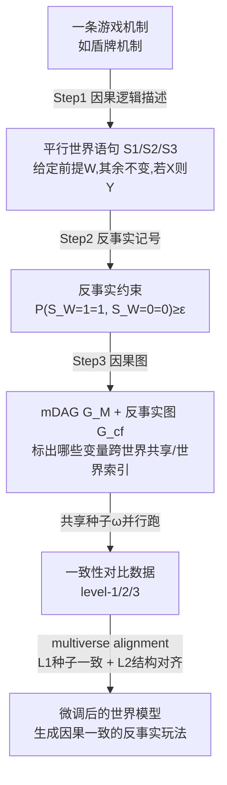

# Multiverse Mechanica: A Testbed for Learning Game Mechanics via Counterfactual Worlds

**会议**: ICLR 2026  
**OpenReview**: [https://openreview.net/forum?id=5Q8r8ZubAH](https://openreview.net/forum?id=5Q8r8ZubAH)  
**代码**: [https://github.com/ricardocannizzaro/multiverse-mechanica](https://github.com/ricardocannizzaro/multiverse-mechanica)  
**领域**: 因果推断 / 生成式世界模型 / 反事实推理  
**关键词**: 游戏机制学习, 反事实推理, 因果一致性, 世界模型, 平行世界对比, Pearl 因果阶梯  

## 一句话总结
把"游戏世界模型是否真学会了游戏规则（机制）"这个原本只能事后肉眼判断的模糊问题，重新形式化为一个**因果反事实推断任务**，并发布了一个能原生吐出"平行世界对比数据 + 每条机制对应因果图"的可玩游戏测试床 Multiverse Mechanica，让"学机制"而非"学像素"第一次变得可定义、可监督、可复现地评测。

## 研究背景与动机
- **领域现状**：以 Genie、Oasis、GameGAN、World Models 为代表的交互式世界模型能生成视觉上以假乱真的游戏画面，作者们也常宣称模型"学会了"游戏物理/碰撞/逻辑等机制。
- **现有痛点**：这些"学会机制"的论断几乎都是**事后（a posteriori）肉眼观察**——看一段生成视频里机制"演示对了"就说学会了。但这无法回答更关键的**先验问题**：在动手训练前，我们能否判断一条机制是否能从训练数据里被学到？没有形式化定义，就既无法判定机制是否"可识别（identifiable）"，也无法把"机制表征"从"画面表征"里解耦出来。
- **核心矛盾**："生成的画面好看"与"生成的玩法不违反游戏规则"是两件事——一旦违反规则（如该挡的没挡住、该免疫的受伤了），再逼真的画面也毁掉了游戏体验，但现有评测体系只盯着像素相似度，缺乏对"规则一致性"的可操作度量与监督信号。
- **本文目标**：给"学会一条游戏机制"下一个**数学上精确、可统计验证**的定义，并提供一个能直接产出验证所需数据与因果结构的测试床。
- **核心 idea**：**【机制 = 反事实约束】** 一条游戏机制本质上是一组施加在反事实分布上的约束（如"换成有盾就能挡，从而不受伤"），因此"学机制"= 让生成模型满足这些反事实约束；**【因果一致性原则做抓手】** 用 Pearl 的因果一致性（不在干预下游的变量跨世界保持不变）把"all-else-equal（其余一切不变）"这个直觉变成可操作的训练约束。

## 方法详解

### 整体框架
论文把"机制学习"拆成三层闭环：先用**因果逻辑 + 反事实记号 + 因果图**三步把一条机制（以"盾牌机制"为例）形式化为一组反事实约束 $\mathcal{M}=\{S_1,\dots,S_k\}$；再让 Multiverse Mechanica 游戏引擎以**共享随机种子 $\omega$** 跑多个平行实例，原生生成满足这些约束的"一致性对比（consistent contrasts）"三级数据；最后用一个叫 **multiverse alignment** 的对比式微调目标，把"跨平行世界应当保持一致"的视觉信息当监督，去微调一个预训练世界模型，让它真正满足因果一致性而非只是画面像。

### 关键设计

**1. 把机制形式化为反事实约束的三步法（causal logic → counterfactual → graph）**：作者主张用 Pearl 因果阶梯的**第三层（counterfactual）平行世界语句**来描述机制，而不是更常用、更易实验验证的第二层干预语句。原因在于第三层语句天然带"all-else-equal（其余一切不变）"这条额外约束——它正是"机制一致性"的本质。以盾牌机制为例，三条语句 $S_1$（同样条件下，轻武器对手可装盾、重武器不可）、$S_2$（有盾才能挡）、$S_3$（挡成功则不受伤、失败则受伤）被改写成反事实记号，如 $S_1: P(S_{W=1}=1,\,S_{W=0}=0)\ge\epsilon_1$，其中 $W$ 是武器类型、$S$ 是否装盾、$B$ 是否格挡、$D$ 是否受伤，$\epsilon_i>0$ 表示因系统中其他因子带来的有界不确定性。再把单步玩法的完整因果 DAG $G$ 边缘化到只剩机制相关变量 $Z=\{C,W,S,B,D,V\}$ 的 mDAG $G_M$，与每条反事实表达式组合成**反事实图**——图里跨世界一致的变量是唯一节点、受干预影响的变量按世界索引，等于把"生成时哪些东西必须保持不变"显式画了出来。一条机制由此被定义为元组 $\langle G_M, \mathcal{M}\rangle$。

**2. 用共享种子的平行世界生成"一致性对比"数据**：这是测试床的核心数据机制，也是游戏场景相比真实世界的稀有优势——你可以让多个游戏实例从**完全相同的初始条件和随机种子 $\omega$** 出发，只在各自实例里施加不同干预（如一个装盾、一个不装），从而得到只在目标机制处不同、其余一切像素都一致的成对视频片段，作者称为 consistent contrasts。读因果图可知 $W_{S=1}=W_{S=0}=W$、$S_{B=1}=S_{B=0}=S$ 等一致性关系自动成立。通过对一致性对比反复采样，经验分布 $\hat P_i^{(N)}$ 几乎必然收敛到目标分布 $P_i$（$\hat P_i^{(N)}\xrightarrow{a.s.}P_i$），这就给"模型学会了盾牌机制"一个精确操作化：**学到约束 $\{S_1,S_2,S_3\}$ 或直接建模 $\{P_1,P_2,P_3\}$**。游戏支持按 level-1（随机生成）、level-2（指定干预）、level-3（共享 $\omega$ 的成对干预）三档原生产数据，每段是 512×512、约 4 秒、50 FPS 的视频，附带控制器输入、游戏状态变量取值和种子。V1.0 实现了盾牌、元素免疫、武器射程、五种法术子机制等多条机制，每条独立实现以保证"机制 = 代码逻辑"的对齐。

**3. multiverse alignment：把"反事实图的一致性"翻译成扩散模型微调目标**：概念验证里作者把一张冲击帧图像 $V_{X=x}$ 看作一次模拟的快照，扩散模型的初始噪声潜变量 $Z_T$ 被类比为外生种子 $\omega$——两者都决定"在给定条件 $X$ 下图像里还有什么会变"。于是要复现一致性对比里共享的 $\omega$，就约束成对轨迹的 $Z_T$ 跨对一致。总损失 $L=\lambda_1 L_1+\lambda_2 L_2$（$\lambda_1+\lambda_2=1$）含两项：**$L_1$ 种子一致性损失**用确定性扩散反演（Abduct）把干净潜变量反推回估计的种子 $\hat\omega_j$，再惩罚成对种子差异 $L_1=\lVert\text{Abduct}_\theta(Z_{0,X=x_0},c_0)-\text{Abduct}_\theta(Z_{0,X=x_1},c_1)\rVert_2^2$；**$L_2$ 结构对齐损失**在一组高噪声时间步 $S\subset\{1,\dots,T\}$ 上对齐去噪器预测 $L_2=\sum_{t\in S}\lVert\epsilon_\theta(Z_{t,X=x_0},t,c_0)-\epsilon_\theta(Z_{t,X=x_1},t,c_1)\rVert_2^2$。直觉是：高噪声步对齐负责"锁住全局身份/非机制内容"，机制特有的差异留到后期低噪声步才浮现。训练时机制对应的游戏状态字典被转成文本描述作为条件输入。

## 实验关键数据

这是一个**概念验证（proof-of-concept）**而非完整系统评测：在 Multiverse Mechanica 生成的全机制冲击帧对上微调预训练条件扩散模型 OpenJourney-v4，对照引擎渲染的真值反事实，做四配置消融。

### 消融实验表格（损失组件，对照引擎真值反事实）

| 配置 | 重建 PSNR↑ | 重建 SSIM↑ | 反事实 PSNR↑ | 反事实 SSIM↑ | Exo MSE↓ |
|------|-----------|-----------|-------------|-------------|----------|
| 仅扩散（baseline） | 19.54 | 0.776 | 13.58 | 0.358 | 0.793 |
| w/o $L_1$（仅 $L_2$） | 19.42 | 0.769 | 13.55 | 0.355 | 0.795 |
| w/o $L_2$（仅 $L_1$） | 13.35 | 0.275 | 11.01 | 0.129 | **0.087** |
| Full（$L_1+L_2$） | 14.02 | 0.429 | 11.04 | 0.196 | 0.092 |

注：Exo MSE 度量成对种子距离 $\lVert\hat\omega_0-\hat\omega_1\rVert^2$，越小表示跨世界一致性越好。

### 关键发现
- **因果一致性的关键开关是 $L_1$**：没有 $L_1$ 时 Exo MSE 居高不下（≈0.79），且只加 $L_2$ 与 baseline 几乎无差别；一旦加入 $L_1$，Exo MSE 直降近一个量级（≈0.09），种子对齐被强制收紧。
- **$L_2$ 是 $L_1$ 的有益补充**：在 $L_1$ 基础上加 $L_2$，把重建 SSIM 从 0.275 提到 0.429、反事实 SSIM 从 0.129 提到 0.196，且不破坏种子对齐；CF Transfer CLIP 也从仅 $L_1$ 的 ≈17 升到全损失的 ≈24。
- **代价是像素保真度的轻微牺牲**：强制种子对齐换来一致性的同时，PSNR/SSIM 等逐像素指标有所下降——这正暴露了"画面像"与"机制一致"之间的张力。
- **定性证据**：从一张"事实"图反演出 $\omega$ 后固定它生成反事实图，模型能在切换目标盾牌机制（有盾不挡 / 有盾且挡）的同时保留非机制内容（场景、角色），说明学到的是可生成因果一致机制的表征，而非单纯像素。

## 亮点与洞察
- **问题重构本身就是最大贡献**：把"模型学没学会机制"从一个靠肉眼裁判的玄学问题，干净利落地转译成"是否满足一组反事实约束"的可统计判定问题，这是把因果阶梯（Pearl's hierarchy）真正落到世界模型评测上的第一次系统尝试。
- **游戏是反事实数据的天赐场景**：现实世界拿不到"同一初始条件下既装盾又不装盾"的平行样本，但游戏引擎只要固定种子就能批量产出 level-3 反事实数据——作者敏锐地把这个游戏特性变成了因果学习的监督来源。
- **反事实图即"该保持什么不变"的显式说明书**：跨世界共享节点 vs 世界索引节点的区分，把抽象的 all-else-equal 约束变成可直接喂给损失函数的结构，$Z_T \leftrightarrow \omega$ 的类比则把这套因果语言巧妙嫁接到扩散模型上。
- **测试床定位务实**：作者明确把它定位成"最好情况下的基准（best-case benchmark）"——视觉简单、信息密集、低成本可复现，用来反推弱监督下的真实模型该如何改进。

## 局限与展望
- **概念验证很初步**：只建模单张冲击帧、用图像扩散模型而非标准世界模型架构，离"完整视频 roll-out 上的机制一致性"还有距离。
- **$L_1$ 计算昂贵**：种子一致性损失需要对整条 DDIM 反演轨迹的每一步追踪梯度，比标准扩散训练贵得多。
- **缺整段 roll-out 的一致性度量**：现在只能借 PSNR/SSIM/CLIP 比对事件对齐帧，全视频级别的因果一致性度量仍是开放难题。
- **域简单**：当前是 2D 回合制；形式化在原理上可推广到连续交互的 3D 环境、连续值干预与时序动力学，但如何形式化这些更复杂机制仍需后续工作。

## 相关工作与启发
- **世界模型 / 交互式游戏生成**：Genie、Oasis、GameGAN、World Models、GameGen-X 等都宣称学到机制，本文恰是对这类"事后肉眼论断"的方法论批判与补救。
- **直觉物理测试床**：IntPhys、Physion 等聚焦真实世界牛顿物理（物体永久性、碰撞稳定性），而游戏机制可包含施法、穿传送门等"非现实物理"，本文测试床覆盖面更广且提供形式化真值。
- **因果表征学习**：呼应 Locatello 等"无监督解耦不可能"定理与 Schölkopf 等因果表征仅部分可识别的结论——本文用反事实图作为强归纳偏置来破解这一困难。
- **启发**：这套"用共享种子造平行世界 + 把一致性写进损失"的范式，原则上可迁移到任何可控模拟器与 VFX 管线，为弱监督真实世界世界模型提供因果一致性的训练思路。

## 评分
- **新颖性**: ⭐⭐⭐⭐⭐ 把游戏机制学习重构为因果反事实推断、并用因果一致性原则操作化"机制一致性"，是该问题上首个系统性形式化，视角新颖且切中要害。
- **实验充分度**: ⭐⭐⭐ 仅单冲击帧、单一损失消融的概念验证，规模和深度有限，未在标准世界模型架构和完整 roll-out 上验证（作者亦坦承）。
- **写作质量**: ⭐⭐⭐⭐ 用盾牌机制贯穿全文，从因果逻辑到反事实记号再到损失函数层层递进，形式化与直觉解释平衡得好。
- **价值**: ⭐⭐⭐⭐ 提供了开源可玩、能原生产因果数据的测试床和一个清晰的评测/监督范式，对"世界模型到底学没学会规则"这一根本问题有长期价值。

<!-- RELATED:START -->

## 相关论文

- [\[ECCV 2024\] Learning Chain of Counterfactual Thought for Bias-Robust Vision-Language Reasoning](../../ECCV2024/causal_inference/learning_chain_of_counterfactual_thought_for_bias-robust_vision-language_reasoni.md)
- [\[ICLR 2026\] Counterfactual Explanations on Robust Perceptual Geodesics](counterfactual_explanations_on_robust_perceptual_geodesics.md)
- [\[ICLR 2026\] Counterfactual Structural Causal Bandits](counterfactual_structural_causal_bandits.md)
- [\[ACL 2025\] Leveraging Variation Theory in Counterfactual Data Augmentation for Optimized Active Learning](../../ACL2025/causal_inference/leveraging_variation_theory_in_counterfactual_data_augmentation_for_optimized_ac.md)
- [\[ICLR 2026\] Self-Supervised Learning from Structural Invariance](self-supervised_learning_from_structural_invariance.md)

<!-- RELATED:END -->
