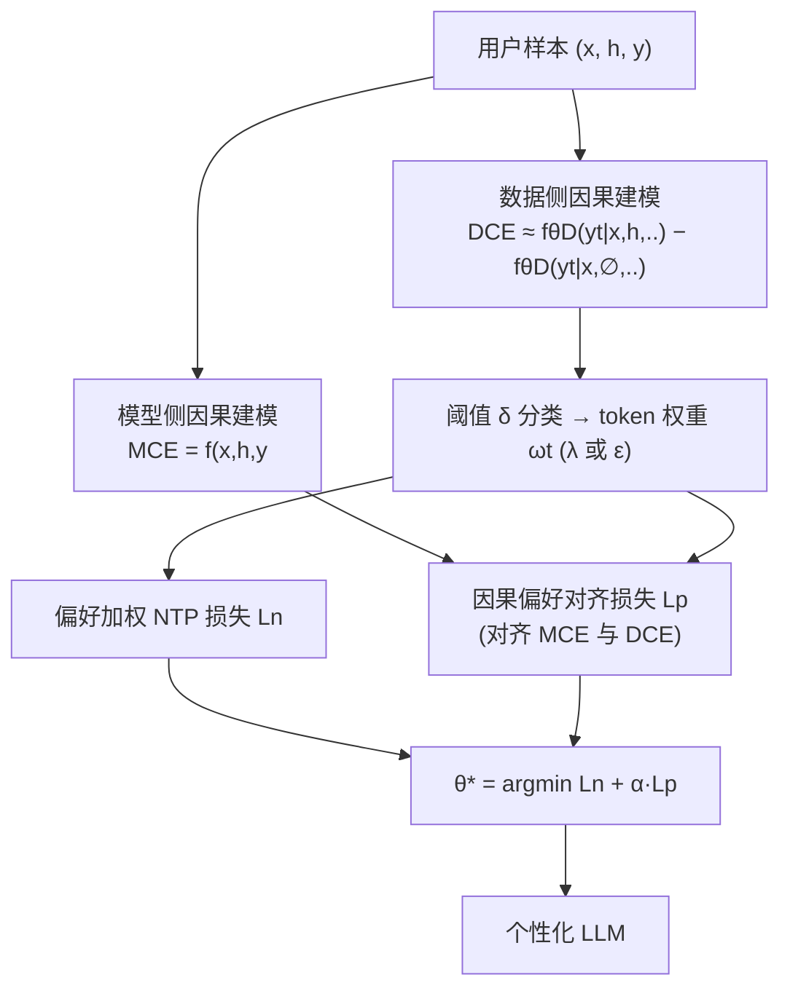

# NextQuill: Causal Preference Modeling for Enhancing LLM Personalization

**会议**: ICLR 2026  
**OpenReview**: [https://openreview.net/forum?id=xYpVlKMFqv](https://openreview.net/forum?id=xYpVlKMFqv)  
**代码**: [https://github.com/juntaoyou/NextQuill](https://github.com/juntaoyou/NextQuill)  
**领域**: 因果推断 / LLM 个性化对齐  
**关键词**: LLM 个性化, 因果偏好建模, 因果效应, do-calculus, 偏好对齐, 监督微调  

## 一句话总结
NextQuill 把 LLM 个性化重新看作一个因果问题——模型预测和用户真实回复都是「用户历史/特征 × 上下文」共同作用的结果，用因果效应（do-calculus）把其中真正由偏好驱动的部分分离出来，并设计两个对齐损失只学这部分，从而做出比无差别对齐更深的个性化。

## 研究背景与动机
**领域现状**：LLM 个性化主要有两条路线。一是「记忆-检索」范式，把用户历史存进外部 memory，生成时检索相关片段塞进 prompt 引导生成；二是「微调」范式，直接拿用户历史数据 fine-tune 模型参数，让模型从过去行为预测后续行为，从而把偏好刻进权重。后者通常对齐效果更显式。

**现有痛点**：作者指出微调类方法的对齐其实很「浅」，问题出在两处对「用户数据的无差别使用」。① **模型侧**：现有方法把「从整个输入生成的全部预测」都当成模型推断出的偏好，与 ground-truth 无差别对齐。但真正反映模型内部偏好建模的，是那些**由历史行为数据驱动**的推断，而非由通用上下文（query、任务 prompt）驱动的部分。② **数据侧**：现有方法把 ground-truth 回复里的**所有 token 一视同仁**地学，忽略了不同 token 对偏好表达的贡献天差地别——比如某用户的口头禅 token 强烈反映偏好，而「这部电影的主演是 XX」这类 token 不管谁来写都会出现。

**核心矛盾**：模型预测和用户回复都是「偏好因素」和「非偏好因素（主要是上下文）」共同作用的产物，但只有偏好因素驱动的那一部分才真正代表用户偏好。无差别对齐 = 把噪声和信号一起学，对齐自然浅。

**本文目标**：从因果视角找出「偏好建模里到底什么才重要」，把模型侧和数据侧各自由偏好驱动的成分隔离出来，并在训练时显式强调学习这些成分。

**核心 idea**：**因果偏好建模（Causal Preference Modeling）**——把响应生成画成因果图，用「用户历史/特征对输出的因果效应」定义偏好信号，再用两个损失分别在模型侧（对齐因果效应）和数据侧（加权偏好 token）上做对齐。

## 方法详解

### 整体框架
NextQuill 先做**因果分析**：用两张因果图分别刻画「模型如何预测回复」和「用户如何写出真实回复」，在两侧各定义一个**因果偏好效应**（model-side 的 MCE、data-side 的 DCE），即历史/用户特征在剔除参考值后对输出 token 概率的干预差。然后基于这两个效应做**偏好对齐**：数据侧用 DCE 给每个 ground-truth token 算权重，区分偏好驱动 token；模型侧用 MCE 隔离预测中的偏好成分并与 ground-truth 对齐。最终把两个损失合成一个目标，像 SFT 一样微调模型。

### 关键设计
**1. 模型侧因果偏好效应（MCE）：用「去掉历史」做反事实，隔离模型预测里真正由偏好驱动的部分。** 在模型侧因果图里，预测 $\hat{Y}$ 同时受用户历史 $H$、上下文 $X$ 以及二者交互 $E_M$ 的影响，但只有 $H$ 这条路径携带偏好信号。作者用 do-calculus 定义 $t$ 时刻 token 的因果效应 $\text{MCE}(\hat{Y}_t|h,x) = P(\hat{Y}_t|H{=}do(h),x) - P(\hat{Y}_t|H{=}do(0),x)$，由于因果图结构使干预概率等于观测概率，落到实践里就是一个**反事实差分**：$f_\theta(x,h,y_{<t}) - f_\theta(x,\emptyset,y_{<t})$，即「带历史的预测」减去「抹掉历史的预测」。这个差分度量的正是预测中被用户历史真正改变的那一块，代表 LLM 内部捕获到的真实偏好。

**2. 数据侧因果偏好效应（DCE）：给每个 ground-truth token 算「有多少是偏好写出来的」，再二值化成权重。** 数据侧因果图描述用户如何生成真实回复 $Y$：受用户特征 $U$、上下文 $X$ 及交互 $E_D$ 影响。同理定义 $\text{DCE}(Y_t|u,x) = P(Y_t|U{=}do(u),x) - P(Y_t|U{=}do(0),x)$，量化 token $y_t$ 在多大程度上由偏好驱动。由于用户特征 $u$ 不可直接获取，用历史数据 $h$ 近似，并用一个**见过数据集 $\mathbb{D}$ 的 LLM** $\theta_\mathbb{D}$ 来估计：$\text{DCE}(Y_t{=}y_t|u,x) \approx f_{\theta_\mathbb{D}}(y_t|x,h,y_{<t}) - f_{\theta_\mathbb{D}}(y_t|x,\emptyset,y_{<t})$。然后用阈值 $\delta$ 把 token 二分为偏好驱动（权重 $\lambda$）和非偏好驱动（权重 $\epsilon$），得到 token 权重 $\omega_t$（附录给出动态/固定两种 DCE 估计实现）。

**3. 偏好加权 NTP 损失：把对齐重心压到偏好 token 上。** 标准 next-token 预测损失保证文本连贯，但作者用 DCE 得到的权重 $\omega_t$ 给它重加权，让模型更使劲学偏好驱动 token：$L_n = \frac{1}{|\mathbb{D}|}\sum_{(x,h,y)}\sum_{t=1}^{|y|}\omega_t\cdot\ell(f_\theta(x,h,y_{<t}), y_t)$，其中 $\ell$ 是交叉熵。这样非偏好 token（如人人都写的客观描述）权重低，不会稀释偏好信号。

**4. 因果偏好对齐损失：直接把模型侧的 MCE 对齐到数据侧偏好。** 仅加权还不够，作者进一步让 LLM 内部的因果偏好效应（MCE）去拟合 ground-truth 中的偏好成分。把设计 1 的反事实差分 $f_\theta(x,h,y_{<t}) - f_\theta(x,\emptyset,y_{<t})$ 作为「模型隔离出的偏好预测」，用同样的 $\omega_t$ 加权后与真实 token 对齐：$L_p = \frac{1}{|\mathbb{D}|}\sum_{(x,h,y)}\sum_{t=1}^{|y|}\omega_t\cdot\ell\big(f_\theta(x,h,y_{<t}) - f_\theta(x,\emptyset,y_{<t});\, y_t\big)$。这一项强制「模型靠历史多预测出来的那部分」直接对准用户真实偏好，而不是无差别对齐全部预测。最终目标 $\theta^\star = \arg\min_\theta\, L_n + \alpha\cdot L_p$，用超参 $\alpha$ 平衡二者，整体像 SFT 一样训练。

## 实验关键数据

### 主实验表格
在 Amazon 的 Book/Movie/CD Review 三个评论生成数据集 + Topic Writing（个性化 Reddit 长帖）上，以 Qwen 为 backbone，对比检索类（Contriever / LatestK / CoS / LLM-TRSR）和 PEFT 类（SFT / OPPU / ContextSFT）方法：

| 数据集 | 指标 | Base(Qwen) | ContextSFT(次优) | **NextQuill** |
|---|---|---|---|---|
| Book Review | ROUGE-1 | 0.0519 | 0.1661 | **0.2318** |
| | ROUGE-L | 0.0267 | 0.0836 | **0.1270** |
| | BERTScore | 0.7385 | 0.8013 | **0.8182** |
| Movie Review | ROUGE-1 | 0.0470 | 0.1573 | **0.2015** |
| | BLEU | 0.0402 | 1.7151 | **2.3845** |
| CD Review | ROUGE-1 | 0.0438 | 0.1505 | **0.1976** |
| Topic Writing | ROUGE-1 | 0.0684 | 0.0934 | **0.1510** |

NextQuill 在四个数据集几乎所有指标上都拿到最优，相比最强 baseline ContextSFT 普遍有显著提升（如 Book Review ROUGE-1 从 0.166 → 0.232）。

### 消融实验表格
以 SFT 为 Base，逐步加入各组件，报告相对 Base 的提升 RI(%)：

| 变体 | Book R-1 (RI) | Movie R-1 (RI) | CD R-1 (RI) |
|---|---|---|---|
| Base Model (SFT) | 0.0752 (-) | 0.0620 (-) | 0.0668 (-) |
| + MCE Only | 0.1827 (+142.9%) | 0.1629 (+162.7%) | 0.1552 (+132.3%) |
| + MCE-DCE Alignment | 0.1876 (+149.5%) | 0.1671 (+169.5%) | 0.1672 (+150.3%) |
| + DCE Only | 0.1958 (+160.4%) | 0.1865 (+200.8%) | 0.1805 (+170.2%) |
| **+ Full (NextQuill)** | **0.2318 (+208.2%)** | **0.2015 (+225.0%)** | **0.1976 (+195.8%)** |

### 关键发现
- 单独用模型侧 MCE 对齐或数据侧 DCE 加权都能比 SFT 大幅提升（+130%~+200%），说明两侧因果信号各自有效。
- DCE Only 略强于 MCE Only，说明「区分偏好 token 加权」这一数据侧策略贡献更大。
- 两侧组合（Full）在所有数据集上进一步明显超过任一单组件，两个因果对齐策略**互补**而非冗余。

## 亮点与洞察
- **重新框定问题**：把「个性化对齐为什么浅」归因到「无差别使用用户数据」，并用因果语言（偏好因素 vs 上下文因素）把模糊直觉变成可计算的因果效应，视角清晰且可操作。
- **反事实差分的巧妙落地**：MCE/DCE 表面是 do-calculus，实际实现就是「带历史 vs 抹掉历史」的两次前向差分，几乎零额外建模成本就把偏好成分抠出来，工程上很轻。
- **模型侧 + 数据侧双管齐下**：一个改 token 权重（学什么）、一个改对齐目标（对齐哪部分预测），分别作用于损失的两个维度，消融证明二者互补。
- **即插即用**：本质是对 SFT 损失的重加权 + 增项，不改架构、不需额外标注，可直接套在现有微调 pipeline 上。

## 局限与展望
- **DCE 估计依赖一个「见过 D 的 LLM」**：数据侧因果效应用 $\theta_\mathbb{D}$ 近似，引入额外训练/推理成本，且近似质量直接影响 token 权重的可靠性，论文把动态/固定估计放在附录，主文对这部分敏感性讨论较少。
- **阈值 δ 与权重 λ/ε 是手工设定**：偏好 token 的二值化划分依赖人工超参，不同数据集的最优值可能差异大，缺乏自适应机制。
- **反事实「抹掉历史」是否真无偏**：用 $H=\emptyset$ 作参考值假设了观测概率等于干预概率（由因果图结构保证），但真实 LLM 是否严格满足这一结构、是否存在未观测混杂，实践中难验证。
- **评测局限于评论/长帖生成**：任务集中在 Amazon 评论与 Reddit 帖，是否能推广到对话、代码、决策类个性化场景待验证；指标也以 ROUGE/BLEU/BERTScore 为主，与真实用户偏好满意度的关联有限。

## 相关工作与启发
- **个性化两条路线**：记忆-检索（Salemi 等的 LaMP/RAG 式，Contriever、LatestK）vs 微调（OPPU 学用户 adapter、ContextSFT 历史增强微调）。NextQuill 属微调路线但用因果视角改造了损失。
- **因果推断 × NLP/LLM**：do-calculus、因果图（Pearl）此前多用于去偏、反事实数据增强；本文把因果效应当作「偏好信号提取器」，是因果工具在个性化对齐上的新用法，对「如何定义和隔离信号」类问题有启发。
- **token 级加权学习**：与基于重要性/影响力给 token 加权的训练思路相通，但这里的权重源自因果效应而非启发式，提供了一个更有理论依据的加权来源。

## 评分
- **新颖性**: ⭐⭐⭐⭐ 把 LLM 个性化对齐重新表述为因果效应隔离问题，MCE/DCE 双侧定义清晰，反事实差分落地巧妙；扣分在因果工具本身成熟，主要是组合式创新。
- **实验充分度**: ⭐⭐⭐⭐ 四数据集、三类强 baseline、清晰的逐组件消融（含 MCE/DCE 各自与组合），相对提升幅度可观；扣分在评测域较窄、缺人类评估与对阈值/α 的敏感性分析。
- **写作质量**: ⭐⭐⭐⭐ 动机—因果图—效应定义—损失推导层层递进，公式与图配合好，问题框定有说服力。
- **价值**: ⭐⭐⭐⭐ 即插即用、可套现有 SFT pipeline，对个性化生成有实用价值，且「用因果隔离偏好信号」的思路可迁移到其他对齐场景。

<!-- RELATED:START -->

## 相关论文

- [\[ICLR 2026\] Meta-Router: Bridging Gold-standard and Preference-based Evaluations in LLM Routing](meta-router_bridging_gold-standard_and_preference-based_evaluations_in_llm_routi.md)
- [\[ICLR 2026\] Flattery, Fluff, and Fog: Diagnosing and Mitigating Idiosyncratic Biases in Preference Models](flattery_fluff_and_fog_diagnosing_and_mitigating_idiosyncratic_biases_in_prefere.md)
- [\[ICML 2026\] Causal Modeling of Selection in Evolution](../../ICML2026/causal_inference/causal_modeling_of_selection_in_evolution.md)
- [\[ICLR 2026\] Modeling Interference for Treatment Effect Estimation in Network Dynamic Environment](modeling_interference_for_treatment_effect_estimation_in_network_dynamic_environ.md)
- [\[AAAI 2026\] Causal Inference Under Threshold Manipulation: Bayesian Mixture Modeling and Heterogeneous Treatment Effects](../../AAAI2026/causal_inference/causal_inference_under_threshold_manipulation_bayesian_mixtu.md)

<!-- RELATED:END -->
