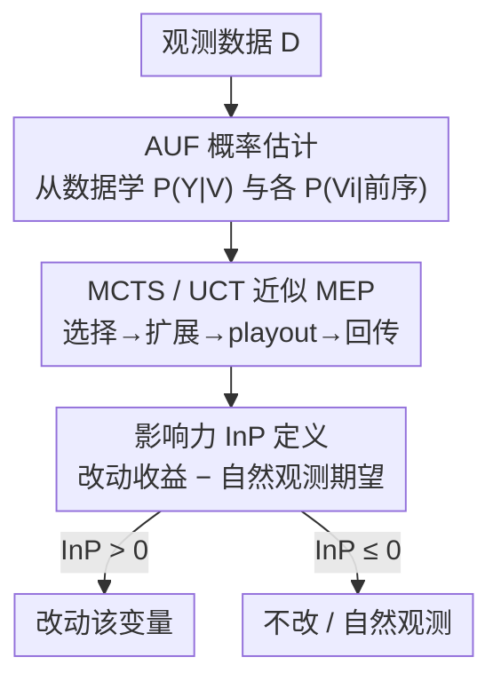

# On Measuring Influence in Avoiding Undesired Future

**会议**: ICLR 2026  
**OpenReview**: [https://openreview.net/forum?id=VHdF91MvJq](https://openreview.net/forum?id=VHdF91MvJq)  
**代码**: 待确认  
**领域**: 因果推断 / 决策  
**关键词**: 影响力度量、避免坏未来(AUF)、最大期望效用、因果效应、蒙特卡洛树搜索

## 一句话总结
本文为「避免坏未来」(AUF) 问题提出一个新的影响力度量 **influence power (InP)**——衡量「主动改动某个可操作变量」相比「让它自然发生」能把目标成功概率提高多少，并通过理论证明影响力与因果效应并不等价（弱因果甚至非因果变量也可能高度有用），最后用蒙特卡洛树搜索给出可从观测数据估计该量的实用算法。

## 研究背景与动机

**领域现状**：当一个预测模型预警「坏事即将发生」，单纯的预测已不够，我们想知道「该做什么去避免它」——这就是周志华提出的 AUF（avoiding undesired future）问题，它把机器学习从被动预测转向主动塑造未来。已有的 rehearsal learning 方法用「影响力」(influence) 这一介于统计关联与因果之间的概念来建模变量间关系并做决策。

**现有痛点**：尽管 rehearsal learning 在多个 AUF 场景里有效，但一个根本问题悬而未决——**到底怎么量化「影响力」？** 也就是说，给定一个可操作变量，怎么评估「改动它」对未来目标到底有多大用处？现有的 AUF 策略要么只看「单独改一个变量」能把成功概率提多高（Eq. 1），要么干脆「把所有可操作变量一起改」（Eq. 2）。

**核心矛盾**：传统因果强度度量（如平均因果效应 ACE）评估的是「静态环境下单次干预的孤立效果」，而 AUF 面对的是一个**会被决策反复重塑的动态世界**——历史数据里算出的因果强度，并不代表它对「未来目标」的真实影响。同时两种朴素策略各有盲区：Eq. 1 忽略了变量改动之间的**协同**（比如 $Y:=Z_1\wedge Z_2$ 时单改任一个都没用，必须一起改）；Eq. 2 忽略了变量的**自然性**（阳光充足时再补人工光毫无意义），而且某些变量怎么改都只会帮倒忙。

**本文目标**：给出一个既考虑变量可操作性、又考虑自然性、还考虑后续观测与改动相互作用的「影响力」量化指标，并厘清它和因果之间的真实关系。

**核心 idea**：把影响力定义为「在最大期望效用原则下，通过改动一个变量能把成功概率提高的幅度」，用一个类似 Bellman 方程的递归把「后续还能继续改 / 继续观测」的动态全部纳入进来。

## 方法详解

### 整体框架
本文研究一个由未知结构方程模型 (SEM) 生成的变量序列 $(V_1,\dots,V_d,Y)$，目标变量 $Y$ 的「期望落点」是集合 $S$；决策时部分变量 $X$ 已实现，要在剩余可操作变量 $Z$ 上做改动，让 $P(Y\in S)$ 最大。整篇方法分两层：**理论层**先定义影响力 InP 这个度量（基于一个叫 MEP 的递归），并证明它与因果效应/因果祖先并非互相蕴含；**估计层**再给出当 SEM 未知时，如何从观测数据 + 蒙特卡洛树搜索把这个量算出来。

估计侧是一条清晰的串行管线：先从观测数据学出各条件概率，再用 MCTS/UCT 搜索树把「后续不断改动与观测」的最大期望概率近似出来，最后按定义相减得到 InP，据此判断每个变量「该改还是不该改」。

### 关键设计

**1. 影响力 InP：用「最大期望概率」之差量化一个变量值不值得改**

本文先定义递归的**最大期望概率 (MEP)**：在已发生若干改动/观测后，对下一个变量 $V_{k+1}$，要么取「最优改动后能达到的最大成功概率」，要么取「让它自然发生、对其分布求期望」，两者取大——

$$P(Y\in S\mid V_k \overset{a}{=} v_k,\dots)=\max\Big\{\max_{v_{k+1}\in\Delta V_{k+1}} P(Y\in S\mid V_{k+1}\overset{a}{=}v_{k+1},\dots),\ \ \mathbb{E}_{v_{k+1}\sim P(V_{k+1}\mid \dots)}P(Y\in S\mid V_{k+1}=v_{k+1},\dots)\Big\}$$

这里 $V_i\overset{a}{=}v_i$ 表示「改动」（把结构函数替换成常值），与可对不可操作变量都适用的 $do(\cdot)$ 不同。在此之上，变量 $V_i$ 对 $Y$ 的**影响力**定义为：

$$\dot p(V_i,Y):=\max_{v_i\in\Delta V_i} P(Y\in S\mid V_i\overset{a}{=}v_i)-\mathbb{E}_{v_i\sim P(V_i)}P(Y\in S\mid V_i=v_i)$$

它就是「主动改到最优」相对「放任其自然」的 MEP 增益，取值范围 $[-1,1]$：正值说明改动有益，零或负值说明没必要甚至有害。这个定义直接回应了前面两个痛点——因为 MEP 递归地把「后面还能继续改、还能继续观测」都算进去了，所以变量间的**协同**与**自然性**自动被纳入，而不像 Eq. 1 只看一步、Eq. 2 一刀切全改。它只依赖概率项、不需要完整的 SEM，可看成 Bellman 方程的一个变体。

**2. 影响力 ≠ 因果：四种反直觉情形把 InP 和 ACE/祖先解耦**

这是本文最反直觉的贡献。定理 1 系统证明了：「是因果祖先 $X\in\mathrm{Anc}(Y)$」「平均因果效应 $\tau(X,Y)\neq 0$」与「影响力 $\dot p(X,Y)\neq 0$」三者**两两都不互相蕴含**，且因果强或是祖先都不保证 $\dot p\ge 0$。作者用四个二值 SEM 例子把这点钉死：

- **强因果祖先却零影响力**：链 $X\to Z\to Y$ 中 $\tau(X,Y)=0.64$ 很强，但因为下游 $Z$ 也可操作、理性机器总会把 $Z$ 设成 1，$X$ 的作用被「屏蔽」，$\dot p(X,Y)=0.9-0.9=0$。
- **非祖先却有正影响力**：医疗例子里皮试 $W$ 对康复 $Y$ 没有任何直接因果（$\tau=0$），但改动 $W$ 能让皮肤反应 $X$ 暴露出过敏基因 $U$ 的信息，从而指导更明智的用药 $Z$，$\dot p(W,Y)=0.68-0.518=0.162>0$。
- **弱因果祖先却有正影响力**：$\tau(X,Y)=0$（平均因果效应为零）的弱祖先，因为与 $Z$ 的协同，$\dot p(X,Y)=0.25>0$。
- **强因果祖先却负影响力**：$\tau(X,Y)=0.08$ 非零，但 $\dot p(X,Y)=-0.15<0$——观测 $X$ 本能透露 $U$ 的信息帮助后续 $Z$ 的决策，而「主动改 $X$」反而破坏了这条信息通道，得不偿失。

这组例子把「To do, or not to do」这个莎士比亚式难题量化了：**在动态决策里，该不该改一个变量，取决于它对整条后续决策链的隐性影响，而非它本身的因果强度**。

**3. MCTS/UCT 近似 MEP：把递归求值变成单人非确定性博弈**

MEP 的精确计算要穷举所有可能的改动/观测组合，当可操作变量多时不可行。本文把 MEP 计算建模成一个**单人非确定性博弈**，用 UCT（上置信树）做蒙特卡洛树搜索来近似。搜索树每个节点是「迄今的改动/观测序列 + 下一个待决策变量」，每条边代表对该变量「改动某个值」或「观测」的一个选择。每轮迭代走四步——**选择**（按 UCT 策略下行到叶节点）、**扩展**（给非终止叶节点为每个选择加子节点）、**playout**（从新节点随机走到终止态、算出 AUF 概率）、**回传**（把 AUF 概率沿路径回传更新统计）。UCT 的选择准则为

$$c^*_N=\arg\max_{c\in\Delta^+_N}\Big\{\hat p_{N,c}+\alpha\sqrt{\tfrac{\ln t_N}{t_{N,c}}}\Big\}$$

其中 $\Delta^+_N=\Delta_N\cup\{\varnothing\}$ 把「观测」也当作一个特殊选择 $\varnothing$。建树后，用根节点各选择的平均 AUF 概率近似 MEP，于是 $\dot p(V_i,Y)\approx\max_{c\in\Delta_{N_0}}\hat p_{N_0,c}-\hat p_{N_0,\varnothing}$。一个关键实用观察是：这是**anytime 算法**，且 AUF 决策往往不需要精确的影响力——只要近似值能正确判断「改还是不改」、或正确选出最优改动方向即可，所以**少量模拟就能给出决策一致的结果**（实验中误判率往往在数值未收敛前就先归零）。

**4. 从观测数据估计 AUF 概率：把改动写成 Dirac、给出一致性保证**

MCTS 的 playout 在终止态需要 AUF 概率，而当结构方程未知时这要从数据估。本文把联合分布按拓扑序分解 $P(\mathbf V,Y)=P(Y\mid\mathbf V)\prod_i P(V_i\mid V_1,\dots,V_{i-1})$，各条件概率用标准 ML 模型从观测数据学。对被改动的变量集合 $A$，用 Dirac delta $\delta(\cdot)$ 替换其条件项，未改动的保留自然条件项；再对未观测变量边缘化，得到「在改动 $A$、观测 $O$ 下」AUF 概率的通用表达式（Eq. 12）。**Proposition 1** 借助 Spirtes 等的 manipulation theorem 证明：在因果充分性（无未观测混杂）与正性假设下，该估计与 SEM 在相应改动/观测下规定的真实 AUF 概率**一致**。值得注意的是，因果充分性只用于「从数据估概率」这一步，论文其余部分不需要；而且**学习阶段可以用更丰富的观测，决策阶段允许部分可观测**（某变量在训练数据里有记录、但当前实例里缺失，如皮试例子），更贴近现实。

## 实验关键数据

### 主实验
在三个合成任务 (TRADER、FARMER、DOCTOR) 与一个真实任务 (BERMUDA) 上，比较六种选改动方法：OBSERVE（只观测不改）、MAX-ONE（Eq. 1 单改最优一个）、MAX-ALL（Eq. 2 全改）、CORR（按相关性选）、ACE（按因果效应选）、OURS（按正影响力选）。指标是成功率（目标落入期望域 $S$ 的频率），每任务 10000 样本、重复 10 次。

| 任务 | OBSERVE | MAX-ONE | MAX-ALL | CORR | ACE | OURS |
|------|---------|---------|---------|------|-----|------|
| TRADER | 37.62 | 51.01 | 50.82 | 47.73 | 51.13 | **60.94** |
| FARMER | 10.05 | 62.90 | 63.18 | 63.88 | 62.66 | 63.86 |
| DOCTOR | 39.81 | 50.76 | 51.08 | 51.33 | 50.93 | **65.32** |
| BERMUDA | 2.29 | 61.99 | 72.71 | 19.09 | 69.61 | **75.16** |

OURS 在大多数任务上明显领先：TRADER、DOCTOR 比次优高约 10–14 个百分点；真实非二值任务 BERMUDA 也以 75.16 超过 MAX-ALL(72.71) 与 ACE(69.61)。FARMER 上各法接近，原因是该任务目标只由单个关键变量决定，五种方法都正确识别出了它。

### 消融实验
样本量对 OURS 的影响（合成任务成功率 %）：

| 任务 | 10 | 50 | 100 | 500 | 1000 | 5000 |
|------|----|----|-----|-----|------|------|
| TRADER | 42.97 | 49.45 | 51.86 | 57.63 | 57.08 | 60.34 |
| FARMER | 19.23 | 31.80 | 60.49 | 62.16 | 63.22 | 63.62 |
| DOCTOR | 44.20 | 43.18 | 46.41 | 64.96 | 65.20 | 65.72 |

成功率随样本量上升、约在 **1000 样本**附近趋于平稳。

### 关键发现
- **影响力比因果效应更适合 AUF 决策**：按正影响力选改动 (OURS) 全面优于按因果效应 (ACE)、相关性 (CORR) 或一刀切全改 (MAX-ALL)，印证了「影响力 ≠ 因果」的理论洞察在实践中真有用。
- **决策一致先于数值收敛**：Figure 3 显示，随 MCTS 迭代增加，近似影响力与精确值的偏差持续下降；但**误判率（改/不改判断不一致）在偏差完全收敛前就已归零**，说明少量模拟就足以给出正确决策，呼应了 §4.1 的「粗近似够用」现象。
- **FARMER 例外**：当目标由单一关键变量主导时，各方法都能找到它，OURS 的优势不再明显——说明 InP 的价值主要体现在变量协同、信息揭示等复杂动态场景。

## 亮点与洞察
- **把「该不该做」量化成一个 $[-1,1]$ 的标量**：InP 用一个类 Bellman 递归把「后续还能继续改/继续观测」的全部动态收进来，正负号直接告诉你「改动有益 / 无益 / 有害」，比孤立的因果效应信息量大得多。
- **四个极简二值 SEM 反例堪称教科书级**：用最少的变量分别构造出「强因果零影响」「非祖先正影响」「弱因果正影响」「强因果负影响」，把影响力与因果的解耦讲得既严谨又直观，皮试-用药的医疗叙事尤其点睛。
- **可迁移的思路**：把「改动 vs 观测」统一为同一变量上的两种选择、并用 MCTS 在其上做单人博弈搜索，这套「不预设状态/动作划分」的建模方式，对那些无法「rewind and try again」的现实顺序决策（医疗、农业、风控）很有借鉴价值。

## 局限与展望
- **依赖因果充分性估概率**：Proposition 1 的一致性需要「无未观测混杂 + 正性」，存在隐藏混杂时从观测数据估的 AUF 概率可能有偏。
- **离散变量假设**：理论分析与多数例子设在离散（多为二值）变量上，BERMUDA 虽验证了非二值可行，但连续高维场景下 MCTS 的搜索代价与估计精度仍是开放问题。
- **只对比了 ACE**：作者坦言主要对照最常用的平均因果效应，与其他因果强度度量、以及反事实/动态治疗方案/因果 bandit 等框架的系统比较留待future work。
- **MCTS 预算与精度的权衡**：虽然「粗近似够用」是亮点，但何时安全地用少量模拟、误判率何时不会过早误收敛，缺乏理论刻画，论文本身也呼吁后续研究。

## 相关工作与启发
- **vs. rehearsal learning (Qin 2023 / Du 2024-2025)**：同属周志华提出的 rehearsal/influence 范式，但前者侧重「学一个能建模影响力的结构模型并优化决策」，本文首次给出**影响力本身的量化度量**与一致估计，补上了「怎么衡量影响力」这块缺口。
- **vs. 平均因果效应 ACE**：ACE 评估静态环境下单次干预的孤立效果；InP 评估的是「会被决策重塑的动态世界」里改动的整体价值，本文证明二者并不等价，且 InP 更契合 AUF 的前瞻性需求。
- **vs. 强化学习 / 动态治疗方案 / 因果 bandit**：RL 与动态治疗方案通常强行区分「状态」与「动作」变量、且允许 revisit；AUF 不允许「倒带重来」，本文把所有变量统一对待（可改可观），更贴合现实。因果 bandit 多需专家提供因果结构，本文则从观测数据出发。
- **vs. 反事实推理**：反事实问「过去若不同会怎样」，是回溯性的；AUF 是前瞻性的「为未来做规划」，两者关切的时间方向不同。

## 评分
- 新颖性: ⭐⭐⭐⭐⭐ 首次为 AUF 提出可量化、可估计的影响力度量，并证明影响力与因果的反直觉解耦。
- 实验充分度: ⭐⭐⭐⭐ 三合成+一真实任务、六基线、样本量与收敛分析齐全，但任务规模偏小、变量多为二值。
- 写作质量: ⭐⭐⭐⭐⭐ 用四个极简 SEM 例子把抽象度量讲得透彻直观，理论与叙事结合出色。
- 价值: ⭐⭐⭐⭐⭐ 为「主动避免坏未来」的决策提供了原则性工具，对医疗/农业等不可重来的顺序决策有现实意义。

<!-- RELATED:START -->

## 相关论文

- [\[ICLR 2026\] Influence without Confounding: Causal Discovery from Temporal Data with Long-term Carry-over Effects](influence_without_confounding_causal_discovery_from_temporal_data_with_long-term.md)
- [\[ICLR 2026\] NextQuill: Causal Preference Modeling for Enhancing LLM Personalization](nextquill_causal_preference_modeling_for_enhancing_llm_personalization.md)
- [\[ICLR 2026\] LLMs Struggle to Balance Reasoning and World Knowledge in Causal Narrative Understanding](llms_struggle_to_balance_reasoning_and_world_knowledge_in_causal_narrative_under.md)
- [\[ICLR 2026\] Learning Robust Intervention Representations with Delta Embeddings](learning_robust_intervention_representations_with_delta_embeddings.md)
- [\[ICLR 2026\] Action-Guided Attention for Video Action Anticipation](action-guided_attention_for_video_action_anticipation.md)

<!-- RELATED:END -->
