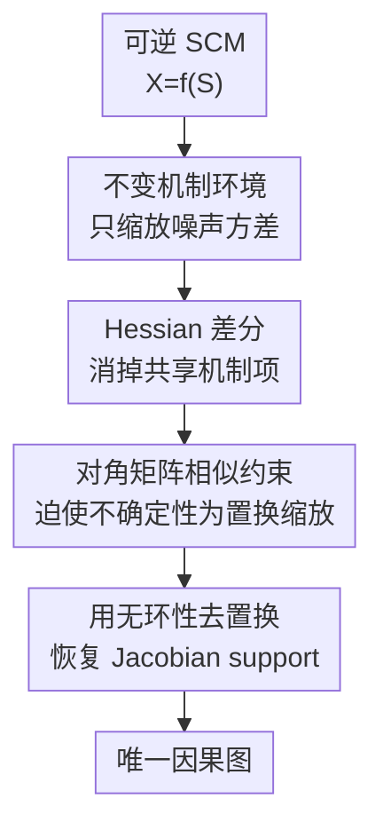

# On the Identifiability of Causal Graphs with the Invariance Principle

**会议**: ICLR2026  
**OpenReview**: [https://openreview.net/forum?id=ta8BKRa1bl](https://openreview.net/forum?id=ta8BKRa1bl)  
**代码**: https://github.com/francescomontagna/gaussian-multienv-cd.git  
**领域**: 因果推断  
**关键词**: 因果发现、多环境数据、不变性原则、因果图可识别性、非线性 ICA  

## 一句话总结

本文证明在机制不变、噪声分布跨环境发生足够方差缩放的条件下，任意非线性可逆结构因果模型的完整因果图可由基础环境加两个辅助环境唯一识别，并用跟随证明思路的合成实验验证了这一可识别性现象。

## 研究背景与动机

**领域现状**：因果发现希望从观测变量的联合分布恢复变量之间的有向因果结构。经典结果告诉我们，如果只有 i.i.d. 观测数据，问题通常只能识别到 Markov 等价类；要唯一恢复 DAG，往往需要额外假设，比如线性非高斯噪声、加性噪声模型、post-nonlinear 模型，或更多干预/多环境信息。

**现有痛点**：已有多环境因果发现理论虽然利用了“机制不变、分布改变”的思想，但完整图可识别性通常依赖较强模型限制，或者需要环境数量随节点数增长。特别是在任意非线性机制下，非线性 ICA 的可识别性结果通常需要较多辅助变量或环境；直接把这些结果搬到因果发现上，会给出比因果图恢复本身更强也更昂贵的要求。

**核心矛盾**：ICA 要恢复的是完整混合函数或独立源，在非线性场景里需要在整个定义域上识别 Jacobian 的具体数值；因果发现真正关心的是逆混合函数 Jacobian 的零非零模式，也就是每个变量是否依赖某个噪声源。这两个目标的信息需求并不相同，但过去很多理论没有充分利用这个差异。

**本文目标**：作者要回答一个更尖锐的问题：如果结构因果模型的机制在不同环境中保持不变，只允许独立噪声项的统计量改变，那么是否可以用常数个环境而不是随变量数增长的环境数，唯一识别整个因果图？

**切入角度**：论文从 SCM 与 ICA 的对偶关系切入。一个无潜混杂、可逆的 SCM 可以写成 $X=f(S)$，其中 $S$ 是相互独立的噪声源，$f$ 是由结构方程诱导的混合函数。因果图不需要恢复 $f^{-1}$ 的所有数值，只需恢复 $J_{f^{-1}}$ 的 support；如果能在某个忠实点上把这个 support 固定住，图结构就被固定住了。

**核心 idea**：利用多环境之间 log-likelihood Hessian 的差分消掉不变机制项，把环境方差变化转化为对 $J_{f^{-1}}$ support 的约束，从而证明两个足够不同的辅助环境就能识别任意非线性 SCM 的因果图。

## 方法详解

### 整体框架

这篇论文的“方法”主要是一套可识别性证明，而不是一个以性能为主的实用算法。整体逻辑是：先把 SCM 写成 ICA 形式 $X=f(S)$，再用不变机制环境构造同一个 $f$ 下不同源分布的观测分布，最后比较基础环境和辅助环境在源均值附近的 log-likelihood Hessian，证明任何能解释同一批环境分布的替代模型都只能拥有相同的逆 Jacobian support。

证明里的关键对象是两个模型之间的 indeterminacy function：若真实模型是 $f$，另一个同样解释数据的模型是 $\hat f$，则 $h=\hat f^{-1}\circ f$ 描述两者的差异。作者要证明，在源均值对应的点上，$J_h$ 只能是缩放加置换；再结合 DAG 的无环性去掉置换歧义，就能得到真实模型和替代模型有相同的 $J_{f^{-1}}$ support。

### 关键设计

**1. 把因果图恢复降到逆 Jacobian support：只识别结构，不强求完整 ICA**

论文首先明确了 SCM 与 ICA 的桥。结构方程写作 $X_i=F_i(X_{PA_i},S_i)$，在无潜混杂且机制可逆的情况下，所有观测变量可以统一表示为 $X=f(S)$，其中 $S_1,\ldots,S_d$ 相互独立。对因果发现来说，重要的不是把每个独立源精确还原出来，而是看 $f^{-1}$ 的第 $i$ 个分量是否依赖 $X_j$。在忠实性假设下，$J_{f^{-1}}(x)_{ij}=0$ 等价于 $X_j$ 不是 $X_i$ 的父节点。

这个降维很关键：非线性 ICA 需要在所有点上识别 Jacobian 的数值，因果发现只要在一个忠实点上识别零非零模式。作者选择源均值 $s=\mu_S$ 对应的观测点作为“探针点”，在这个点上分析 Hessian，从而把高维、全局的非线性函数识别问题压成一个局部矩阵 support 识别问题。

**2. 不变机制环境：用噪声方差变化提供额外约束**

多环境设置遵循不变性原则：所有环境共享同一个混合函数 $f$，只改变独立源的分布。具体地，辅助环境由 $S^e\overset{d}{=}L^eS$ 生成，$L^e=\mathrm{diag}(\lambda_1^e,\ldots,\lambda_d^e)$，也就是每个噪声源的尺度可以随环境变化，但因果机制不变。直观上，这相当于在不同实验条件下改变外生噪声强度，而不改变变量之间的因果方程。

这种设定比硬干预更弱：它不需要知道干预目标，也不改图结构，只要求不同环境的噪声统计量足够不同。理论里的“足够不同”由两个条件捕捉：每组辅助环境都要让每个源的方差发生非退化变化；并且由两组环境构造出的对角比值 $(\Omega_1^{-1}\Omega_2)_{ii}$ 两两不同。作者在附录里说明这些条件对随机选择的缩放系数几乎处处成立，排除的是精心调出来的病态环境。

**3. Hessian 差分：在源均值处把机制项消掉**

核心推导来自 log-density 的二阶导数。对任意环境 $e$，由变量替换可得 $p^e_X(x)=p^e_S(s)|J_{f^{-1}}(x)|$。直接对 $x$ 求 Hessian 时，会出现三类项：源 log-density 的 Hessian 经过 $J_{f^{-1}}$ 夹出来的项、log-determinant $\log |J_{f^{-1}}(x)|$ 的二阶导数项，以及源 score 与 $f^{-1}$ 二阶导数组合出来的项。

作者的关键观察是，环境间机制相同，所以基础环境和辅助环境的 Hessian 做差时，log-determinant 项会抵消；如果源噪声是高斯分布，并且在 $s=\mu_S$ 处评估，那么源 score 为零，最后那项也消失。于是对任意环境组 $E_l$ 都得到

$$
\sum_{e\in E_l}\left(D_x^2\log p(x)-D_x^2\log p^e(x)\right)
=J_{f^{-1}}(x)^T\Omega_lJ_{f^{-1}}(x),
$$

其中 $\Omega_l$ 是由源分布 Hessian 差分累加得到的对角矩阵。因为独立源的 log-density Hessian 是对角的，环境信息被浓缩成了两个对角矩阵 $\Omega_1,\Omega_2$，而因果结构信息留在 $J_{f^{-1}}$ 的左右两侧。

**4. 两组环境到唯一图：相似对角矩阵迫使不确定性只剩置换缩放**

考虑另一个替代模型 $\hat f$ 也能解释所有环境的观测分布。对真实模型和替代模型分别应用 Hessian 差分等式，可以得到同一个观测侧矩阵的两种分解。把两者通过 $h=\hat f^{-1}\circ f$ 连接起来后，会出现形如 $M^T\Omega_lM=\hat\Omega_l$ 的关系，进一步推出两个对角矩阵 $A=\hat\Omega_1^{-1}\hat\Omega_2$ 与 $B=\Omega_1^{-1}\Omega_2$ 相似。

如果 $B$ 的对角元素互不相同，那么它的特征向量只能对齐标准基；相似变换 $M$ 必须把一个标准基方向映到另一个标准基方向。因此 $M$ 只能是缩放乘置换。缩放不改变 support，置换则可以借助因果图无环性去除：正确的变量顺序会让逆 Jacobian 的结构对应一个 DAG，而错误置换会破坏这个结构。最终，任何替代模型都与真实模型拥有相同的 $J_{f^{-1}}$ support，因果图可识别。

### 一个完整示例

以二变量模型 $X_1=S_1, X_2=f(X_1,S_2)$ 为例，单个 i.i.d. 观测分布通常无法判断方向是 $X_1\to X_2$ 还是 $X_2\to X_1$。本文要求再有两个辅助环境：三个环境都共享同一个非线性机制 $f$，但 $S_1,S_2$ 的方差缩放不同，例如基础环境方差为 $(1,1)$，两个辅助环境分别让两个源以不同幅度变宽或变窄。

在每个环境中，算法先估计观测分布的 score 和 Hessian，再找出近似对应源均值的样本点。随后，它在这个点上计算基础环境与辅助环境的 Hessian 差分，并把两个环境组的差分矩阵组合成 $M\approx H_{diff,1}^{-1}H_{diff,2}$。如果数据真的来自机制不变、噪声缩放的 SCM，那么 $M$ 的特征向量会暴露 $J_{f^{-1}}$ 的方向结构；二变量时这就足以判断箭头方向。

这个示例也解释了为什么论文说“两辅助环境”足够：基础环境提供参照，两个辅助环境分别构成 $E_1$ 和 $E_2$，只要它们对每个源的缩放不同且不落入病态相等关系，就已经能形成区分不同源方向的对角比值约束。

### 损失函数 / 训练策略

论文主贡献是可识别性定理，没有神经网络训练目标。实验中的算法更像证明的数值化版本：输入是 $k$ 个环境、每个环境 $n$ 个 $d$ 维样本；先用 Stein gradient estimator 估计每个环境中 log-density 的 score 与 Hessian；再通过环境间 score 差最小的配对样本定位源均值对应的观测点；最后累加 Hessian 差分、求解线性系统并对矩阵 $M$ 做对角化，得到 $J_{f^{-1}}$ 的 support 估计。

需要强调的是，作者明确说明该算法不是论文的主要贡献，也不主张它是高维多环境因果发现的最佳实现。它的作用是把 Theorem 1 的证明步骤转成可运行流程，用来检验有限样本下理论约束是否能恢复因果方向。

## 实验关键数据

### 主实验

论文的主实验在二变量合成 SCM 上进行，每个环境 2000 个样本，环境数取 $k\in\{3,6,9\}$，每种配置跑 50 个随机种子。评价指标是结构汉明距离 SHD，二变量有边图里 SHD=0 表示方向推断正确，SHD=1 表示需要一次增删边或翻转边才能变成真图。

| 设置 | 噪声 / 机制 | 指标 | 主要结果 | 说明 |
|------|-------------|------|----------|------|
| 二变量任意非线性机制 (i)-(iii) | 高斯噪声，机制不属于 ANM/PNL/LSNM | Mean SHD | 接近 0 | 纯观测不可识别的设置下，多环境信息能恢复方向 |
| 线性高斯 SCM | 高斯噪声，纯观测不可识别 | Mean SHD | 接近 0 | 说明方差缩放环境能打破线性高斯方向歧义 |
| ANM / PNL / LSNM | 高斯噪声，纯观测已有识别条件 | Mean SHD | 接近 0 | 作为 sanity check，算法也能处理已知可识别模型 |
| 环境数 $k=3,6,9$ | 同上 | Mean SHD | 增加环境不总是改善 | 符合理论：两个辅助环境已足够，更多环境不是核心条件 |

### 消融实验

论文没有传统机器学习模型的模块消融，但附录给了几组对理论假设的压力测试：改变噪声分布、改变维度、比较随机因果序基线。它们相当于验证哪些假设对当前证明和算法实现最关键。

| 配置 | 关键指标 | 观察 | 解释 |
|------|---------|------|------|
| Gamma 噪声，$\alpha\in[0.5,1]$ | 二变量 Mean SHD | 多数设置推断失败 | 该分布缺少有限临界点，源 score 不容易在关键点消掉，违背证明机制 |
| Gamma 噪声，$\alpha\in[2,2.5]$ | 二变量 Mean SHD | 环境数增加后多数设置约有 80% 正确率 | 分布有内部极值点，支持“高斯性可能可放宽到 score 有临界点”的猜想 |
| 线性高斯多变量，10/20/50 节点 | Topological order divergence $D_{top}$ | 3 个环境已显著优于随机序；10 节点误差约降 75%，20 节点约降 45%，50 节点约降 30% | 线性情形 Hessian 可由协方差稳定估计，常数环境的理论优势在高维仍可见 |
| 非线性多变量，5 节点 | $D_{top}$ | 3 个环境比随机更好，加入更多环境未稳定降低误差 | 理论可识别不等于当前算法高维可扩展，非线性 Hessian 估计仍困难 |

### 关键发现

- 最重要的实验证据是：在任意非线性机制和线性高斯这两类纯观测不可识别的设置中，只要满足机制不变和噪声缩放差异，算法在二变量上能把 SHD 压到接近 0。
- 环境数从 3 增加到 6 或 9 并没有稳定带来更低误差，这一点反而支持论文的理论主张：可识别性来自“两组足够不同的环境”形成的矩阵相似约束，而不是简单堆环境数量。
- 非高斯实验给出一个有趣边界：不是“任何非高斯都可以”，而是要看 log-likelihood score 是否能在某点消掉。Gamma $\alpha\in[0.5,1]$ 的失败和 $\alpha\in[2,2.5]$ 的改善共同说明，高斯假设可能不是本质，但“存在合适临界点”对当前证明路线很本质。
- 高维实验区分了理论和算法：线性模型中 50 节点仍明显优于随机序，但非线性模型 10 节点就难以扩展。这说明 Theorem 1 是识别性贡献，而不是现成的高维因果发现工程解法。

## 亮点与洞察

- 论文最漂亮的地方是把“因果发现比 ICA 容易”这句话变成了可证明的差异：ICA 要恢复每个点上的混合函数，因果发现只需在一个忠实点上恢复 Jacobian support，因此环境数量可以从随维度增长降到常数。
- Hessian 差分的设计很简洁。机制不变让 log-determinant 项抵消，高斯均值让 score 项消失，剩下的正好是 $J_{f^{-1}}^T\Omega J_{f^{-1}}$。这个推导把抽象的不变性原则变成了可操作的矩阵约束。
- 两个辅助环境足够这一点很有理论冲击力。许多干预识别理论需要实验数量随节点数变大，而本文证明只要环境差异“足够丰富”，环境数本身可以与图大小无关。
- 这篇论文也提醒我们，多环境因果发现不一定要知道干预目标。只要能相信机制不变且外生噪声统计发生变化，环境差异本身就可能携带方向信息，这对基因扰动、单细胞、非平稳系统等场景有启发。

## 局限与展望

- 最大理论限制是高斯噪声。作者虽然讨论了可扩展到 log-likelihood 梯度存在临界点的分布，但对任意连续噪声分布，当前 Hessian 差分路线并不能直接成立。
- 模型假设仍然强：需要全局可逆、二阶可微的混合函数，需要无潜在共同原因，还需要在源均值处满足忠实性。真实数据里这些条件很难逐一验证。
- 实验主要是合成数据。因果发现领域确实缺少可靠 ground-truth 的真实多环境数据，但这也意味着论文目前更像理论验证，而不是实际应用证明。
- 算法扩展性有限。非线性高维场景下，score/Hessian 估计和源均值定位都很难，附录也显示 10 节点非线性 SCM 已经接近随机。这为后续工作留下了明确方向：如何把识别性定理转化为稳定、可扩展的估计算法。
- 多环境假设在应用中还需要更细的诊断工具。比如实际环境变化可能同时改变机制和噪声，或者只影响部分源；如何检验不变机制和足够 variability，是理论落地前必须解决的问题。

## 相关工作与启发

- **vs invariant causal prediction / 多环境因果发现**: Peters 等工作利用跨环境预测不变性识别目标变量的父节点或部分结构，本文则直接证明完整 DAG 在任意非线性 SCM 下可识别，条件是机制不变且噪声方差变化足够丰富。
- **vs BACKSHIFT / 线性多环境方法**: Rothenhäusler 等的 BACKSHIFT 与本文同样依赖环境变化带来的协方差/Hessian 信息，但主要限制在线性模型。本文把这种思想推广到可逆非线性 SCM，不过实用算法在高维非线性上仍未达到 BACKSHIFT 在线性场景里的成熟度。
- **vs LiNGAM**: LiNGAM 通过线性非高斯 ICA 去除线性模型的方向歧义；本文反过来允许高斯噪声，但用多环境方差变化来破除歧义，并把非线性机制纳入理论范围。
- **vs nonlinear ICA**: Hyvärinen & Morioka 等多环境非线性 ICA 结果通常需要环境数或辅助信息随源数量增长，目标是恢复源或混合函数。本文只恢复因果图 support，因此可以用常数个环境得到更弱但对因果发现刚好足够的识别结论。
- **启发**: 如果后续能发展不依赖精确 Hessian 估计的优化目标，或把“两个环境足够”的定理嵌入稀疏图学习框架，这篇论文可能成为高维多环境因果发现算法的新理论支点。

## 评分

- 新颖性: ⭐⭐⭐⭐⭐ 从 ICA 与因果发现目标差异出发，证明常数个环境识别任意非线性 SCM 完整图，理论角度很鲜明。
- 实验充分度: ⭐⭐⭐⭐☆ 实验能支持定理和假设边界，但主要是合成验证，真实数据与高维非线性算法仍不足。
- 写作质量: ⭐⭐⭐⭐☆ 主线清楚，关键推导解释到位；部分证明依赖较多矩阵和 ICA 背景，读者需要一定预备知识。
- 价值: ⭐⭐⭐⭐⭐ 对多环境因果发现的识别性理论很有价值，尤其是区分“恢复 ICA 源”和“恢复因果图”两类目标的信息需求。

<!-- RELATED:START -->

## 相关论文

- [\[ICLR 2026\] Self-Supervised Learning from Structural Invariance](self-supervised_learning_from_structural_invariance.md)
- [\[ICLR 2026\] Theoretical Guarantees for Causal Discovery on Large Random Graphs](theoretical_guarantees_for_causal_discovery_on_large_random_graphs.md)
- [\[ICML 2025\] Exogenous Isomorphism for Counterfactual Identifiability](../../ICML2025/causal_inference/exogenous_isomorphism_for_counterfactual_identifiability.md)
- [\[ICLR 2026\] Learning Dynamic Causal Graphs Under Parametric Uncertainty via Polynomial Chaos Expansions](learning_dynamic_causal_graphs_under_parametric_uncertainty_via_polynomial_chaos.md)
- [\[ICLR 2026\] Characterization and Learning of Causal Graphs with Latent Confounders and Post-treatment Selection from Interventional Data](characterization_and_learning_of_causal_graphs_with_latent_confounders_and_post-.md)

<!-- RELATED:END -->
