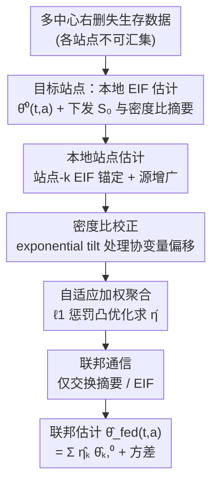

# Privacy-Protected Causal Survival Analysis Under Distribution Shift

**会议**: ICLR 2026  
**OpenReview**: [https://openreview.net/forum?id=aTxnsFFO7t](https://openreview.net/forum?id=aTxnsFFO7t)  
**代码**: https://github.com/yiliu1998/FuseSurv  
**领域**: 因果推断 / 生存分析 / 联邦学习  
**关键词**: 因果生存分析, 数据融合, 联邦学习, 分布偏移, 半参数效率, 双重稳健

## 一句话总结
针对"多中心生存数据不能直接汇集（隐私约束）、各站点分布又不一致"这一难题，本文用影响函数理论为每个外部源站点构造一个锚定到目标站点的局部估计量，再用带 $\ell_1$ 惩罚的凸优化自适应地给各源站点加权（对齐的源加权、有偏的源权重压到 0），全程只传摘要统计量，得到一个双重稳健、且只要有一个源一致就严格更高效的目标人群生存函数估计。

## 研究背景与动机

**领域现状**：临床研究中常常希望把多家机构的"事件时间"数据（如复发、死亡、HIV 感染）融合起来提升统计效率，尤其是罕见事件。但生存数据的因果数据融合方法远不如连续/二值结局成熟——现有联邦因果推断工作（Han et al. 2023/2024/2025 等）几乎都针对连续、有序或二值结局，而生存数据带有右删失（right censoring），处理起来本质更难。

**现有痛点**：把多站点生存数据做因果融合，现有路线各有硬伤。一是直接汇集（pooling）：当各站点的协变量、结局或删失机制存在偏移时，朴素汇集会引入偏差、结论失真。二是依赖强假设：Cox 比例风险模型强加 log-linear 风险结构，或要求"共同条件结局分布"（CCOD，即给定协变量后事件时间分布与站点无关）跨站点成立——这类同质性假设在异质人群里经常被违背，一旦违背，估计和推断都有偏。三是隐私：带时间戳的事件历史在 GDPR/HIPAA 下属于可识别信息，原始轨迹根本不允许跨机构共享；而现有保护隐私的生存方法很稀少。

**核心矛盾**：想借外部源站点的信息提效，就得假设它们和目标站点"足够像"（CCOD）；可一旦像得不够，借来的信息反而把目标估计带偏——这是"提效"与"保真"之间的根本张力。再叠加"原始数据不能出门"的隐私墙，问题变成：如何只用摘要统计量，在不知道哪些源站点可信的前提下，自动地吸收可信源、剔除有偏源？

**本文目标**：估计目标站点（$R=0$）特定治疗下的生存函数 $\theta_0(t,a)=P(T(a)>t\mid R=0)$，要求：(i) 不汇集原始数据；(ii) 容忍协变量/结局/删失三类分布偏移；(iii) 双重稳健 + 半参数有效；(iv) 只要至少一个源一致，就比"只用目标站点"严格更高效。

**切入角度**：作者不去假设全局 CCOD，而是退一步——为每个源站点单独 posit 一个"站点 $k$ CCOD"假设来**推导**该源的影响函数，得到锚定到目标的局部估计量；这个假设是否成立留给后面的自适应加权去检验和纠正。这样把"该不该信这个源"从一个先验假设变成一个数据驱动的、可被自动归零的权重。

**核心 idea**：用影响函数（EIF）为每个源造一个"目标锚定 + 源增广"的局部估计量，再用 $\ell_1$ 凸优化把各源对齐到目标分布、自动稀疏化掉有偏源，全程仅交换摘要统计量。

## 方法详解

### 整体框架

方法是一套联邦学习流水线（McMahan et al. 2017 范式）：目标站点先算出"只用本地数据"的半参数有效估计，并把目标侧的 $S_0$ 条件生存模型参数和估计密度比所需的摘要统计量下发给各源站点；每个源站点在本地用 EIF 算出一个锚定到目标的局部估计量 $\hat\theta_n^{k,0}(t,a)$ 及其影响函数；这些 EIF 被送到一个"主分析中心"，中心解一个带 $\ell_1$ 惩罚的凸优化得到时间、治疗特定的权重 $\hat\eta_{t,a}$，最终的联邦估计是各局部估计的加权平均。整条链路只传摘要级信息，原始参与者数据从不离开本地。

### 关键设计

**1. 站点-k CCOD 下的 EIF：目标锚定 + 源增广的局部估计量**

针对"全局 CCOD 经常不成立"这个痛点，作者不假设所有站点同分布，而是对每个源 $k$ 单独 posit 一个"站点 $k$ CCOD"假设（$S_k(t\mid a,X)=S_0(t\mid a,X)$ 几乎处处），**仅用于推导**该源的半参数 EIF（Theorem 2.5）：

$$\varphi^{*k,0}_{t,a}(O;P)=\underbrace{\frac{I(R=0)}{P(R=0)}\{S_0(t\mid a,X)-\theta_0(t,a)\}}_{\text{用目标数据的锚定项}}-\underbrace{\frac{I(R=k)}{P(R=k)}\,\omega_{k,0}(X)\,S_k(t\mid a,X)\frac{I(A=a)}{\pi_k(a\mid X)}H_{t,a}(O;S_k,G_k)}_{\text{用源数据的增广项}}.$$

锚定项只吃目标站点数据、用条件生存模型 $S_0$ 把估计钉在目标人群上；增广项才去吸收源 $k$ 的信息，并用密度比 $\omega_{k,0}(X)=P(X\mid R=0)/P(X\mid R=k)$ 把源协变量分布"搬"到目标分布。其中 $H_{t,a}$ 是处理删失的逆概率加权零均值残差（式 1）。这样设计的好处是双重稳健（Theorem 2.8）：在任一时间点上，只要 (i) 条件生存模型 $S_k$ 正确，或 (ii) 其它讨厌函数 $G_k,\pi_k,\omega_{k,0}$ 正确，二者之一即可保证 $\hat\theta_n^{k,0}$ 一致——密度比设错只通过一个二阶乘积型余项进入，不致命。这正好把"该不该信源 $k$"从硬假设变成可容错的局部估计。

**2. 指数倾斜密度比：在隐私约束下校正协变量偏移**

增广项里的密度比 $\omega_{k,0}(X)$ 是用来纠正协变量分布偏移的关键，但估计它又不能把原始协变量送出门。作者采用指数倾斜模型（Remark 2.7）$\omega_{k,0}(X)=\exp(\gamma_k'\psi(X))$，其中 $\psi(\cdot)$ 是协变量的一组基函数（最简单取 $\psi(X)=X$，可加高阶项捕捉非线性）。用极大似然估 $\gamma_k$ 时，**只需把目标站点的样本均值 $\mathbb{E}[\psi(X)]$ 共享给源站点**即可，原始数据不出本地。更灵活的非参/机器学习密度比也可用，但代价是要共享协方差矩阵等更高维摘要——"模型越灵活、要泄露的信息越多"在这里被明确权衡。这一设计让协变量偏移校正与隐私保护得以共存。

**3. $\ell_1$ 惩罚凸优化聚合：自动剔除有偏源、保留有效源**

有了各源的局部估计后，怎么聚合才能"宁缺毋滥"？作者定义站点差异度 $\hat\chi_{n,t,a}^{k,0}=\hat\theta^{k,0}(t,a)-\hat\theta^0(t,a)$（源估计与目标估计之差，越大越说明该源有偏），并解一个带 $\ell_1$ 惩罚的约束凸优化（式 2）：

$$Q(\eta_{t,a})=\mathbb{P}_n\Big[\big(\hat\varphi^{*0}_{t,a}-\textstyle\sum_{k\ge1}\eta_{t,a}^k\hat\varphi^{*k,0}_{t,a}\big)^2\Big]+\frac{1}{n\lambda}\sum_{k\ge1}|\eta_{t,a}^k|\,(\hat\chi_{n,t,a}^{k,0})^2,$$

约束 $\eta_{t,a}^k\ge0$ 且 $\sum_k\eta_{t,a}^k=1$，$\lambda$ 由交叉验证选。二次项让"EIF 与目标分布对齐"的源贡献更多；$\ell_1$ 惩罚的权重是 $(\hat\chi^{k,0}_{n,t,a})^2$——差异越大的源被罚得越狠，权重被**直接驱动到 0**（而非 $\ell_2$ 那样只缩小不归零），从而诱导稀疏、渐近只纳入信息有效的源（oracle 选择集）。最终联邦估计 $\hat\theta_n^{\text{fed}}(t,a)=\sum_{k=0}^{K-1}\hat\eta_{t,a}^k\hat\theta_n^{k,0}(t,a)$。理论上（Corollary 2.11）其渐近方差不大于"只用目标"的估计，且只要至少一个源一致，就严格更高效。

**4. 仅摘要级的联邦通信协议**

为满足 GDPR/HIPAA，作者明确约束所有步骤只传摘要、绝不传原始轨迹（Remark 2.9, Algorithm 1）：源站点只收到目标侧 $S_0$ 模型参数与密度比模型的摘要统计；主分析中心只收到各站点的 EIF。$\lambda$ 在中心集中用交叉验证选，站点间不需要额外通信。这与"完全去中心化、站点两两交互达成共识"的方案不同，也与只用粗粒度人群级摘要、且常常瞄准汇集人群的传统 meta-analysis 不同——后者在本设置下信息量不足。代价是通信量随评估时间网格 $n_\tau$ 线性增长（$O(n\cdot n_\tau)$），作者把平滑化留作未来工作。

### 损失函数 / 训练策略

核心优化目标即式 2 的 $Q(\eta_{t,a})$，对每个 $(t,a)$ 在细时间网格 $\{0,\epsilon,\dots,\tau\}$ 上分别求解。讨厌函数（$S_k,G_k,\pi_k,\omega_{k,0}$）用 $M$ 折交叉拟合（cross-fitting）+ 集成学习（Kaplan–Meier、Cox、生存随机森林经 survSuperLearner 集成；倾向分与密度比经 SuperLearner 集成 logistic 回归与 LASSO）估计，以放宽参数假设并保持快收敛率。联邦估计方差 $\hat V_{t,a}^{\text{fed}}$ 由其影响函数给出，支撑 Wald 型置信区间。

## 实验关键数据

### 主实验（模拟研究）

设置 $K=5$ 个站点，目标 $n_0=300$，源 $n_k\in\{300,600,1000\}$，500 次重复；对比 FED（本文）、TGT（仅目标）、POOL（朴素汇集）、IVW（逆方差加权）、META-IVW（带密度比校正的 meta 分析）。指标含偏差、RRMSE（相对 TGT 的 RMSE，<1 即提效）与 95% 覆盖率 CP%。下表为 day-30 治疗臂（$A=1$）、good overlap 下代表性 RRMSE：

| 场景 | FED | TGT | META-IVW | IVW | POOL |
|------|-----|-----|----------|-----|------|
| Homogeneous | 0.41 | 1 | 0.16 | 0.07 | 0.06 |
| Covariate Shift | 0.51 | 1 | 0.27 | 0.47 | 0.62 |
| Outcome Shift | 0.43 | 1 | 4.32 | 5.34 | 6.04 |
| Censoring Shift | 0.42 | 1 | 0.24 | 0.11 | 0.06 |
| All Shift | 0.54 | 1 | 0.40 | 12.81 | 14.64 |

FED 在所有场景偏差都可忽略，RRMSE 最高减小约 59%；POOL/IVW/META-IVW 在结局偏移或全偏移下 RRMSE 爆炸（>4 甚至 >14），说明它们被有偏源带坏。

### 覆盖率对比（CP%，good overlap，day-30）

| 方法 | Homogeneous | Covariate | Outcome | Censoring | All Shift |
|------|-------------|-----------|---------|-----------|-----------|
| FED | 89.8 | 90.6 | 92.2 | 91.2 | 92.0 |
| TGT | 92.2 | 92.4 | 92.2 | 92.0 | 90.6 |
| META-IVW | 83.4 | 74.6 | 1.6 | 90.2 | 48.4* |
| POOL | 97.0 | 96.6 | 0.0 | 95.0 | 0.0 |

FED 与 TGT 的 CP% 都贴近 95%，验证了基于影响函数的方差估计；而 POOL/META-IVW 在 Outcome Shift 下覆盖率崩到接近 0（*跨子图取值，以原文为准）。

### 关键发现
- **自适应权重确实在工作**：诊断显示联邦权重 $\hat\eta_{t,a}$ 随站点偏差度 $(\hat\chi_{n,t,a}^{k,0})^2$ 增大而系统性下降——协变量/结局偏移时目标站点自己拿到更高权重，有偏源被压低或剔除。
- **早期时间点提效更大**：站点生存曲线在早期更接近目标、源 EIF 对齐更好时效率增益最大；limited overlap 下 FED 提效更明显（源数据更好的 overlap 稳住了源估计）。
- **删失偏移是例外**：POOL/IVW 在 Censoring Shift 下表现尚可，因为删失作为讨厌函数在各站点单独估计，对站点间删失异质性不敏感。
- **真实数据（AMP HIV-1 预防试验）**：4611 名参与者、4 个区域（SA/OA/BP/US）、80 周 HIV 诊断为终点（罕见事件，发病率 3.77%）。以 SA 为目标时，OA 与 SA 最像、获最高权重，BP/US 因基线风险分、体重、HIV 患病率差异大而被降权；FED 在 TGT 因早期有效样本不足无法给出有效区间时，仍能借对齐源恢复出更窄的区间。

## 亮点与洞察
- **把"该不该信这个源"做成可归零的权重**：用站点-k CCOD 仅推导 EIF、再用 $\ell_1$ 差异惩罚自动剔除违背假设的源，绕开了"必须先验假设全局同质"的死结——这是从硬假设到数据驱动选择的范式转变，可迁移到任何多源数据融合任务。
- **隐私与统计严谨同时拿到**：双重稳健 + 半参数有效是统计上的强保证，而指数倾斜密度比只需共享样本均值，让"严谨"和"原始数据不出门"不再二选一。
- **目标锚定的结构很巧**：EIF 拆成"目标锚定项 + 源增广项"，源数据只通过增广项进入，天然保证了目标估计的有效性不被有偏源破坏，再坏的源最多是权重归零、不会污染锚点。
- **退化关系清晰**：去掉时间与删失、把生存结局换成 $I(T(a)>\tau)$ 时，方法退化为 Han et al. (2025) 的 FACE 估计量，说明它是连续/二值结局数据融合在生存场景的自然且严谨的推广。

## 局限与展望
- **协变量自适应加权仍有空间**：当前时间特定权重虽灵活，但可能产生不光滑的权重轨迹，且在连续时间下通信量随网格 $n_\tau$ 线性增长（$O(n\cdot n_\tau)$），需要平滑化策略。
- **CCOD 失败且允许汇集时的开放问题**：当数据可共享但 CCOD 不成立，是否存在任何方法（含汇集）能胜过目标-only 半参数有效估计与本文方法，作者也未给出答案，提示可在牺牲正则性换效率的方向更激进地借信息。
- **正定性（positivity）违背**：若某些站点两治疗组协变量分布系统性不同、或部分人不符合某治疗，目标估计量会不可识别，密度比估计在协变量重叠有限时也变难、需额外敏感性分析。
- **未覆盖时变协变量**：框架目前不处理 time-varying covariates，扩展到此是明确的未来方向。

## 相关工作与启发
- **vs META-IVW / IVW**：传统 meta 分析用逆方差加权聚合各站点估计（可能再做密度比校正），隐含要求条件同质性；本文用 $\ell_1$ 惩罚把有偏源权重归零、且锚定到目标人群，在结局偏移下不崩，而 META-IVW 的 RRMSE 会飙到 >4。
- **vs POOL（朴素汇集）**：汇集在同质时方差最小，但任何协变量/结局偏移都会引入大偏差、覆盖率掉到接近 0；本文牺牲一点方差换取分布偏移下的稳健与有效区间。
- **vs FACE (Han et al. 2025)**：FACE 针对二值/连续结局；本文是其在右删失生存结局上的推广，引入产品积分表示统一离散/连续时间，并新证了站点-k CCOD 下的半参数效率界（密度比与其它讨厌函数的交互是此前未探索的理论成分）。
- **vs FedECA (Ogier du Terrail et al. 2025)**：FedECA 面向单臂试验的联邦外部对照、用 IPW-Cox；本文处理更一般的多源双臂融合，并以 EIF + 集成学习放宽假设。
- **vs 单站点生存方法（Cox / TMLE / C-TMLE / DML）**：这些方法聚焦单研究，本文回答了"如何跨多源、在隐私约束下融合生存数据"这一它们未触及的问题。

## 评分
- 新颖性: ⭐⭐⭐⭐⭐ 首个把双重稳健 + 半参数有效 + 自适应源选择 + 隐私保护同时做进因果生存数据融合的工作。
- 实验充分度: ⭐⭐⭐⭐ 五类偏移场景 + 两个真实医学数据集，但主要是统计模拟，规模不大。
- 写作质量: ⭐⭐⭐⭐ 理论严谨、定理与算法清晰，但符号密度高、对非统计背景读者门槛较高。
- 价值: ⭐⭐⭐⭐⭐ 直击多中心临床数据"想融合又不能共享"的真实痛点，附 R 包 FuseSurv，落地性强。

<!-- RELATED:START -->

## 相关论文

- [\[ICLR 2026\] Conformalized Survival Counterfactuals Prediction for General Right-Censored Data](conformalized_survival_counterfactuals_prediction_for_general_right-censored_dat.md)
- [\[NeurIPS 2025\] Cyclic Counterfactuals under Shift–Scale Interventions](../../NeurIPS2025/causal_inference/cyclic_counterfactuals_under_shift-scale_interventions.md)
- [\[ICLR 2026\] SelfReflect: Can LLMs Communicate Their Internal Answer Distribution?](selfreflect_can_llms_communicate_their_internal_answer_distribution.md)
- [\[ICLR 2026\] Efficient and Sharp Off-Policy Learning under Unobserved Confounding](efficient_and_sharp_off-policy_learning_under_unobserved_confounding.md)
- [\[ICML 2025\] Doubly Protected Estimation for Survival Outcomes Utilizing External Controls for Randomized Clinical Trials](../../ICML2025/causal_inference/doubly_protected_estimation_for_survival_outcomes_utilizing_external_controls_fo.md)

<!-- RELATED:END -->
