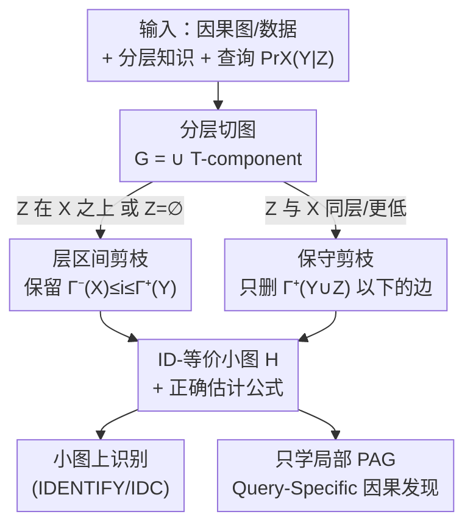

# Query-Specific Causal Graph Pruning under Tiered Knowledge

**会议**: ICLR 2026  
**OpenReview**: [https://openreview.net/forum?id=bOfiLeoUJf](https://openreview.net/forum?id=bOfiLeoUJf)  
**代码**: 无  
**领域**: 因果推断  
**关键词**: 因果识别, 图剪枝, 分层知识, 因果发现, 可识别性

## 一句话总结
本文提出一种利用「分层知识」(tiered knowledge) 从因果图中**删边**的方法，在保持 (条件) 因果效应可识别性不变的前提下，把识别问题约简到一张更小的子图上，并据此设计了一个 query-specific 因果发现算法，相比已有方法可获得指数级加速。

## 研究背景与动机
**领域现状**：因果识别 (causal identification) 是回答干预型查询 (如 $\Pr_X(Y)$、$\Pr_X(Y\mid Z)$) 的标准手段——给定因果图 $G$ 和观测分布 $\Pr(V)$，判断查询是否被唯一确定 (可识别性问题)，并在可识别时给出估计公式。已有的 IDENTIFY、ID、do-calculus、IDC 等算法在这件事上已经 sound 且 complete。

**现有痛点**：这些算法的可识别性结论和估计公式都**强依赖整张因果图**。而在实践中，整张图要么得靠人手工标注每条边的方向 (图大时工作量巨大、很多边方向还未知)，要么得用因果发现算法从数据里学 (学整张 PAG 的计算开销随变量数爆炸式增长)。也就是说，「为了回答一个具体查询，却必须先把整张图弄到手」这件事本身就是瓶颈。

**核心矛盾**：回答一个**具体**因果查询，其实只用得到图的一小块；但现有流程不区分「查询相关」和「查询无关」的边，一律要求完整指定/学习整张图，造成大量无谓的标注与计算。

**本文目标**：① 刻画在什么条件下可以从因果图里删边而不破坏给定 (条件) 因果效应的可识别性；② 把识别问题约简到这张被剪枝的小图上 (并给出仍然正确的估计公式)；③ 把剪枝当作预处理，加速从数据学图的因果发现。

**切入角度**：作者注意到很多实际场景天然带有**分层知识**——变量被划分成有先后因果序的若干「层」(tier)，只允许高层指向低层的有向边 (典型如时间序列里按时间步排序、外生的背景/上下文变量等)。这种结构信息此前主要被用来约束因果发现的搜索空间，本文却用它来**判断哪些边对当前查询无关、可以安全删掉**。

**核心 idea**：把因果图按层分解成若干 T-component，对查询 $\Pr_X(Y\mid Z)$ 只保留落在 $[\Gamma^-(X),\Gamma^+(Y)]$ 这段层区间内的边，其余删去，得到一张与原图「ID-等价」的小图，再在小图上跑识别与发现。

## 方法详解

### 整体框架
本文要解决的是：给定一个 (条件) 因果效应查询，如何**不指定整张因果图**就完成识别。整体思路分三步走。第一步，借助分层知识把图按层切成 $t$ 个 **T-component** $G_1,\dots,G_t$ (第 $i$ 个 T-component 收集所有「两端最大层号 = $i$」的边)，整张图正好是它们的并 $G=\bigcup_i G_i$。第二步，对一个具体查询，只保留若干「与查询相关」的 T-component 拼成剪枝图 $H$，并证明 $H$ 与原图 $G$ 在该查询上**ID-等价** (识别结论相同)，同时给出一条在 $H$ 上算、却对 $G$ 也正确的估计公式。第三步，把这套剪枝从「已知因果图」推广到「PAG / 因果发现」场景：因为只需要学剪枝后的「局部 PAG」，所以能跳过大量条件独立性检验，从而加速。

整个流程是「分层切图 → 按查询选层剪枝 → 在小图上识别 / 在小图上学图」的串行管线，且分支取决于条件集 $Z$ 落在哪一层，适合用框架图表达：

### 关键设计

**1. T-component 分解：把分层知识翻译成可剪枝的图结构单元**

要按查询删边，先得有一种「按层组织边」的方式。作者沿用 Andrews 等人的定义，把第 $i$ 个 T-component $G_i$ 定义为：包含图中全部变量、但只保留满足 $\max\{\Gamma(l),\Gamma(r)\}=i$ 的边 $(l,r)$ 的子图，其中 $\Gamma(X)$ 是变量 $X$ 所在层号。直观说，一条边归属于「它两端里较低 (层号较大) 那一端所在的层」。关键性质是任何带分层知识的因果图都能被无损分解为这些 T-component 的并 $G=\bigcup_{i=1}^t G_i$。这一步本身不是「贡献」，但它是后续所有剪枝的承载结构——剪枝在本文里就等于「丢掉某些 T-component」。

**2. 因果效应的层区间剪枝：识别只需要 $[\Gamma^-(X),\Gamma^+(Y)]$ 这几层**

针对无条件因果效应 $\Pr_X(Y)$，本文的主结果 (Proposition 3.2) 指出：令 $H$ 为所有满足 $\Gamma^-(X)\le i\le\Gamma^+(Y)$ 的 T-component $G_i$ 之并，则 $\Pr_X(Y)$ 在 $G$ 中可识别 **当且仅当** 在 $H$ 中可识别，且可用如下公式计算：

$$\Pr_x(y)=\sum_{w\setminus y}\Pr(w)\cdot\mathrm{IDENTIFY}_H\big(x\cup w,\ y\setminus w\big)$$

其中 $W$ 是层号严格小于 $\Gamma^-(X)$ 的那些变量。这里 $\Gamma^-(X)=\min_{X\in X}\Gamma(X)$、$\Gamma^+(Y)=\max_{Y\in Y}\Gamma(Y)$。它的意义是：**比治疗变量更高的层、以及比结果变量更低的层，对识别这个效应完全无关，可以整层删掉**。值得强调一个易踩的坑——剪枝图必须保留**跨层边** (如 $A_1\to C_1$)：一来从数据学剪枝图时漏掉跨层边会引入假阳性边 (例如忽略 $C_3\to D_2,\ C_3\to D_3$ 会让 $D_2,D_3$ 之间冒出一条伪边)，可能改变识别结论；二来跨层边携带的父子关系能让估计公式更简洁。此外作者证明了这对边界是**紧的** (Proposition 3.3)：把 $\Gamma^-(X)$ 调高或把 $\Gamma^+(Y)$ 调低再多删边，可识别性就可能被破坏。一个有意思的推论 (Proposition 3.4) 是：存在一类图，原图随层数增加无限变大，而用于识别固定查询的剪枝图大小却**恒定不变**。

**3. 条件因果效应的双档剪枝：按 $Z$ 的层位分两种剪法**

条件因果效应 $\Pr_X(Y\mid Z)$ 的剪枝更微妙，因为剪法依赖条件变量 $Z$ 落在哪一层。本文给两条互补的命题。其一 (Proposition 3.5)：当 $\Gamma^+(Z)<\Gamma^-(X)$ (即 $Z$ 全在治疗变量之上) 时，仍用层区间 $[\Gamma^-(X),\Gamma^+(Y)]$ 拼出的 $H$ 即可，且

$$\Pr_x(y\mid z)=\frac{\Pr_x(y,z)}{\Pr(z)}$$

其中分子 $\Pr_x(y,z)$ 把 $Z$ 并入结果集后套用 Proposition 3.2 来估计，分母 $\Pr(z)$ 直接从观测分布读出。但这条剪枝**只在 $Z$ 在 $X$ 之上时成立**——作者用 $\Pr_{B_1}(C_1\mid B_2,B_3)$ 这个反例说明：当 $Z$ 与 $X$ 同层或更低时 ($\Gamma^+(B_2,B_3)=\Gamma^-(B_1)$)，原图里**不可识别**的查询在错误剪枝后会**假性变成可识别**，结论被翻转。为兜住这种情况，其二 (Proposition 3.6) 给出一条更保守但**永远适用**的剪法：令 $H$ 为所有 $i\le\Gamma^+(Y\cup Z)$ 的 T-component 之并 (即只删掉 $Y\cup Z$ 最低层以下的边)，则识别结论保持不变，且 $H$ 上算出的任何公式对 $G$ 也正确。两条命题合起来：能用紧剪枝时用紧的，不满足条件时退回保守剪枝，保证安全。

**4. Query-Specific 因果发现：只学剪枝后的局部 PAG 以换取指数加速**

前三个设计假定因果图已知；当图得从数据学时，本文把剪枝当作**预处理**接到因果发现里 (Algorithm 1)。它在 Andrews 等人的 FCITIERS 算法前加了一段预处理 (算法第 1–6 行)：根据查询和 $Z$ 的层位，先按 Proposition 3.2–3.6 算出剪枝后还剩哪些 T-component (若 $Z=\emptyset$ 或 $\Gamma^+(Z)<\Gamma^-(X)$，取 `maxTier`$=\Gamma^+(Y)$、`minTier`$=\Gamma^-(X)$；否则取 `maxTier`$=\Gamma^+(Y\cup Z)$、`minTier`$=1$)，然后只对这些剩余 T-component 逐个调用 `FCIEXOGENOUS` 学边，拼成一张**局部 PAG**，而不是整张 PAG。作者证明该算法 sound 且 complete (Proposition 4.1)：当观测分布反映真图的全部条件独立性时，它返回的恰是「对完整最大信息 PAG 按 Prop 3.2–3.6 剪枝」的结果。加速来源在于：高层里往往集中了大量边，把它们整片剪掉就省掉了为学这些边而做的、数量呈指数级的条件独立性检验。理论上 (Proposition 4.2) 存在一类 2 层、$n$ 节点的实例，FCITIERS 需 $O(n^2\cdot 2^n)$，而本算法只需 $O(n^4)$。

## 实验关键数据

### 主实验
实验目标是验证 query-specific 发现 (Algorithm 1，学局部 PAG) 相比 FCITIERS (学完整 PAG) 的计算效率。设置：随机生成 $T\in\{5,6,7,8,9,10\}$ 层的因果图，每层 10 个变量 (2 或 3 个状态)，每个变量随机最多 5 个父节点、邻居数上限 4，30% 的层内有向边随机转为双向边；随机参数化后采样 500,000 条数据；查询随机取 3 个治疗、3 个结果、条件集大小 $\{0,1,2,3\}$，每个配置 30 次取平均。

| 对比维度 | FCITIERS (完整 PAG) | Algorithm 1 (局部 PAG) | 结论 |
|--------|------|------|------|
| 执行时间 (所有配置) | 基线 | 更短 | 全面更快 |
| 层数 $T$ 增大 | 增长更快 | 增长慢 | 差距随层数拉大 |
| 渐进复杂度 (2 层最坏例) | $O(n^2\cdot 2^n)$ | $O(n^4)$ | 指数级 → 多项式 |

### 消融 / 分析实验

| 配置 (条件集大小) | 现象 | 说明 |
|------|---------|------|
| $\lvert Z\rvert=0$ (退化为因果效应) | 加速最明显 | 剪枝空间最大 |
| $\lvert Z\rvert$ 增大 (1→3) | 加速幅度缩小 | $\Gamma^+(Z)<\Gamma^-(X)$ 越难满足，可剪的边越少，更多查询退回 Prop 3.6 保守剪枝 |
| 邻接/箭头 precision & recall (附录 Table 1) | 与 FCITIERS 相当 | 验证 Algorithm 1 的 soundness & completeness，加速不以牺牲正确性为代价 |

### 关键发现
- **加速来自「剪掉高层」**：层数越多、查询越靠近低层，可剪的高层边越多，提速越显著——这与 Proposition 4.2「边集中在高层时指数加速」的理论解释一致。
- **条件集是双刃剑**：$Z$ 越大越可能触碰 $\Gamma^+(Z)<\Gamma^-(X)$ 的边界条件，被迫从紧剪枝 (Prop 3.5) 退回保守剪枝 (Prop 3.6)，可剪边减少，加速缩水。
- **正确性无损**：局部 PAG 与完整 PAG 在邻接/箭头的 precision、recall 上持平，说明剪枝是「省算力而非降精度」。

## 亮点与洞察
- **把「背景知识」从约束搜索空间升级为简化目标图**：以往分层知识只是给因果发现加约束，本文证明它还能直接缩小识别所需的图——这是一个看待背景知识价值的新角度。
- **删边 vs 删点**：经典的 (functional) projection 是删**变量**且要求整张图已知；本文删**边**且只要有分层知识就能用，无需指定/学习整张图，这正是它能省标注、省算力的根本差异点。
- **「原图无限大、剪枝图恒定」**：Proposition 3.4 给出一个反直觉但很实用的结论——回答某些查询所需指定/学习的边数可以是常数，与整图规模脱钩，对大规模因果图的工程落地很有启发。
- **可复用的 trick**：把「按查询剪枝」当作因果发现的预处理插件，几乎不改动主算法 (这里只在 FCITIERS 前加 6 行)，就能搭顺风车获得加速——这种「识别侧的结构洞察反哺发现侧效率」的思路可迁移到其他带结构先验的发现任务。

## 局限与展望
- **只覆盖第二层查询**：方法面向干预型的 (条件) 因果效应，尚未支持反事实 (counterfactual) 等更高层查询；作者把扩展到反事实列为未来工作。
- **不允许跨层双向边**：分层知识假定双向边只能在层内，框架尚未处理跨层的隐混杂 (跨层双向边)，作者也将其列为待推广方向。
- **条件集大时收益递减**：当 $Z$ 较大、不满足 $\Gamma^+(Z)<\Gamma^-(X)$ 时只能用保守剪枝，加速明显缩水——实际应用中若查询天然带很多同层/低层条件变量，收益有限。
- **实验为合成图**：评测全部基于随机生成的分层图，缺少真实数据集上的端到端验证；加速幅度在真实世界图结构 (边分布未必集中在高层) 下能否保持，仍待检验。

## 相关工作与启发
- **vs (latent) projection (Verma 1993; Tian & Pearl 2002)**：projection 通过删隐变量简化识别，但要求**整张图已知**；本文删的是边、且只需分层知识，无需完整图，这是「能否避免指定整图」的本质区别。
- **vs functional projection (Chen & Darwiche 2024)**：后者利用函数依赖删掉「由父节点决定」的变量；本文同样构造 ID-等价图，但走的是「分层 + 删边」而非「函数依赖 + 删点」的路线，两者是正交的简化维度。
- **vs FCITIERS (Andrews et al. 2020)**：本文直接在它之上加剪枝预处理，复用其 `FCIEXOGENOUS` 子过程；FCITIERS 学完整 PAG，本文只学查询相关的局部 PAG，因而在保持 soundness & completeness 的同时获得 (最坏情况下指数级) 加速。
- **vs 直接从 PAG 识别 (Jaber et al. 2022; Perkovic et al. 2017)**：那条线避免把 PAG 转成 MAG 而直接识别；本文则是「先剪枝再学小 PAG / 小 MAG」，目标是减少发现阶段的开销，二者关注的瓶颈不同。

## 评分
- 新颖性: ⭐⭐⭐⭐⭐ 「用分层知识删边以保持可识别性」是一个干净且此前未被系统刻画的新视角，并配有紧致性与指数加速的理论保证。
- 实验充分度: ⭐⭐⭐⭐ 系统验证了加速与正确性，但仅限合成图，缺真实数据端到端实验。
- 写作质量: ⭐⭐⭐⭐⭐ 命题层层递进、反例 (Prop 3.5 失效) 讲得清楚，识别公式与边界紧性都有交代。
- 价值: ⭐⭐⭐⭐ 对需要在大型分层因果图上回答特定查询的场景 (时序、含外生上下文) 有直接的标注与算力节省价值。

<!-- RELATED:START -->

## 相关论文

- [\[ICLR 2026\] LLMs Struggle to Balance Reasoning and World Knowledge in Causal Narrative Understanding](llms_struggle_to_balance_reasoning_and_world_knowledge_in_causal_narrative_under.md)
- [\[ICLR 2026\] Learning Dynamic Causal Graphs Under Parametric Uncertainty via Polynomial Chaos Expansions](learning_dynamic_causal_graphs_under_parametric_uncertainty_via_polynomial_chaos.md)
- [\[ICLR 2026\] Privacy-Protected Causal Survival Analysis Under Distribution Shift](privacy-protected_causal_survival_analysis_under_distribution_shift.md)
- [\[AAAI 2026\] Sparse Additive Model Pruning for Order-Based Causal Structure Learning](../../AAAI2026/causal_inference/sparse_additive_model_pruning_for_order-based_causal_structure_learning.md)
- [\[ICLR 2026\] Resisting Contextual Interference in RAG via Parametric-Knowledge Reinforcement](resisting_contextual_interference_in_rag_via_parametric-knowledge_reinforcement.md)

<!-- RELATED:END -->
