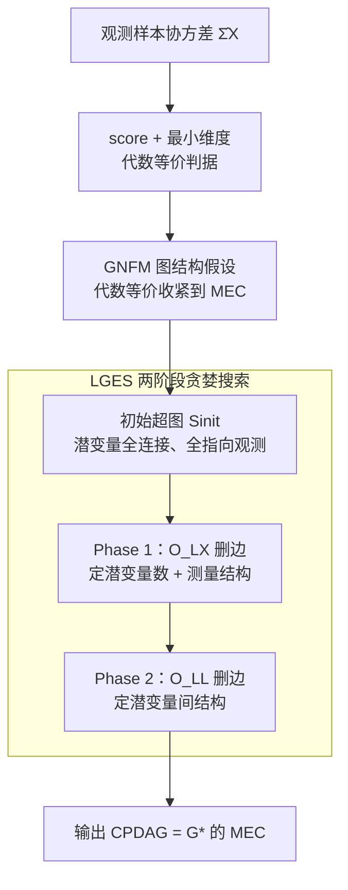

# Score-based Greedy Search for Structure Identification of Partially Observed Causal Models

**会议**: ICLR 2026  
**OpenReview**: [https://openreview.net/forum?id=BNHplerBYE](https://openreview.net/forum?id=BNHplerBYE)  
**代码**: https://github.com/dongxinshuai/scm-identify (有)  
**领域**: 因果发现 / 含隐变量的因果结构学习  
**关键词**: 因果发现, 隐变量, 分数贪婪搜索, 马尔可夫等价类, N 因子模型

## 一句话总结
本文提出第一个带可识别性保证的、面向含隐变量因果模型的**分数贪婪搜索**方法 LGES：先用似然分数 + 最小维度建立"代数等价"判据，再用 Generalized N Factor Model（GNFM）这一弱图结构假设把代数等价收紧到马尔可夫等价类，最后用两个删边算子驱动的两阶段贪婪搜索高效恢复包含隐变量在内的整张结构，在小样本和真实心理学数据上都优于现有约束类方法。

## 研究背景与动机

**领域现状**：因果发现要从观测数据中还原变量间的因果结构。经典方法 PC、GES、LiNGAM 都依赖"因果充分性"假设（即没有隐变量），但现实中隐变量几乎无处不在。于是大量工作转向**含隐变量**的结构识别，主流是约束类（constraint-based）方法：FCI 及其变体靠条件独立性，rank/tetrad 约束、高阶矩、GIN、RLCD 等靠各种统计检验来逐步搭出结构。

**现有痛点**：这些约束类方法虽然有渐近正确性，但**严重依赖一连串统计检验**来迭代构建结构，因而饱受 multiple-testing（多重检验）和 error propagation（误差传播）之苦——尤其当样本量小、变量数大时，每个检验的功效有限，早期一个检验出错会沿着流程一路放大。

**核心矛盾**：分数类（score-based）方法（如 GES）整体评估一个图的似然，不靠逐个检验，理论上能绕开多重检验和误差传播，实践中也更受青睐；但经典的分数贪婪搜索 GES **处理不了隐变量**。已有允许隐变量的分数方法要么只刻画观测变量之间的关系、说不清隐变量结构，要么虽能恢复整张结构却只能做**穷举精确搜索**（Ng et al. 2024），复杂度随观测变量数超指数爆炸（10 个观测变量已有 $3\times10^8$ 张候选图，11 个就涨到 $2\times10^{13}$）。

**本文目标**：能否设计一个**分数贪婪搜索**方法，高效恢复含隐变量在内的整张结构，同时保留渐近正确性保证？这要回答三个子问题：(i) 结构可识别性和似然分数之间的本质联系是什么？(ii) 要靠分数唯一恢复结构需要什么图结构假设？(iii) 怎样设计高效算法在图空间中搜索最优结构？

**切入角度**：作者注意到，结构会在观测协方差矩阵上施加一组**等式（代数）约束**，这些约束携带了关于真实结构的图信息；同时**模型维度（自由度）**会随删边单调下降。把"似然最优 + 维度最小"绑在一起，就有望从分数直接锁定与真值代数等价的图。

**核心 idea**：用"似然分数最优 + 维度最小 ⟺ 代数等价"作为理论地基，配上一个足够弱的图假设（GNFM）把代数等价收紧到马尔可夫等价类，再用两个精心设计的删边算子做**单调降维的贪婪删边搜索**，从一个保证是真值超图的初始状态出发逐步逼近真值。

## 方法详解

### 整体框架
方法要解决的是：只给观测变量的样本协方差 $\hat\Sigma_X$，恢复包含隐变量在内的整张有向无环图，且只能识别到马尔可夫等价类（MEC，潜变量名字/顺序不可识别）。整条管线分三层：**先建分数的理论判据 → 再用 GNFM 假设把判据落到 MEC → 最后用 LGES 贪婪搜索把判据变成可计算的算法**。

具体地，LGES 从一个"潜变量两两全连、所有潜变量都指向所有观测变量"的初始超图 $S_{\text{init}}$ 出发（Definition 3，已被证明是真值的超图且能等效生成观测，Lemma 1）。然后分两阶段贪婪删边：Phase 1 用算子 $O_{LX}$ 删"潜变量→观测变量"的边，定下**潜变量个数**和**测量结构**（哪个观测由哪些潜变量产生）；Phase 2 用算子 $O_{LL}$ 删"潜变量组之间"的边，定下**潜变量内部结构**。每次删边后检查新图是否仍能在容差 $\delta$ 内生成观测 $\hat\Sigma_X$：能就接受（维度下降），不能就换一组边。由于每次删边只会让维度不增，整个过程是在"保持能生成观测"的前提下单调降维，终点即真值的 MEC（用 CPDAG 表示）。

> 说明：图中 δ 容差是贯穿 Phase 1/2 删边接受判定的同一个参数，作为第 4 个关键设计在下文单独讲。

### 关键设计

**1. 分数 + 最小维度 = 代数等价：把可识别性挂到似然上**

约束类方法的痛点是逐检验、误差传播；要走分数路线，第一步得回答"似然分数到底能识别到什么"。作者证明（Theorem 1）：在广义忠实性（Assumption 1）下，给定观测 $\hat\Sigma_X$，记 $\mathcal G^* = \arg\max_{G}\,\mathrm{score}_{ML}(G,\hat\Sigma_X)$ 为似然最优图集合，若 $\hat G\in\mathcal G^*$ 且 $\hat G\in\arg\min_{G\in\mathcal G^*}\dim(G)$（似然最优中维度最小者），则在大样本极限下 $\hat G$ 与真值 $G^*$ **代数等价**（$H(\hat G)=H(G^*)$，即对观测分布施加完全相同的等式约束）。这里的似然分数定义为对结构 $G$ 允许的参数取最大对数似然 $\mathrm{score}_{ML}(G,\hat\Sigma_X)=\max_{(F,\Omega)}\,-\tfrac{N}{2}\big(\mathrm{tr}(\Sigma_X^{-1}\hat\Sigma_X)+\log\det\Sigma_X\big)$，其中 $\Sigma_X$ 由含隐变量的线性 SEM 经 Proposition 1 参数化得到。这条定理把无隐变量时 GES 的分数保证作为特例，推广到了含隐变量场景——意义在于：它给出了一个纯靠分数（无需逐个统计检验）就能锁定真值代数等价类的判据，是后续一切的理论地基。

**2. Generalized N Factor Model：用最弱图假设把代数等价收紧到 MEC**

光有代数等价还不够：不加图假设时代数等价类**无穷大**（总能再加一个隐变量而不改变任何约束，如图 1 的 $\hat G_1,\hat G_2$ 都与 $G^*$ 代数等价）。本文提出 GNFM（Definition 2）作为收紧的图条件：观测变量都是潜变量的效应（叶子），且所有潜变量能划分成若干组，每组 $L_p$ 满足 (i) 至少有 $2|L_p|$ 个**纯观测子节点**（其父集恰为 $L_p$）；(ii) 若某变量 $V$ 与 $L_p$ 中某个潜变量有因果关系，则它对 $L_p$ 内**所有**潜变量都有同向关系；(iii) $L_p$ 内部互不相邻。在此条件下，作者证明（Theorem 2 + Corollary 1）：GNFM 内两图若代数等价则属于同一 MEC，于是"似然最优 + 维度最小"的图就与真值**马尔可夫等价**。$2|L_p|$ 这个看似奇怪的要求来自 t-separation：要判断两组潜变量是否被第三组 $L_p$ d-分离，由于 $L_p$ 不可观测，得借它的观测子节点做代理，而 t-separation 需要两组各 $|L_p|$ 个纯子节点当 surrogate，故每组需 $2|L_p|$ 个观测子。GNFM 的妙处在于它把经典的 one factor model（Silva et al. 2003）作为特例，却允许潜变量**共享观测子节点**、组间关系任意灵活，是一个相当弱、实践上易满足（不够就多采集观测）的假设。

**3. LGES 两阶段贪婪搜索：用两个删边算子把判据变成高效算法**

Theorem 1/Corollary 1 虽给出保证，但直接用意味着穷举所有候选图（超指数爆炸）且要算每张图的精确维度（含隐变量时极难）。LGES 绕开这两点：仿照 GES 的三要素（状态集、状态表示、算子），每个状态用一个 CPDAG 表示一个 MEC，从超图 $S_{\text{init}}$ 出发**只做删边**。删边只会让维度不增，所以无需精确算维度，只要监控"删完还能不能生成观测"即可。两个算子各司其职：$O_{LX}(S,L,X)$ 删掉潜变量 $L$ 到观测 $X$ 的全部边，$O_{LL}(S,L_1,L_2,H)$ 删掉两组潜变量 $L_1,L_2$ 之间的边并把相关无向边定向。Phase 1（Alg. 1，靠 $O_{LX}$）恢复潜变量数与测量结构（Lemma 2 保证其潜变量数和 X→L 边与真值一致）；Phase 2（Alg. 2，靠 $O_{LL}$）恢复潜变量间结构。正确性（Theorem 3）的证明思路是反证：因为每步都维持"当前图是真值超图"（否则会引入额外等式约束使似然非最优、删边被拒），若终止于非最优 $G'$，则存在一串删边把 $G'$ 变成 $G^*$，而其首删得到的 $G''$ 仍是超图、分数仍最优、算法本不该停——矛盾。于是 LGES 渐近收敛到 $G^*$ 的 MEC。相比精确搜索的超指数复杂度，贪婪删边把搜索变得可行。

**4. δ 容差阈值：把渐近判据落到有限样本的稀疏度旋钮**

理论判据"删完是否仍能生成观测"在大样本极限下是精确的，但有限样本里似然不会完全相等，需要一个容差。LGES 用 $\delta$ 作为删边接受阈值：删边后似然下降在 $\delta$ 内就接受。$\delta$ 越大越容易接受删边、结果越稀疏，作用类似 GES 里的惩罚 $\lambda$。本文取 $\delta = 0.25\times\frac{\log N}{N}$（$N$ 为样本量），沿用 BIC 的精神——当 $N\to\infty$ 时 $\delta\to 0$，从而有限样本的稀疏度控制能平滑过渡到渐近的精确判据。消融（Table 5）显示 LGES 对 $\delta$ 的小幅变化不敏感，说明这个旋钮稳健而非脆弱调参。

### 一个完整示例
以图 3 的过程为例：$S_{\text{init}}$（图 3a）里所有潜变量两两无向全连、且全部指向所有观测变量，是真值的一个超图。Phase 1 反复挑一些潜变量和观测变量、删掉它们之间的边检查似然——逐步把多余的"潜→观测"边删干净，得到 $S_{\text{phase1}}$（图 3b），此时潜变量个数和测量结构已和真值一致。Phase 2 再挑两组潜变量删它们之间的边，把潜变量内部的多余连接删掉，最终得到 $S_{\text{final}}$（图 3c），正好就是真值 $G^*$ 的 MEC。整个过程维度单调下降、似然始终保持最优。

## 实验关键数据

### 主实验
合成数据：真值取 20 张满足 GNFM 的随机结构，平均每图 20 个变量（含 5 个隐变量），边系数 $\sim U[-5,5]$、噪声方差 $\sim U[0.1,1]$，对比 FOFC、GIN、RLCD，指标为骨架 F1（越大越好）和 MEC 的 SHD（越小越好）。

| 样本量 | 指标 | LGES | FOFC | GIN | RLCD |
|--------|------|------|------|------|------|
| 100 | F1 ↑ | **0.60** | 0.55 | 0.27 | 0.33 |
| 1000 | F1 ↑ | **0.82** | 0.61 | 0.47 | 0.76 |
| 100 | SHD ↓ | 20.87 | 20.8 | 26.76 | 35.84 |
| 1000 | SHD ↓ | **8.80** | 16.1 | 20.88 | 11.24 |

LGES 在所有样本量上 F1/SHD 均最优；尤其**小样本优势明显**：仅 100 个数据点时 LGES F1=0.60，而约束类的 GIN（CI 检验）、RLCD（rank 检验）只有 0.27、0.33——印证了分数法不受小样本下检验功效不足 / 误差传播之害。

与精确搜索（Ng et al. 2024）的对比（Table 4）凸显效率：8 个观测变量时精确搜索 >100 小时、LGES 仅 17 秒；9 个观测变量精确搜索 >1000 小时（估计）、LGES 仅 19 秒；7 个观测变量精确搜索 F1=0.89、LGES F1=0.88，但耗时 1.5 小时 vs 14 秒（约 400 倍差距），精度仅微降。

### 消融实验
| 配置 / 场景 | 关键指标（样本 1k） | 说明 |
|------|---------|------|
| 标准高斯设定 | F1 0.82 | 完整方法 |
| 违反正态性（均匀噪声） | F1 0.79 | 几乎不掉，仍最优 |
| 违反线性（leaky ReLU, α=0.8） | F1 0.71 | 明显降但仍超过次优 0.65 |
| $\delta$ 小幅扰动（Table 5） | 基本稳定 | 对阈值不敏感 |

### 关键发现
- **分数法天然抗小样本**：约束类方法在 100 样本下崩到 0.27–0.33，LGES 仍有 0.60，根因是它绕开了逐检验的误差传播。
- **可识别性靠线性、不靠高斯**：违反正态性几乎不掉点（0.82→0.79），因为结构可识别性来自结构对协方差矩阵施加的硬等式约束，只依赖线性、不依赖高斯；违反线性才明显降点（0.82→0.71），但仍最优。
- **真实数据语义对齐**：在 Big Five 人格（25 变量）、教师倦怠（32 变量）、多任务行为（9 变量）三个真实数据集上，LGES 恢复的结构在 RMSEA/CFI/TLI 三个拟合优度上全面优于心理学文献中既有的假设结构；且能发现新现象，如 E3（"和人在一起很自在"）同时被外向性、宜人性、神经质三个潜维度驱动，可能给传统因子分析带来新视角。

## 亮点与洞察
- **"似然最优 + 维度最小 = 代数等价"是整套方法的支点**：把含隐变量的可识别性问题转译成一个纯分数判据，从而摆脱约束类方法的逐检验框架——这是从"检验思维"切换到"分数思维"的关键一跃。
- **贪婪删边绕开"算维度"难题很巧**：含隐变量时精确算每张图的自由度极难，但删边只会让维度不增，于是只需监控似然、不必显式算维度，把一个超指数问题压成秒级贪婪搜索。
- **GNFM 把强假设变弱**：用 $2|L_p|$ 个观测子节点这一最小代价，换来潜变量组间关系任意、可共享观测子节点的灵活性，且把经典 one factor model 作为特例——"够采更多观测就能满足"的设计让假设在实践中可达成。
- **δ 的 BIC 式设计可迁移**：$\delta\propto\log N/N$ 让有限样本稀疏度旋钮随样本量平滑收敛到渐近判据，这种"用退火阈值把渐近理论落到有限样本"的思路可借鉴到其他带容差的结构搜索。

## 局限与展望
- **局限于线性高斯 SEM**：理论保证建立在线性因果模型上；虽然实验显示对非高斯鲁棒、对中等非线性（leaky ReLU）仍可用，但强非线性下没有可识别性保证，性能也明显下滑。
- **依赖 GNFM 图假设**：要求观测变量都是潜变量叶子、每组潜变量有 $\ge 2|L_p|$ 个纯观测子节点；当某些潜变量观测代理不足时假设不成立，方法不适用。
- **贪婪性的代价**：相比精确搜索仍有微小精度损失（如 7 变量 0.88 vs 0.89），且 δ 需按样本量设定；作者未充分讨论贪婪在更大规模、更密结构下是否会陷入次优。
- **改进方向**：把可识别性理论与算子设计推广到非高斯 / 非线性场景（作者在附录 C.7 有讨论），以及放宽 $2|L_p|$ 观测子节点要求（论文指出对潜变量关系做更强假设时该要求可放松）。

## 相关工作与启发
- **vs 约束类含隐变量方法（FCI / FOFC / GIN / RLCD）**：它们靠 CI / rank / 高阶矩等统计检验逐步搭结构，受多重检验与误差传播之害、小样本崩盘；LGES 用整体似然分数评估，小样本下显著更稳。
- **vs 经典分数贪婪搜索 GES**：GES 是分数贪婪搜索的范式，但假设因果充分性、处理不了隐变量；LGES 继承其"状态-表示-算子 + 删边降维"框架，并通过 Theorem 1 把分数保证推广到含隐变量场景。
- **vs 分数精确搜索（Ng et al. 2024）**：两者都能恢复含隐变量整张结构且有可识别性保证，但精确搜索需超指数穷举（8 变量 >100 小时）；LGES 用贪婪删边把复杂度压到秒级，精度仅微降，是首个含隐变量的分数**贪婪**搜索。

## 评分
- 新颖性: ⭐⭐⭐⭐⭐ 首个带可识别性保证的含隐变量分数贪婪搜索，理论判据（score+维度⟺代数等价）与 GNFM 假设都是实打实的新贡献。
- 实验充分度: ⭐⭐⭐⭐ 合成数据覆盖样本量/误设/δ 消融，三个真实数据集有拟合优度对比，但规模偏小（平均 20 变量），缺大规模压力测试。
- 写作质量: ⭐⭐⭐⭐ 理论层层递进、图示清晰，但定理与代数统计术语较密，对非因果发现背景读者门槛偏高。
- 价值: ⭐⭐⭐⭐⭐ 把分数法的小样本鲁棒优势带到含隐变量场景，且效率比精确搜索高数百倍，对心理学等隐变量密集领域有直接应用价值。

<!-- RELATED:START -->

## 相关论文

- [\[AAAI 2026\] CaDyT: Causal Structure Learning for Dynamical Systems with Theoretical Score Analysis](../../AAAI2026/causal_inference/causal_structure_learning_for_dynamical_systems_with_theoretical_score_analysis.md)
- [\[ICLR 2026\] Causal Score Conditioning for Multi-Resolution Latent Systems](causal_score_conditioning_for_multi-resolution_latent_systems.md)
- [\[ICLR 2026\] Conditional Independent Component Analysis for Estimating Causal Structure with Latent Variables](conditional_independent_component_analysis_for_estimating_causal_structure_with_.md)
- [\[ICLR 2026\] CARL: Preserving Causal Structure in Representation Learning](carl_preserving_causal_structure_in_representation_learning.md)
- [\[ICML 2026\] Towards a Holistic Understanding of Selection Bias for Causal Effect Identification](../../ICML2026/causal_inference/towards_a_holistic_understanding_of_selection_bias_for_causal_effect_identificat.md)

<!-- RELATED:END -->
