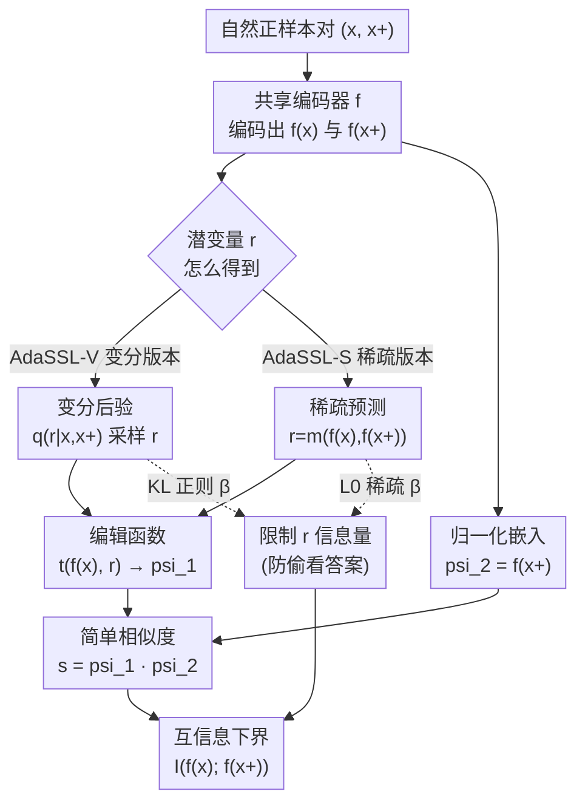

# Self-Supervised Learning from Structural Invariance

**会议**: ICLR 2026  
**arXiv**: [2602.02381](https://arxiv.org/abs/2602.02381)  
**代码**: [https://github.com/SkrighYZ/AdaSSL](https://github.com/SkrighYZ/AdaSSL)  
**领域**: 自监督学习 / 因果表征学习  
**关键词**: 自监督学习, 潜变量模型, 结构不变性, 异方差性, 因果表征

## 一句话总结
提出 AdaSSL，通过引入潜变量建模正样本对之间的条件不确定性，推导出互信息的变分下界，使 SSL 能够处理自然配对数据中的复杂（多模态、异方差）条件分布，在因果表征学习、细粒度图像理解和视频世界模型上均优于基线。

## 研究背景与动机

**领域现状**：Joint-embedding SSL（如 SimCLR、BYOL）通过鼓励正样本对表征相似来学习表征，通常依赖手工数据增强构造语义相关的正样本对。

**现有痛点**：手工增强（裁剪、色彩抖动）无法精确模拟真实世界的变化因素，可能丢弃细粒度信息、需要模态特定启发式、且不同于自然的分布偏移。使用自然配对数据（如相邻视频帧、图文对）可以更好地反映真实变化，但自然对引入了复杂的条件分布 $p(\mathbf{z}^+|\mathbf{z})$——异方差、多模态——现有 SSL 方法无法建模。

**核心矛盾**：InfoNCE 的点积相似度隐式假设 vMF 分布（等向噪声），AnInfoNCE 扩展到各向异性但仍是常数噪声。然而理论证明（Proposition 2.1），即使噪声在潜空间是等向的，映射到归一化嵌入空间后也必然产生异方差性——这是几何失配的必然结果。

**本文目标**：如何让 SSL 灵活建模任意复杂的条件分布 $p(\mathbf{z}^+|\mathbf{z})$，同时保持相似度函数简单？

**切入角度**：受 JEPA 启发，引入潜变量 $\mathbf{r}$ 捕获预测不确定性，将复杂条件分布分解为两步：先采样 $\mathbf{r}$（如相机运动、动作），再用简单模型预测 $\mathbf{z}^+$。

**核心 idea**：通过互信息链式法则 $I(f(\mathbf{x}); f(\mathbf{x}^+)) = I(f(\mathbf{x}), \mathbf{r}; f(\mathbf{x}^+)) - I(\mathbf{r}; f(\mathbf{x}^+)|f(\mathbf{x}))$，第一项用扩展的 InfoNCE 优化（简单相似度+潜变量），第二项用 KL 正则化防止 $\mathbf{r}$ 编码捷径。

## 方法详解

### 整体框架

AdaSSL 在标准 joint-embedding 框架上多挂一条潜变量支路：共享编码器 $f$ 把正样本对 $(\mathbf{x},\mathbf{x}^+)$ 都映射成嵌入，潜变量 $\mathbf{r}$ 专门捕获那部分「从 $\mathbf{x}$ 单独看不出来」的变化不确定性，再由编辑函数 $t(f(\mathbf{x}), \mathbf{r})$ 把 $f(\mathbf{x})$ 推向 $f(\mathbf{x}^+)$，最后仍用最简单的点积相似度 $\psi_1^\top\psi_2$ 去对齐。整套训练目标始终是「SSL 主损失（InfoNCE 或 BYOL）＋ 限制 $\mathbf{r}$ 信息量的正则项」两部分——前者保证嵌入对齐、后者逼着 $\mathbf{r}$ 只携带必要信息，合起来构成互信息 $I(f(\mathbf{x}); f(\mathbf{x}^+))$ 的一个可处理下界。唯一分叉在于 $\mathbf{r}$ 这条支路怎么实现：**AdaSSL-V** 走变分后验采样＋KL 正则，**AdaSSL-S** 走确定性稀疏预测＋L0 正则。

### 关键设计

**1. AdaSSL-V 变分版本：把复杂条件分布拆成「采样 $\mathbf{r}$ ＋简单预测」两步**

自然配对数据的条件分布 $p(\mathbf{z}^+|\mathbf{z})$ 是多模态、异方差的，直接让简单相似度去拟合必然失败。AdaSSL-V 借互信息链式法则 $I(f(\mathbf{x}); f(\mathbf{x}^+)) = I(f(\mathbf{x}), \mathbf{r}; f(\mathbf{x}^+)) - I(\mathbf{r}; f(\mathbf{x}^+)|f(\mathbf{x}))$ 把目标拆开：第一项让「嵌入＋潜变量」一起去预测 $f(\mathbf{x}^+)$，第二项惩罚 $\mathbf{r}$ 偷看答案。落到可优化的下界上就是 $\mathcal{L} = \mathcal{L}_{SSL}(\mathbb{E}_{q_\phi} \psi_1(\mathbf{x}, \mathbf{r}), \psi_2(\mathbf{x}^+)) + \beta D_{KL}(q_\phi(\mathbf{r}|\mathbf{x}, \mathbf{x}^+) \| p_\theta(\mathbf{r}|\mathbf{x}))$，其中变分分布 $q_\phi(\mathbf{r}|\mathbf{x}, \mathbf{x}^+)$ 能看到 $\mathbf{x}^+$ 来推断这一对到底发生了什么变化，而先验 $p_\theta(\mathbf{r}|\mathbf{x})$ 只看 $\mathbf{x}$。KL 项（强度由 $\beta$ 控制）逼着 $\mathbf{r}$ 只携带「从 $\mathbf{x}$ 看不出来的额外信息」，从而既保留了相似度函数的简单形式，又把建模复杂分布的活儿交给了潜变量，得到的还是 $I(f(\mathbf{x}); f(\mathbf{x}^+))$ 的一个严格可处理下界。

**2. AdaSSL-S 稀疏版本：用稀疏 $\mathbf{r}$ 对齐因果潜因子**

变分采样在蒸馏式 SSL 上不好用，而且因果表征学习更想要可解释的变化因子。AdaSSL-S 改成确定性预测 $\mathbf{r} = m(f(\mathbf{x}), f(\mathbf{x}^+))$，并对它施加稀疏约束——通过 Gumbel-Sigmoid 实现可微的 L0 惩罚，使每对样本只激活少数几个 $r_i$。编辑函数采用模块化低秩设计 $t(f(\mathbf{x}), \mathbf{r}) = f(\mathbf{x}) + \sum_i r_i (\mathbf{B}_i \mathbf{A}_i f(\mathbf{x}) + b_i)$：每个 $r_i$ 像开关一样控制一个 LoRA 风格的低秩编辑模块是否生效。这一稀疏归纳偏置背后的假设是「自然变化通常只改变少数潜因子」，因此学到的 $\mathbf{r}$ 会自然地与真实变化因子对齐，比稠密表示更符合因果表征学习的诉求。

**3. 异方差性必然定理（Proposition 2.1）：证明标准相似度先天不够用**

这一条不是模块而是支撑整套设计的理论根基。InfoNCE 的点积相似度隐含 vMF（等向噪声）假设，AnInfoNCE 放宽到各向异性但仍是全局常数噪声。Proposition 2.1 证明：当等向噪声所在的潜空间 $\mathbb{R}^{d_z}$ 被映射到弯曲流形（如归一化嵌入所在的单位球 $\mathbb{S}^{d_f}$）时，局部邻域的几何扭曲与位置相关，于是嵌入空间里配对的条件方差必然随位置变化——异方差性是几何失配的数学必然，而非数据噪声的经验现象。这就解释了为什么 InfoNCE / AnInfoNCE 在复杂分布上注定失败，也正当化了引入潜变量 $\mathbf{r}$ 去吸收这部分位置依赖不确定性的做法。

### 损失函数 / 训练策略

两个变体共享「SSL 主损失＋信息量正则」的结构：AdaSSL-V 用 InfoNCE 配 KL 正则（$\beta$ 调强度），AdaSSL-S 用 InfoNCE 配 Gumbel-Sigmoid 实现的 L0 稀疏正则；二者同样兼容 BYOL 等非对比蒸馏方法。

## 实验关键数据

### 主实验

| 任务/数据集 | 指标 | AdaSSL | InfoNCE | AnInfoNCE | H-InfoNCE |
|------------|------|--------|---------|-----------|-----------|
| 数值异方差 (OOD) | R² | 0.92+ | <0.27 | <0.40 | 0.76 |
| 3DIdent (CRL) | DCI | 0.85+ | 0.72 | 0.74 | 0.78 |
| CelebA 细粒度 | 40-attr Acc | 最佳 | 较低 | 较低 | 中等 |
| Moving-MNIST 加速度 | R² | 0.55 (BYOL基线0.15) | - | - | - |

### 消融实验

| 配置 | 数值 OOD R² | 说明 |
|------|------------|------|
| AdaSSL-V | 0.92+ | 完整变分版本 |
| AdaSSL-S | 0.90+ | 稀疏版本，略低但更稀疏 |
| H-InfoNCE | 0.76 | 异方差但无潜变量 |
| InfoNCE | <0.27 | 基线完全失败 |
| AnInfoNCE | <0.40 | 各向异性不够 |

### 关键发现
- 在复杂条件分布（多模态+异方差）下，InfoNCE 和 AnInfoNCE 完全失败（OOD R² < 0.4），AdaSSL 保持 0.9+
- 自然配对数据（vs 标准增强）在有正确建模时显著提升下游性能
- AdaSSL-S 学到的稀疏 $\mathbf{r}$ 与真实变化因子对齐
- 视频世界模型中，AdaSSL 能捕获随机加速度（BYOL 丢弃此信息）

## 亮点与洞察
- **异方差性定理**揭示了标准 SSL 的根本局限——不是经验观察而是数学必然
- **潜变量建模的通用性**：同一个框架兼容对比和蒸馏 SSL，适用于数值/图像/视频
- **稀疏模块化编辑**的设计（$\mathbf{r}$ 控制低秩编辑模块）与 LoRA 风格思想异曲同工

## 局限与展望
- AdaSSL-S 在蒸馏方法（BYOL）上需要额外处理
- 潜变量维度 $d_r$ 需要预设，自动确定更好
- 大规模验证不足（没有 ImageNet 级别实验）
- 多模态条件分布的模式数量未知时，变分先验的选择有待优化

## 相关工作与启发
- **vs AnInfoNCE**：各向异性权重 $\Lambda$ 是全局的，不随数据变化。AdaSSL 用潜变量实现了数据自适应
- **vs JEPA/V-JEPA**：JEPA 假设已知 $\mathbf{r}$（如动作），AdaSSL 从数据对中推断 $\mathbf{r}$
- **vs LieSSL**：Lie 群变换假设可逆和结构化变化，AdaSSL 更灵活

## 评分
- 新颖性: ⭐⭐⭐⭐⭐ 异方差性定理 + MI 下界 + 双变体设计，理论和方法都有深度
- 实验充分度: ⭐⭐⭐⭐ 多任务验证（数值/CRL/图像/视频），但缺乏大规模对比
- 写作质量: ⭐⭐⭐⭐⭐ 理论动机清晰，从理论到方法到实验逻辑流畅
- 价值: ⭐⭐⭐⭐ 解决了 SSL 的根本理论问题，方法通用性强

<!-- RELATED:START -->

## 相关论文

- [\[ICLR 2026\] Counterfactual Structural Causal Bandits](counterfactual_structural_causal_bandits.md)
- [\[NeurIPS 2025\] Root Cause Analysis of Outliers with Missing Structural Knowledge](../../NeurIPS2025/causal_inference/root_cause_analysis_of_outliers_with_missing_structural_knowledge.md)
- [\[ICLR 2026\] Learning Robust Intervention Representations with Delta Embeddings](learning_robust_intervention_representations_with_delta_embeddings.md)
- [\[ICLR 2026\] Efficient and Sharp Off-Policy Learning under Unobserved Confounding](efficient_and_sharp_off-policy_learning_under_unobserved_confounding.md)
- [\[ICLR 2026\] GDR-learners: Orthogonal Learning of Generative Models for Potential Outcomes](gdr-learners_orthogonal_learning_of_generative_models_for_potential_outcomes.md)

<!-- RELATED:END -->
