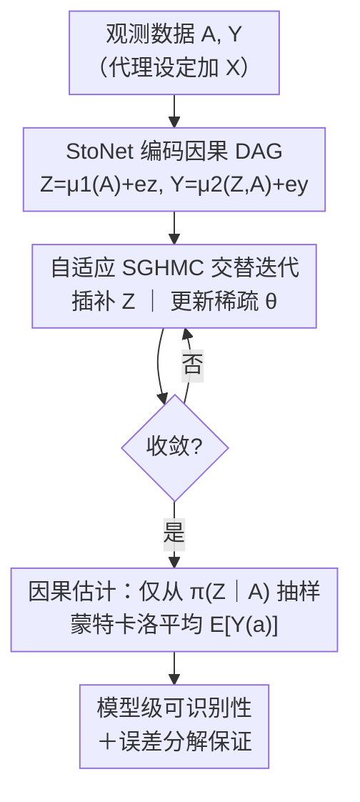

# Stochastic Neural Networks for Causal Inference with Missing Confounders

**会议**: ICLR 2026  
**OpenReview**: [https://openreview.net/forum?id=1tTs2gZAJN](https://openreview.net/forum?id=1tTs2gZAJN)  
**代码**: https://github.com/nixay/Stochastic-Neural-Networks-for-Causal-Inference-with-Missing-Confounders  
**领域**: 因果推断 / 隐变量建模 / 贝叶斯深度学习  
**关键词**: 缺失混杂因子、随机神经网络、隐变量插补、SGHMC、模型可识别性

## 一句话总结
本文提出 CI-StoNet：用一个随机神经网络（StoNet）把因果 DAG 的马尔可夫分解直接编码进网络结构，再用自适应随机梯度哈密顿蒙特卡洛（SGHMC）一边插补缺失的隐混杂因子、一边估计稀疏网络参数，从而在「没观测到全部混杂因子」的观测数据上给出有模型级可识别性保证、且非线性建模能力强的因果效应估计。

## 研究背景与动机
**领域现状**：在潜在结果框架下，要从观测数据无偏地识别因果效应，关键前提是「强可忽略性」$A \perp\!\!\!\perp \{Y(a)\} \mid Z$，即所有混杂因子 $Z$ 都被观测到。现实中这个条件几乎从不成立，于是一类主流做法是把缺失的混杂因子当成隐变量来建模、再插补出来——代表工作有 Wang & Blei 的多因子替代混杂、Kallus 等人的代理变量低秩近似、以及 Louizos 等人的 CEVAE（因果效应变分自编码器）。

**现有痛点**：这些方法各有硬伤。Wang & Blei 的替代混杂本质上把隐混杂建成了「处理变量的确定性函数」，最终收敛到观测处理的函数而非真实混杂；Kallus 主要停留在线性回归设定，非线性场景需要大量代理变量才行；而 Rissanen & Marttinen 证明了 CEVAE 在隐变量被错误设定或数据分布过于复杂时，无法正确估计因果效应——它缺乏模型层面的一致性保证。

**核心矛盾**：这些隐变量方法普遍**缺少基于模型的识别性保证**，而且难以扩展到更丰富的因果结构（代理变量、多因、中介、对撞）。变分推断追求灵活但不保证一致性，确定性因子模型有一致性却退化成处理的函数——「表达力」和「可识别 + 一致」之间存在张力。

**本文目标**：构造一个框架，使其同时满足：(i) 能对高度非线性的处理/结果机制建模；(ii) 有模型层面的可识别性与一致性证明；(iii) 结构灵活，能即插即用地拓展到代理变量、多因等不同 DAG。

**切入角度**：作者注意到，简单混杂结构下隐混杂的条件分布可分解为 $\pi(Z\mid A,Y)\propto \pi(Z\mid A)\,\pi(Y\mid Z,A)$，这在数学上正好对应「以 $A$ 为外生输入、$Z$ 为隐状态、$Y$ 为输出」的随机模型——也就是 StoNet 的结构。把因果 DAG 的马尔可夫分解直接搬进随机神经网络，就能借助稀疏深度学习理论拿到一致性保证。

**核心 idea**：用随机神经网络（StoNet）编码因果 DAG 的条件结构，用自适应 SGHMC 把「插补隐混杂」和「估计稀疏网络参数」交替求解，从而在缺失混杂下给出有模型级可识别性的因果效应估计。

## 方法详解

### 整体框架
CI-StoNet 要解决的是：观测数据里只有处理 $A$、结果 $Y$（有时加一个代理 $X$），真正的混杂因子 $Z$ 缺失，如何无偏地估计干预下的均值潜在结果 $\mathbb{E}[Y(a)]$。它的做法是把因果 DAG 翻译成一个两层随机神经网络，再用一套「插补—更新」交替的 MCMC 算法把缺失变量和网络参数一起算出来，最后只用 $\pi(Z\mid A)$ 这条分布抽样去做因果效应估计。

以简单混杂为例，真实数据生成过程是 $A=g_1(Z,e_a),\ Y=g_2(Z,A)+e_y$，其中 $g_1,g_2$ 是未知的复杂非线性函数。CI-StoNet 把它参数化为两个互相通过隐变量 $Z$ 连接的神经网络：

$$Z = \mu_1(A,\theta_1) + e_z,\qquad Y = \mu_2(Z,A,\theta_2) + e_y,$$

其中 $e_z\sim N(0,\sigma_z^2 I)$、$e_y\sim N(0,\sigma_y^2 I)$。整条流水线如下：先用 StoNet 编码 DAG，再用自适应 SGHMC 交替迭代（一步抽 $Z$、一步更新稀疏参数 $\theta$），收敛后只从 $\pi(Z\mid A)$ 抽样、用蒙特卡洛平均得到 $\widehat{\mathbb{E}}[Y(a)]$。

### 关键设计

**1. 用 StoNet 编码因果 DAG 的马尔可夫分解**

针对「确定性因子模型会退化成处理的函数、变分方法又缺一致性」这一痛点，作者不直接学一个黑盒隐表示，而是把因果 DAG 的条件分解逐项映射成随机网络模块。简单混杂下 $\pi(Z\mid A,Y)\propto \pi(Z)\pi(A\mid Z)\pi(Y\mid Z,A)\propto \pi(Z\mid A)\pi(Y\mid Z,A)$，这两项各对应一个神经网络：$\mu_1$ 学 $\pi(Z\mid A)$、$\mu_2$ 学 $\pi(Y\mid Z,A)$，靠隐变量 $Z$ 串联。关键在于 $Z$ 是**随机的**（带高斯噪声 $e_z$），而不是 $A$ 的确定性函数——这正是它区别于 Wang & Blei 的地方：后者把替代混杂建成确定函数，收敛到观测处理的函数而非真实混杂，CI-StoNet 通过保留随机性避开了这一退化。作者特别强调 $\mu_1(A,\theta_1)$ 的数学形式 $A\to Z$ 并不蕴含因果机制 $A\to Z$（如「下雨 $Z$ 导致湿地 $A$，但湿地不导致下雨」），$Z$ 也不是中介变量，只是借这个条件结构做插补。这种模块化的 DAG 编码带来结构灵活性：换成代理变量设定时，只要把分解改成 $\pi(Z\mid A,Y,X)\propto\pi(Z\mid X)\pi(A\mid Z)\pi(Y\mid Z,A)$，对应地加一个 $Z=\mu_1(X,\theta_1)+e_z$ 模块即可，多因设定同理统一在一个框架内。

**2. 自适应 SGHMC 联合插补隐混杂与稀疏参数**

混杂 $Z$ 缺失，无法直接最大化似然。作者把训练写成 Fisher 恒等式的贝叶斯版本：$\nabla_\theta\log\pi(\theta\mid A,Y)=\int \nabla_\theta\log\pi(\theta\mid Z,A,Y)\,\pi(Z\mid A,Y,\theta)\,dZ$，目标是解 $\nabla_\theta\log\pi(\theta\mid A,Y)=0$。求解用自适应 SGHMC（Algorithm 1）交替两步：**插补步**通过哈密顿动力学从 $\pi(Z\mid A,Y,\theta)$ 抽样更新 $Z$（动量项 $v$ 累加 $\nabla_Z\log\pi(Z\mid A,\theta_1)$ 与 $\nabla_Z\log\pi(Y\mid Z,A,\theta_2)$ 两路梯度并注入噪声 $\sqrt{2\epsilon\eta}\,e$）；**参数步**在新 $Z$ 下分别对 $\theta_1,\theta_2$ 做带先验梯度的更新。为了拿到稀疏深度学习的一致性，参数施加混合高斯先验

$$\pi(\theta)=\prod_{i=1}^{K_n}\big[(1-\lambda_n)\phi(\theta_i/\sigma_0)+\lambda_n\phi(\theta_i/\sigma_1)\big],$$

一个窄峰 $\sigma_0$（压向 0、做稀疏化）+ 一个宽峰 $\sigma_1$（保留重要连接），起到贝叶斯正则的作用。这套设计让插补与估计同步进行，且收敛性由自适应随机梯度 MCMC 保证——这正是 CEVAE 用大网络变分推断时拿不到的一致性。噪声方差 $\sigma_z^2$ 因网络的万能逼近性而本质不可识别，作者用逆 Gamma 先验给出贝叶斯估计 $\hat\sigma_z^2=\frac{\beta+\frac12\sum_j(z_j-\mu_1(A_j,\theta_1))^2}{n/2+\alpha-1}$（取 $\alpha=\beta=1$），但它对下游推断影响很小。

**3. 因果估计只从 $\pi(Z\mid A)$ 抽样，剔除对撞与中介污染**

插补步里 $Z$ 是基于 $A$ 和 $Y$ 同时条件得到的，但作者指出**这一步的 $Z$ 不能直接用于因果估计**：若存在对撞变量 $C$（被 $A$ 和 $Y$ 共同影响），条件在 $Y$ 上会在 $A$ 与 $Y$ 间引入虚假关联，偏置估计。解决办法是收敛后改从 $\pi(Z\mid A,\hat\theta_1^*)$ 抽样（只条件在 $A$ 上），把对撞相关信息排除在外。具体地，对每个样本 $i$ 抽 $M$ 个 $z_i^{(l)}\sim\pi(z\mid a_i;\hat\theta_1^*)$，再蒙特卡洛平均：

$$\widehat{\mathbb{E}}(Y(a)\mid\hat\theta^*)=\frac{1}{nM}\sum_{i=1}^{n}\sum_{l=1}^{M}\mu_2(z_i^{(l)},a,\hat\theta_2^*).$$

对中介 $M$ 的情形，若不观测 $M$，其效应会被 $Z$ 吸收，导致无法做路径分解，但 $Z$ 作为隐调整变量仍能估计**总因果效应**；若 $M$ 已知且无未观测混杂，可把 $M$ 并入隐混杂层用前门准则估计直接效应。

**4. 模型级可识别性与误差分解**

作者区分「非参数可识别」（仅凭观测分布就能恢复因果效应）与「模型级可识别」（在受限模型类内唯一），本文走后者。在 Assumption 3 下，把结构条件均值 $m_A(z)=\mathbb{E}[A\mid Z],\ m_Y(a,z)=\mathbb{E}[Y\mid A,Z]$ 限制在能被稀疏 DNN 以速率 $\omega_n\to0$ 逼近的函数类。虽然隐变量 $Z$ 与参数 $\theta$ 因「损失不变变换」而非唯一，但**因果泛函在每个观测等价类内是不变的**：只要两组参数诱导相同的观测分布，就有 $\psi_\theta(a)=\psi_{\theta'}(a)$。总误差被分解为统计估计误差与模型设定误差两部分，$\|\psi(\hat P_\theta)-\psi(P_0)\|\le\underbrace{\|\psi(\hat P_\theta)-\psi(P_{\theta^*})\|}_{\text{估计误差}}+\underbrace{\|\psi(P_0)-\psi(P_{\theta^*})\|}_{\text{设定误差}}$。Theorem 1 证明估计误差当 $n,M\to\infty$ 时依概率趋 0；Theorem 2 给出设定误差界 $\|\psi(P_0)-\psi(P_{\theta^*})\|\le C_2\omega_n$、且 $\mathrm{KL}(P_0,P_{\theta^*})\le C_1\omega_n^2$。一个值得注意的性质是：即便插补出的隐混杂因损失不变变换偏离真值，估计量 (9) 的一致性也不受影响。

### 损失函数 / 训练策略
训练等价于求解贝叶斯 Fisher 恒等式诱导的目标方程 $\nabla_\theta\log\pi(\theta\mid A,Y)=0$，由自适应 SGHMC 完成。超参方面：先验混合比例 $\lambda_n$、两高斯分量标准差 $\sigma_0,\sigma_1$；$\sigma_z,\sigma_y$ 为标量，可作超参指定或随迭代按式 (8) 更新，对性能影响很小。代理变量设定采用模型 (12)（$A=\mu_2(Z,\theta_2)+e_a$，二值处理下与 (11) 渐近等价，因 $\mu_2(Z,\theta_2)\to P(A=1\mid Z,\theta_2)$），便于计算。

## 实验关键数据

### 主实验
在带代理变量的异质处理效应估计上（10 个数据集，每个 2000 训练 / 500 验证 / 500 测试，PEHE 越低越好）：

| 方法 | In-Sample PEHE | Out-of-Sample PEHE |
|------|----------------|--------------------|
| **CI-StoNet** | **0.3614 (0.0328)** | **0.3731 (0.0350)** |
| DragonNet | 0.4217 (0.0356) | 0.4305 (0.0361) |
| CEVAE | 0.6190 (0.0350) | 0.6246 (0.0384) |
| X-learner-Bart | 0.6489 (0.0168) | 0.6570 (0.0151) |
| CMDE | 0.9019 (0.0746) | 0.9059 (0.0699) |
| Ganite | 1.2099 (0.0558) | 1.1797 (0.0499) |
| X-learner-RF | 0.8308 (0.0200) | 1.4272 (0.0132) |
| CFRNet-Wass | 1.7127 (0.1668) | 1.7258 (0.1667) |
| CMGP | 1.8823 (0.0836) | 2.2116 (0.1682) |
| CFRNet-MMD | 2.0238 (0.0537) | 2.0250 (0.0582) |

CI-StoNet 在样本内/外 PEHE 上都明显领先，且样本内外差距最小（0.3614 → 0.3731），泛化稳定；相比最强基线 DragonNet 仍有约 13% 的相对改进，对隐变量方法 CEVAE 则几乎减半。

### 消融实验
论文未给出表格化的逐模块消融，而是用合成数据做了机制验证：在非线性数据生成过程（处理 $A_1,\dots,A_9$、隐混杂 $Z_1,\dots,Z_6$）下，分别考察**可分离混杂**（$Y=f_1(A)-\theta_0 f_2(A)+\xi(Z)+\epsilon$）与**不可分离混杂**（$Y=f_1(A)-\xi(Z)f_2(A)+\xi(Z)+\epsilon$，处理与混杂存在交互）两种设定。

| 设定 | 关键观察 | 说明 |
|------|---------|------|
| 可分离混杂 | 多数估计边际效应落在真值 ±0.5 标准差内 | 处理与混杂分别影响结果，偏差小 |
| 不可分离混杂 | 同样小偏差恢复各处理的边际效应 | 含 $A$–$Z$ 交互，仍能准确估计 |
| ATE / CATE | MAE 与 PEHE 均优于基线 | 在 Twins、ACIC 2019 等基准上一致领先 |

### 关键发现
- 隐混杂只识别到「损失不变变换」精度，但因果泛函在观测等价类内不变——这是 CI-StoNet 一致性的理论根源，也是它优于 CEVAE 的本质原因。
- 因果估计阶段必须从 $\pi(Z\mid A)$ 而非 $\pi(Z\mid A,Y)$ 抽样，否则对撞变量会引入虚假关联；这个「插补用全条件、估计用半条件」的细节是无偏的关键。
- 不依赖「无单因混杂」假设，多因与单因混杂被统一在一个框架内，相比 Wang & Blei 适用范围更广。

## 亮点与洞察
- **把因果 DAG 直接「编译」进随机网络结构**：不是先学黑盒隐表示再硬套因果解释，而是让网络拓扑就等于 DAG 的马尔可夫分解，换 DAG（代理/多因/中介）只需改模块连接，结构灵活性是设计出来的而非事后补的。
- **稀疏深度学习 + 贝叶斯正则换来一致性**：混合高斯先验让大网络也能有可证明的参数估计一致性，这正好补上变分自编码器路线（CEVAE）在大网络下「无一致性保证」的短板。
- **「全条件插补、半条件估计」的对撞规避**：用 $\pi(Z\mid A,Y)$ 做高效插补、用 $\pi(Z\mid A)$ 做无偏估计的分工，是一个可迁移到其他隐变量因果方法的实用 trick。

## 局限与展望
- **强依赖正确的 DAG 设定**：结构与参数估计都建立在因果 DAG 正确指定之上；多处理下若有未识别的中介被吸收进替代混杂，会偏置估计（作者承认这一点）。
- **缺乏原生的不确定性量化**：当前形式不提供基于模型的、对因果泛函有效的后验区间，只能用附录的 bootstrap 后处理构造置信区间；更严格的 UQ 需回到完整贝叶斯的原始 StoNet 框架。
- **噪声方差 $\sigma_z$ 本质不可识别**：靠逆 Gamma 先验给点估计绕过，虽说影响小，但在小样本或重混杂场景下其稳健性值得进一步验证。

## 相关工作与启发
- **vs Wang & Blei (2018, 解卷积)**：他们用确定性因子模型建多因替代混杂，会收敛到观测处理的函数而非真实混杂，且需「无单因混杂」假设；CI-StoNet 保留隐变量随机性、统一处理单因/多因，避开退化。
- **vs CEVAE (Louizos et al., 2017)**：同样用隐变量 + 代理，但 CEVAE 是变分自编码器，大网络下无一致性保证、隐变量误设时估计失效；CI-StoNet 用稀疏 DNN 理论 + 贝叶斯正则拿到了相对伪真参数的一致性。
- **vs 代理/近端因果推断 (Kallus 2018; Tchetgen 2020; Miao 2018)**：这些方法多依赖线性/矩阵分解或需两类代理；CI-StoNet 只需基础代理即可非线性建模，且把代理设定纳入同一 StoNet 框架。
- **vs DragonNet / X-learner 等表示学习估计器**：它们是判别式的表示学习器、不显式插补缺失混杂，本文在 PEHE 上更优且带有识别性理论支撑。

## 评分
- 新颖性: ⭐⭐⭐⭐⭐ 把 StoNet + 稀疏深度学习 + 自适应 SGHMC 整合进缺失混杂因果推断，并给出模型级可识别性，路线新颖。
- 实验充分度: ⭐⭐⭐⭐ 合成 + Twins + ACIC 基准，PEHE 领先且含理论佐证；但缺逐模块消融表，UQ 仅靠 bootstrap。
- 写作质量: ⭐⭐⭐⭐ 理论推导严谨、DAG/对撞/中介讨论清晰；定理与假设较密，需一定统计背景。
- 价值: ⭐⭐⭐⭐⭐ 为「缺失混杂 + 非线性 + 有保证」这一长期难题提供了兼顾灵活性与一致性的实用框架。

<!-- RELATED:START -->

## 相关论文

- [\[ICLR 2026\] Foundation Models for Causal Inference via Prior-Data Fitted Networks](foundation_models_for_causal_inference_via_prior-data_fitted_networks.md)
- [\[ICLR 2026\] Exploratory Causal Inference in SAEnce](exploratory_causal_inference_in_saence.md)
- [\[NeurIPS 2025\] GST-UNet: A Neural Framework for Spatiotemporal Causal Inference with Time-Varying Confounding](../../NeurIPS2025/causal_inference/gst-unet_a_neural_framework_for_spatiotemporal_causal_inference_with_time-varyin.md)
- [\[ICLR 2026\] Frequency-Domain Better than Time-Domain for Causal Structure Recovery in Dynamical Systems on Networks](frequency-domain_better_than_time-domain_for_causal_structure_recovery_in_dynami.md)
- [\[ICLR 2026\] Characterization and Learning of Causal Graphs with Latent Confounders and Post-treatment Selection from Interventional Data](characterization_and_learning_of_causal_graphs_with_latent_confounders_and_post-.md)

<!-- RELATED:END -->
