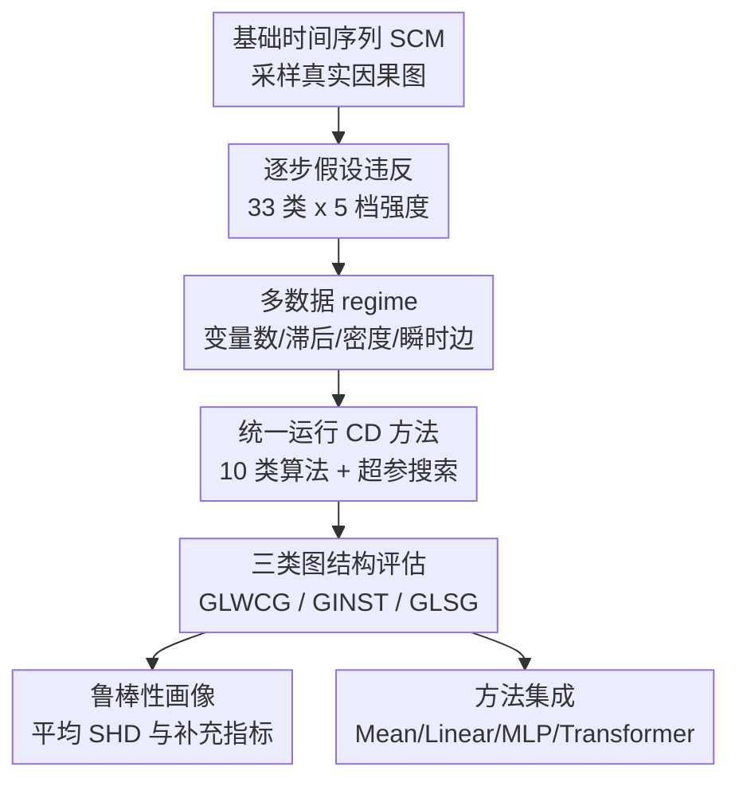

# TCD-Arena: Assessing Robustness of Time Series Causal Discovery Methods Against Assumption Violations

**会议**: ICLR2026  
**OpenReview**: [https://openreview.net/forum?id=MtdrOCLAGY](https://openreview.net/forum?id=MtdrOCLAGY)  
**代码**: https://github.com/TCD-Arena  
**领域**: 因果推断 / 时间序列因果发现  
**关键词**: 时间序列因果发现, 因果发现基准, 假设违反, 鲁棒性评估, 模型集成

## 一句话总结
TCD-Arena 提出一个可扩展的时间序列因果发现鲁棒性测试套件，用 33 类逐步加剧的现实假设违反和约 3600 万次因果发现尝试系统评估 10 类方法，并发现不同算法的鲁棒性画像差异很大，简单集成在滞后图和摘要图上能进一步提升稳定性。

## 研究背景与动机
**领域现状**：时间序列因果发现希望从多变量观测序列 $X \in \mathbb{R}^{D \times T}$ 中恢复变量之间的因果结构，典型输出包括带具体滞后阶的窗口因果图、只总结是否存在滞后影响的摘要图，以及同一时刻变量间的瞬时图。许多方法围绕 Granger 因果、条件独立检验、非高斯结构 VAR、连续优化或预训练模型展开，在合成数据上已经能取得不错的结构恢复结果。

**现有痛点**：真正难用的地方不在于有没有方法，而在于这些方法的理论保证通常依赖强假设：没有隐藏混杂、faithfulness 成立、结构稳定、噪声独立加性、函数形式合适、样本量足够、观测没有严重缺失等。现实数据里这些条件往往不可验证，甚至明显不成立；如果 benchmark 只在理想合成数据上跑，得到的高分很容易让从业者误以为方法在真实场景也可靠。

**核心矛盾**：因果发现需要 ground truth 才能评估，但真实世界带完整因果真值的时间序列很稀缺；另一方面，纯理论分析又很难覆盖复杂数据质量问题、非平稳性、观测噪声、隐藏混杂等实际扰动。于是评估协议必须在可控合成数据和现实复杂性之间找到折中：既要知道真实因果图，又要让数据生成过程系统性偏离理想假设。

**本文目标**：作者希望提供一个统一的测试工具，而不是只报告某几个算法在某个小数据集上的分数。具体来说，TCD-Arena 要回答三个问题：第一，时间序列因果发现方法面对不同类型假设违反时到底怎么退化；第二，最大滞后阶等建模参数设错时，鲁棒性会怎样变化；第三，把多个因果发现方法的输出做集成，是否能得到更稳的因果图。

**切入角度**：论文的核心观察是，假设违反不应该被处理成“有 / 无”的二元开关。比如观测噪声存在本身并不够，真正关键的是噪声强度、噪声结构和算法性能之间的退化曲线。因此作者把每类违反设计成 5 个强度等级，并在多种数据规模、图密度、是否存在瞬时边等 regime 上重复采样，从而得到方法的鲁棒性画像。

**核心 idea**：用一个可组合、可调强度的时间序列 SCM 生成器，把现实中常见的 33 类假设违反逐步注入到合成 / 半合成数据中，再用统一指标比较不同因果发现方法在多图结构、多超参和多扰动下的稳健性。

## 方法详解
### 整体框架
TCD-Arena 的整体流程可以理解为“生成可控问题 → 施加假设违反 → 跑因果发现方法 → 聚合成鲁棒性画像”。输入是一个基础时间序列结构因果模型和一组违反配置，输出是每个因果发现方法在不同图结构上的 normalized SHD、AUROC、F1、Accuracy 等指标，其中主文最强调 threshold-agnostic 的最小 normalized SHD。

基础数据生成遵循带滞后和可选瞬时效应的 SCM。对变量 $X_{i,t}$，作者使用如下形式作为主要约束：$X_{i,t}=\sum_{d=1}^{D}\sum_{l=0}^{L} A_{i,d,l} \cdot f_{i,d,l}(X_{d,t-l})+\epsilon_{t,i}$。非零的 $A_{i,d,l}$ 就对应真实因果边；当不测试非线性违反时，$f_{i,d,l}$ 是恒等函数，整个系统退化为线性加性过程。

评估的三类图结构分别解决不同粒度的问题。$G_{LWCG}$ 保留具体 lag，回答“$X_j$ 在 $t-l$ 是否影响 $X_i$ 在 $t$”；$G_{LSG}$ 把所有滞后影响汇总成变量级有向边，回答“$X_j$ 是否在某个过去时刻影响 $X_i$”；$G_{INST}$ 只看同一时间步的瞬时关系，通常更难，因为时间箭头无法直接帮助判定方向。

### 关键设计
**1. 逐步假设违反库：把现实复杂性变成可调强度的实验旋钮**

这篇论文最重要的设计不是又造一个合成数据集，而是把“假设违反”拆成 33 个可单独调用、可调强度、可组合的模块。观测噪声部分覆盖加性噪声、信号相关噪声、时间变化噪声、自回归噪声、共同源噪声、冲击噪声和真实时间序列噪声；创新噪声也有类似结构，并额外包括非高斯分布和不等方差。隐藏混杂分成瞬时混杂和滞后混杂，faithfulness 违反既可以通过路径抵消，也可以通过把边权缩到接近 0 来制造近似不可检测的依赖。

这个设计解决的是传统 benchmark 粗糙的问题。以观测噪声为例，论文不是简单说“加噪声”，而是用 $\hat X_{i,t}=X_{i,t}+\zeta_{i,t}$，再让 $\zeta_{i,t}$ 具有不同结构：例如乘性噪声 $\zeta_{i,t}=X_{i,t}\eta_{i,t}$ 会让高信号区域更不准，自回归噪声会让测量误差跨时间持续，共同源噪声会让多个变量同时被同一个未观测扰动污染。不同结构会以不同方式误导因果发现，因此必须分开测。

更关键的是强度是逐步变化的。观测噪声通过降低信噪比控制强度，隐藏混杂通过增大隐藏变量连接概率控制强度，非线性通过增加函数非线性或非线性边出现概率控制强度，缺失值通过提高缺失率控制强度。这样得到的不是“某方法过 / 不过某测试”，而是性能随违反强度变化的曲线和均值画像。

**2. 多粒度图结构评估：避免把时间序列因果发现压成单一分数**

时间序列因果发现的输出天然有多种解释粒度。如果只评估摘要图，某个方法可能只要知道“过去某变量有影响”就得高分，但它是否恢复了正确滞后阶并不清楚；如果只评估带 lag 的窗口图，又可能低估某些只面向 summary graph 的实用方法。TCD-Arena 同时评估 $G_{LWCG}$、$G_{LSG}$ 和 $G_{INST}$，使得不同方法的优势不会被一个单一指标吞掉。

这个设计也让结果更有解释性。论文发现 VarLiNGAM 和 Dynotears 在 $G_{LWCG}$ 上通常更稳，GVAR 在 $G_{LSG}$ 上平均最好，而 Dynotears 和 NTS-NOTears 在 $G_{INST}$ 上更强。这个差异说明“最鲁棒方法”不是一个全局标签，而取决于用户想恢复的是精确滞后边、摘要因果关系还是瞬时结构。

评价指标上，主文使用 normalized SHD，并对阈值做最小化：$SHD=\min_{\tau \in T} \frac{SHD(G,\hat G_\tau)}{|A_G|}$。这样做的好处是降低具体判定阈值对算法排名的干扰，更接近“这个方法能否把真边和非边排开”的能力。作者也在附录报告 AUROC、最大 F1 和最大 Accuracy，说明主要结论在多数指标下相对一致。

**3. 固定协议下的大规模鲁棒性画像：用同一批问题比较方法而不是各跑各的**

TCD-Arena 的实验规模很大：33 类违反、每类 5 档强度、16 个数据 regime、每个设置 100 个 SCM / 时间序列样本，再乘以 10 类 CD 策略和 143 个超参配置，整体约 3600 万次因果发现尝试。数据 regime 覆盖 $T \in \{250,1000\}$、$(D,L) \in \{(5,3),(7,4)\}$、稀疏 / 稠密图，以及有无瞬时效应。所有方法在同一批数据上评估，因此相对比较更公平。

论文还把建模错设单独拿出来测。主实验默认模型知道最大滞后 $L$，但实际应用中 $L_{model}$ 往往只能猜。作者测试了 $L_{model}$ 过小和过大的情形，发现低估最大滞后会让几乎所有方法明显变差，而适度高估通常更稳定。这是一个很有实践意义的结论：在不知道真实 lag 时，宁可给模型更大的搜索空间，也不要过早截断可能的因果滞后。

**4. 因果发现集成：把方法差异从麻烦变成鲁棒性资源**

论文最后不是停在“不同方法各有优劣”，而是进一步问：既然不同 CD 方法在不同违反下犯错模式不同，能不能把它们的输出图组合起来？作者把多个基础方法的预测图 $\{\hat G_1,\dots,\hat G_M\}$ 输入到 meta model 中，尝试平均集成、线性集成、MLP 和 Transformer 集成。训练数据来自额外生成的所有违反和 regime 的样本，测试仍用主实验的评估集。

结果显示，简单集成尤其是 EnsembleLinear 在 $G_{LWCG}$ 和 $G_{LSG}$ 上能超过任何单个方法，甚至在部分设置超过 oracle 式的 Pareto 选择，说明它不只是挑一个基础方法，而是在重新组合不同方法的预测。这个结果对真实应用很有启发：当因果发现方法各自依赖不同假设时，与其押注一个算法，不如用受控 benchmark 学一个图级融合器。不过作者也很谨慎地指出，真实部署还要面对 domain adaptation 和分布偏移，不能把合成训练上的集成收益直接当成万能方案。

### 损失函数 / 训练策略
TCD-Arena 本身不是一个需要端到端训练的新因果发现模型，因此没有统一的任务损失。真正有训练过程的是集成模块。集成模型把基础 CD 方法输出的图张量作为输入，形状可理解为 $B \times M \times D \times D \times L_{model}$，其中 $B$ 是 batch size，$M$ 是基础方法数量。线性集成用单层全连接直接输出图分数，MLP 用两层网络和 ReLU / BatchNorm，Transformer 版本使用可学习 embedding 和 CLS token。

集成训练尝试 BCE、MSE、Focal loss，不同 batch size、学习率、weight decay 和 dropout 也被纳入搜索。最终结论反而偏向简单模型：线性集成和均值集成更稳，参数更多的 MLP / Transformer 并没有稳定外推到测试分布。这与论文主题很一致：鲁棒性不一定来自更复杂的模型，而常常来自更透明、更少过拟合的组合方式。

## 实验关键数据

### 主实验
论文的主实验用 normalized SHD 衡量平均鲁棒性，数值越低越好。下表摘取主文 Fig. 3a 中跨所有违反聚合后的代表性结果，可以看到不同图结构上的赢家并不相同。

| 方法 | $G_{LWCG}$ SHD↓ | $G_{INST}$ SHD↓ | $G_{LSG}$ SHD↓ | 主要结论 |
|------|----------------:|----------------:|---------------:|----------|
| CrossCorrelation | 0.582 | 不适用 | 0.453 | 简单相关基线较弱，但能提供参照 |
| CausalPretraining | 0.530 | 不适用 | 0.440 | 不需要指定 $L_{model}$，但平均鲁棒性不是最强 |
| GVAR | 0.424 | 不适用 | 0.330 | 摘要图 $G_{LSG}$ 上最强的单方法 |
| VarLiNGAM | 0.408 | 0.692 | 0.334 | 滞后窗口图 $G_{LWCG}$ 上最强的单方法 |
| PCMCI | 0.601 | 不适用 | 0.447 | 约束类方法在该协议下整体较不稳 |
| PCMCI+ | 0.539 | 0.998 | 0.405 | 预测无向瞬时图时 SHD 对它不友好 |
| SVAR-RFCI | 0.517 | 0.997 | 0.407 | 能处理部分结构，但平均表现不占优 |
| F-PCMCI | 0.499 | 0.657 | 0.434 | 比 PCMCI 稳一些，但仍非最佳 |
| Dynotears | 0.445 | 0.515 | 0.365 | 瞬时图上强，滞后图也较稳 |
| NTS-NOTears | 0.445 | 0.674 | 0.358 | 对部分大图和非线性设置较稳定 |
| EnsembleAvg. | 0.387 | 0.550 | 0.300 | 简单平均已能改善滞后和摘要图 |
| EnsembleLinear | 0.362 | 0.527 | 0.281 | 最强的实用集成，明显优于单方法 |

模型错设实验也很关键。下表摘取 Table 1 的代表性数字，括号中是相对正确指定 $L$ 的变化；数值越低越好。

| 方法 | $G_{LWCG}$：$L_{model}$ 过小↓ | $G_{LWCG}$：$L_{model}$ 过大↓ | $G_{LSG}$：$L_{model}$ 过小↓ | $G_{LSG}$：$L_{model}$ 过大↓ | 启发 |
|------|------------------------------:|------------------------------:|-----------------------------:|-----------------------------:|------|
| CrossCorrelation | 0.814 (-0.23) | 0.622 (-0.04) | 0.679 (-0.23) | 0.472 (-0.02) | 低估 lag 明显更糟 |
| CausalPretraining | 0.530 (-0.00) | 0.530 (-0.00) | 0.440 (-0.00) | 0.440 (-0.00) | 不需要手动指定 max lag |
| GVAR | 0.782 (-0.36) | 0.467 (-0.04) | 0.636 (-0.31) | 0.358 (-0.03) | 摘要图仍较强，但低估 lag 伤害大 |
| VarLiNGAM | 0.784 (-0.38) | 0.429 (-0.02) | 0.640 (-0.31) | 0.346 (-0.01) | 适度高估 lag 相对可接受 |
| Dynotears | 0.789 (-0.34) | 0.468 (-0.02) | 0.664 (-0.30) | 0.378 (-0.01) | 低估 lag 同样严重 |
| NTS-NOTears | 0.804 (-0.36) | 0.483 (-0.04) | 0.673 (-0.31) | 0.386 (-0.03) | 超参敏感性较大 |

### 消融实验
这篇论文不是传统模型消融，而是通过补充实验拆解评估协议和设计选择。下面把几个最能说明问题的分析整理成一张表。

| 分析项 | 关键结果 | 说明 |
|--------|----------|------|
| 逐违反选择最优超参 | 与主协议排名差异通常较小 | 说明不少方法存在相对通用的好超参，但真实应用仍不能忽略超参敏感性 |
| 平均所有超参表现 | Dynotears / NTS-NOTears 这类大超参空间方法下降更明显 | 好成绩可能依赖调参，真实场景没有 ground truth 时风险更高 |
| 非线性 CI test | PCMCI+ 用 GPDC 在 $V_{nl,rbf,small}$ 上从 0.473 改到 0.420，但仍不超过最强方法 | 非线性检验有帮助，但计算开销约百倍，主实验不纳入大规模搜索是合理折中 |
| 多违反组合 | $V_{inno,com}+V_{obs,com}$ 和双混杂都会进一步拉高 SHD | 单一违反下稳不代表现实多违反场景稳，TCD-Arena 支持进一步组合测试 |
| CausalRivers 真实数据 | EnsembleMean / Linear / Transformer 约 0.659-0.666，优于最佳单方法 Dynotears 的 0.715 | 合成训练的简单集成在小规模真实河流数据上仍有外推迹象 |
| 大图扩展 | 在 12 变量 3 lag 的 $V_{inno,com}$ 中，NTS-NOTears 相对稳定，GVAR / PCMCI+ 等随规模变大退化更明显 | 图规模会改变方法排序，但完整大图评估计算代价太高 |

### 关键发现
- VarLiNGAM 在恢复带 lag 的窗口因果图时总体最稳，但它在瞬时图上不占优；GVAR 在摘要图上最好，这和作者之前的真实时间序列 benchmark 结果相呼应。
- 约束类方法特别是 PCMCI 在本文协议下平均鲁棒性较弱，部分原因可能是主实验使用线性条件独立检验，面对非线性或复杂噪声时会吃亏。
- 最大滞后阶低估比高估危险得多；当真实因果作用发生在较长 lag 上，模型搜索空间过短会直接让真边不可见。
- 简单集成是这篇论文最实用的发现之一。EnsembleLinear 在 $G_{LWCG}$ 和 $G_{LSG}$ 上优于所有单方法，且在缺失数据、小规模数据 regime 上收益尤其明显。
- 论文的鲁棒性分数本身也有 caveat：只采 5 个强度点时，如果性能曲线非单调或不同方法曲线交叉，平均分可能掩盖某些应用更关心的局部表现。

## 亮点与洞察
- TCD-Arena 把“假设违反”从口头 caveat 变成可复现实验对象。很多因果发现论文会在理论部分列出假设，但很少系统回答这些假设被逐步破坏时方法如何退化；这篇论文把这个缺口补得很扎实。
- 逐步强度设计比二元违反更有价值。真实传感器噪声、缺失率、混杂强度都不是开关，而是连续变化的风险源；用 5 档强度虽然不完美，但已经能看到退化曲线和阈值行为。
- 三类图结构的并行评估避免了“单分数崇拜”。同一个方法可能擅长摘要图而不擅长瞬时图，用户选择方法时应该先明确自己需要哪种因果结构。
- 集成结果很有迁移意义。因果发现常被看作强理论假设下的单算法问题，但本文显示在复杂现实扰动下，多算法预测图可以像普通机器学习模型一样被融合，这为实用因果发现系统提供了新路线。
- 论文也提醒 benchmark 本身要动态演化。作者把 TCD-Arena 做成可扩展工具，并允许 YAML / 命令行配置组合违反，这比静态排行榜更适合因果发现这种强依赖数据生成假设的领域。

## 局限与展望
- 主要实验仍以合成和半合成数据为主。虽然真实 ground truth 很难获得，但合成 SCM 的设计选择会影响方法排序，例如函数族、边权范围、稳定性检查和违反强度校准都可能带来偏置。
- 每次主实验只注入单一违反，真实数据常常同时存在噪声、缺失、非平稳、隐藏混杂和模型错设。附录做了两个组合违反案例，但覆盖还远远不够。
- 强度档位只有 5 个，适合大规模比较，但可能漏掉非单调曲线、突变点或方法交叉点。对具体应用来说，用户可能需要围绕自己关心的强度区间加密采样。
- 主实验为了计算可行性没有系统纳入非线性条件独立检验，导致约束类方法在非线性违反下可能被低估。附录显示 GPDC 能改善 PCMCI+，但百倍计算开销也是现实限制。
- 集成方法虽然在 CausalRivers 上有积极结果，但仍需要更广泛的真实数据验证。尤其是从合成违反训练出的 meta model 能否跨领域泛化，目前还不能下定论。

## 相关工作与启发
- **vs CauseMe / OCDB 等因果发现评测工具**: 这些工具关注 benchmark 平台或综合评估框架，TCD-Arena 更聚焦时间序列因果发现中的假设违反，并强调逐步强度和鲁棒性画像。
- **vs TimeGraph / CausalTime / CausalDynamics**: 这些工作提供时间序列因果发现数据或动态系统 benchmark，TCD-Arena 的区别在于把 33 类现实复杂性变成模块化违反，并统一比较多个方法的退化曲线。
- **vs Yi et al. / Montagna et al. 的假设违反研究**: 相关工作多关注 i.i.d. 数据或二元违反，本文扩展到时间序列、更多违反类型和逐步强度设置，因此更贴近传感器、经济、气候、医学监测等实际序列数据。
- **vs Machlanski et al. 的超参鲁棒性分析**: 后者强调因果结构学习对超参选择敏感，TCD-Arena 把超参敏感性放进更大的假设违反框架中，展示调参、模型错设和数据复杂性会叠加影响可靠性。
- **启发**: 后续做时间序列因果发现方法时，不能只在理想 VAR 合成数据上报告 SHD；更好的做法是把目标应用中可能出现的噪声、缺失、非平稳和混杂显式配置进 TCD-Arena，并报告方法在这些违反下的完整鲁棒性画像。

## 评分
- 新颖性: ⭐⭐⭐⭐☆ 不是提出新 CD 算法，但把时间序列假设违反做成 33 类逐步强度 benchmark，并加入集成分析，方向非常实用。
- 实验充分度: ⭐⭐⭐⭐⭐ 实验规模极大，覆盖 10 类方法、143 个超参配置、三类图结构、多种补充指标和额外真实数据验证。
- 写作质量: ⭐⭐⭐⭐☆ 主文逻辑清楚，appendix 细节完整；不足是图表极多，部分结果需要读者自己在大量热力图中提炼。
- 价值: ⭐⭐⭐⭐⭐ 对因果发现实际落地很有价值，尤其适合用作新方法 robustness checklist 和应用前方法选择工具。

<!-- RELATED:START -->

## 相关论文

- [\[ICLR 2026\] Designing Time Series Experiments in A/B Testing with Transformer Reinforcement Learning](designing_time_series_experiments_in_ab_testing_with_transformer_reinforcement_l.md)
- [\[ICLR 2026\] Causal Discovery via Quantile Partial Effect](causal_discovery_via_quantile_partial_effect.md)
- [\[ICLR 2026\] Causal Discovery in the Wild: A Voting-Theoretic Ensemble Approach](causal_discovery_in_the_wild_a_voting-theoretic_ensemble_approach.md)
- [\[ICLR 2026\] Independence Test for Linear Non-Gaussian Data and Applications in Causal Discovery](independence_test_for_linear_non-gaussian_data_and_applications_in_causal_discov.md)
- [\[ICLR 2026\] Ice Cream Doesn't Cause Drowning: Benchmarking LLMs Against Statistical Pitfalls in Causal Inference](ice_cream_doesnt_cause_drowning_benchmarking_llms_against_statistical_pitfalls_i.md)

<!-- RELATED:END -->
