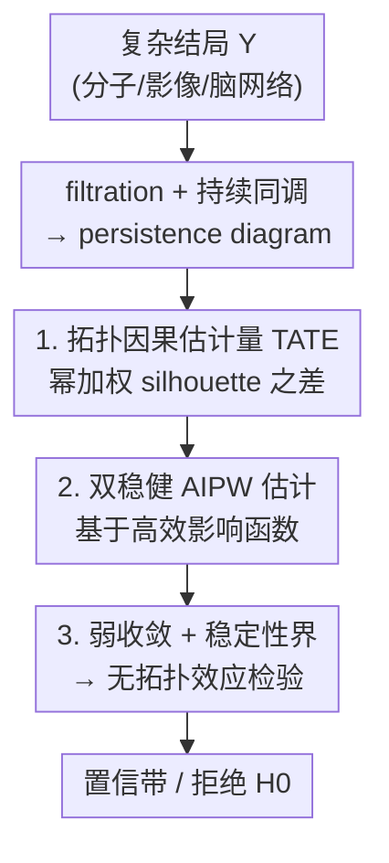

# Topological Causal Effects

**会议**: ICLR 2026  
**OpenReview**: [https://openreview.net/forum?id=dYaos1ITw4](https://openreview.net/forum?id=dYaos1ITw4)  
**代码**: https://github.com/kwangho-joshua-kim/top-causal-effect (有)  
**领域**: 因果推断 / 拓扑数据分析  
**关键词**: 因果推断, 持续同调, 拓扑数据分析, 双稳健估计, 函数型结局

## 一句话总结
本文把因果处理效应定义在结局的**拓扑结构**上——用持续同调（persistence diagram）的幂加权 silhouette 函数刻画"处理引起的拓扑变化"，提出一个完全非参数、$\sqrt{n}$ 速率的双稳健 AIPW 估计量，并基于函数型弱收敛和 silhouette 稳定性界构造了"是否存在拓扑效应"的形式化假设检验。

## 研究背景与动机

**领域现状**：经典因果推断在 potential-outcome 框架下，通过对比反事实结局来定义处理效应（如平均处理效应 ATE）。这套方法默认结局是标量或能用欧氏空间的简单汇总统计量（均值、方差）来概括。

**现有痛点**：现代科学里很多结局本质上是**非欧、高维、无结构**的——大分子的折叠构象、大脑的连接网络、医学影像里的病灶分布。这些对象上"处理真正改变了什么"往往体现为**结构/形状的变化**（比如多出一个环、连通块合并），而不是某个标量均值的平移。用欧氏汇总量去测，这类变化会被直接漏掉。

**核心矛盾**：拓扑结构的差异（增加了一个 loop、voids 数量变了）在欧氏特征向量里几乎不可见；即便把结局硬塞进某个 ad-hoc 欧氏特征再跑标准 ATE 估计，这个特征和底层拓扑对象之间也**没有原理性的联系**，得到的"效应"难以解释，更谈不上有效的推断。

**本文目标**：(i) 直接用拓扑汇总量定义一个因果估计量；(ii) 给出对应的非参数估计与统计推断；(iii) 提供"有没有拓扑效应"的形式化检验。

**切入角度**：拓扑数据分析（TDA）的持续同调能从复杂数据里抽出**多尺度、对扰动稳定**的拓扑描述子（连通分量、环、空腔随分辨率参数的生灭）。作者把 persistence diagram 嵌入到函数空间——用**幂加权 silhouette 函数** $\phi(t;D)$ 表示——于是一条曲线就成了住在可分 Hilbert 空间里的结局，可以套用函数型因果推断的机器。

**核心 idea**：把因果效应直接定义成"处理组与对照组 silhouette 函数的期望之差"$\psi_d(t)=\mathbb{E}[\phi^1_{i,d}(t)-\phi^0_{i,d}(t)]$，即**拓扑平均处理效应（TATE）**，再为这个函数型估计量配上双稳健估计与弱收敛推断。

## 方法详解

### 整体框架

方法要解决的是"如何严格地估计处理对结局拓扑的影响"。整条管线把每个复杂结局 $Y$ 先转成拓扑描述子、再转成一条函数曲线，把这条曲线当作 potential outcome，于是因果问题被还原为一个**函数型结局的处理效应估计 + 推断**问题。

观测样本为 $\{Z_i=(X_i,A_i,Y_i)\}_{i=1}^n$，其中 $A_i\in\{0,1\}$ 是二值处理、$X_i\in\mathbb{R}^l$ 是协变量、$Y_i$ 是复杂结局。流程是：① 对结局 $Y_i$ 按数据模态选一个 filtration（点云用 Vietoris–Rips/α、图像用 cubical 的 sublevel/superlevel、图用 clique），构造嵌套的单纯复形族；② 计算 $d$ 阶持续同调，得到 persistence diagram $D_{i,d}$（记录每个拓扑特征的生时 $a$、死时 $b$）；③ 把 diagram 嵌入函数空间，算出幂加权 silhouette $\phi_{i,d}(t)$；④ 在 silhouette 上定义因果估计量 TATE $\psi_d(t)$，并用 AIPW 双稳健估计；⑤ 基于弱收敛和稳定性界做推断与假设检验。

### 关键设计

**1. 拓扑平均处理效应 TATE：把因果估计量直接定义在拓扑汇总量上**

这一步针对的痛点是"欧氏汇总量看不见结构变化"。作者不在标量上定义对比，而是先把 persistence diagram $D$ 嵌入函数空间。对 diagram 里每个点 $p=(a_p,b_p)$ 定义帐篷函数 $\Lambda_p(t)=\max\{0,\min\{t-a_p,\,b_p-t\}\}$，再取幂加权平均得到 silhouette

$$\phi(t;D,r)=\frac{\sum_{p\in D}(b_p-a_p)^r\,\Lambda_p(t)}{\sum_{p\in D}(b_p-a_p)^r},\quad t\in T.$$

幂指数 $r$ 控制对长寿命特征的强调：$r$ 越大越突出持久（更可能有意义）的拓扑特征，$r$ 越小越照顾短寿命特征。在此基础上，$d$ 阶 TATE 定义为两个 potential outcome 的 silhouette 期望之差

$$\psi_d(t):=\mathbb{E}\big[\phi^1_{i,d}(t)-\phi^0_{i,d}(t)\big],\quad t\in T.$$

它是住在 Hilbert 空间里的**函数型**因果效应：$\psi_d(t)>0$ 表示处理组在尺度 $t$ 上 $d$ 维拓扑特征更强/更多，$\psi_d(t)<0$ 表示被削弱。这样定义有四个好处——尺度感知（曲线按 filtration 参数 $t$ 索引，能定位拓扑变化发生在哪个几何尺度）、对噪声稳健（幂加权压低短寿命的伪特征）、可向量化（住在可分 Hilbert 空间，便于理论分析和接入梯度式 pipeline）、天然契合函数型因果推断。在标准三条因果假设（一致性 C1、无未观测混杂 C2、正性 C3）下，$\psi_d(t)$ 可被逐点识别为
$$\psi_d(t)=\mathbb{E}\Big[\tfrac{A_i\,\phi_{i,d}(t)}{\pi(X_i)}-\tfrac{(1-A_i)\,\phi_{i,d}(t)}{1-\pi(X_i)}\Big],$$
其中 $\pi(x)=P(A=1\mid X=x)$ 是倾向得分。和"把 diagram 拍成 ad-hoc 欧氏向量再跑标准 ATE"的启发式不同，这里的估计量在原理上**直接锚定 persistence-diagram 的几何**，silhouette 只是把它做成 Hilbert 空间里良定义的函数型目标。

**2. 双稳健 AIPW 估计量：靠高效影响函数拿到 $\sqrt{n}$ 速率与双稳健性**

识别式 (4)(5) 直接给出两种朴素估计：plug-in 回归 $\hat\psi_{\mathrm{PI},d}$（拟合条件 silhouette 回归 $\mu_a(t,x;d)=\mathbb{E}\{\phi_d(t)\mid X=x,A=a\}$）和 IPW $\hat\psi_{\mathrm{IPW},d}$（只需倾向得分 $\hat\pi$）。但它们各自把收敛速率绑死在单个讨厌参数（nuisance）上：PI 受 $\hat\mu_a-\mu_a$ 拖累，IPW 受 $\hat\pi-\pi$ 拖累，在灵活非参数学习下要达到 $\sqrt{n}$ 推断需要苛刻的速率条件。

作者改用半参数高效理论，构造未中心化的高效影响函数（EIF）

$$\phi_d(t,Z;\eta)=\mu_1(t,X;d)-\mu_0(t,X;d)+\Big(\tfrac{A}{\pi(X)}-\tfrac{1-A}{1-\pi(X)}\Big)\{\phi_d(t)-\mu_A(t,X;d)\},$$

其期望恰为 $\psi_d(t)$。对应的增广 IPW 估计量 $\hat\psi_{\mathrm{AIPW},d}(t)=\mathbb{P}_n\{\hat\phi_d(t)\}$ 带来经典的二阶余项结构和**双稳健**行为：只要倾向得分 $\hat\pi$ 与回归 $\hat\mu_a$ 中**有一个**估对，估计就一致；并且在乘积速率条件（A4，例如各自 $o_P(n^{-1/4})$）下达到 $\sqrt{n}$ 速率与半参数效率界。为了让任意复杂的 nuisance 学习器都能用，作者采用 sample splitting——在 $\hat{\mathbb{P}}$ 上拟合 $\hat\eta=\{\hat\pi,\hat\mu_0,\hat\mu_1\}$，在独立样本 $\mathbb{P}_n$ 上做去偏，避免对 nuisance 施加 Donsker 类经验过程限制（全样本效率可用 cross-fitting 找回）。

**3. 函数型弱收敛 + silhouette 稳定性界：把"有没有拓扑效应"做成形式化检验**

结局是按 filtration 尺度 $t$ 索引的整条曲线，逐点正态性不够，要在 $\ell^\infty(T)$ 上做有效推断必须有泛函中心极限定理。作者证明（Theorem 5.2）：在 (A1)–(A4) 与 Lipschitz 型正则条件（A5 或 A5′）下，
$$\sqrt{n}\{\hat\psi_{\mathrm{AIPW},d}(t)-\psi_d(t)\}\rightsquigarrow G_d(t)\ \text{in}\ \ell^\infty(T),$$
$G_d$ 是均值零的高斯过程，协方差由 EIF 给出。这里关键支撑是 silhouette 关于索引 $t$ 的 Lipschitz 性（Lemma 2.1：$\sup_{|s-t|\le\delta}|\phi(s;D)-\phi(t;D)|\le\delta$），它让"指标类 P-Donsker"这一条件变得可信。

但要检验"无拓扑效应"，还需要把 silhouette 的差异和 persistence diagram 在度量空间里的差异挂钩——直接拿向量化的 silhouette 做检验，在 diagram 的度量空间里一般是无效的。为此作者新证了一条**幂加权 silhouette 的稳定性界**（Theorem 5.3，据称文献首次）：在有界性假设 A6 下，
$$\|\phi-\phi'\|_\infty\le(1+2Lr\,c^{\,r-1})\,W_1(D,D'),$$
即 silhouette 的 sup-范数差被两个 diagram 的 1-Wasserstein 距离控制。把这条稳定性界和高斯弱收敛拼起来，就得到针对原假设 $H_0:W_1(D^1_d,D^0_d)=0$（此时 $\psi_d(t)\equiv0$）的形式化检验（Corollary 5.4）：取统计量 $T_n=\sqrt{n}\,\|\hat\psi_{\mathrm{AIPW},d}\|_\infty$，它在 $H_0$ 下收敛到 $\|G_d\|_\infty$，用高斯/Rademacher multiplier bootstrap 估计临界值 $c_{1-\alpha}$，当 $T_n>c_{1-\alpha}$ 时拒绝——该检验渐近 size 为 $\alpha$，且对任意 $\|\psi_d\|_\infty>0$ 的固定备择一致（功效趋于 1）。

### 损失函数 / 训练策略
本文不涉及深度网络训练，"训练"即拟合两个 nuisance：倾向得分 $\pi$ 用随机森林分类器，条件 silhouette 回归 $\mu_a$ 用 function-on-scalar 回归（Fourier 基展开）。两者在 sample-splitting 的 $\hat{\mathbb{P}}$ 上拟合，最终 AIPW 估计在独立的 $\mathbb{P}_n$ 上构造。幂指数 $r$ 视作问题相关的调参，可用领域知识或在某个处理臂内做验证/交叉验证选取；实验中效应的定性形状与显著性在一段 $r$ 范围内都稳定。

## 实验关键数据

实验在两个半合成数据集 + 一个合成数据集（ORBIT，附录）上展开。协变量 $X\in\mathbb{R}^5$ 取自带子群结构的多元高斯，处理按 $\pi(X)=\mathrm{expit}(-0.5X_1-0.1X_2+0.6X_3+\dots+0.5X_2X_3-0.7X_1X_3)$ 分配，使一个子群更可能受处理。所有实验重复 20 次。核心比较对象是 PI、IPW、AIPW 三种估计量对**已知真值 TATE** 的重建质量。

### 主实验

| 数据集 / 同调阶 | 真值效应特征 | PI | IPW | AIPW |
|------|------|------|------|------|
| SARS-CoV-2（CT 影像，0 维） | 设计出的明确因果效应 | 系统性**低估** | 系统性**高估** | 偏差最小、最贴真值形状 |
| GEOM-Drugs（分子图，0 维） | 负效应（连通块被合并） | 基本贴合 | 基本贴合 | 最准 |
| GEOM-Drugs（分子图，1 维） | 正效应（处理诱导新 loop） | 漏掉复杂曲率 | **高估** 1 维效应 | 最准、最可靠 |

SARS-CoV-2 实验中，手工把 500 个感染样本设为 $Y^0$，$Y^1$ 取 75% 非感染 + 25% 感染，使真值 TATE 已知；感染患者 CT 的磨玻璃影/实变体现为 0 维 persistence diagram 上的孤立区域。GEOM-Drugs 实验把每个图节点按特征加权求标量、边权取相邻节点权的较大者，再做 sublevel 集 filtration；$Y^0$ 为 1000 个单环图，$Y^1$ 取 75% 双环 + 25% 单环。

### 消融 / 估计量对比

| 估计量 | 依赖的 nuisance | 表现 | 说明 |
|------|---------|------|------|
| PI（plug-in 回归） | 仅 $\hat\mu_a$ | 倾向**低估**、漏掉复杂曲率 | 受回归误差一阶偏差拖累 |
| IPW | 仅 $\hat\pi$ | 倾向**高估** | 受倾向得分误差一阶偏差拖累 |
| AIPW（本文） | $\hat\pi$ 与 $\hat\mu_a$ | 偏差最小、最贴真值 | 双稳健 + 二阶余项，达 $\sqrt{n}$ 效率 |

### 关键发现
- AIPW 在三组（0 维 CT、0 维分子图、1 维分子图）上都给出对真值 silhouette 最准的重建，PI/IPW 则呈现一致方向的系统性偏差（PI 偏低、IPW 偏高），与第 5 节的双稳健理论一致。
- 拓扑因果效应能区分"看似相近但结构不同"的结局：1 维 silhouette 上 GEOM-Drugs 的强正效应正确反映了"处理诱导新 loop"，这是欧氏汇总量看不出来的。
- silhouette 差曲线的**符号**编码拓扑变化方向：正值对应处理下涌现的特征，负值对应消失的特征——给出了可解释的"哪种结构在哪个尺度被处理改变"的读法。

## 亮点与洞察
- **把因果估计量直接定义在度量空间的拓扑对象上**：不是先向量化再套 ATE，而是先定义 TATE、再用 silhouette 做 Hilbert 空间嵌入，使估计量与底层 persistence diagram 有原理性对应——这是和已有"TDA 当正则项"工作的根本区别。
- **silhouette 的两条数学性质各司其职**：Lipschitz 性（Lemma 2.1）撑起函数型弱收敛，Wasserstein 稳定性界（Theorem 5.3）把曲线差和 diagram 的度量差挂钩，两者合起来才换来一个在 diagram 度量空间里**有效**的检验。
- **幂指数 $r$ 是可解释的"尺度旋钮"**：只决定强调长/短寿命特征，不影响识别、估计与推断，因此可放心当调参——这种"参数只调侧重、不动统计有效性"的设计很干净。
- 思路可迁移：任何"结局是复杂对象、关心结构而非均值"的因果问题（脑网络、动力系统、影像诊断）都能套这套"filtration→diagram→silhouette→TATE→AIPW"的管线，只需换前端的 filtration。

## 局限与展望
- **silhouette 会模糊变化特征的精确数目**：它把多个帐篷函数聚成单条加权曲线，看不出"到底几个同调特征变了"；作者指出可改用逐个 persistence landscape 函数获得更细的拓扑分辨率。
- **只擅长宏观拓扑变化**：对细粒度、局部的结构变化不敏感，这类情形需并行估计标准因果估计量（可能要先预处理）。
- **计算开销大**：持续同调本身昂贵；可换更高效的拓扑汇总（如 Euler 特征曲线）缓解。
- **设置受限**：当前只覆盖二值处理的横截面设定，连续处理、工具变量、纵向暴露等更复杂因果结构尚待扩展；实验也以半合成/合成、已知真值为主，缺真实未知效应的应用验证。

## 相关工作与启发
- **vs 标准 ATE（欧氏汇总）**：标准方法对比标量/欧氏汇总下的反事实，本文对比 persistence-silhouette 曲线，能捕捉"增减一个 loop/合并连通块"这类结构效应；代价是估计量更复杂、计算更重。
- **vs 把 TDA 当正则项的因果 pipeline（如 Farzam et al. 2025）**：他们把拓扑信息塞进常规 ATE 流程做正则，估计目标仍是欧氏量；本文把因果估计量**本身**就定义成拓扑量，并配套非参数估计与推断。
- **vs 函数型因果推断（Ecker et al. 2024；Testa et al. 2025）**：本文属于这条新兴线路，但专门处理"结局是 persistence diagram"的情形，并在 A5 上用比 Testa 等更弱的正则条件（只需 $\mu_a$ 一致收敛到 Lipschitz 极限，而非对 $\hat\mu_a$ 样本路径直接施加 Lipschitz 模），同时给出 silhouette 稳定性界与形式化检验。

## 评分
- 新颖性: ⭐⭐⭐⭐⭐ 首次把因果估计量直接定义在持续同调汇总量上，并补上非参数估计、弱收敛与形式化检验的完整链条
- 实验充分度: ⭐⭐⭐⭐ 三个数据集、20 次重复、PI/IPW/AIPW 对比清晰，但都是已知真值的半合成/合成，缺真实未知效应应用
- 写作质量: ⭐⭐⭐⭐⭐ 从动机、识别、估计到推断与检验层层递进，定理与假设交代严谨
- 价值: ⭐⭐⭐⭐⭐ 为复杂/非欧结局的因果分析打开新范式，前端换 filtration 即可迁移到多种模态

<!-- RELATED:START -->

## 相关论文

- [\[ICLR 2026\] Debiased Front-Door Learners for Heterogeneous Effects](debiased_front-door_learners_for_heterogeneous_effects.md)
- [\[ICLR 2026\] Influence without Confounding: Causal Discovery from Temporal Data with Long-term Carry-over Effects](influence_without_confounding_causal_discovery_from_temporal_data_with_long-term.md)
- [\[AAAI 2026\] Learning Subgroups with Maximum Treatment Effects without Causal Heuristics](../../AAAI2026/causal_inference/learning_subgroups_with_maximum_treatment_effects_without_causal_heuristics.md)
- [\[ICLR 2026\] Learning Exposure Mapping Functions for Inferring Heterogeneous Peer Effects](learning_exposure_mapping_functions_for_inferring_heterogeneous_peer_effects.md)
- [\[NeurIPS 2025\] Transferring Causal Effects using Proxies](../../NeurIPS2025/causal_inference/transferring_causal_effects_using_proxies.md)

<!-- RELATED:END -->
