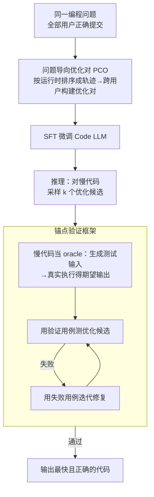

# A Problem-Oriented Perspective and Anchor Verification for Code Optimization

**会议**: ICLR 2026  
**arXiv**: [2406.11935](https://arxiv.org/abs/2406.11935)  
**代码**: 无  
**领域**: 代码智能  
**关键词**: 代码优化, LLM, 问题导向, 锚点验证, 程序性能  

## 一句话总结
提出以问题为导向（而非用户为导向）的优化对构建方法来整合多程序员的策略多样性，并设计锚点验证框架利用"慢但正确的代码"生成测试用例来缓解"优化税"（正确性损失），将优化比从 31.24% 提升到 71.06%，加速比从 2.95x 提升到 6.08x。

## 研究背景与动机

**领域现状**：LLM 在代码生成任务上表现出色，但在代码性能优化（最小化执行时间）上的能力尚未充分挖掘。

**现有痛点**：当前方法 (PIE) 从同一用户的迭代提交中构建优化对，导致 LLM 局限于局部优化改进，忽略了全局算法创新。同时代码优化存在"优化税"——LLM 优化后的代码频繁出现正确性问题。

**核心矛盾**：代码优化本质是双目标问题（效率+正确性），但两者经常冲突。用户导向的优化对仅反映单个程序员的思维模式，缺乏策略多样性。

**本文目标** (a) 如何构建更丰富多样的优化对来激发 LLM 的全局优化能力；(b) 如何缓解代码优化中的正确性损失。

**切入角度**：从用户导向转为问题导向——将同一问题的所有用户提交按运行时排序形成新的优化轨迹；利用优化前代码"慢但正确"的特性生成验证用的测试用例。

**核心 idea**：用多用户视角的问题导向优化对激发全局算法创新，用锚点验证框架利用原始慢代码作为正确性锚点来修复优化税。

## 方法详解

### 整体框架
这篇论文要解决的是 LLM 代码优化里两个纠缠在一起的问题：训练数据本身缺乏全局算法层面的多样性，以及优化后代码频繁丢正确性（论文称之为"优化税"）。它的整体思路是先换一个视角造数据、再补一道验证关。前半部分是问题导向的优化对构建（PCO），把同一编程问题下所有用户的提交打通，按运行时排序后跨用户拉优化对；后半部分是锚点验证框架，借优化前的慢代码当正确性参照，给优化后的代码生成测试用例并迭代修复。训练阶段用 PCO 数据 SFT 一个 Code LLM，推理阶段对每个候选过一遍锚点验证。

### 关键设计

**1. 问题导向优化对 (PCO)：打破用户边界，让数据带上多人的算法策略**

过去 PIE 的做法是从同一个用户的迭代提交里拉优化对，问题在于一个人的连续提交往往只是局部微调（变量改写、循环展开），算法主干没变——表现为优化前后的 GED（图编辑距离）很小、语义嵌入聚成一团，LLM 学到的也就只是这种小修小补。PCO 换成以问题为单位：对一个编程问题 $\mathcal{P}$，把所有用户的正确提交收集起来，按运行时从慢到快排成一条轨迹 $[A_1, C_1, B_1, A_2, ...]$，再沿这条轨迹构建优化对。这样一对的两端可能来自完全不同的程序员，天然就横跨了多种解法，包含更多从 $O(n^2)$ 到 $O(n\log n)$ 这类全局算法变革（对应 GED 大、语义嵌入分散）。顺带还解决了数据稀缺：优化对的数量从按用户切分的 $\sum_u C_{n_u}^2$ 涨到打通后的 $C_{\sum_u n_u}^2$，当一个问题有 10 个用户时数量级直接抬高一档。

**2. 锚点验证框架：用"慢但正确"的原始代码当 oracle，把优化税收回来**

代码优化和代码生成有一个结构性差异可以利用——优化前的代码虽然慢，但它一定是正确的，于是可以直接拿它当测试预言机（oracle），而不用像代码生成那样从零合成测试用例（合成出来的期望输出本身可能就是错的）。框架分四步：先让 LLM 读懂慢代码、生成一批测试输入；再把这些输入喂给慢代码真实执行（而不是让 LLM 去预测输出），得到精确的期望输出；输入和输出配对就成了可信的验证测试用例；最后用这批测试用例去跑优化后的代码，哪里挂了就拿失败用例迭代修复。举个具体过程：优化版本若在某个边界输入上算错，慢代码在同一输入上跑出的正确结果就直接暴露了差异，修复就有了明确的对照目标。也正因为有了这道关，正确性和效率不再是只能二选一——实验里加上锚点验证后优化比和正确率是同时上升的。

### 损失函数 / 训练策略
使用 SFT 微调 Code LLM（DeepSeek-Coder、Qwen2.5-Coder 等），在 PCO 优化对上训练。推理时使用 best@k 策略（采样 k 个候选，选最快且正确的）。评估使用 gem5 CPU 模拟器度量运行时。

## 实验关键数据

### 主实验

**PIE vs PCO 微调效果 (best@8):**

| 模型 | 训练数据 | %Opt↑ | Speedup↑ | Correct↑ |
|------|---------|-------|----------|----------|
| DS-Coder 6.7B | PIE | 31.24% | 2.95x | 61.14% |
| DS-Coder 6.7B | **PCO** | **58.90%** | **5.22x** | 61.55% |
| DS-Coder 6.7B | PCO+锚点验证 | **71.06%** | **6.08x** | **74.54%** |

### 消融实验

| 配置 | %Opt | Speedup | Correct |
|------|------|---------|---------|
| PIE (用户导向) | 31.24% | 2.95x | 61.14% |
| PCO (问题导向) | 58.90% | 5.22x | 61.55% |
| + 锚点验证 | 71.06% | 6.08x | 74.54% |

### 关键发现
- 问题导向视角使优化比几乎翻倍 (+27.66pp)，且加速比大幅提升（2.95x→5.22x），说明跨用户策略整合的重要性
- 人工分析表明 PCO 中全局算法优化占多数，而 PIE 中以局部优化为主
- 锚点验证框架进一步提升正确性 (+12.99pp)，同时优化比也继续提升 (+12.16pp)——正确性和效率并非完全冲突
- 问题导向方法不仅改善效果，还大幅缓解了数据稀缺问题（优化对数量增加一个数量级）

## 亮点与洞察
- **视角转换的力量**：从"用户迭代"到"问题聚合"看起来很简单，但效果巨大——关键洞察是代码优化需要算法级别的创新（如从 O(n²) 到 O(n log n)），这很难来自同一人的迭代改进
- **慢代码作为 Oracle**：代码优化与代码生成的结构性差异——优化前代码是天然的测试预言机。这个洞察巧妙且独特于代码优化场景
- **数据规模效应**：问题导向方法的组合爆炸特性 ($C_{\sum n_u}^2 \gg \sum C_{n_u}^2$) 自然解决了数据稀缺问题

## 局限与展望
- 仅关注 C++ 代码的执行时间优化，语言和优化维度（内存、能耗）的泛化未探索
- 锚点验证框架依赖 LLM 生成有效测试输入——如果生成的输入不够多样，可能无法检测出所有错误
- 使用 gem5 模拟器评估而非真实硬件，运行时度量可能与实际部署有差异
- 竞赛编程风格的代码优化与实际工程项目的代码优化存在差距

## 相关工作与启发
- **vs PIE (Shypula et al.)**: PIE 首创代码优化对的思路，但仅用用户导向视角；PCO 通过问题导向视角和锚点验证全面超越
- **vs 代码生成验证**: 代码生成中的测试用例合成方法 (CodeT) 需要双向执行过滤；锚点验证利用原始代码作为 oracle 更可靠
- **vs 编译器优化**: 编译器做硬件级 (-O3) 优化，本文做算法级优化，两者互补

## 评分
- 新颖性: ⭐⭐⭐⭐ 视角转换和锚点验证都有创新性，但核心思路相对直观
- 实验充分度: ⭐⭐⭐⭐⭐ 多维分析（结构/语义/人工）、多模型对比、消融实验详尽
- 写作质量: ⭐⭐⭐⭐ 逻辑清晰，动机阐述充分
- 价值: ⭐⭐⭐⭐ 为 LLM 代码优化提供了有效的数据构建和验证方法论

<!-- RELATED:START -->

## 相关论文

- [\[ICLR 2026\] SpotIt: Evaluating Text-to-SQL Evaluation with Formal Verification](spotit_evaluating_text-to-sql_evaluation_with_formal_verification.md)
- [\[ICLR 2026\] Local Success Does Not Compose: Benchmarking Large Language Models for Compositional Formal Verification](local_success_does_not_compose_benchmarking_large_language_models_for_compositio.md)
- [\[ICLR 2026\] From Large to Small: Transferring CUDA Optimization Expertise via Reasoning Graph](from_large_to_small_transferring_cuda_optimization_expertise_via_reasoning_graph.md)
- [\[ACL 2026\] QiMeng-PRepair: Precise Code Repair via Edit-Aware Reward Optimization](../../ACL2026/code_intelligence/qimeng-prepair_precise_code_repair_via_edit-aware_reward_optimization.md)
- [\[ICLR 2026\] BOAD: Discovering Hierarchical Software Engineering Agents via Bandit Optimization](boad_discovering_hierarchical_software_engineering_agents_via_bandit_optimizatio.md)

<!-- RELATED:END -->
