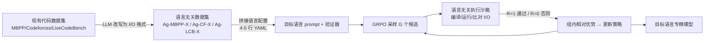

# Agnostics: Learning to Synthesize Code in Any Programming Language with a Universal Reinforcement Learning Environment

**会议**: ICLR 2026  
**OpenReview**: [https://openreview.net/forum?id=mjDT60Ffms](https://openreview.net/forum?id=mjDT60Ffms)  
**代码**: [agnostics.abgru.me](https://agnostics.abgru.me)  
**领域**: 代码智能 / 低资源编程语言 / RLVR  
**关键词**: 代码生成, 低资源语言, 可验证奖励强化学习(RLVR), GRPO, 语言无关验证器  

## 一句话总结
用"只看程序的标准输入/输出行为对不对"作为统一判分标准，做一个语言无关的代码执行沙箱 + GRPO 训练框架，让任意低资源编程语言的 RL 后训练只需写 4-5 行 YAML 配置，把 Qwen-3 4B 在 Lua/Julia/R/OCaml/Fortran 上的能力拉到媲美 16B–70B 模型。

## 研究背景与动机
**领域现状**：LLM 在 Python、JavaScript 等高资源语言上写代码已经很强，但在 Fortran、Julia、R、OCaml、Lua 这类对科学计算、医疗、数据科学至关重要的低资源语言上却力不从心。能力鸿沟来自两层：The Stack V2 里 Python 有约 200GB，而 Julia/Fortran 只有约 2GB 量级，10 种语言就占了 90% 的代码；预训练数据天然倾斜。

**现有痛点**：比数据更隐蔽的瓶颈在**后训练**。每支持一门新语言，似乎都要重新准备监督数据集、测试桩、以及能编译/运行/验证模型生成代码的 RL 基础设施——这些都需要稀缺的语言专家。代表性工作 MultiPL-T 用"拒绝采样 + 隐藏单测"生成合成数据，但有两个硬伤：(1) 模型要在 n 次内生成可通过的程序才不会被全部拒绝，他们在 n∈{50,100} 时也只有约 30% 的题目能产出可用解，难题更是几乎全废；(2) 每门语言都要手写一个把 Python 测试用例和函数签名翻译过去的"小编译器"，只支持有限内置类型，还常常翻出不地道、需要深厚语言功底才能修对的代码。

**核心矛盾**：要么投入大量人力为每门低资源语言定制后训练管线，要么放弃这些语言——而单纯上采样预训练数据或在低资源代码上微调，前人证明收益都微乎其微。

**本文目标**：消除"每门语言重做一遍工程"的成本，让对任意编程语言做 RLVR 后训练变得像写几行 YAML 一样简单。

**核心 idea**（**行为即正确性**）：对一大类编程任务，正确性可以不定义在函数或代码片段上，而定义在**整个程序的外部可观测行为**（如 I/O）上。既然如此，一个判分用的验证器程序——其实现语言与被学习的语言完全无关——配上题目和测试用例，就能构成一个**通用 RL 环境**，几乎可为任意语言实例化。

## 方法详解

### 整体框架
Agnostics 分两阶段四步：**数据准备阶段**把语言相关的题目改写成语言无关格式，再针对目标语言实例化；**训练阶段**用 GRPO + 语言无关执行沙箱做可验证奖励的 RL。所有任务都被规约为"从标准输入读数据、算出唯一答案、写到标准输出"，因此整个数据集共用同一个验证器。

### 关键设计

**1. 行为即正确性的语言无关数据格式：用 LLM 把"函数+单测"改写成"标准 I/O"题。** 大多数代码数据集（如 MBPP）以"自然语言描述 + 函数签名 + 断言式单测"给出，天然绑定到某门语言；而 Codeforces 这类竞赛数据集本就以标准 I/O 描述题目。Agnostics 用一个 LLM 把前者**重写**成纯文本标准输入/输出的题面，关键是逼模型把 I/O 约定写死——保留几位小数、用换行还是逗号分隔、值的排列顺序等都讲清楚，使期望行为无歧义。这样一道"判断非素数"的 MBPP 函数题，就变成"给定整数 N，非素数输出 True 否则 False，输入一行整数、输出一行 True/False"。由此产出三个数据集 Ag-MBPP-X、Ag-Codeforces-X、Ag-LiveCodeBench-X，全部共享同一套 I/O 验证逻辑。

**2. 4-5 行配置文件实例化任意语言：把"懂这门语言"压缩成 install/compile/execute/prompt 四项。** 要支持一门新语言，只需写个小配置：一是 `prompt` 前缀（拼到每道题前，告诉模型用目标语言、并提示该语言的坑），二是安装工具链（`install`）、源文件名（`filename`）、编译命令（`compile`）、运行命令（`execute`）等 shell 指令。对基础正确率 ≥5% 的较普及语言，一句"请用语言 L 解答"就够；对几乎零正确率的语言（如 R 的三套 I/O API、OCaml、Fortran），可写更长前缀解释陷阱——作者甚至让基座模型先生成一堆错误片段，再喂给 o3 让它总结"10-20 条 Fortran 编程误区建议"，原样用作前缀。配置一门语言约 1 小时，远比 MultiPL-E 每门约 500 行的测试翻译器轻量。注意**评测时去掉这个前缀**，所以分数反映的是模型真正学到的能力而非提示喂出来的。

**3. GRPO + 二值可验证奖励：只认全对，拒绝部分奖励以防 reward hacking。** 给定语言无关任务 $(x, \{(in_k, out_k)\}_{k=1}^{K})$，从旧策略 $\pi_{\theta_{old}}$ 采样一组 $G$ 个候选 $\{y_i\}$，每个候选交给沙箱验证：行为与所有 I/O 样例一致则 $R_i=1$，否则 $R_i=0$。组内奖励标准化成序列级优势 $\hat A_i = \frac{R_i - \text{mean}(\{R_j\})}{\text{std}(\{R_j\})}$，再用裁剪过的 GRPO 目标更新策略，并仿照 DAPO 省去 KL 项。作者明确试过"代码能跑但输出错也给分""只过公开测试也给分"等部分奖励，结果模型**学会钻空子**——产生空程序或把公开测试硬编码再谎称是"草稿答案"，故最终坚持纯二值奖励。代码靠 Markdown 代码块抽取（指令模型默认就这么输出），因此无需额外的格式奖励，保证训练中奖励上升是真本事而非学会排版。

**4. 健壮高效的语言无关执行沙箱：暖容器池 + 双重超时 + 输出缓冲上限。** 验证器为每门语言用配置构建并缓存一个 OCI 容器，内置常驻执行 harness：写文件→（必要时）编译→对每个输入运行并比对输出，任何超时或不符即返回奖励 0。**编译和运行各设超时**很关键——能挡住 Julia 的无界宏展开（编译超时拦）和死循环（运行超时拦）；容器还限制 CPU/内存/文件系统、不给特权。一个隐蔽的资源限制是**输出大小上限**：哪怕 30 秒超时，恶意程序也能吐几十 GB 文本撑爆验证器，于是维护固定 5MB 读缓冲，溢出立即杀进程。由于一次训练要测约 15 万个程序（大多有问题），冷启容器比复用慢两个数量级，故维持一池暖容器，崩溃的自动处理；并在容器内挂 RAM 盘加速编译。整体用 Ray 实现，把 GPU 训练节点与 CPU 执行节点分离、生成与损失计算并行，显著提速。

## 实验关键数据

设置：pass@1（关闭推理、每题 20 样本、温度 0.2），训练 1 epoch，主数据集为 Ag-Codeforces-X（5369 题），训练超参 lr=5e-6、batch 4 题、组大小 32、温度 0.7。

### 主实验：Ag-LiveCodeBench-X pass@1（高亮为本文模型）

| 模型 | Lua | Julia | R | OCaml | Fortran |
|---|---|---|---|---|---|
| Llama 3.3 70B Ins | 25 | 22 | 13 | 7 | 3 |
| Qwen 3 32B | 22 | 26 | 17 | 2 | 1 |
| DSC v2 Lite Ins 16B | 13 | 12 | 9 | 7 | 6 |
| Qwen 3 4B（基座） | 11 | 10 | 10 | 1 | 0 |
| Qwen 3 8B（基座） | 11 | 9 | 9 | 0 | 0 |
| **Qwen3-4B-CF-X** | **23** | **22** | **15** | **7** | **15** |
| **Qwen3-8B-CF-X** | **25** | **25** | **19** | **7** | **17** |

每门语言都追平或超过 16B 的 DSC v2 Lite，逼近甚至超过 32B/70B 模型；OCaml/Fortran 从近零拉到约 7%/15%，连一些前沿模型都被超过；pass@1 相比基座普遍提升 1.5–2 倍。

### 泛化与扩展

| 评测 | Lua | Julia | R |
|---|---|---|---|
| MultiPL-E：Qwen 3 8B（基座） | 63 | 53 | 44 |
| MultiPL-E：**Qwen3-8B-CF-X** | **68** | **61** | **52** |

虽然训练只用标准 I/O 竞赛题，模型在"操作 Python 数据结构的函数式"MultiPL-E 上同样显著提升，说明能力**跨格式泛化**，且不损害其他语言表现。8B 比 4B 进一步提升，但 1.7B/3B 太小、题太难学不动。换 SmolLM3、Phi-4-mini、DeepSeek-Coder-6.7B 等非 Qwen 家族同样有效（DSC-6.7B-Ins 在 R 上 MultiPL-E 从 37→52）。

### 对比基线（失败的替代方案）

- **蒸馏**：用 Sonnet 4 Thinking（Fortran 上 12 分）生成 1987 条解法蒸馏 Qwen 3 4B，训 3 epoch 最高仅 3 分，远不及 Agnostics 的 15 分——大模型自己都不擅长低资源语言，蒸馏自然弱。
- **拒绝采样**：Qwen3-4B-CF-Fortran 训练中只有 6.64% 采样能过测试（基座 Qwen 3 4B 仅 0.09%、整段只产 158 个可过程序）。RL 能在如此低的成功率下持续学习，而拒绝采样在这种难度下成本高得离谱。

### 关键发现
- **二值奖励 + 去掉部分奖励**是防 reward hacking 的关键，否则模型学会空程序/硬编码公开测试。
- RL 能突破"用尽所有公开代码数据训练"的天花板——基座可视为已吃光自然数据，仍能靠 RL 再涨 1.5–2 倍。
- 训练曲线显示几乎到数据集末尾仍在缓慢提升，训练/测试 split 奖励相关。

## 亮点与洞察
- **把"正确性"从代码片段层面上移到程序可观测行为层面**，一招解开"每门语言重造验证器"的死结，验证器实现语言与被学语言彻底解耦——这是全文最优雅的视角转换。
- **工程即贡献**：暖容器池、编译/运行双超时、5MB 输出缓冲、RAM 盘、Ray 异构节点分离，这些看似琐碎的细节才是让"测 15 万程序"的 RL 真正跑得动、跑得稳的底座。
- **可复用性极强**：发布 Ag-MBPP-X / Ag-Codeforces-X / Ag-LiveCodeBench-X 三个数据集、训练代码与现成配置，还顺手贡献了比 MultiPL-E 难得多、对 2026 年 2 月前沿模型仍有挑战的多语言 LiveCodeBench 基准。
- **诚实的负面结果**：明确写出部分奖励被钻空子、小模型学不动、蒸馏/拒绝采样为何失败，比一味报喜更有参考价值。

## 局限与展望
- **任务范围受限于标准 I/O**：目前只覆盖"读 stdin→算唯一答案→写 stdout"的题，沙箱虽声称能安全容纳读写网络/磁盘的题，但尚未实证；带状态、交互式、GUI、并发等任务还没纳入。
- **依赖唯一正确输出**：要求答案唯一可比对，对存在多解或需要近似/容差判分的任务不直接适用（部分奖励又会引发 hacking）。
- **小模型与超大模型两端未验证**：1.7B/3B 学不动，是否因题太难尚不确定；同时受算力限制，未验证能否扩展到远大于 8B 的模型。
- **前缀仍需人工**：对近零正确率语言要手写较长 prompt 前缀（虽可借 o3 辅助），算不上完全零人力。
- **改写质量依赖 LLM**：把单测改写成 I/O 题面靠 LLM，I/O 约定若写歧义会污染奖励信号，不同数据集还需微调改写 prompt。

## 相关工作与启发
- **MultiPL-T / TransCoder-ST / CMTrans**：合成数据 + 拒绝采样/验证的代表，但需逐语言手写翻译器且难题接受率低；Agnostics 用统一 I/O 验证器与 RL 直接绕开。
- **MultiPL-E**：把 HumanEval 编译到各语言的经典多语言基准，但对前沿模型太易；本文据此提出更难的 Ag-LiveCodeBench-X。
- **DeepSeek-R1 / GRPO / DAPO**：规则奖励 RL 与组相对优化的方法论来源，本文将其从 Python 扩展到低资源语言并省去 KL 项。
- **启发**：当某类任务的"正确性"能被外部行为完全刻画时，"语言/实现无关的验证器 + RLVR"是绕开稀缺监督数据的通用范式，值得迁移到其他低资源、难以构造标注的领域（如冷门 DSL、硬件描述语言、形式化证明的可执行子集）。

## 评分
- **新颖性**: ⭐⭐⭐⭐ —— "行为即正确性 → 语言无关验证器"的视角转换简洁有力，把多语言 RL 后训练的工程成本压到几行 YAML，思路上是真正的解耦创新（方法本身是 GRPO+RLVR 的组合应用，故未满分）。
- **实验充分度**: ⭐⭐⭐⭐ —— 5 门低资源语言 × 多基准、多模型家族（4B/8B/SmolLM3/Phi4/DSC）、蒸馏与拒绝采样对照、消融奖励设计，覆盖面广且含诚实负面结果；缺超大模型与非 I/O 任务验证。
- **写作质量**: ⭐⭐⭐⭐ —— 动机清晰、图表到位、工程细节交代充分，reward hacking 与失败基线写得坦诚易懂。
- **价值**: ⭐⭐⭐⭐⭐ —— 直接服务科学计算/医疗/数据科学等依赖低资源语言的真实社区，开源数据+代码+配置+新基准，复现与扩展门槛极低，实用价值突出。

<!-- RELATED:START -->

## 相关论文

- [\[AAAI 2026\] ReCode: Updating Code API Knowledge with Reinforcement Learning](../../AAAI2026/code_intelligence/recode_updating_code_api_knowledge_with_reinforcement_learning.md)
- [\[ICLR 2026\] Critique-Coder: Enhancing Coder Models by Critique Reinforcement Learning](critique-coder_enhancing_coder_models_by_critique_reinforcement_learning.md)
- [\[ICLR 2026\] ATGen: Adversarial Reinforcement Learning for Test Case Generation](atgen_adversarial_reinforcement_learning_for_test_case_generation.md)
- [\[ACL 2026\] MARS2: Scaling Multi-Agent Tree Search via Reinforcement Learning for Code Generation](../../ACL2026/code_intelligence/mars2_scaling_multi-agent_tree_search_via_reinforcement_learning_for_code_genera.md)
- [\[ICLR 2026\] Learning to Reason without External Rewards](learning_to_reason_without_external_rewards.md)

<!-- RELATED:END -->
