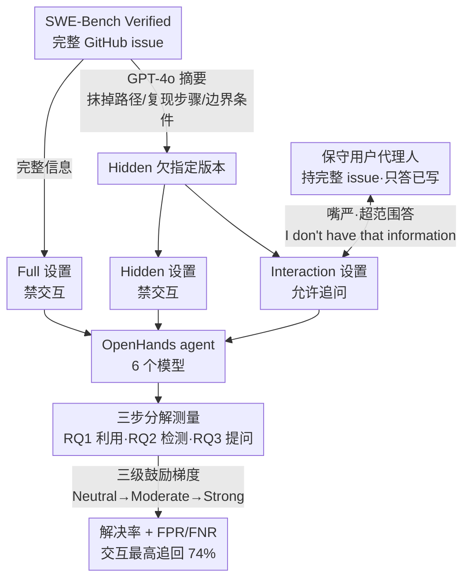

# Ambig-SWE: Interactive Agents to Overcome Underspecificity in Software Engineering

**会议**: ICLR 2026  
**arXiv**: [2502.13069](https://arxiv.org/abs/2502.13069)  
**代码**: [https://github.com/sani903/InteractiveSWEAgents](https://github.com/sani903/InteractiveSWEAgents)  
**领域**: 代码智能  
**关键词**: underspecification, interactive agent, SWE-Bench, clarification, software engineering  

## 一句话总结
构建 Ambig-SWE（基于 SWE-Bench Verified 的欠指定变体），系统评估 LLM 编程 agent 在三个维度上的交互能力——检测欠指定、提出澄清问题、利用交互信息——发现交互可将欠指定场景下的解决率提升最高 74%，但模型默认非交互行为且难以区分指定充分/不足的指令。

## 研究背景与动机
**领域现状**：LLM agent 在软件工程中被广泛部署（如 SWE-Bench 上的 OpenHands），但用户指令经常欠指定。人类开发者遇到信息不足时会主动询问，而 AI agent 则直接假设并继续执行。

**现有痛点**：(1) 欠指定指令导致错误输出、安全风险和计算资源浪费；(2) 现有关于欠指定的研究只关注缺少单一细节，而真实软件工程任务涉及多个相互依赖的信息缺口；(3) LLM 默认非交互行为——即使面对严重信息不足也不会主动询问。

**核心矛盾**：交互能有效恢复因欠指定损失的性能（最高 74%），但模型不知道什么时候该交互、该问什么、如何利用获得的信息。

**本文目标** 系统评估和量化 LLM agent 处理欠指定指令的能力，分解为可独立改进的原子能力。

**切入角度**：在 SWE-Bench Verified 上构建欠指定变体，设计三种评估设置（Full/Hidden/Interaction），用 GPT-4o 模拟用户。

**核心 idea**：将欠指定处理分解为"检测-提问-利用"三步，用交互实验量化每步的能力和改进空间。

## 方法详解

### 整体框架
Ambig-SWE 在 SWE-Bench Verified 的每条任务上构造一个"欠指定"孪生版本，再把同一个 agent 放进三种信息条件下做对照：拿到完整 GitHub issue 的 Full、拿到 GPT-4o 精简摘要的 Hidden、以及在 Hidden 基础上允许追问一个持有完整信息的用户代理人的 Interaction。三种设置都跑在 OpenHands 框架里、覆盖 6 个模型，并沿"检测欠指定 → 提出澄清问题 → 利用交互信息"三步，把"交互到底值多少分"拆成可以逐项测量的数字。下图是整条评估流水线：

### 关键设计

**1. 欠指定数据构造：把"信息缺多少"做成可控变量**

SWE-Bench Verified 的原始 issue 已被人工筛过、信息相对完整，没法直接测交互能力，于是作者用 GPT-4o 把每条 issue 摘要成只保留高层意图、抹掉具体文件路径、复现步骤、边界条件等关键细节的 Hidden 版本。这样 Full 与 Hidden 之间唯一变化的就是信息量：Full 解决率减 Hidden 解决率即为欠指定造成的性能损失，而 Interaction 能从 Hidden 往 Full 追回多少，就成了交互价值的直接读数（论文报告最高可追回 74%）。和以往只删单一细节的歧义研究不同，这里一次性抹掉多个相互依赖的细节，更贴近真实软件工程任务里信息缺口成片出现的情况；作者还用分布差异分析比对了人工标注的天然欠指定 issue，确认这种"激进删信息"的合成方式虽更狠，但与天然 vague issue 处于同一类。

**2. 保守的用户代理人：隔离信息获取能力，避免代理人幻觉污染结论**

Interaction 设置里由另一个持有完整 issue 的 GPT-4o 扮演用户来回答追问，但作者刻意把它设计得"嘴严"——只回答所持信息中明确写出的内容，一旦被问到超出 issue 范围的东西就回复 "I don't have that information"，绝不脑补（代理人还额外掌握需要修改的文件位置，被问到时才给）。这样做是因为如果代理人自由发挥，agent 涨的分就分不清是它自己会提问、还是代理人多送了信息；嘴严的代理人把测量对象牢牢锁定在 agent 自身的信息获取能力上。

**3. 三步分解的评估：把笼统的"交互能力"拆成可独立改进的原子技能**

作者把"会不会交互"拆成三个递进的研究问题分别测量。RQ1 比较 Hidden、Interaction、Full 三条解决率曲线，量化交互的整体恢复能力；RQ2 测"该不该问"——随机给模型喂 Full 或 Hidden 输入，看它能否分辨指令是否充分并据此决定是否发起交互，用准确率、假阳率（FPR，指令本已充分却多此一问）和假阴率（FNR，指令明显不足却闷头硬做）三个指标刻画；RQ3 测"问得好不好"——分析模型抛出的澄清问题是否针对真正缺失的关键信息，并把获得的信息分成 informational（错误的预期行为/性质）与 navigational（待改文件路径，本可从代码库自行恢复的冗余信息）两类看利用率。这套拆解的价值在于：一个模型可能交互后涨分（RQ1 好）却几乎从不主动发问（RQ2 差），三个指标分开看才能定位短板出在哪一环。

**4. 三级交互鼓励梯度：区分"不会问"和"没被允许问"**

模型默认极少主动交互，为判断这是能力缺失还是单纯没被允许，作者用强度递增的三档 prompt 反复测同一批任务：Neutral 只告知可以提问，Moderate 提醒仔细核查信息是否完整、确认无误再动手，Strong 则强调提问对完成任务至关重要。如果一个模型连 Strong 都不肯问（例如 Qwen3 Coder 在 Strong 下 FNR 仍为 $1.0$），就说明它的非交互行为已被固化进 SWE-Bench 式解题协议，光靠 prompt 救不回来——这正是诊断当前训练范式缺陷的关键证据。

> 这是一篇评估论文，不训练新模型，因此没有损失函数与训练目标。

## 实验关键数据

### 主实验（解决率 %）

| 模型 | Hidden | Interaction | Full | 恢复率 |
|------|--------|------------|------|-------|
| Claude S4 | 49.0 | 52.4 | 58.8 | **89%** |
| Claude S3.5 | 27.3 | 35.0 | 43.8 | ~80% |
| Qwen3 Coder | 45.6 | 53.6 | 59.2 | ~85% |
| Haiku 3.5 | 13.0 | 20.8 | 26.0 | ~80% |
| Deepseek-v2 | 2.0 | 7.2 | 12.2 | 59% |
| Llama 70B | 1.4 | 3.6 | 6.6 | 54% |

### 欠指定检测（Strong prompt）

| 模型 | Accuracy | FPR↓ | FNR↓ |
|------|----------|------|------|
| Claude S4 | **0.89** | 0.03 | 0.18 |
| Claude S3.5 | 0.76 | 0.36 | 0.10 |
| Qwen3 Coder | 0.50 | 0.00 | **1.00** |

### 关键发现
- **Qwen3 Coder FNR=1.0**：即使在 Strong prompt 下也从不主动交互——完全忽略欠指定！遵循固定的 SWE-Bench 解题协议
- 交互最高可提升 74%（Hidden→Interaction），但仍明显低于 Full——说明模型利用交互信息的能力有限
- 信息类型分析：获取导航信息（文件路径）对弱模型帮助最大，对强模型帮助有限（因为它们自己能定位代码）
- 模型规模/编码能力 ≠ 交互能力——Haiku（小模型）的信息利用率与 Sonnet 3.5 相当
- Claude S4 在 Hidden 场景下大量探索代码库弥补信息不足（平均 65 步），交互时增加到 75 步——交互增加了效果但不增加效率

## 亮点与洞察
- **"检测-提问-利用"的分解框架**：将模糊的"交互能力"分解为可独立评估和改进的原子技能，方法论价值高
- **揭示了训练范式的缺陷**：当前模型训练优化任务完成率，不优化"什么时候该问"——导致默认非交互行为
- **Qwen3 Coder 的刻板行为**：即使收到用户回答的信息也按固定协议重新探索——说明模型不真正理解交互的目的

## 局限与展望
- 欠指定版本由 GPT-4o 生成，可能比真实欠指定用户 issue 更"干净"
- Interaction 设置中代理人是 GPT-4o，不一定反映真实用户行为
- 仅在 SWE-Bench（Python 仓库）上评估，其他语言/领域未覆盖
- 未提出改进模型交互能力的训练方法，仅诊断

## 相关工作与启发
- **vs AQuA VQA**: AQuA 研究 VLM 对视觉歧义的策略选择，Ambig-SWE 研究编码 agent 对信息缺失的交互能力——不同模态但同一主题（如何处理不确定性）
- **vs SWE-Bench**: SWE-Bench 假设指令完整，Ambig-SWE 专门测试指令不完整时的行为——更贴近真实场景
- **vs ClearVQA**: ClearVQA 训练模型"二元选择"（答/问），Ambig-SWE 分解为三步且在复杂软件工程场景中评估

## 评分
- 新颖性: ⭐⭐⭐⭐⭐ 首次系统评估 SWE agent 的交互能力，三步分解框架新颖
- 实验充分度: ⭐⭐⭐⭐⭐ 6 个模型、3 种设置、3 级 prompt、多维分析
- 写作质量: ⭐⭐⭐⭐⭐ 实验设计严谨，分析深入
- 价值: ⭐⭐⭐⭐⭐ 对 agent 交互能力的重要诊断，直接指导未来训练方向

<!-- RELATED:START -->

## 相关论文

- [\[ICLR 2026\] SWE-RM: Execution-Free Feedback for Software Engineering Agents](swe-rm_execution-free_feedback_for_software_engineering_agents.md)
- [\[ICML 2025\] Training Software Engineering Agents and Verifiers with SWE-Gym](../../ICML2025/code_intelligence/training_software_engineering_agents_and_verifiers_with_swe-gym.md)
- [\[ICLR 2026\] BOAD: Discovering Hierarchical Software Engineering Agents via Bandit Optimization](boad_discovering_hierarchical_software_engineering_agents_via_bandit_optimizatio.md)
- [\[ICLR 2026\] Process-Level Trajectory Evaluation for Environment Configuration in Software Engineering Agents](process-level_trajectory_evaluation_for_environment_configuration_in_software_en.md)
- [\[ICLR 2026\] Kimi-Dev: Agentless Training as Skill Prior for SWE-agents](kimi-dev_agentless_training_as_skill_prior_for_swe-agents.md)

<!-- RELATED:END -->
