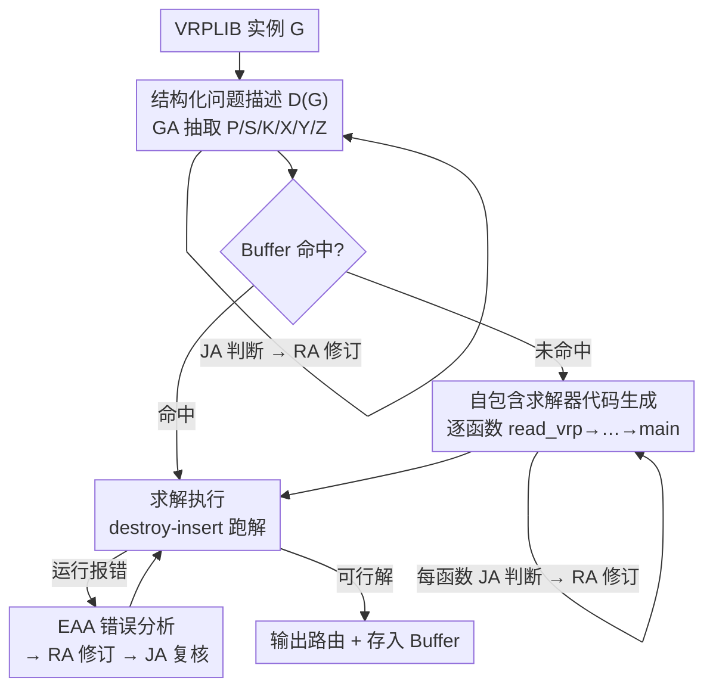

# An Agentic Framework with LLMs for Solving Complex Vehicle Routing Problems

**会议**: ICLR 2026  
**OpenReview**: [https://openreview.net/forum?id=BMOgYw4EhQ](https://openreview.net/forum?id=BMOgYw4EhQ)  
**代码**: https://github.com/ZHANG-NI/AFL （有）  
**领域**: LLM Agent / 组合优化  
**关键词**: 车辆路径问题, LLM 多智能体, 代码生成, 自包含求解器, 可信代码

## 一句话总结
AFL 把"用 LLM 解复杂车辆路径问题（VRP）"拆成问题描述、代码生成、求解三个子任务，并用生成、判断、修订、错误分析四个专职 agent 互相把关，从一份原始 VRPLIB 实例全自动产出一个不依赖外部求解器的 Python 求解器；在 60 个 VRP 变体上把 LLM 方法的运行报错率压到 0%、可行解率拉到 100%，且与人工精心设计的算法相比差距大多落在 3% 以内。

## 研究背景与动机

**领域现状**：车辆路径问题（VRP）是物流、调度里的核心组合优化问题，变体极多（带容量、时间窗、开放路径、电动车续航……）。传统做法要么靠专家把问题手写成数学模型（HGS、OR-Tools），要么训练神经求解器（POMO 系列），两者都要为新变体做大量人工适配。

**现有痛点**：把 LLM 引进来本是为了"少写代码、自动适配各种变体"，但现有 LLM 方法都没真正自动起来。它们大体分两条路：一条是给传统 VRP 进化启发式（EoH、ReEvo），只能处理常规变体；另一条是搭通用框架处理多变体（ARS、DRoC），更实用但仍有硬伤——ARS 要从预设约束库里检索模板、DRoC 要 RAG 后调用 OR-Tools，**都不是自包含的**（依赖手写模块或外部 solver），而且**没法全自动**（执行阶段还要人工抽取实例信息）。这种 LLM 代码与外部系统之间的错配，直接导致运行报错和大量不可行解。唯一做到自包含的 SGE 又只能解 TSP 这类简单问题，缺约束处理机制。

**核心矛盾**：LLM 能"读懂问题 + 写代码"，但**直接让它一口气生成一个完整 VRP 求解器极不可靠**——多个函数之间要保持一致、还要把一堆复杂约束都嵌进去，单次生成几乎必然出错；而引入外部 solver / 人工干预来兜底，又牺牲了自动化和通用性。可靠性与自动化在现有方案里是对立的。

**本文目标**：做一个同时满足**自包含**（不依赖手写模块/外部求解器）、**全自动**（从原始实例到解、零人工介入）、**高可信**（代码可靠、解可行率都接近 100%）的通用 VRP 框架。

**切入角度**：与其指望单次生成正确，不如把"一锤子买卖"拆成若干可治理的环节，并在每个环节安排专门的 agent 互相审查、迭代纠错——把不可控的端到端生成，变成可监督、可回滚的流水线。

**核心 idea**：用"三子任务分解 + 四专职 agent 协作"替代"单 prompt 一次生成"，让 LLM 充当自包含求解框架的开发者，靠 agent 间的判断—修订—错误分析闭环把可信度逐步逼到满分。

## 方法详解

### 整体框架

AFL 接收一份 VRPLIB 格式的实例 $G$，最终吐出一段能直接运行、且产生可行解的 Python 求解器代码。整条流水线被切成三个子任务：**问题描述（Problem Description）→ 代码生成（Code Generation）→ 求解（Solution Derivation）**，由四个专职 agent 协同完成——生成 agent（GA）、判断 agent（JA）、修订 agent（RA）、错误分析 agent（EAA）。

流程是这样转的：给定实例 $G$，GA 先自动从中抽取领域知识、生成一份结构化问题描述 $D(G)$，JA 判断它对不对、RA 据此反复修订，直到 JA 通过。拿到 $D(G)$ 后先查 Buffer（缓存过的"问题描述→代码"对）：若命中就直接跳到求解；否则 GA 按 `read_vrp → distance → cost → initial → destroy → insert → validate → main` 的顺序**逐个函数**生成代码，每写完一个函数就让 JA/RA 把关修订。代码齐了就执行；一旦运行报错，EAA 分析原因并给修复建议，交 RA 改、JA 复核，循环到跑出可行解为止。最后把这份 $D(G)$ 和对应代码存进 Buffer 供以后复用。

### 关键设计

**1. 三子任务分解 + 四专职 agent 协作：把不可控的端到端生成拆成可治理的环节**

直接让一个 LLM 把整个 VRP 求解器写对，等价于要它同时保证函数间一致、约束全嵌入、语法逻辑都不错，失败率高得没法用。AFL 的应对是把流水线拆成问题描述、代码生成、求解三段，每段的产物都"先审后用"。四个 agent 各司其职：GA 负责"生产"（写描述、按函数写代码）；JA 负责"质检"——判断描述是否与实例一致、代码是否满足需求且无语法/逻辑错误，不通过就给出问题说明与修改建议；RA 负责"返修"，根据 JA 的反馈和实例上下文改描述/改代码，改完再丢回 JA 复核，直到拿到肯定判断；EAA 只在求解阶段出动，专门诊断运行期错误的根因并给修复方向。这套分工的关键不在"分模块"这句空话，而在于**每个环节都有一个独立 agent 在挑错、另一个在改错，形成可迭代的监督回路**——错误被局部拦截、就地修复，而不是攒到最后一次性爆发。

**2. 结构化问题描述 $D(G)$：把原始实例翻译成代码生成的"契约"**

代码生成最容易翻车的地方是 LLM 对"这道题到底要算什么、读哪些输入、满足哪些约束"理解不一致。AFL 让 GA 从 VRPLIB 实例里自动抽出一份六元组描述 $D(G)=\{P, S, K, X, Y, Z\}$：$P$ 是问题类型（如 CVRP、VRPTW、ECVRPTW，决定生成文件名 `CVRP.py`）；$S$ 是问题类型的文字说明；$K$ 是约束集合及解释（容量、时间窗、续航等，外加 GA 自动推断的访问/车场约束）；$X$ 是求解所需输入（如节点坐标、车场 ID、需求、容量），并**强制代码里的输入变量名与 $X$ 对齐**以减少读错数据；$Y$ 是期望输出（如每条路线从车场出发、每客户恰好访问一次、不超容量的最优可行路由集）；$Z$ 是目标函数（如最小化总行驶距离）。这份描述既是给代码生成阶段的"需求规格"，又统一了命名与约束口径并贯穿全流程。JA 会从三个角度审它：是否与实例冲突、各分量是否内部自洽、$X$ 是否在实例里有据可依；有冲突时以实例上下文为准，RA 据此迭代修订。消融显示，正是这层结构化描述把后续代码的约束满足率撑了起来。

**3. 自包含 destroy–insert 求解器 + 逐函数顺序生成：彻底甩掉外部 solver**

为了做到自包含，AFL 统一采用 **destroy–insert（破坏–重插）启发式**作为求解骨架——它比固定算法灵活，能覆盖各种复杂实际变体。生成的求解器由一组相互依赖的函数构成：`read_vrp` 把 VRPLIB 解析成含 $X$ 全部字段的结构化字典，`distance` 算距离矩阵，`initial` 用贪心在 $K$ 约束下构造初始解并由 `validate` 验可行，`cost` 按目标 $Z$ 算代价，`destroy` 移除一部分客户、`insert` 把它们重新插回代价最小的可行位置（插不进就新开一辆车），`main` 用模拟退火准则编排"初始化 + T 步迭代改进"。难点在于要让这么多函数彼此一致，所以 GA **不是一次写完，而是按依赖顺序一个函数一个函数地生成**，每个新函数都建立在已通过审查的旧代码之上；每写一个，JA/RA 立刻就这一段查需求符合度、修语法/逻辑错，并反复确认 $K$ 里的约束都被嵌进去。这种"边写边校"把单次生成的负担拆小，显著提升最终求解器的可靠性，也让整个 solver 不依赖任何手写模块或外部 OR-Tools。

**4. EAA 错误分析闭环 + Buffer 复用：把执行期 bug 变成可修复信号，把算过的题缓存起来**

即使生成阶段做了约束强制，跑起来仍可能因语法、逻辑或漏约束而报错。AFL 在求解阶段引入 EAA：代码一旦执行出错，EAA 结合问题描述、代码和报错信息分析"为什么错、怎么修"，把建议交给 RA 修改、JA 复核，循环到跑出可行解。这一闭环是把"运行崩溃"这种以往直接拉低可行率的硬伤，转化成一个有方向的修复任务。另一头，每解完一题，AFL 就把 $D(G)$ 与对应代码存入 Buffer；以后遇到同类问题，用问题描述去查 Buffer 命中就**直接复用已验证的代码**，跳过整个生成阶段，省掉重复的生成开销。

### 损失函数 / 训练策略
AFL 不涉及模型训练，全程通过 OpenAI API 调用 **GPT-4.1**，在仅 CPU（AMD EPYC 7702P，64GB 内存、无 GPU）的服务器上运行。求解端的"优化"来自 destroy–insert + 模拟退火，迭代步数 $T$ 取 500 / 2000 / 10000 三档；代码生成阶段类比神经求解器的"训练阶段"，其开销在主表里被单独剔除，因为求解器一旦生成即可跨实例复用。

## 实验关键数据

评测覆盖 **60 个 VRP**：48 个文献标准变体 + 8 个实际电动车（EVRP）变体 + 4 个经典扩展基准（TSP/ATSP/ACVRP/SOP）。

### 主实验

与传统/神经求解器比（以 HGS-PyVRP 为 SOTA 参照，gap 越低越好）：

| 基准 | n | 指标 | AFL (T=10000) | 说明 |
|------|---|------|---------------|------|
| CVRP | 50 | Gap | 2.12% | 落在 3% 可接受线内 |
| CVRP | 100 | Gap | 2.38% | 同上 |
| CVRPTW | 100 | Gap | 1.46% | 复杂时间窗变体仍 <3% |
| OCVRPBLTW | 100 | Gap | 0.68% | 多约束叠加也稳 |

作者明确不以"超过沉淀数十年的传统 SOTA"为目标，而是把"全自动 + 自包含下差距 ≤3%"作为可接受标准，大多数标准基准都达标。在 8 个实际 EVRP 变体上（无现成先进求解器，以 ACO / Greedy 为基线），AFL 甚至以更短运行时拿到**负 gap**（优于 ACO），如 ECVRP 大实例 T=10000 时 −24.45%。

与 LLM 方法比可信度（核心卖点）：

| 方法 | RER（运行报错率）↓ | SR（成功产可行解率）↑ | 覆盖范围 |
|------|------|------|------|
| SGE | 94.1% | 5.9% | 仅 TSP |
| DRoC | 82.4% | 17.6% | TSP/CVRP/VRPL |
| **AFL** | **0%** | **100%** | 全部 17 个测试变体 |

在 SGE/DRoC 也能解的题上比解质量（gap vs best-known / HGS）：TSPLib 50–200 上 AFL 1.28% vs DRoC 3.02% vs ReEvo 5.18%；CVRPLib 各规模 AFL 也一致更低。

### 消融实验

去掉判断 agent（JA）和修订 agent（RA）看必要性（Fig. 3，问题描述准确率）：

| 配置 | 问题描述准确率 | 现象 |
|------|---------------|------|
| None（无 JA/RA） | 明显偏低 | 频繁生成错误描述、无效代码 |
| 仅 Revision（+RA） | 较高 | 描述更准、代码更可执行 |
| Judgement+Revision（+JA+RA） | 近 100% | 描述近乎全对，代码可靠、解可行 |

### 关键发现
- **JA+RA 是可信度的关键来源**：只有"判断—修订"双 agent 齐备时，问题描述准确率才逼近 100%，进而保证 $K$ 中约束在代码里被充分考虑；这直接解释了 RER 从 90%+ 压到 0% 的来源。
- **运行时随机性**：更复杂的问题不一定跑得更慢（如 OCVRPL 比 CVRPL 还快），因为 LLM 偶尔会生成更高复杂度的实现（如多余排序），运行时间由生成代码本身的算法复杂度主导。
- **广泛适用性**：在 ATSP、ACVRP、SOP 这些非欧距离/带先序约束的变体上 AFL 同样给出有竞争力的结果，说明框架可外推到更广的问题族。

## 亮点与洞察
- **"分解 + 多 agent 互审"把可靠性做成可控量**：最让人"啊哈"的是它没有靠更强的单次 prompt，而是用 GA/JA/RA/EAA 的监督回路，把 LLM-for-CO 长期的痛点（动辄 80%+ 报错率）直接干到 0%——这套"生产—质检—返修—诊断"的角色拆分可以迁移到任何"LLM 生成长程结构化代码"的场景。
- **结构化中间表示 $D(G)$ 是关键粘合剂**：先把模糊的自然语言问题固化成 $\{P,S,K,X,Y,Z\}$ 契约，再约束代码变量名与 $X$ 对齐，等于在 LLM 和代码之间架了一层强类型接口，是降低"读错数据/漏约束"的实用 trick。
- **Buffer 复用把"生成开销"摊薄**：把已验证的"描述→代码"缓存复用，让框架在重复变体上接近零边际成本，思路类似神经求解器"训练一次、到处推理"。

## 局限与展望
- **依赖强基座 LLM**：全程用 GPT-4.1，可信度与代码质量很可能与基座能力强相关；附录虽测了不同 backbone，但弱模型下"近 100% 可行率"能否守住存疑（⚠️ 以原文附录为准）。
- **求解骨架被固定为 destroy–insert + 模拟退火**：通用性来自这套启发式的灵活性，但也意味着解质量上限受限于该 metaheuristic，对某些变体未必是最优算法选择，这也是 gap 难以压进 1% 以内的部分原因。
- **多 agent 迭代的成本/时延**：判断—修订—错误分析的多轮 LLM 调用会带来 API 开销与生成耗时；主表把代码生成时间剔除合理（可复用），但首次冷启动成本未充分量化。
- **改进方向**：让 agent 能在多种启发式骨架间自适应选择、或把 EAA 的报错诊断沉淀成可检索的"修复知识库"以加速冷启动，都是自然的延伸。

## 相关工作与启发
- **vs ARS / DRoC（模块级生成）**：它们能处理复杂 VRP，但依赖预设约束库模板或 RAG + OR-Tools 外部求解器，既不自包含也需人工抽取实例信息；AFL 端到端自动、零外部 solver，代价是要靠多 agent 闭环自己保证正确性。
- **vs SGE（自包含但弱）**：SGE 同样不依赖外部求解器，但缺复杂约束处理机制，只能解 TSP（RER 94.1%）；AFL 用结构化 $D(G)$ + 逐函数生成把约束嵌进代码，覆盖到 17 个变体且 0% 报错。
- **vs EoH / ReEvo（进化启发式）**：这类方法进化的是常规 VRP 的启发式算子，偏算法发现；AFL 走的是"通用框架处理多变体"的第二条路，更面向实际部署。
- **vs 经典 prompting（self-refine / self-debug / CoT）**：在相同逐函数生成设置下，AFL 仍取得最低报错率、最高成功率和最好解质量，说明显式的多 agent 角色分工优于单模型自我反思式 prompt。

## 评分
- 新颖性: ⭐⭐⭐⭐ 不是发明新优化算法，但"三子任务 + 四 agent 闭环"把 LLM-for-CO 的可信度问题做成可控工程，角度扎实。
- 实验充分度: ⭐⭐⭐⭐⭐ 60 个变体 + 标准/实际/经典三类基准 + RER/SR/gap 多维度 + JA/RA 消融 + 多 backbone/多格式鲁棒性，覆盖很全。
- 写作质量: ⭐⭐⭐⭐ 结构清晰、对比表（Table 1）把卖点定位讲得明白，少量子任务细节藏在附录。
- 价值: ⭐⭐⭐⭐ 把 LLM 解 VRP 从"经常报错"推到"接近零报错全自动"，对实际物流场景的可用性是实打实的提升。

<!-- RELATED:START -->

## 相关论文

- [\[ACL 2025\] Rethinking Repetition Problems of LLMs in Code Generation](../../ACL2025/code_intelligence/rethinking_repetition_problems_of_llms_in_code_generation.md)
- [\[NeurIPS 2025\] Learning to Solve Complex Problems via Dataset Decomposition](../../NeurIPS2025/code_intelligence/learning_to_solve_complex_problems_via_dataset_decomposition.md)
- [\[ACL 2026\] Discover and Prove: An Open-source Agentic Framework for Hard Mode Automated Theorem Proving in Lean 4](../../ACL2026/code_intelligence/discover_and_prove_an_open-source_agentic_framework_for_hard_mode_automated_theo.md)
- [\[ICLR 2026\] FHE-Coder: Benchmarking Secure Agentic Code Generation for Fully Homomorphic Encryption](fhe-coder_benchmarking_secure_agentic_code_generation_for_fully_homomorphic_encr.md)
- [\[ICLR 2026\] AetherCode: Evaluating LLMs' Ability to Win In Premier Programming Competitions](aethercode_evaluating_llms_ability_to_win_in_premier_programming_competitions.md)

<!-- RELATED:END -->
