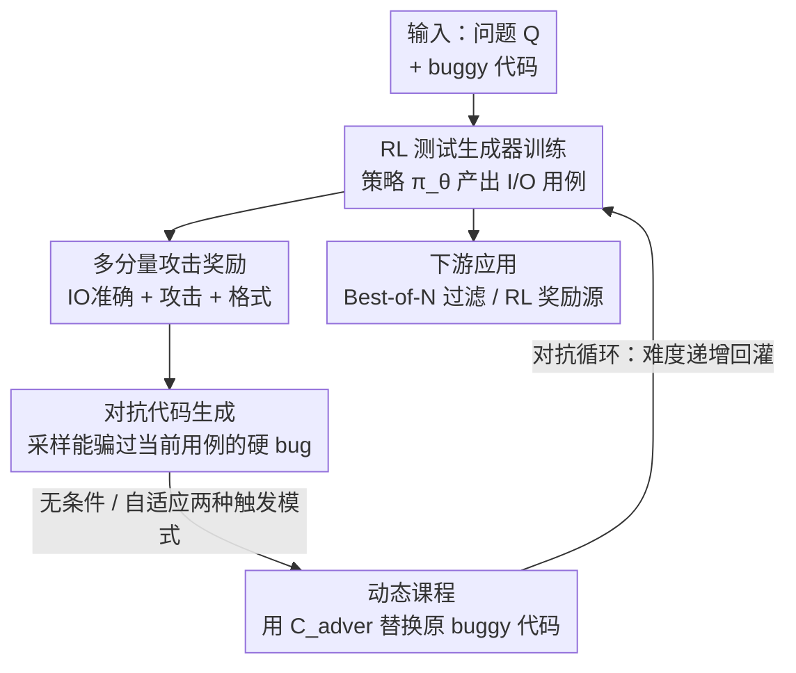

# ATGen: Adversarial Reinforcement Learning for Test Case Generation

**会议**: ICLR2026  
**OpenReview**: [https://openreview.net/forum?id=Sxj4o3qXtl](https://openreview.net/forum?id=Sxj4o3qXtl)  
**代码**: https://github.com/SIMONLQY/ATGen  
**领域**: 代码智能 / 测试用例生成  
**关键词**: 测试用例生成, 对抗强化学习, GRPO, 动态课程, 代码可靠性

## 一句话总结
ATGen 把一个"测试用例生成器"和一个"对抗代码生成器"放进一个互相博弈的强化学习循环里——生成器越强，对手就被逼着造出越隐蔽的 bug，这种自动加难的动态课程打破了静态数据集的"固定难度天花板"，让 7B 模型的攻击成功率比 SFT 方法 UTGen 翻倍（36.99% vs 16.24%）。

## 研究背景与动机
**领域现状**：LLM 写代码已经很强，但写出来的代码常含微妙 bug，要发现这些 bug 就需要高质量的测试用例。一个好的测试用例必须同时满足两个目标：一是 **Output Accuracy**（输入 $x$ 配的输出 $y$ 要正确，即 $y = C_{gold}(x)$）；二是 **Attack Success / Error-triggering**（这个用例要能让 buggy 代码失败，即 $C_{buggy}(x) \ne y$）。现有的自动测试生成主要走两条路：直接 prompt 通用大模型（GPT-4），或像 UTGen 那样在预先收集的"代码-测试"静态数据集上做监督微调（SFT）。

**现有痛点**：这两条路都死死绑在**静态数据**上。测试生成器训练时面对的 buggy 代码是一个**固定集合**——bug 的类型和难度都预先定死了。模型学会了发现这一批 bug，但碰到训练范围之外的、更新更复杂的 bug 就抓瞎。作者把这个问题命名为 **"固定难度天花板"（fixed-difficulty ceiling）**：静态训练注定让模型停在某个能力水平，随着代码生成器越来越精明，测试生成器反而越来越跟不上。

**核心矛盾**：Attack Success 这个目标本质上是**动态**的——它的难度由对面 buggy 代码 bug 的隐蔽程度决定。可静态训练偏偏用一池子固定难度的 bug 去教模型，等于让一个永远只跟同水平对手打的拳手，去打更强的对手。而且作者还发现 Output Accuracy 和"输入的攻击力"之间存在一个真实的 trade-off：越能戳中 bug 的输入往往是越刁钻的 corner case，这种 case 模型反而越难预测出正确输出。

**本文目标**：让测试生成器(1)有足够强的推理能力把"输入→正确输出"算对；(2)有持续进化的能力去戳穿越来越隐蔽的 bug，从而打破固定难度天花板。

**切入角度**：作者的关键观察是——既然天花板来自"静态 bug 集合"，那就让训练环境**自己跟着模型一起变强**。把测试生成器丢进一个对抗循环：让一个代码生成器专门造那些"能骗过当前测试生成器、但本质仍是错的"代码，作为源源不断、难度递增的动态课程。

**核心 idea**：用强化学习（GRPO）训练测试生成器直接优化 IO 准确率 + 攻击成功率，同时引入一个对抗代码生成器持续生产"刚好绕过当前策略"的硬 bug，形成自我升级的对抗课程，打破静态训练的固定难度天花板。

## 方法详解

### 整体框架
ATGen 要解决的是"如何训练一个不会被固定难度卡死的测试生成器"。整个框架由两个互相咬合的部件构成：上半部分是**基于 RL 的测试生成器训练**，把生成器建模成策略 $\pi_\theta$，输入状态 $s_t=(Q, C_{buggy})$（问题描述 + 当前 buggy 代码），输出动作 $a_t = T_{gen}=(x,y)$（一个 I/O 测试用例），用一个多分量奖励驱动它优化；下半部分是**对抗代码生成**，它像一台数据增强引擎，针对当前策略产出的测试用例，去采样新的、更难的 buggy 代码 $C_{adver}$，再把 $(Q, C_{adver})$ 替换回训练池。两部分通过一个"对抗循环"闭环：生成器变强 → 逼对手造更隐蔽的 bug → 更隐蔽的 bug 又把生成器顶上新台阶。

### 关键设计

**1. RL 测试生成器 + GRPO：把"模仿"换成"试错推理"**

静态 SFT 的本质是让模型去**模仿**数据集里的测试用例，这天然有性能上限，也限制了跨任务泛化。ATGen 改用强化学习：把测试生成形式化为一个单步 MDP——状态是 $(Q, C_{buggy})$，动作是生成的 I/O 对 $(x,y)$，策略 $\pi_\theta(a_t|s_t)$ 就是测试生成器本身。训练用 **GRPO**（Shao et al., 2024），这是一个 actor-only 方法，不需要单独的 critic 模型，省掉了一份显存和算力开销。这样模型不再是"背"测试用例，而是在 try-and-error 中学会**推理**出"输入→正确输出"的映射，并显式地在 Output Accuracy 和 Attack Success 之间寻找最优权衡。实验里光是这个非对抗版本（ATGen w/o Adver）就已经把 IO Acc 从 26.56%（Qwen2.5-7B 裸模型）拉到 71.56%，证明 RL 本身就是远比静态微调更强的范式。

**2. 多分量攻击奖励：把"既要正确又要戳中 bug"拆成可优化的信号**

一个好测试用例的两个目标本来是隐性的，ATGen 把它们显式写进奖励函数 $R_t$，由三块加权组成：

$$R_t = w_{acc}\cdot R_{acc} + w_{attack}\cdot R_{attack} + w_{format}\cdot R_{format}$$

其中 $R_{acc}$（IO Acc Reward）通过在生成输入 $x$ 上跑 gold 代码 $C_{gold}$、比对生成输出 $y$ 来判定 I/O 对是否正确；$R_{attack}$（Attack Reward）在 buggy 代码 $C_{buggy}$ 跑该用例报错或输出不一致时为正——**关键约束是它只有在 I/O 对先正确的前提下才能拿到**，这迫使模型先学会"算对答案"再去"攻击"，避免它用一个自己都算错的输入瞎蒙攻击；$R_{format}$ 借鉴 DeepSeek-R1，要求把推理过程包在 `<think>` 标签、答案包在 `<answer>` 标签里，以激活模型的思考能力。每个分量取值在 $[-0.5, 1.0]$，格式不对直接给 $-0.5$。三个权重相等。论文用一组 reward 消融（表 2）证明：单靠调奖励配比无法真正突破——不管怎么配，最终可用的 Attack Rate 都卡在 30% 左右，这正是引出对抗训练的动机。

**3. 对抗代码生成：在线造"刚好绕过你"的硬 bug**

这是打破固定难度天花板的核心。对于问题 $Q$ 和当前策略产出的用例 $T_{gen}$，ATGen 用一个**独立的代码生成器**去造一份对抗代码 $C_{adver}$，它必须同时满足两个条件：(1) 仍然是错的——在完整的人工真值测试套件 $T_{gold}$ 上至少有一个用例失败（$\exists (x',y')\in T_{gold},\ C_{adver}(x')\ne y'$），保证它确实是个 bug；(2) 能通过当前用例——$C_{adver}(x)=y$，意味着这个 bug 恰好骗过了当前测试生成器。换句话说，对手专门生产"当前模型抓不到"的 bug。生成器变强一分，对手就被逼着把 bug 藏得更深一分，自然形成难度递增的**动态课程**。

**4. 无条件 vs 自适应两种采样模式：在真实 bug 与算力之间取舍**

造 $C_{adver}$ 有两种思路。一种是直接命令代码生成器"造一个通过指定用例但全局错误"的代码——便宜，但 bug 是**人为工程出来**的，会引入分布漂移，可能把模型带偏去检测人造缺陷而非真实缺陷。ATGen 因此采用更稳健的**采样式**：只给代码生成器问题描述 $Q$，让它自然采样多份候选解，再从中**筛出**碰巧满足对抗条件的那些，保证 bug 是真实自然产生的。但每个样本都采样代价太高，于是给出两个模式：**Unconditional Mode** 对训练 batch 里**每一个**实例都重新采样 $C_{adver}$ 去替换原 $C_{buggy}$；**Adaptive Mode** 则只在"当前生成器已经能攻破原 $C_{buggy}$"时才触发采样——如果原 bug 还够难、还能骗过模型，就复用它，把算力省给真正需要的 case。实验显示最优模式跟模型规模有关：7B 用 Adaptive（聚焦式课程）攻击率最高，3B 反而用 Unconditional（持续多样的挑战）更好。

### 一个完整示例
拿一道 APPS 题目走一遍：问题 $Q$ 给定，初始 buggy 代码 $C_{buggy}$ 在某个边界输入上会出错。第一轮，测试生成器 $\pi_\theta$ 读 $(Q, C_{buggy})$，先在 `<think>` 里推理，再产出用例 $(x,y)$；系统跑 $C_{gold}(x)$ 验证 $y$ 正确（拿到 $R_{acc}$），再跑 $C_{buggy}(x)$ 发现它崩了（拿到 $R_{attack}$），GRPO 据此更新策略。接着进入对抗循环：代码生成器针对刚才那个成功用例，采样出一份新代码 $C_{adver}$——它能通过 $(x,y)$ 但在 $T_{gold}$ 里别的用例上仍失败。这份"更隐蔽"的 $C_{adver}$ 替换掉原 $C_{buggy}$ 回到训练池。下一轮，生成器面对的就是一道更难的题，必须找到更刁钻的输入才能拿到攻击奖励。如此循环，测试生成器和它的对手一起螺旋上升。

### 损失函数 / 训练策略
RL 算法用 GRPO（actor-only，无 critic）。骨干为 Qwen2.5-3B-Instruct 和 Qwen2.5-7B-Instruct，框架用 veRL。对抗代码生成器用 GPT-4o-mini。三个奖励权重 $w_{acc}, w_{attack}, w_{format}$ 相等，分析实验默认用 Adaptive 模式。关键 GRPO 超参包括每步优化的采样数（128 / 64）和 group 生成数（6 / 8），更小的每步采样数对应更"在线"的学习设置。

## 实验关键数据

### 主实验
训练/评测数据取自 APPS 与 Codeforces 的 3000 道题子集，用 GPT-4o-mini 采样 buggy 代码，得到训练集 16,822 对、测试集 911 对 (问题, buggy 代码)。按用 Qwen2.5-7B 初攻的攻击成功率把测试集均分为 Easy / Medium / Hard 三档。指标为 IO Accuracy（用例正确率）与 Attack Rate（先正确、再成功触发 bug 的比例）。

| 方法 | IO Acc(%) | Attack Rate(%) | Hard Attack(%) |
|--------|------|------|------|
| GPT-4-turbo（最强 prompt 基线） | 41.16 | 23.38 | 20.06 |
| Qwen2.5-32B-Instruct | 35.01 | 21.62 | 16.77 |
| UTGen (7B)（SFT SOTA） | 31.83 | 16.24 | 8.55 |
| **ATGen w/o Adver (7B)** | 71.56 | 34.02 | 18.42 |
| **ATGen Unconditional (7B)** | 74.97 | 34.57 | 19.73 |
| **ATGen Adaptive (7B)** | **74.42** | **36.99** | 21.05 |

最佳模型 ATGen-Adaptive (7B) 的 Attack Rate 比最强专有基线 GPT-4-turbo 相对提升近 60%，是 UTGen (7B) 的两倍多（36.99% vs 16.24%），IO Acc 更是从三十几一举拉到 74%+。在 Hard 档上优势也保持。

### 消融实验
表 2 用非对抗版本探究 reward 配比能否单独解决 accuracy-attack trade-off：

| Reward 配置 | IO Acc(%) | Attack Rate(%) | Input Attack Rate(%) |
|------|------|------|------|
| IO Acc + Input Attack | 44.67 | 30.07 | 62.56 |
| Attack Rate Only | 67.72 | 29.74 | 47.53 |
| Three Combined（完整） | 65.64 | 30.29 | 47.09 |

表 3 对比对抗 vs 非对抗在不同 GRPO 超参下的表现（节选）：

| 超参 (samples, group) | 指标 | w/o Adver | ATGen | ∆ |
|------|------|------|------|------|
| (128, 6) | IO Accuracy | 71.56 | 74.09 | +2.53 |
| (64, 6) | IO Accuracy | 73.76 | 74.96 | +1.20 |
| (64, 8) | IO Accuracy | 69.59 | 75.30 | **+5.71** |

### 关键发现
- **reward 工程治标不治本**：表 2 显示无论怎么配奖励，最终可用 Attack Rate 始终卡在 ~30%——单独奖励 Input Attack Rate 能把它冲到 62.56%，但 IO Acc 崩到 44.67%；这正是 trade-off 的真实存在，也说明必须靠对抗训练才能整体抬升前沿。
- **对抗训练带来 win-win**：表 3 里 (64, 8) 配置下，非对抗版本被迫牺牲 IO Acc，而完整 ATGen 反而拿到 +5.71% 的 IO Accuracy 绝对提升，同时 Input Attack Rate 仍有竞争力——动态课程防止模型对单一指标过拟合，学到更可泛化的策略。
- **下游 Best-of-N 过滤**：在 APPS 上做 Best-of-N，ATGen-Adaptive 在 $k_{test}=10$ 时把选中代码的 pass@1 推到 35.00%，超过 UTGen 的 30.67% 逾 4.3 个点，逼近人类专家上界 38.33%；且 $k_{test}>10$ 后曲线基本走平——RL 目标让模型学会找"单个高杀伤力用例"，不靠堆测试数量，因此非常省算力。
- **下游 RL 奖励源**：ATGen 生成的测试套件还能当代码生成器 RL 训练的奖励信号，质量高于 UTGen 和 prompt 基线，为没有现成真值测试套件的问题提供了可用代理。

## 亮点与洞察
- **"对抗课程"把静态瓶颈转成动态引擎**：最巧妙的是让训练环境自己进化——对手专造"刚好绕过你"的 bug，使难度永远贴着当前能力的上沿，这个 self-improving ecosystem 的设计可迁移到任何"判别器 vs 生成器"的能力对抗场景（如越狱检测、事实核查器训练）。
- **攻击奖励的"先正确才能攻击"约束很关键**：$R_{attack}$ 必须以 IO 对正确为前提，这一条把"瞎蒙攻击"挡在门外，是 trade-off 能被良性优化的前提，是个可复用的奖励设计 trick。
- **Input Attack Rate 这个诊断指标很有洞察**：把"输入的原始找 bug 能力"和"最终可用攻击率"拆开看，清楚揭示了 corner-case 输入难以预测正确输出的根本矛盾，让 trade-off 从感性变成可量化。
- **模式选择与模型规模耦合**：大模型吃聚焦课程（Adaptive）、小模型吃多样课程（Unconditional），这条经验对课程学习的难度调度有参考价值。

## 局限与展望
- 对抗代码生成器用的是 GPT-4o-mini 这一外部闭源模型，造 bug 的质量和分布受其能力约束，换更弱/更强的代码生成器对最终性能的影响没有充分剥离。
- 评测集中在 APPS / Codeforces 这类竞赛式算法题，bug 多是逻辑/边界类；面对真实工程代码（多文件、有外部依赖、并发等）的测试生成能否泛化未验证。
- 采样式对抗数据生成即便有 Adaptive 模式省算力，整体训练成本仍显著高于静态 SFT，论文未给出完整的算力-收益曲线。
- Best-of-N 实验显示性能在 $k_{test}>10$ 后走平，说明模型倾向产出"单个高杀伤用例"而非覆盖多样 bug 的测试套件——若下游需要全面覆盖率，这个偏好可能反而是短板。

## 相关工作与启发
- **vs UTGen (SFT SOTA)**：UTGen 用监督微调在静态 code-test 数据集上学，平衡 attack rate 与 output accuracy，但被静态数据钉死在固定难度。ATGen 改用 RL 试错 + 对抗课程，从"模仿固定 bug"变成"持续追逐进化的 bug"，攻击率翻倍。
- **vs prompt 基线（GPT-4-turbo 等）**：靠通用模型的现成推理能力 prompt 出测试，没有针对任务的专门优化，受限于其未特化的推理；ATGen 用 RL 专门把策略训到"既算对又戳中"。
- **vs 代码相关 RL（CodeRL / Repair-R1 / DeepSeek-R1）**：这些工作把 RL 用在"写对代码"或"修代码"上，学的是针对固定 verifier 写正确代码的策略；ATGen 反过来，学的是**探索输入空间去证伪一段程序**的策略，目标是产出能给任意下游 agent 用的高质量奖励信号。

## 评分
- 新颖性: ⭐⭐⭐⭐⭐ 把对抗式动态课程引入测试生成 RL，"固定难度天花板"的提法和破解角度都很犀利
- 实验充分度: ⭐⭐⭐⭐ 主结果 + reward/超参消融 + 两个下游应用（Best-of-N、RL 奖励源）相当完整，唯独缺真实工程代码场景验证
- 写作质量: ⭐⭐⭐⭐⭐ 动机推导链条清晰，trade-off 分析（Input Attack Rate）有说服力
- 价值: ⭐⭐⭐⭐⭐ 测试生成是 LLM 代码可靠性的关键瓶颈，本文给出可落地的新范式且有现成代码

<!-- RELATED:START -->

## 相关论文

- [\[ICLR 2026\] Critique-Coder: Enhancing Coder Models by Critique Reinforcement Learning](critique-coder_enhancing_coder_models_by_critique_reinforcement_learning.md)
- [\[ICLR 2026\] Agnostics: Learning to Synthesize Code in Any Programming Language with a Universal Reinforcement Learning Environment](agnostics_learning_to_synthesize_code_in_any_programming_language_with_a_univers.md)
- [\[ACL 2026\] MARS2: Scaling Multi-Agent Tree Search via Reinforcement Learning for Code Generation](../../ACL2026/code_intelligence/mars2_scaling_multi-agent_tree_search_via_reinforcement_learning_for_code_genera.md)
- [\[ACL 2026\] ChipSeek: Optimizing Verilog Generation via EDA-Integrated Reinforcement Learning](../../ACL2026/code_intelligence/chipseek_optimizing_verilog_generation_via_eda-integrated_reinforcement_learning.md)
- [\[AAAI 2026\] ReCode: Updating Code API Knowledge with Reinforcement Learning](../../AAAI2026/code_intelligence/recode_updating_code_api_knowledge_with_reinforcement_learning.md)

<!-- RELATED:END -->
