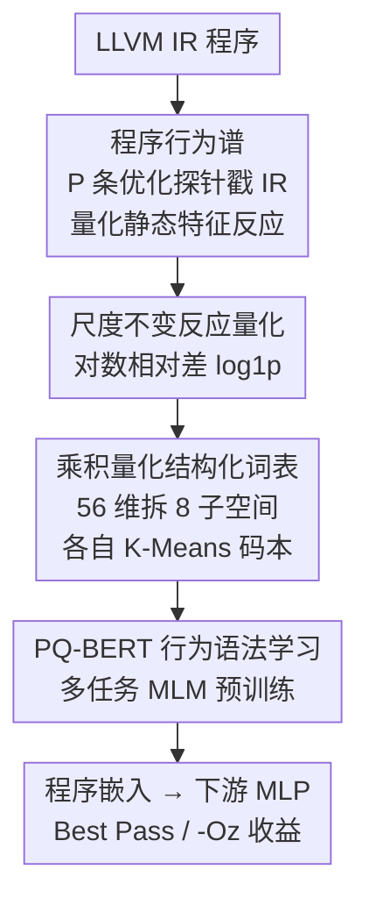

# Behavioral Embeddings of Programs: A Quasi-Dynamic Approach for Optimization Prediction

**会议**: ICLR2026  
**OpenReview**: [https://openreview.net/forum?id=QDmoLEJifR](https://openreview.net/forum?id=QDmoLEJifR)  
**代码**: https://github.com/Panhaolin2001/PREP/  
**领域**: 代码智能 / 程序表示学习 / 编译优化  
**关键词**: 程序嵌入、编译优化、准动态表示、乘积量化、预训练 Transformer

## 一句话总结
针对编译优化里"静态表示太死、动态画像太贵"的两难，本文提出**准动态**程序表示：用一组优化序列去"探针"程序的 LLVM IR，把优化前后静态特征的变化量化成 **Program Behavior Spectrum**，再用乘积量化（PQ）把连续反应向量离散成结构化"子词"、用多任务 Transformer（PQ-BERT）预训练学习其语法，在 Best Pass Prediction 和 -Oz Benefit Prediction 两项任务上大幅超过 inst2vec / IR2Vec 等静态嵌入。

## 研究背景与动机

**领域现状**：把机器学习用于编译优化，前提是先给程序学一个好的数值嵌入（embedding），让下游的"选哪条优化 pass、估优化收益"等任务有可用的语义接口。目前主流嵌入分两派——静态派从源码 / IR / AST / 控制流图里抽特征（手工的 Autophase、学习式的 IR2Vec、inst2vec、ProGraML），动态派则在程序真实运行时采集硬件性能计数器等 runtime 特征。

**现有痛点**：静态表示便宜、确定，但是"近视"——它只描述程序**长什么样**（结构），却几乎不告诉你这个程序在复杂代码变换下**会怎么变、怎么反应**。动态表示能看到真实的性能瓶颈，但运行时画像开销高、还带非确定性，大规模任务根本用不起。

**核心矛盾**：编译优化真正关心的是"这个程序对各种变换有多敏感"，而这恰好是静态表示给不出、动态表示又太贵才能给的信息。效率与洞察力之间的这道沟，卡住了学习式编译器的上限。

**本文目标**：在不付动态画像代价的前提下，造一个能反映"程序优化敏感性（optimization sensitivity）"的表示，并把这种高维连续的"敏感性谱"编码成 Transformer 能消化的形式。

**切入角度**：不直接跑程序，而是"轻量地戳一戳"——拿事先设计好的优化序列作用在 IR 上，看程序的**静态特征**被优化得发生了多大变化。变化大小本身就是程序对该类变换的反应，是一种介于纯静态与纯动态之间的"准动态"信号。

**核心 idea**：用"程序对一组优化探针的反应谱"代替"程序的静态结构"作为表示，再用乘积量化 + 多任务 Transformer 学习这套反应的"语法"。

## 方法详解

### 整体框架
整个框架要解决的是：给一段 LLVM IR，输出一个能反映其优化敏感性的程序嵌入。它把这件事拆成三个串行阶段——先**提取行为谱**（用探针戳 IR、量化反应），再**构造结构化词表**（把连续反应向量离散成 PQ 子词），最后**学习行为语法**（用 PQ-BERT 预训练，捕捉 P 个反应之间的上下文依赖）。预训练好的 Transformer 编码器就是最终的嵌入生成器，喂给下游 MLP 做 pass 预测 / 收益回归。

### 关键设计

**1. 程序行为谱：用优化探针把"程序怎么反应"变成可测的高维谱**

这一步针对静态表示"近视"的痛点：与其描述程序结构，不如直接测它对优化的反应。作者构造一组**探针（probes）**——每条探针是一段固定长度的优化序列。探针不是乱选的：先把预训练语料里每个程序用 56 维 Autophase 特征向量 $h_{orig}$ 表示（统计算术指令、基本块、分支等数量），按结构特征聚成 $P$ 个簇（假设结构相似的程序优化敏感性也相似），然后对每个簇用启发式搜索（遗传算法 / 贪心）找一条**让该簇平均指令数下降最多**的序列。这样得到 $P$ 条各自针对一类程序结构调优过的探针，既"强"（每条都经验最优）又"多样"（不同簇给出不同策略）。对任意程序 $p$，先取基线向量 $h_{orig}\in\mathbb{R}^{56}$，再依次施加每条探针 $i$ 得到优化后版本 $p'_i$ 及其特征 $h_{opt,i}$，$h_{orig}$ 与所有 $h_{opt,i}$ 的对比就构成一张丰富的行为谱。

**2. 尺度不变反应量化：用对数相对差让大小程序的反应可比**

直接用绝对特征差有个硬伤——同样减掉 100 条指令，对一个小 kernel 是天翻地覆，对百万行应用却微不足道。为此作者把反应量化成**对数相对差**而非绝对差，做到尺度不变。对第 $j$ 维特征、第 $i$ 条探针，反应值为

$$d_{i,j} = \log\bigl(1 + \max(0, h_{opt,i,j})\bigr) - \log\bigl(1 + \max(0, h_{orig,i,j})\bigr)$$

其中 $\max(0,\cdot)$ 保证对数输入非负（稳健处理特征抽取偶发的小负值），$\log(1+x)$（即 log1p）能优雅处理零值特征、压缩大幅绝对变化的影响，把注意力聚焦在"数量级层面的乘性变化"。于是程序 $p$ 的完整行为谱是一个矩阵 $S_p\in\mathbb{R}^{P\times 56}$，每行是一条尺度不变的反应向量。

**3. 乘积量化构造结构化词表：把连续反应向量拆成可复用的组合式子词**

Transformer 要吃离散 token，得把连续反应向量桥接成词表。最朴素的做法是硬聚类，给每个向量分一个簇 ID——但边界上的向量被迫二选一，丢掉"它同时像两个原型"的信息，也抓不住 56 维向量内部的细粒度结构。作者改用**乘积量化（PQ）**：把每个 $D=56$ 维反应向量拆成 $M=8$ 个互不重叠的子向量（每个 $D_{sub}=7$ 维），对每个子空间单独训一个小 K-Means 量化器 $q_i$，各自带一个含 $k^*=256$ 个低维质心的码本 $C_i$。任一反应向量按子向量独立量化：

$$c_i = q_i(d_i) = \arg\min_j \lVert d_i - c_{i,j}\rVert^2$$

最终表示是一个**组合码**——$M=8$ 个整数 ID 组成的元组 $c=(c_1,\dots,c_8)$，每个 $c_i\in\{0,\dots,255\}$，原向量可由对应质心拼接近似重建。这就像不用一张巨型调色板的单一编号、而用 R/G/B 基色组合表示颜色：只需 $8\times256$ 个学到的质心，就能表达 $256^8$ 规模的"虚拟词表"，在极小损失下保住细粒度结构信息。

**4. PQ-BERT 行为语法学习：多任务 MLM 同时预测 M 个子词、捕捉反应间的上下文依赖**

PQ 把每个程序变成 $P\times M$ 的离散码矩阵，但还没建模 $P$ 条反应**之间**的依赖（比如对 loop-unrolling 探针的强反应常和对向量化探针的反应相关）。作者设计 **PQ-BERT** 来学这套"语法"。关键在于每条反应由 $M$ 个子词共同描述，若简单把它们拼成更长序列会破坏 $M$ 个子空间的内在同步性；于是把"预测 $M$ 个子词 ID"当成**多任务学习**。架构上：每条码 $c_t$ 经 $M$ 个独立子嵌入层 $E_i$ 映射后拼成 $D_{model}=256$ 维向量 $x_t$，加位置编码后过标准多层 Transformer 编码器，输出经 $M$ 个独立线性头分别给出各子空间上 $k^*$ 个子词的分布。预训练用**多任务掩码语言模型（MLM）**：随机掩掉约 15% 的 $P\times M$ 个子词位置，损失是 $M$ 个输出头在被掩位置上交叉熵的平均之和：

$$\mathcal{L}(C) = \sum_{i=1}^{M} \frac{1}{|I_{mask,i}|} \sum_{(t,i)\in I_{mask,i}} -\log P(c_{t,i}\mid C_{masked})$$

这种多任务设置逼模型学到子空间之间的交叉关联（例如前 7 维的某种标量指令反应，常与后 7 维的某种内存行为反应共现），最终得到一个理解程序优化行为深层组合语法的编码器，其 Transformer 编码部分被取出来给下游任务生成嵌入。

### 损失函数 / 训练策略
预训练目标即上式多任务 MLM 损失，只在掩码位置计算。预训练语料是 22 万+ 个 LLVM IR 文件（竞赛编程解答，算法结构多样），训练 30 epoch、学习率 $10^{-4}$、batch size 32。下游任务里，预训练编码器输出的嵌入接一个两层 MLP（Best Pass 用 $512\to256\to124$，-Oz 回归用从 256 渐缩到 1 的更深 MLP），各方法统一在 A100 上用 Adam、学习率 $10^{-4}$、batch size 128、100 epoch 训练以保证公平。

## 实验关键数据

### 主实验
两项编译优化任务：**Best Pass Prediction**（124 类分类，预测哪条 pass 带来最大指令缩减，看 Top-1/Top-5 准确率）与 **-Oz Benefit Prediction**（回归，预测 -Oz 流水线的指令缩减比，看 MAE）。下游基准来自 CompilerGym，且与预训练语料完全不重叠（严格 out-of-domain）：uncurated 用于训练、curated（cbench/mibench 等）留作测试。

| 任务 | 指标 | 本文 Behavioral-PQ | 最强基线 inst2vec | 其它静态嵌入 |
|--------|------|------|----------|------|
| Best Pass（test） | Top-1 Acc. | **64.48%** | 39.27% | — |
| Best Pass（test） | Top-5 Acc. | **89.55%** | — | — |
| -Oz Benefit（test） | MAE↓ | **8.19%** | 16.23% | IR2Vec 25.40% / Autophase 25.92% |

Top-1 准确率比最强静态嵌入 inst2vec 高出 25 个百分点以上；回归任务上差距更悬殊，说明静态表示尚能建模"单步即时效果"，但预测"长序列交互优化"的累积收益时明显力不从心，而直接编码程序反应的行为谱给了更有效的长程预测信号。

### 消融实验
对照三个变体：去掉 PQ 直接对完整向量 K-Means（KMeans）、用绝对差代替对数相对差（No-Relative）、去掉 Transformer 直接 pool 子嵌入（No-Transformer）。

| 配置 | Best Pass Top-5（test） | -Oz MAE（test）↓ | 说明 |
|------|---------|------|------|
| Ours（Full） | 89.55% | **8.19%** | 完整模型 |
| Ours（KMeans） | 93.43% | 8.24% | 去 PQ 改硬聚类 |
| Ours（No-Relative） | **94.33%** | 10.96% | 去尺度不变量化 |
| Ours（No-Transformer） | 87.46% | 10.08% | 去 Transformer |

### 关键发现
- 在更复杂的 -Oz 回归任务上，完整模型 MAE 最低（8.19%），去掉尺度不变量化（10.96%）或 Transformer（10.08%）都明显变差——说明**尺度不变量化对泛化到复杂回归任务是关键**，**Transformer 提供的深层上下文推理对建模长程优化效果不可或缺**。
- 在 Best Pass 分类任务上，No-Relative 变体在 test 集 Top-5 反而最高（94.33%），完整模型 89.55% 略低。作者解释：对这种单步分类，绝对差 / 单体聚类捕捉的"粗粒度信号"已能提供不错的预测力，PQ + 相对差的细粒度优势更多体现在复杂回归任务上。
- 嵌入空间几何分析（RQ3）：用 k=5 的 K-NN 分类器在 Best Pass 上测，本文嵌入 Top-1 达 **79.70%**，高于次优的 InstCount（75.82%）和 IR2Vec（74.33%）等；t-SNE 也显示只有本文空间形成"同一最优 pass 的程序清晰聚簇"（如 -instcombine 最优的程序自然聚到一起），说明学到的空间语义结构与编译优化任务对齐。

## 亮点与洞察
- **"准动态"这个定位很巧**：不真跑程序，却用"优化前后静态特征的变化"逼近了"程序对变换的反应"，等于用静态分析的成本买到了部分动态画像的洞察力——这是绕开 static/dynamic 两难的关键一招。
- **探针不是随机选而是数据驱动调优**：按结构聚簇 + 启发式搜索让每条探针在一类程序上"最大化指令缩减"，保证戳出来的反应既强又有区分度，而不是噪声。
- **乘积量化用得恰到好处**：把 56 维反应拆 8 个子空间各自量化，用 $8\times256$ 个质心表达 $256^8$ 的虚拟词表，既解决了"Transformer 要离散 token"的桥接、又避免硬聚类的边界信息损失，这个"组合式子词"思路可迁移到任何需要把连续高维向量喂给序列模型的场景。
- **多任务 MLM 同步预测 M 个子词**而非拼接成长序列，保住了子空间同步性、还逼模型学子空间间关联，是把 PQ 码接进 BERT 范式的关键工程决策。

## 局限与展望
- **作者承认的局限**：① 探针多样性对某些程序类可能不够；② 推理时要对每个程序算 $P+1$ 次 Autophase 特征，带来约 0.2s/程序的预处理开销（仍比采集完整动态特征更快更稳）；③ 评估目前集中在编译优化任务，对程序分类等其它下游任务验证有限；④ 行为词表虽提供一定可解释性，但语义含义和覆盖度仍有限，可能影响表示泛化。
- **自己发现的局限**：主结果只给了 test 上少数几个数字，缺横向多基线全表；Best Pass 上完整模型反不如 No-Relative 变体，说明"细粒度 PQ + 相对差"的收益高度依赖任务类型（复杂回归才显著），并非通吃；探针构造依赖聚簇 + 启发式搜索，$P$、簇划分、搜索策略的敏感性未充分展开。
- **改进思路**：作者提出自适应探针选择、降低 Autophase 预处理成本、有限引入动态信息、扩展到更多下游任务、增强行为词表可解释性等方向。

## 相关工作与启发
- **vs Autophase / InstCount（手工静态特征）**: 它们直接数指令 / 分支 / 内存操作，简单可解释但表达力弱、跨代码库泛化差；本文不数结构而是测"结构在优化下的变化"，把同一套 Autophase 特征用作"反应探针的读数"而非终点。
- **vs inst2vec / IR2Vec（学习式静态嵌入）**: inst2vec 用 skip-gram 学 IR 局部上下文但忽略控制 / 数据流，IR2Vec 用图分析扩展；二者都仍是"描述程序是什么"。本文是"描述程序怎么反应"，在两项任务上大幅超过它们，尤其长程回归任务差距悬殊。
- **vs ProGraML（GNN 静态嵌入）**: ProGraML 把控制 / 数据 / 调用图统一成多图做消息传递、与本文在同一算法分类数据集上预训练（公平对比）；K-NN 语义结构分析里本文（79.70%）也高于 ProGraML（70.75%）。
- **vs 动态画像方法**: 动态派靠 runtime 计数器看真实瓶颈但太贵且非确定；本文是"准动态"——只用优化变换探针，不付真实执行代价，定位为静态与动态之间的折中。

## 评分
- 新颖性: ⭐⭐⭐⭐⭐ 首次提出"准动态行为谱"程序表示，用优化探针反应替代静态结构，切入角度新颖。
- 实验充分度: ⭐⭐⭐⭐ 两任务 + 多基线 + 三组消融 + 嵌入空间分析较完整，但主结果以图为主、缺横向全表，部分变体反超完整模型未深挖。
- 写作质量: ⭐⭐⭐⭐ 三阶段框架叙述清晰、公式完整，动机两难讲得透；个别段落有 OCR 噪声。
- 价值: ⭐⭐⭐⭐ 为学习式编译器提供了实用且可迁移的"准动态"表示思路，PQ + 多任务 MLM 的组合式编码对高维连续信号建模有借鉴意义。

<!-- RELATED:START -->

## 相关论文

- [\[ICLR 2026\] Sharing State Between Prompts and Programs](sharing_state_between_prompts_and_programs.md)
- [\[ICLR 2026\] Code2Bench: Scaling Source and Rigor for Dynamic Benchmark Construction](code2bench_scaling_source_and_rigor_for_dynamic_benchmark_construction.md)
- [\[ICLR 2026\] LLM-Guided Evolutionary Program Synthesis for Quasi-Monte Carlo Design](llm-guided_evolutionary_program_synthesis_for_quasi-monte_carlo_design.md)
- [\[AAAI 2026\] MoSE: Hierarchical Self-Distillation Enhances Early Layer Embeddings](../../AAAI2026/code_intelligence/mose_hierarchical_self-distillation_enhances_early_layer_embeddings.md)
- [\[ICLR 2026\] BOAD: Discovering Hierarchical Software Engineering Agents via Bandit Optimization](boad_discovering_hierarchical_software_engineering_agents_via_bandit_optimizatio.md)

<!-- RELATED:END -->
